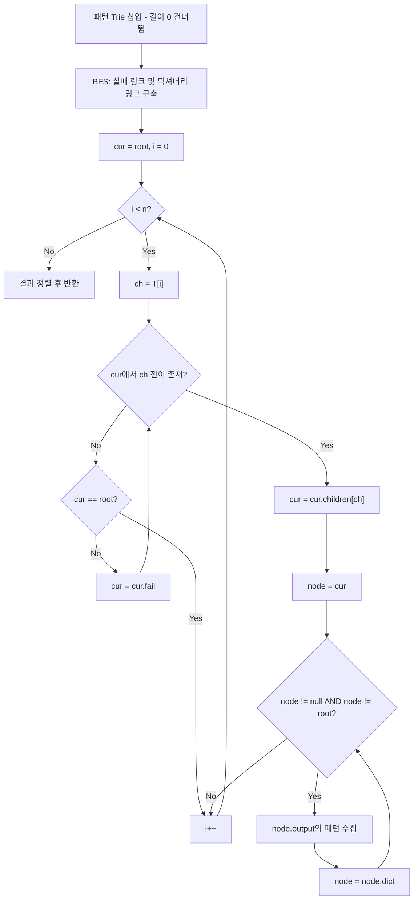

import { AlgorithmSimulation } from "#guide-sim";

# ahoCorasick — 여러 패턴을 하나의 자동화 기계로 합치면 텍스트를 한 번만 읽어도 되는 이유

## 한눈에 보는 컨셉

패턴이 수만 개여도 텍스트는 딱 한 번만 읽고 싶다는 것이 이 알고리즘의 목표예요. 모든 패턴을 하나의 Trie로 합친 뒤, 전이가 끊겨도 이미 매칭된 정보를 버리지 않는 실패 링크를 달아 두면, 텍스트를 순회하는 동안 어떤 패턴이 어디서 끝나는지 계속 추적할 수 있습니다. 결과적으로 전체 비용은 패턴 수 `k` 자체에 그대로 비례하지 않고, 텍스트 길이 `n`과 패턴 길이 합 `Σ|p_i|`(그리고 패턴 배열을 한 번 훑는 최소 비용 `O(k)`)에 비례하게 돼요.

## 출발점: 가장 순진한 방법부터

문제를 먼저 정확히 잡을게요.

```ts
function ahoCorasick(
  text: string,
  patterns: string[]
): Array<{ patternIndex: number; position: number }>
```

| 파라미터 | 의미 | 제약 |
|----------|------|------|
| `text` | 검색 대상 텍스트 $T$ | $1 \leq n = |T| \leq 10^5$, 소문자 알파벳(`a`–`z`) |
| `patterns` | 검색할 패턴 배열 $\{p_0, \ldots, p_{k-1}\}$ | $1 \leq k$, $\sum |p_i| \leq 10^5$, 소문자 알파벳(`a`–`z`) |

반환값은 `{ patternIndex: i, position: j }` 형태의 객체 배열이에요. `position` 오름차순, 동률이면 `patternIndex` 오름차순으로 정렬합니다.

| 엣지케이스 | 동작 |
|--------|------|
| 길이 0인 패턴 포함 | 해당 패턴은 매칭 결과에 포함하지 않음 |
| 동일한 패턴이 여러 인덱스로 전달 | 각각 별도의 `patternIndex`로 독립 보고 |
| 패턴이 텍스트 끝부분에 등장 | `position = n - |p_i|` 정상 반환 |
| 패턴들이 서로 접두사-접미사 관계(`"a"`, `"aa"`) | 같은 텍스트 인덱스(종료 위치)에서 동시에 종료 — `position`(시작 위치)은 패턴마다 다를 수 있음 |

패턴 하나만 찾는 문제라면 이미 최적 해법이 있습니다 — KMP(Knuth-Morris-Pratt)예요. KMP는 패턴 하나를 텍스트 안에서 `O(n + |p|)`에 찾아내죠. 그러니 가장 정직한 출발점은 "패턴마다 KMP를 독립적으로 돌리고 결과를 합치자"입니다.

```text
패턴 k개, 각각 KMP 적용
비용: 패턴당 O(n + |p_i|)  ×  k개  =  O(k·n + Σ|p_i|)

k = 10^5, n = 10^5 이면  k·n = 10^10   →  일반적인 연산 속도에서는 1초 안에 사실상 불가능
```

코드로 그대로 옮기면 이렇습니다.

```ts
function kmpFailureFunction(p: string): number[] {
  const pi = new Array<number>(p.length).fill(0);
  let k = 0;
  for (let i = 1; i < p.length; i++) {
    while (k > 0 && p[k] !== p[i]) k = pi[k - 1]!;
    if (p[k] === p[i]) k++;
    pi[i] = k;
  }
  return pi;
}

function kmpSearch(text: string, pattern: string): number[] {
  if (pattern.length === 0) return [];
  const pi = kmpFailureFunction(pattern);
  const positions: number[] = [];
  let k = 0;
  for (let i = 0; i < text.length; i++) {
    while (k > 0 && pattern[k] !== text[i]) k = pi[k - 1]!;
    if (pattern[k] === text[i]) k++;
    if (k === pattern.length) {
      positions.push(i - pattern.length + 1);
      k = pi[k - 1]!; // 겹치는 매칭도 계속 찾기 위해 완전히 리셋하지 않음
    }
  }
  return positions;
}

function ahoCorasickNaivePerPatternKmp(
  text: string,
  patterns: string[]
): Array<{ patternIndex: number; position: number }> {
  const result: Array<{ patternIndex: number; position: number }> = [];
  for (let i = 0; i < patterns.length; i++) {
    for (const pos of kmpSearch(text, patterns[i]!)) {
      result.push({ patternIndex: i, position: pos });
    }
  }
  result.sort((a, b) => a.position - b.position || a.patternIndex - b.patternIndex);
  return result;
}
```

왜 이게 느린가: 패턴마다 텍스트를 처음부터 끝까지 다시 순회합니다. 텍스트를 읽는 행위 자체가 `k`번 반복되는 것이 낭비의 본질이에요. 텍스트를 딱 한 번만 읽으면서 모든 패턴을 동시에 매칭할 수는 없을까요? 이것이 이번 알고리즘의 출발 단서입니다.

## 아이디어 자세히 들여다보기

### 모든 패턴을 Trie로 합치고 실패 링크 달기 — 수식과 그림

먼저 모든 패턴이 공유하는 접두사를 한 번만 저장하는 자료구조가 필요합니다. `"he"`, `"she"`, `"hers"` 세 패턴을 하나의 Trie로 합치면 이렇게 생겨요(`*`는 해당 노드에서 끝나는 패턴이 있다는 표시입니다).

```text
root
 ├─h→ (h) ─e→ (he)* ─r→ (her) ─s→ (hers)*
 └─s→ (s) ─h→ (sh) ─e→ (she)*
```

텍스트를 한 글자씩 읽으며 이 Trie 위에서 상태(현재 있는 노드)를 옮겨 가면 되는데, 문제는 전이가 끊길 때예요. 예를 들어 `"she"`까지 읽은 상태에서 다음 글자가 `'r'`이면 `she` 노드에는 `'r'` 자식이 없습니다. 이때 무조건 `root`로 돌아가면 `"he"`라는 진접미사가 앞으로 `'r'`, `'s'`로 이어져 `"hers"`까지 연장될 수 있는 활성 상태라는 정보를 그냥 버리는 셈이에요 — 참고로 `"he"` 자체는 이미 이 시점(`"she"`를 다 읽은 순간)에 매칭 결과로 보고돼 있어요. 실패 링크가 지켜 주는 건 "과거에 보고했던 출력 기록"이 아니라 "앞으로 더 연장될 수 있는 진행 중인 접미사 상태"입니다. 그래서 각 노드에 **실패 링크**를 답니다.

노드 $v$가 Trie 루트에서 문자열 $w$를 따라 도달하는 노드라면,

$$\text{fail}(v) = \text{Trie 안에서 } w \text{의 진접미사(proper suffix) 중, 어떤 패턴의 접두사와 일치하는 가장 긴 것의 끝 노드}$$

정의가 왜 하필 "가장 긴" 진접미사여야 할까요? 더 짧은 진접미사로 이동하면 실제로는 매칭이 이어질 수 있는 패턴을 놓치게 됩니다. 예를 들어 `she`의 실패 링크를 `s`가 아니라(더 짧은 접미사) `he`(더 긴 접미사)로 잡아야, 다음 글자 `'r'`이 왔을 때 `her` → `hers`로 이어지는 매칭을 놓치지 않아요.

잠깐, 확인 하나만 해 볼까요? `"she"`까지 읽었는데 다음 글자가 `'r'`이 아니라면, 실패 링크를 따라가면 어디로 갈까요? 정답은 `"he"` 노드입니다 — `she`의 진접미사 중 Trie 안에 있는 가장 긴 것이 `"he"`이기 때문이에요.

한 텍스트 위치에서 여러 패턴이 동시에 끝날 수도 있습니다(`"she"`를 다 읽은 순간 `"he"`도 동시에 끝나 있는 것처럼요). 그래서 실패 링크 체인을 따라 올라가며 output이 있는 첫 번째 노드를 가리키는 **딕셔너리 링크**도 함께 둡니다.

$$\text{dict}(v) = \text{fail}(v) \text{에서 시작해 실패 링크를 거슬러 올라가는 경로 중, output이 있는 첫 번째 노드}$$

### 단서를 설명해 주는 이론 — KMP 실패 함수의 일반화

방금 정의한 실패 링크는 갑자기 튀어나온 개념이 아니에요. 단일 패턴을 찾는 KMP에서 쓰는 실패 함수 $\pi(i)$를 기억해 볼게요.

$$\pi(i) = \text{패턴 } p[0..i] \text{의 진접두사이면서 동시에 진접미사인 문자열 중 가장 긴 것의 길이}$$

KMP는 텍스트를 훑다가 패턴과 불일치가 나면, $\pi$를 이용해 "지금까지 매칭된 부분의 접미사 중 패턴의 접두사와 일치하는 가장 긴 것"으로 되감아 이어 갑니다. 텍스트 포인터는 절대 후퇴하지 않고, 패턴 포인터만 $\pi$를 따라 되감기 때문에 전체가 `O(n + |p|)`로 끝나는 거예요.

Aho-Corasick의 실패 링크 $\text{fail}(v)$는 정확히 같은 발상을 **패턴 하나에서 패턴 여러 개(Trie 전체)로 일반화**한 것입니다. KMP의 $\pi$가 "패턴 자기 자신과 비교해 되감을 위치"를 찾는다면, $\text{fail}(v)$는 "Trie 안 어떤 패턴의 접두사와 비교해도 되는 되감을 위치"를 찾아요. 비교 대상이 패턴 하나에서 패턴 집합 전체로 넓어졌을 뿐, "텍스트 포인터는 후퇴하지 않는다"는 핵심 성질은 그대로 이어받습니다. 이 일반화는 뒤에서 최적화를 다룰 때 한 번 더 등장하니 기억해 두세요 — KMP의 실패 함수도 사실 전이표(다음 상태를 미리 계산한 DFA) 형태로 완전히 펼쳐 둘 수 있는데, Aho-Corasick의 goto 최적화가 바로 그 아이디어를 Trie 전체로 확장한 것입니다.

### 셈을 맡는 자료구조 — Trie

여기서 Trie는 "여러 패턴의 공통 접두사를 노드 하나로 압축해서 저장하는 트리"라는 역할만 하면 충분합니다. 각 노드는 문자별 자식을 가리키는 포인터(또는 맵)와, 그 노드에서 끝나는 패턴 목록(`output`), 그리고 위에서 정의한 실패/딕셔너리 링크를 들고 있어요. Trie 자체의 삽입·탐색 원리가 궁금하다면 이 프로젝트의 [trie 가이드](../../../data-structures/trie/trie/trie-guide.mdx)를 참고하세요 — 여기서는 "문자열 집합을 공유 접두사로 압축해 저장하는 자료구조"로만 쓰면 됩니다.

### 왜 모순 없이 작동하는가

이 알고리즘이 매 순간 지키는 불변식은 하나입니다.

> 텍스트 $T[0 \ldots i]$를 처리한 후 `cur`는 "$T[0 \ldots i]$의 접미사 중, Trie 안 어떤 패턴의 접두사와 일치하는 가장 긴 것의 끝 노드"이다.

**기저**: $i = -1$(아직 아무 글자도 읽지 않음)일 때 `cur = root`이고, 빈 문자열은 모든 문자열의 접미사이자 모든 패턴의 접두사이므로 불변식이 자명하게 성립합니다.

**귀납 단계**: `cur`가 $T[0..i-1]$에 대해 불변식을 만족한다고 가정하고, 글자 $T[i]$를 처리할 때 일어날 수 있는 경우를 전부 나열해 볼게요.

- **경우 1: `cur`에서 $T[i]$로 가는 직접 전이가 있다.** 그 자식으로 이동하면 "이전 최장 매칭 + 새 글자"가 새 후보가 되는데, 이게 정말 최장인지 반례로 확인해 볼게요. 만약 $T[0..i]$에 이보다 더 긴 접미사 매칭 $s$가 따로 있다고 가정하면, $s$의 마지막 문자를 떼어 낸 $s' = s[0 \ldots |s|-2]$는 $T[0..i-1]$의 접미사이면서 여전히 같은 패턴의 접두사(Trie 안의 노드)이고, 길이는 이전 최장 매칭보다 깁니다. 그런데 그건 "이전 최장 매칭이 $T[0..i-1]$에서 가장 길었다"는 귀납 가정과 정면으로 모순돼요. 그러니 그런 $s$는 존재할 수 없고, "이전 최장 + 새 글자"가 그대로 최장 매칭입니다.
- **경우 2: `cur`에서 $T[i]$로 가는 직접 전이가 없다.** 이때만 실패 링크를 따라가는데, $\text{fail}(\text{cur})$의 정의 자체가 "$T[0..i-1]$의 진접미사 중 Trie 안에 있는 차선의 최장 매칭"이므로, 그 노드에서 다시 $T[i]$로의 전이를 시도하는 것이 다음으로 긴 후보를 정확히 시험하는 것과 같습니다. 이 재시도는 결국 `root`에서 멈추므로(루트는 항상 자기 자신을 전이 실패의 종착점으로 가짐) 무한히 반복되지 않습니다.

이 두 경우가 전부입니다 — "직접 전이가 있다/없다" 외의 제3의 상황은 없으므로 경우의 나열이 완전해요.

**실패 링크 이동이 왜 총 `O(n)`(상각)인가**도 "텍스트 포인터가 후퇴하지 않으니까"보다 조금 더 엄밀하게 봐야 해요. `cur`가 Trie 루트로부터 떨어진 깊이를 잠재 함수 $\Phi$라고 둘게요. 경우 1(직접 전이)은 $\Phi$를 정확히 1 증가시키고, 경우 2에서 실패 링크를 한 번 타는 것은 $\Phi$를 최소 1 감소시킵니다(`fail(v)`는 정의상 항상 `v`보다 엄밀히 얕은 노드로 가니까요). 텍스트를 읽는 동안 $\Phi$가 늘어날 수 있는 총량은 직접 전이가 일어난 횟수만큼이고 이는 많아야 $n$번(텍스트 길이)이며, $\Phi$는 음수가 될 수 없으니 총 감소량(=총 실패 링크 이동 횟수)도 총 증가량 $O(n)$을 넘어설 수 없어요. 그래서 실패 링크 이동은 텍스트 전체에서 최대 `O(n)`번만 일어나고, 이것이 매칭 단계가 `O(n)`(상각)에 끝나는 근거예요.

지금까지는 `fail(v)`가 이미 올바르게 계산돼 있다고 가정하고 검색만 살펴봤어요. `buildFailLinks`가 실제로 그 `fail(v)`를 정확히 계산하는지도 같은 방식(기저 → 귀납)으로 확인해 볼게요.

**기저**: 깊이 1 노드(루트의 직접 자식)는 `fail = root`로 바로 정의됩니다. 길이 1 문자열의 진접미사는 빈 문자열뿐이고, 빈 문자열의 끝 노드는 항상 `root`이므로 정확해요.

**귀납 단계**: 노드 `v`의 `fail(v)`가 정확하다고 가정하고, `v`의 자식 하나(문자 `c`로 연결)의 fail을 계산합니다. 이 자식이 나타내는 문자열의 진접미사 후보는 `fail(v)`, `fail(fail(v))`, `fail(fail(fail(v)))`, … 각각에 `c`를 붙인 문자열들이고, 뒤로 갈수록 짧아져요. `buildFailLinks`의 while문(`while (f !== root && !f.children.has(ch)) f = f.fail!`)은 정확히 이 순서로 후보를 훑으면서 `c`로 가는 전이가 있는 첫 번째 후보를 채택하므로, 채택된 후보가 가장 긴 후보입니다. 후보가 하나도 없으면(while이 `root`까지 도달했는데 `root`에도 전이가 없으면) fail은 `root`가 됩니다. 이 논증이 성립하려면 while문이 `f.fail`을 따라갈 때마다 그 값이 이미 정확히 계산돼 있어야 하는데, `f`는 매 hop마다 깊이가 반드시 줄어들고, `buildFailLinks`가 너비 우선으로 돌기 때문에 더 얕은 깊이의 모든 노드가 현재 깊이의 노드보다 먼저 큐에서 빠져나가 이미 `fail`이 확정된 상태입니다. 그래서 귀납 가정이 실제로 유지돼요.

마지막으로, 한 위치에서 끝나는 패턴을 dict 체인이 빠짐없이·중복 없이 모으는지도 봐야 합니다. `cur`의 fail 조상들(`cur`, `fail(cur)`, `fail(fail(cur))`, …, `root`까지)은 전부 $T[0..i]$의 서로 다른 길이의 접미사이고, 그중 output이 있는 노드는 정확히 "지금 이 위치에서 끝나는 패턴"들이에요(접미사가 아닌 문자열은 애초에 output을 가질 수 없으니까요). `dict(v)`는 이 fail 조상 체인에서 output이 있는 첫 노드를 가리키고, 그 노드의 `dict`는 다시 그다음 output 노드를 가리키도록 정의했으므로, `dict` 체인을 끝까지 따라가면 fail 조상 체인 전체에서 output이 있는 노드를 깊은 것부터 얕은 것 순서로 정확히 한 번씩 방문하게 됩니다. 그러니 매 위치에서 dict 체인을 끝까지 도는 것으로 그 위치에서 끝나는 모든 패턴을 놓치지도, 중복 보고하지도 않아요.

여기서 **헷갈리기 쉬운 포인트**는 "현재 노드의 output만 보면 되는 것 아닌가?"라는 생각입니다. 실제로 딕셔너리 링크 체인을 타지 않고 현재 노드의 output만 확인하도록 바꿔서 `text = "ushers"`, `patterns = ["he", "she", "hers"]`에 돌려 보면, 결과가 `[{patternIndex:1,position:1}, {patternIndex:2,position:2}]`로 나옵니다 — 정상 결과 `[{1,1},{0,2},{2,2}]`에서 `{patternIndex:0, position:2}`(`"he"`가 위치 2에서 끝나는 매칭)가 통째로 빠집니다. `i=3`에서 `cur`가 `she` 노드에 있을 때, `she`의 output에는 `"she"`만 있고 `"he"`는 없기 때문이에요. `"he"`는 `dict(she) = he` 노드를 타야만 발견됩니다.

엣지 케이스도 불변식 위에서 점검해 둘게요.

```text
길이 0 패턴 포함        → Trie 삽입 단계에서 건너뜀 (루트에 output이 붙지 않도록 방지)
동일 패턴 중복 인덱스    → 같은 노드의 output 배열에 서로 다른 patternIndex로 각각 push
"a"/"aa" 같은 접두-접미  → "aa"의 두 번째 a에서 dict 체인이 "a" 노드까지 이어져 둘 다 보고
텍스트보다 긴 패턴       → 매칭 자체가 발생하지 않으므로 결과에 포함되지 않음
```

## 아이디어를 코드로 옮기기

```ts
type AhoNode = {
  children: Map<string, AhoNode>;
  fail: AhoNode | null;
  dict: AhoNode | null;
  output: Array<{ patternIndex: number; len: number }>;
};

function makeNode(): AhoNode {
  return { children: new Map(), fail: null, dict: null, output: [] };
}

function buildTrie(patterns: string[]): AhoNode {
  const root = makeNode();
  for (let i = 0; i < patterns.length; i++) {
    const p = patterns[i]!;
    if (p.length === 0) continue; // 길이 0 패턴은 건너뜀
    let cur = root;
    for (const ch of p) {
      if (!cur.children.has(ch)) cur.children.set(ch, makeNode());
      cur = cur.children.get(ch)!;
    }
    cur.output.push({ patternIndex: i, len: p.length });
  }
  return root;
}

function buildFailLinks(root: AhoNode): void {
  const queue: AhoNode[] = [];
  root.fail = root;
  for (const child of root.children.values()) {
    child.fail = root;
    child.dict = null;
    queue.push(child);
  }
  while (queue.length > 0) {
    const v = queue.shift()!;
    for (const [ch, child] of v.children) {
      let f = v.fail!;
      while (f !== root && !f.children.has(ch)) f = f.fail!;
      const cand = f.children.get(ch);
      child.fail = cand && cand !== child ? cand : root;
      child.dict = child.fail.output.length > 0 ? child.fail : child.fail.dict;
      queue.push(child);
    }
  }
}

function ahoCorasickBasic(
  text: string,
  patterns: string[]
): Array<{ patternIndex: number; position: number }> {
  const root = buildTrie(patterns);
  buildFailLinks(root);

  const result: Array<{ patternIndex: number; position: number }> = [];
  let cur = root;
  for (let i = 0; i < text.length; i++) {
    const ch = text[i]!;
    while (cur !== root && !cur.children.has(ch)) cur = cur.fail!;
    if (cur.children.has(ch)) cur = cur.children.get(ch)!;

    let node: AhoNode | null = cur;
    while (node && node !== root) {
      for (const { patternIndex, len } of node.output) {
        result.push({ patternIndex, position: i - len + 1 });
      }
      node = node.dict;
    }
  }
  result.sort((a, b) => a.position - b.position || a.patternIndex - b.patternIndex);
  return result;
}
```

가장 중요한 부분은 `buildFailLinks`가 **너비 우선(BFS) 순서**로 도는 것과, 검색 루프 안의 두 while문입니다. 너비 우선이어야 하는 이유는 "부모의 fail이 자식보다 먼저 계산된다"는 정도로는 부족해요 — 그 정도라면 부모를 먼저 방문하는 순회(깊이 우선 포함)는 다 만족합니다. 진짜 이유는 `while (f !== root && !f.children.has(ch)) f = f.fail!` 이 `fail` 체인을 여러 번 hop할 수 있다는 데 있어요. 이 hop이 도달하는 노드는 완전히 다른 서브트리에 있을 수도 있는데, 그 노드가 아직 방문 전이라 자신의 `fail`을 확정 짓지 못했다면(`fail`이 초기값 `null` 그대로라면) 다음 hop이 `null`을 참조하며 그대로 깨집니다. 예를 들어 `patterns = ["ab", "abax", "bab"]`에서 `'a'` 가지를 깊이 우선으로 끝까지 파고든 뒤에야 `'b'` 가지를 방문하도록 순서를 바꾸면, `"aba"` 노드의 fail 체인이 아직 방문 전인 `'b'` 가지의 깊이-2 노드(`"ba"`)로 hop했다가 그 노드의 `fail`이 `null`이라 다음 hop에서 그대로 터집니다(실제로 이 조합으로 실행하면 `null is not an object` 런타임 에러가 발생해요). 너비 우선 순회는 "현재 노드보다 얕은 깊이의 모든 노드가 이미 자신의 `fail`을 확정 지은 상태"를 보장해서 이 문제를 원천 차단합니다 — 정확히 필요한 조건은 "얕은 깊이 순서로 처리"이고, 너비 우선이 이를 가장 간단하게 보장하는 방법이에요. 검색 루프의 첫 번째 while(`cur = cur.fail!`)은 전이가 끊길 때만 도는 재시도이고, 두 번째 while(`node = node.dict`)은 한 위치에서 겹쳐 끝나는 모든 패턴을 놓치지 않고 모으는 부분입니다. 그 외에 놓치기 쉬운 지점:

- `child.dict = child.fail.output.length > 0 ? child.fail : child.fail.dict` — 딕셔너리 링크를 이 순서(먼저 `fail` 자신의 output을 보고, 없으면 `fail.dict`를 상속)로 잇지 않으면 체인이 끊깁니다.
- `result.push`에서 `position`은 `i - len + 1`입니다. 패턴이 `i`번째 글자에서 끝났으므로 시작 위치는 그만큼 뒤로 물러나야 해요.

## 더 빠르게 만들 단서 찾기

기본 구현을 다시 들여다보면, 검색 루프의 첫 번째 while문이 실행될 때마다 `cur.children.has(ch)`라는 Map 조회가 한 번씩 일어납니다. 상각 분석으로는 전체 실패 링크 이동 횟수가 `O(n)`으로 묶여 있다고 했지만, 이건 "총합"이 그렇다는 것이지 "매 글자마다 정확히 1회"라는 뜻은 아니에요. 예를 들어 `"she"` 상태에서 `'r'`이 오면 실패 링크를 한 번 타고서야(`he`로 이동) 전이가 성립합니다.

```text
Before (fail 체이싱):  she --'r' 조회 실패--> fail(she)=he --'r' 조회 성공--> her
                       (한 글자 처리에 Map 조회가 2번)

After  (goto 전이표):  she --'r'--> her
                       (한 글자 처리에 배열 조회가 항상 1번)
```

"매 상태, 매 문자에 대해 다음 상태를 미리 계산해 표에 적어 둘 수는 없을까?" 이것이 이번 단서입니다. 그리고 이건 앞서 예고했던 일반화의 연장선이에요 — KMP의 실패 함수를 완전한 전이표(DFA)로 펼쳐 두는 것과 똑같은 발상을, Trie 전체로 확장하는 것입니다.

## 단서를 최적화로 연결하기

모든 노드 $v$와 알파벳의 모든 문자 $c$에 대해 "$v$에서 $c$를 읽으면 어디로 가는가"를 미리 계산해 두는 것이 **goto 전이표**입니다. 문자 집합이 소문자 26개로 고정돼 있으므로(제약 조건), 노드마다 크기 26짜리 배열 하나면 충분해요.

$$\text{goto}(v, c) = \begin{cases} \text{child} & \text{if } v \text{에 문자 } c \text{로 가는 자식이 있음} \\ \text{goto}(\text{fail}(v), c) & \text{otherwise} \end{cases}$$

이 식에는 기저(base case)가 하나 숨어 있어요 — $v = \text{root}$일 때입니다. `fail(root) = root`이므로 두 번째 줄을 그대로 적용하면 `goto(root, c) = goto(root, c)`가 되어 순환 정의가 됩니다. 그래서 `root`는 예외로 따로 둡니다: `root`에 문자 `c`로 가는 자식이 있으면 그 자식, 없으면 `goto(root, c) = root` 자기 자신으로 정의해요(전이가 없을 때 "그냥 그 자리에 머문다"는 뜻). 이 기저가 있어야 재귀가 실제로 끝까지 풀립니다.

두 번째 줄(자식이 없는 경우)이 핵심입니다. `fail(v)`는 BFS 순서상 `v`보다 먼저 처리되므로, `goto(fail(v), c)`는 이미 계산이 끝난 값이에요. 이 값을 그대로 물려받으면 검색 시점에는 fail 체인을 따라갈 필요 없이 배열 인덱스 한 번으로 끝납니다.

```text
Before: 상태마다 "정의된 자식"만 알고 있음 → 없는 문자가 오면 fail을 따라 재조회
After:  상태마다 "26개 문자 전부"에 대한 답을 들고 있음 → 항상 O(1) 조회

불변식: 모든 (v, c) 쌍에 대해 goto(v, c)가 정의되어 있다 (완전 함수)
```

## 최적화 코드

Trie를 배열 기반 노드(인덱스로 참조)로 바꾸고, BFS로 goto 표를 채웁니다.

```ts
const ALPHA = 26;
const code = (ch: string) => ch.charCodeAt(0) - 97;

type GotoNode = {
  goto: Int32Array; // goto[c] = 다음 노드 id (모든 c에 대해 항상 정의됨)
  output: Array<{ patternIndex: number; len: number }>;
  dictId: number; // -1 = 없음
};

function buildAutomaton(patterns: string[]): GotoNode[] {
  type RawNode = { children: (number | null)[]; output: Array<{ patternIndex: number; len: number }> };
  const raw: RawNode[] = [{ children: new Array(ALPHA).fill(null), output: [] }];

  for (let i = 0; i < patterns.length; i++) {
    const p = patterns[i]!;
    if (p.length === 0) continue;
    let cur = 0;
    for (const ch of p) {
      const c = code(ch);
      if (raw[cur]!.children[c] === null) {
        raw.push({ children: new Array(ALPHA).fill(null), output: [] });
        raw[cur]!.children[c] = raw.length - 1;
      }
      cur = raw[cur]!.children[c] as number;
    }
    raw[cur]!.output.push({ patternIndex: i, len: p.length });
  }

  const nodes: GotoNode[] = raw.map((r) => ({
    goto: new Int32Array(ALPHA).fill(-1),
    output: r.output.slice(),
    dictId: -1,
  }));
  const fail = new Int32Array(raw.length).fill(0);

  const queue: number[] = [];
  for (let c = 0; c < ALPHA; c++) {
    const child = raw[0]!.children[c];
    if (child !== null) {
      nodes[0]!.goto[c] = child;
      fail[child] = 0;
      queue.push(child);
    } else {
      nodes[0]!.goto[c] = 0; // 루트에서 전이 없으면 루트 자기 자신
    }
  }

  let qi = 0;
  while (qi < queue.length) {
    const v = queue[qi++]!;
    for (let c = 0; c < ALPHA; c++) {
      const child = raw[v]!.children[c];
      if (child !== null) {
        const f = fail[v]!;
        fail[child] = nodes[f]!.goto[c];
        nodes[child]!.dictId = nodes[fail[child]!]!.output.length > 0 ? fail[child]! : nodes[fail[child]!]!.dictId;
        nodes[v]!.goto[c] = child;
        queue.push(child);
      } else {
        nodes[v]!.goto[c] = nodes[fail[v]!]!.goto[c]; // fail의 goto를 그대로 물려받음
      }
    }
  }
  return nodes;
}

function ahoCorasickOptimized(
  text: string,
  patterns: string[]
): Array<{ patternIndex: number; position: number }> {
  const nodes = buildAutomaton(patterns);
  const result: Array<{ patternIndex: number; position: number }> = [];
  let cur = 0;
  for (let i = 0; i < text.length; i++) {
    const c = code(text[i]!);
    cur = nodes[cur]!.goto[c]; // 항상 O(1) — fail 체이싱 없음

    let id = cur;
    while (id !== -1 && id !== 0) {
      for (const { patternIndex, len } of nodes[id]!.output) {
        result.push({ patternIndex, position: i - len + 1 });
      }
      id = nodes[id]!.dictId;
    }
  }
  result.sort((a, b) => a.position - b.position || a.patternIndex - b.patternIndex);
  return result;
}
```

**가장 중요한 줄은 `nodes[v]!.goto[c] = nodes[fail[v]!]!.goto[c];`입니다.** 이 줄이 goto 전이표를 "완전한 함수"로 만드는 전부예요. 이 줄을 빼먹고 자식이 없는 칸을 그냥 `0`(root)으로 방치하면 어떻게 될까요? 실제로 그렇게 만들어서 `text = "ushers"`, `patterns = ["he", "she", "hers"]`에 돌려 보면 결과가 `[{patternIndex:1,position:1}, {patternIndex:0,position:2}]`로 나옵니다 — 정상 결과 `[{1,1},{0,2},{2,2}]`에서 `hers@2`가 사라져요. `she` 상태에서 `'r'`이 왔을 때 `her`로 가야 하는데, 전파를 빼먹은 탓에 그냥 `root`로 떨어져 버려서 이후 `'s'`가 와도 `hers`를 완성하지 못하는 것입니다.

> goto 전이표는 "실패 링크를 따라가는 대신, 모든 상태·모든 문자에 대해 답을 미리 적어 둔 표"입니다.

이 시점에서 텍스트 순회는 한 글자당 배열 인덱스 조회 1회(상수 시간)이고, 매칭 결과 수집(정렬 전)은 실제 매칭 개수 $z$에 비례합니다. 다만 함수가 반환하는 배열은 `position` 오름차순·동률이면 `patternIndex` 오름차순으로 정렬돼 있어야 하므로, 마지막의 `result.sort(...)`가 `O(z \log z)`를 더합니다 — 그러니 검색과 정렬을 합친 실제 비용은 `O(n + z \log z)`이고, "정렬까지 포함한 전체 함수"가 상수 배수 안에서 붙는 하한은 $\Omega(n + z)$가 아니라 그보다 살짝 위입니다(정렬 없이 찾은 순서 그대로 반환해도 됐다면 $\Omega(n + z)$에 정확히 도달했을 거예요). 텍스트를 최소 한 번은 읽어야 하고 발견한 매칭을 전부 보고해야 하므로 검색 자체는 $\Omega(n + z)$보다 빠를 수 없고, 구축도 패턴 배열 전체(길이 0인 패턴까지 포함해 `k`개를 확인해야 하니까요)와 패턴 문자 전체를 최소 한 번은 읽어야 하므로 $\Omega(k + \Sigma|p_i|)$보다 빠를 수 없어요. 지금 구현은 구축 `O(k + \Sigma|p_i| \cdot 26)`(상태 수를 $S \le 1 + \Sigma|p_i|$라 하면 $26S$짜리 goto 테이블이 지배적), 검색 `O(n + z)`, 반환 정렬 `O(z \log z)`로 이 하한들에 상수 배수 안에서 도달했으므로 여기서 최적화를 마칩니다.

공간도 함께 짚어 둘게요. 완성된 자동자는 goto 테이블에 `O(26S)`, 패턴 output에 `O(k)`, fail/dict 링크에 `O(S)`, 반환 결과에 `O(z)`를 쓰고, 구축 과정에서는 원시 Trie(`raw`)와 배열형 노드(`nodes`)를 동시에 들고 있어서 일시적으로 `O(26S)` 공간을 두 벌 씁니다. (참고로 기본 구현의 `O(n+z)`는 JavaScript `Map` 연산이 기대 `O(1)`이라는 통상적 가정 위에서의 분석이에요.) 이 goto 배열 최적화는 알파벳이 26자로 고정돼 있다는 제약 덕분에 가능한 것이고, 문자 집합이 유니코드 전체처럼 커지면 노드마다 26칸짜리(혹은 그 이상) 완전 배열을 미리 채우는 방식 자체가 공간을 감당하지 못하게 돼요 — 그때는 기본 구현처럼 노드마다 실제로 쓰이는 전이만 `Map`으로 들고 fail 링크로 나머지를 처리하는 희소 구조로 돌아가거나, 실제로 요청된 (상태, 문자) 쌍만 그때그때 계산해 캐싱하는 지연 방식이 현실적입니다. 더 특화된 해법(예: 접미사 자동자, 일반화 접미사 트리)이 비슷한 점근 복잡도를 낼 수도 있지만, Aho-Corasick의 가치는 구현이 상대적으로 단순하고 텍스트를 스트리밍으로(끝까지 미리 갖고 있지 않아도) 처리할 수 있다는 범용성에 있습니다.

## 실행 시각화

고정 입력 `patterns = ["he", "she", "hers"]`(인덱스 0,1,2), `text = "ushers"`에 대해 Aho-Corasick을 실행하는 과정입니다. tree 패널은 패턴들을 합친 Trie이며, 노드 라벨은 엣지 문자예요. 상태색은 `active`(현재 상태 노드), `visited`(패턴이 끝나는 output 노드)를 뜻합니다. keyValue 패널은 현재 텍스트 위치 `i`/문자, 실패 링크 이동, 누적 매칭 결과를 보여줘요. 실제 반환값(`position` 오름차순, 동률 시 `patternIndex` 오름차순)은 `[{patternIndex:1,position:1}, {patternIndex:0,position:2}, {patternIndex:2,position:2}]`이며, 아래 시뮬레이션 마지막 프레임의 결과와 일치합니다.

> 대화형 시뮬레이션은 MDX 런타임에서 표시됩니다.

export const trie = {
  id: "root", label: "*",
  children: [
    { id: "h", label: "h", children: [
      { id: "he", label: "e", status: "visited", children: [
        { id: "her", label: "r", children: [
          { id: "hers", label: "s", status: "visited" },
        ] },
      ] },
    ] },
    { id: "s", label: "s", children: [
      { id: "sh", label: "h", children: [
        { id: "she", label: "e", status: "visited" },
      ] },
    ] },
  ],
};

export const steps = [
  {
    title: "구축 완료",
    detail: "3개 패턴을 Trie에 삽입. BFS로 실패/딕셔너리 링크 계산. 시작 상태 = 루트.",
    root: trie,
    entries: [
      { label: "i / 문자", value: "- / -" },
      { label: "현재 상태", value: "root" },
      { label: "result", value: "[]" },
    ],
  },
  {
    title: "i=0 'u'",
    detail: "루트에 'u' 전이 없음 → 루트 유지. 매칭 없음.",
    root: { ...trie, status: "active" },
    entries: [
      { label: "i / 문자", value: "0 / u" },
      { label: "현재 상태", value: "root" },
      { label: "result", value: "[]" },
    ],
  },
  {
    title: "i=1 's'",
    detail: "루트 → s 노드로 전이. output 없음.",
    root: {
      id: "root", label: "*",
      children: [
        trie.children[0],
        { id: "s", label: "s", status: "active", children: trie.children[1].children },
      ],
    },
    entries: [
      { label: "i / 문자", value: "1 / s" },
      { label: "현재 상태", value: "s" },
      { label: "result", value: "[]" },
    ],
  },
  {
    title: "i=2 'h'",
    detail: "s → h(sh) 노드로 전이. output 없음.",
    root: {
      id: "root", label: "*",
      children: [
        trie.children[0],
        { id: "s", label: "s", children: [
          { id: "sh", label: "h", status: "active", children: [{ id: "she", label: "e", status: "visited" }] },
        ] },
      ],
    },
    entries: [
      { label: "i / 문자", value: "2 / h" },
      { label: "현재 상태", value: "sh" },
      { label: "result", value: "[]" },
    ],
  },
  {
    title: "i=3 'e' → 매칭!",
    detail: "sh → e(she) 노드. output 'she'(#1) pos=1. 딕셔너리 링크 → 'he'(#0) pos=2도 보고.",
    root: {
      id: "root", label: "*",
      children: [
        { id: "h", label: "h", children: [
          { id: "he", label: "e", status: "visited", children: [
            { id: "her", label: "r", children: [{ id: "hers", label: "s", status: "visited" }] },
          ] },
        ] },
        { id: "s", label: "s", children: [
          { id: "sh", label: "h", children: [{ id: "she", label: "e", status: "active" }] },
        ] },
      ],
    },
    entries: [
      { label: "i / 문자", value: "3 / e" },
      { label: "현재 상태", value: "she" },
      { label: "result", value: "[she@1, he@2]" },
    ],
  },
  {
    title: "i=4 'r'",
    detail: "she에 'r' 전이 없음 → 실패 링크 따라 'he'로 이동, 거기서 'r' 전이 → her 노드. output 없음.",
    root: {
      id: "root", label: "*",
      children: [
        { id: "h", label: "h", children: [
          { id: "he", label: "e", status: "visited", children: [
            { id: "her", label: "r", status: "active", children: [{ id: "hers", label: "s", status: "visited" }] },
          ] },
        ] },
        trie.children[1],
      ],
    },
    entries: [
      { label: "i / 문자", value: "4 / r" },
      { label: "현재 상태", value: "her" },
      { label: "result", value: "[she@1, he@2]" },
    ],
  },
  {
    title: "i=5 's' → 매칭!",
    detail: "her → s(hers) 노드. output 'hers'(#2) pos=i-4+1=2.",
    root: {
      id: "root", label: "*",
      children: [
        { id: "h", label: "h", children: [
          { id: "he", label: "e", status: "visited", children: [
            { id: "her", label: "r", children: [{ id: "hers", label: "s", status: "active" }] },
          ] },
        ] },
        trie.children[1],
      ],
    },
    entries: [
      { label: "i / 문자", value: "5 / s" },
      { label: "현재 상태", value: "hers" },
      { label: "result", value: "[she@1, he@2, hers@2]" },
    ],
  },
  {
    title: "완료 (정렬 후)",
    detail: "position 오름차순, 동률 patternIndex 오름차순 정렬 → she@1, he@2, hers@2.",
    root: trie,
    entries: [
      { label: "정렬 키", value: "(position, patternIndex)" },
      { label: "반환", value: "[{1,1},{0,2},{2,2}]" },
    ],
  },
];

<AlgorithmSimulation view={["tree", "keyValue"]} steps={steps} title="Aho-Corasick: text='ushers'" />

## 흐름 한눈에 보기



## 스스로 점검하기

1. `patterns = ["a", "ab", "bc"]`, `text = "ababc"`에 대해 직접 Trie 위 상태 전이를 손으로 따라가며 매칭을 모아 보세요. (정답: `[{patternIndex:0,position:0}, {patternIndex:1,position:0}, {patternIndex:0,position:2}, {patternIndex:1,position:2}, {patternIndex:2,position:3}]` — `a@0`, `ab@0`, `a@2`, `ab@2`, `bc@3`.)
2. 위 실행 시각화의 `i=3` 프레임에서, 만약 딕셔너리 링크 체인을 타지 않고 현재 노드의 output만 확인하도록 바꾸면 결과가 어떻게 달라질까요? 어떤 매칭이 몇 번째 프레임에서 사라지는지 짚어 보세요.
3. 만약 문자 집합이 소문자 26개가 아니라 유니코드 전체로 확장된다면, 최적화 코드의 `goto: Int32Array(ALPHA)`는 그대로 쓸 수 있을까요? 쓸 수 없다면 어떤 자료구조로 바꿔야 할지, 그리고 그 대가로 무엇을 잃게 되는지 설명해 보세요.
