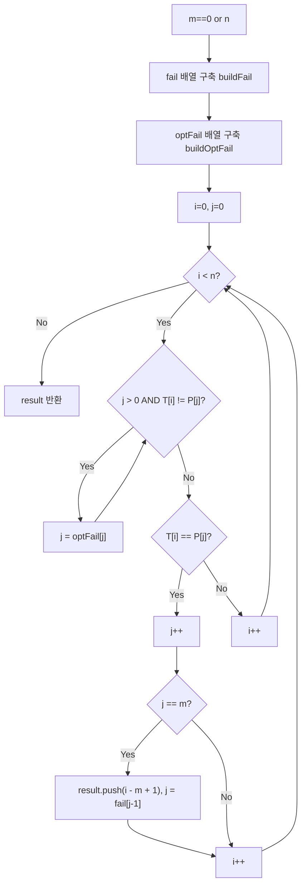

import { AlgorithmSimulation } from "#guide-sim";

# findAllOccurrences — 불일치가 나도 텍스트 포인터는 뒤로 가지 않는 이유

## 한눈에 보는 컨셉

텍스트에서 패턴이 등장하는 모든 위치를 찾을 때, 불일치가 나더라도 이미 비교해서 확인해 둔 정보를 버리지 않으면 텍스트 포인터가 뒤로 돌아갈 필요가 없어요. 패턴 스스로 안에서 "접두사이면서 접미사인 가장 긴 조각"을 미리 계산해 두면(실패 함수, failure function), 불일치가 났을 때 패턴 포인터만 그 값만큼 물러서고 텍스트 포인터는 **한 번 지나간 자리로는 되돌아가지 않습니다**(같은 자리에서 다른 패턴 문자와 다시 비교할 뿐, 이미 확인한 텍스트 위치를 다시 방문하는 것은 아니에요). 이 관찰 하나로 텍스트 포인터를 단조 증가만 시키면서 `O(n + m)`에 모든 등장 위치(겹치는 경우 포함)를 찾아낼 수 있어요.

## 출발점: 가장 순진한 방법부터

문제를 먼저 정확히 잡을게요.

```ts
function findAllOccurrences(text: string, pattern: string): number[]
```

- `text` — 검색 대상 텍스트. 길이 `n`, `0 ≤ n ≤ 10^5`.
- `pattern` — 찾을 패턴. 길이 `m`, `0 ≤ m ≤ 10^5`.
- 반환값 — `text` 안에서 `pattern`이 등장하는 모든 시작 인덱스(0-based)를 오름차순으로 담은 배열. 겹쳐서 등장하는 경우도 전부 포함합니다.
- 빈 패턴 규약: `m = 0`이면 빈 배열을 반환합니다.

목표 복잡도는 `O(n + m)`이에요. `n, m ≤ 10^5`이니 `n + m ≤ 2×10^5` 정도면 통상적인 1초 제한에서 넉넉히 통과할 수 있는 규모입니다(정확한 실행 시간은 언어·하드웨어·채점 환경에 따라 달라집니다). 이 목표가 왜 필요한지는 가장 정직한 방법부터 시도해 보면 바로 드러나요.

텍스트 안에서 패턴이 등장하는 위치를 모두 찾아야 한다면, 가장 정직한 방법은 텍스트의 모든 시작 위치에서 패턴과 한 글자씩 비교해 보는 겁니다.

```ts
function findAllOccurrencesNaive(text: string, pattern: string): number[] {
  const n = text.length;
  const m = pattern.length;
  const result: number[] = [];
  if (m === 0) return result;
  for (let i = 0; i <= n - m; i++) {
    let match = true;
    for (let j = 0; j < m; j++) {
      if (text[i + j] !== pattern[j]) {
        match = false;
        break;
      }
    }
    if (match) result.push(i);
  }
  return result;
}
```

작은 예로 비용을 직접 세어 봅시다. `text = "aaaaaa"`(n=6), `pattern = "aab"`(m=3)이라고 해 볼게요.

```text
text    = a a a a a a   (n = 6)
pattern = a a b         (m = 3)

i=0: a a a  vs  a a b  → 앞 2글자는 일치, 3번째에서 불일치  (비교 3회)
i=1: a a a  vs  a a b  → 앞 2글자는 일치, 3번째에서 불일치  (비교 3회)
i=2: a a a  vs  a a b  → 앞 2글자는 일치, 3번째에서 불일치  (비교 3회)
i=3: a a a  vs  a a b  → 앞 2글자는 일치, 3번째에서 불일치  (비교 3회)

총 비교 횟수 = 4 × 3 = 12회 = (n-m+1) × m,  매칭은 0건
```

`n, m ≤ 10^5`라는 제약 안에서 최악값을 만들어 볼게요. `n = 10^5`, `m = 5×10^4`(패턴이 텍스트의 절반 길이)이면 시작 위치 후보가 `n - m + 1 = 50001`개이고 그 각각에서 최대 `m = 50000`번 비교할 수 있으니 `(n-m+1) × m ≈ 2.5×10^9`번 비교까지 치솟습니다(`n = m`이면 오히려 시작 위치가 1개뿐이라 최악값이 아니에요). 통상적인 1초 제한(대개 `10^8`~`10^9` 연산 수준)에서는 통과하기 어려운 규모입니다. 문제의 핵심은 속도가 아니라 **낭비**에 있어요 — 불일치가 나면 텍스트 포인터를 `i+1`로 되돌리는데, 이건 방금 `T[i+1], T[i+2], ...`가 패턴과 어디까지 맞았는지 **이미 알고 있던 정보를 통째로 버리는 행동**입니다. 혹시 이 정보를 재활용할 수는 없을까요? 이것이 다음 절의 출발점입니다.

## 아이디어 자세히 들여다보기

### 실패 함수로 접두사와 접미사 잇기 — 수식과 그림

패턴 `P`의 실패 함수 `fail[i]`를 다음과 같이 정의합니다.

$$\text{fail}[i] = \max \bigl\{\, k < i+1 \;\big|\; P[0..k-1] = P[i-k+1..i] \,\bigr\}$$

말로 풀면, `P[0..i]`의 **proper prefix이면서 동시에 proper suffix인 문자열 중 가장 긴 것의 길이**입니다. 왜 하필 이 정의여야 할까요? 단순히 "가장 긴 공통부분문자열"을 쓰면 안 됩니다 — 그건 위치가 자유로워서 "지금까지 매칭된 문자열의 접미사가 곧 새로운 매칭의 접두사가 될 수 있는가"라는, 우리가 정말 필요로 하는 질문(불일치 이후에도 텍스트를 다시 읽지 않고 이어갈 수 있는가)에 답해 주지 않기 때문이에요. **접두사이자 접미사**라는 조건이어야만 "지금까지 읽은 텍스트의 끝부분 = 패턴의 새 시작부분"이라는 재활용이 성립합니다.

작은 예로 손을 움직여 볼게요. `P = "aabaaab"`의 실패 함수는 다음과 같습니다.

```text
P       = a a b a a a b
index i = 0 1 2 3 4 5 6
fail[i] = 0 1 0 1 2 2 3
```

`fail[6] = 3`을 확인해 볼까요? `P[0..6] = "aabaaab"`의 proper prefix들과 proper suffix들을 나열해 보면, 길이 3짜리 접두사는 `"aab"`, 길이 3짜리 접미사는 마지막 3글자인 `"aab"`로 서로 같습니다. 더 긴 길이(4 이상)에서는 접두사·접미사가 같아지는 경우가 없으므로 `3`이 맞습니다.

> 확인 질문 하나만 더 풀어 볼까요? `fail[4]`는 왜 `2`일까요? `P[0..4] = "aabaa"`의 proper prefix 중 접미사와 같은 가장 긴 것은 `"aa"`(길이 2)입니다 — 접두사 `"aa"`(인덱스 0,1)와 접미사 `"aa"`(인덱스 3,4)가 정확히 일치하죠.

이제 매칭에 쓸 상태 변수 두 개를 둡니다.

- 텍스트 포인터 `i` — `0`부터 `n-1`까지 단조 증가.
- 패턴 포인터 `j` — 현재까지 매칭된 길이. `0 ≤ j ≤ m`.

루프가 도는 내내 다음 불변식이 유지됩니다.

$$T[i-j \ldots i-1] = P[0 \ldots j-1]$$

전이는 세 갈래입니다. `T[i] = P[j]`이면 매칭이 한 글자 늘어난 것이니 `j`와 `i`를 각각 `1`씩 올립니다. `T[i] \neq P[j]`이고 `j > 0`이면, 이미 매칭된 `P[0..j-1]` 안에서 접두사=접미사인 가장 긴 조각의 길이가 `fail[j-1]`이므로 `j`를 그 값으로 옮기고 `i`는 그대로 둡니다(같은 텍스트 문자를 다시 비교할 기회를 얻는 것). `j = 0`인데 불일치이면 물러설 매칭 자체가 없으니 `i`만 전진시킵니다. `j`가 `m`에 도달하면 매칭 성공 — 시작 위치 `i - m + 1`을 기록하고, 겹치는 매칭도 놓치지 않도록 `j = fail[j-1]`로 옮겨 계속 진행합니다.

### 왜 모순 없이 작동하는가

핵심 불변식은 하나입니다: **루프 진입 시 `T[i-j..i-1] = P[0..j-1]`이 항상 성립한다.**

**기저**: `i=0, j=0`일 때 양변 모두 빈 문자열이므로 자명하게 성립합니다.

**귀납 단계**: 불변식이 어느 시점에 성립한다고 하고, 다음 한 스텝에서 벌어질 수 있는 경우는 정확히 둘뿐입니다 — `T[i] = P[j]`이거나 `T[i] \neq P[j]`(문자 비교는 둘 중 하나이므로 이 밖의 경우는 없습니다).

- **일치하는 경우**: `i, j`를 각각 `1`씩 올립니다. 기존 불변식 `T[i-j..i-1] = P[0..j-1]`의 양 끝에 같은 문자 하나씩을 이어 붙인 셈이므로 `T[i-j..i] = P[0..j]` — 새 `i'=i+1, j'=j+1`에 대해서도 `T[i'-j'..i'-1] = P[0..j'-1]`이 그대로 성립합니다.
- **불일치하고 `j>0`인 경우**: `j`를 `fail[j-1]`로 옮깁니다. `fail`의 정의에 의해 `P[0..fail[j-1]-1]`은 `P[0..j-1]`의 접미사이기도 하므로, 기존 불변식 `T[i-j..i-1] = P[0..j-1]`의 뒷부분과 정확히 겹쳐 `T[i-fail[j-1]..i-1] = P[0..fail[j-1]-1]`이 성립합니다. `i`는 그대로이므로 새 `j' = fail[j-1]`에 대해 불변식이 유지됩니다.
- **불일치하고 `j=0`인 경우**: `i`만 `1` 올립니다. `j=0`일 때 불변식은 양쪽 다 빈 문자열이라 항상 자명하게 유지됩니다.

세 경우 모두에서 불변식이 유지되므로 귀납이 완성됩니다. 그리고 텍스트 포인터 `i`는 매 반복마다 최대 `1`만 증가하고 총 `n`번만 돌므로(그 안에서 `j`가 아무리 줄어도 그 감소량의 총합은 그 전에 늘어난 양을 못 넘습니다), 전체 작업량은 `O(n)`입니다.

불변식이 유지된다는 것과 별개로, 이 과정이 **매칭을 하나도 빠뜨리지 않는지**도 짚어야 합니다. 정의상 `fail[j-1]`은 `P[0..j-1]`의 border 중 가장 긴 것의 길이입니다 — 다시 말해 지금 확인된 매칭 구간 안에는 그보다 더 긴 border가 존재하지 않는다는 뜻이에요. 그러니 물러난 `j = fail[j-1]`과 원래 `j` 사이 길이로는 애초에 접두사=접미사 조건을 만족하는 시작 위치가 없어, 그 사이의 시작 위치에서 매칭이 이어질 가능성 자체가 없습니다. 따라서 `fail` 체인을 타고 내려가며 각 후보 길이를 순서대로(가장 긴 것부터) 확인하는 것만으로 가능한 모든 시작 위치를 놓치지 않고 검토하게 됩니다.

여기서 **헷갈리기 쉬운 포인트**는 "패턴이 겹쳐서 여러 번 매칭되니까 텍스트 포인터도 한 번쯤 되돌려야 하지 않을까?"라는 생각입니다. 실제로는 그럴 필요가 없어요. `text = "aaaa"`, `pattern = "aa"`(`fail = [0, 1]`)를 손으로 따라가 봅시다.

```text
text = a a a a   (index 0 1 2 3)

i=0  j: 0→1                                        (매칭 진행)
i=1  j: 1→2=m → 시작 0 기록 → j=fail[1]=1 로 후퇴
i=2  j: 1→2=m → 시작 1 기록 → j=fail[1]=1 로 후퇴
i=3  j: 1→2=m → 시작 2 기록 → j=fail[1]=1 로 후퇴

결과 = [0, 1, 2]  ← 겹치는 세 시작 위치를 모두 찾았지만
                     i는 0→1→2→3 으로 계속 전진만 했다 (한 번도 되돌아가지 않음)
```

엣지 케이스도 짚어 둘게요.

```text
m = 0                          → []   (빈 패턴 규약)
m > n                          → []   (이 구현은 n < m 가드로 조기 반환합니다 — 가드가 없어도 어느 시작 위치에서도 매칭이 나올 수 없어 결과는 같습니다)
n = 0, m > 0                   → []   (빈 텍스트)
text 전체가 패턴과 같음          → [0]
겹쳐서 반복 등장("aaaa"의 "aa")  → [0, 1, 2]
```

## 아이디어를 코드로 옮기기

앞의 전이 규칙을 그대로 옮긴 기본 구현입니다.

```ts
function buildFail(pattern: string): number[] {
  const m = pattern.length;
  const fail = new Array<number>(m).fill(0);
  let k = 0;
  for (let i = 1; i < m; i++) {
    while (k > 0 && pattern[i] !== pattern[k]) {
      k = fail[k - 1]!;
    }
    if (pattern[i] === pattern[k]) {
      k++;
    }
    fail[i] = k;
  }
  return fail;
}

function findAllOccurrencesBasic(text: string, pattern: string): number[] {
  const n = text.length;
  const m = pattern.length;
  if (m === 0 || n < m) return [];
  const fail = buildFail(pattern);
  const result: number[] = [];
  let j = 0;
  for (let i = 0; i < n; i++) {
    while (j > 0 && text[i] !== pattern[j]) {
      j = fail[j - 1]!;
    }
    if (text[i] === pattern[j]) {
      j++;
    }
    if (j === m) {
      result.push(i - m + 1);
      j = fail[j - 1]!;
    }
  }
  return result;
}
```

**`buildFail`은 왜 정확할까요?** 앞서 매칭 루프에 대해 증명한 논증을 그대로 재사용할 수 있습니다 — `buildFail`은 사실 **텍스트 자리에 패턴 자기 자신을 대입한 매칭**입니다(`T = P`로 치환). `i`번째 문자까지 확인했을 때 지금까지 이어진 border 길이가 곧 `fail[i]`가 되는 거예요. 코드를 나란히 놓고 보면 대응이 그대로 보입니다: `k`는 매칭 루프의 `j`와 똑같이 "지금까지 확인된 border 길이"를 들고 있고, `pattern[i] === pattern[k]`가 성립하면(매칭 루프의 "일치" 분기에 해당) `k++`로 늘리고, 불일치면(매칭 루프의 "`j > 0`이고 불일치" 분기에 해당) `k = fail[k - 1]`로 물러섭니다 — 이건 "지금까지의 border `P[0..k-1]`도 그 자신의 border를 갖고, 그 값이 이미 `fail[k-1]`에 계산돼 있다"는 사실을 재사용하는 것뿐이라, 매칭 루프에서 세운 귀납 논증(기저 → 일치 → 불일치, 두 경우 모두 완전성·정확성 성립)이 문자 그대로 옮겨 적용됩니다. 차이는 완전 매칭(`j === m`) 분기가 없다는 것뿐이에요 — border 길이 `k`는 `i + 1`(현재까지 본 접두사 전체 길이)을 넘어설 수 없으므로, 매 `i`마다 그 시점의 `k`를 곧바로 `fail[i]`로 기록하고 다음 `i`로 넘어갑니다.

**가장 실수가 잦은 줄은 `while (k > 0 && pattern[i] !== pattern[k])`의 `k > 0` 조건입니다.** 이 조건이 없으면 `pattern[i]`가 `pattern[0]`과도 다를 때 `fail[k-1]`이 `fail[-1]`을 참조하려 들어 오류가 납니다. 매칭 루프의 `while (j > 0 && ...)`도 같은 이유로 `j > 0`을 먼저 확인해요. 그리고 `j === m` 처리 후 `j = 0`으로 초기화하지 않고 반드시 `j = fail[j - 1]`로 옮기는 것도 중요한 지점입니다 — `j = 0`으로 리셋하면 방금 본 `"aaaa"`/`"aa"` 예시처럼 겹치는 매칭을 놓칩니다.

## 더 빠르게 만들 단서 찾기

`pattern = "aaaab"`을 텍스트 `"aaacaaaab"`에서 찾는 과정을 관찰해 볼게요. `i=3`(문자 `'c'`)에서 무슨 일이 일어나는지 자세히 보면 낭비가 보입니다.

```text
text[3] = 'c'
pattern = a a a a b
index     0 1 2 3 4

j=3: 'c' vs pattern[3]='a'  → 불일치 (1회) → j = fail[2] = 2
j=2: 'c' vs pattern[2]='a'  → 또 불일치 (1회) → j = fail[1] = 1
j=1: 'c' vs pattern[1]='a'  → 또 불일치 (1회) → j = fail[0] = 0
j=0: 'c' vs pattern[0]='a'  → 또 불일치 (1회, j는 0 유지)

이 지점에서만 비교 4회 — 그런데 pattern[3]=pattern[2]=pattern[1]=pattern[0]='a' 이므로
'c'가 pattern[3]과 이미 다르다는 걸 안 순간, 나머지 세 번의 비교는 결과가 뻔했다
```

패턴 자기 자신 안에서 `pattern[j]`와 그 fallback 위치 `pattern[fail[j-1]]`이 **같은 문자**라면, 방금 실패한 문자로 fallback 위치를 다시 비교해 봐야 결과는 또 실패로 정해져 있습니다. **이 "뻔한 재실패"를 미리 걸러낼 수 있지 않을까?**가 이번 단서입니다.

## 단서를 최적화로 연결하기

패턴만으로 미리 계산할 수 있는 강화된 실패 함수 `optFail`을 만듭니다. `pattern[i]`와 fallback 문자 `pattern[fail[i-1]]`이 같다면, 그 fallback으로 가 봐야 또 실패할 걸 알고 있으니 한 단계 더 건너뜁니다.

$$\text{optFail}[i] = \begin{cases} \text{optFail}[\,\text{fail}[i-1]\,] & \text{if } P[i] = P[\,\text{fail}[i-1]\,] \\ \text{fail}[i-1] & \text{otherwise} \end{cases} \qquad (\text{optFail}[0] = 0)$$

`pattern = "aaaab"`에 적용하면 이렇습니다.

```text
index      0 1 2 3 4
fail    =  0 1 2 3 0
optFail =  0 0 0 0 3
```

이 건너뛰기가 안전한 이유는 간단합니다 — 건너뛴 상태 `fail[i-1]` 자체가 애초에 성공할 수 없는 후보이기 때문이에요. `P[i] = P[fail[i-1]]`이라는 조건 때문에, 그 상태에서 다시 비교해도 방금 실패했던 것과 **똑같은 문자**로 다시 실패가 확정됩니다. 그러니 `optFail[i]`로 한 번에 더 건너뛰어도, 중간에 있던 `fail[i-1]`이 매칭 후보가 될 가능성 자체가 없으므로 놓치는 경우가 없습니다.

Before/After로 비교하면, 앞서 본 `i=3`(`'c'`) 지점에서 낭비가 사라지는 걸 볼 수 있어요.

```text
Before (fail 사용):  j=3 불일치 → j=2 불일치 → j=1 불일치 → j=0 불일치   (비교 4회)
After  (optFail 사용): j=3 불일치 → optFail[3]=0 으로 한 번에 점프       (비교 1회 + 이후 j=0 비교 1회 = 2회)
```

여기서 **헷갈리기 쉬운 포인트**가 하나 있습니다. "그럼 완전 매칭(`j === m`) 직후에도 강화된 `optFail`을 그대로 쓰면 되지 않을까?"라고 생각하기 쉬운데, 이건 틀렸습니다. `optFail`은 "지금 막 실패한 문자와 같은 문자가 fallback에도 있으니 건너뛴다"는 논리인데, 완전 매칭 직후는 애초에 실패한 적이 없어요 — 겹치는 매칭을 계속 찾기 위한 것이지 재실패를 피하는 것이 아니므로, 표준 `fail[j-1]`을 그대로 써야 합니다. 실제로 이 실수를 반영해 실행해 보면 값이 조용히 틀어집니다.

```text
text = "aaaa", pattern = "aa"  (fail = [0, 1], optFail = [0, 0])

완전 매칭 직후 잘못 optFail[j-1]을 쓰면:  결과 = [0, 2]      ← 정답 [0, 1, 2] 중 1이 빠짐
완전 매칭 직후 올바르게 fail[j-1]을 쓰면: 결과 = [0, 1, 2]   ← 정답
```

## 최적화 코드

바뀌는 곳은 **강화된 실패 함수를 만드는 함수 하나와, 매칭 루프의 불일치 fallback 한 줄**뿐입니다. 완전 매칭 직후의 `j = fail[j - 1]`은 그대로 둡니다.

```ts
function buildOptFail(pattern: string, fail: number[]): number[] {
  const m = pattern.length;
  const optFail = new Array<number>(m).fill(0);
  for (let i = 1; i < m; i++) {
    const f = fail[i - 1]!;
    optFail[i] = pattern[i] === pattern[f] ? optFail[f]! : f;
  }
  return optFail;
}

function findAllOccurrencesOptimized(text: string, pattern: string): number[] {
  const n = text.length;
  const m = pattern.length;
  if (m === 0 || n < m) return [];
  const fail = buildFail(pattern);
  const optFail = buildOptFail(pattern, fail);
  const result: number[] = [];
  let j = 0;
  for (let i = 0; i < n; i++) {
    while (j > 0 && text[i] !== pattern[j]) {
      j = optFail[j]!; // 불일치 fallback만 optFail로 교체
    }
    if (text[i] === pattern[j]) {
      j++;
    }
    if (j === m) {
      result.push(i - m + 1);
      j = fail[j - 1]!; // 완전 매칭 직후는 그대로 표준 fail
    }
  }
  return result;
}
```

**가장 중요한 줄은 `j = optFail[j]!`와 `j = fail[j - 1]!` 두 줄이 서로 다른 배열을 참조한다는 점입니다.** 이 둘을 뒤바꾸면(즉 완전 매칭 직후에도 `optFail`을 쓰면) 바로 앞서 본 `[0, 2]` 같은 조용한 오답이 납니다.

> 불일치는 optFail로 건너뛰고, 완전 매칭은 fail로 이어간다.

실측으로 확인해 보면(`text[i]`와 `pattern[j]`를 비교하는 시도 1회당 1로 셉니다), `text = "aaacaaaab"`에서는 기본 구현이 비교 `12`회, 최적화 구현이 `10`회로 줄어듭니다. 반면 `text = "aaaaaaaaab"`에서는 두 구현 모두 `15`회로 동일해요. 왜 이 경우엔 효과가 없을까요? `j=4`에서 불일치가 나면(`pattern[4]='b'`), fallback 문자는 `pattern[fail[3]] = pattern[3] = 'a'`로 `pattern[4]`와 **다릅니다** — `optFail[4]`는 collapse 조건(`P[i] = P[fail[i-1]]`)이 거짓이라 그대로 `fail[3]`과 같은 값이 되고, 한 단계 더 건너뛸 이유가 없는 거예요. 반대로 `"aaacaaaab"`의 `i=3`(`'c'`) 지점에서는 `pattern[3]`과 fallback 문자 `pattern[fail[2]]`이 둘 다 `'a'`로 같아서 `optFail`이 실제로 건너뜁니다. 즉 이 최적화는 점근 복잡도 `O(n+m)`을 바꾸지 않는 **상수항 개선**이며, 실패 위치의 패턴 문자와 그 fallback 위치의 패턴 문자가 같아 "즉시 재실패"가 예정된 지점이 있을 때만 효과를 냅니다. 공간 복잡도는 `fail`, `optFail`, 결과 배열을 합쳐 `O(m + r)`입니다(`r`은 찾은 시작 위치 개수로 최악 `O(n)`).

더 최적화할 여지가 있을까요? 여기서 마칩니다. 한 걸음 더 나아가는 방법으로 전이표를 통째로 미리 만드는 오토마타 기반 KMP, 여러 패턴을 동시에 찾는 Aho-Corasick, 해싱 기반의 Rabin-Karp 같은 대안이 있지만 각각 전처리 공간이나 해시 충돌 확률 같은 다른 트레이드오프를 갖는 별도 알고리즘입니다. KMP를 배우는 이유는 **단일 패턴 검색에서 해싱 가정 없이 항상 `O(n+m)`을 보장**한다는 결정론적 안정성에 있습니다.

## 실행 시각화

`text = "aababcab"`, `pattern = "ab"`에 대해 매칭을 실행하는 과정입니다. 패턴 `"ab"`의 실패 함수는 `fail = [0, 0]`이에요(`optFail`도 이 패턴에서는 동일하게 `[0, 0]`입니다). 배열은 텍스트 문자열이며, 포인터 `i`(텍스트), `j`(패턴 매칭 길이)를 표시합니다. 빨간 하이라이트는 현재 비교 중인 텍스트 위치, 회색(marked)은 매칭이 확정된 시작 위치예요. 실제 반환값은 `[1, 3, 6]`이며(겹치지 않는 위치 1, 3, 6에서 `"ab"` 등장), 시뮬레이션 마지막 프레임의 marked 위치와 일치합니다.

> 대화형 시뮬레이션은 MDX 런타임에서 표시됩니다.

export const text = ["a", "a", "b", "a", "b", "c", "a", "b"];

export const steps = [
  {
    title: "초기화",
    detail: "fail = [0, 0]. i = 0, j = 0 부터 시작.",
    array: text, pointers: { i: 0, j: 0 },
  },
  {
    title: "i=0: T[0]='a' vs P[0]='a' 일치",
    detail: "일치 → j=1. (j는 패턴 매칭 길이)",
    array: text, highlight: [0], pointers: { i: 0, j: 1 },
  },
  {
    title: "i=1: T[1]='a' vs P[1]='b' 불일치",
    detail: "j>0 이고 불일치 → j = fail[0] = 0 으로 후퇴. i는 고정.",
    array: text, highlight: [1], pointers: { i: 1, j: 0 },
  },
  {
    title: "i=1: T[1]='a' vs P[0]='a' 일치",
    detail: "일치 → j=1. i 진행.",
    array: text, highlight: [1], pointers: { i: 1, j: 1 },
  },
  {
    title: "i=2: T[2]='b' vs P[1]='b' 일치 → 매칭!",
    detail: "j=2=m 도달. 시작 위치 i-m+1 = 1 기록. j = fail[1] = 0.",
    array: text, highlight: [2], marked: [1], pointers: { i: 2, j: 0 },
  },
  {
    title: "i=3: T[3]='a' vs P[0]='a' 일치",
    detail: "일치 → j=1.",
    array: text, highlight: [3], marked: [1], pointers: { i: 3, j: 1 },
  },
  {
    title: "i=4: T[4]='b' vs P[1]='b' 일치 → 매칭!",
    detail: "j=2=m 도달. 시작 위치 3 기록. j = fail[1] = 0.",
    array: text, highlight: [4], marked: [1, 3], pointers: { i: 4, j: 0 },
  },
  {
    title: "i=5: T[5]='c' vs P[0]='a' 불일치",
    detail: "j=0 이라 i만 진행. 매칭 없음.",
    array: text, highlight: [5], marked: [1, 3], pointers: { i: 5, j: 0 },
  },
  {
    title: "i=6: T[6]='a' vs P[0]='a' 일치",
    detail: "일치 → j=1.",
    array: text, highlight: [6], marked: [1, 3], pointers: { i: 6, j: 1 },
  },
  {
    title: "i=7: T[7]='b' vs P[1]='b' 일치 → 매칭!",
    detail: "j=2=m 도달. 시작 위치 6 기록. j = fail[1] = 0 으로 후퇴(텍스트 끝이라 더 진행하지 않음).",
    array: text, highlight: [7], marked: [1, 3, 6], pointers: { i: 7, j: 0 },
  },
  {
    title: "완료: result = [1, 3, 6]",
    detail: "텍스트 포인터를 한 번도 되돌리지 않고 끝까지 전진하며 모든 등장 위치를 찾았다.",
    array: text, marked: [1, 3, 6],
  },
];

<AlgorithmSimulation view="array" steps={steps} title="KMP 검색: pattern='ab'" />

## 흐름 한눈에 보기

아래 흐름도는 최종 완성본인 최적화 버전(`findAllOccurrencesOptimized`) 기준입니다 — 불일치 시에는 `optFail[j]`로 물러서고, 완전 매칭 직후에만 표준 `fail[j-1]`을 씁니다.



## 스스로 점검하기

1. `pattern = "abab"`의 실패 함수 `fail`을 손으로 직접 계산해 보세요. (정답: `fail = [0, 0, 1, 2]`입니다. `fail[3]=2`는 `P[0..3]="abab"`의 proper prefix `"ab"`가 접미사와도 같기 때문이에요.)
2. `text = "aaaa"`, `pattern = "aa"`에서, 완전 매칭 직후에도 `optFail`을 그대로 쓰는 실수를 저지르면 결과가 정확히 어떻게 틀어지는지 짚어 보세요. (힌트: 시작 위치 `0`은 정상적으로 기록되지만, 그다음 겹치는 매칭 하나가 통째로 빠집니다.)
3. 텍스트 하나에서 서로 다른 여러 패턴을 동시에 찾아야 한다면(예: 사전에 있는 단어 100개를 한 번에 검색) 이 알고리즘의 어떤 부분을 확장해야 할까요? 실패 함수 하나만으로 충분할지, 패턴들을 하나의 구조로 합쳐야 할지 생각해 보세요.
