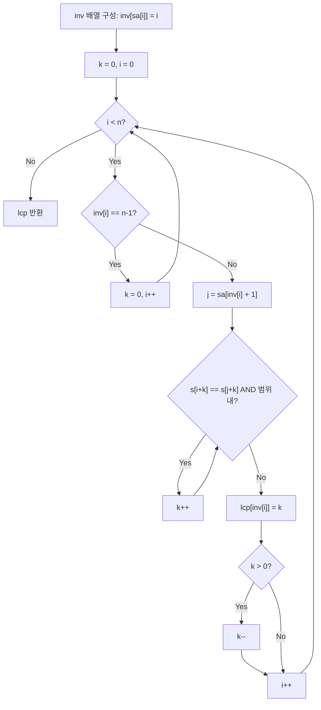

import { AlgorithmSimulation } from "#guide-sim";

# Kasai's LCP 알고리즘 — 접미사 배열 순서 대신 원본 순서로 훑으면 비교가 재활용되는 이유

## 한눈에 보는 컨셉

문자열 `s`와 그 접미사 배열(Suffix Array, SA)이 주어졌을 때, 사전순으로 인접한 두 접미사끼리 얼마나 많은 글자를 공유하는지(최장 공통 접두사, LCP)를 전부 구하는 알고리즘이에요. SA가 나열된 순서 그대로 각 쌍을 처음부터 비교하면 `O(n^2)`이 걸리지만, 비교를 **원본 문자열의 인덱스 순서**로 진행하면 "직전에 구한 LCP 값보다 많아야 1만큼만 줄어든다"는 성질 덕분에 이미 확인해 둔 글자를 버리지 않고 재활용할 수 있어 전체가 `O(n)`으로 끝납니다. 핵심은 하나 — **"원본 인덱스 순서로 훑으면서 직전 비교 포인터 `k`를 그대로 이어받는 것"**입니다(순서만 바꾸는 것으론 부족해요 — 다음 이웃을 `O(1)`에 찾아 주는 `inv` 배열과 함께여야 선형 시간이 됩니다).

## 출발점: 가장 순진한 방법부터

문제를 먼저 정확히 잡을게요.

```ts
function kasaiLcp(s: string, sa: number[]): number[]
```

`s`는 길이 `n`(`1 ≤ n ≤ 10^5`)인 문자열이고, `sa`는 `s`의 모든 접미사를 사전순으로 정렬했을 때 각 접미사의 시작 인덱스를 담은 길이 `n` 배열입니다(이미 올바르게 만들어져 있다고 가정해요 — SA를 만드는 일은 이 가이드의 범위가 아닙니다). 반환값은 길이 `n`의 LCP 배열로, `lcp[i]`는 `sa[i]`번째 접미사와 `sa[i+1]`번째 접미사가 앞에서부터 몇 글자를 공유하는지를 담고, 마지막 원소 `lcp[n-1]`은 다음 이웃이 없으므로 관례상 0이에요.

조금 더 구체적으로 말하면, `sa`는 `[0, n)` 구간의 정수를 정확히 한 번씩 담은 순열이며 실제로 `s`의 접미사를 사전순으로 정렬한 결과라는 전제가 필요해요 — 이 함수는 그 전제를 검증하지 않으므로, 잘못된 `sa`(중복값·범위 밖 값·정렬되지 않은 순서)가 들어오면 `inv` 배열에 빈 칸이나 중복이 생겨 계산이 `undefined`를 산술에 섞거나 의미 없는 결과를 조용히 내놓을 수 있습니다. 그리고 이 가이드에서 `s`는 영문 소문자(ASCII) 문자열이라고 가정합니다 — TypeScript의 `s.length`와 `s[i]`는 유니코드 코드 포인트가 아니라 UTF-16 코드 단위 기준이라, 서로게이트 쌍으로 이루어진 이모지 같은 문자가 섞이면 "문자" 하나가 두 칸으로 쪼개져 버리거든요.

$$\text{LCP}[i] = \mathrm{lcp}\bigl(s[\text{SA}[i]\ldots],\, s[\text{SA}[i+1]\ldots]\bigr) \quad(0\le i<n-1),\qquad \text{LCP}[n-1]=0$$

가장 정직한 방법은 이 정의를 그대로 코드로 옮기는 겁니다 — 인접한 두 접미사를 각각 처음부터 한 글자씩 비교하는 거예요.

```ts
function kasaiLcpNaive(s: string, sa: number[]): number[] {
  const n = s.length;
  const lcp = new Array<number>(n).fill(0);
  for (let i = 0; i < n - 1; i++) {
    const a = sa[i]!, b = sa[i + 1]!;
    let k = 0;
    while (a + k < n && b + k < n && s[a + k] === s[b + k]) k++;
    lcp[i] = k;
  }
  return lcp;
}
```

이게 왜 느린지 작은 예로 직접 세어 볼게요. `s = "aaaa"`, `sa = [3, 2, 1, 0]`(접미사를 사전순으로 나열하면 `"a" < "aa" < "aaa" < "aaaa"`이므로 이 순서가 됩니다)이라면:

```text
s = "aaaa", sa = [3,2,1,0]   (접미사: "a", "aa", "aaa", "aaaa")

pair (sa[0]=3, sa[1]=2): "a"   vs "aa"   → 비교 1회 → lcp=1
pair (sa[1]=2, sa[2]=1): "aa"  vs "aaa"  → 비교 2회 → lcp=2
pair (sa[2]=1, sa[3]=0): "aaa" vs "aaaa" → 비교 3회 → lcp=3
                                            합계 1+2+3 = 6회 = n(n-1)/2

n = 10^5 라면: 10^5 × 99999 / 2 ≈ 5×10^9 회 → 1초 시간 제한 안에서 불가능
```

낭비의 정체는 분명해요. **매 쌍마다 `k = 0`부터 다시 세기 시작**하기 때문에, 앞 쌍에서 이미 확인한 글자를 다음 쌍에서 또 확인합니다. `"aa"`와 `"aaa"`를 비교하면서 앞 두 글자가 `'a','a'`로 같다는 걸 이미 알아냈는데, `"aaa"`와 `"aaaa"`를 비교할 때는 이 정보를 그냥 버리고 처음부터 다시 세는 셈이에요.

여기서 자연스러운 질문이 하나 떠오릅니다. **"SA 순서가 아니라 다른 순서로 훑으면 이 버려지는 정보를 재활용할 수 있지 않을까?"** 이것이 Kasai 알고리즘의 출발 단서예요. 목표 복잡도는 `O(n)`입니다.

## 아이디어 자세히 들여다보기

### 원본 인덱스로 훑으면 보이는 것 — 수식과 그림

버려지는 정보를 재활용하려면, 비교 순서를 SA 순서(`sa[0], sa[1], ...`)가 아니라 **원본 문자열의 인덱스 순서**(`i = 0, 1, ..., n-1`)로 바꿔야 해요. 그런데 원본 인덱스 `i`가 SA 안에서 몇 번째인지, 그리고 그 바로 다음 이웃이 누구인지를 알아야 비교를 이어갈 수 있습니다. 이를 위해 SA의 **역함수(inverse)**를 하나 둡니다.

$$\text{inv}[i] = k \iff \text{SA}[k] = i$$

말로 풀면, `inv[i]`는 "접미사 `s[i..]`가 정렬된 SA 안에서 몇 번째 위치에 있는가"예요. `SA`가 "위치 → 원본 인덱스"라면, `inv`는 그 반대인 "원본 인덱스 → 위치"입니다.

**왜 하필 이 방향이어야 할까요?** 목표는 원본 인덱스 `i`에서 "SA 안에서 내 바로 다음 이웃이 누구인지"를 빠르게 찾는 거예요. `inv[i]`로 위치를 알면 `sa[inv[i] + 1]`로 다음 이웃의 원본 인덱스를 `O(1)`에 얻습니다. 만약 `inv` 없이 매번 SA를 처음부터 훑어 `i`가 몇 번째인지 찾는다면 그 자체가 `O(n)`이라 전체가 다시 `O(n^2)`으로 돌아갑니다. `inv`는 정확히 이 탐색을 없애기 위한 장치예요.

`s = "banana"`, `sa = [5, 3, 1, 0, 4, 2]`로 직접 채워 봅시다. `sa[0]=5`이므로 `inv[5]=0`, `sa[1]=3`이므로 `inv[3]=1`, 이런 식으로 채우면:

```text
sa  = [5, 3, 1, 0, 4, 2]   (SA 위치 0..5 → 원본 인덱스)
inv = [3, 2, 5, 1, 4, 0]   (원본 인덱스 0..5 → SA 위치)

확인: inv[sa[k]] = k 여야 한다
  sa[0]=5 → inv[5]=0 ✓     sa[3]=0 → inv[0]=3 ✓
  sa[1]=3 → inv[3]=1 ✓     sa[4]=4 → inv[4]=4 ✓
  sa[2]=1 → inv[1]=2 ✓     sa[5]=2 → inv[2]=5 ✓
```

잠깐 확인해 볼까요? `inv[2]`는 몇일까요 — 접미사 `s[2..] = "nana"`가 SA에서 몇 번째냐는 질문입니다. `sa[5] = 2`이니 `inv[2] = 5`, 즉 SA에서 가장 마지막(사전순으로 가장 큰 접미사)이에요. 맞습니다, `"nana"`가 `banana`의 접미사 중 사전순으로 가장 크거든요(`n`으로 시작하는 유일한 접미사이고, 알파벳에서 `n`이 `a`, `b`보다 뒤에 오니까요).

이제 원본 인덱스 순서로 훑으면서, 비교 포인터 `k`를 **이전 이터레이션의 값에서 그대로 이어받는** 것이 이번 알고리즘의 뼈대입니다. 다음 절에서 "왜 이어받아도 안전한지"를 이론으로 다져 봅시다.

### 단서를 설명해 주는 이론 — 상각 분석의 집계법(Aggregate Method)

"`k`를 이어받아도 될까?"라는 질문에 답하려면, 개별 연산이 아니라 **연산 전체 묶음의 총비용**을 보는 사고방식이 필요해요. 이를 상각 분석(amortized analysis)이라 부르고, 그중에서도 가장 단순한 기법이 집계법(aggregate method)입니다.

집계법의 아이디어는 이렇습니다 — 개별 연산 하나하나의 최악 비용을 더하면 과대평가되기 쉬우니, **연산 `n`번을 통째로 실행했을 때 드는 총비용**을 직접 구하고, 그것을 `n`으로 나눠 "평균적으로다면 연산당 얼마"라고 말하는 거예요. 대표적인 예가 동적 배열(dynamic array)의 `push`입니다. 배열이 꽉 찰 때마다 크기를 2배로 늘리며 통째로 복사하면 그 순간은 `O(n)`이 걸리지만, 그런 큰 복사는 아주 드물게만 일어나고 나머지는 `O(1)`이에요 — 복사 비용을 전부 더하면 `1+2+4+⋯+n < 2n`인 기하급수 합이 되기 때문에(초반에 들어온 원소일수록 이후 여러 번 다시 복사될 수 있지만, 복사가 일어나는 간격 자체가 매번 절반씩 늘어나는 등비수열이라 총합은 여전히 `O(n)`에 머뭅니다), `n`번의 `push`를 모두 합친 총비용이 `O(n)`에 그친다는 것이 집계법으로 증명됩니다.

Kasai 알고리즘의 `k`도 똑같은 논리로 봅니다. 다만 "`k`의 최댓값이 `n`이니 증가량 총합도 `n` 이하"라고 바로 단정할 수는 없어요 — `k`는 오르내리기를 반복할 수 있으므로, 최댓값이 `n`으로 제한된다는 사실만으로는 누적 증가량이 제한되지 않습니다(`0→n→0→n→0→⋯`처럼 오르내리면 매 순간 최댓값은 `n` 이하여도 누적 증가량은 얼마든지 커질 수 있어요). 대신 **망원합(telescoping sum)**으로 눌러야 합니다.

$$(\text{총 증가량}) - (\text{총 감소량}) = k_{\text{최종}} - k_{\text{최초}}$$

`k`가 하는 일은 두 가지뿐입니다.

- **증가**: 안쪽 `while` 루프에서 글자가 맞는 동안 1씩 늘어납니다.
- **감소**: `lcp[inv[i]]`를 기록한 직후 `k>0`이면 1만 줄어들거나(`k--`), `inv[i]=n-1`(SA 마지막, 이웃 없음)이면 `k`를 통째로 `0`으로 리셋합니다.

여기서 "리셋이 망원합을 망가뜨리지 않는가"라는 질문이 남습니다 — 리셋 직전까지 `k`가 양수였다가 한꺼번에 버려진다면, 그 이터레이션 하나의 감소량이 1보다 훨씬 클 수 있으니까요. 답은 **양수인 `k`를 넘겨받은 채로 리셋을 만나는 경우 자체가 일어나지 않는다**는 것인데, 이 사실은 뒤에 나올 **Kasai 보조정리**의 따름정리로 증명됩니다(지금은 결론만 빌려 쓸게요). 즉 리셋은 항상 "`0`을 `0`으로" 바꾸는 것일 뿐, 실질적인 감소가 아닙니다.

그러므로 감소는 오직 `k--` 하나뿐이고, 바깥 `for` 루프 한 번이 끝날 때마다 많아야 1만 일어나며 전체 실행에서 총 `n`번을 넘지 않습니다. 망원합 식에서 `k_최초 = 0`이고 `k_최종`도 `n` 이하이니, **총 증가량 = 총 감소량 + k_최종 ≤ n + n = 2n 이하**입니다. 안쪽 `while` 루프가 실제로 두 글자를 비교해 일치를 확인하는 "성공 비교" 횟수가 바로 이 증가량이므로, **성공 비교 횟수의 총합은 `2n`을 넘지 않습니다.**

여기에 더해, 각 바깥 루프 이터레이션은 `while` 루프를 멈추게 하는 "종료 비교"를 **많아야 1번** 더 수행할 수 있습니다 — 두 인덱스가 모두 범위 안인데 글자가 달라서 멈추는 경우예요(범위를 벗어나 멈추는 경우는 문자 비교 자체가 일어나지 않습니다 — 코드에서 `&&`가 단락 평가되기 때문이에요). 이런 종료 비교는 이터레이션당 최대 1번이니 총합은 최대 `n`번입니다. 성공 비교(`≤2n`)와 종료 비교(`≤n`)를 더하면 **전체 문자 비교 횟수는 `3n`을 넘지 않는 `O(n)`**이고, 뒤에서 볼 `banana`·`n=2000` 실측값은 이 상한 안에서도 `2n` 가까이에 여유 있게 머뭅니다. 이것이 "개별 이터레이션이 아니라 전체 실행의 총비용"을 보는 집계법 그 자체예요 — 어떤 이터레이션은 `k`가 크게 뛰어 비용이 커 보여도, 그만큼 나중에 감소로 상쇄되니 총합은 선형입니다. 뒤에서 코드를 볼 때 "왜 `k`를 매번 초기화하지 않고 이어받는지"를 다시 여기로 연결해서 기억해 두세요.

### 왜 모순 없이 작동하는가

이 알고리즘이 지키는 약속은 하나입니다.

> 원본 인덱스 `i`를 처리하는 이터레이션 시작 시점에서, 비교 포인터 `k`는 "`s[i..]`와 그 SA상 **바로 다음 이웃**(successor)의 진짜 LCP" 이하의 값이며, 안쪽 `while` 루프가 정확히 그 진짜 값까지 `k`를 밀어 올린다. (접미사는 보통 이전·다음 두 이웃을 갖지만, 이 알고리즘이 항상 참조하는 것은 다음 이웃 하나뿐이에요.)

**기저(i=0):** `k = 0`에서 시작합니다. `0`은 어떤 LCP보다도 크지 않은 값이니 위 약속은 자명하게 성립해요.

**귀납 단계(i-1 → i):** 이터레이션 `i-1`이 끝난 시점의 `k`가 이터레이션 `i`로 그대로 넘어온다고 합시다. 경우는 두 가지뿐이고, 다른 경우는 없습니다(원본 인덱스 `i-1`은 SA 안에서 이웃이 있거나 없거나 둘 중 하나이므로).

1. **`inv[i-1] = n-1`이었던 경우** (인덱스 `i-1`이 SA에서 가장 마지막, 즉 이웃이 없음): 이 알고리즘은 `k`를 `0`으로 리셋합니다. `0`은 항상 안전한 하한이므로 약속이 유지됩니다.
2. **`inv[i-1] \neq n-1`이었던 경우**: 이터레이션 `i-1`에서 진짜 LCP 값 `h`를 구해 `lcp[inv[i-1]] = h`로 기록하고, `k`를 `h`에서 1 줄여 `h-1`(또는 `h=0`이면 `0`)로 다음 이터레이션에 넘깁니다. 이것이 안전한 이유는 다음 보조정리 때문이에요.

**보조정리(Kasai's lemma):** 원본 인덱스 `i-1`의 SA상 **바로 다음 이웃**을 `s[j..]`라 하고(즉 `inv[i-1]+1`번째 SA 위치가 가리키는 접미사), `lcp(s[(i-1)..], s[j..]) = h`라 합시다. `s[(i-1)..]`가 SA에서 마지막이 아니므로(다음 이웃이 있으므로) `s[(i-1)..] < s[j..]`이고, 공유 접두사 길이가 `h`이므로

$$s[(i-1)\ldots(i-1)+h-1] = s[j \ldots j+h-1]$$

**1단계 — 공통 접두사를 지워도 대소관계가 유지됩니다.** `s[(i-1)..] < s[j..]`인 이유는 (a) 위치 `h`에서 처음 다른 글자가 나오고 그 글자가 `s[(i-1)..]` 쪽이 더 작거나, (b) `s[(i-1)..]` 자체가 `s[j..]`의 접두사라서(더 짧아서) 작은 경우 둘 중 하나예요. 양쪽에서 똑같은 첫 글자 `s[i-1]=s[j]`를 하나씩 지워도 이 대소관계는 그대로 유지됩니다 — (a)는 차이가 나는 위치가 `h`에서 `h-1`로 한 칸 당겨질 뿐 대소관계는 안 바뀌고, (b)는 "더 짧은 쪽이 작다"는 관계가 길이도 함께 하나씩 줄어드니 그대로예요. `s[j..]`가 `s[(i-1)..]`와 `h`글자를 공유하려면 `s[j..]`의 길이(`n-j`)가 최소 `h`는 되어야 하므로 `j ≤ n-h`이고, 따라서 `h≥2`이면 `j+1 ≤ n-1`이 보장되어 `s[(j+1)..]`는 항상 유효한 접미사입니다. 그러므로 `s[(j+1)..]`이 정의되는 `h≥2`일 때

$$s[i..] < s[(j+1)..], \qquad s[i \ldots i+h-2] = s[(j+1) \ldots (j+1)+h-2] \;\Longrightarrow\; \mathrm{lcp}(s[i..],\, s[(j+1)..]) \geq h-1$$

이 성립합니다(`h≤1`이면 이 단계 자체가 필요 없이 `k=h-1≤0`이 자명한 하한이에요 — 이때는 `s[(j+1)..]`이 범위를 벗어날 수도 있어 애초에 참조할 필요가 없습니다).

**2단계 — 사전순 "구간"은 공유 접두사를 물려받습니다.** `s[i..]`의 **진짜 SA상 다음 이웃**을 `s[m..]`라 합시다. SA 정렬 순서상 `s[m..]`는 `s[i..]`보다 크거나 같은 접미사 중 가장 작은 것이므로 `s[i..] \le s[m..] \le s[(j+1)..]`가 성립합니다(뒤 부등식은 `s[(j+1)..]`도 `s[i..]`보다 크거나 같은 후보 중 하나이기 때문이에요). 그런데 `s[i..]`와 `s[(j+1)..]`가 첫 `h-1`글자를 공유하고 있으니, 그 사이에 낀 어떤 문자열도 같은 `h-1`글자를 그대로 물려받을 수밖에 없습니다 — 첫 `h-1`글자가 다르다면 그 글자에서 이미 정렬 순서가 갈라져 `s[i..]`와 `s[(j+1)..]` 사이 구간을 벗어나 버리기 때문이에요. 그러므로 `s[m..]`도 `s[i..]`와 최소 `h-1`글자를 공유하고, 즉 `\mathrm{lcp}(s[i..], s[m..]) \geq h-1`이에요.

두 단계를 합치면, `k = h-1`에서 비교를 다시 시작해도 진짜 값을 절대 지나치지 않고(놓치지 않고) 안전하게 이어갈 수 있습니다.

**따름정리(리셋과 상각 분석의 연결):** 앞 절(집계법)에서 "리셋이 일어날 때 넘겨받는 `k`가 이미 `0`"이라고 미뤄 둔 사실이 바로 여기서 증명됩니다. `h≥2`(그래서 넘겨받는 `k=h-1≥1`)라면 1단계에서 본 것처럼 `j+1 ≤ n-1`인 유효한 접미사 `s[(j+1)..]`가 존재하고 `s[i..] < s[(j+1)..]`입니다. 즉 `s[i..]`보다 사전순으로 더 큰 접미사가 실제로 존재하므로 `s[i..]`는 SA에서 마지막(랭크 `n-1`)일 수 없어요 — 양수인 `k`를 넘겨받은 채로 리셋 분기를 타는 경우는 애초에 일어나지 않고, 리셋은 항상 "`0`을 `0`으로" 바꾸는 것일 뿐입니다.

두 경우가 원본 인덱스 `i-1`이 가질 수 있는 전부이고(이웃이 있거나 없거나), 각 경우 모두 "다음 이터레이션에 넘기는 `k`가 진짜 값 이하"라는 약속을 지키니, 귀납이 완성됩니다. 안쪽 `while` 루프는 `k`를 하한에서부터 실제로 글자가 일치하는 동안 밀어 올리고 첫 불일치(또는 범위 초과)에서 멈추므로, 최종 `k`는 정의 그대로의 진짜 LCP와 정확히 일치합니다.

`k`가 이터레이션을 건너 그대로 이어지는 모습을 `banana` 예시의 `i=3 → i=4` 전환에서 직접 봅시다.

```text
Before (i=3 처리): k=0에서 출발 → while로 3번 늘려 k=3 → lcp[1]=3 기록 → k-- → k=2
After  (i=4 시작): k=2를 그대로 물려받아 비교 시작(0부터 다시 세지 않음)
                   s[4+2]=s[6]은 범위 밖이라 늘어나지 않고 그대로 lcp[4]=2 기록
```

`i=4`에서 `k`를 0부터 다시 셌다면 결과는 같았겠지만(짧은 문자열이라 차이가 안 보일 뿐), `n`이 커질수록 이 "이어받기"가 없으면 정확히 앞서 본 `O(n^2)` 낭비가 되돌아옵니다.

**여기서 헷갈리기 쉬운 포인트는 `inv` 배열을 채우는 방향입니다.** `inv[sa[i]] = i`가 맞는 방향인데, 이를 반대로 `inv[i] = sa[i]`로 채우면 "SA 위치 → 원본 인덱스"와 "원본 인덱스 → SA 위치"를 뒤바꾸는 셈이라 전혀 다른(틀린) 이웃을 찾게 됩니다. 실제로 `banana` 예시에서 방향을 반대로 채우면:

```text
정확한 inv 사용:  kasaiLcp("banana", [5,3,1,0,4,2]) = [1, 3, 0, 0, 2, 0]   ✓
inv 방향 반대:                        같은 입력            = [3, 0, 1, 0, 2, 0]   ✗ (완전히 다른 배열)
```

두 배열을 원소별로 대조해 보면 앞쪽 세 자리(인덱스 0, 1, 2)는 `1↔3`, `3↔0`, `0↔1`로 값 자체가 달라지고, 뒤쪽 세 자리(인덱스 3, 4, 5)는 우연히 `0, 2, 0`으로 같게 남는다는 걸 볼 수 있어요 — "방향만 반대인데 비슷하게 나오겠지"라는 예상과 달리, 일부 위치가 완전히 다른 값으로 바뀌어 결과 전체가 오답이 됩니다. `inv`는 `sa`의 진짜 역함수여야만 `sa[inv[i]+1]`이 "`i`의 SA상 다음 이웃"을 정확히 가리킵니다.

또 하나 짚어둘 점은 `inv[i] = n-1`(이웃 없음) 케이스의 **가드**예요. 이 경우 `sa[inv[i]+1]`은 `sa[n]`이라 배열 범위를 벗어납니다. 이 프로젝트의 TypeScript 설정(`noUncheckedIndexedAccess`)에서는 `sa[n]`의 타입 자체가 `number | undefined`가 되어 컴파일 시점에 이 실수를 잡아주지만, 타입 체크를 억지로 통과시키면(`!` 등으로) 런타임에는 `undefined`가 산술 연산에 섞여 조용히 이상한 동작으로 이어질 수 있어요. **정의상 SA 마지막 위치는 다음 이웃이 없어 `lcp` 값이 존재하지 않는 자리**이므로, 이 케이스는 계산을 시도하기 전에 반드시 먼저 걸러야 하는 필요조건입니다.

엣지 케이스도 이 불변식 위에서 확인해 둘게요.

```text
n = 1                  → 이웃 자체가 없음 → lcp = [0]
모든 문자가 다름(abc)   → 어떤 인접 쌍도 안 겹침 → lcp = [0, 0, 0]
모든 문자가 같음(aaaa)  → k가 한 번 크게 올랐다가 서서히 내려옴 → lcp = [1, 2, 3, 0]
```

## 아이디어를 코드로 옮기기

앞 절의 아이디어를 그대로 옮기면, 이미 목표였던 `O(n)`을 달성하는 구현이 나옵니다.

```ts
function kasaiLcp(s: string, sa: number[]): number[] {
  const n = s.length;
  const lcp = new Array<number>(n).fill(0);
  if (n <= 1) return lcp; // 접미사가 하나뿐이면 이웃도 없다

  const inv = new Array<number>(n);
  for (let i = 0; i < n; i++) inv[sa[i]!] = i; // inv[sa[i]] = i (반대 아님!)

  let k = 0;
  for (let i = 0; i < n; i++) {
    if (inv[i] === n - 1) {
      k = 0; // SA 마지막 → 이웃 없음. 다음 이터레이션에 낡은 k를 물려주지 않는다
      continue;
    }
    const j = sa[inv[i]! + 1]!; // i의 SA상 다음 이웃
    while (i + k < n && j + k < n && s[i + k] === s[j + k]) k++;
    lcp[inv[i]!] = k;
    if (k > 0) k--; // 보조정리: 다음 이터레이션 시작점을 1 낮춘다
  }
  return lcp;
}
```

**가장 실수가 잦은 줄은 `for (let i = 0; i < n; i++) inv[sa[i]!] = i;`입니다.** 앞 절에서 본 것처럼 이 방향을 반대로(`inv[i] = sa[i]`) 쓰면 `banana` 기준 정답 `[1, 3, 0, 0, 2, 0]` 대신 `[3, 0, 1, 0, 2, 0]`이 나옵니다 — 완전히 다른 배열이면서도 코드는 에러 없이 그냥 실행되니 더 위험한 실수예요.

그 외에 눈여겨볼 결정 지점은 이렇습니다.

- `if (n <= 1) return lcp;` — 접미사가 하나뿐이면 다음 절차(`inv[inv...+1]` 접근 등) 자체가 의미가 없으므로 가장 먼저 걸러냅니다.
- `if (inv[i] === n - 1)` 가드가 `j`를 구하는 줄보다 **먼저** 와야 합니다. 순서를 바꿔 `j = sa[inv[i]+1]`를 먼저 계산하면 `inv[i] = n-1`일 때 이미 범위를 벗어난 접근이 벌어진 뒤입니다.
- `lcp[inv[i]!] = k;`를 먼저 기록한 **다음에** `k--`를 합니다. 순서를 바꿔 먼저 감소시키면 기록되는 값이 진짜 LCP보다 1 작은 값이 되어 버립니다.

이 구현이 이미 목표를 달성했습니다. 바깥 루프가 `O(n)`이고, 앞서 집계법으로 확인했듯 안쪽 `while`의 문자 비교 총 횟수도 `O(n)`(성공 비교 `≤2n` + 종료 비교 `≤n`, 합쳐서 `3n` 이내)이니 전체가 `O(n)`이에요. 실제로 `banana`(`n=6`)에서 문자 비교는 성공 3회 + 종료(불일치) 2회 = 5회만 일어났고(이론 상한 `3n=18`은 물론 `2n=12` 안에도 여유 있게 듭니다), `n=2000`짜리 무작위 이진 문자열에서도 성공 1998회 + 종료 1989회 = 3987회로 `2n=4000` 이내에 머뭅니다.

더 줄일 여지가 있을까요? 이 문제의 하한은 `Ω(n)`입니다 — 반환값 자체가 길이 `n`인 배열이고, 최소한 입력 문자열 `n`개 글자를 한 번씩은 훑어야 하기 때문이에요. `O(n)`은 이미 이 하한과 같은 차수이므로 점근적으로 더 빠르게 만들 여지가 없습니다. 그래서 이 가이드에서는 "더 빠르게 만들 단서 찾기" 이후의 반복적 최적화 절들을 두지 않고 여기서 마칩니다 — naive(`O(n^2)`)에서 Kasai(`O(n)`)로 가는 길이 중간 개선 단계 없는 단일 도약이었고, 그 도약이 이미 하한에 닿아 있기 때문입니다.

참고로 "임의의 두 접미사" 사이의 LCP 하나만 필요하다면 롤링 해시 + 이분 탐색으로 쿼리당 `O(log n)`에 구하는 방법도 있습니다(다만 해시값 일치가 실제 문자열 일치를 보장하진 않는 확률적 방법이라 충돌 가능성을 감수해야 해요 — 결정론적 정확성이 필요하면 지금 만든 LCP 배열 위에 희소 테이블(Sparse Table) 등으로 RMQ를 전처리해서 임의의 두 접미사 LCP를 `O(1)`에 결정론적으로 질의하는 방법을 씁니다). 하지만 이 문제처럼 **SA 상의 모든 인접 쌍**을 한꺼번에 구해야 한다면 해싱+이분탐색 방식은 `O(n log n)`이 되어 Kasai의 `O(n)`보다 느립니다. Kasai 알고리즘은 SA가 이미 만들어져 있다는 전제 위에서만 동작한다는 한계가 있지만(SA 자체를 만드는 비용은 별도), 일단 SA만 있으면 서로 다른 부분 문자열 개수, 최장 반복 부분 문자열처럼 LCP 배열을 필요로 하는 다양한 문제에 그대로 재사용할 수 있다는 점이 이 알고리즘의 가치입니다.

## 실행 시각화

고정 입력 `s = "banana"`, `sa = [5,3,1,0,4,2]`에 대해 Kasai 알고리즘이 LCP 배열을 구하는 과정입니다. 원본 인덱스 순서 `i=0..5`로 순회하며, 비교 포인터 `k`를 직전 이터레이션 값에서 1만 줄여 재사용합니다. array 패널은 문자열 `s`이고, 빨강(`highlight`)은 현재 처리 중인 접미사 시작 `i`와 그 SA 이웃 `j`를 표시해요. keyValue 패널은 역배열 `inv`(`=[3,2,5,1,4,0]`), 현재 `k`, 누적 `lcp`(SA 위치 순)를 보여줍니다. 실제 반환값은 `[1, 3, 0, 0, 2, 0]`이며 시뮬레이션 마지막 프레임의 `lcp`와 일치합니다.

> 대화형 시뮬레이션은 MDX 런타임에서 표시됩니다.

export const chars = ["b", "a", "n", "a", "n", "a"];

export const steps = [
  {
    title: "초기화",
    detail: "inv[sa[i]]=i → inv=[3,2,5,1,4,0]. k=0, lcp 전부 0.",
    array: chars,
    entries: [
      { label: "inv", value: "[3,2,5,1,4,0]" },
      { label: "k", value: 0 },
      { label: "lcp (SA순)", value: "[0,0,0,0,0,0]" },
    ],
  },
  {
    title: "i=0 ('banana')",
    detail: "inv[0]=3, 이웃 j=sa[4]=4 ('na'). s[0]='b'≠s[4]='n' → k=0. lcp[3]=0.",
    array: chars,
    highlight: [0, 4],
    entries: [
      { label: "i, j", value: "0, 4" },
      { label: "k", value: 0 },
      { label: "lcp (SA순)", value: "[0,0,0,0,0,0]" },
    ],
  },
  {
    title: "i=1 ('anana')",
    detail: "inv[1]=2, 이웃 j=sa[3]=0 ('banana'). s[1]='a'≠s[0]='b' → k=0. lcp[2]=0.",
    array: chars,
    highlight: [1, 0],
    entries: [
      { label: "i, j", value: "1, 0" },
      { label: "k", value: 0 },
      { label: "lcp (SA순)", value: "[0,0,0,0,0,0]" },
    ],
  },
  {
    title: "i=2 ('nana') — SA 마지막",
    detail: "inv[2]=5=n-1 → 이웃 없음. k=0으로 리셋, 건너뜀.",
    array: chars,
    highlight: [2],
    entries: [
      { label: "i, inv[i]", value: "2, 5" },
      { label: "k", value: 0 },
      { label: "lcp (SA순)", value: "[0,0,0,0,0,0]" },
    ],
  },
  {
    title: "i=3 ('ana')",
    detail: "inv[3]=1, 이웃 j=sa[2]=1 ('anana'). a=a,n=n,a=a 일치 → k=3. lcp[1]=3, k--→2.",
    array: chars,
    highlight: [3, 1],
    entries: [
      { label: "i, j", value: "3, 1" },
      { label: "k", value: 2 },
      { label: "lcp (SA순)", value: "[0,3,0,0,0,0]" },
    ],
  },
  {
    title: "i=4 ('na')",
    detail: "inv[4]=4, 이웃 j=sa[5]=2 ('nana'). k=2부터 비교하나 i+k=6 범위밖 → 그대로. lcp[4]=2, k--→1.",
    array: chars,
    highlight: [4, 2],
    entries: [
      { label: "i, j", value: "4, 2" },
      { label: "k", value: 1 },
      { label: "lcp (SA순)", value: "[0,3,0,0,2,0]" },
    ],
  },
  {
    title: "i=5 ('a')",
    detail: "inv[5]=0, 이웃 j=sa[1]=3 ('ana'). k=1부터, i+k=6 범위밖 → 그대로. lcp[0]=1, k--→0.",
    array: chars,
    highlight: [5, 3],
    entries: [
      { label: "i, j", value: "5, 3" },
      { label: "k", value: 0 },
      { label: "lcp (SA순)", value: "[1,3,0,0,2,0]" },
    ],
  },
  {
    title: "완료: lcp = [1,3,0,0,2,0]",
    detail: "모든 i 처리 완료. SA 인접 접미사 쌍의 LCP가 선형 시간에 계산됨.",
    array: chars,
    entries: [
      { label: "lcp (SA순)", value: "[1,3,0,0,2,0]" },
      { label: "반환", value: "[1,3,0,0,2,0]" },
    ],
  },
];

<AlgorithmSimulation view={["array", "keyValue"]} steps={steps} title="Kasai LCP: s='banana'" />

## 흐름 한눈에 보기



## 스스로 점검하기

1. `s = "abab"`의 접미사 배열은 `sa = [2, 0, 3, 1]`입니다. Kasai 알고리즘을 손으로 따라가며 `lcp` 배열을 구해 보세요. (`inv = [1, 3, 0, 2]`부터 채워 보면 도움이 됩니다. 정답: `[2, 0, 1, 0]`)
2. `inv` 배열을 `inv[sa[i]] = i` 대신 `inv[i] = sa[i]`로(방향을 반대로) 채우면 `banana` 예시에서 `[3, 0, 1, 0, 2, 0]`이라는 값이 나옵니다. 원래 정답 `[1, 3, 0, 0, 2, 0]`과 원소를 하나씩 대조하면서, 이 반대 방향이 정확히 무엇을 다른 것으로 착각하게 만드는지 설명해 보세요.
3. 여러 문자열을 구분자(예: `#`, `$`처럼 원본에 없는 문자)로 이어 붙인 뒤 하나의 SA를 만들면 "generalized suffix array"가 됩니다. 이 위에 Kasai 알고리즘을 그대로 적용하면 서로 다른 문자열에 속한 두 접미사의 LCP까지 계산해 버릴 수 있는데, 어떤 조건을 추가로 검사해야 이런 값을 걸러낼 수 있을까요? (힌트: 두 가지를 구분해서 생각해 보세요 — ① 애초에 서로 다른 원본 문자열에 속한 접미사 쌍 자체를 계산 대상에서 제외하려면 각 접미사가 어느 원본에서 왔는지 표시가 필요하고, ② 같은 원본이든 아니든 LCP 값 자체가 구분자를 넘어가지 않게 제한하려면 각 접미사에서 다음 구분자까지의 거리로 값을 잘라내야 합니다. 둘은 서로 다른 조건이에요.)
