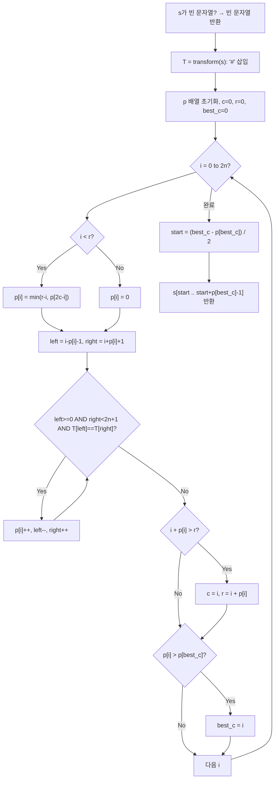

import { AlgorithmSimulation } from "#guide-sim";

# longestPalindrome — 확인해 둔 회문의 거울 반지름을 공짜로 재사용하는 이유

## 한눈에 보는 컨셉

문자열 안에서 가장 긴 회문 부분 문자열을 찾는 문제예요. 중심마다 좌우로 확장하는 방법은 직관적이지만, 각 중심을 독립적으로 취급하느라 이미 확인한 정보를 매번 버립니다. 지금까지 발견한 회문 중 오른쪽으로 가장 멀리 뻗은 것의 범위를 기억해 두면, 그 범위 안에 들어오는 새 중심은 대칭점의 반지름을 검사 없이 재사용할 수 있고, 그 관찰 하나로 전체 확장 횟수가 `O(n)`으로 줄어듭니다.

## 출발점: 가장 순진한 방법부터

문제를 먼저 정확히 잡을게요.

```ts
function longestPalindrome(s: string): string
```

| 항목 | 내용 |
|------|------|
| `s` | 입력 문자열, 소문자 알파벳 `a`–`z` |
| 제약 | $0 \leq \lvert s \rvert \leq 10^5$, 시간 제한 1초 |
| 반환 | `s`의 부분 문자열 중 회문이면서 길이가 최대인 것. 동률이면 아무거나 반환 가능. `s = ""`이면 `""` |

가장 긴 회문을 찾아야 한다면, 가장 정직한 시작은 **후보(모든 부분 문자열)를 전부 나열하고 하나씩 회문인지 검사하는 것**입니다. 작은 예로 직접 나열해 볼게요. `s = "abba"`라면 부분 문자열은 이렇게 10개예요.

```text
길이1: a, b, b, a
길이2: ab, bb, ba
길이3: abb, bba
길이4: abba

부분 문자열 개수 = n(n+1)/2 = 4*5/2 = 10 = O(n^2)
각 부분 문자열이 회문인지 검사   = O(n)
전체 비용                        = O(n^2) * O(n) = O(n^3)

n = 10^5 이면 (10^5)^3 = 10^15  →  1초 제한은커녕 하루가 지나도 안 끝난다
```

말로만 하지 말고 실제로 짜 보면 이렇습니다.

```ts
function isPalindromeStr(str: string): boolean {
  for (let l = 0, r = str.length - 1; l < r; l++, r--) {
    if (str[l] !== str[r]) return false;
  }
  return true;
}

function longestPalindromeBruteForce(s: string): string {
  let best = "";
  for (let i = 0; i < s.length; i++) {
    for (let j = i; j < s.length; j++) {
      const candidate = s.slice(i, j + 1); // 부분 문자열 O(n^2)개
      if (candidate.length > best.length && isPalindromeStr(candidate)) { // 검사 O(n)
        best = candidate;
      }
    }
  }
  return best;
}
```

`i, j` 이중 루프가 부분 문자열 `O(n^2)`개를 만들고, `isPalindromeStr` 한 번이 다시 `O(n)`이니 전체가 `O(n^3)`이라는 게 코드에도 그대로 드러나요. `s = "abba"`에 돌려 보면 `"abba"`를 반환합니다(직접 실행해 확인한 값).

여기서 `abba`, `bb`가 회문이고 그중 `abba`(길이 4)가 정답이라는 건 눈으로도 바로 보이는데, 코드는 10개 후보를 전부 만들고 전부 검사해야 그 사실을 알아냅니다. 회문은 중심을 기준으로 좌우 대칭이라는 성질을 가지고 있으니, 이 대칭성 자체를 활용하면 후보를 통째로 나열하지 않아도 되지 않을까요? 이 낌새를 다음 절에서 이어갑니다.

## 아이디어 자세히 들여다보기

### 거울 대칭 재사용 — 수식과 그림

**원형 아이디어: 중심에서 좌우로 확장하기.** 회문이 중심 대칭이라면, 문자열의 각 위치를 중심으로 놓고 좌우로 한 칸씩 넓혀 가며 일치하는 동안만 반지름을 늘리면 됩니다. 중심이 문자 하나 위에 있으면 홀수 길이 회문(`"aba"`형), 두 문자 사이에 있으면 짝수 길이 회문(`"abba"`형)이 나오므로 두 종류를 다 확인해야 해요.

```text
중심 후보: 홀수용 n개 + 짝수용 n-1개 = O(n)개
각 중심에서 확장 비용: 최악 O(n)  (예: s = "aaaa...a"면 모든 중심이 배열 끝까지 확장)
전체 비용: O(n) * O(n) = O(n^2)

n = 10^5 이면 10^10  →  1초 제한 안에 못 끝난다
```

브루트포스보다는 훨씬 나아졌지만(`O(n^3) → O(n^2)`), 여전히 큰 입력에서는 시간 초과예요. 잠깐 확인해 볼까요? `s = "aaaa"`에서 중심을 두 번째 `'a'`(인덱스 1)에 놓고 확장하면 반지름이 몇 칸까지 늘어날까요? 문자가 전부 같으니 배열 끝까지, 즉 `O(n)`칸이 확장됩니다 — 이게 바로 최악 케이스입니다.

이 원형 아이디어를 코드로 옮기는 모습은 뒤의 "아이디어를 코드로 옮기기" 절에서 직접 확인하기로 하고, 여기서는 이 `O(n^2)`를 `O(n)`으로 낮출 열쇠가 되는 성질부터 마저 정식화해 둘게요.

**돌파구: 이미 확인한 회문의 거울상을 재활용하기.** 지금까지 발견한 회문 중 오른쪽 끝이 가장 먼 것을 계속 기억해 둡시다. 그 회문의 중심을 `c`, 오른쪽 끝을 `r`이라 하면 `T[c-(r-c) .. r]`은 이미 회문임이 확인된 구간입니다. 회문은 `c`를 기준으로 좌우 대칭이니, 이 구간 안에 있는 새 중심 `i`(`i < r`)는 `c`에 대해 대칭인 위치 `mirror = 2c - i`의 반지름을 참고할 수 있어요. `mirror`가 이미 확인한 반지름만큼은, `i`도 검사 없이 "이미 회문"이라고 안전하게 가정할 수 있습니다.

홀수/짝수 회문을 하나의 로직으로 합치려면 통일된 표현이 필요해요. 문자 사이사이에 `#`을 끼워 넣으면 모든 회문이 홀수 길이가 됩니다.

$$T = \#\, s_0 \,\#\, s_1 \,\#\, \ldots \,\#\, s_{n-1} \,\#, \qquad |T| = 2n+1$$

**왜 하필 이 형태여야 할까요?** 홀수/짝수를 따로 처리하는 대안도 있지만, 그러면 두 종류의 확장 로직과 두 종류의 `c, r` 상태를 따로 유지해야 해서 코드가 두 배로 복잡해집니다. `#` 삽입은 배열 길이가 `2n+1`로 늘어나는 대가로, 모든 회문을 "홀수 길이 + 단일 로직"으로 통일합니다. 원본 인덱스 `s[j]`는 변환 후 `T[2j+1]`에 대응해요.

상태로는 세 가지를 유지합니다.

- $p[i]$: $T$에서 중심 $i$의 최대 회문 반지름 ($T[i-p[i] \ldots i+p[i]]$가 회문)
- $c$: 지금까지 발견한 회문 중 오른쪽 끝이 가장 먼 것의 중심
- $r$: 그 오른쪽 경계 ($r = c + p[c]$)

중심 $i$에서 반지름의 **초기값**은 다음과 같습니다.

$$p[i]_{\text{init}} = \begin{cases} \min(r - i,\ p[2c - i]) & i < r \\ 0 & i \geq r \end{cases}$$

- $p[2c-i]$: 대칭점에서 이미 계산해 둔 반지름(재사용할 하한)
- $r - i$: 현재 확인된 회문 범위의 오른쪽 여유 공간(이걸 넘으면 미확인 영역이라 직접 봐야 함)
- 둘 중 작은 값이 "검사 없이 확신할 수 있는" 안전한 초기값입니다.

초기값 이후에는 실제로 더 늘어나는지 직접 비교합니다.

$$\text{while } T[i-p[i]-1] = T[i+p[i]+1]:\quad p[i] \mathrel{+}= 1$$

그리고 확장이 끝나면 최장 기록을 갱신합니다.

$$\text{if } i + p[i] > r: \quad c = i,\; r = i + p[i]$$

### 왜 모순 없이 작동하는가

이 방식이 실제로 매 중심마다 정답을 낸다는 걸 귀납으로 확인해 볼게요.

**기저**: $i = 0$(변환 문자열의 첫 `#`)에서는 $r = 0$이므로 $i \geq r$ 분기를 타고, 원형 아이디어(중심 확장)와 똑같이 직접 비교해 $p[0]$을 구합니다. 직접 비교이므로 정확함은 자명합니다.

**귀납 단계**: 반복이 $i$를 처리하기 직전, 다음 불변식이 성립한다고 가정합니다 — "$p[0..i-1]$은 각각 그 중심에서 나올 수 있는 최대 반지름이고, $r = \max_{k<i}(k+p[k])$이며 $c$는 그 최댓값을 만든 중심이다(즉 $r=c+p[c]$이고 $T[c-p[c]..r]$은 이미 회문임이 확인된 구간)." 어떤 $i$든 반드시 $i < r$ 이거나 $i \geq r$ 둘 중 하나이므로(경우의 완전성), 두 경우만 확인하면 전체를 덮습니다.

- **$i \geq r$일 때**: 재사용할 확인된 범위가 없으므로 초기값 0에서 직접 확장합니다. 원형 아이디어와 동일한 절차이고, `while` 루프는 문자가 어긋나거나 경계에 닿는 순간 멈추므로 그 이상 늘릴 수 없습니다 — 즉 $p[i]$는 이 중심이 가질 수 있는 최대 반지름(그 중심 하나에 대한 최적값이지, 전체 문제의 정답은 아직 아닙니다 — 전체 정답은 모든 중심의 $p[i]$ 중 최댓값입니다)입니다.
- **$i < r$일 때**: 먼저 $\text{mirror} = 2c-i$가 배열 안의 이미 계산된 값이라는 것부터 확인해야 해요. $c$는 $i$ 이전에 처리된 중심이므로 $c < i$이고, 따라서 $\text{mirror} = 2c - i < c < i$ — 즉 `p[mirror]`는 이미 계산이 끝난 값입니다. 또한 $i < r = c + p[c]$에서 $i - c < p[c]$이므로 $\text{mirror} = c - (i-c) > c - p[c] \geq 0$이라 배열 범위 밖으로 나갈 일도 없습니다. 이제 $[c-p[c],\, c+p[c]]$가 회문이므로 $i$와 $\text{mirror}$는 $c$에 대해 대칭인 위치이고, 다음 두 경우로 나뉩니다.
  - $p[\text{mirror}] < r - i$이면: mirror 주변 반지름이 $r$ 경계 안쪽에서 완결됩니다(딱 $p[\text{mirror}]$에서 문자가 어긋남을 이미 확인했으므로, 그 어긋난 두 위치 모두 $[c-p[c], r]$ 내부에 있습니다). 이 구간을 $c$에 대해 반사하면 $i$ 주변에서 정확히 같은 거리(반지름)에 대응하는 두 위치가 나오므로, $i$ 주변도 정확히 같은 반지름에서 어긋납니다. 따라서 $p[i] = p[\text{mirror}]$가 정확한 최종값입니다. (코드는 이 경우에도 `while` 조건을 한 번은 평가합니다 — 다만 그 비교가 반드시 실패로 끝나 반지름이 늘지 않을 뿐이고, "비교 자체를 생략한다"는 뜻은 아니에요.)
  - $p[\text{mirror}] \geq r - i$이면: $r$ 경계까지는 대칭이 보장되지만 $r$ 바깥은 아직 아무것도 확인되지 않았습니다(그 바깥은 $c$ 기준 대칭 범위 밖이라 mirror 쪽 정보가 없음). 그래서 초기값을 $r-i$로 두고 `while` 루프로 경계 바깥을 직접 비교합니다.

두 경우 모두 결과가 "그 이상 늘릴 수 없는" 최댓값에서 멈추므로, 모든 $i$에서 $p[i]$는 정확합니다. 그리고 반복이 끝날 때 $\text{bestC} = \arg\max_i p[i]$를 추적해 두었으니, 이 최댓값이 비로소 전체 문제의 정답(가장 긴 회문의 반지름)이 됩니다.

여기서 **헷갈리기 쉬운 포인트**는 `while` 루프의 경계 검사(`left >= 0 && right < n2`)를 "그냥 배열 범위 보호용 방어 코드"로 가볍게 여기는 것입니다. 이 검사를 빼면 실제로 정답이 조용히 틀리는 게 아니라 **멈추지 않습니다**. `s = "aba"`로 직접 확인해 볼게요. 변환하면 `T = "#a#b#a#"`(길이 7)이고, 중심 `i=3`(`'b'`)에서 확장하면:

```text
step0: left=2("#") right=4("#") 일치 → p=1
step1: left=1("a") right=5("a") 일치 → p=2
step2: left=0("#") right=6("#") 일치 → p=3   ← 여기가 진짜 정답(전체가 회문)

경계 검사 없이 계속하면:
step3: left=-1(undefined) right=7(undefined) → undefined === undefined는 true!  → p=4
step4: left=-2(undefined) right=8(undefined) → 역시 true                        → p=5
step5: left=-3(undefined) right=9(undefined) → 역시 true                        → p=6  ...

배열 범위를 벗어난 두 인덱스가 똑같이 undefined를 반환하니 "일치"로 오판되어
반복문이 절대 스스로 멈추지 않습니다 — 실제 서비스라면 여기서 그대로 행(hang)이 걸립니다.
```

`left >= 0 && right < n2` 검사가 없으면 배열 밖을 읽어도 값이 같아 보이는 자바스크립트의 특성 때문에 무한 루프가 됩니다. 이 검사는 있어도 그만, 없어도 그만인 방어 코드가 아니라 **종료 조건 그 자체의 일부**라는 걸 기억해 두세요.

엣지 케이스도 확인해 둘게요.

```text
s = ""    → T = "#"           → p[0] = 0 → start=0, length=0 → "" 반환
s = "a"   → T = "#a#"         → p[1] = 1 → start=(1-1)/2=0, length=1 → "a" 반환
```

## 아이디어를 코드로 옮기기

이 원형 아이디어(중심 확장)를 그대로 코드로 옮기면 이렇습니다.

```ts
function expandFromCenter(s: string, left: number, right: number): number {
  while (left >= 0 && right < s.length && s[left] === s[right]) {
    left--;
    right++;
  }
  return right - left - 1; // 회문의 길이
}

function longestPalindromeCenterExpand(s: string): string {
  if (s.length === 0) return "";
  let start = 0;
  let maxLen = 1;

  for (let i = 0; i < s.length; i++) {
    const len1 = expandFromCenter(s, i, i);     // 홀수 길이 중심
    const len2 = expandFromCenter(s, i, i + 1);  // 짝수 길이 중심
    const len = Math.max(len1, len2);
    if (len > maxLen) {
      maxLen = len;
      start = i - Math.floor((len - 1) / 2);
    }
  }
  return s.slice(start, start + maxLen); // O(n) 중심 * O(n) 확장 = O(n^2)
}
```

`s = "abba"`에 돌려도 여전히 `"abba"`를 반환합니다(직접 실행해 확인한 값). **가장 눈여겨봐야 할 줄은 `while (left >= 0 && right < s.length && s[left] === s[right])`의 경계 검사입니다** — 앞서 "왜 모순 없이 작동하는가"에서 T 배열 버전으로 확인한 것과 똑같은 함정이 여기에도 그대로 있습니다. 이 검사를 빼면 `s[left]`, `s[right]`가 배열 밖에서 나란히 `undefined`가 되어 루프가 멈추지 않습니다. 그 외에 챙겨 둘 지점 둘 — `len1`(홀수 중심)과 `len2`(짝수 중심) 중 **큰 쪽만** 취해야 두 종류의 회문을 모두 놓치지 않고, `start = i - Math.floor((len - 1) / 2)`는 반지름이 아니라 **길이(`len`)**로부터 시작 인덱스를 역산하는 식입니다.

## 더 빠르게 만들 단서 찾기

매 `i`마다 `expandFromCenter`가 항상 `left, right`를 `i, i`(또는 `i, i+1`)에서 다시 출발시킨다는 점을 눈여겨봐 주세요. 방금 옆 중심에서 이미 "여기까지는 회문"이라고 확인해 둔 정보를 다음 중심에서는 전혀 쓰지 않고 매번 처음부터 비교합니다.

```text
중심 i   에서 확장 확인: 좌우로 문자를 하나씩 비교해 반지름을 구함 → 그 비교 결과는 버려짐
중심 i+1 에서 확장 확인: 다시 left=i+1, right=i+1 에서 새로 시작

중심 i 에서 "일치"라고 이미 확인해 둔 문자 쌍 중 상당수가 중심 i+1 근처의
비교와 겹칠 수 있는데, expandFromCenter는 이를 전혀 참고하지 않는다.
```

문제는 **각 중심을 완전히 독립적으로 취급한다는 것**입니다. 중심 `i`에서 확장해 "여기까지는 회문"이라고 확인한 정보를, 중심 `i+1`을 확장할 때는 전혀 참고하지 않고 처음부터 다시 비교합니다. 이 낭비를 없애는 것이 이번 절의 목표이고, 그러면 Manacher의 `O(n)`으로 넘어갈 수 있어요.

## 단서를 최적화로 연결하기

앞서 "아이디어 자세히 들여다보기"에서 이미 정식화해 둔 거울 대칭 재사용 규칙 — `i < r`일 때 `p[i]`의 초기값을 `min(r - i, p[2c - i])`로 두는 것 — 을 바로 이 낭비에 적용하면 됩니다. 방금 본 관찰을 이 규칙으로 어떻게 해소하는지 작은 예로 확인해 볼게요.

```text
Before (재사용 이전): 중심 c=3, 지금까지 발견한 최장 회문 범위 [0..6] (r=6)
                        새 중심 i=5 는 [0..6] 안에 있음 (i < r)

           0   1   2   3   4   5   6
T:         #   a   #   b   #   a   #
                       c=3

mirror = 2*c - i = 2*3 - 5 = 1   →   p[1] = 1 (이미 계산된 값)

After (재사용 이후): p[5] 의 초기값 = min(r-i, p[mirror]) = min(6-5, 1) = 1
                       직접 비교 한 번 없이 p[5] >= 1 을 공짜로 확보!
```

재사용으로 얻는 것은 "검사 없이 확보하는 안전한 초기값"이지, 반지름 전체가 항상 공짜라는 뜻은 아니에요 — `r` 경계에 걸리면(`r - i`가 `p[mirror]`보다 작을 때) 그 이후는 여전히 `while` 루프로 직접 비교해야 합니다. 이 규칙을 그대로 코드로 옮기면 다음 절의 Manacher 구현이 됩니다.

## 최적화 코드

```ts
function transform(s: string): string {
  let T = "#";
  for (const ch of s) T += ch + "#";
  return T; // |T| = 2n + 1
}

function longestPalindrome(s: string): string {
  if (s.length === 0) return "";
  const T = transform(s);
  const n2 = T.length;
  const p = new Array<number>(n2).fill(0);
  let c = 0;
  let r = 0;
  let bestC = 0;

  for (let i = 0; i < n2; i++) {
    if (i < r) {
      const mirror = 2 * c - i;
      p[i] = Math.min(r - i, p[mirror]!); // 재사용: 안전한 초기값
    }

    let left = i - p[i]! - 1;
    let right = i + p[i]! + 1;
    while (left >= 0 && right < n2 && T[left] === T[right]) { // 경계 검사 필수
      p[i]!++;
      left--;
      right++;
    }

    if (i + p[i]! > r) {
      c = i;
      r = i + p[i]!;
    }
    if (p[i]! > p[bestC]!) bestC = i;
  }

  const start = (bestC - p[bestC]!) / 2;
  return s.slice(start, start + p[bestC]!);
}
```

**가장 중요한 줄은 `while` 조건의 `left >= 0 && right < n2` 부분입니다.** 바로 앞 절에서 본 것처럼 이 조건을 빼면 배열 밖에서 `undefined === undefined`가 성립해 루프가 멈추지 않습니다. 그 외에 짚어 둘 지점은:

- `p[i] = Math.min(r - i, p[mirror])`는 **`while` 루프보다 먼저** 와야 합니다. 이 줄이 없으면(또는 순서가 바뀌면) 매번 0부터 확장하는 것과 같아져 재사용 효과가 사라지고 다시 `O(n^2)`가 됩니다.
- `start = (bestC - p[bestC]) / 2`에서 `/`는 TypeScript에서도 실수 나눗셈이지만, `bestC - p[bestC]`(회문의 왼쪽 경계가 `T`에서의 인덱스)는 항상 짝수라서 결과가 정확히 정수로 떨어집니다. 왜 항상 짝수냐면, `T`에서 원본 문자 `s[j]`는 짝수 위치 사이사이에 낀 홀수 인덱스 `2j+1`에 있고, 회문은 중심 `bestC`에 대해 좌우 대칭이라 왼쪽 경계 `bestC - p[bestC]`와 오른쪽 경계 `bestC + p[bestC]`는 항상 같은 종류(둘 다 `#` 자리, 즉 짝수)로 끝나기 때문이에요. 예를 들어 `bestC=7, p[bestC]=7`이면 왼쪽 경계는 `0`(짝수), `start = 0/2 = 0`이 원본 `s`의 시작 인덱스로 그대로 대응합니다.
- `i < r`이 아니라 `i <= r`로 써도 — 궁금해서 직접 확인해 봤는데 — 결과는 달라지지 않습니다. `i = r`이면 `r - i = 0`이라서 `min(0, p[mirror])`는 항상 `0`이 되어 애초에 `i < r`일 때 계산했던 값과 같기 때문이에요. 그러니 이 부분은 "헷갈리기 쉬운 함정"이 아니라 취향 차이에 가깝고, 진짜 위험한 함정은 위에서 본 경계 검사 쪽입니다.

이제 전체가 정말 $O(n)$인지 상각 비용으로 확인해 볼게요. 각 중심 $i$에서 `while` 루프가 도는 비교는 두 종류예요 — ① 어긋나서 멈추는 마지막 실패 비교(중심마다 최대 1번뿐이니 총 $O(n)$), ② 늘어나는 성공 비교. 성공 비교 한 번은 $p[i]$를 1 늘리고, 그로 인해 $i+p[i]$가 그때까지의 $r$을 넘어서면 $r$도 그만큼 전진합니다(넘지 못하는 성공은 애초에 앞서 증명한 재사용 구간 안에서 이미 보장된 값이라 `while`이 그 이상 돌 필요가 없어요). $r$은 $0$에서 시작해 최대 $|T|-1$까지만 늘 수 있으므로, "$r$을 전진시키는" 성공 비교의 총 횟수도 $O(n)$을 넘을 수 없습니다. 성공 $O(n)$ + 실패 $O(n)$을 더하면 전체 $O(n)$ — 이게 Manacher가 상각(amortized) 선형인 이유예요.

이 문제는 어떤 알고리즘을 쓰든 $\Omega(n)$ 밑으로는 내려갈 수 없기도 합니다. 아직 한 번도 읽지 않은 문자 하나를 적대적으로 바꿔치기하면 최장 회문의 길이나 위치가 달라질 수 있으므로, 정답을 확신하려면 모든 문자를 최소 한 번은 봐야 하기 때문이에요. 공간도 짚어 둘게요 — 변환 문자열 `T`와 반지름 배열 `p`가 각각 길이 $O(n)$이니, Manacher는 시간 $O(n)$뿐 아니라 공간도 $O(n)$입니다.

정리하면 Manacher는 시간 $O(n)$·공간 $O(n)$으로 $\Omega(n)$ 하한을 그대로 달성합니다 — 앞서 세운 목표를 정확히 만족하는 거예요. 더 짧은 코드로 만들 수 있는 미세한 여지(배열 양 끝에 서로 다른 센티넬 문자를 두어 `left >= 0 && right < n2` 검사 자체를 없애는 트릭 등)는 있지만, 점근 복잡도를 더 줄이지는 못하는 구현상의 디테일이라 이 가이드에서는 경계 검사가 살아 있는 형태를 기준으로 유지합니다.

같은 문제를 푸는 다른 접근과 비교해 두면: `dp[i][j] = (s[i]==s[j]) && dp[i+1][j-1]`로 모든 구간의 회문 여부를 채우는 DP는 이해하기 쉽지만 시간·공간 모두 `O(n^2)`이라 $n=10^5$엔 못 씁니다. Eertree(회문 트리) 같은 구조는 `O(n)`에 **서로 다른 모든 회문 부분 문자열**을 열거하고, 각 회문이 몇 번 등장하는지·suffix-link로 어떤 회문끼리 이어지는지까지 온라인으로 추적할 수 있어 "서로 다른 회문이 몇 종류이고 각각 몇 번 나오는지"처럼 더 넓은 질문에 유리하지만 구현이 훨씬 무겁습니다. Manacher는 딱 "가장 긴 것 하나"를 묻는 이 문제에 가장 가볍고 표준적인 `O(n)` 해법이에요.

## 실행 시각화

고정 입력 `s = "abacaba"`에 대해 Manacher를 실행하는 과정입니다. 먼저 `#`을 삽입해 `T = "#a#b#a#c#a#b#a#"`(길이 15)로 변환합니다. array 패널은 변환 문자열 `T`이고, 빨강(`highlight`)은 그 스텝에서 처리 중인 중심 `i`, 회색(`marked`)은 **그 스텝에서 확정된 중심 `i`의 회문 범위** `[i-p[i], i+p[i]]`를 나타냅니다(스텝마다 그 중심 하나만의 범위이지, 지금까지의 전체 최장 범위가 아닙니다). keyValue 패널은 반지름 배열 `p`의 주요 값, 현재 회문 중심 `c`/오른쪽 경계 `r`, 그리고 지금까지의 최장 중심 후보를 보여줍니다.

실제 반환값은 `"abacaba"`(중심 `i=7`, `p[7]=7`, `start=0`, `length=7`)이며, 위 코드를 그대로 실행해 확인한 값이고 시뮬레이션 마지막 프레임의 회문 범위와 일치합니다.

> 대화형 시뮬레이션은 MDX 런타임에서 표시됩니다.

export const T = ["#", "a", "#", "b", "#", "a", "#", "c", "#", "a", "#", "b", "#", "a", "#"];

export const steps = [
  {
    title: "변환",
    detail: "s='abacaba' → T='#a#b#a#c#a#b#a#'. p 전부 0, c=0, r=0.",
    array: T,
    entries: [
      { label: "p", value: "[0×15]" },
      { label: "c, r", value: "0, 0" },
      { label: "best center", value: "0 (p=0)" },
    ],
  },
  {
    title: "i=1 ('a')",
    detail: "i>=r → 직접 확장. T[0]=T[2]='#' 일치 → p[1]=1. r 갱신 c=1, r=2.",
    array: T,
    highlight: [1],
    marked: [0, 1, 2],
    entries: [
      { label: "p[1]", value: 1 },
      { label: "c, r", value: "1, 2" },
      { label: "best center", value: "1 (p=1)" },
    ],
  },
  {
    title: "i=3 ('b')",
    detail: "직접 확장: #=#, a=a, #=#까지 일치 → p[3]=3. c=3, r=6.",
    array: T,
    highlight: [3],
    marked: [0, 1, 2, 3, 4, 5, 6],
    entries: [
      { label: "p[3]", value: 3 },
      { label: "c, r", value: "3, 6" },
      { label: "best center", value: "3 (p=3)" },
    ],
  },
  {
    title: "i=4 ('#') 재사용",
    detail: "i<r. mirror=2*3-4=2, p[2]=0. p[4]=min(r-i=2, 0)=0. 확장 불가 — 재사용해도 반지름 0인 경우도 있습니다.",
    array: T,
    highlight: [4],
    marked: [4],
    entries: [
      { label: "p[4]", value: 0 },
      { label: "c, r", value: "3, 6" },
      { label: "best center", value: "3 (p=3)" },
    ],
  },
  {
    title: "i=5 ('a') 재사용",
    detail: "i<r. mirror=1, p[1]=1. p[5]=min(r-i=1, 1)=1. 추가 확장 시 b≠c → 유지.",
    array: T,
    highlight: [5],
    marked: [4, 5, 6],
    entries: [
      { label: "p[5]", value: 1 },
      { label: "c, r", value: "3, 6" },
      { label: "best center", value: "3 (p=3)" },
    ],
  },
  {
    title: "i=7 ('c')",
    detail: "i>=r → 직접 확장. 양쪽이 끝까지 대칭 → p[7]=7. c=7, r=14.",
    array: T,
    highlight: [7],
    marked: [0, 1, 2, 3, 4, 5, 6, 7, 8, 9, 10, 11, 12, 13, 14],
    entries: [
      { label: "p[7]", value: 7 },
      { label: "c, r", value: "7, 14" },
      { label: "best center", value: "7 (p=7)" },
    ],
  },
  {
    title: "i=9 ('a') 재사용",
    detail: "i<r(9<14). mirror=2*7-9=5, p[5]=1. p[9]=min(r-i=5, 1)=1 — r-i(5)보다 작으니 더 볼 필요 없이 확정.",
    array: T,
    highlight: [9],
    marked: [8, 9, 10],
    entries: [
      { label: "p[9]", value: 1 },
      { label: "c, r", value: "7, 14" },
      { label: "best center", value: "7 (p=7)" },
    ],
  },
  {
    title: "i=11 ('b') 재사용 — 경계에 걸린 케이스",
    detail: "i<r(11<14). mirror=2*7-11=3, p[3]=3. r-i=14-11=3, p[mirror]=3으로 경계와 정확히 같아 min(3,3)=3에서 시작해 while로 한 번 더 확인. left=7, right=15인데 right>=n2(15)라 배열 밖 → 더 늘지 않고 p[11]=3.",
    array: T,
    highlight: [11],
    marked: [8, 9, 10, 11, 12, 13, 14],
    entries: [
      { label: "p[11]", value: 3 },
      { label: "c, r", value: "7, 14" },
      { label: "best center", value: "7 (p=7)" },
    ],
  },
  {
    title: "i=14 ('#') — 재사용 대상 아님",
    detail: "i=14, r=14라서 i<r이 거짓 → 직접 확장 분기(재사용 아님). left=13, right=15인데 right>=n2(15)라 즉시 종료 → p[14]=0. (p[12], p[13]도 각각 0, 1로 같은 패턴의 재사용이지만 새로운 최댓값은 아니라 생략)",
    array: T,
    highlight: [14],
    marked: [14],
    entries: [
      { label: "p[14]", value: 0 },
      { label: "c, r", value: "7, 14" },
      { label: "best center", value: "7 (p=7)" },
    ],
  },
  {
    title: "완료: 'abacaba'",
    detail: "최장 p[7]=7. start=(7-7)/2=0, length=7 → s[0..6]='abacaba'.",
    array: T,
    highlight: [7],
    marked: [0, 1, 2, 3, 4, 5, 6, 7, 8, 9, 10, 11, 12, 13, 14],
    entries: [
      { label: "best center", value: "7 (p=7)" },
      { label: "start, length", value: "0, 7" },
      { label: "반환", value: '"abacaba"' },
    ],
  },
];

<AlgorithmSimulation view={["array", "keyValue"]} steps={steps} title="Manacher: s='abacaba'" />

## 흐름 한눈에 보기



## 스스로 점검하기

1. `s = "abba"`를 직접 손으로 따라가 보세요. `T = "#a#b#b#a#"`(길이 9)이고, 정답은 `bestC=4`, `p[4]=4`, `start=(4-4)/2=0`, 반환값 `"abba"`입니다. `i=1`에서는 아직 `r=0`이라 재사용 없이 직접 확장하지만, `i=7`에서는 `c,r=4,8`이 이미 잡혀 있어 `mirror = 2*4-7 = 1`의 `p[1]`을 재사용합니다. `p[1]`과 `p[7]`이 각각 몇인지 확인하고, 왜 두 값이 같게 나오는지 짚어 보세요. (힌트: 둘 다 `1`입니다 — `"abba"` 자체가 회문이라 `T`도 중심 기준 대칭이기 때문이에요.)
2. 앞서 본 것처럼 `while` 루프에서 `left >= 0 && right < n2` 검사를 빼면 `s = "aba"`에서 정확히 어느 단계(`step` 몇 번)부터 `undefined === undefined`가 성립해 문제가 시작되는지 짚어 보세요.
3. Manacher가 채운 `p` 배열은 "가장 긴 회문" 말고도 다른 질문에 쓸 수 있습니다. `s`에 존재하는 **회문 부분 문자열의 총 발생 횟수**(같은 문자열이라도 시작 위치가 다르면 각각 따로 셉니다)를 구하려면 `p` 배열을 어떻게 활용하면 될까요? `s = "aaa"`로 직접 세어 확인해 보세요. (힌트: 중심 `i`에서 반지름이 `p[i]`이면, 그 중심에서 나오는 회문은 반지름 `1, 2, ..., p[i]`칸짜리로 총 `⌈p[i]/2⌉`개입니다. 이걸 모든 중심에 대해 더하면 되고, `s = "aaa"`라면 답은 6입니다. 주의할 점: 이건 **발생 횟수**이지 **서로 다른 문자열의 종류 수**가 아니에요 — `"aaa"`는 회문이 6번 나오지만 서로 다른 회문은 `"a", "aa", "aaa"` 3종류뿐입니다. 서로 다른 회문의 개수를 세려면 중복을 걸러내야 하고, 앞서 본 Eertree 같은 구조가 그 역할에 유리합니다.)
