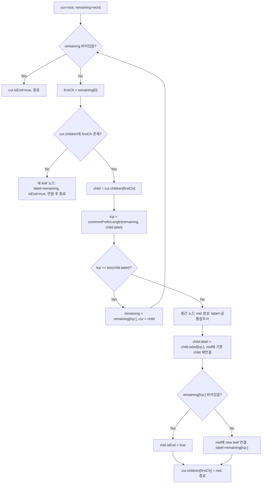

import { AlgorithmSimulation } from "#guide-sim";

# radixTree — 단일 자식 체인을 라벨 하나로 압축하면 트라이가 왜 가벼워지는가

## 한눈에 보는 컨셉

수백만 개의 단어를 저장할 때, 일반 트라이(Trie)는 글자 하나마다 노드를 하나씩 만들어서 노드 수가 저장된 글자 수만큼 불어나요. Radix Tree는 **자식이 하나뿐인 노드 체인을 통째로 하나의 문자열 라벨로 압축**해서, 노드 수를 삽입한 단어 수에 비례하도록 줄입니다. 압축을 하더라도 삽입·검색·접두사 검사는 모두 여전히 `O(단어 길이)`에 끝나요.

## 출발점: 가장 순진한 방법부터

문제를 정확히 잡을게요.

```ts
class RadixTree {
  insert(word: string): void
  search(word: string): boolean
  startsWith(prefix: string): boolean
}
```

`insert(word)`는 `word`를 자료구조에 저장합니다(반환값 없음). `search(word)`는 `word`가 이전에 `insert`된 적이 있으면 `true`를 반환하고, `startsWith(prefix)`는 `prefix`로 시작하는 단어가 하나라도 저장돼 있으면 `true`를 반환해요. 제약은 단어·접두사 길이 `L ≤ 10^5`, 삽입된 모든 단어의 길이 합이 `≤ 10^5`, 문자 집합은 소문자 알파벳입니다. 같은 단어를 여러 번 `insert`해도 오류 없이 동작해야 하고, 빈 자료구조에서 `search`나 `startsWith`를 호출하면 항상 `false`를 반환해야 해요.

가장 정직한 방법은 뭘까요? "단어를 저장하려면 글자 하나마다 자식 노드를 하나씩 만들면 된다"는 접근이 가장 자연스러워요. 바로 일반 트라이입니다.

```ts
class TrieNode {
  children: Map<string, TrieNode> = new Map();
  isEnd = false;
}

class TrieNaive {
  private root = new TrieNode();

  insert(word: string): void {
    let cur = this.root;
    for (const ch of word) {
      if (!cur.children.has(ch)) cur.children.set(ch, new TrieNode());
      cur = cur.children.get(ch)!;
    }
    cur.isEnd = true;
  }
}
```

작은 예로 직접 세어 봅시다. `"application"` 하나만 삽입해도, 글자 수만큼 노드가 만들어져요.

```text
insert("application")
루트 → 'a' → 'p' → 'p' → 'l' → 'i' → 'c' → 'a' → 't' → 'i' → 'o' → 'n' (isEnd)

노드 수 = "application".length = 11개   (실측: 11)
```

`"app"`, `"apple"`, `"application"`처럼 서로 접두사를 공유하는 단어가 많을 때, 이 접근은 낭비가 더 뚜렷해집니다. 이 세 단어를 실제로 모두 넣어 보면 노드는 총 **12개**(실측)가 만들어지는데, 그중 9개는 자식이 정확히 하나뿐인 "그냥 지나가는" 노드예요 — 루트 바로 아래 `'a'-'p'-'p'`로 이어지는 3개, 그리고 `'l'`에서 갈라진 뒤 `'i'-'c'-'a'-'t'-'i'-'o'`로 이어지는 6개가 그렇습니다(실측: 분기가 일어나는 `'l'` 노드만 자식이 2개고, `'e'`와 마지막 `'n'`은 자식 없는 leaf예요). 이 아홉 개 노드는 사실 "다음 글자가 무엇인가" 외에는 아무 정보도 갖고 있지 않아요. **자식이 하나뿐인 노드들을 굳이 따로따로 들고 있을 필요가 있을까?** — 이것이 다음 절의 출발 단서입니다.

## 아이디어 자세히 들여다보기

### 단일 자식 체인을 하나의 라벨로 압축하기 — 수식과 그림

핵심 관찰은 이렇습니다. 자식이 하나뿐인 노드 체인은 "분기점이 없는" 구간이라서, 그 구간에서 지나가는 글자들을 문자열 하나로 이어 붙여도 정보 손실이 없어요. 그래서 Radix Tree의 노드는 글자 하나가 아니라 **문자열 하나(라벨)**를 들고 있습니다.

```
RadixNode:
  children: Map<firstChar, RadixNode>   // 키 = 자식 라벨의 첫 글자
  label: string                          // 이 엣지 전체의 라벨
  isEnd: boolean                         // 여기서 끝나는 단어가 있는가
```

두 라벨을 비교할 때 핵심 연산은 **공통 접두사 길이**(longest common prefix)입니다.

$$\text{lcp}(a, b) = \max \{\, k \mid a[0..k-1] = b[0..k-1] \,\}$$

작은 입력으로 직접 채워 봅시다. `insert("app")`부터 시작해요. 루트에 `'a'`로 시작하는 자식이 없으니, `"app"` 전체를 라벨로 갖는 leaf를 하나 답니다.

```text
insert("app") 후:
*
  app (isEnd)
```

다음으로 `insert("apple")`을 해 볼게요. 루트의 `'a'` 자식은 라벨이 `"app"`이고, 남은 단어 `"apple"`과의 `lcp("apple", "app") = 3`으로 **라벨 전체 길이와 같습니다**. 즉 라벨을 통째로 소비했으니 그 자식으로 내려가서, 남은 부분 `"le"`로 다시 시작해요. `"app"` 노드에는 `'l'`로 시작하는 자식이 없으니 `"le"` 라벨의 leaf를 답니다.

```text
Before: *-app(isEnd)
insert("apple"): remaining="apple" → lcp("apple","app")=3=len("app") → "app"로 이동, remaining="le"
After:  *-app(isEnd)-le(isEnd)
```

이제 `insert("application")`이 흥미로운 경우예요. `"app"`를 소비하고 나면 remaining `"lication"`이 남고, `"app"` 노드에는 `'l'`로 시작하는 자식(`"le"`)이 이미 있습니다. `lcp("lication", "le") = 1`(둘 다 `'l'`로 시작하지만 그다음이 `i`와 `e`로 갈라져요) — 라벨 전체 길이(2)보다 짧으니, **엣지를 분할**해야 합니다.

```text
Before: *-app(isEnd)-le(isEnd)

분할 절차:
  공통 접두사 "l"로 중간 노드 mid를 만든다
  기존 "le"는 mid의 자식으로 재연결하되, 라벨을 "e"로 단축한다 (선두 "l"은 mid가 가져갔으므로)
  remaining("lication")의 나머지 "ication"은 mid의 새 자식 leaf로 붙인다

After:  *-app(isEnd)-l-e(isEnd)
                       └-ication(isEnd)
```

이 결과는 실제로 실행해서 확인한 값이에요 — `RadixTree`에 `"app"`, `"apple"`, `"application"`을 순서대로 삽입하면 노드 수는 정확히 **4개**(`app`, `l`, `e`, `ication`)로, 같은 세 단어를 일반 트라이에 넣었을 때의 **12개**(앞 절에서 실측한 값)와 대비됩니다.

잠깐, 확인 하나만 해 볼까요? 만약 라벨에 첫 글자만 저장해 두고 나머지는 버렸다면 어떻게 될까요? `"ban"`과 `"bat"`이 둘 다 `'b'`로 시작하는 라벨을 가진 경우, 첫 글자만으로는 두 라벨을 구별할 수 없어서 `search`와 `startsWith`가 남은 문자열과 라벨을 끝까지 비교할 방법이 없어져요. 그래서 `children` 맵의 **키**는 빠른 조회를 위해 첫 글자만 쓰지만, 노드 자체는 **라벨 전체 문자열**을 들고 있어야 합니다.

### 셈을 맡는 자료구조 — 해시맵(첫 글자 → 자식 노드)

각 노드의 `children`은 "라벨의 첫 글자 → 그 라벨을 가진 자식 노드"라는 대응이 필요해요. Radix Tree의 불변식(같은 부모의 자식들은 서로 다른 첫 글자를 가진다, 다음 절에서 증명합니다)이 성립하는 한, 첫 글자 하나로 자식을 유일하게 찾을 수 있으니 해시맵으로 평균 `O(1)` 조회가 가능합니다. 해시맵 자체의 동작 원리가 궁금하다면 이 프로젝트의 [hashMapChaining 가이드](../../../data-structures/hash/hashMapChaining/hashMapChaining-guide.mdx)를 참고하세요 — 여기서는 "첫 글자로 평균 `O(1)`에 자식을 찾는 표"로만 쓰면 충분합니다.

### 왜 모순 없이 작동하는가

이 알고리즘이 지키는 불변식은 하나입니다.

> 트리의 어느 노드에서도, 그 노드의 자식 엣지들은 서로 다른 첫 글자로 시작한다.

**기저**: 루트에 자식이 하나도 없는 초기 상태에서는 자명하게 성립합니다.

**귀납 가정**: 삽입 전까지 이 불변식이 성립한다고 하자.

**귀납 단계**: 새 단어를 삽입할 때 벌어질 수 있는 경우는 정확히 둘뿐이에요 — remaining의 첫 글자와 같은 첫 글자를 가진 자식이 (a) 없거나 (b) 있거나. 이 둘 외의 경우는 없습니다(자식 맵에 키가 있는지 없는지는 이분법적이니까요). (a)면 새 leaf를 그 첫 글자로 추가하니, 기존 자식들과 첫 글자가 겹칠 리 없어 불변식이 유지됩니다. (b)면 `lcp = commonPrefixLength(remaining, child.label)`을 계산해 다시 둘로 나뉩니다 — `lcp`가 `child.label`의 길이와 같으면(라벨 전체 소비) 그 자식으로 내려가 재귀적으로 같은 불변식을 적용하고, 그렇지 않으면 엣지를 분할합니다. 분할 후 mid의 두 자식은 각각 `child.label[lcp]`(기존 자식의 나머지 첫 글자)와 `remaining[lcp]`(새 단어의 나머지 첫 글자)로 시작하는데, `lcp`가 정의상 "일치하는 최대 길이"이므로 이 둘은 반드시 다릅니다(같았다면 `lcp`가 최소 1 더 컸어야 하죠). 따라서 분할 후에도 불변식이 유지돼요.

여기서 **헷갈리기 쉬운 포인트**가 둘 있습니다.

첫째, **엣지 분할 후 기존 자식을 재연결하는 것을 잊기 쉽습니다.** `insert("abc")` 후 `insert("ab")`를 예로 들어 볼게요.

```text
Before: *-abc(isEnd)

insert("ab"): remaining="ab", child.label="abc", lcp("ab","abc")=2 < len("abc")=3 → 분할
  mid = "ab" 노드, oldSuffix = "abc"[2:] = "c"
  기존 child의 label을 "c"로 단축하고 mid의 자식으로 연결
  remaining[2:] = "" → mid.isEnd = true (새 단어가 여기서 끝남)

After:  *-ab(isEnd)-c(isEnd)
```

`search("ab")`는 `true`, `search("abc")`도 `true`를 반환해야 정상인데(실측으로 둘 다 확인됨), 만약 분할 후 **부모의 `children` 참조를 `mid`로 업데이트하는 마지막 줄을 빠뜨리면** 무슨 일이 일어날까요? 부모는 여전히 옛 `child` 객체(라벨이 이미 `"c"`로 단축된)를 가리키게 됩니다. 실제로 그 상태로 두 검색을 실행해 보면, `search("ab")`와 `search("abc")` 둘 다 **`false`**가 나옵니다 — `remaining("ab" 또는 "abc")`이 `"c"`로 시작하지 않으니 `remaining.startsWith(child.label)` 검사에서 곧바로 걸리기 때문이에요. 방금 삽입한 단어들이 조용히 사라진 것처럼 보이는 거죠.

둘째, **빈 트리에서 `startsWith("")`를 무심코 처리하면 계약을 어깁니다.** "접두사가 빈 문자열이면 모든 단어가 그 접두사로 시작하니 무조건 `true`겠지"라고 생각하기 쉬운데, 이 문제의 계약은 "빈 자료구조에서는 `search`나 `startsWith`나 항상 `false`"라고 명시합니다. 실측으로 확인해 보면:

```text
빈 트리(아무것도 insert 안 함): startsWith("")  → false   (단어가 하나도 없으므로)
insert("apple")만 있는 트리:    startsWith("")  → true    (단어가 있으므로)
insert("")를 실제로 한 트리:    startsWith("")  → true
```

즉 `startsWith("")`가 `true`가 되는 조건은 "빈 문자열이 접두사라서"가 아니라 **"트리 안에 단어가 하나라도 있어서"**입니다. 이 구분을 놓치면 완전히 빈 트리에서도 무조건 `true`를 반환하는 조용한 버그가 생겨요.

엣지 케이스도 이 불변식 위에서 점검해 둡니다.

```text
빈 문자열 insert 후 search("")       → true  (루트에 isEnd 표시)
insert("abc") 후 search("ab")        → false (중간 노드, isEnd 없음)
insert("ab") 후 startsWith("abc")    → false (경로 자체가 없음)
같은 단어를 두 번 insert             → 노드 추가 없이 isEnd만 다시 true (중복 안전)
```

> 기억법: **"라벨 전체를 삼키면 내려가고, 중간에 걸리면 쪼갠다."** `lcp`가 자식 라벨 길이와 같은지 다른지, 그 하나로 모든 분기가 결정됩니다.

## 아이디어를 코드로 옮기기

앞 절의 규칙을 그대로 옮기면 됩니다.

```ts
class RadixNode {
  children: Map<string, RadixNode> = new Map();
  label: string;
  isEnd: boolean;

  constructor(label: string, isEnd = false) {
    this.label = label;
    this.isEnd = isEnd;
  }
}

function commonPrefixLength(a: string, b: string): number {
  const n = Math.min(a.length, b.length);
  let i = 0;
  while (i < n && a[i] === b[i]) i++;
  return i;
}

class RadixTree {
  private root = new RadixNode("");

  insert(word: string): void {
    let cur = this.root;
    let remaining = word;

    while (remaining !== "") {
      const firstCh = remaining[0]!;
      const child = cur.children.get(firstCh);

      if (!child) {
        cur.children.set(firstCh, new RadixNode(remaining, true));
        return;
      }

      const lcp = commonPrefixLength(remaining, child.label);

      if (lcp === child.label.length) {
        remaining = remaining.slice(lcp);
        cur = child;
        continue;
      }

      // 부분 일치 → 엣지 분할
      const mid = new RadixNode(child.label.slice(0, lcp));
      const oldSuffix = child.label.slice(lcp);
      child.label = oldSuffix;
      mid.children.set(oldSuffix[0]!, child);

      const newSuffix = remaining.slice(lcp);
      if (newSuffix === "") {
        mid.isEnd = true;
      } else {
        mid.children.set(newSuffix[0]!, new RadixNode(newSuffix, true));
      }

      cur.children.set(firstCh, mid); // 부모-자식 연결 업데이트
      return;
    }

    cur.isEnd = true;
  }

  search(word: string): boolean {
    let cur = this.root;
    let remaining = word;

    while (remaining !== "") {
      const firstCh = remaining[0]!;
      const child = cur.children.get(firstCh);
      if (!child) return false;
      if (!remaining.startsWith(child.label)) return false;
      remaining = remaining.slice(child.label.length);
      cur = child;
    }
    return cur.isEnd;
  }

  startsWith(prefix: string): boolean {
    let cur = this.root;
    let remaining = prefix;

    while (remaining !== "") {
      const firstCh = remaining[0]!;
      const child = cur.children.get(firstCh);
      if (!child) return false;
      const lcp = commonPrefixLength(remaining, child.label);
      if (lcp === remaining.length) return true; // prefix 완전 소비 → 존재
      if (lcp < child.label.length) return false; // 중간 불일치
      remaining = remaining.slice(lcp);
      cur = child;
    }
    return cur.isEnd || cur.children.size > 0; // remaining이 처음부터 ""였던 경우: 단어가 하나라도 있는지로 판정
  }
}
```

**가장 실수가 잦은 줄은 `insert`의 `cur.children.set(firstCh, mid);`입니다.** 앞 절에서 손으로 확인했듯, 이 줄을 빠뜨리면 부모는 라벨이 단축된 옛 자식을 계속 가리키게 되어 방금 삽입한 두 단어(`search("ab")`, `search("abc")`) 모두 조용히 `false`가 나옵니다. 그리고 `startsWith` 맨 마지막 줄 `return cur.isEnd || cur.children.size > 0;`도 놓치기 쉬운 지점이에요 — 이 줄은 `prefix`가 아예 빈 문자열이라 루프를 한 번도 안 돈 경우에만 실행되는데, 여기를 그냥 `return true`로 적으면 완전히 빈 트리에서도 `startsWith("")`가 `true`가 되어 "빈 자료구조는 항상 `false`"라는 계약을 어깁니다.

그 외에 살펴볼 지점은 다음과 같습니다.

- `remaining`은 while 루프를 돌 때마다 최소 1글자 이상 줄어듭니다(라벨 전체 소비든 분할이든 `lcp ≥ 1`이 보장되니까요) — 그래서 최대 `O(L)` 반복에 종료가 보장돼요.
- `insert`에서 remaining이 루프 중간에 `""`가 되는 것은 항상 `continue`로 도달하고, 그다음 while 조건 검사에서 루프를 빠져나와 `cur.isEnd = true`로 처리됩니다. 분할 분기에서 remaining이 `""`가 되는 경우(`newSuffix === ""`)는 `mid.isEnd = true`로 별도 처리해요 — 두 경로가 다르다는 점에 주의하세요.
- `search`는 `remaining.startsWith(child.label)`로 **라벨 전체**가 남은 문자열의 접두사인지 확인합니다. `startsWith`(접두사 검사 자체)는 라벨 전체까지는 필요 없고 `lcp === remaining.length`(prefix가 라벨 중간에서 끝나는 경우)만으로도 존재를 확정할 수 있다는 차이가 있어요 — 두 함수의 종료 조건이 미묘하게 다릅니다.

이 구현은 이미 처음 목표로 세운 `O(L)` 반복 횟수(각 반복에서 최소 1글자를 확정적으로 소비하므로 최대 `L`번)와 `O(k)`대의 노드 수(삽입한 서로 다른 단어 수 `k`에 비례, 실측으로 `app`/`apple`/`application` 세 단어에 노드 4개)를 그대로 달성합니다. 노드 수가 왜 `O(k)`인지 가볍게 납득해 볼게요 — 트리에 저장된 서로 다른 단어가 `k`개면, 각 단어는 정확히 하나의 노드에서 `isEnd=true`로 끝나야 하니 "단어의 끝을 표시하는 노드"는 최대 `k`개입니다. 그리고 자식이 2개 이상인 분기 노드는 부모 하나당 서로 다른 첫 글자를 가진 자식이 최소 2개 있어야 생기므로, 단어가 하나 늘어날 때마다 최대 1개씩만 새로 생겨 최대 `k-1`개예요. `insert`는 이 두 경우(새 leaf 추가, 분할로 인한 분기 노드 생성) 외에는 노드를 만들지 않으니(라벨만 소비하고 자식이 하나뿐인 "그냥 지나가는" 노드는 애초에 만들지 않습니다), 전체 노드 수는 최대 `2k-1`개 수준, 즉 `O(k)`로 눌러집니다. 다만 이건 **노드 개수**에 대한 결론이라는 점은 짚어 둘게요 — 각 노드가 들고 있는 라벨 문자열 자체의 총 길이는 여전히 삽입된 문자 총량(최대 `10^5`)에 비례합니다. 그러니 "가벼워진다"는 건 트리를 순회할 때 거치는 `Map`·객체 오버헤드가 단어 수에 비례하도록 줄어든다는 뜻이지, 전체 메모리 사용량이 `O(k)`가 된다는 뜻은 아니에요.

이 문제가 요구하는 범위 안에서는 일반 트라이에서 Radix Tree로의 압축이(출발점의 `TrieNaive`가 원형, 방금 본 `RadixTree`가 그 압축을 적용한 결과물입니다) 자연스러운 최적화 단계이고, 더 진행할 만한 알고리즘적 도약은 남아 있지 않습니다(노드 수를 `O(k)` 아래로, 혹은 반복 횟수를 `O(L)` 아래로 더 줄일 근거가 없다는 뜻이에요). 물론 구현 세부를 더 다듬을 여지는 남아 있습니다 — 고정된 소문자 알파벳이라는 제약을 살려 `Map` 대신 크기 26 배열을 쓰거나, `slice`로 매번 새 문자열을 만드는 대신 시작 인덱스만 옮겨 다니는 식으로요. 참고로 PATRICIA trie는 흔히 "비트 단위로 접두사를 압축하는 이진 trie"로 소개되지만, 본질적으로는 지금 다룬 것과 같은 경로 압축(path compression) 계열의 친척입니다 — 다만 압축 단위를 문자가 아니라 비트로 더 잘게 쪼갠다는 차이가 있고, 이 문제의 소문자 알파벳 범위에서는 필요하지 않은 특화입니다.

## 실행 시각화

고정 시퀀스 `insert("app")`, `insert("apple")`, `insert("application")`, 그리고 `search("app")`, `startsWith("ap")`를 실행하는 과정입니다. tree 패널은 Radix Tree의 현재 구조를 보여주고, 노드 라벨은 압축된 엣지 문자열이에요. 상태색은 `active`(현재 탐색·분할 노드), `visited`(단어 끝 `isEnd=true` 노드)를 뜻합니다. keyValue 패널은 현재 연산과 반환값을 보여줘요. 실제 반환값은 `search("app") = true`, `startsWith("ap") = true`이며, 앞 절에서 실행해 확인한 값과 정확히 일치합니다(같은 세 단어를 일반 트라이에 넣으면 노드 12개가 필요했을 자리를, Radix Tree는 노드 4개로 압축합니다).

> 대화형 시뮬레이션은 MDX 런타임에서 표시됩니다.

export const steps = [
  {
    title: "초기: 빈 트리",
    detail: "루트만 존재.",
    root: { id: "root", label: "*" },
    entries: [{ label: "연산", value: "초기화" }, { label: "반환", value: "-" }],
  },
  {
    title: 'insert("app")',
    detail: "루트에 'a' 자식 없음 → 라벨 'app' leaf 추가, isEnd=true.",
    root: {
      id: "root", label: "*",
      children: [{ id: "app", label: "app", status: "visited" }],
    },
    entries: [{ label: "연산", value: 'insert("app")' }, { label: "반환", value: "void" }],
  },
  {
    title: 'insert("apple")',
    detail: "라벨 'app' 전체 소비(lcp=3) → 'app' 노드로 이동, remaining='le'. 'l' 자식 없음 → leaf 'le' 추가.",
    root: {
      id: "root", label: "*",
      children: [{ id: "app", label: "app", status: "visited", children: [
        { id: "le", label: "le", status: "visited" },
      ] }],
    },
    entries: [{ label: "연산", value: 'insert("apple")' }, { label: "반환", value: "void" }],
  },
  {
    title: 'insert("application") — 엣지 분할',
    detail: "'app' 소비 후 remaining='lication'. 'le'와 lcp=1('l') < 길이 → 'l' 중간 노드로 분할. 기존 'le'는 'e'로, 새 leaf 'ication' 추가.",
    root: {
      id: "root", label: "*",
      children: [{ id: "app", label: "app", status: "visited", children: [
        { id: "l", label: "l", status: "active", children: [
          { id: "e", label: "e", status: "visited" },
          { id: "ication", label: "ication", status: "visited" },
        ] },
      ] }],
    },
    entries: [{ label: "연산", value: 'insert("application")' }, { label: "반환", value: "void" }],
  },
  {
    title: 'search("app")',
    detail: "'a' 자식 'app', remaining.startsWith('app') → remaining=''. cur.isEnd=true → true.",
    root: {
      id: "root", label: "*",
      children: [{ id: "app", label: "app", status: "active", children: [
        { id: "l", label: "l", children: [
          { id: "e", label: "e", status: "visited" },
          { id: "ication", label: "ication", status: "visited" },
        ] },
      ] }],
    },
    entries: [{ label: "연산", value: 'search("app")' }, { label: "isEnd", value: "true" }, { label: "반환", value: "true" }],
  },
  {
    title: 'startsWith("ap")',
    detail: "'a' 자식 'app', lcp('ap','app')=2=len(remaining) → prefix 완전 소비 → true.",
    root: {
      id: "root", label: "*",
      children: [{ id: "app", label: "app", status: "active", children: [
        { id: "l", label: "l", children: [
          { id: "e", label: "e", status: "visited" },
          { id: "ication", label: "ication", status: "visited" },
        ] },
      ] }],
    },
    entries: [{ label: "연산", value: 'startsWith("ap")' }, { label: "lcp == len(prefix)", value: "true" }, { label: "반환", value: "true" }],
  },
];

<AlgorithmSimulation view={["tree", "keyValue"]} steps={steps} title="Radix Tree: insert/search/startsWith" />

## 흐름 한눈에 보기



## 스스로 점검하기

1. 빈 `RadixTree`에 `insert("cat")`, `insert("car")`를 순서대로 실행한 뒤, 트리 구조를 손으로 그려 보세요. 그리고 `search("ca")`의 결과도 적어 보세요. (트리는 `* → "ca" → { "t"(isEnd), "r"(isEnd) }` 형태가 되고, `search("ca")`는 중간 노드에 `isEnd`가 없으므로 `false`입니다.)
2. `insert`의 마지막 줄 `cur.children.set(firstCh, mid);`을 빼먹고 `insert("abc")` 후 `insert("ab")`를 실행하면, `search("ab")`와 `search("abc")`는 각각 어떤 값을 반환할까요? 왜 그런 값이 나오는지 `child.label`이 가리키는 대상을 따라가며 설명해 보세요.
3. 이 자료구조에 `delete(word): void` 연산을 추가한다면, 단순히 해당 leaf의 `isEnd`를 `false`로만 바꿔서 될까요, 아니면 노드를 지우거나 합치는 후처리가 필요할까요? `insert("app")`, `insert("apple")` 상태에서 `delete("apple")`을 한다고 생각하며 답해 보세요. (힌트: `isEnd=false`로 바꾸는 것만으로는 부족합니다 — `"le"` 노드를 그대로 남겨 두면 `search("apple")`은 `isEnd` 검사 덕분에 정상적으로 `false`가 되지만, `startsWith("appl")`이나 `startsWith("apple")`은 여전히 그 죽은 경로를 타고 내려가 `true`를 반환하는 조용한 버그가 생깁니다(실측으로 확인된 값이에요) — 트리 안에 `"apple"`로 시작하는 단어가 더 이상 없는데도요. 그러니 `isEnd`가 `false`가 되면서 자식도 없어진 leaf(`"le"`)는 실제로 제거해야 하고, 제거한 뒤 부모(`"app"`)에 자식이 하나도 안 남았다면 그걸로 끝입니다. 만약 `"app"`이 그 자체로 저장된 단어가 아니었다면, `"app"` 노드에 남는 자식이 정확히 하나뿐인 상황이 생기므로 그 하나 남은 자식과 라벨을 다시 합치는 역방향 압축까지 해야 노드 수가 계속 최소로 유지됩니다.)
