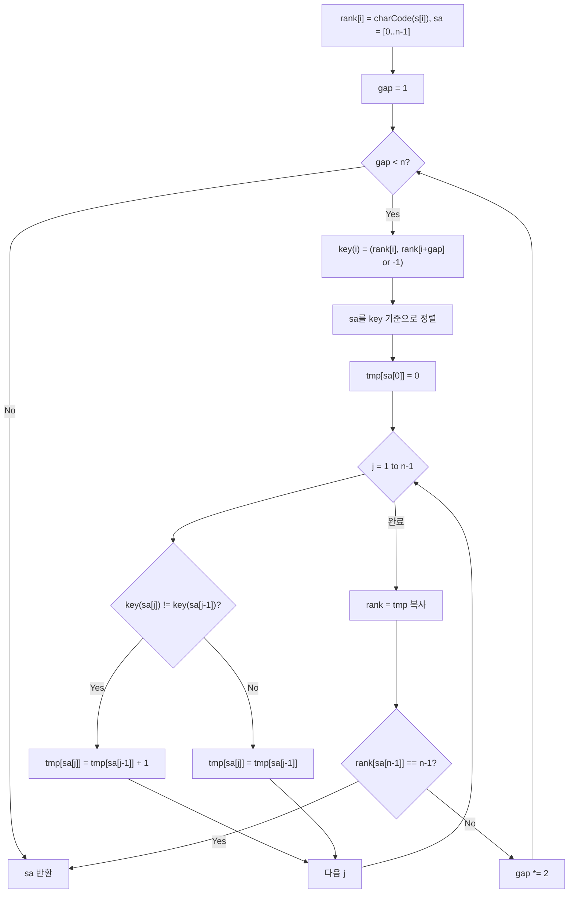

import { AlgorithmSimulation } from "#guide-sim";

# 접미사 배열(Suffix Array) — 문자열 비교를 정수 쌍 비교로 바꿔치기하는 배가(doubling) 기법

## 한눈에 보는 컨셉

문자열의 모든 접미사를 사전순으로 정렬해야 하는데, 접미사끼리 직접 문자열 비교를 하면 한 번 비교에도 `O(n)`이 들어 전체가 `O(n^2 log n)`으로 터집니다. 배가(doubling) 알고리즘의 핵심 관찰은 "길이 `2^k`까지 정렬된 순위를 이미 알고 있다면, 그 순위 두 개를 정수 쌍으로 묶어 비교하는 것만으로 길이 `2^(k+1)`의 순위를 구할 수 있다"는 것입니다. 이 갱신을 `O(log n)`번 반복하면 모든 접미사가 유일한 순위를 갖게 되어, 전체가 `O(n log n)`(정렬 방법에 따라 `O(n log^2 n)`)에 끝납니다.

## 출발점: 가장 순진한 방법부터

문제를 먼저 정확히 고정할게요.

```ts
function suffixArray(s: string): number[]
```

| 항목 | 내용 |
|------|------|
| 입력 `s` | 소문자 알파벳 문자열, `1 <= |s| <= 10^5` |
| 반환 | 길이 `n = |s|`인 정수 배열. `result[k] = i` ⟺ `s[i..n-1]`이 사전순으로 `(k+1)`번째로 작은 접미사 |
| 시간 제한 | 1초 |

**엣지 케이스** (뒤에서 직접 실행해 확인한 값입니다):

| `s` | 반환값 |
|-----|--------|
| `"a"` | `[0]` |
| `"aaaa"` | `[3, 2, 1, 0]` |
| `"abc"` | `[0, 1, 2]` |
| `"banana"` | `[5, 3, 1, 0, 4, 2]` |

"모든 접미사를 사전순으로 정렬하라"는 요구를 보면 가장 정직한 생각은 하나예요 — **접미사를 그냥 일반 정렬(comparison sort)에 넣자**는 것입니다. 비교 함수만 "두 접미사 중 어느 쪽이 사전순으로 앞인지"로 정의하면 됩니다.

```ts
function suffixArrayNaive(s: string): number[] {
  const n = s.length;
  const sa = Array.from({ length: n }, (_, i) => i);
  sa.sort((i, j) => (s.slice(i) < s.slice(j) ? -1 : s.slice(i) > s.slice(j) ? 1 : 0));
  return sa;
}
```

작게 확인해 봅시다. `s = "aaab"`의 접미사는 `0:"aaab"`, `1:"aab"`, `2:"ab"`, `3:"b"`입니다. `suffixArrayNaive("aaab")`을 실제로 돌리면 `[0, 1, 2, 3]`이 나옵니다 — 이미 인덱스 순서 그대로가 정렬 결과라는 뜻이에요. 그런데 이 비교 하나가 얼마나 비쌌는지 봅시다. 접미사 0(`"aaab"`)과 접미사 1(`"aab"`)을 비교하면:

```text
"aaab"
"aab"
 a a a b     ← 문자 0: a=a 일치
             ← 문자 1: a=a 일치
             ← 문자 2: a vs b → 불일치, 여기서 판정

일치 2회 + 판정 1회 = 총 3회 문자 비교 (실측: 위 로직 그대로 실행해 확인한 값)
```

두 접미사가 공통 접두사를 길게 공유할수록 비교 한 번의 비용이 커집니다. `s`가 `"aaa...ab"`처럼 `a`가 `n-1`개 이어지다 마지막에 `b` 하나만 다른 극단적인 경우, 인접한 접미사끼리 비교할 때마다 최악 `O(n)`의 문자 비교가 필요해요. 정렬 자체가 `O(n log n)`번의 비교를 요구하니:

```text
비교 1회       : 최악 O(n)
비교 정렬 전체 : O(n log n) 번 비교 × O(n) = O(n^2 log n)

n = 10^5 이면  : n^2 ≈ 10^10,  log2(n) ≈ 17
               → O(n^2 log n) ≈ 1.7 × 10^11 회 문자 비교 → 1초 안에 불가능
```

접미사 문자열을 실제로 잘라서 들고 있으면 공간도 `O(n^2)`으로 터집니다. 낭비의 원인은 명확해요 — **매번 접미사를 처음부터 끝까지 다시 비교**한다는 것입니다. "이미 어느 정도 순서를 알고 있는 상태를 재사용할 수는 없을까?" 이것이 다음 절의 출발 단서입니다.

## 아이디어 자세히 들여다보기

### 길이를 두 배씩 늘려가며 순위 매기기 — 수식과 그림

핵심 직관은 이렇습니다. **접미사 전체를 한 번에 비교하는 대신, 아주 짧은 접두사(길이 1)의 순위부터 매기고, 그 순위를 재료 삼아 길이를 2배씩 늘려간다**는 것이에요. 짧은 구간의 순서를 이미 안다면, 그 둘을 이어붙인 순서는 문자열을 다시 훑지 않고 순위 두 개만 비교해도 알 수 있습니다.

정식으로, 라운드 `k`에서 유지하는 상태를 이렇게 정의합니다.

$$\text{rank}_k[i] = \text{접미사 } s[i \ldots] \text{의 길이 } 2^k \text{ 접두사의 사전 순위} \quad (0 \le \text{rank}_k[i] < n)$$

이 정의가 정확히 뭘 보장해야 하는지 짚고 갈게요. `rank_k`가 "사전 순위"이려면 다음 성질(iff, 필요충분조건)이 성립해야 합니다.

$$\text{rank}_k[i] < \text{rank}_k[j] \iff \text{두 길이 } 2^k \text{ 접두사 중 } s[i..]\text{ 쪽이 사전순으로 작다}$$
$$\text{rank}_k[i] = \text{rank}_k[j] \iff \text{두 길이 } 2^k \text{ 접두사가 완전히 같다}$$

즉 대소 관계와 동치 관계 둘 다 정확히 보존하는 "압축 순위"여야 하고, 아래 귀납 논증은 이 성질이 라운드마다 유지된다는 것을 보입니다.

초기값(`k = 0`, 길이 1 접두사)은 문자 하나의 순위이니 문자 코드로 잡으면 됩니다.

$$\text{rank}_0[i] = \text{charCode}(s[i])$$

여기서 짚어 둘 것이 하나 있어요. `charCode(s[i])`는 `[0, n-1]` 범위로 압축된 순위가 아니라 `a=97, b=98, ...`처럼 문자 집합 크기만큼 벌어진 값입니다. 하지만 위에서 요구한 두 성질(대소·동치 보존)은 값의 절대 범위와 무관하게 성립해요 — 문자 코드의 대소 관계 자체가 이미 알파벳 순서와 같기 때문입니다. 그래서 `rank_0[i] = charCode(s[i])`를 그대로 써도 `rank_0`의 정의(iff 성질)는 깨지지 않습니다. 다만 `gap`이 커지며 `key`의 두 성분을 합친 값의 범위를 다룰 때는 항상 "현재 `rank` 배열의 최댓값"을 기준으로 삼아야지, `n`이라는 상수로 못박으면 안 됩니다(뒤의 최적화 코드에서 `Math.max(...rank)`로 매번 실측하는 이유가 이것입니다). 앞으로 나올 `banana` 예시에서는 계산을 간단히 하려고 `a=0, b=1, n=2`로 정규화한 값을 씁니다 — 대소 관계만 같으면 결과(`sa`)는 정규화 여부와 무관하게 동일합니다(뒤에서 실행값으로 확인합니다).

`s = "banana"`로 직접 채워 봅시다(문자 코드는 a=97, b=98, n=110이지만, 상대 순서만 중요하므로 a=0, b=1, n=2로 정규화해도 같은 결과가 나옵니다 — 뒤에서 실행값으로 확인합니다).

```text
i:        0    1    2    3    4    5
s[i]:     b    a    n    a    n    a
rank_0:   1    0    2    0    2    0     (a=0, b=1, n=2)
```

라운드 `k`에서 `k+1`로 넘어갈 때, 접미사 `s[i..]`의 길이 `2^{k+1}` 접두사는 길이 `2^k`짜리 두 조각으로 쪼갤 수 있어요: `(s[i..i+2^k-1], s[i+2^k..i+2^{k+1}-1])`. 이 두 조각의 순위가 각각 `rank_k[i]`와 `rank_k[i+2^k]`이므로, 다음 키를 정의합니다.

$$\text{key}(i) = \bigl(\text{rank}_k[i],\ \text{rank}_k[i + \text{gap}]\bigr), \qquad \text{gap} = 2^k$$

(단, `i + gap >= n`이면 범위 밖이므로 `rank_k[i+gap] = -1`로 취급합니다 — 이유는 뒤에서 자세히 다룹니다.)

이 key로 `sa`를 정렬한 뒤 새 순위를 부여합니다: 같은 key면 같은 순위, key가 바뀌는 지점에서만 순위를 1 올립니다.

**왜 하필 "정수 쌍"이라는 형태여야 할까요?** 대안으로 접미사 문자열 자체를 계속 들고 다니며 직접 비교하는 방법도 있습니다. 하지만 그러면 문자열 길이가 라운드마다 2배로 늘어나 비교 비용도 함께 늘어나요. 반면 순위를 정수 하나로 뭉치면, 아무리 접두사가 길어져도 비교는 **정수 두 개 비교, 즉 `O(1)`**로 고정됩니다. "정보를 압축해서 들고 다닌다"는 것이 이 정의의 요점이에요.

잠깐 확인해 볼까요? `gap = 1`일 때 `i = 4`의 key는 무엇일까요? `rank_0[4] = 2`(n), 그리고 `i + gap = 5 < 6`이니 범위 안이라 `rank_0[5] = 0`(a)을 그대로 씁니다. 따라서 `key(4) = (2, 0)`이에요. 실제로 뒤의 실행 시각화에서 이 값을 그대로 확인할 수 있습니다.

정렬 후 순위를 재부여하는 점화식은 다음과 같습니다. `sa`를 key 기준으로 정렬했다고 할 때:

$$\text{rank}_{k+1}[\text{sa}[0]] = 0$$

$$\text{rank}_{k+1}[\text{sa}[j]] = \text{rank}_{k+1}[\text{sa}[j-1]] + \begin{cases} 1 & \text{key}(\text{sa}[j]) \neq \text{key}(\text{sa}[j-1]) \\ 0 & \text{key}(\text{sa}[j]) = \text{key}(\text{sa}[j-1]) \end{cases}$$

첫째 항은 "이전 원소와 key가 다르면 새 순위를 준다"는 뜻이고, 둘째 항은 "같은 key면 아직 구분이 안 됐으니 같은 순위를 유지한다"는 뜻이에요.

**종료 조건**은 간단합니다: `rank[sa[n-1]] == n - 1`이면(가장 큰 순위가 정확히 `n-1`이면) 순위가 모두 서로 다르다는 뜻이므로 그 자리에서 멈춰도 됩니다. 왜 이 한 줄 검사로 충분할까요? 바로 위 점화식을 보면 `rank_{k+1}`은 `sa[0]`에서 `0`으로 시작해서, key가 바뀔 때만 정확히 `1`씩 증가하는 **빈틈없이 조밀한(dense) 정수열**입니다. 즉 서로 다른 key 값의 개수가 곧 "최댓값 + 1"과 같아요. 그러니 최댓값(`rank[sa[n-1]]`)이 `n - 1`이면 서로 다른 key가 정확히 `n`개, 다시 말해 접미사 `n`개가 전부 서로 다른 순위를 갖는다는 뜻이 됩니다. 이 조밀성은 반드시 "그 라운드의 key로 `sa`를 정렬한 직후"에만 성립하므로, 검사도 정렬·재부여가 끝난 뒤에 해야 합니다.

### 단서를 설명해 주는 이론 — Counting Sort와 LSD Radix Sort

앞 절에서 나온 key는 `(rank[i], rank[i+gap])`라는 **정수 쌍**이고, 각 성분은 `[-1, n-1]` 범위 안에 있습니다. 즉 값의 범위가 입력 크기 `n`으로 딱 묶여 있어요. 이런 상황을 위한 표준 도구가 **Counting Sort(계수 정렬)**이고, 이를 여러 자리(digit)로 확장한 것이 **Radix Sort(기수 정렬)**입니다. 뒤의 최적화 절에서 이 이론을 그대로 사용할 것이니 기억해 두세요.

**Counting Sort의 동작**: 정렬할 값이 `[0, k]` 범위의 정수라면,

1. `count[v]` = 값 `v`가 몇 번 등장하는지 센다.
2. `count`를 누적합으로 바꾼다 — `count[v]`는 이제 "값이 `v` 이하인 원소가 몇 개인지"가 된다.
3. 원본 배열을 **뒤에서부터** 순회하며, 각 원소마다 먼저 `count[값]`을 1 줄인 뒤 그 줄어든 값을 위치로 삼아 그 자리에 원소를 놓는다. (0-based 배열에서는 누적합 `count[값]`이 "값 이하인 원소 개수"이므로, 그 값의 마지막 배치 자리는 인덱스로 `count[값] - 1`입니다. 그래서 먼저 감소시킨 뒤 그 위치에 놓아야 합니다 — 놓고 나서 감소시키면 한 칸 밀립니다.)

3단계에서 뒤에서부터 순회하는 이유는 **안정성(stability)** 때문입니다 — 같은 값을 가진 원소들의 상대 순서가 유지돼야 다음 단계(자리)의 정렬 결과가 망가지지 않아요. 비교가 아니라 위치 계산으로 배치하므로 전체가 `O(n + k)`입니다(`k`는 값의 범위).

**두 자리 키로 확장(LSD Radix Sort)**: `(첫째 성분, 둘째 성분)` 쌍을 사전식으로 정렬하려면, **낮은 자리(둘째 성분)부터 안정 정렬하고, 그다음 높은 자리(첫째 성분)로 다시 안정 정렬**합니다. 안정 정렬을 자리 순서대로 누적 적용하면, 상위 자리가 같은 원소들 사이에서는 하위 자리 정렬 결과가 그대로 보존되기 때문에 최종적으로 사전식 정렬이 완성됩니다. 이 문제에서는 자리가 2개(`rank[i]`, `rank[i+gap]`)뿐이니 Counting Sort를 두 번 적용하면 됩니다 — 각 회당 `O(n)`, 라운드당 `O(n)`.

### 왜 모순 없이 작동하는가

이 알고리즘이 지키는 불변식은 하나예요.

> 라운드 `k` 종료 시, `rank_k[i]`는 `s[i .. i+2^k-1]`(길이 `2^k` 접두사, 짧으면 끝까지)의 사전 순위를 정확히 반영한다.

**기저(k=0)**: `rank_0[i] = charCode(s[i])`는 길이 1 접두사의 사전 순위 그 자체입니다. 문자 코드의 대소 관계가 곧 사전순 대소 관계이므로 성립합니다.

**귀납 단계(k → k+1)**: 귀납 가정으로 `rank_k`가 정확하다고 합시다. 두 접미사 `s[i..]`와 `s[j..]`의 길이 `2^{k+1}` 접두사를 비교하는 경우의 수는 정확히 둘로 나뉩니다(경우의 완전성).

- **첫 반쪽이 다르다** (`rank_k[i] != rank_k[j]`): 첫 반쪽만으로 이미 대소가 결정되므로, `key`의 첫째 성분 비교만으로 정확한 순서가 나옵니다.
- **첫 반쪽이 같다** (`rank_k[i] == rank_k[j]`): 이 경우 대소는 반드시 둘째 반쪽(`s[i+2^k..]`와 `s[j+2^k..]`의 길이 `2^k` 접두사)에서 갈립니다. 귀납 가정에 의해 `rank_k[i+2^k]`와 `rank_k[j+2^k]`가 바로 이 둘째 반쪽의 정확한 순위이므로, `key`의 둘째 성분 비교가 정확한 순서를 줍니다.

두 경우 모두 `key` 튜플의 사전식 비교가 실제 문자열 비교와 정확히 일치하므로, `key` 기준 정렬 결과가 곧 길이 `2^{k+1}` 접두사 기준 정렬 결과입니다(각 경우의 최적성). 그리고 정렬 결과에서 "key가 바뀌는 지점마다 순위를 1 올리는" 재부여 규칙은 이 사전식 순서를 그대로 정수 순위로 옮긴 것이므로 `rank_{k+1}`도 정확합니다.

`2^k >= n`이 되면 길이 `n`짜리 접두사, 즉 접미사 전체가 커버되므로 서로 다른 접미사는 반드시 서로 다른 순위를 갖습니다(문자열 자체가 다르므로). 따라서 최대 `⌈log_2 n⌉` 라운드면 충분합니다 — `n = 6`이면 `⌈log_2 6⌉ = 3`이지만, 뒤 시뮬레이션에서 보듯 `banana`는 조기 종료 조건 덕분에 2라운드 만에 끝납니다(직접 실행해 확인한 값입니다).

**여기서 헷갈리기 쉬운 포인트는 범위 밖 순위를 "-1"이 아니라 "아주 큰 값(sentinel)"으로 처리해도 된다고 생각하는 것입니다.** "접미사가 짧아서 비교할 게 없으니 크게 처리하자"는 직관은 그럴듯해 보이지만 정반대예요. 사전순 비교 규칙에서 **더 짧은 문자열은 공통 접두사만큼 같으면 항상 더 작습니다**(`"a"` < `"ab"`). 즉 "범위를 벗어난다 = 비교할 문자가 없다 = 가장 작은 값으로 취급"이 맞습니다. 이걸 기호로 다시 쓰면: 정상적인 `rank` 값은 항상 `0` 이상이고 sentinel은 `-1`이므로, 첫째 성분이 같은 두 key를 비교할 때 `(x, -1) < (x, r)`이 `r >= 0`인 모든 경우에 성립합니다 — 그래서 접두사가 짧아 범위를 벗어난 쪽이 항상 그 그룹에서 맨 앞에 옵니다. 실제로 `-1` 대신 `999`를 sentinel로 써서 `"banana"`를 돌려 보면:

```text
정상(-1 사용):        [5, 3, 1, 0, 4, 2]
잘못된 sentinel(999):  [1, 3, 5, 0, 2, 4]

접미사 5("a")가 맨 앞이어야 하는데, sentinel을 999로 두면
"a"의 key 둘째 성분이 999(크게 취급)가 되어 뒤로 밀려납니다.
```

(위 두 배열 모두 실제 코드를 실행해 확인한 값입니다 — 뒤 실행 시각화의 최종 sa와 첫 번째 줄이 일치합니다.)

엣지 케이스도 이 불변식 위에서 짚어 둘게요.

```text
n = 1               → gap < n(=1)이 처음부터 거짓 → 루프 한 번도 안 돌고 [0] 반환
모든 문자 동일(aaaa) → rank_0가 전부 같아 첫 라운드에서 구분이 안 되지만,
                       라운드가 진행될수록 "짧은 접미사일수록 작다" 규칙으로 서서히 갈라짐
                       → 4개면 최대 ⌈log2 4⌉=2 라운드 안에 확정
```

## 아이디어를 코드로 옮기기

```ts
function suffixArray(s: string): number[] {
  const n = s.length;
  let sa = Array.from({ length: n }, (_, i) => i);
  let rank = Array.from({ length: n }, (_, i) => s.charCodeAt(i));
  let tmp = new Array<number>(n);

  let gap = 1;
  while (gap < n) {
    const key = (i: number): [number, number] => [rank[i], i + gap < n ? rank[i + gap] : -1];

    sa.sort((a, b) => {
      const [a0, a1] = key(a);
      const [b0, b1] = key(b);
      if (a0 !== b0) return a0 - b0;
      return a1 - b1;
    });

    tmp[sa[0]] = 0;
    for (let j = 1; j < n; j++) {
      const [pk0, pk1] = key(sa[j - 1]);
      const [ck0, ck1] = key(sa[j]);
      tmp[sa[j]] = tmp[sa[j - 1]] + (ck0 !== pk0 || ck1 !== pk1 ? 1 : 0);
    }
    rank = tmp.slice();

    if (rank[sa[n - 1]] === n - 1) break; // 모든 순위 고유 → 조기 종료

    gap *= 2;
  }

  return sa;
}
```

**가장 실수가 잦은 줄은 `rank = tmp.slice()`입니다.** 새 순위를 계산하는 동안 `rank[sa[j-1]]`을 계속 읽어야 하는데, 만약 별도의 `tmp` 배열 없이 `rank`를 그 자리에서 바로 덮어쓰면 **아직 읽어야 할 이전 라운드 값이 이미 새 값으로 오염된 뒤 읽히는** 사고가 납니다. `tmp` 없이 직접 `rank[sa[j]] = ...`로 덮어쓰도록 바꿔서 `s = "aabbbbaaabba"`를 돌려 보면, 정상 결과 `[11,6,7,0,8,1,10,5,9,4,3,2]`와 달리 `[11,0,6,7,1,8,5,10,2,3,4,9]`가 나옵니다 — 첫 원소(11)만 우연히 같고 그 뒤 나머지 인덱스는 전부 어긋납니다(직접 두 버전을 실행해 비교한 값입니다). 반드시 새 배열에 다 채운 뒤 `rank`를 통째로 교체해야 안전해요.

그 외에 짚어 둘 지점:

- `key(i)`에서 `i + gap < n` 가드가 먼저입니다. 이 가드를 빼먹으면 `rank[i+gap]`이 배열 범위를 벗어나 `undefined`를 읽고, 비교가 `NaN`을 낳아 정렬이 깨집니다.
- `sa.sort`의 비교 함수는 **첫째 성분이 다르면 그 차이로, 같으면 둘째 성분의 차이로** 반환합니다 — 튜플의 사전식 비교를 그대로 코드로 옮긴 부분이라 순서를 바꾸면 안 됩니다.

## 더 빠르게 만들 단서 찾기

지금 코드는 라운드마다 `sa.sort(...)`라는 **일반 비교 정렬**을 씁니다. 비교 정렬은 원소가 무엇이든(문자열이든, 임의 객체든) 동작하는 대신 `O(n log n)`번의 비교가 필요해요. 그런데 우리가 정렬하는 값은 임의의 값이 아니라 **`[-1, n-1]` 범위에 딱 갇힌 정수 쌍**입니다.

```text
일반 비교 정렬이 하는 일:  원소가 무엇이든 상관없이 "둘을 비교"만 O(log n)번 반복
                          → 값의 범위가 좁다는 정보를 전혀 활용하지 않는다

실제 우리 키:              (rank[i], rank[i+gap]),  둘 다 [-1, n-1] 안의 정수
                          → 범위가 n으로 고정되어 있다는 강한 정보가 있는데 버려지고 있다
```

라운드당 `O(n log n)`이 `O(log n)`번 반복되니 총 `O(n log^2 n)`입니다. `n = 10^5`이면 `log2(n) ≈ 17`이라 `n log^2 n ≈ 10^5 \times 17^2 ≈ 2.9 \times 10^7`로 이미 통과권이긴 하지만, 앞서 "단서를 설명해 주는 이론" 절에서 예고한 대로 **정수 범위가 좁다**는 사실을 그대로 살리면 라운드당 비용을 `O(n log n)`에서 `O(n)`으로 낮출 수 있습니다.

## 단서를 최적화로 연결하기

앞서 "단서를 설명해 주는 이론" 절에서 다룬 **Counting Sort를 두 번(LSD Radix Sort)** 적용하면 됩니다. 낮은 자리(`rank[i+gap]`, 둘째 성분)로 먼저 안정 정렬하고, 그 결과를 높은 자리(`rank[i]`, 첫째 성분)로 다시 안정 정렬하는 겁니다.

```text
Before: sa.sort(key 튜플 비교)                    → 라운드당 O(n log n)
After:  countingSortBy(secondKey) 한 번           → O(n)
        countingSortBy(firstKey)  한 번 더        → O(n)
        (안정 정렬을 낮은 자리 → 높은 자리 순으로 누적 적용 = 결과는 튜플 사전식 정렬과 동일)

라운드 비용:  O(n log n)  →  O(n)
전체 비용:    O(n log^2 n) →  O(n log n)
```

**패스 순서가 핵심 불변식입니다.** 반드시 "둘째 성분 먼저, 첫째 성분 나중"이어야 하고, 각 패스는 반드시 안정 정렬(같은 값이면 원래 순서를 보존)이어야 합니다. 순서를 바꾸거나 안정성이 깨지면 최종 정렬이 조용히 틀어집니다 — 다음 절 코드에서 직접 확인해요.

## 최적화 코드

바뀌는 곳은 정렬 부분뿐입니다. 안정 counting sort 헬퍼를 하나 추가하고, `sa.sort(...)`를 두 번의 `countingSortBy` 호출로 바꿉니다.

```ts
function countingSortBy(order: number[], keyFn: (i: number) => number, maxVal: number): number[] {
  // 키 범위 [-1, maxVal]를 [0, maxVal+1]로 한 칸 shift해서 count 배열 인덱스로 쓴다.
  const count = new Array(maxVal + 2).fill(0);
  for (const i of order) count[keyFn(i) + 1]++;
  for (let k = 1; k < count.length; k++) count[k] += count[k - 1]; // 누적합
  const result = new Array(order.length);
  for (let idx = order.length - 1; idx >= 0; idx--) { // 뒤에서부터: 안정성 보장
    const i = order[idx];
    const pos = --count[keyFn(i) + 1];
    result[pos] = i;
  }
  return result;
}

function suffixArrayFast(s: string): number[] {
  const n = s.length;
  let sa = Array.from({ length: n }, (_, i) => i);
  let rank = Array.from({ length: n }, (_, i) => s.charCodeAt(i));
  let tmp = new Array<number>(n);

  let gap = 1;
  while (gap < n) {
    const firstKey = (i: number) => rank[i];
    const secondKey = (i: number) => (i + gap < n ? rank[i + gap] : -1);
    const maxVal = Math.max(...rank);

    let order = countingSortBy(sa, secondKey, maxVal); // ① 둘째 성분(낮은 자리) 먼저
    order = countingSortBy(order, firstKey, maxVal);   // ② 첫째 성분(높은 자리) 나중
    sa = order;

    tmp[sa[0]] = 0;
    for (let j = 1; j < n; j++) {
      const same = firstKey(sa[j]) === firstKey(sa[j - 1]) && secondKey(sa[j]) === secondKey(sa[j - 1]);
      tmp[sa[j]] = tmp[sa[j - 1]] + (same ? 0 : 1);
    }
    rank = tmp.slice();

    if (rank[sa[n - 1]] === n - 1) break;
    gap *= 2;
  }

  return sa;
}
```

**가장 중요한 두 줄은 `①`, `②`로 표시한 두 번의 `countingSortBy` 호출과 그 순서입니다.** 이 순서를 뒤바꿔서(`firstKey`로 먼저, `secondKey`로 나중에) `"banana"`를 돌려 보면:

```text
올바른 순서(둘째→첫째): [5, 3, 1, 0, 4, 2]   ← 실제 실행값, suffixArray와 일치
잘못된 순서(첫째→둘째): [5, 4, 3, 0, 2, 1]   ← 실제 실행값, 조용히 틀린 결과
```

고정 시드(mulberry32, seed=42) PRNG로 무작위 문자열 300개(길이 1~15, 알파벳 `a`,`b`)를 결정론적으로 생성해 교차 검증하면 이 순서 실수만으로 300개 중 235개에서 결과가 달라졌습니다(재현 스크립트: `_scratch/suffixArray.ts`) — 우연히 맞는 경우가 오히려 드물 정도로 순서가 결과를 좌우합니다.

> 기억법: LSD Radix Sort는 "낮은 자리 → 높은 자리", 즉 "덜 중요한 것부터 정리하고 중요한 것으로 마무리한다"입니다.

실측으로도 차이가 보입니다. `n = 10^5`인 `"ababab..."` 문자열(a·b가 번갈아 반복돼 라운드 수가 많이 필요한 경우)로 두 버전을 실행하면, 비교 정렬판은 약 80ms, Radix Sort판은 약 31ms가 걸렸습니다(직접 측정한 값이며, 환경에 따라 절대 수치는 달라질 수 있습니다).

이로써 애초 목표였던 시간 `O(n log n)`, 공간 `O(n)`(`sa`, counting sort가 만드는 중간 `order` 배열, `rank`, `tmp`, counting sort의 `count` 배열이 모두 각각 `O(n)`)을 달성했습니다. 배열이 여러 개 동시에 존재해 상수 배수는 작지 않지만, 점근적으로는 여전히 `O(n)`입니다. 더 빠르게 만들 여지가 있을까요? 이 배가 프레임워크 안에서는 라운드 수(`O(log n)`)와 라운드당 비용(`O(n)`)이 이미 이론적 하한에 가까워, 추가로 짜낼 여지는 크지 않습니다. 참고로 접미사 배열만을 위한 **DC3, SA-IS**같은 `O(n)` 전용 알고리즘도 존재합니다. 그럼에도 배가 알고리즘을 배우는 이유는 **구현 난이도 대비 얻는 것이 많다는 점**이에요 — 증명이 짧고 직관적이며, LCP 배열 계산 등 인접 문제로도 자연스럽게 확장되고, `n = 10^5` 규모에서는 실용적으로 충분히 빠릅니다.

## 실행 시각화

고정 입력 `s = "banana"`에 대해 접미사 배열을 배가(doubling) 방식으로 구하는 과정입니다. array 패널은 원본 문자열의 문자들이고, keyValue 패널은 각 라운드의 `gap`, 정규화된 순위 배열 `rank`(원본 인덱스 순서), 현재 정렬 결과 `sa`를 보여줍니다. 실제 반환값은 `[5, 3, 1, 0, 4, 2]`이며, 마지막 프레임의 `sa`·`반환` 값과 정확히 일치합니다(본문의 `suffixArray` 코드를 그대로 계측해 재실행한 결과로 확인한 값입니다).

> 대화형 시뮬레이션은 MDX 런타임에서 표시됩니다.

export const chars = ["b", "a", "n", "a", "n", "a"];

export const steps = [
  {
    title: "초기 순위 (gap=1 직전)",
    detail: "문자 코드로 순위 부여: a=0, b=1, n=2. rank=[1,0,2,0,2,0].",
    array: chars,
    entries: [
      { label: "gap", value: 1 },
      { label: "rank (i순)", value: "[1,0,2,0,2,0]" },
      { label: "sa", value: "[0,1,2,3,4,5]" },
    ],
  },
  {
    title: "gap=1 키 구성",
    detail: "key(i)=(rank[i], rank[i+1] or -1): i0(1,0) i1(0,2) i2(2,0) i3(0,2) i4(2,0) i5(0,-1).",
    array: chars,
    entries: [
      { label: "gap", value: 1 },
      { label: "keys", value: "(1,0)(0,2)(2,0)(0,2)(2,0)(0,-1)" },
      { label: "sa", value: "[0,1,2,3,4,5]" },
    ],
  },
  {
    title: "gap=1 정렬 + 순위 재부여",
    detail: "키 기준 정렬 → sa=[5,1,3,0,2,4](안정 정렬이라 키가 같은 i1/i3, i2/i4는 원래 순서가 유지됩니다). 같은 키는 같은 순위 → rank=[2,1,3,1,3,0].",
    array: chars,
    entries: [
      { label: "gap", value: 1 },
      { label: "rank (i순)", value: "[2,1,3,1,3,0]" },
      { label: "sa", value: "[5,1,3,0,2,4]" },
    ],
  },
  {
    title: "gap=2 키 구성",
    detail: "key(i)=(rank[i], rank[i+2] or -1): i0(2,3) i1(1,1) i2(3,3) i3(1,0) i4(3,-1) i5(0,-1).",
    array: chars,
    entries: [
      { label: "gap", value: 2 },
      { label: "keys", value: "(2,3)(1,1)(3,3)(1,0)(3,-1)(0,-1)" },
      { label: "sa", value: "[5,1,3,0,2,4]" },
    ],
  },
  {
    title: "gap=2 정렬 + 순위 재부여",
    detail: "정렬 → sa=[5,3,1,0,4,2]. 새 rank=[3,2,5,1,4,0], 모든 순위 고유.",
    array: chars,
    entries: [
      { label: "gap", value: 2 },
      { label: "rank (i순)", value: "[3,2,5,1,4,0]" },
      { label: "sa", value: "[5,3,1,0,4,2]" },
    ],
  },
  {
    title: "조기 종료",
    detail: "rank[sa[n-1]]=rank[2]=5=n-1 → 모든 접미사 고유 순위. 종료.",
    array: chars,
    entries: [
      { label: "조건", value: "rank[sa[5]] == 5" },
      { label: "sa", value: "[5,3,1,0,4,2]" },
      { label: "반환", value: "[5,3,1,0,4,2]" },
    ],
  },
];

<AlgorithmSimulation view={["array", "keyValue"]} steps={steps} title="Suffix Array (doubling): s='banana'" />

## 흐름 한눈에 보기



## 스스로 점검하기

1. `s = "abab"`에 대해 gap=1, gap=2 라운드를 손으로 따라가며 `sa`와 `rank`를 구해 보세요. (힌트: `abab`의 접미사는 `0:"abab"`, `1:"bab"`, `2:"ab"`, `3:"b"`이고, 사전순으로는 `"ab" < "abab" < "b" < "bab"`입니다. 최종 `sa = [2, 0, 3, 1]`이 나와야 합니다 — 실제 실행값과 같은지 맞춰 보세요.)
2. 본문의 sentinel 함정에서 `-1` 대신 `999`를 쓰면 `"banana"`의 결과가 `[5,3,1,0,4,2]`에서 `[1,3,5,0,2,4]`로 바뀌는 것을 보였습니다. `key(1)`, `key(3)`, `key(5)`(gap=1 기준)는 셋 다 첫째 성분이 `0`으로 같다는 점에 주목하세요 — 이 셋의 상대 순서는 오직 둘째 성분(정상: `-1`, 잘못된 sentinel: `999`)만으로 갈립니다. 정상일 때와 잘못됐을 때 이 셋의 정렬 순서가 각각 어떻게 되는지 직접 비교하며 짚어 보세요. (`key(4)`는 첫째 성분이 `2`라 이 비교에 끼지 않는다는 점도 함께 확인해 보세요.)
3. 이 알고리즘이 만드는 `rank` 배열은 접미사 배열 그 자체보다 더 많은 정보를 담고 있습니다. 두 인접한 접미사 사이의 최장 공통 접두사 길이(LCP)를 구하는 문제로 확장하려면, 완성된 `rank`(또는 `sa`의 역함수)를 어떻게 활용할 수 있을지 생각해 보세요. (힌트: `sa`에서 서로 이웃한 두 접미사만 비교하면 되는 이유를 먼저 따져 보세요.)
