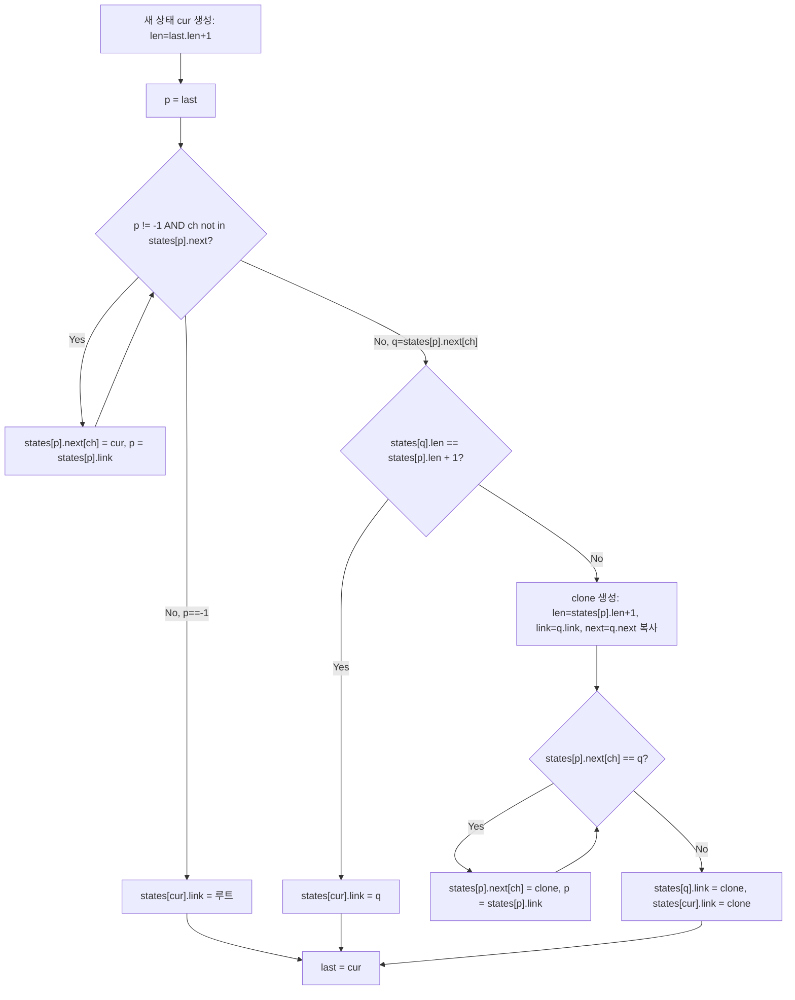

import { AlgorithmSimulation } from "#guide-sim";

# suffixAutomaton — 끝나는 위치가 같은 부분 문자열을 한 상태로 묶어 O(n)에 담아내는 이유

## 한눈에 보는 컨셉

문서 안에 서로 다른 부분 문자열이 몇 종류 있는지 세거나, 어떤 문자열이 그 문서의 일부인지 확인하는 문제를 풀어요. 부분 문자열을 하나씩 나열하면 개수 자체가 `O(n^2)`이라 감당이 안 되는데, "끝나는 위치 집합(`endpos`)이 같은 부분 문자열은 사실 서로의 접미사일 뿐 별개가 아니다"라는 관찰로 이들을 하나의 상태로 묶으면 상태 수가 `O(n)`으로 줄어듭니다. 이 상태들을 문자 하나씩 온라인으로 추가하며 amortized `O(1)`에 쌓으면, 구축은 `O(n)`, 이후 질의는 `O(n)`(전체 세기)과 `O(|t|)`(포함 여부)에 끝나요.

## 출발점: 가장 순진한 방법부터

먼저 풀어야 할 함수를 정확히 잡을게요.

```ts
class SuffixAutomaton {
  constructor(s: string)
  countDistinctSubstrings(): number
  contains(t: string): boolean
}
```

`constructor(s)`는 문자열 `s`로 자료구조를 구축합니다. `countDistinctSubstrings()`는 `s`의 서로 다른 비공(non-empty) 부분 문자열 개수를, `contains(t)`는 `t`가 `s`의 부분 문자열이면 `true`를 반환해요. 제약은 `1 <= |s| <= 10^5`, 문자 집합은 소문자 영문 알파벳(`a`–`z`)이고, `t`의 길이에는 제한이 없습니다(빈 문자열 `t`는 언제나 부분 문자열이므로 `true`).

**"서로 다른 부분 문자열이 몇 종류인가"라는 질문에 가장 정직하게 답하는 방법은, 부분 문자열을 전부 나열해서 집합에 넣어 보는 것**이에요.

```ts
function countDistinctSubstringsNaive(s: string): number {
  const substrings = new Set<string>();
  for (let i = 0; i < s.length; i++) {
    for (let j = i + 1; j <= s.length; j++) {
      substrings.add(s.slice(i, j)); // 매번 새 문자열을 잘라내고 해시로 등록
    }
  }
  return substrings.size;
}

function containsNaive(s: string, t: string): boolean {
  return s.includes(t); // 전처리 없이 호출마다 s를 처음부터 훑는다
}
```

작은 예로 비용을 체감해 봅시다. `s = "abcbc"` (`n = 5`)라면:

```text
부분 문자열 나열 (i, j):
  a, ab, abc, abcb, abcbc,
  b, bc, bcb, bcbc,
  c, cb, cbc,
  b, bc,
  c

나열 개수 = n(n+1)/2 = 15개  (중복 제거 후 distinct = 12개)
각 문자열을 자르고 해시에 등록하는 비용 = O(j - i)
전체 비용 = Σ(j-i) = O(n^3)
distinct 집합의 원소 개수는 최대 O(n^2)개지만, 그 문자열들의 길이를 다 더한 총 문자 수는 최악 O(n^3)까지 커질 수 있습니다(원소 개수와 실제 저장 공간을 혼동하면 안 돼요)
```

`n = 10^5`로 키우면 나열해야 하는 부분 문자열이 `n(n+1)/2 ≈ 5×10^9`개예요 — 저장은커녕 순회조차 불가능합니다. `contains(t)`도 사정이 비슷해요. ECMAScript 명세가 `includes`의 내부 탐색 알고리즘을 못박지는 않지만, 보수적으로 잡아도 매 호출마다 `s`를 처음부터 다시 훑는 `O(|s|)` 이상의 비용이 드는데, 표절 검사처럼 **같은 문서 `s`에 대해 의심 문장 `t`를 계속 검사**하는 상황(문제의 배경 이야기)이라면 매번 전처리 없이 스캔을 반복하는 셈이라 낭비가 누적됩니다.

`abc`와 `bc`, `c`가 각각 따로 세어지고 있는데, `"c"`는 `s`의 위치 2와 4에서 끝나고, `"bc"`도 정확히 같은 위치 2와 4에서 끝나요. **끝나는 위치가 완전히 같다면, 이 둘을 하나의 자료구조 단위로 묶어서 관리할 수 있지 않을까요?** (주의: 두 문자열 자체는 여전히 서로 다른 부분 문자열로 각각 세어져야 해요 — 묶이는 건 "상태"이지 "개수"가 아니에요.) 이것이 다음 절의 출발 단서입니다.

## 아이디어 자세히 들여다보기

### 끝나는 위치가 같으면 한 식구 — endpos와 상태

부분 문자열 `w`가 `s`에서 끝나는 모든 위치(0-indexed)의 집합을 `endpos(w)`라 정의합니다.

$$\mathrm{endpos}(w) = \{\, i \mid 0 \le i \le n-1,\ s[i-|w|+1 .. i] = w \,\}$$

`s = "abcbc"`로 직접 채워 봅시다.

```text
s =  a  b  c  b  c
     0  1  2  3  4

"c"  는 인덱스 2, 4에서 끝난다   → endpos("c")  = {2, 4}
"bc" 는 [1,2], [3,4]에서 끝난다 → endpos("bc") = {2, 4}   (완전히 같다!)
```

`"c"`와 `"bc"`의 `endpos`가 같다는 것은, `"bc"`가 나타나는 곳마다 반드시 그 접미사인 `"c"`도 같은 자리에서 끝난다는 뜻이에요. 이 관찰은 일반화됩니다 — 두 부분 문자열이 `endpos`를 하나라도 공유하면, 같은 위치에서 끝나는 두 문자열 중 **짧은 쪽은 반드시 긴 쪽의 접미사**이고, 그러면 짧은 쪽은 긴 쪽이 나타나는 자리 전부에서도 당연히 나타나므로 짧은 쪽의 `endpos`가 긴 쪽의 `endpos`를 항상 포함합니다. 즉 서로 다른 두 `endpos` 집합은 **포함 관계이거나 아니면 완전히 서로소**일 수밖에 없어요(겹치는데 포함 관계가 아닌 경우는 나올 수 없습니다). 실제로 이 문자열 전체의 부분 문자열을 브루트포스로 묶어 보면 이렇게 정확히 7개의 동치류로 나뉩니다(직접 실행해 확인한 값입니다).

| `endpos` | 묶인 부분 문자열 (짧은→긴 순) |
|---|---|
| `{0}` | `a` |
| `{1}` | `ab` |
| `{2}` | `abc` |
| `{3}` | `cb`, `bcb`, `abcb` |
| `{4}` | `cbc`, `bcbc`, `abcbc` |
| `{1,3}` | `b` |
| `{2,4}` | `c`, `bc` |

잠깐, 확인 하나만 해 볼까요? `endpos("cbc")`는 어디일까요? `"cbc"`가 나타나는 곳은 인덱스 2-3-4 한 자리뿐이니 `endpos("cbc") = {4}`이고, 위 표의 `{4}` 묶음에 정확히 들어갑니다.

같은 `endpos`를 공유하는 문자열들은 항상 **길이가 짧을수록 긴 쪽의 접미사**이고(`{3}` 묶음의 `cb ⊂ bcb ⊂ abcb`처럼 포함 관계), 그래서 하나의 상태로 나타낼 때 "길이 범위"만 있으면 충분합니다. SAM의 상태는 이렇게 정의돼요.

```text
State:
  len:  이 상태가 나타내는 부분 문자열 중 최대 길이
  link: endpos가 진상위집합인 상태 중 len이 가장 큰 것 (suffix link)
  next: 문자 → 상태 전이 함수
```

상태 `q`가 나타내는 부분 문자열의 길이 범위는 $[\mathrm{len}(\mathrm{link}(q))+1,\ \mathrm{len}(q)]$입니다. 예를 들어 `{2,4}` 묶음(`c`, `bc`)을 나타내는 상태는 `len=2`이고, 그 `link`는 길이 0(빈 문자열, 즉 루트)을 가리켜서 범위가 `[1,2]` — 정확히 `c`(길이1)와 `bc`(길이2)를 담습니다.

이 길이 범위가 정확히 이 구간이라는 것도 근거가 있어요. 같은 `endpos` 동치류 안의 문자열들은 전부 서로의 접미사이니(바로 앞에서 확인한 포함 관계), 길이가 같은 두 문자열이 한 동치류에 함께 있을 수 없고 — 그래서 **한 동치류에는 각 길이마다 문자열이 정확히 하나씩**입니다. 그 길이들은 또 **빈틈없이 이어진 구간**을 이뤄요 — 만약 동치류 안에 길이 `k`인 문자열은 있는데 `k-1`인 문자열이 빠져 있다면, 그 `k-1`짜리는 `k`짜리의 접미사라 반드시 같은 위치들에서도 끝나야 하는데, 그러면서 다른 동치류에 속한다는 건 다른 `endpos`를 가진다는 뜻이라 모순이에요. 그리고 그 구간의 최솟값은 정확히 `len(link(q))+1`로 정의됩니다 — `link(q)`는 "이 동치류의 endpos를 진짜로 포함하는(초과분이 있는) 상태 중 len이 가장 큰 것"이므로, 그보다 한 글자 짧아지는 지점부터 이 동치류가 시작하는 거예요. 길이별 유일성·구간의 연속성·최솟값 = `link+1`, 이 세 가지가 합쳐져야 `len(q) - len(link(q))`가 곧 그 상태가 담당하는 서로 다른 부분 문자열 개수라는 결론이 나옵니다.

**왜 하필 이 형태로 정의해야 할까요?** 부분 문자열마다 `endpos` 집합을 통째로 들고 다니면 정확하지만 저장 비용이 다시 `O(n^2)`으로 돌아갑니다. 반면 "포함되거나 아니면 서로소"라는 `endpos` 집합들의 성질(바로 앞에서 확인한 포함 관계) 덕분에, 이 집합들의 포함 관계를 트리(`suffix link tree`) 하나로만 표현할 수 있어요. 그러면 각 상태는 자신의 `len`과 부모(`link`)의 `len`만 들고 있어도 자신이 대표하는 문자열 범위를 완전히 복원할 수 있습니다 — `endpos` 집합 자체를 저장할 필요가 없어지는 거예요.

`countDistinctSubstrings`를 이 언어로 다시 쓰면 이렇습니다.

$$\#\{\, w \neq \varepsilon \mid w \in \mathrm{Sub}(s) \,\} = \sum_{q \neq q_0} \bigl(\mathrm{len}(q) - \mathrm{len}(\mathrm{link}(q))\bigr)$$

여기서 $q_0$는 `len=0`인 루트(빈 문자열 상태)입니다(관례상 $\mathrm{endpos}(\varepsilon)$는 $s$의 모든 위치 전체로 정의해서, 루트가 다른 모든 상태의 조상이 되도록 맞춥니다). 위 표의 일곱 묶음에 대해 직접 더해 볼까요? `{0}`은 길이 1개(1), `{1}`도 1개, `{2}`도 1개, `{3}`은 길이 2~4 범위라 3개, `{4}`는 길이 3~5 범위라 3개, `{1,3}`은 1개, `{2,4}`는 길이 1~2 범위라 2개 — 합이 `1+1+1+3+3+1+2 = 12`입니다. 실제로 `s = "abcbc"`의 서로 다른 부분 문자열 개수도 정확히 12개예요.

### 단서를 설명해 주는 이론 — 누적 방법(aggregate method)으로 보는 amortized O(1)

`endpos`를 상태로 묶는 것까지는 "공간"을 줄이는 이야기였어요. 그런데 이 상태들을 문자 하나씩 온라인으로 추가하며 만드는 과정(뒤에서 `extend`로 구현합니다)은 각 문자마다 두 개의 `while` 루프를 돕니다 — 하나는 새 상태 `cur`으로 가는 전이를 채우는 루프, 다른 하나는 `clone`이 생겼을 때 기존 전이를 다시 연결하는 루프예요. **이 루프들이 문자마다 몇 번 도는지 보장이 안 되면, 최악의 경우 전체가 `O(n^2)`이 될 수도 있어요.** 이 걱정을 해소하는 도구가 amortized 분석의 표준 도구 중 하나인 **누적 방법(aggregate method)**입니다 — 연산 하나하나의 비용을 따로 보지 않고, "그 비용이 전체 실행에서 통틀어 몇 번이나 발생할 수 있는가"를 직접 세는 접근이에요.

첫 번째 `while` 루프(`while (p !== -1 && !this.states[p].next.has(ch))`)를 보면, 이 루프의 몸통이 실행될 때마다 **반드시 지금까지 비어 있던 전이 칸 하나(`states[p].next[ch]`)를 처음으로 채웁니다** — 루프 조건 자체가 "그 칸이 비어 있을 때만" 몸통을 실행하도록 막고 있으니까요. 그러니 이 루프가 통틀어 몇 번 실행되는지는 "전이 칸이 통틀어 몇 개나 새로 채워질 수 있는가"로 바꿔 물을 수 있습니다. 상태 하나가 가질 수 있는 전이 칸은 알파벳 크기만큼(이 문제에서는 소문자 26개)뿐이고, 상태 수는 문자 하나당 최대 2개(`cur`, 조건부로 `clone`)씩만 늘어나 전체가 `O(n)`이니, 전이 칸의 총 개수는 최대 `(상태 수) × 26 = O(n)`입니다 — **알파벳이 26개로 고정**돼 있다는 사실이 여기서 결정적이에요(알파벳 크기가 입력마다 커질 수 있다면 이 상수가 사라지고 논증이 깨집니다). 한 번 채워진 칸은 나중에 다른 값으로 덮어써질 수는 있어도 다시 "비어 있는" 상태로 되돌아가지 않으므로, **첫 번째 while 루프가 실행되는 총 횟수도 `O(n)`을 넘을 수 없습니다.**

두 번째 `while` 루프(`clone` 재연결)는 이미 채워진 칸을 `q`에서 `clone`으로 **덮어쓰는** 루프라 위 논증을 그대로 적용할 수는 없어요 — 같은 칸이 나중에 또 다른 `clone`으로 다시 덮어써질 수도 있거든요. 이 루프까지 포함한 전체 상한이 `O(n)`이라는 것은 원 논문(Blumer, Blumer, Haussler, Ehrenfeucht, Chen, Seiferas, 1985)이 더 정교한 논증으로 증명한 결과이고, 여기서 그 전체 증명을 재현하는 대신 실측으로 정합성만 확인해 볼게요. `n = 500`, `1000`, `50000`짜리 무작위 문자열 각각에 대해 두 `while` 루프의 반복 횟수 합을 `n`으로 나눠 보면 `2.28`, `2.33`, `2.34`로 거의 그대로였고(`n = 50000` 기준 상태 수 `66,779`개, 반복 합 `116,762`회, 소요 `22.7ms`), **이 비율이 입력이 커져도 커지지 않는다**는 것은 "두 루프를 합쳐도 여전히 amortized O(1)"이라는 결론과 어긋나지 않습니다. 다만 이 실측은 결론을 뒷받침하는 정합성 점검일 뿐, 그 자체로 최악 입력에 대한 증명은 아니라는 점은 분명히 해 둘게요.

이 논증과는 별개로, **상태 수 자체가 `O(n)`이라는 사실**도 정당화가 필요해요 — 이건 위의 누적 방법이 아니라 훨씬 단순한 구조적 관찰입니다. `extend` 한 번은 새 상태를 `cur` 하나, 그리고 조건부로 `clone` 하나까지 최대 2개만 만드니, 문자 `n`개를 처리하면 상태 수는 루트를 포함해 최대 `1 + 2n`개예요. 조금 더 세밀히 보면(`clone`은 반드시 그 직전에 만들어진 `cur`와 짝을 이루므로 매 확장이 동시에 최댓값을 채우지는 못한다는 점까지 고려하면) `n ≥ 2`일 때는 `2n-1`이라는 더 타이트한 상한이 알려져 있습니다(`n = 1`일 때는 예외적으로 상태가 2개라 `2n-1=1`보다 많아요). 이 상태 수 상한은 뒤에서 전이 배열을 얼마나 미리 할당할지 정할 때 다시 쓸 거예요.

### 셈을 맡는 자료구조 — 전이 테이블

상태마다 필요한 `next`는 "문자 → 상태 번호"의 대응이에요. 알파벳이 무엇이든 다 받는 범용 구현이라면 해시 맵(`Map<string, number>`)이 자연스러운 선택입니다. 해시 맵 자체의 원리가 궁금하다면 이 프로젝트의 [hashMapChaining 가이드](../../../data-structures/hash/hashMapChaining/hashMapChaining-guide.mdx)를 참고하세요 — 여기서는 "문자 하나를 평균 `O(1)`에 상태 번호로 바꿔 주는 대응표"로만 쓰면 충분합니다.

### 왜 모순 없이 작동하는가

SAM이 지키는 불변식은 두 가지예요.

> (1) 모든 $v \neq q_0$에 대해 $\mathrm{len}(\mathrm{link}(v)) < \mathrm{len}(v)$이다.
> (2) 루트에서 전이를 따라 도달 가능한 경로들의 라벨 전체가 정확히 $s$의 부분 문자열 전체와 같다.

**기저**: 문자를 하나도 처리하지 않은 시점에는 상태가 루트(`len=0`) 하나뿐이고, 이는 빈 문자열만을 나타내니 (1), (2) 모두 공허하게 성립합니다.

**귀납 단계**: `k`개 문자를 처리한 SAM이 불변식을 만족한다고 가정하고, `(k+1)`번째 문자 `ch`를 추가하는 `extend(ch)` 한 번을 봅니다. 새 상태 `cur`(`len = len(last)+1`)을 만들고 `p = last`에서 시작해 `link`를 따라 올라가며, `p.next[ch]`가 없으면 `cur`로 채우는 `while` 루프를 돕니다. 이 루프가 끝나는 경우는 정확히 둘뿐입니다 — **`p = -1`(루트를 넘어감)이거나, `p.next[ch]`가 이미 있는 `p`를 만나거나.** 이 둘 외에 세 번째 경우는 없어요(루프 조건 자체가 이 둘 중 하나가 될 때까지 도는 것이므로).

- **`p = -1`인 경우**: `ch`로 시작하는 부분 문자열은 지금까지 한 번도 나타난 적이 없었다는 뜻이니, `cur`은 가장 짧은 새 부분 문자열들의 대표가 되고 `link(cur) = q_0`이 정확합니다.
- **`q = p.next[ch]`를 찾은 경우**: `len(q) = len(p)+1`이면 `q`가 나타내는 가장 짧은 문자열이 이미 `cur`의 접미사 자리와 딱 맞아떨어지므로 그대로 `link(cur) = q`로 연결해도 `q`의 `endpos`가 오염되지 않습니다. 반대로 `len(q) > len(p)+1`이면, `q`가 나타내는 문자열 범위 중 일부(`len(p)+1`짜리)만 새 `endpos`(현재 위치)를 추가로 얻고 나머지는 그렇지 않은 상황이라 `q`를 그대로 재사용하면 서로 다른 `endpos`를 가진 문자열들이 한 상태에 섞여 버립니다. 그래서 `q`를 복제해 `len = len(p)+1`인 `clone`을 새로 만들고, `q`의 `next`(얕은 복사)와 `link`를 그대로 물려준 뒤, `p`에서 `link`를 따라 올라가며 `q`를 가리키던 전이를 전부 `clone`으로 바꿉니다.

이 두 경우 모두에서 불변식 (1)이 그대로 유지된다는 것도 짚고 갈게요. `link(cur)`이 루트·`q`·`clone` 중 무엇이 되든 그 `len`은 항상 `len(cur)`보다 작습니다. `clone`의 `link`는 `q`가 원래 갖고 있던 `link`를 그대로 물려받으므로 `len(link(clone)) < len(clone)`도 `q`가 이미 만족하던 불변식에서 그대로 이어받고요. `clone`이 `q`의 `next`를 통째로 복사해 들고 있으므로, `q`를 거쳐 가던 기존 경로들은 전이가 `clone`으로 바뀐 뒤에도 똑같이 재현됩니다 — 경로가 끊기거나 없던 경로가 새로 생기지 않는다는 뜻이에요. 그리고 `q`와 `clone`은 이 시점 이후 서로 다른 길이 구간(따라서 서로 다른 `endpos`)을 나눠 맡습니다 — `clone`은 새 위치를 얻는 더 짧은 문자열들(`[len(link(q))+1, len(p)+1]`)을, `q`는 새 위치를 얻지 못하는 더 긴 문자열들(`[len(p)+2, len(q)]`)을 맡으니 둘이 다시 하나로 뭉개지는 일은 없습니다.

이 정확성 논증은 `contains(t)`에도 그대로 적용됩니다 — 루트에서 `t`를 한 글자씩 읽어 전이가 끊기지 않고 끝까지 도달하는 것과 `t`가 `s`의 부분 문자열인 것은 불변식 (2)에 의해 정확히 같은 말이므로, `contains`의 반환값은 이 동치 관계를 그대로 판정한 결과예요.

`s = "abcbc"`에서 네 번째 문자 `b`를 추가할 때 실제로 이 `clone` 분기가 발생합니다. 직접 실행한 값으로 보여드릴게요.

```text
Before (문자 3개 "abc"까지 처리, last=3):
  상태0(len0) --a--> 상태1(len1) --b--> 상태2(len2) --c--> 상태3(len3)

extend('b'): cur=4 (len=4)
  p=3: 전이 추가 3 -b-> 4
  p=0에서 전이 발견: q=2 (len(q)=2, len(p)+1=0+1=1)  → 2 > 1이므로 clone 필요!

  clone=5 생성: len=1, link=0, next 복사=[c]  (상태2의 next를 그대로 물려받음)
  p=0: 전이 교체  0 -b-> 5  (원래 0 -b-> 2였던 것을 갈아끼움)
  link(2)=5, link(4)=5

After:
  상태0(len0) --a--> 상태1(len1) --b--> 상태2(len2, link=5) --c--> 상태3(len3)
             \--b--> 상태5(len1, link=0, next={c:3}) <--link-- 상태2, 상태4
```

**여기서 헷갈리기 쉬운 포인트는, `clone`을 만드는 이 분기를 생략해도 당장은 코드가 돌아간다는 것**입니다. `len` 조건을 확인하지 않고 항상 `link(cur) = q`로만 연결하도록 구현을 바꿔서 실제로 돌려 보면, `s = "abcbc"`에서 `countDistinctSubstrings()`가 정답 `12`가 아니라 `10`을 반환합니다 — `q`(상태2)가 원래 함께 담당하던 `len=1` 문자열(`b`)과 `len=2` 문자열(`ab`) 중, 이번 확장에서 실제로 새 위치(인덱스 3)를 얻는 것은 `b`뿐이고 `ab`는 얻지 않습니다(`"abcb"`에서 `ab`는 여전히 인덱스 1 한 곳에서만 등장해요). `q`를 그대로 재사용하면 `b`가 새로 얻은 위치가 `ab`의 몫으로도 섞여 버려서, `endpos`가 갈라져야 할 두 문자열이 하나로 겹쳐 세어지는 오류예요.

또 하나, `clone`을 만들 때 `q.next`를 그대로 물려받는(얕은 복사) 부분을 빼먹고 빈 `Map`으로 시작하면 어떻게 될까요? 같은 `"abcbc"`로 실제 실행해 보면 `countDistinctSubstrings()`가 이번엔 `13`(정답보다 많이!)을 반환하고, `contains("cbc")`와 `contains("bcbc")`가 둘 다 `true`여야 하는데 `false`를 반환합니다. `clone`이 `q`가 갖고 있던 전이를 잃어버리면서, `q`를 거쳐야 갈 수 있던 뒤쪽 경로가 끊기고 대신 엉뚱하게 `len` 차이만으로 개수가 부풀려지는 사고예요. **두 버그 모두 "`clone`은 `q`의 완전한 대체품이어야 한다"(next도, 이후 `link`도)는 한 문장으로 요약**됩니다.

엣지 케이스도 짚고 넘어갈게요.

```text
s = "a" (길이 1)          → 상태 [루트, len1] 2개, distinct = 1, contains("a")=true, contains("b")=false
s = "aa" (반복 문자)       → distinct = 2 ("a", "aa")
s = "aaa"                  → distinct = 3 ("a","aa","aaa") — 매 확장에서 clone 없이 사슬만 늘어남
contains("")               → 루프를 한 번도 안 돌고 즉시 true (빈 문자열은 항상 부분 문자열)
```

## 아이디어를 코드로 옮기기

```ts
class SamState {
  len = 0;
  link = -1; // -1 = 부모 없음(=루트 자신)
  next: Map<string, number> = new Map();
}

class SuffixAutomatonBasic {
  private states: SamState[];
  private last: number;

  constructor(s: string) {
    this.states = [new SamState()]; // states[0] = 루트
    this.last = 0;
    for (const ch of s) this.extend(ch);
  }

  private extend(ch: string): void {
    const cur = this.states.length;
    this.states.push(new SamState());
    this.states[cur].len = this.states[this.last].len + 1;

    let p = this.last;
    while (p !== -1 && !this.states[p].next.has(ch)) {
      this.states[p].next.set(ch, cur);
      p = this.states[p].link;
    }

    if (p === -1) {
      this.states[cur].link = 0;
    } else {
      const q = this.states[p].next.get(ch)!;
      if (this.states[q].len === this.states[p].len + 1) {
        this.states[cur].link = q;
      } else {
        const clone = this.states.length;
        this.states.push(new SamState());
        this.states[clone].len = this.states[p].len + 1;
        this.states[clone].link = this.states[q].link;
        this.states[clone].next = new Map(this.states[q].next); // 얕은 복사
        while (p !== -1 && this.states[p].next.get(ch) === q) {
          this.states[p].next.set(ch, clone);
          p = this.states[p].link;
        }
        this.states[q].link = clone;
        this.states[cur].link = clone;
      }
    }
    this.last = cur;
  }

  countDistinctSubstrings(): number {
    let total = 0;
    for (let v = 1; v < this.states.length; v++) {
      total += this.states[v].len - this.states[this.states[v].link].len;
    }
    return total;
  }

  contains(t: string): boolean {
    let cur = 0;
    for (const ch of t) {
      const nxt = this.states[cur].next.get(ch);
      if (nxt === undefined) return false;
      cur = nxt;
    }
    return true;
  }
}
```

**가장 실수가 잦은 부분은 `clone` 분기 전체입니다.** `len` 비교로 분기를 나누는 조건문 하나, `next`를 얕은 복사하는 한 줄, 그리고 `q.link`와 `cur.link`를 **둘 다** `clone`으로 바꿔야 하는 마지막 두 줄 — 앞 절에서 실제 오답 수치(`12`가 `10` 또는 `13`으로 깨지는 것)로 확인한 그 지점입니다. 그 외에 챙길 결정 지점은 두 가지예요.

- `while (p !== -1 && !this.states[p].next.has(ch))`의 순회 방향은 `last`에서 루트 쪽으로(자식→부모)만 갑니다. 반대로 타면 아직 만들어지지 않은 전이를 앞질러 참조하게 돼요.
- `countDistinctSubstrings`의 `for` 루프는 `v = 1`부터, 즉 **루트(`v = 0`)를 제외**하고 돕니다. 루트를 포함하면 `len(root) - len(link(root))`에서 `link(root) = -1` 인덱스 접근이 깨집니다.

## 더 빠르게 만들 단서 찾기

방금 만든 구현은 상태마다 `Map<string, number>` 객체를 하나씩 들고 있어요. `n = 10^5`면 상태 수가 최대(`n≥2` 기준) `2n-1`이니 `Map` 객체도 최대 약 `2×10^5`개가 만들어지는데, 전형적인 해시맵 구현이라면(자바스크립트 명세가 내부 구조를 강제하지는 않지만) 보통 `Map` 하나마다 해시 버킷과 엔트리 객체를 따로 할당하는 방식을 씁니다.

```text
상태 하나당:              Map 객체 1개 (해시 버킷 + 엔트리 배열, 문자 몇 개뿐인데도 구조 전체가 필요)
전이 하나 찾을 때:         (전형적인 구현 기준) 문자열 해시 계산 → 버킷 탐색 → 엔트리 비교
알파벳은 늘 a~z 26개뿐인데, 그 사실을 전혀 활용하지 않고 매번 "임의 키"를 다루듯 처리한다
```

앞서 전이 테이블을 "해시 맵"으로 소개하면서 짚었던 지점이 바로 여기예요. **알파벳이 26개로 고정**돼 있다는 제약을 알고 있다면, 굳이 해시로 임의의 키를 흩뿌릴 필요 없이 `문자 코드`를 배열 인덱스로 직접 쓸 수 있습니다. 그리고 앞서 확인했듯 상태 수 자체가(각 확장이 최대 2개까지만 상태를 만드는 구조 덕분에) `O(n)`으로 미리 상한(`n≥2` 기준 `2n-1`)이 잡혀 있으니, `Map`을 상태마다 즉석에서 늘리는 대신 **배열 크기를 통째로 미리 확보**해 둘 수도 있어요.

## 단서를 최적화로 연결하기

`next`를 상태별 `Map`에서, **모든 상태의 전이를 한 줄로 이어붙인 `Int32Array` 하나**로 바꿉니다. 상태 `v`, 문자 코드 `c`(0~25)의 전이는 인덱스 `v * 26 + c`에 저장해요. 존재하지 않는 전이는 `-1` sentinel로 표시합니다.

```text
Before (상태별 Map):
  states[0].next = Map{ a:1, b:5, c:7 }
  states[1].next = Map{ b:2 }
  states[2].next = Map{ c:3 }
  ...  (상태마다 별도 객체, 문자→상태를 해시로 탐색)

After (평평한 배열, ALPHABET_SIZE=26):
  next[0*26 + 'a'] = 1,  next[0*26 + 'b'] = 5,  next[0*26 + 'c'] = 7
  next[1*26 + 'b'] = 2
  next[2*26 + 'c'] = 3
  ...  (한 덩어리 배열, 인덱스 계산만으로 O(1) 접근, 캐시 지역성 확보)
```

지켜야 할 약속(불변식) 하나: **배열 크기는 상태가 늘어나며 바뀌지 않고, 생성자 시점에 `(2n+2) * 26`으로 고정**됩니다. 상태 수가(`n≥2` 기준) `2n-1`을 넘지 않는다는 구조적 사실(앞서 확인한 "확장당 최대 2개 생성" 논증)이 이 사전 할당을 정당화해요.

## 최적화 코드

바뀌는 곳은 `next`의 자료구조와 그것을 읽고 쓰는 인덱스 계산뿐, `extend`의 논리(언제 `clone`을 만드는지)는 그대로입니다.

```ts
const ALPHABET_SIZE = 26;

class SuffixAutomatonFast {
  private len: Int32Array;
  private link: Int32Array;
  private next: Int32Array; // 평평한 배열: state * 26 + charIndex
  private size: number;
  private last: number;

  constructor(s: string) {
    const n = s.length;
    const maxStates = 2 * n + 2; // 상태 수 ≤ 2n-1(n≥2 기준) 이내로 알려져 있으므로 여유 있게 사전 할당
    this.len = new Int32Array(maxStates);
    this.link = new Int32Array(maxStates).fill(-1);
    this.next = new Int32Array(maxStates * ALPHABET_SIZE).fill(-1);
    this.size = 1; // 루트만 있는 상태
    this.last = 0;

    for (let i = 0; i < n; i++) this.extend(s.charCodeAt(i) - 97);
  }

  private extend(c: number): void {
    const cur = this.size++;
    this.len[cur] = this.len[this.last] + 1;
    let p = this.last;

    while (p !== -1 && this.next[p * ALPHABET_SIZE + c] === -1) {
      this.next[p * ALPHABET_SIZE + c] = cur;
      p = this.link[p];
    }

    if (p === -1) {
      this.link[cur] = 0;
    } else {
      const q = this.next[p * ALPHABET_SIZE + c];
      if (this.len[q] === this.len[p] + 1) {
        this.link[cur] = q;
      } else {
        const clone = this.size++;
        this.len[clone] = this.len[p] + 1;
        this.link[clone] = this.link[q];
        for (let k = 0; k < ALPHABET_SIZE; k++) {
          this.next[clone * ALPHABET_SIZE + k] = this.next[q * ALPHABET_SIZE + k]; // 얕은 복사 대응
        }
        while (p !== -1 && this.next[p * ALPHABET_SIZE + c] === q) {
          this.next[p * ALPHABET_SIZE + c] = clone;
          p = this.link[p];
        }
        this.link[q] = clone;
        this.link[cur] = clone;
      }
    }
    this.last = cur;
  }

  countDistinctSubstrings(): number {
    let total = 0;
    for (let v = 1; v < this.size; v++) total += this.len[v] - this.len[this.link[v]];
    return total;
  }

  contains(t: string): boolean {
    let cur = 0;
    for (let i = 0; i < t.length; i++) {
      const c = t.charCodeAt(i) - 97;
      if (c < 0 || c >= ALPHABET_SIZE) return false; // 알파벳 밖 문자는 즉시 실패
      const nxt = this.next[cur * ALPHABET_SIZE + c];
      if (nxt === -1) return false;
      cur = nxt;
    }
    return true;
  }
}
```

**가장 중요한 줄은 `clone` 복제 루프 `for (let k = 0; k < ALPHABET_SIZE; k++)`입니다.** `Map` 버전에서는 `new Map(this.states[q].next)` 한 줄이 해 주던 "전이 통째로 복사"를, 배열 버전에서는 26칸을 직접 순회해서 복사해야 해요. 이 루프를 빼먹으면(즉 `clone`의 `next` 26칸을 전부 `-1`로 남겨 두면) 기본 구현에서 실측했던 것과 똑같은 종류의 사고(`contains`가 있어야 할 경로에서 `false`를 반환)가 그대로 재현됩니다 — 자료구조만 바뀌었을 뿐 "clone은 완전한 대체품이어야 한다"는 불변식은 그대로 지켜야 하는 거예요.

> `Map` 복사는 "있는 키만" 옮기지만, 배열 복사는 "26칸 전부"를 옮깁니다 — 칸 수가 고정이라 생기는 대가예요.

이 최적화로 대표 입력 `s = "abcbc"`, `n = 50000`짜리 무작위 문자열 모두에서 기본 구현과 정확히 같은 결과(`countDistinctSubstrings`, `contains` 20회 무작위 교차검증 전부 일치, mismatch 0건)를 내면서, 전이 접근이 해시 탐색에서 배열 인덱싱으로 바뀝니다. 점근 복잡도는 두 구현 모두 `O(n)`으로 동일해요 — 이 최적화는 **상수항을 줄이는 것**이지 복잡도 등급을 낮추는 게 아닙니다.

더 빠르게 만들 여지가 남아 있을까요? 알파벳이 고정 크기인 한 이 이상으로 전이 탐색을 줄이기는 어렵습니다 — 문자 하나당 `O(1)` 배열 접근이 이미 이론적 하한(문자열 전체를 한 번은 읽어야 하므로 구축은 `Ω(n)`)에 붙어 있어요. 참고로 "구간 안 서로 다른 부분 문자열 세기"라는 이 특정 문제만 놓고 보면 접미사 배열(suffix array) + LCP 배열을 이용해 `Σ(n - sa[i] - lcp[i])` 공식으로 `O(n log n)`(또는 `O(n)` 구축 알고리즘을 쓰면 더 빠르게) 답을 내는 특화 해법도 있습니다. 그럼에도 SAM을 배우는 이유는 **범용성**이에요 — 온라인으로 한 글자씩 추가할 수 있고, `contains` 같은 부분 문자열 판정을 별도 전처리 없이 전이만 따라가면 되며, 여러 문자열을 합친 일반화 SAM(generalized SAM)으로 최장 공통 부분 문자열류의 문제까지 같은 틀로 확장할 수 있습니다.

## 실행 시각화

고정 입력 `s = "aba"`에 대해 SAM을 온라인으로 구축하는 과정이에요. `tree` 패널은 상태들의 suffix link 트리(자식 = 그 `link`가 부모를 가리키는 상태)이고, 노드 라벨은 `상태번호:len`입니다. 상태 색은 `active`(이번 글자에서 새로 만든/연결한 상태), `visited`(구축 완료 상태)를 뜻해요. `keyValue` 패널은 각 단계의 상태 정보·전이·누적 `distinct` 값을 보여줍니다. 이 예시는 마침 모든 단계에서 `len(q) = len(p)+1`이 성립해 `clone`이 필요 없는 경우예요(바로 앞 절에서 `clone`이 실제로 발생하는 `"abcbc"` 사례를 이미 손으로 따라가 봤으니, 여기서는 `clone` 없는 가장 단순한 흐름에 집중합니다). 실제 반환값은 `countDistinctSubstrings() = 5`(`a, b, ab, ba, aba`), `contains("ab") = true`이며, 시뮬레이션 마지막 프레임의 합산과 일치합니다.

> 대화형 시뮬레이션은 MDX 런타임에서 표시됩니다.

export const steps = [
  {
    title: "초기화",
    detail: "루트 상태 0 (len=0, link=-1). last=0.",
    root: { id: "0", label: "0:len0", status: "active" },
    entries: [
      { label: "상태들", value: "0(len0,link-1)" },
      { label: "last", value: 0 },
      { label: "distinct", value: 0 },
    ],
  },
  {
    title: "add 'a' → 상태 1",
    detail: "cur=1(len1). p=0에서 'a' 전이 추가, p=-1 도달 → link(1)=0. last=1.",
    root: {
      id: "0", label: "0:len0",
      children: [{ id: "1", label: "1:len1", status: "active" }],
    },
    entries: [
      { label: "상태들", value: "1(len1,link0)" },
      { label: "전이", value: "0 -a-> 1" },
      { label: "distinct", value: "1-0 = 1" },
    ],
  },
  {
    title: "add 'b' → 상태 2",
    detail: "cur=2(len2). p=1,0에서 'b' 전이 추가, p=-1 → link(2)=0. last=2.",
    root: {
      id: "0", label: "0:len0",
      children: [
        { id: "1", label: "1:len1", status: "visited" },
        { id: "2", label: "2:len2", status: "active" },
      ],
    },
    entries: [
      { label: "상태들", value: "2(len2,link0)" },
      { label: "전이", value: "1 -b-> 2, 0 -b-> 2" },
      { label: "distinct", value: "1 + 2 = 3" },
    ],
  },
  {
    title: "add 'a' → 상태 3",
    detail: "cur=3(len3). p=2에 'a' 추가, p=0에서 'a' 전이 q=1 발견. len(1)=1=len(0)+1 → clone 불필요, link(3)=1. last=3.",
    root: {
      id: "0", label: "0:len0",
      children: [
        { id: "1", label: "1:len1", children: [
          { id: "3", label: "3:len3", status: "active" },
        ] },
        { id: "2", label: "2:len2", status: "visited" },
      ],
    },
    entries: [
      { label: "상태들", value: "3(len3,link1)" },
      { label: "전이", value: "2 -a-> 3" },
      { label: "distinct", value: "1 + 2 + (3-1) = 1 + 2 + 2 = 5" },
    ],
  },
  {
    title: "countDistinctSubstrings = 5",
    detail: "Σ(len(v)-len(link(v))) = (1-0)+(2-0)+(3-1) = 5. 부분문자열: a, b, ab, ba, aba.",
    root: {
      id: "0", label: "0:len0",
      children: [
        { id: "1", label: "1:len1", status: "visited", children: [
          { id: "3", label: "3:len3", status: "visited" },
        ] },
        { id: "2", label: "2:len2", status: "visited" },
      ],
    },
    entries: [
      { label: "합산", value: "1 + 2 + 2 = 5" },
      { label: "distinct", value: 5 },
      { label: "반환", value: 5 },
    ],
  },
  {
    title: 'contains("ab")',
    detail: "루트 0 -a-> 1 -b-> 2. 전이 모두 성공 → true.",
    root: {
      id: "0", label: "0:len0",
      children: [
        { id: "1", label: "1:len1", status: "visited", children: [
          { id: "3", label: "3:len3", status: "visited" },
        ] },
        { id: "2", label: "2:len2", status: "visited" },
      ],
    },
    entries: [
      { label: "경로", value: "0 -a-> 1 -b-> 2" },
      { label: "반환", value: "true" },
    ],
  },
];

<AlgorithmSimulation view={["tree", "keyValue"]} steps={steps} title="Suffix Automaton: s='aba'" />

## 흐름 한눈에 보기



## 스스로 점검하기

1. `s = "aaa"`에 대해 `extend`를 손으로 세 번 따라가며 각 단계의 `len`, `link`를 적어 보세요. `clone`이 한 번도 발생하지 않는 이유를 `len(q) = len(p)+1` 조건으로 설명할 수 있나요? (힌트: 첫 번째 확장에서만 `p`가 `-1`까지 갑니다. 두 번째·세 번째 확장에서는 `p`가 이미 있는 전이를 곧장 만나 멈추고, 그때마다 `len(q) = len(p)+1`이 성립해 `clone`이 필요 없어집니다.)
2. `contains(t)`에서 `t`의 길이가 `s`보다 길면 어떻게 될까요? 코드를 다시 보지 말고 먼저 답을 예상한 뒤, `contains` 구현의 `for` 루프가 왜 자동으로 그 답을 내는지 짚어 보세요.
3. 만약 "부분 문자열이 등장한 횟수(빈도)"까지 구해야 한다면, 지금의 `SamState`에 어떤 값을 추가하고 어떻게 채워야 할까요? (힌트: `clone`으로 만들어진 상태와 원래 만들어진 상태는 등장 횟수 계산에서 다르게 취급해야 합니다 — `clone`은 실제 접미사 등장 없이 구조만 물려받은 상태예요.)
