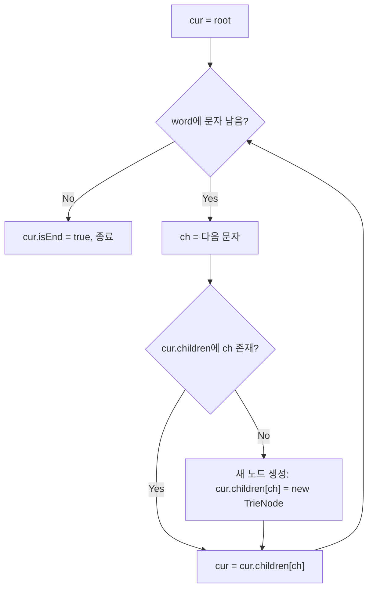
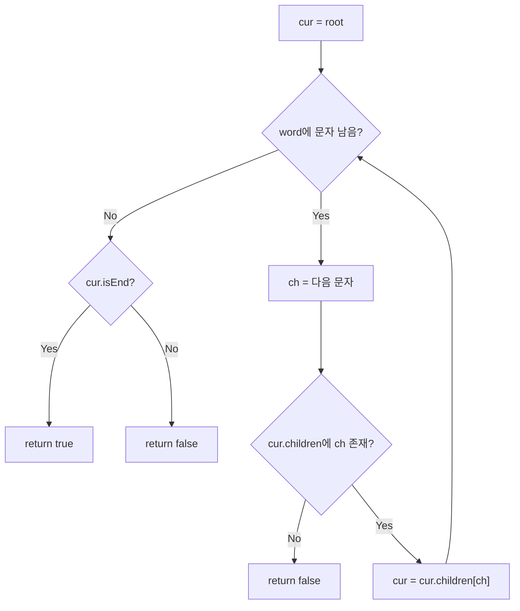

import { AlgorithmSimulation } from "#guide-sim";

# Trie — 공통 접두사를 트리 경로로 압축해 접두사 검색을 O(L)로 만드는 이유

## 한눈에 보는 컨셉

단어들을 배열에 그냥 쌓아 두면, 정확 검색이든 접두사 검색이든 저장된 단어 수만큼 비교해야 해서 느려요. Trie는 각 글자를 트리의 한 레벨로 만들어, 여러 단어가 공유하는 접두사를 하나의 경로로 합쳐 버립니다. 그 결과 `insert`·`search`·`startsWith` 세 연산 모두 저장된 단어 개수와 무관하게, 지금 다루는 단어의 길이 `L`에만 비례하는 `O(L)`에 끝나요.

## 출발점: 가장 순진한 방법부터

문제를 먼저 정확히 잡을게요.

```ts
class Trie {
  insert(word: string): void;
  search(word: string): boolean;
  startsWith(prefix: string): boolean;
}
```

- `insert(word)` — `word`를 자료구조에 삽입합니다. 반환값은 없어요.
- `search(word)` — `word`가 이전에 정확히 삽입된 적이 있으면 `true`, 없으면 `false`.
- `startsWith(prefix)` — `prefix`로 시작하는 단어가 하나라도 삽입되어 있으면 `true`.

**제약**: 단어·접두사 길이 $L \leq 10^5$, 삽입되는 모든 단어의 길이 합 $\leq 10^5$, `insert`·`search`·`startsWith` 호출 총 횟수 $\leq 10^5$, 문자 집합은 소문자 영문 알파벳(`a`–`z`)만 씁니다. 시간 제한 1초, 메모리 제한 256 MB예요.

가장 정직한 방법은 삽입된 단어를 배열에 그대로 쌓아 두는 겁니다.

```ts
class TrieNaive {
  private words: string[] = [];
  insert(word: string): void {
    this.words.push(word);
  }
  search(word: string): boolean {
    return this.words.includes(word); // 저장된 단어 전부와 비교
  }
  startsWith(prefix: string): boolean {
    return this.words.some((w) => w.startsWith(prefix)); // 전부와 비교
  }
}
```

작은 예로 확인해 볼게요. `"apple"`, `"app"`, `"application"`을 삽입한 뒤 `search("app")`을 부르면, 저장된 3개 단어와 하나씩 문자 비교를 합니다.

```text
words = ["apple", "app", "application"]

search("app")
  "apple" 와 "app" 비교        → 불일치 (다름)
  "app"   와 "app" 비교        → 일치! true

startsWith("app")
  "apple".startsWith("app")  → true → some()이 여기서 즉시 멈추고 true를 반환한다
                                ("app", "application"은 아예 검사되지 않는다 — 운이 좋은 경우다)
```

방금 본 것처럼 `.some()`은 답을 찾는 즉시 멈추는 short-circuit 동작을 하므로 운이 좋으면 일부만 보고 끝납니다. 하지만 **찾는 게 없거나, 일치하는 단어가 배열 맨 끝에 있는 최악의 경우**에는 저장된 단어 전부와 비교해야 해요(예: `words = ["banana", "cherry", "date"]`에서 `startsWith("app")`을 호출하면 셋 다 검사하고서야 `false`가 나옵니다). 저장된 단어 수를 $k$, 그 단어들의 길이 합을 $S$($\leq 10^5$, 제약과 동일)라 하면, 한 번의 `search`나 `startsWith` 호출의 최악 비용은 $O(S)$까지 커질 수 있습니다. 문제는 이런 호출이 최대 $10^5$번(제약 참고) 반복된다는 점이에요 — 매번 최악으로 $O(S)$가 걸린다면 총 비용은 $O(10^5 \times 10^5) = O(10^{10})$에 이르러 시간 제한 1초를 훌쩍 넘깁니다. 해시셋으로 `search` 한 번을 질의 길이만큼인 $O(L)$로 줄여도, `startsWith`는 접두사 일치 여부를 확인하려면 최악의 경우 여전히 저장된 단어 대부분과 비교해야 하므로 반복 호출의 누적 비용 문제는 그대로 남습니다.

여기서 낌새 하나가 보입니다. `"apple"`, `"app"`, `"application"`을 검색할 때마다 `"app"`이라는 공통 접두사를 매번 처음부터 다시 비교하고 있어요. **이 중복 비교를 없앨 수는 없을까?** 이것이 이번 알고리즘의 출발 단서입니다.

## 아이디어 자세히 들여다보기

### 공통 접두사를 하나의 경로로 접기 — 수식과 그림

핵심 아이디어를 한 문장으로 말하면 이렇습니다. **여러 단어가 공유하는 접두사를 트리의 같은 경로로 만들면, 검색이 그 단어의 길이만큼만 내려가면 끝나는 일이 됩니다.** 배열에서는 단어마다 독립된 문자열이었던 것이, 트리에서는 글자 하나하나가 트리의 한 단계(edge)가 돼요.

정식으로 노드를 정의하면 다음과 같습니다.

$$\text{node} = \big(\,\text{children}: \Sigma \rightharpoonup \text{node},\;\; \text{isEnd} \in \{\texttt{true}, \texttt{false}\}\,\big)$$

여기서 $\Sigma = \{a, \ldots, z\}$는 문자 집합이고, $\text{children}$은 $\Sigma$의 일부 문자에서 자식 노드로 가는 부분함수(모든 문자에 자식이 있는 건 아니라는 뜻)입니다. 루트는 빈 문자열 $\varepsilon$을 나타내고, 루트에서 어떤 노드까지 내려가며 지나온 글자를 순서대로 이으면 그 노드가 대응하는 문자열이 됩니다.

`"app"`과 `"apple"`을 삽입한 트리를 그림으로 보면 이렇습니다.

```text
        root(*)
          |a
          v
         [a]
          |p
          v
         [p]
          |p
          v
       [p]=isEnd        <- 여기가 "app"의 끝
          |l
          v
         [l]
          |e
          v
       [e]=isEnd        <- 여기가 "apple"의 끝
```

`a → p → p` 세 글자 경로는 두 단어가 공유하고, `"apple"`만 가진 `l → e` 두 글자만 추가로 뻗어 나갑니다. `"app"`을 삽입할 때 만든 노드를 `"apple"`을 삽입할 때 그대로 재사용하는 것, 이게 바로 중복 비교를 없애는 방법이에요.

**왜 하필 이 형태여야 할까요?** "끝 표시는 리프 노드에만 두면 되지 않나?"라고 생각할 수 있는데, 그림을 보면 안 되는 이유가 바로 보입니다. `"app"`을 나타내는 노드는 리프가 아니에요 — `l`이라는 자식이 달려 있으니까요. 그런데도 `"app"` 자체가 유효한 단어라는 사실은 어딘가에 표시돼야 합니다. 그래서 **모든 노드**가 각자 `isEnd` 플래그를 들고 있어야 하고, "리프 = 단어 끝"이라는 가정은 두 단어가 포함 관계일 때 깨집니다.

잠깐 확인해 볼까요? `"ab"`만 삽입한 트리에는 노드가 몇 개 있을까요? 루트를 빼고 세면 `'a'` 노드, `'b'` 노드 이렇게 2개이고 `isEnd = true`인 노드는 `'b'` 하나뿐입니다.

### 단서를 설명해 주는 이론 — 결정적 유한 오토마타(DFA)로 보는 Trie

방금 만든 구조를 조금 더 일반적인 언어로 옮겨 보면, Trie는 사실 **결정적 유한 오토마타(Deterministic Finite Automaton, DFA)**의 특수한 형태입니다. DFA는 $(Q, \Sigma, \delta, q_0, F)$ 다섯 가지로 정의돼요 — 상태 집합 $Q$, 입력 알파벳 $\Sigma$, 전이 함수 $\delta: Q \times \Sigma \to Q$, 시작 상태 $q_0$, 수락 상태 집합 $F$입니다. 다만 표준 DFA의 $\delta$는 모든 (상태, 문자) 쌍에 대해 정의된 전함수인 반면, Trie의 `children`은 앞서 정의했듯 일부 문자에만 자식이 있는 **부분함수**입니다. 그래서 엄밀히는 Trie를 "부분 결정 오토마타"라고 부르는 게 정확해요 — 정의되지 않은 전이를 전부 "실패" 상태로 보내면 표준 DFA로 완성할 수 있지만, 지금 구현은 그 실패 상태를 따로 만들지 않고 "전이가 없으면 그 자리에서 즉시 실패"로 처리합니다.

Trie를 이 언어로 옮기면 대응이 아주 자연스럽습니다.

| DFA 요소 | Trie에서의 대응 |
|----------|------------------|
| 상태 $Q$ | 트리의 노드 전체 |
| 전이 함수 $\delta$ | `children` (문자 하나를 소비하고 다음 노드로, 정의 안 된 문자는 즉시 실패) |
| 시작 상태 $q_0$ | 루트 |
| 수락 상태 $F$ | `isEnd = true`인 노드들 |

`search(word)`는 "`word`의 글자를 하나씩 소비하며 $\delta$를 따라가서(전이가 없으면 즉시 실패), 끝까지 간 상태가 $F$에 속하는가?"라는 부분 DFA의 수락 판정 그 자체입니다. `startsWith(prefix)`는 조금 다른데, 수락 상태인지는 상관없이 "그 상태까지 가는 전이 경로가 존재하는가"만 물어요 — DFA 언어로는 "이 상태에서 뻗어나가는 도달 가능 언어(right language)가 공집합이 아닌가"에 해당합니다. 경로가 존재하면 그 노드 아래 어딘가에는 반드시 삽입된 단어가 있으므로(그 노드 자체가 `isEnd`이거나, 자식 쪽으로 더 내려가면 `isEnd`가 나옵니다) 공집합이 아니라는 뜻이 됩니다. 단, 빈 접두사 하나만은 예외예요 — 루트는 어떤 단어도 삽입되기 전부터 이미 존재하므로, 빈 트라이에서도 "빈 문자열까지의 경로"는 항상 있습니다. 이 구현은 "빈 문자열은 모든 문자열의 접두사"라는 통상적 정의를 그대로 따라 이 경우 `startsWith("")`를 `true`로 둡니다. 그 한 가지 경우만 제외하면 "경로 존재 = 그 경로를 공유하는 삽입된 단어가 있음"이 정확히 성립합니다.

이 관점이 왜 중요할까요? 전이 함수 $\delta$를 **어떻게 구현하느냐**가 실제 성능을 좌우한다는 사실을 알려주기 때문입니다. 알파벳이 작고 고정되어 있을 때는 전이 함수를 **조밀한 배열(전이 테이블)**로 구현해 전이 하나당 $O(1)$ 접근을 보장할 수 있어요(Aho-Corasick의 `goto` 함수를 이런 배열로 구현하는 경우가 대표적입니다). 지금은 `Map`으로 $\delta$를 구현했는데, 이 이론을 기억해 두세요 — 뒤에서 전이 함수 구현 방식 자체를 최적화할 때 다시 소환합니다.

### 셈을 맡는 자료구조 — 문자별 자식을 찾는 해시맵

`children: Map<string, TrieNode>`는 "이 노드에서 문자 `ch`로 가면 어떤 자식이 있는가"를 평균 $O(1)$에 조회·삽입하는 대응표 역할만 합니다. 내부에서 해시 충돌을 어떻게 다루는지 등 `Map` 자체의 동작 원리가 궁금하다면 이 프로젝트의 [hashMapChaining 가이드](../../../data-structures/hash/hashMapChaining/hashMapChaining-guide.mdx)를 참고하세요. 여기서는 "문자 하나를 키로 자식 노드를 찾는 평균 $O(1)$ 조회 표"로만 알면 충분합니다.

### 왜 모순 없이 작동하는가

이 자료구조가 지키는 약속(불변식)은 두 방향입니다.

> (①) `insert(w)` 호출 후, 루트에서 $w$의 각 글자를 순서대로 따라가면 항상 노드가 존재하고, 그 경로의 마지막 노드는 `isEnd = true`이다.
> (②) 역으로, 어떤 노드의 `isEnd`가 `true`라면 그 노드까지의 경로에 대응하는 문자열이 정확히 `insert`된 적이 있다.

①을 증명하려면 먼저 "경로 존재"와 "`isEnd` 설정"을 분리해야 합니다. `isEnd = true`는 반복문이 다 끝난 뒤 **딱 한 번**만 실행되므로, 반복문이 도는 도중(중간 글자까지 처리한 시점)에는 아직 `isEnd`를 논할 단계가 아니에요. 그래서 반복문 자체에 대한 귀납은 "경로(노드) 존재"만을 대상으로 합니다.

**루프 불변식(경로 존재)**: `insert`의 반복문이 $k$번째 글자까지 처리한 시점에, `cur`은 항상 $w[0..k-1]$에 대응하는 노드를 가리킨다.

**기저**($k=0$): 아직 글자를 하나도 처리하지 않았으므로 `cur`은 루트이고, 루트는 빈 문자열 $w[0..{-1}] = \varepsilon$에 대응하는 노드입니다.

**귀납 단계**: $k$번째 글자까지 처리해 `cur`이 $w[0..k-1]$의 노드라고 가정합니다. $k+1$번째 글자 $w[k]$를 처리할 때 경우는 정확히 둘뿐입니다 — (a) `cur.children`에 $w[k]$가 이미 있는 경우, (b) 없는 경우. 이 둘이 전부인 이유는 `children`이 `Map`이라 "있다/없다" 외의 제3의 상태가 없기 때문입니다(경우의 완전성). (a)면 기존 자식으로 그대로 내려가고, (b)면 새 노드를 만들어 연결한 뒤 내려가므로, 어느 경우든 처리 후 $\text{cur}$은 $w[0..k]$의 노드가 됩니다(각 경우의 정확성).

**종료 후**: 반복문이 $w$의 모든 글자를 처리하고 나면(위 루프 불변식에 $k = |w|$를 대입), `cur`은 $w$ 전체에 대응하는 노드입니다. 이 시점에 `cur.isEnd = true`를 설정하므로 ①이 성립합니다.

②(역방향)는 코드 구조에서 바로 따라옵니다. `isEnd`를 `true`로 만드는 문장은 `insert` 안에 딱 하나뿐이고, 그 호출이 처리한 문자열의 끝 노드에서만 실행됩니다. 서로 다른 문자열은 (공통 접두사 이후) 서로 다른 노드로 갈라지므로, 한 문자열의 `insert`가 다른 경로의 `isEnd`를 건드릴 일은 없습니다. 그러므로 어떤 노드의 `isEnd = true`는 정확히 그 경로의 문자열이 `insert`된 적이 있다는 것과 동치입니다 — 이 역방향 성질이 있어야 `search(w) = true`일 때 "`w`가 실제로 삽입되었다"고 결론지을 수 있습니다.

이 두 방향 불변식으로부터 `search`와 `startsWith`의 정당성이 바로 따라옵니다. `search(word)`는 경로를 따라가다 끊기면 `false`(①에 의해 그런 경로로 `insert`된 적이 없다는 뜻), 끝까지 가면 그 노드의 `isEnd`를 그대로 반환합니다(②에 의해 `isEnd=true`면 정확히 그 단어가 삽입됐다는 뜻). `startsWith(prefix)`는 경로 존재 여부만 보는데, 경로가 존재한다는 것은 그 경로를 공유하는 어떤 단어가 `insert`되었다는 것과 (거의) 동치입니다. "거의"라고 한 이유는 빈 접두사 하나만 예외이기 때문이에요 — 루트는 어떤 단어도 삽입되기 전부터 이미 존재하므로, 빈 트라이에서도 `startsWith("")`의 경로(루트 자체)는 항상 있습니다. 이 구현은 "빈 문자열은 모든 문자열의 접두사"라는 통상적 정의를 그대로 따라 그 경우 `true`를 반환합니다.

여기서 헷갈리기 쉬운 포인트는, `search`와 `startsWith`가 겉보기엔 거의 같은 코드인데 **딱 한 가지, 끝에서 `isEnd`를 확인하느냐**만 다르다는 점입니다. 만약 `search`에서 이 확인을 빠뜨리면 어떻게 될까요?

```text
insert("apple") 만 실행한 상태에서

올바른 search("app")    : a→p→p 경로는 있지만 그 노드의 isEnd=false → false
isEnd 확인을 빠뜨린 버전 : a→p→p 경로가 있다는 것만 보고         → true (틀림!)

"app"은 한 번도 insert된 적이 없는데 true가 나온다 — startsWith와
구별이 안 되는 버그다.
```

엣지 케이스도 이 불변식 위에서 짚어 둘게요.

```text
빈 트리에서 search("abc")           → 경로 자체가 없음        → false
빈 트리에서 startsWith("abc")       → 경로 자체가 없음        → false
빈 트리에서 startsWith("")          → 루트 자체가 경로(삽입 여부와 무관) → true (유일한 예외)
insert("") 후 search("")            → 루트가 곧 끝 노드, isEnd=true → true
insert("ab") 후 startsWith("abc")   → 'b' 노드에 'c' 자식 없음  → false
같은 단어를 두 번 insert            → 같은 경로를 재사용, isEnd를 다시 true로 씀(멱등) → 문제 없음
```

## 아이디어를 코드로 옮기기

방금 정의한 노드 구조를 그대로 TypeScript로 옮기면 다음과 같습니다.

```ts
class TrieNode {
  children: Map<string, TrieNode> = new Map();
  isEnd = false;
}

class TrieBasic {
  private root = new TrieNode();

  insert(word: string): void {
    let cur = this.root;
    for (const ch of word) {
      let next = cur.children.get(ch);
      if (!next) {
        next = new TrieNode();
        cur.children.set(ch, next);
      }
      cur = next;
    }
    cur.isEnd = true;
  }

  search(word: string): boolean {
    let cur = this.root;
    for (const ch of word) {
      const next = cur.children.get(ch);
      if (!next) return false;
      cur = next;
    }
    return cur.isEnd;
  }

  startsWith(prefix: string): boolean {
    let cur = this.root;
    for (const ch of prefix) {
      const next = cur.children.get(ch);
      if (!next) return false;
      cur = next;
    }
    return true;
  }
}
```

**가장 실수가 잦은 부분은 `insert`의 `if (!next) { ... }` 위치입니다.** 이 검사는 반드시 글자마다(루프 안에서) 이루어져야 하고, 자식이 없을 때만 새로 만들고 있으면 그대로 재사용해야 합니다. 이 검사를 루프 밖으로 빼거나 조건 없이 매번 새 노드를 만들면, 이미 있는 경로 위에 새 가지가 덧씌워져 앞서 삽입한 단어의 경로가 끊깁니다. 또 하나, `cur.isEnd = true`는 **루프가 완전히 끝난 뒤** 딱 한 번만 실행됩니다. 이걸 루프 안에서 매 글자마다 설정하면 `"app"`을 삽입했는데 `'a'`, `'ap'` 같은 중간 노드까지 전부 `isEnd = true`가 되어, `search("a")`가 삽입한 적 없는데도 `true`가 나오는 사고로 이어집니다.

## 더 빠르게 만들 단서 찾기

방금 만든 `TrieBasic`은 이미 목표 복잡도 $O(L)$을 달성합니다. 그런데 `Map`으로 구현한 전이 함수를 한 걸음 더 들여다보면 낭비가 보여요. ECMAScript 명세는 `Map`의 내부 구현을 강제하지 않지만, 일반적인 해시테이블 구현이라면 `Map.get(ch)`을 호출할 때마다 문자 `ch`를 해시값으로 바꾸고, 그 해시로 버킷을 찾아가고, 버킷 안에서 키가 일치하는지 비교하는 과정을 거칩니다. 문자 집합이 `a`–`z` 26개로 고정돼 있다는 걸 이미 알고 있는데도, 매번 이 일반적인 해시 경로를 타는 셈이에요.

```text
Map 조회 한 번(전형적 해시테이블 구현 기준):
  ch → hash(ch) 계산 → 버킷 찾기 → 버킷 내 키 비교 → 값 반환
배열 조회 한 번:
  ch → charCode 뺄셈 한 번 → 인덱스로 바로 접근

문자 집합이 26개로 고정 & 알려져 있다면, 해시 경로 전체가 "위치를 아는데 굳이
찾아가는" 낭비입니다.
```

앞서 소환을 예고했던 DFA 이론이 바로 이 지점에서 근거가 됩니다 — 알파벳이 작고 고정된 DFA는 전이 함수를 조밀한 배열(전이 테이블)로 구현해 전이 하나당 $O(1)$을 고정 비용으로 만듭니다. 총 문자 수가 $10^5$까지 가는 이 문제에서, 이론적으로는 노드당 발생하는 이 상수 배 차이가 누적될 것으로 기대할 수 있어요(다만 실제 JS 엔진의 JIT·GC 동작까지 고려한 확정적 벤치마크는 별도로 측정해야 합니다).

## 단서를 최적화로 연결하기

`children`을 `Map` 대신 **길이 26짜리 고정 배열**로 바꿉니다. 문자 `ch`의 인덱스는 `ch.charCodeAt(0) - 'a'.charCodeAt(0)`로 바로 계산되므로, 해시를 계산하고 버킷을 찾아가는 과정 자체가 사라집니다.

```text
Before (Map):                         After (고정 배열):
node.children                         node.children
  Map { 'a' => node_a }                 [node_a, null, null, ..., null]
                                          idx=0 ('a')  idx=1..25 비어있음

조회: hash('a') → 버킷 탐색           조회: idx = 'a'.charCode - 'a'.charCode = 0
                                              → children[0] 바로 반환
```

불변식은 그대로입니다 — 여전히 `insert(w)` 후 경로가 존재하고 끝 노드가 `isEnd = true`라는 약속은 바뀌지 않고, **자식을 찾는 방법만** 해시 조회에서 직접 인덱싱으로 바뀌었어요.

## 최적화 코드

바뀌는 곳은 `TrieNode`의 `children` 표현과, 그걸 읽고 쓰는 인덱스 계산 부분입니다.

```ts
const ALPHABET_SIZE = 26;
const CODE_A = "a".charCodeAt(0);

class TrieNodeArr {
  children: (TrieNodeArr | null)[] = new Array(ALPHABET_SIZE).fill(null);
  isEnd = false;
}

class Trie {
  private root = new TrieNodeArr();

  private indexOf(ch: string): number {
    return ch.charCodeAt(0) - CODE_A;
  }

  insert(word: string): void {
    let cur = this.root;
    for (const ch of word) {
      const idx = this.indexOf(ch);
      if (!cur.children[idx]) {
        cur.children[idx] = new TrieNodeArr();
      }
      cur = cur.children[idx]!;
    }
    cur.isEnd = true;
  }

  search(word: string): boolean {
    let cur = this.root;
    for (const ch of word) {
      const idx = this.indexOf(ch);
      const next = cur.children[idx];
      if (!next) return false;
      cur = next;
    }
    return cur.isEnd;
  }

  startsWith(prefix: string): boolean {
    let cur = this.root;
    for (const ch of prefix) {
      const idx = this.indexOf(ch);
      const next = cur.children[idx];
      if (!next) return false;
      cur = next;
    }
    return true;
  }
}
```

**가장 중요한 줄은 `if (!cur.children[idx])`의 진위(falsy) 검사입니다.** 배열을 `new Array(26).fill(null)`로 초기화했으므로 빈 슬롯은 `null`이지 `undefined`가 아니에요. 만약 이 검사를 `cur.children[idx] === undefined`로 바꾸면 조용히 망가집니다 — `null`로 채워진 빈 슬롯은 `undefined`가 아니므로 "이미 자식이 있다"고 잘못 판단하고, `cur = cur.children[idx]`에서 `cur`이 `null`이 되어 다음 글자를 처리할 때 `null.children`에 접근해 `TypeError`가 납니다. 실제로 이렇게 짜서 `insert("ab")`를 실행하면 두 번째 글자 `'b'`를 처리하려는 순간 예외가 발생하는 걸 실측으로 확인했습니다. `!next`(falsy 검사)를 쓰면 `null`과 `undefined` 어느 쪽이든 "자식 없음"으로 안전하게 잡아냅니다.

> 기억법: 빈 슬롯 검사는 항상 falsy(`!next`)로 — `null`이든 `undefined`든 가리지 않고 잡습니다.

여기서 더 최적화할 여지가 있을까요? `search`나 `startsWith` 모두 입력 문자열의 글자를 한 번씩은 반드시 읽어야 답이 바뀔 수 있습니다(마지막 한 글자만 바꿔도 결과가 달라질 수 있으니까요). 즉 어떤 알고리즘이든 최악의 경우 $\Omega(L)$번의 문자 접근은 피할 수 없고, 지금 구현은 딱 그만큼인 $O(L)$이라 점근적으로 더 줄일 여지가 없습니다. `Map`을 배열로 바꾼 것은 이 $O(L)$이라는 상한 자체를 낮춘 게 아니라, 노드 하나를 처리하는 상수 비용을 줄인 것이라는 점도 짚어 둘게요.

참고로 압축 트라이(radix tree, 자식이 하나뿐인 사슬을 하나의 edge로 합쳐 메모리를 아낌)나 Aho-Corasick(여러 패턴을 동시에 찾을 때 실패 링크를 추가) 같은 특화된 변형도 존재합니다. 그럼에도 지금 이 형태를 익히는 이유는 **범용성과 예측 가능한 최악 성능**이에요 — 삽입 순서나 데이터 분포에 상관없이 항상 $O(L)$을 보장하고, 정확 검색과 접두사 검색을 같은 구조 하나로 동시에 지원합니다.

## 실행 시각화

고정 시퀀스 `insert("app")`, `insert("apple")`, 그리고 `search("app")`, `search("ap")`, `startsWith("ap")`를 실행하는 과정입니다. tree 패널은 Trie의 현재 구조로, 루트(`*`)에서 글자 라벨을 따라 내려갑니다. 노드 상태색은 `active`(현재 따라가는 노드), `visited`(단어 끝 `isEnd=true` 노드), 기본색(중간 노드)을 뜻해요. keyValue 패널은 현재 연산과 그 반환값을 보여줍니다. 실제 반환값은 `search("app")=true`, `search("ap")=false`, `startsWith("ap")=true`이며, 앞선 스크래치 검증과 일치하고 시뮬레이션 마지막 프레임의 상태와도 일치합니다.

> 대화형 시뮬레이션은 MDX 런타임에서 표시됩니다.

export const steps = [
  {
    title: "초기: 빈 Trie",
    detail: "루트 노드만 존재한다.",
    root: { id: "root", label: "*" },
    entries: [{ label: "연산", value: "초기화" }, { label: "반환", value: "-" }],
  },
  {
    title: 'insert("app")',
    detail: "루트→a→p→p 경로를 만들고 마지막 p 노드에 isEnd=true.",
    root: {
      id: "root", label: "*", status: "active",
      children: [
        { id: "a", label: "a", children: [
          { id: "ap", label: "p", children: [
            { id: "app", label: "p", status: "visited" },
          ] },
        ] },
      ],
    },
    entries: [{ label: "연산", value: 'insert("app")' }, { label: "반환", value: "void" }],
  },
  {
    title: 'insert("apple")',
    detail: "공통 접두사 a→p→p를 공유하고, l→e를 새로 만들어 e에 isEnd=true.",
    root: {
      id: "root", label: "*",
      children: [
        { id: "a", label: "a", children: [
          { id: "ap", label: "p", children: [
            { id: "app", label: "p", status: "visited", children: [
              { id: "appl", label: "l", children: [
                { id: "apple", label: "e", status: "visited" },
              ] },
            ] },
          ] },
        ] },
      ],
    },
    entries: [{ label: "연산", value: 'insert("apple")' }, { label: "반환", value: "void" }],
  },
  {
    title: 'search("app") 경로 추적',
    detail: "a→p→p 경로를 따라간다. 모든 글자에 노드가 존재.",
    root: {
      id: "root", label: "*",
      children: [
        { id: "a", label: "a", status: "active", children: [
          { id: "ap", label: "p", status: "active", children: [
            { id: "app", label: "p", status: "active", children: [
              { id: "appl", label: "l", children: [
                { id: "apple", label: "e", status: "visited" },
              ] },
            ] },
          ] },
        ] },
      ],
    },
    entries: [{ label: "연산", value: 'search("app")' }, { label: "끝 노드 isEnd", value: "true" }, { label: "반환", value: "true" }],
  },
  {
    title: 'search("ap") 경로 추적',
    detail: "a→p 경로 존재. 하지만 끝 노드 p(ap)의 isEnd=false → false.",
    root: {
      id: "root", label: "*",
      children: [
        { id: "a", label: "a", status: "active", children: [
          { id: "ap", label: "p", status: "active", children: [
            { id: "app", label: "p", status: "visited", children: [
              { id: "appl", label: "l", children: [
                { id: "apple", label: "e", status: "visited" },
              ] },
            ] },
          ] },
        ] },
      ],
    },
    entries: [{ label: "연산", value: 'search("ap")' }, { label: "끝 노드 isEnd", value: "false" }, { label: "반환", value: "false" }],
  },
  {
    title: 'startsWith("ap")',
    detail: "a→p 경로가 존재하므로 isEnd와 무관하게 true.",
    root: {
      id: "root", label: "*",
      children: [
        { id: "a", label: "a", status: "active", children: [
          { id: "ap", label: "p", status: "active", children: [
            { id: "app", label: "p", status: "visited", children: [
              { id: "appl", label: "l", children: [
                { id: "apple", label: "e", status: "visited" },
              ] },
            ] },
          ] },
        ] },
      ],
    },
    entries: [{ label: "연산", value: 'startsWith("ap")' }, { label: "경로 존재", value: "true" }, { label: "반환", value: "true" }],
  },
];

<AlgorithmSimulation view={["tree", "keyValue"]} steps={steps} title="Trie: insert/search/startsWith" />

## 흐름 한눈에 보기

`insert`의 흐름입니다. 문자가 남아 있는 동안 자식이 없으면 새로 만들고 내려가다가, 끝에서 `isEnd`를 켭니다.



`search`는 같은 경로 탐색에 `isEnd` 확인이 더해집니다(`startsWith`는 `C` 분기에서 `isEnd`와 무관하게 항상 `true`를 반환한다는 점만 다릅니다).



## 스스로 점검하기

1. `insert("cat")`, `insert("car")`를 차례로 실행한 뒤 `search("ca")`와 `startsWith("ca")`를 손으로 따라가 보세요. (`search("ca")`는 `'a'` 노드까지는 경로가 있지만 그 노드의 `isEnd`가 `false`라 `false`, `startsWith("ca")`는 경로만 확인하므로 `true`입니다.)
2. 배열 기반 최적화 코드에서 `if (!cur.children[idx])`를 `if (cur.children[idx] === undefined)`로 바꾸면 `insert("ab")` 실행 중 정확히 어느 시점에 무엇이 잘못되는지 짚어 보세요. (힌트: 배열은 `null`로 채워져 있습니다.)
3. `delete(word)` 연산을 같은 트리 구조 위에 추가하려면 무엇을 바꿔야 할까요? 단순히 끝 노드의 `isEnd`만 `false`로 돌리면 충분한지, 아니면 자식이 없는 중간 노드를 가지치기(prune)해야 하는 경우가 있는지 생각해 보세요.
