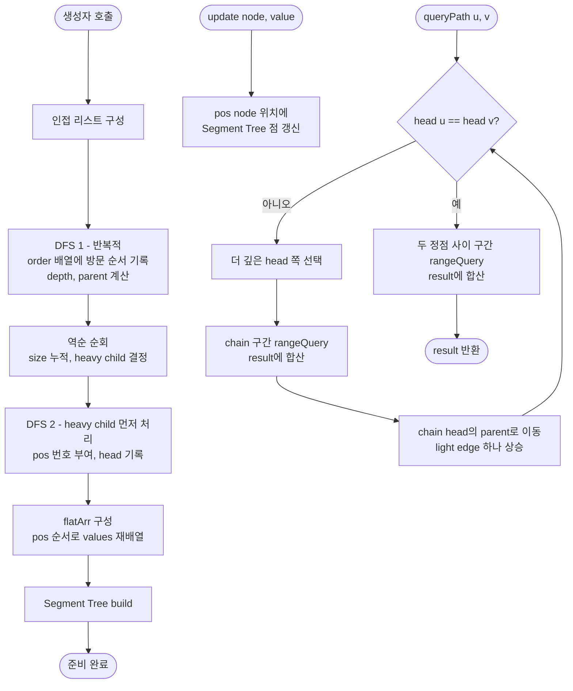

import { AlgorithmSimulation } from "#guide-sim";

# heavyLightDecomposition 해설

## 성능 목표 예측

### 제약 표

| 항목 | 값 |
|------|-----|
| 정점 수 $n$ | $1 \leq n \leq 10^5$ |
| 정점 값 범위 | 정수 (문제 미명시) |
| 연산 수 | 최대 $10^5$회 |

### Naive 접근의 한계

경로 합 질의를 가장 단순하게 구현하면 `queryPath(u, v)` 호출 시 두 정점 사이의 경로를 매번 DFS로 탐색하여 직접 합산한다.

- 경로 탐색: $O(n)$
- 갱신: $O(1)$
- 질의 $q$회 수행: 총 $O(nq) = O(10^5 \times 10^5) = O(10^{10})$ → 시간 초과

### 목표 복잡도와 근거

| 연산 | 목표 복잡도 | 근거 |
|------|-------------|------|
| 전처리 (생성자) | $O(n \log n)$ | Segment Tree 구성 포함 DFS 2회 |
| `update` | $O(\log n)$ | Segment Tree 점 갱신 |
| `queryPath` | $O(\log^2 n)$ | chain $O(\log n)$개 × Segment Tree 구간 질의 $O(\log n)$ |
| 공간 | $O(n)$ | 배열 기반 Segment Tree 상수 배 |

$n = 10^5$에서 $\log^2 n \approx 17^2 = 289$이므로 질의당 289회 연산 수준이어서 충분히 통과한다.

---

## 목표 함수

```ts
class HeavyLightDecomposition {
  constructor(
    n: number,
    edges: [number, number][],
    root: number,
    values: number[]
  ): void

  update(node: number, value: number): void
  queryPath(u: number, v: number): number
}
```

### 파라미터 표

| 파라미터 | 의미 | 제약 |
|----------|------|------|
| `n` | 정점의 수 | $1 \leq n \leq 10^5$ |
| `edges` | 무방향 간선 목록 $[u, v]$ | 길이 $n - 1$ |
| `root` | 트리의 루트 정점 | $0 \leq \text{root} < n$ |
| `values` | 각 정점의 초기 값 | 길이 $n$ |
| `node` (update) | 갱신할 정점 | $0 \leq \text{node} < n$ |
| `value` (update) | 갱신할 값 | 정수 |
| `u`, `v` (queryPath) | 경로 양 끝 정점 | $0 \leq u, v < n$ |

### 반환값

- `update`: 반환 없음. 내부 Segment Tree 상태를 갱신한다.
- `queryPath(u, v)`: 정점 $u$와 $v$ 사이 경로 위 모든 정점 값의 합 (양 끝 포함).

### 엣지케이스

| 케이스 | 입력 예 | 기대 출력 |
|--------|---------|-----------|
| 자기 자신 경로 | `queryPath(3, 3)` | `values[3]` |
| 루트가 경로 위 | `queryPath(좌자손, 우자손)` | LCA(루트) 포함한 경로 합 |
| 단일 정점 트리 | $n=1$, `queryPath(0, 0)` | `values[0]` |
| 선형 체인 전체 | 0-1-2-...-n, `queryPath(0, n-1)` | 전체 합산 (chain 1개) |

---

## 핵심 아이디어

**핵심 아이디어**: "트리 경로를 O(log n)개의 연속 배열 구간으로 분해하면, Segment Tree로 경로 합을 O(log² n)에 처리할 수 있다."

트리에서 두 정점 사이 경로는 배열과 달리 연속 구간이 아니라 구불구불하다. HLD는 각 정점에서 가장 큰 서브트리로 이어지는 heavy edge를 선택하고, 이 heavy edge들을 체인(chain)으로 묶은 뒤 DFS 순서를 부여해 같은 체인의 정점들이 배열에서 연속되도록 만든다. 경로를 따라 이동하다 light edge를 만날 때마다 새 체인으로 전환되는데, 그 횟수가 O(log n)임이 증명되어 경로 질의가 O(log² n)에 해결된다.

**풀이 구조**
1. DFS 1: 각 정점의 서브트리 크기(size), 가장 큰 자식(heavy child), 깊이, 부모를 계산한다.
2. DFS 2: heavy child를 항상 먼저 방문해 DFS 순서 pos를 부여한다. 같은 체인의 정점들이 연속된 pos를 가지게 된다.
3. Segment Tree를 pos 순서로 초기화한다.
4. queryPath(u, v): 두 정점이 같은 체인에 올 때까지 더 깊은 체인의 head를 올리며 체인 구간을 합산한다.

**조건**: 트리 위에서 경로 합 쿼리와 점 갱신이 반복적으로 일어나야 할 때. 정점 수와 쿼리 수가 모두 클 때(n, q ≤ 10^5).

**대표 예시**: 선형 체인 0-1-2-...-9에서 `queryPath(0, 9)` 쿼리
체인이 하나이므로 pos 값이 1부터 10까지 연속으로 배정되고, 경로 전체가 단일 Segment Tree 구간 질의 하나로 처리된다.

**언제 쓰나**
트리 경로에 대한 합/최솟값/최댓값 쿼리와 점 갱신이 함께 필요할 때, 특히 경로가 임의의 두 정점 사이를 지날 수 있는 경우에 HLD를 선택한다.

---

### 원형 아이디어와 naive 접근

경로 합 질의를 가장 단순하게 해결하는 방법은 `queryPath(u, v)` 호출마다 다음을 수행하는 것이다.

```
// naive queryPath
1. LCA(u, v) 탐색 → O(n)
2. u → LCA, v → LCA 경로를 BFS/DFS로 직접 추적 → O(n)
3. 경로 위 모든 정점 값을 직접 합산 → O(n)
```

문제는 `update`가 $O(1)$이지만 `queryPath`가 $O(n)$이라는 점이다. 질의 수 $q = 10^5$라면 총 $O(nq) = O(10^{10})$으로 실용 범위를 벗어난다. 또한 갱신이 잦을수록 캐시 활용도 불가능하다.

### 어떤 관찰이 돌파구가 되는가

- **관찰 1**: Segment Tree는 배열 구간에 대해 합 질의와 점 갱신을 각각 $O(\log n)$에 처리한다. 경로를 연속된 배열 구간으로 표현할 수 있다면 이를 활용할 수 있다.
- **관찰 2**: 트리의 경로는 선형 배열에 직접 대응되지 않는다. 그러나 특정 규칙으로 DFS 순서를 부여하면 경로의 일부 구간을 배열 구간으로 표현할 수 있다.
- **관찰 3**: 정점 $v$에서 자식 $c$로 이동할 때 부분 트리 크기가 절반 이상 감소하는 간선("light edge")은 루트에서 임의 정점까지 경로에 $O(\log n)$개 이하만 존재한다. 따라서 경로를 **연속된 구간 몇 개**로 분리할 수 있다.

### 관찰을 형식화: 상태/구조 정의

위 관찰을 토대로 다음 자료구조를 정의한다.

**Heavy edge**: 정점 $v$의 자식 중 부분 트리 크기가 가장 큰 자식 $c_h$로 향하는 간선. 나머지는 light edge.

$$\text{heavy}(v) = \arg\max_{c \in \text{children}(v)} \text{size}(c)$$

**Heavy path (chain)**: heavy edge로만 이어진 경로 집합. 트리 전체는 서로 겹치지 않는 chain들로 분할된다.

**핵심 DFS 순서 할당**: DFS 탐색 시 heavy child를 항상 먼저 방문하면, 같은 chain에 속한 정점들이 연속된 `pos` 번호를 얻는다.

$$\text{pos}[v], \text{pos}[\text{heavy}(v)], \text{pos}[\text{heavy}(\text{heavy}(v))], \ldots \text{ 연속}$$

상태 정의가 이 형태여야 하는 이유: 다른 방식(예: 깊이 순, 임의 DFS 순)으로 번호를 부여하면 같은 chain의 정점들이 배열에 흩어져 구간 질의로 처리할 수 없다.

| 상태 변수 | 의미 |
|-----------|------|
| `size[v]` | $v$를 루트로 하는 부분 트리의 정점 수 |
| `heavy[v]` | $v$의 heavy child (-1이면 리프) |
| `depth[v]` | 루트로부터의 깊이 |
| `parent[v]` | $v$의 부모 (-1이면 루트) |
| `pos[v]` | $v$에 부여된 DFS 순서 번호 (1-indexed) |
| `head[v]` | $v$가 속한 chain의 최상단 정점 |

### 점화식 또는 핵심 연산

**경로 질의 `queryPath(u, v)` 알고리즘**:

```
while head[u] != head[v]:
    // u와 v가 서로 다른 chain에 있는 경우
    // 더 깊은 chain head를 가진 쪽을 위로 올린다
    if depth[head[u]] < depth[head[v]]:
        swap(u, v)
    // u의 chain 전체 구간 [pos[head[u]], pos[u]] 합산
    result += seg.query(pos[head[u]], pos[u])
    // chain head의 부모로 이동 → 다른 chain으로 전환
    u = parent[head[u]]

// 같은 chain에 도달: 두 정점 사이 구간 합산
if depth[u] > depth[v]: swap(u, v)
result += seg.query(pos[u], pos[v])
```

각 항의 의미:
- `depth[head[u]] < depth[head[v]]`에서 `v` 쪽 chain head가 더 깊다는 것은 `v` 쪽이 LCA에서 더 멀다는 뜻이므로 `v` 쪽을 먼저 올린다.
- `result += seg.query(...)`: 현재 chain 구간의 정점 값 합을 Segment Tree로 $O(\log n)$에 계산.
- `u = parent[head[u]]`: chain head의 부모로 이동하면 light edge를 하나 거슬러 올라가 다른 chain으로 진입한다.

**light edge 횟수가 $O(\log n)$임의 근거**: light edge $v \to c$를 거칠 때마다 $\text{size}(c) \leq \text{size}(v) / 2$이므로 부분 트리 크기가 절반 이하로 감소한다. 루트에서 임의 정점까지 light edge는 최대 $\log_2 n$개이고, 경로 $u \leadsto v$는 LCA를 기준으로 두 방향에서 올라가므로 총 $O(\log n)$개 chain 전환이 발생한다.

### 정당성 — 왜 이것이 옳은가

경로 $u \leadsto v$의 정점 집합은 LCA에서 $u$로 내려오는 경로와 LCA에서 $v$로 내려오는 경로의 합집합이다. 알고리즘은 두 방향에서 chain 단위로 구간을 수집하며 LCA를 향해 수렴한다.

while 루프의 불변식: 루프 매 반복이 끝날 때, 아직 합산하지 않은 경로 부분은 여전히 $u$에서 LCA 방향과 $v$에서 LCA 방향의 일부이다. `head[u] != head[v]`인 동안 두 정점은 같은 chain에 없으므로 LCA는 아직 포함되지 않았다. 루프가 종료되면 `head[u] == head[v]`이고 LCA는 두 정점 사이 어딘가에 있으므로 마지막 `seg.query(pos[u], pos[v])`로 정확히 포함된다.

빈 경로(`u == v`)의 경우: while 진입 전에 `head[u] == head[v]`이고 `pos[u] == pos[v]`이므로 단일 원소 구간 질의 $O(\log n)$로 처리된다. 음수 값이 있어도 Segment Tree는 값을 그대로 저장·합산하므로 영향 없다.

### 구현 디테일과 최적화

**공간 절감**: Segment Tree를 배열로 구현하면 $O(n)$ 추가 공간이면 충분하다. 각 정점의 `pos` 기반으로 1차원 배열에 flat하게 저장한다.

**루프 순서**: DFS 2회 순서가 중요하다. DFS 1에서 size와 heavy child를 계산하고, DFS 2에서 heavy child를 먼저 방문해야 chain 연속성이 보장된다. 순서를 바꾸면 chain 정점들이 배열에 흩어진다.

**함정 - update 시 pos 사용**: `update(node, value)`는 Segment Tree에서 `pos[node]` 위치를 갱신해야 한다. `node` 인덱스를 직접 사용하면 값이 엉뚱한 위치에 기록된다.

**함정 - depth 비교 방향**: `queryPath`에서 더 깊은 `head`를 가진 쪽을 올려야 한다. `head`의 depth가 더 깊은 쪽이 LCA로부터 더 멀리 있다는 뜻이므로, 이쪽을 먼저 처리해야 교차 없이 수렴한다. 방향을 반대로 하면 같은 chain 정점을 두 번 합산하거나 LCA를 건너뛰는 오류가 발생한다.

---

## 시뮬레이션

트리 `n = 7`, `edges = [[0,1], [1,2], [2,3], [3,6], [0,4], [1,5]]`, `root = 0`, `values = [1,2,3,4,5,6,7]`에 대해 HLD를 구성한 뒤 `queryPath(4, 5)`를 처리하는 과정이다. heavy 간선으로 이어진 주 체인은 0-1-2-3-6 이고, 4와 5는 각자 light 간선으로 분리된 단독 체인이다. 트리 패널의 색은 현재 합산 중인 체인 구간(active=현재 정점, frontier=같은 체인에서 함께 합산되는 정점), keyValue 패널은 head/pos 와 누적 result 스냅샷이다.

연산 `queryPath(4, 5)`의 실제 반환값은 `14` (경로 4-0-1-5의 값 합 5+1+2+6)이며, 시뮬레이션 마지막 프레임의 result와 일치한다.

> 대화형 시뮬레이션은 MDX 런타임에서 표시됩니다.

export const mkTree = (s) => ({
  id: 0, label: "0", status: s[0],
  children: [
    { id: 1, label: "1", status: s[1], children: [
      { id: 2, label: "2", status: s[2], children: [
        { id: 3, label: "3", status: s[3], children: [
          { id: 6, label: "6", status: s[6] },
        ]},
      ]},
      { id: 5, label: "5", status: s[5] },
    ]},
    { id: 4, label: "4", status: s[4] },
  ],
});

export const none = { 0: "default", 1: "default", 2: "default", 3: "default", 4: "default", 5: "default", 6: "default" };

export const steps = [
  {
    title: "DFS1: size, heavy child",
    detail: "size=[7,5,3,2,1,1,1]. heavy[0]=1, heavy[1]=2, heavy[2]=3, heavy[3]=6. (4,5는 light)",
    root: mkTree({ ...none, 0: "visited" }),
    entries: [
      { label: "size", value: "[7, 5, 3, 2, 1, 1, 1]" },
      { label: "heavy", value: "0→1, 1→2, 2→3, 3→6" },
    ],
  },
  {
    title: "DFS2: pos, head 부여",
    detail: "heavy child 먼저 방문. 주 체인 0-1-2-3-6은 pos 1..5 연속. head 모두 0. 4, 5는 단독 체인.",
    root: mkTree({ ...none, 0: "visited" }),
    entries: [
      { label: "pos", value: "0:1,1:2,2:3,3:4,6:5,4:6,5:7" },
      { label: "head", value: "0/1/2/3/6→0, 4→4, 5→5" },
    ],
  },
  {
    title: "queryPath(4, 5) 시작",
    detail: "head[4]=4(depth1), head[5]=5(depth2). 5 쪽 head가 더 깊음 → 5 체인부터 합산.",
    root: mkTree({ ...none, 4: "active", 5: "active" }),
    entries: [
      { label: "u, v", value: "4, 5" },
      { label: "result", value: "0" },
    ],
  },
  {
    title: "체인 5 합산",
    detail: "seg.query(pos[5]=7, pos[5]=7) = values[5]=6. result=6. u = parent[head[5]] = parent[5] = 1.",
    root: mkTree({ ...none, 5: "active", 4: "frontier" }),
    entries: [
      { label: "+ 체인[5,5]", value: "6" },
      { label: "result", value: "6" },
    ],
  },
  {
    title: "체인 4 합산",
    detail: "이제 u=1, v=4. head[4]=4가 더 깊음. seg.query(pos[4]=6, pos[4]=6)=values[4]=5. result=11. u=parent[4]=0.",
    root: mkTree({ ...none, 4: "active", 5: "visited" }),
    entries: [
      { label: "+ 체인[4,4]", value: "5" },
      { label: "result", value: "11" },
    ],
  },
  {
    title: "같은 체인 도달",
    detail: "u=0, v=1. head[0]=head[1]=0 → 루프 종료. LCA가 이 체인 구간에 포함된다.",
    root: mkTree({ ...none, 0: "active", 1: "active", 4: "visited", 5: "visited" }),
    entries: [
      { label: "head[u]=head[v]", value: "0" },
      { label: "result", value: "11" },
    ],
  },
  {
    title: "완료: queryPath(4,5) = 14",
    detail: "seg.query(pos[0]=1, pos[1]=2) = values[0]+values[1] = 1+2 = 3. result = 11+3 = 14.",
    root: mkTree({ 0: "active", 1: "active", 2: "default", 3: "default", 6: "default", 4: "visited", 5: "visited" }),
    entries: [
      { label: "+ 체인[0,1]", value: "1 + 2 = 3" },
      { label: "result (반환)", value: "14" },
    ],
  },
];

<AlgorithmSimulation view={["tree", "keyValue"]} steps={steps} title="HLD: queryPath(4, 5)" />

## 수도 코드와 Activity Diagram

### 의사코드

```
class HeavyLightDecomposition:
    pos[], head[], depth[], parent[], size[], heavy[]
    seg[]           // Segment Tree 배열

    constructor(n, edges, root, values):
        adj 구성 (양방향)

        // DFS 1: subtree size, heavy child, depth, parent 계산
        // 방문 순서를 스택으로 기록 (재귀 스택 오버플로우 방지)
        order = []
        stack = [(root, -1, 0)]
        while stack not empty:
            (v, par, d) = stack.pop()
            parent[v] = par          // 불변식: parent[root] = -1
            depth[v] = d
            size[v] = 1
            order.push(v)
            for each u in adj[v]:
                if u != par:
                    stack.push((u, v, d + 1))

        for v in reverse(order):     // 리프 → 루트 방향으로 size 누적
            if parent[v] != -1:
                size[parent[v]] += size[v]
                // heavy child 갱신: 자식 중 size 최대인 것
                if heavy[parent[v]] == -1 or size[v] > size[heavy[parent[v]]]:
                    heavy[parent[v]] = v

        // DFS 2: HLD 순서 번호 부여, chain head 기록
        timer = 0
        stack = [(root, root)]       // (v, chain_head)
        while stack not empty:
            (v, h) = stack.pop()
            pos[v] = ++timer         // 불변식: 같은 chain은 연속된 pos
            head[v] = h
            // light child를 먼저 스택에 넣고(나중에 처리) heavy child를 나중에 넣음
            // (스택 LIFO이므로 heavy child가 먼저 처리됨)
            for each lc in adj[v] (light children, 부모 제외):
                stack.push((lc, lc))    // 새로운 chain 시작
            if heavy[v] != -1:
                stack.push((heavy[v], h))  // 같은 chain 계속

        // Segment Tree 구성: pos 순서로 정렬된 values 배열로 초기화
        flatArr[1..n] = 0
        for v in 0..n-1:
            flatArr[pos[v]] = values[v]
        seg.build(flatArr)              // O(n)

    update(node, value):
        seg.pointUpdate(pos[node], value)  // 불변식: pos[node]는 Segment Tree 내 실제 위치

    queryPath(u, v):
        result = 0
        while head[u] != head[v]:          // 불변식: 매 반복마다 경로 일부를 result에 합산
            if depth[head[u]] < depth[head[v]]:
                swap(u, v)
            // u의 chain 구간 [pos[head[u]], pos[u]] 합산
            result += seg.rangeQuery(pos[head[u]], pos[u])
            u = parent[head[u]]            // light edge 하나 거슬러 올라감
        if depth[u] > depth[v]:
            swap(u, v)                     // 불변식: u가 더 얕은 쪽 (= LCA 방향)
        result += seg.rangeQuery(pos[u], pos[v])  // 같은 chain 내 최종 구간
        return result
```

**핵심 불변식**: 같은 chain 내의 모든 정점은 `pos` 배열에서 연속된 구간을 점유한다. DFS 2에서 heavy child를 항상 먼저 방문(LIFO 스택 기준 마지막에 push)함으로써 이 불변식이 보장된다.

### Activity Diagram



**핵심 불변식**: `head[v]`는 정점 $v$가 속한 chain의 최상단 정점이며, chain 내 정점들의 `pos` 값은 `pos[head[v]]`부터 연속적으로 증가한다.
