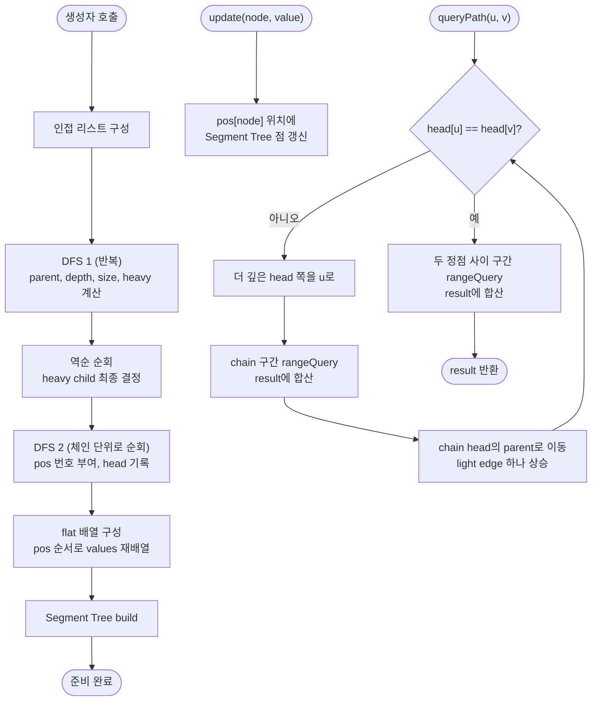

import { AlgorithmSimulation } from "#guide-sim";

# heavyLightDecomposition — 무거운 간선만 남기면 트리 경로가 O(log n)개의 배열 구간으로 접히는 이유

## 한눈에 보는 컨셉

트리 위 두 정점 사이의 경로 합을 빠르게 구하려면, 구불구불한 경로를 배열의 연속 구간처럼 다룰 수 있어야 해요. Heavy-Light Decomposition(HLD)은 각 정점에서 가장 큰 서브트리로 이어지는 heavy edge만 남겨 체인(chain)으로 묶고, 그 체인 순서로 DFS 번호(`pos`)를 매겨 임의의 경로를 `O(log n)`개의 연속 구간으로 쪼갭니다. 쪼갠 구간을 Segment Tree에 얹으면 경로 합 질의는 `O(log^2 n)`, 값 갱신은 `O(log n)`에 끝나요.

## 출발점: 가장 순진한 방법부터

문제를 먼저 정확히 잡을게요.

```ts
class HeavyLightDecomposition {
  constructor(n: number, edges: [number, number][], root: number, values: number[])
  update(node: number, value: number): void
  queryPath(u: number, v: number): number
}
```

| 파라미터 | 의미 | 제약 |
|----------|------|------|
| `n` | 정점 수 | $1 \leq n \leq 10^5$ |
| `edges` | 무방향 간선 목록 `[u, v]` | 길이 $n-1$, 트리(사이클 없음, 연결) |
| `root` | 루트 정점 | $0 \leq \text{root} < n$ |
| `values` | 정점별 초기 값 | 길이 $n$, 정수(음수 가능) |
| `node`, `value` (update) | 갱신 대상과 새 값 | $0 \leq \text{node} < n$ |
| `u`, `v` (queryPath) | 경로 양 끝 | $0 \leq u, v < n$ |

- `update(node, value)`: 반환 없음. 정점 `node`의 값을 `value`로 교체합니다.
- `queryPath(u, v)`: `u`에서 `v`까지 트리 위 유일한 경로(양 끝 포함)의 값 합을 반환합니다. `u == v`면 그 정점 값 하나만 돌려줘요.

문제에 갱신·질의 호출 횟수가 별도로 명시되어 있지는 않지만, 시간 제한 1초와 $n \leq 10^5$이라는 규모, 그리고 이 자료구조가 존재하는 이유(반복 호출을 빠르게 처리) 자체가 호출 횟수도 $n$과 비슷한 자릿수(최대 $10^5$회 안팎)일 것을 시사합니다. 이 가이드는 이 가정 위에서 목표 복잡도를 잡아요.

가장 정직한 방법은 `queryPath(u, v)`가 호출될 때마다 정의 그대로 경로를 직접 추적하는 것입니다. 트리에서 두 정점 사이 경로는 LCA(최소 공통 조상)를 거쳐 가므로, 깊이를 맞춰 가며 함께 위로 올라가면 됩니다.

```ts
function queryPathNaive(
  parent: number[],
  depth: number[],
  values: number[],
  u: number,
  v: number,
): number {
  let sum = 0;
  while (depth[u] > depth[v]) { sum += values[u]; u = parent[u]; } // u를 v 깊이까지
  while (depth[v] > depth[u]) { sum += values[v]; v = parent[v]; } // v를 u 깊이까지
  while (u !== v) { sum += values[u] + values[v]; u = parent[u]; v = parent[v]; } // 함께 LCA까지
  sum += values[u]; // LCA 자신
  return sum;
}
```

비용을 나열해 보면 이렇습니다.

```text
질의 1회: 최악의 경우(일렬로 늘어선 체인 트리) depth ~ n
비용:     질의당 O(n)  ×  q회  =  O(nq) = O(10^5 × 10^5) = O(10^{10})   →  시간 초과
```

`update`는 값 하나만 바꾸면 되니 `O(1)`인데, `queryPath`가 매번 트리를 처음부터 걸어 올라가는 게 병목이에요. 그런데 나열해 보면 낌새가 하나 보입니다 — 이 while 루프들은 결국 부모 포인터를 따라 "한 줄로 곧게 뻗은 구간"을 순서대로 훑는 일을 반복하고 있어요. **만약 이 "곧게 뻗은 구간"들을 미리 배열의 연속 칸으로 만들어 둘 수 있다면, 구간마다 Segment Tree로 한 번에 답할 수 있지 않을까요?** 이것이 이번 알고리즘의 출발 단서입니다.

## 아이디어 자세히 들여다보기

### 체인으로 접기 — 수식과 그림

정점 $v$의 자식 중 서브트리 크기가 가장 큰 자식을 **heavy child**라고 부릅니다.

$$\text{heavy}(v) = \operatorname*{arg\,max}_{c \in \text{children}(v)} \text{size}(c)$$

$v \to \text{heavy}(v)$ 간선을 **heavy edge**, 나머지를 **light edge**라고 해요. heavy edge로만 이어진 극대 경로를 **체인(chain)**이라 부르고, 체인의 맨 위 정점을 그 체인의 `head`라고 합니다. DFS를 돌 때 **heavy child를 항상 먼저 방문**하도록 순서를 정하면, 같은 체인에 속한 정점들이 `pos` 배열에서 연속된 번호를 받습니다.

예시로 `n = 7`, `edges = [[0,1],[1,2],[2,3],[3,6],[0,4],[1,5]]`, `root = 0`, `values = [1,2,3,4,5,6,7]`인 트리를 볼게요. 굵은 선(`═`)이 heavy edge, 얇은 선(`─`)이 light edge입니다.

```text
0 (size 7)
├══1 (size 5)         heavy: size(1)=5 ≥ size(4)=1
│  ├══2 (size 3)       heavy: size(2)=3 ≥ size(5)=1
│  │  └══3 (size 2)    heavy: 자식이 6 하나뿐
│  │     └══6 (size 1)
│  └──5 (size 1)        light
└──4 (size 1)            light
```

이 트리에 `pos`(DFS 순서 번호, 1부터 시작)와 `head`(체인 head)를 실제로 부여하면 다음과 같습니다.

| 정점 | 0 | 1 | 2 | 3 | 4 | 5 | 6 |
|------|---|---|---|---|---|---|---|
| size | 7 | 5 | 3 | 2 | 1 | 1 | 1 |
| heavy child | 1 | 2 | 3 | 6 | – | – | – |
| `pos` | 1 | 2 | 3 | 4 | 6 | 7 | 5 |
| `head` | 0 | 0 | 0 | 0 | 4 | 5 | 0 |

`pos` 순서로 값을 재배열한 배열(`flat`)을 그려 보면, 주 체인 `0-1-2-3-6`이 정확히 연속 구간 `[1, 5]`를 차지하는 걸 볼 수 있어요.

```text
pos:     1   2   3   4   5   6   7
정점:    0   1   2   3   6   4   5
value:   1   2   3   4   7   5   6
         └────── 체인 0-1-2-3-6 (head=0) ──────┘  └4┘  └5┘
```

잠깐, 확인 하나 해 볼까요? 정점 5(`head[5] = 5`)의 `pos`는 몇 번일까요? 표를 보면 7번입니다 — 독립된 체인이라 `pos[5], pos[5]` 자기 자신뿐인 길이 1짜리 구간을 이뤄요.

**왜 하필 "가장 큰 서브트리"를 heavy child로 골라야 할까요?** 자식을 아무렇게나 고르면(예: 항상 첫 번째 자식) light edge를 몇 번이나 지나야 하는지 보장할 수 없습니다. 서브트리 크기가 들쭉날쭉한 트리에서는 최악의 경우 light edge가 정점 수만큼 나올 수도 있어요. "가장 큰" 자식을 고정해야만, light edge를 하나 지날 때마다 서브트리 크기가 최소 절반으로 줄어든다는 사실을 보장할 수 있습니다 — 이 근거는 다음 절에서 자세히 봅니다.

### 단서를 설명해 주는 이론 — 크기 절반 논증(halving argument)

앞 절의 단서("가장 큰 자식을 고르면 light edge가 적게 나올 것 같다")를 정식으로 증명해 볼게요. 이 논증은 이 문제만의 특수한 트릭이 아니라, **한 번 이동할 때마다 크기가 최소 절반으로 줄어드는 대상은 총 `O(log n)`번만 이동할 수 있다**는 일반적인 원리입니다. Union-Find의 union-by-size(작은 집합을 큰 집합에 합쳐 트리 깊이를 `O(log n)`으로 묶는 기법)나, 트리를 재귀적으로 병합할 때 "작은 쪽을 큰 쪽에 합친다(small-to-large merging)"는 설계에서도 똑같은 논증이 등장해요. 기억해 두면 다른 문제에서도 바로 써먹을 수 있습니다.

**주장**: light edge $v \to c$($c \neq \text{heavy}(v)$)에서는 $\text{size}(c) \leq \text{size}(v) / 2$가 성립한다.

**증명**: $c$는 heavy child가 아니므로, heavy child의 정의에 의해 $\text{size}(\text{heavy}(v)) \geq \text{size}(c)$입니다. 한편 $v$의 크기는 자기 자신(1)과 모든 자식 서브트리 크기의 합이므로

$$\text{size}(v) = 1 + \sum_{c' \in \text{children}(v)} \text{size}(c') \;\geq\; \text{size}(\text{heavy}(v)) + \text{size}(c) \;\geq\; 2 \cdot \text{size}(c)$$

양변을 정리하면 $\text{size}(c) \leq \text{size}(v)/2$입니다. $\blacksquare$

이 부등식을 반복 적용하면, 루트에서 임의 정점까지 내려가는 동안 light edge를 지날 때마다 서브트리 크기가 최소 절반이 되므로, light edge 개수는 $\log_2 n$을 넘을 수 없습니다. `queryPath(u, v)`는 $u$에서 LCA까지, $v$에서 LCA까지 두 방향으로 light edge를 거슬러 올라가므로, 체인 전환 횟수는 총 $O(\log n)$입니다.

이제 목표 복잡도를 계산해 볼 수 있어요. $n = 10^5$이면 $\log_2 n \approx 16.6$이니 넉넉히 $17$로 잡습니다. 체인 전환마다 Segment Tree 구간 질의가 $O(\log n)$이므로, `queryPath` 한 번은 대략 $17 \times 17 = 289$회 연산 수준입니다.

| 연산 | 목표 복잡도 | 근거 |
|------|-------------|------|
| 전처리(생성자) | $O(n \log n)$ | DFS 2회 + Segment Tree 구성 |
| `update` | $O(\log n)$ | Segment Tree 점 갱신 |
| `queryPath` | $O(\log^2 n)$ | 체인 전환 $O(\log n)$회 × 구간 질의 $O(\log n)$ |

질의당 289회 연산이면 $q \approx 10^5$번 호출해도 약 $2.9 \times 10^7$ 수준이라 1초 안에 충분히 끝납니다.

### 셈을 맡는 자료구조 — Segment Tree

이 문제에서 Segment Tree는 `pos` 순서로 정렬된 정점 값 배열에 대해 구간 합과 점 갱신을 각각 `O(log n)`에 처리하는 역할만 맡습니다. Segment Tree 자체의 원리(구간을 트리 형태로 쪼개 겹치지 않는 `O(log n)`개의 노드로 표현하는 방식)가 궁금하다면 이 프로젝트의 [segmentTree 가이드](../../../data-structures/range-query/segmentTree/segmentTree-guide.mdx)를 참고하세요. 여기서는 "구간 합을 `O(log n)`에 답하는 블랙박스"로만 사용합니다.

### 왜 모순 없이 작동하는가

`queryPath`가 지키는 불변식은 하나예요.

> 루프의 매 반복이 시작되는 시점에, **아직 `result`에 더해지지 않은 나머지 경로는 정확히 "현재 `u`에서 LCA까지"와 "현재 `v`에서 LCA까지" 두 구간의 합집합이며, 둘은 LCA에서만 겹친다.**

**기저**: 진입 전(첫 반복 직전) `result = 0`이고, 나머지 경로 전체는 원래 경로 $u \leadsto v$ 자체입니다. $u \leadsto v$ 경로는 정의상 "$u \to \text{LCA}$"와 "$v \to \text{LCA}$"의 합집합이므로 불변식이 자명하게 성립합니다.

**귀납 단계**: 불변식이 어떤 반복 시작 시점에 성립한다고 가정할게요. 매 반복은 정확히 두 상황 중 하나입니다(경우의 완전성 — `head[u] == head[v]`이거나 아니거나, 이 둘 외의 제3의 경우는 없습니다).

- **`head[u] != head[v]`인 경우**: `depth[head[u]]`와 `depth[head[v]]`를 비교해 더 깊은 쪽을 `u`로 만듭니다(더 얕은 쪽 head는 아직 LCA일 수도 있으므로 건드리지 않아야 안전해요). `u`의 체인 구간 `[pos[head[u]], pos[u]]`는 정의상 "$u \to \text{LCA}$" 경로 중 아직 처리되지 않은 첫 조각이며 LCA를 포함하지 않습니다(LCA를 포함했다면 애초에 `head[u] == head[LCA]`이고, `head[v]` 쪽도 결국 이 체인에 도달했어야 하는데 두 head가 다르다고 가정했으므로 모순입니다). 이 구간을 `result`에 더하고 `u = parent[head[u]]`로 옮기면, 남은 "$u \to \text{LCA}$" 경로가 정확히 한 칸 줄어든 채로 불변식이 유지됩니다.
- **`head[u] == head[v]`인 경우(종료)**: 두 정점이 이제 같은 체인에 있으므로, LCA도 이 체인 위 어딘가에 있습니다. `depth`가 더 얕은 쪽이 LCA에 더 가깝다는 사실을 이용해 정렬한 뒤 구간 `[pos[u], pos[v]]`를 한 번 더하면, 남은 경로 전체(LCA 포함)가 정확히 한 번씩만 더해집니다.

두 경우 모두에서 이미 더해진 부분과 아직 안 더해진 부분이 겹치지 않는다는 점, 그리고 LCA가 정확히 한 번만 더해진다는 점이 핵심입니다.

여기서 **헷갈리기 쉬운 포인트**가 둘 있습니다.

- **depth 비교 방향을 반대로 하면 어떻게 될까요?** "더 얕은 head를 올려야 한다"고 잘못 기억해서 조건을 뒤집으면(`depth[head[u]] > depth[head[v]]`), 실제로 이 트리에서 `queryPath(4, 5)`를 실행했을 때 무슨 일이 벌어지는지 실측해 봤습니다. 1회차: `head[4]=4`(depth 1), `head[5]=5`(depth 2)인데 `1 > 2`가 거짓이라 스왑이 안 일어나고 `u=4`가 그대로 처리됩니다 → `result=5`, `u=parent[head[4]]=parent[4]=0`. 2회차: `head[0]=0`(depth 0), `head[5]=5`(depth 2)인데 역시 `0 > 2`가 거짓이라 스왑이 안 일어나고 `u=0`이 처리됩니다 → `result=6`, `u=parent[head[0]]=parent[0]=-1`. **`u`가 존재하지 않는 정점 `-1`이 되어 버립니다** — 다음 반복에서 `head[-1]`, `pos[-1]`이 모두 `undefined`가 되어 조용히 `NaN`을 반환하거나 예외를 던집니다. "더 깊은 쪽을 올려야 LCA를 건너뛰지 않는다"는 방향이 핵심이에요.
- **`update`에서 `pos[node]` 대신 `node`를 그대로 쓰면 어떻게 될까요?** 이 트리에서 `values = [1,2,3,4,5,6,7]`일 때 `queryPath(0, 4) = 6`(= `values[0]+values[4]` = 1+5), `queryPath(0, 6) = 17`(체인 `0-1-2-3-6` 전체 = 1+2+3+4+7)입니다. 이제 `update(4, 100)`을 호출하면서 실수로 세그먼트 트리 위치를 `pos[4](=6)`이 아니라 정점 번호 `4`를 그대로 써서 갱신했다고 해 봅시다. 위치 `4`는 실제로는 `pos[3] = 4`이므로 **정점 3의 자리가 오염**됩니다. 실측 결과 `queryPath(0, 4)`는 여전히 `6`(정점 4는 안 바뀌었으니 갱신이 의도대로 반영되지 않은 것)이고, `queryPath(0, 6)`은 `17`에서 `113`(`= 1+2+3+100+7`)으로 **엉뚱하게 튑니다**. `node` 인덱스와 `pos[node]`를 헷갈리면 이렇게 의도한 정점과 전혀 다른 정점이 조용히 망가집니다.

엣지 케이스도 불변식 위에서 확인해 두면 안심할 수 있어요.

```text
u == v (자기 자신 경로)   → head[u]==head[v]이고 pos[u]==pos[v] → while 진입 없이
                            바로 seg.query(pos[u], pos[u]) = values[u] 반환
단일 정점 트리 (n=1)      → 체인이 정점 하나뿐, pos[0]=1, head[0]=0. queryPath(0,0) = values[0]
선형 체인 전체            → 체인이 하나이므로 while 루프가 한 번도 안 돌고
                            바로 [pos[0], pos[n-1]] 구간 하나로 처리됨
루트가 경로 위에 있는 경우 → 두 방향에서 온 체인이 head=root인 체인에서 만나
                            while 종료 후 마지막 구간에 루트가 포함되어 처리됨
```

## 아이디어를 코드로 옮기기

```ts
class HeavyLightDecomposition {
  private readonly n: number;
  private readonly parent: number[];
  private readonly depth: number[];
  private readonly heavy: number[];
  private readonly head: number[];
  private readonly pos: number[];
  private readonly tree: number[]; // 재귀 Segment Tree, 1-indexed pos

  constructor(n: number, edges: [number, number][], root: number, values: number[]) {
    this.n = n;
    this.parent = new Array(n).fill(-1);
    this.depth = new Array(n).fill(0);
    const size = new Array(n).fill(1);
    this.heavy = new Array(n).fill(-1);
    this.head = new Array(n).fill(0);
    this.pos = new Array(n).fill(0);

    const adj: number[][] = Array.from({ length: n }, () => []);
    for (const [u, v] of edges) {
      adj[u].push(v);
      adj[v].push(u);
    }

    // DFS 1 (반복 스택 — n=10^5 규모에서 재귀는 스택 오버플로 위험이 있다)
    const order: number[] = [];
    const stack1: [number, number, number][] = [[root, -1, 0]];
    while (stack1.length > 0) {
      const [v, par, d] = stack1.pop()!;
      this.parent[v] = par;
      this.depth[v] = d;
      order.push(v);
      for (const u of adj[v]) if (u !== par) stack1.push([u, v, d + 1]);
    }
    for (let i = order.length - 1; i >= 0; i--) {
      const v = order[i]!;
      const p = this.parent[v];
      if (p !== -1) {
        size[p] += size[v];
        if (this.heavy[p] === -1 || size[v] > size[this.heavy[p]]) this.heavy[p] = v;
      }
    }

    // DFS 2 (체인 단위로 직접 걷기): 큐에서 체인의 시작 정점을 하나씩 꺼내
    // heavy child를 따라 체인 끝까지 쭉 내려가며 pos를 매기고, 만나는 light child는
    // 새 체인의 시작으로 큐에 넣는다.
    let timer = 0;
    const queue: number[] = [root];
    let qi = 0;
    while (qi < queue.length) {
      const chainStart = queue[qi++]!;
      const h = chainStart;
      let x: number = chainStart;
      while (x !== -1) {
        this.pos[x] = ++timer;
        this.head[x] = h;
        for (const c of adj[x]) {
          if (c !== this.parent[x] && c !== this.heavy[x]) queue.push(c);
        }
        x = this.heavy[x];
      }
    }

    // Segment Tree 구성 (pos 순서로 재배열한 flat 배열 기준)
    const flat = new Array(n + 1).fill(0);
    for (let v = 0; v < n; v++) flat[this.pos[v]] = values[v];
    this.tree = new Array(4 * Math.max(n, 1)).fill(0);
    if (n > 0) this.build(1, 1, n, flat);
  }

  private build(node: number, lo: number, hi: number, flat: number[]): void {
    if (lo === hi) { this.tree[node] = flat[lo]; return; }
    const mid = (lo + hi) >> 1;
    this.build(2 * node, lo, mid, flat);
    this.build(2 * node + 1, mid + 1, hi, flat);
    this.tree[node] = this.tree[2 * node] + this.tree[2 * node + 1];
  }

  private updateAt(node: number, lo: number, hi: number, target: number, value: number): void {
    if (lo === hi) { this.tree[node] = value; return; }
    const mid = (lo + hi) >> 1;
    if (target <= mid) this.updateAt(2 * node, lo, mid, target, value);
    else this.updateAt(2 * node + 1, mid + 1, hi, target, value);
    this.tree[node] = this.tree[2 * node] + this.tree[2 * node + 1];
  }

  private queryRange(node: number, lo: number, hi: number, l: number, r: number): number {
    if (r < lo || hi < l) return 0;
    if (l <= lo && hi <= r) return this.tree[node];
    const mid = (lo + hi) >> 1;
    return this.queryRange(2 * node, lo, mid, l, r) + this.queryRange(2 * node + 1, mid + 1, hi, l, r);
  }

  update(node: number, value: number): void {
    this.updateAt(1, 1, this.n, this.pos[node], value); // pos[node] — node 그대로 쓰지 않는다
  }

  queryPath(u: number, v: number): number {
    let result = 0;
    while (this.head[u] !== this.head[v]) {
      if (this.depth[this.head[u]] < this.depth[this.head[v]]) [u, v] = [v, u]; // 더 깊은 head를 u로
      result += this.queryRange(1, 1, this.n, this.pos[this.head[u]], this.pos[u]);
      u = this.parent[this.head[u]];
    }
    if (this.depth[u] > this.depth[v]) [u, v] = [v, u];
    result += this.queryRange(1, 1, this.n, this.pos[u], this.pos[v]);
    return result;
  }
}
```

**가장 실수가 잦은 부분은 DFS 2의 큐 처리 순서와 `queryPath`의 depth 비교 두 곳입니다.**

- DFS 2에서 `x = this.heavy[x]`로 체인을 끝까지 내려가면서, light child는 즉시 처리하지 않고 큐에 미뤄 둡니다(`queue.push(c)`). 이 순서를 지켜야 같은 체인의 `pos`가 끊기지 않고 연속됩니다. light child를 먼저 처리해 버리면 체인 중간에 다른 체인의 `pos`가 끼어들어 구간 질의가 깨집니다.
- `queryPath`의 `if (this.depth[this.head[u]] < this.depth[this.head[v]])`는 앞 절에서 본 것처럼 방향을 반대로 하면 `u`가 `-1`까지 떠밀려 올라가며 조용히 깨집니다.

## 더 빠르게 만들 단서 찾기

지금 구현은 이미 목표 복잡도 `O(log^2 n)`을 달성했지만, 실제로 도는 모습을 관찰해 보면 낭비가 하나 보입니다. `queryRange`는 재귀 호출마다 함수 호출 오버헤드를 지불하고, 매번 `r < lo`, `hi < l` 두 번의 경계 비교를 거칩니다. `queryPath` 한 번은 최대 `O(log n)`번의 체인 전환을 거치고, 체인 전환마다 `queryRange`가 다시 `O(log n)` 깊이로 재귀 호출을 합니다.

```text
queryPath 한 번:
  체인 전환    최대 ~17회 (log2(10^5))
  × 체인마다   queryRange 재귀 호출 ~17단계, 매 단계 함수 호출 + 경계 비교 2회
  = 최악의 경우 약 17 × 17 ≈ 289회의 "재귀 함수 호출"이 발생
```

점근 복잡도 `O(log^2 n)`은 그대로지만, 함수 호출 자체의 상수 비용(스택 프레임 생성, 매개변수 전달)이 쌓이면 $q=10^5$번 호출될 때 체감 성능에 영향을 줍니다. **재귀를 걷어내고 반복문만으로 같은 일을 할 수 있다면 상수항을 줄일 수 있지 않을까요?**

## 단서를 최적화로 연결하기

Segment Tree를 배열 하나로 표현하는 고전적인 기법이 있습니다. 리프를 `tree[n..2n-1]`에 두고, 내부 노드를 `tree[1..n-1]`에 두면, 부모는 항상 `i >> 1`, 자식은 `2i`와 `2i+1`로 인덱스 계산만으로 찾을 수 있어요.

```text
Before(재귀, lo/hi 경계 비교):        After(반복, 인덱스 시프트):
       tree[1]                              tree[1]
      /        \                            /      \
  tree[2]    tree[3]      ⇒            tree[2]   tree[3]
  /    \      /    \                    /   \      /   \
...    ...  ...    ...              tree[n]..tree[2n-1] (리프, 배열 뒤쪽 절반)

point update: 리프에서 i >>= 1 하며 부모까지 O(log n)번 갱신, 재귀 없음
range query : lo, hi를 리프 인덱스로 놓고 서로를 향해 접근하며 O(log n)번에 합산
```

**갱신**은 리프 값을 바꾼 뒤 `i`를 계속 절반으로 줄이며(`i >>= 1`) 부모를 다시 계산하면 끝입니다. **구간 질의**는 `lo`, `hi`를 리프 인덱스로 두고, `lo`가 홀수면(오른쪽 자식이면) 그 값을 더하고 한 칸 옮기고, `hi`가 홀수 경계를 넘으면(오른쪽 경계 리프를 포함하면) 그 값을 더하고 한 칸 줄이는 식으로 양쪽에서 중앙을 향해 좁혀 갑니다. 재귀도, 경계 비교도 없이 비트 연산과 배열 인덱싱만 남아요.

## 최적화 코드

바뀌는 곳은 Segment Tree 내부 구현 세 메서드뿐입니다. 클래스의 나머지(`parent`, `depth`, `heavy`, `head`, `pos` 계산과 `queryPath`의 체인 순회 로직)는 그대로예요.

```ts
// 생성자에서: this.tree 대신 segN(리프 개수)과 2*segN 크기 배열 사용
this.segN = Math.max(n, 1);
this.tree = new Array(2 * this.segN).fill(0);
for (let v = 0; v < n; v++) this.tree[this.segN + (this.pos[v] - 1)] = values[v]; // pos-1: 0-indexed 리프
for (let i = this.segN - 1; i >= 1; i--) this.tree[i] = this.tree[2 * i] + this.tree[2 * i + 1];

// updateAt/queryRange 대신
private updateIter(leafIdx: number, value: number): void {
  let i = leafIdx + this.segN;
  this.tree[i] = value;
  while (i > 1) {
    i >>= 1;
    this.tree[i] = this.tree[2 * i] + this.tree[2 * i + 1];
  }
}

private queryIter(l: number, r: number): number {
  let lo = l + this.segN;
  let hi = r + this.segN + 1; // 반열린구간으로 변환 — +1을 빠뜨리면 오른쪽 끝이 통째로 누락된다
  let res = 0;
  while (lo < hi) {
    if (lo & 1) res += this.tree[lo++]!;
    if (hi & 1) res += this.tree[--hi]!;
    lo >>= 1;
    hi >>= 1;
  }
  return res;
}

// update / queryPath 호출부는 pos[x] - 1을 0-indexed 리프 인덱스로 넘기도록만 바뀐다
update(node: number, value: number): void {
  this.updateIter(this.pos[node] - 1, value);
}
```

**가장 중요한 줄은 `queryIter`의 `hi = r + this.segN + 1`입니다.** Segment Tree 내부를 반열린구간 `[lo, hi)`로 다루기 때문에, 포함해야 할 오른쪽 끝 `r`을 실제로 포함시키려면 `+1`이 꼭 필요해요. 이 `+1`을 빠뜨리면 `queryIter(l, r)`이 `r` 위치의 값을 누락한 채 계산되어, 예를 들어 `queryPath`의 마지막 구간 질의에서 경로 끝 정점 하나의 값이 조용히 빠지는 오답이 납니다.

여기서 더 빠르게 만들 여지가 있을까요? 점근 복잡도 자체를 `O(log n)`으로 낮추는 특화 기법(예: Euler tour를 다른 방식으로 병합하거나, link-cut tree 같은 동적 트리 구조를 쓰는 방법)도 존재합니다. 하지만 구현 복잡도가 훨씬 크고, 이 문제처럼 "구간 합"뿐 아니라 최솟값·최댓값·GCD 등 다른 연산으로도 손쉽게 바꿔 쓸 수 있어야 하는 상황에서는, HLD + Segment Tree 조합의 단순함과 예측 가능한 `O(log^2 n)`이 실전에서 더 널리 쓰입니다. 이 알고리즘을 배우는 이유는 바로 이 범용성이에요.

## 실행 시각화

앞서 3.1절에서 쓴 것과 같은 트리 `n = 7`, `edges = [[0,1], [1,2], [2,3], [3,6], [0,4], [1,5]]`, `root = 0`, `values = [1,2,3,4,5,6,7]`에 대해 `queryPath(4, 5)`를 처리하는 과정입니다. heavy edge로 이어진 주 체인은 `0-1-2-3-6`이고, `4`와 `5`는 각자 light edge로 분리된 단독 체인이에요(체인 표는 3.1절 표와 동일). 트리 패널의 색은 현재 합산 중인 체인 구간(`active`=현재 정점, `frontier`=같은 체인에서 함께 합산되는 정점), `keyValue` 패널은 `head`/`pos`와 누적 `result` 스냅샷입니다.

연산 `queryPath(4, 5)`의 실제 반환값은 `14`(경로 `4-0-1-5`의 값 합 `5+1+2+6`)이며, 시뮬레이션 마지막 프레임의 `result`와 일치합니다.

> 대화형 시뮬레이션은 MDX 런타임에서 표시됩니다.

export const mkTree = (s) => ({
  id: 0, label: "0", status: s[0],
  children: [
    { id: 1, label: "1", status: s[1], children: [
      { id: 2, label: "2", status: s[2], children: [
        { id: 3, label: "3", status: s[3], children: [
          { id: 6, label: "6", status: s[6] },
        ]},
      ]},
      { id: 5, label: "5", status: s[5] },
    ]},
    { id: 4, label: "4", status: s[4] },
  ],
});

export const none = { 0: "default", 1: "default", 2: "default", 3: "default", 4: "default", 5: "default", 6: "default" };

export const steps = [
  {
    title: "DFS1: size, heavy child",
    detail: "size=[7,5,3,2,1,1,1]. heavy[0]=1, heavy[1]=2, heavy[2]=3, heavy[3]=6. (4,5는 light)",
    root: mkTree({ ...none, 0: "visited" }),
    entries: [
      { label: "size", value: "[7, 5, 3, 2, 1, 1, 1]" },
      { label: "heavy", value: "0→1, 1→2, 2→3, 3→6" },
    ],
  },
  {
    title: "DFS2: pos, head 부여",
    detail: "heavy child 먼저 방문. 주 체인 0-1-2-3-6은 pos 1..5 연속. head 모두 0. 4, 5는 단독 체인.",
    root: mkTree({ ...none, 0: "visited" }),
    entries: [
      { label: "pos", value: "0:1,1:2,2:3,3:4,6:5,4:6,5:7" },
      { label: "head", value: "0/1/2/3/6→0, 4→4, 5→5" },
    ],
  },
  {
    title: "queryPath(4, 5) 시작",
    detail: "head[4]=4(depth1), head[5]=5(depth2). 5 쪽 head가 더 깊음 → 5 체인부터 합산.",
    root: mkTree({ ...none, 4: "active", 5: "active" }),
    entries: [
      { label: "u, v", value: "4, 5" },
      { label: "result", value: "0" },
    ],
  },
  {
    title: "체인 5 합산",
    detail: "seg.query(pos[5]=7, pos[5]=7) = values[5]=6. result=6. u = parent[head[5]] = parent[5] = 1.",
    root: mkTree({ ...none, 5: "active", 4: "frontier" }),
    entries: [
      { label: "+ 체인[5,5]", value: "6" },
      { label: "result", value: "6" },
    ],
  },
  {
    title: "체인 4 합산",
    detail: "이제 u=1, v=4. head[4]=4가 더 깊음. seg.query(pos[4]=6, pos[4]=6)=values[4]=5. result=11. u=parent[4]=0.",
    root: mkTree({ ...none, 4: "active", 5: "visited" }),
    entries: [
      { label: "+ 체인[4,4]", value: "5" },
      { label: "result", value: "11" },
    ],
  },
  {
    title: "같은 체인 도달",
    detail: "u=0, v=1. head[0]=head[1]=0 → 루프 종료. LCA가 이 체인 구간에 포함된다.",
    root: mkTree({ ...none, 0: "active", 1: "active", 4: "visited", 5: "visited" }),
    entries: [
      { label: "head[u]=head[v]", value: "0" },
      { label: "result", value: "11" },
    ],
  },
  {
    title: "완료: queryPath(4,5) = 14",
    detail: "seg.query(pos[0]=1, pos[1]=2) = values[0]+values[1] = 1+2 = 3. result = 11+3 = 14.",
    root: mkTree({ 0: "active", 1: "active", 2: "default", 3: "default", 6: "default", 4: "visited", 5: "visited" }),
    entries: [
      { label: "+ 체인[0,1]", value: "1 + 2 = 3" },
      { label: "result (반환)", value: "14" },
    ],
  },
];

<AlgorithmSimulation view={["tree", "keyValue"]} steps={steps} title="HLD: queryPath(4, 5)" />

## 흐름 한눈에 보기


```mermaid
flowchart TD
    A(["생성자 호출"]) --> B["인접 리스트 구성"]
    B --> C["DFS 1 (반복)<br/>parent, depth, size, heavy 계산"]
    C --> D["역순 순회<br/>heavy child 최종 결정"]
    D --> E["DFS 2 (체인 단위로 순회)<br/>pos 번호 부여, head 기록"]
    E --> F["flat 배열 구성<br/>pos 순서로 values 재배열"]
    F --> G["Segment Tree build"]
    G --> H(["준비 완료"])

    I(["update(node, value)"]) --> J["pos[node] 위치에<br/>Segment Tree 점 갱신"]

    K(["queryPath(u, v)"]) --> L{"head[u] == head[v]?"}
    L -- 아니오 --> M["더 깊은 head 쪽을 u로"]
    M --> N["chain 구간 rangeQuery<br/>result에 합산"]
    N --> O["chain head의 parent로 이동<br/>light edge 하나 상승"]
    O --> L
    L -- 예 --> P["두 정점 사이 구간 rangeQuery<br/>result에 합산"]
    P --> Q(["result 반환"])
```

## 스스로 점검하기

1. 같은 트리(`n=7`, `values=[1,2,3,4,5,6,7]`)에서 `queryPath(6, 5)`를 손으로 따라가 보세요. 경로가 어떤 체인들을 거치는지, 각 체인에서 얼마씩 더해지는지 적어 보고 최종 값을 구해 보세요. (경로는 `6-3-2-1-5`이고, 값의 합은 `7+4+3+2+6 = 22`입니다.)
2. `update(4, 100)`을 호출할 때 `pos[4]`가 아니라 정점 번호 `4`를 그대로 세그먼트 트리 위치로 써 버렸다고 해 봅시다. 이 트리에서 `queryPath(0, 4)`와 `queryPath(0, 6)`이 버그 전후로 각각 어떻게 달라지는지, 어느 정점의 값이 실제로 오염되는지 추적해 보세요.
3. 이 구조를 경로의 최댓값(`max`) 질의로 바꾸려면 어디를 고쳐야 할까요? 만약 경로가 아니라 **서브트리 전체**의 값 합을 구하는 질의(`querySubtree(v)`)까지 지원하려면, `pos`를 부여하는 방식의 어떤 성질을 활용할 수 있을지 생각해 보세요. (힌트: 같은 서브트리에 속한 정점들의 `pos`도 연속 구간을 이룹니다.)
