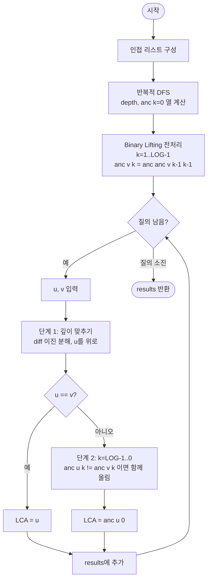

import { AlgorithmSimulation } from "#guide-sim";

# lowestCommonAncestor — 거리를 이진수로 쪼개면 조상 찾기가 로그 번의 점프로 끝나는 이유

## 한눈에 보는 컨셉

루트가 있는 트리에서 두 정점의 최소 공통 조상(LCA)을 구하는 문제예요. 한 칸씩 부모로 걸어 올라가면 질의마다 `O(n)`이 걸려 질의가 많을 때 감당이 안 되는데, 각 정점의 `2^k`번째 조상을 미리 표로 만들어 두면 올라가야 할 거리를 이진수로 쪼개 `O(log n)`번의 점프로 조상까지 뛰어오를 수 있습니다. 이 기법을 Binary Lifting이라고 부르며, 전처리 `O(n log n)` 한 번으로 이후 모든 질의를 `O(log n)`에 답합니다.

## 출발점: 가장 순진한 방법부터

문제를 먼저 정확히 잡을게요.

```ts
function lowestCommonAncestor(
  n: number,
  edges: [number, number][],
  root: number,
  queries: [number, number][]
): number[]
```

- `n` — 정점 수, $1 \leq n \leq 10^5$
- `edges` — 무방향 간선 $n-1$개. 주어진 그래프는 항상 연결된 트리
- `root` — 루트 정점 번호, $0 \leq \text{root} < n$
- `queries` — LCA를 구할 정점 쌍 목록
- 반환 — 길이 `queries.length`인 배열. `i`번째 원소는 `queries[i]`의 최소 공통 조상 정점 번호

정점 자신도 자기 자신의 조상으로 칩니다. 그래서 `u`가 `v`의 조상이면 `lca(u, v) == u`이고, `lca(u, u) == u`예요. 문제에 질의 수 상한이 따로 적혀 있지는 않지만, 시간 제한 1초 안에 처리하려면 질의당 `O(n)`으로는 버틸 수 없다는 점을 미리 기억해 둡시다.

두 정점의 최소 공통 조상이란 "두 정점 모두의 조상이면서 루트로부터 가장 먼 정점"입니다. '조상'이라는 말 자체가 트리에서 루트 방향으로 거슬러 올라가는 관계를 뜻하니, 가장 직관적인 방법은 실제로 그 방향으로 걸어보는 거예요. 더 깊은 정점을 부모로 한 칸씩 올려 두 정점의 깊이를 맞추고, 그다음부터는 둘을 동시에 한 칸씩 올리며 처음으로 같아지는 지점을 찾으면 됩니다.

```ts
function lowestCommonAncestorNaive(
  n: number,
  edges: [number, number][],
  root: number,
  queries: [number, number][]
): number[] {
  const adj: number[][] = Array.from({ length: n }, () => []);
  for (const [u, v] of edges) {
    adj[u].push(v);
    adj[v].push(u);
  }

  const parent = new Array<number>(n).fill(-1);
  const depth = new Array<number>(n).fill(0);
  const visited = new Array<boolean>(n).fill(false);
  const stack: number[] = [root];
  visited[root] = true;
  while (stack.length > 0) {
    const v = stack.pop()!;
    for (const u of adj[v]) {
      if (!visited[u]) {
        visited[u] = true;
        parent[u] = v;
        depth[u] = depth[v] + 1;
        stack.push(u);
      }
    }
  }

  return queries.map(([uIn, vIn]) => {
    let u = uIn;
    let v = vIn;
    while (u !== v) {
      if (depth[u] > depth[v]) u = parent[u]; // 더 깊은 쪽을 한 칸 올린다
      else v = parent[v];
    }
    return u;
  });
}
```

이 방법이 얼마나 느려질 수 있는지 작은 체인으로 체감해 봅시다.

```text
체인:  0 - 1 - 2 - 3 - 4 - 5

lca(0, 5) 질의:
  depth[0]=0, depth[5]=5  →  더 깊은 5를 한 칸씩 올린다
  5 → 4 → 3 → 2 → 1 → 0     (5번 이동해야 0과 만난다)

정점 6개짜리 체인 하나에서 질의 하나에 5번의 이동 = O(n)
```

정점 수가 $n$까지 늘어나는 선형 체인이라면 질의 하나가 최악 $O(n)$이 걸리고, 질의가 $q$번 들어오면 총 $O(nq)$입니다. $n, q$가 모두 $10^5$ 근처면 $O(10^{10})$ — 1초 안에 절대 끝나지 않아요.

매번 한 칸씩 다시 오르는 대신, 큰 걸음으로 한 번에 여러 칸을 건너뛸 수는 없을까요? 그러려면 "몇 칸을 뛸지"를 미리 알고 있어야 합니다.

## 아이디어 자세히 들여다보기

### 2ᵏ칸씩 뛰어오르기 — 수식과 그림

한 칸씩(1칸) 조상을 저장하는 대신, 정점마다 $1, 2, 4, 8, \dots$ 칸 위의 조상을 미리 표로 만들어 두면 어떨까요? 정점 $v$의 $2^k$번째 조상을 다음과 같이 정의합니다.

$$\text{anc}[v][k] = v\text{의 } 2^k\text{번째 조상}$$

이 표는 점화식으로 채울 수 있어요.

$$\text{anc}[v][0] = \text{parent}(v)$$
$$\text{anc}[v][k] = \text{anc}[\text{anc}[v][k-1]][k-1] \quad (k \geq 1)$$

두 번째 식이 말하는 건 단순해요 — "$2^k$번째 조상은 $2^{k-1}$번째 조상의 $2^{k-1}$번째 조상"이라는 것뿐입니다. $2^{k-1} + 2^{k-1} = 2^k$이니까요.

**왜 하필 2의 거듭제곱이어야 할까요?** 만약 3칸씩, 5칸씩처럼 임의의 간격으로 조상을 저장해 둔다면, 목표 거리 $d$를 그 간격들의 합으로 정확히 만들어낼 수 있다는 보장이 없습니다. 반면 $1, 2, 4, 8, \dots$는 특별합니다 — 모든 자연수는 이 수열의 부분합으로 **유일하게** 표현됩니다(이진 표현의 존재성과 유일성). 그래서 임의의 거리 $d$에 대해 항상 정확히 도달하는 점프 조합이 존재하고, 그 조합은 $d$를 이진수로 적었을 때 켜져 있는 비트들과 정확히 대응합니다.

$$d = \sum_{k} b_k \cdot 2^k \quad (b_k \in \{0, 1\})$$

체인 `0-1-2-3-4-5`에서 실제로 표를 채워 봅시다. `depth[v] = v`이고, 부모는 `parent(v) = v - 1`(루트 0의 부모는 자기 자신)입니다.

```text
v          :  0  1  2  3  4  5
anc[v][0]  :  0  0  1  2  3  4     (1칸 위 = 부모)
anc[v][1]  :  0  0  0  1  2  3     (2칸 위)
anc[v][2]  :  0  0  0  0  0  1     (4칸 위)
```

잠깐 확인해 볼까요? `anc[5][1]`은 몇일까요? 정점 5의 부모(`anc[5][0]`)는 4, 4의 부모(`anc[4][0]`)는 3이니 `anc[5][1] = 3`입니다. 표와 일치하죠.

이제 `lca(0, 5)`를 구하려고 정점 5를 5칸 올려야 한다고 해 봅시다. $5 = 101_2 = 4 + 1$이므로 비트 0과 비트 2가 켜져 있습니다.

```text
u = 5
① 비트 0 (1칸): u = anc[5][0] = 4
② 비트 2 (4칸): u = anc[4][2] = 0
```

단 2번의 표 참조로 0에 도착했습니다. 한 칸씩 5번 올라가던 것과 같은 결과를, 이진 분해 덕분에 절반이 채 안 되는 횟수로 끝낸 거예요.

### 단서를 설명해 주는 이론 — 이진 분해와 더블링 기법

방금 쓴 방법은 "이진 분해(binary decomposition)"라는 일반 원리의 한 적용입니다. 모든 음이 아닌 정수 $d$는 이진수로 유일하게 표현되고, 이는 $d$를 $2^0, 2^1, 2^2, \dots$ 중 서로 다른 항들의 합으로 정확히 한 가지 방식으로 쪼갤 수 있다는 뜻이에요. 곱셈에서 이 원리를 쓰면 분할정복 거듭제곱(fast exponentiation, $a^n$을 $O(\log n)$에 계산)이 되고, 조상 찾기에 쓰면 지금 보고 있는 Binary Lifting이 됩니다.

이 원리를 표(table) 전처리에 쓰는 방식을 "더블링 기법(doubling technique)"이라고 부릅니다 — "$2^{k-1}$짜리 답 두 개를 합쳐 $2^k$짜리 답을 만든다"는 점화식 구조가 핵심이에요. $n$개 정점 각각에 대해 $O(\log n)$개의 $k$를 채우므로 전체 전처리는 $O(n \log n)$이고, 질의 하나는 이진 분해된 비트 수만큼, 즉 최대 $\lceil \log_2 n \rceil$번의 표 참조로 끝납니다. $n = 10^5$일 때 $\lceil \log_2 n \rceil = 17$이므로, 질의당 최대 17번 — naive의 $O(n)$과 비교하면 압도적입니다.

이 "이진 분해로 상태를 조립한다"는 아이디어는 뒤에서 정당성을 증명할 때도 그대로 쓰입니다. 지금은 "표를 채우는 원리"로, 잠시 후에는 "두 정점을 동시에 올리는 원리"로 다시 등장한다는 점을 기억해 두세요.

### 왜 모순 없이 작동하는가

Binary Lifting이 정확한 LCA를 돌려준다는 것을 두 단계로 나눠 확인합니다.

**1단계 — 표 자체가 올바른가 (귀납법)**

주장: 모든 $v, k$에 대해 `anc[v][k]`는 정확히 $v$의 $2^k$번째 조상이다(단, 그런 조상이 없으면 루트 자신).

- 기저($k=0$): `anc[v][0] = parent(v)`는 DFS로 직접 계산한 값이므로 정의상 옳습니다.
- 귀납 단계($k \geq 1$): `anc[·][k-1]`이 모든 정점에 대해 옳다고 가정하면, `anc[v][k] = anc[anc[v][k-1]][k-1]`은 "$v$의 $2^{k-1}$번째 조상"의 "$2^{k-1}$번째 조상"입니다. $2^{k-1}$칸 오르고 다시 $2^{k-1}$칸 오르면 총 $2^{k-1} + 2^{k-1} = 2^k$칸을 오른 것과 같으므로 `anc[v][k]`는 정확히 $v$의 $2^k$번째 조상입니다. 이 재귀 하나가 모든 $k \geq 1$을 빠짐없이 커버하므로 다른 경우는 없습니다.

**2단계 — 질의 알고리즘이 LCA를 정확히 찾는가**

단계 1(깊이 맞추기)에서 이진 분해로 $d = \text{depth}[u] - \text{depth}[v]$칸을 올리면, 정의상 두 정점의 깊이가 정확히 같아집니다. 이 시점에 `u == v`라면 원래 둘 중 하나가 다른 하나의 조상이었다는 뜻이니 바로 반환합니다.

`u != v`라면 단계 2(동시에 올리기)로 넘어갑니다. $k = \lceil \log_2 n \rceil - 1$부터 $0$까지 내려오며, `anc[u][k] != anc[v][k]`이면 둘 다 그만큼 올립니다. 이 루프가 끝나면 `anc[u][0]`이 LCA라는 것을 보이면 됩니다.

- **경우의 완전성**: 각 $k$에서 `anc[u][k]`와 `anc[v][k]`는 같거나 다르거나 둘 중 하나뿐입니다. 다른 경우는 없습니다.
- **"다르면 climb"의 정확성**: 다르다는 건 $2^k$칸을 올려도 아직 LCA를 지나치지 않았다는 뜻입니다(지나쳤다면 이미 같은 조상에서 만났을 테니까요). 그러니 안전하게 그만큼 올려도 됩니다.
- **"같으면 skip"의 정확성**: 같다는 건 $2^k$칸을 올리면 LCA에 도달하거나 지나쳐버린다는 뜻입니다. 지금 당장은 올리지 않고 더 작은 $k$로 세밀하게 접근해야, 딱 LCA 바로 아래에서 멈출 수 있습니다.

큰 $k$부터 처리하는 것이 왜 필수인지는 "여기서 헷갈리기 쉬운 포인트"로 따로 짚을게요.

**여기서 헷갈리기 쉬운 포인트는 단계 2의 루프 방향입니다.** $k$를 큰 값부터 내려오지 않고 작은 값부터 올라가면, 초반의 작은 점프가 `u`, `v`를 먼저 옮겨버려서 이후 큰 점프가 "원래 위치 기준"이 아니라 "옮겨진 위치 기준"으로 잘못 평가됩니다. 그 결과 LCA를 넘어서거나 못 미쳐서 잘못된 정점을 반환할 수 있습니다. 실제로 정점 7개짜리 트리에서 이 순서를 뒤집으면 값이 달라지는 걸 확인할 수 있어요.

```text
트리:        0
            / \
           1   2
           |   |
           3   4
           |   |
           5   6

lca(5, 6) 질의 (정답: 0)

올바른 순서 (k=2→1→0, 큰 점프 먼저):
  k=2: anc[5][2]=0, anc[6][2]=0 → 같음 → 올리지 않음
  k=1: anc[5][1]=1, anc[6][1]=2 → 다름 → u=1, v=2로 올림
  k=0: anc[1][0]=0, anc[2][0]=0 → 같음 → 올리지 않음
  결과: anc[u][0] = anc[1][0] = 0                    ✓ 정답

잘못된 순서 (k=0→1→2, 작은 점프 먼저):
  k=0: anc[5][0]=3, anc[6][0]=4 → 다름 → u=3, v=4로 올림
  k=1: anc[3][1]=0, anc[4][1]=0 → 같음 → 올리지 않음
  k=2: anc[3][2]=0, anc[4][2]=0 → 같음 → 올리지 않음
  결과: anc[u][0] = anc[3][0] = 1                    ✗ 오답 (0이어야 하는데 1)
```

작은 점프를 먼저 써버리는 바람에 `u`, `v`가 3, 4로 조기에 이동했고, 이후 비교는 "5, 6 기준"이 아니라 "3, 4 기준"으로 완전히 다른 질문이 되어버렸습니다. 그 결과 LCA(0)보다 한 단계 아래인 1을 반환하는 오답이 나옵니다.

> 기억법: **큰 걸음부터, 작은 걸음은 나중에.** 세밀한 조정은 항상 마지막입니다.

엣지 케이스에서도 이 논리가 그대로 통하는지 점검해 둡시다.

```text
n = 1 (정점 하나)             → depth=[0], anc[0][*]=0. lca(0,0): 깊이 같고 u==v → 0 반환
u == v                        → 단계 1에서 diff=0, u==v 즉시 참 → u 반환
u가 v의 직접 조상             → 단계 1 이후 u==v가 됨 → u 반환 (단계 2 진입 안 함)
루트가 포함된 질의             → anc[root][k]=root(자기 자신)이므로 표 범위를 벗어나지 않음
```

## 아이디어를 코드로 옮기기

```ts
function lowestCommonAncestor(
  n: number,
  edges: [number, number][],
  root: number,
  queries: [number, number][]
): number[] {
  const LOG = Math.max(1, Math.floor(Math.log2(Math.max(n, 1))) + 1);

  const adj: number[][] = Array.from({ length: n }, () => []);
  for (const [u, v] of edges) {
    adj[u].push(v);
    adj[v].push(u);
  }

  const depth = new Array<number>(n).fill(0);
  const anc: number[][] = Array.from({ length: n }, () => new Array<number>(LOG).fill(root));

  // 반복적 DFS: depth와 anc[v][0] 계산 (재귀 대신 명시적 스택 — n까지 깊어질 수 있어 스택 오버플로 방지)
  const visited = new Array<boolean>(n).fill(false);
  const stack: [number, number, number][] = [[root, root, 0]]; // [정점, 부모, 깊이]
  visited[root] = true;
  while (stack.length > 0) {
    const [v, par, d] = stack.pop()!;
    depth[v] = d;
    anc[v][0] = par; // 루트는 par===root이므로 anc[root][0]=root(자기 자신)
    for (const u of adj[v]) {
      if (!visited[u]) {
        visited[u] = true;
        stack.push([u, v, d + 1]);
      }
    }
  }

  // Binary Lifting 테이블: anc[v][k] = anc[anc[v][k-1]][k-1]
  for (let k = 1; k < LOG; k++) {
    for (let v = 0; v < n; v++) {
      anc[v][k] = anc[anc[v][k - 1]][k - 1];
    }
  }

  const lca = (uIn: number, vIn: number): number => {
    let u = uIn;
    let v = vIn;
    if (depth[u] < depth[v]) [u, v] = [v, u]; // u를 항상 더 깊은(또는 같은) 쪽으로

    // 단계 1: 깊이 맞추기
    let diff = depth[u] - depth[v];
    for (let k = 0; k < LOG; k++) {
      if ((diff >> k) & 1) u = anc[u][k];
    }
    if (u === v) return u; // 한쪽이 다른 쪽의 조상이었던 경우

    // 단계 2: 동시에 올리기 — 반드시 큰 k부터
    for (let k = LOG - 1; k >= 0; k--) {
      if (anc[u][k] !== anc[v][k]) {
        u = anc[u][k];
        v = anc[v][k];
      }
    }
    return anc[u][0];
  };

  return queries.map(([u, v]) => lca(u, v));
}
```

**가장 중요한 줄은 단계 2의 `for (let k = LOG - 1; k >= 0; k--)`입니다.** 앞서 반례로 확인했듯, 이 방향을 뒤집으면 조용히 틀린 값을 돌려줍니다. 그 외에 짚어 둘 결정 지점들:

- `LOG = ⌊log₂ n⌋ + 1`을 동적으로 계산합니다. $n = 10^5$이면 17, 방금 본 6~7개짜리 예시 트리라면 3 정도로 자동으로 맞춰져요. `Math.max(n, 1)`은 `n = 0` 방어용입니다(문제 제약상 $n \geq 1$이지만 `log2(0)`은 `-Infinity`라 안전장치를 둡니다).
- `anc[v][k]`의 초기값을 `root`로 채워 둔 것은 "존재하지 않는 조상은 루트 자신"이라는 불변식을 표 생성 전부터 성립시키기 위해서입니다. 루트의 `anc[root][0]`도 자기 자신(`par === root`)으로 채워져 이 불변식과 일치합니다.
- 단계 1 이후 `u === v` 검사를 **반드시** 단계 2 진입 전에 해야 합니다. 이 검사 없이 바로 단계 2로 들어가면, 단계 2의 모든 비교가 `anc[u][k] === anc[v][k]`(자기 자신과 비교하니 항상 같음)로 나와 아무것도 올리지 않고, 결국 `anc[u][0]`을 반환합니다 — LCA가 아니라 LCA보다 한 단계 위인 부모를 반환하는 오류입니다.

이 구현은 전처리 $O(n \log n)$, 질의 1회 $O(\log n)$으로 처음에 세운 목표를 그대로 달성합니다. Binary Lifting 자체로는 이 이상 점근적으로 더 줄일 여지가 없습니다 — 질의를 $O(1)$까지 낮추는 Euler tour + Sparse Table 기반 LCA도 존재하지만, 이는 다른 전처리 구조(오일러 투어, RMQ)를 통째로 새로 도입하는 별개의 해법이라 이 가이드의 범위를 넘어갑니다. Binary Lifting의 가치는 구현이 비교적 단순하면서도 $O(\log n)$ 질의를 안정적으로 보장한다는 범용성에 있습니다.

## 실행 시각화

트리 `n = 6`, `edges = [[0,1], [0,2], [1,3], [1,4], [2,5]]`, `root = 0`에 대해 Binary Lifting으로 전처리한 뒤 질의 `lca(3, 5)`를 처리하는 과정입니다(`LOG = 3`). 트리 패널의 색은 현재 주목 정점(active=올리는 중인 u/v, visited=처리를 마친 정점), keyValue 패널은 `anc` 테이블 일부와 현재 `u`, `v` 스냅샷이에요.

실제 반환값은 `[0]`(질의 `lca(3, 5) = 0`)이며, 시뮬레이션 마지막 프레임의 LCA와 일치합니다.

> 대화형 시뮬레이션은 MDX 런타임에서 표시됩니다.

export const mkTree = (s) => ({
  id: 0, label: "0", status: s[0],
  children: [
    { id: 1, label: "1", status: s[1], children: [
      { id: 3, label: "3", status: s[3] },
      { id: 4, label: "4", status: s[4] },
    ]},
    { id: 2, label: "2", status: s[2], children: [
      { id: 5, label: "5", status: s[5] },
    ]},
  ],
});

export const none = { 0: "default", 1: "default", 2: "default", 3: "default", 4: "default", 5: "default" };

export const steps = [
  {
    title: "전처리: DFS로 depth, anc[v][0]",
    detail: "depth = [0,1,1,2,2,2]. anc[·][0]: 1→0, 2→0, 3→1, 4→1, 5→2, 0→0(루트).",
    root: mkTree({ ...none, 0: "visited" }),
    entries: [
      { label: "depth", value: "[0, 1, 1, 2, 2, 2]" },
      { label: "anc[·][0]", value: "[0,0,0,1,1,2]" },
    ],
  },
  {
    title: "전처리: anc[v][1]",
    detail: "anc[v][1]=anc[anc[v][0]][0]. 3→anc[1][0]=0, 5→anc[2][0]=0, 4→0, 그 외 0.",
    root: mkTree({ ...none, 0: "visited" }),
    entries: [
      { label: "anc[·][1]", value: "[0,0,0,0,0,0]" },
      { label: "anc[·][2]", value: "[0,0,0,0,0,0]" },
    ],
  },
  {
    title: "질의 lca(3, 5): 깊이 맞추기",
    detail: "depth[3]=2, depth[5]=2 로 동일 → diff=0, 단계 1에서 올릴 것 없음.",
    root: mkTree({ ...none, 3: "active", 5: "active" }),
    entries: [
      { label: "u, v", value: "3, 5" },
      { label: "diff", value: "0" },
    ],
  },
  {
    title: "단계 1 종료: u != v",
    detail: "u=3, v=5 로 서로 다름 → 단계 2(동시에 올리기)로 진입.",
    root: mkTree({ ...none, 3: "active", 5: "active" }),
    entries: [
      { label: "u, v", value: "3, 5" },
      { label: "상태", value: "단계 2 시작" },
    ],
  },
  {
    title: "단계 2, k=2",
    detail: "anc[3][2]=0 == anc[5][2]=0 → 만남, LCA가 위에 있으므로 올리지 않음.",
    root: mkTree({ ...none, 3: "active", 5: "active" }),
    entries: [
      { label: "anc[3][2] / anc[5][2]", value: "0 / 0 (동일)" },
      { label: "u, v", value: "3, 5" },
    ],
  },
  {
    title: "단계 2, k=1",
    detail: "anc[3][1]=0 == anc[5][1]=0 → 동일, 올리지 않음.",
    root: mkTree({ ...none, 3: "active", 5: "active" }),
    entries: [
      { label: "anc[3][1] / anc[5][1]", value: "0 / 0 (동일)" },
      { label: "u, v", value: "3, 5" },
    ],
  },
  {
    title: "단계 2, k=0",
    detail: "anc[3][0]=1 != anc[5][0]=2 → 다름, 함께 올림: u=1, v=2.",
    root: mkTree({ ...none, 1: "active", 2: "active", 3: "visited", 5: "visited" }),
    entries: [
      { label: "anc[3][0] / anc[5][0]", value: "1 / 2 (상이)" },
      { label: "u, v", value: "1, 2" },
    ],
  },
  {
    title: "완료: LCA = anc[1][0] = 0",
    detail: "루프 종료. u=1, v=2는 LCA 바로 아래 정점. anc[1][0]=0 이 lca(3,5).",
    root: mkTree({ ...none, 0: "active", 1: "visited", 2: "visited", 3: "visited", 5: "visited" }),
    entries: [
      { label: "LCA", value: "0" },
      { label: "results", value: "[0]" },
    ],
  },
];

<AlgorithmSimulation view={["tree", "keyValue"]} steps={steps} title="Binary Lifting LCA: lca(3, 5)" />

## 흐름 한눈에 보기



## 스스로 점검하기

1. 정점 7개짜리 체인 `0-1-2-3-4-5-6`에서 `lca(0, 6)`을 구한다고 합시다. 6을 이진수로 분해하면 어떤 비트가 켜지고(`6 = 4 + 2`), 정점 6에서 몇 번의 표 참조로 0에 도착하는지 손으로 따라가 보세요. (힌트: 비트 1과 비트 2가 켜지므로 2번의 점프면 충분합니다.)
2. 본문의 정점 7개짜리 반례 트리(`0-1-3-5`, `0-2-4-6`)에서, 이번엔 `lca(3, 4)`를 단계 2 루프의 올바른 순서(큰 `k`부터)로 직접 따라가 어떤 값이 나오는지 구해 보세요. 그리고 순서를 뒤집으면(작은 `k`부터) 어디서부터 값이 갈라지는지도 짚어 보세요.
3. 만약 이 함수가 "LCA"뿐 아니라 "두 정점 사이의 거리"까지 반환해야 한다면, 이미 만든 `depth` 배열과 `lca` 결과만으로 어떻게 구할 수 있을까요? (힌트: `depth[u] + depth[v] - 2 * depth[lca(u,v)]`.)
