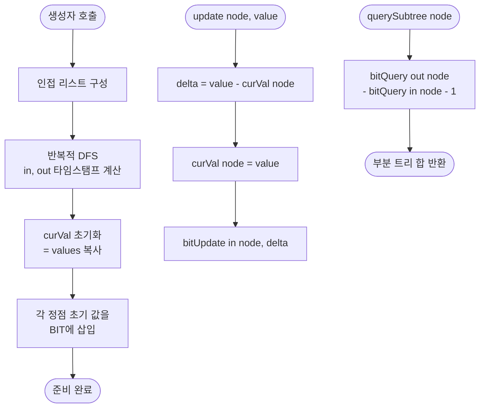

import { AlgorithmSimulation } from "#guide-sim";

# subtreeSumQuery 해설

## 성능 목표 예측

### 제약 표

| 항목 | 값 |
|------|-----|
| 정점 수 $n$ | $1 \leq n \leq 10^5$ |
| 연산 수 | 최대 $10^5$회 (update + querySubtree 합산) |
| 공간 | $O(n)$ |

### Naive 접근의 한계

부분 트리 합 질의를 가장 단순하게 구현하면 `querySubtree(u)` 호출 시 $u$를 루트로 하는 부분 트리를 DFS로 탐색하며 값을 직접 합산한다.

- `querySubtree`: $O(\text{subtree size}) \leq O(n)$
- `update`: $O(1)$ (배열 직접 갱신)
- 질의 $q$회: 총 $O(nq) = O(10^{10})$ → 시간 초과

### 목표 복잡도와 근거

| 연산 | 목표 복잡도 | 근거 |
|------|-------------|------|
| 전처리 (생성자) | $O(n \log n)$ | Euler Tour DFS + BIT 초기화 |
| `update` | $O(\log n)$ | BIT 점 갱신 |
| `querySubtree` | $O(\log n)$ | BIT 구간 합 |
| 공간 | $O(n)$ | BIT 배열 + Euler Tour 배열 |

BIT(Fenwick Tree)는 $O(n)$ 공간에 구간 합 질의와 점 갱신을 각각 $O(\log n)$에 처리한다. $n = 10^5$에서 $\log n \approx 17$이므로 연산당 17회 내외로 충분히 빠르다.

---

## 목표 함수

```ts
class SubtreeSumQuery {
  constructor(
    n: number,
    edges: [number, number][],
    root: number,
    values: number[]
  ): void

  update(node: number, value: number): void
  querySubtree(node: number): number
}
```

### 파라미터 표

| 파라미터 | 의미 | 제약 |
|----------|------|------|
| `n` | 정점의 수 | $1 \leq n \leq 10^5$ |
| `edges` | 무방향 간선 목록 $[u, v]$ | 길이 $n - 1$ |
| `root` | 트리의 루트 | $0 \leq \text{root} < n$ |
| `values` | 각 정점의 초기 값 | 길이 $n$ |
| `node` (update) | 갱신할 정점 | $0 \leq \text{node} < n$ |
| `value` (update) | 새로운 값 (교체, 누적 아님) | 정수 |
| `node` (querySubtree) | 부분 트리의 루트 | $0 \leq \text{node} < n$ |

### 반환값

- `update`: 반환 없음. 내부 BIT를 갱신한다.
- `querySubtree(u)`: 정점 $u$를 루트로 하는 부분 트리 내 모든 정점 값의 합.

### 엣지케이스

| 케이스 | 조건 | 기대 동작 |
|--------|------|-----------|
| 리프 노드 질의 | `u`의 자식 없음 | `values[u]`만 반환 |
| 루트 노드 질의 | `querySubtree(root)` | 모든 정점 값의 합 |
| 연속 update | `update(u, v1)`, `update(u, v2)` | 최신 `v2`만 반영 |
| 단일 정점 | $n=1$, `querySubtree(0)` | `values[0]` 반환 |

---

## 핵심 아이디어

**핵심 아이디어**: "DFS 진입/탈출 시각을 부여하면 부분 트리가 배열의 연속 구간이 되어, BIT로 O(log n) 쿼리가 가능해진다."

부분 트리 합을 매번 DFS로 탐색하면 O(n)이 걸려 많은 쿼리에서 시간 초과가 난다. Euler Tour는 DFS 중 각 정점에 진입 시각 in[v]와 탈출 시각 out[v]를 기록한다. v의 모든 자손은 in[v]와 out[v] 사이에 진입하므로, 부분 트리 합은 1차원 배열의 구간 합으로 변환된다. BIT(Fenwick Tree)로 이 구간 합을 O(log n)에 처리한다.

**풀이 구조**
1. DFS를 수행하며 각 정점에 진입 시각 in[v]와 탈출 시각 out[v]를 기록한다.
2. 진입 시각 순서로 평탄화 배열을 만들고 BIT를 초기화한다.
3. update(node, value): 이전 값과의 차분 delta를 구해 BIT의 in[node] 위치를 갱신한다.
4. querySubtree(node): BIT로 구간 [in[node], out[node]]의 합을 반환한다.

**조건**: 트리 위에서 부분 트리 합 쿼리와 점 갱신이 반복적으로 일어나야 할 때. 갱신이 특정 정점의 값을 교체하는 방식일 때.

**대표 예시**: 루트 노드 0에 대해 `querySubtree(0)` 쿼리
in[0] = 1, out[0] = n이므로 BIT 구간 [1, n]의 합이 반환된다. 이는 전체 정점 값의 합이다. 이후 `update(3, 10)`을 호출하면 BIT의 in[3] 위치만 delta만큼 갱신되고, 이후 정점 3을 포함하는 모든 부분 트리 쿼리에 반영된다.

**언제 쓰나**
고정된 트리 구조에서 정점 값이 자주 바뀌고, 그때마다 특정 정점의 서브트리 전체 합을 빠르게 구해야 하는 상황에서 사용한다.

---

### 원형 아이디어와 naive 접근

부분 트리 합을 직접 구하려면 DFS로 $u$의 모든 자손을 방문하며 값을 합산한다.

```
// naive querySubtree
function querySubtree_naive(u):
    total = values[u]
    for each child c of u:
        total += querySubtree_naive(c)
    return total
```

이 방법에서 시간이 폭발하는 이유:
- 최악의 경우(루트 질의) 모든 정점을 방문하여 $O(n)$.
- 질의 $q$회 시 $O(nq) = O(10^{10})$.
- `update`는 $O(1)$이지만 질의 비용이 너무 높다.

낭비의 본질: 같은 부분 트리 내 정점들을 질의마다 새로 탐색한다. 이 중복 탐색을 없애려면 부분 트리 정보를 **미리 구조화**해야 한다.

### 어떤 관찰이 돌파구가 되는가

- **관찰 1**: DFS 탐색 시 정점 $v$에 **진입 시각 $\text{in}[v]$** 와 **탈출 시각 $\text{out}[v]$** 를 부여하면, $v$의 부분 트리에 속하는 모든 정점의 진입 시각이 $[\text{in}[v], \text{out}[v]]$ 구간에 정확히 모인다.
- **관찰 2**: 위 관찰에 따라 부분 트리 합 질의는 **1차원 배열의 구간 합 질의**로 변환된다.
- **관찰 3**: BIT(Fenwick Tree)는 1차원 배열에서 점 갱신과 구간 합을 각각 $O(\log n)$에 처리하므로 이 구조에 딱 맞는다.

### 관찰을 형식화: 상태/구조 정의

**Euler Tour (DFS In/Out 타임스탬프)**:

DFS를 수행하며 전역 타이머를 관리한다. 정점 $v$에 처음 방문할 때 `timer++` 후 $\text{in}[v] = \text{timer}$를 기록하고, $v$의 모든 자손 방문을 마친 뒤 $\text{out}[v] = \text{timer}$를 기록한다.

**핵심 동치 관계**:

$$x \in \text{subtree}(v) \iff \text{in}[v] \leq \text{in}[x] \leq \text{out}[v]$$

이 동치 관계가 성립하는 이유: DFS는 $v$에 진입 후 $v$의 모든 자손을 남김없이 방문하고 탈출한다. 따라서 자손의 진입 시각은 반드시 $[\text{in}[v], \text{out}[v]]$ 내에 있다. 반대로 이 구간 밖의 정점은 $v$를 탈출한 뒤에 방문되었으므로 자손이 아니다.

**1차원 평탄화 배열**:

$$\text{flatVal}[\text{in}[v]] = \text{values}[v] \quad (\text{모든 } v)$$

이 정의가 이 형태여야 하는 이유: 다른 배열 순서(예: 임의 DFS 순서, 깊이 우선이 아닌 너비 우선)를 사용하면 부분 트리 정점들이 배열에서 연속된 구간을 점유하지 않아 구간 합으로 변환할 수 없다.

| 상태 변수 | 의미 |
|-----------|------|
| `in[v]` | $v$의 DFS 진입 시각 (1-indexed) |
| `out[v]` | $v$의 DFS 탈출 시각 |
| `curVal[v]` | 정점 $v$의 현재 값 (delta 계산용) |
| `bit[1..n]` | BIT 배열 |

### 점화식 또는 핵심 연산

**BIT 점 갱신 (`bitUpdate(i, delta)`)**:

$$\text{bit}[i] \mathrel{+}= \delta, \quad i \mathrel{+}= i \mathbin{\&} (-i) \quad (\text{while } i \leq n)$$

- $i \mathbin{\&} (-i)$: $i$의 최하위 set bit. BIT 내 $i$를 책임지는 구간 범위를 결정한다.
- $i$를 이 값만큼 증가시키면 $i$의 값 변화에 영향을 받는 상위 구간들을 순서대로 갱신한다.

**BIT 구간 합 (`bitQuery(i)`)** — 접두사 합 $\sum_{j=1}^{i}$:

$$s \mathrel{+}= \text{bit}[i], \quad i \mathrel{-}= i \mathbin{\&} (-i) \quad (\text{while } i > 0)$$

- $i \mathbin{\&} (-i)$만큼 감소시키면 $i$가 담당하는 구간을 순서대로 합산한다.

**update(node, value)**:

$$\delta = \text{value} - \text{curVal}[\text{node}]$$
$$\text{curVal}[\text{node}] \leftarrow \text{value}$$
$$\text{bitUpdate}(\text{in}[\text{node}], \delta)$$

- `curVal`로 이전 값을 추적하여 차분 $\delta$만 BIT에 반영한다. 이렇게 하면 BIT 내 절댓값이 아니라 변화량을 누적하는 방식으로 일관성을 유지한다.

**querySubtree(node)**:

$$\text{bitQuery}(\text{out}[\text{node}]) - \text{bitQuery}(\text{in}[\text{node}] - 1)$$

- $[\text{in}[v], \text{out}[v]]$ 구간의 합 = $[1, \text{out}[v]]$ 합 - $[1, \text{in}[v]-1]$ 합.

### 정당성 — 왜 이것이 옳은가

`querySubtree(v)`가 정확히 $\sum_{x \in \text{subtree}(v)} \text{values}[x]$를 반환함을 귀납적으로 보인다.

기저: 리프 노드 $v$의 경우, $\text{in}[v] = \text{out}[v]$이므로 구간 $[\text{in}[v], \text{out}[v]]$에는 $v$ 자신만 있다. `bitQuery(out[v]) - bitQuery(in[v]-1) = flatVal[in[v]] = values[v]`.

귀납: 내부 노드 $v$의 DFS 순서상 $[\text{in}[v], \text{out}[v]]$에는 $v$와 모든 자손이 포함된다 (Euler Tour 동치 관계). BIT는 이 구간의 합을 정확히 계산한다.

`update` 후의 정확성: $\delta = \text{new\_value} - \text{old\_value}$를 `in[node]` 위치에 더하면, `node`를 포함하는 모든 구간 질의 결과가 $\delta$만큼 변한다. `node`의 자손들의 `in` 값은 영향을 받지 않으므로 다른 부분 트리 질의는 그대로 유지된다.

`querySubtree(root)`의 경우: $\text{in}[\text{root}] = 1$, $\text{out}[\text{root}] = n$이므로 전체 구간 합 = 모든 정점 값의 합이 반환된다.

### 구현 디테일과 최적화

**반복적 DFS로 Euler Tour 구현**: 재귀 깊이가 $O(n)$에 달할 수 있으므로 반복적 DFS를 사용한다. 탈출 시각 기록을 위해 스택에 "탈출 마커"를 함께 넣는 방법이 일반적이다 (예: 음수 인덱스로 표시).

**BIT 1-indexed**: BIT는 1-indexed로 구현한다. `in[v]`를 1부터 시작하게 타이머를 설정해야 한다.

**update 시 delta 계산 필수**: `update(node, value)`에서 `curVal[node]`를 관리하지 않으면 BIT에 절댓값을 직접 쓰게 되어 중복 합산 오류가 발생한다. 예를 들어 `values[v] = 3`인 상태에서 `update(v, 5)`를 호출할 때 BIT에 5를 더하면 실제 값이 8이 되는 오류가 생긴다.

**함정 - in/out 범위 혼동**: `querySubtree`는 `bitQuery(out[node]) - bitQuery(in[node] - 1)`이다. `in[node]`로 빼면 `node` 자신이 제외되므로 반드시 `in[node] - 1`을 사용해야 한다.

---

## 시뮬레이션

트리 `n = 5`, `edges = [[0,1], [0,2], [1,3], [1,4]]`, `root = 0`, `values = [10,20,30,40,50]`에 대해 Euler Tour로 평탄화한 뒤 연산을 처리하는 과정이다. 트리 패널의 색은 현재 질의/갱신 대상 부분 트리(active=대상 루트, frontier=구간에 포함된 자손), keyValue 패널은 in/out 타임스탬프와 BIT 구간 합 결과 스냅샷이다.

연산 순서는 `querySubtree(1)` → `update(3, 100)` → `querySubtree(0)` 이며, 최종 `querySubtree(0)` 반환값은 `210` 으로 시뮬레이션 마지막 프레임과 일치한다.

> 대화형 시뮬레이션은 MDX 런타임에서 표시됩니다.

export const mkTree = (s) => ({
  id: 0, label: "0", status: s[0],
  children: [
    { id: 1, label: "1", status: s[1], children: [
      { id: 3, label: "3", status: s[3] },
      { id: 4, label: "4", status: s[4] },
    ]},
    { id: 2, label: "2", status: s[2] },
  ],
});

export const none = { 0: "default", 1: "default", 2: "default", 3: "default", 4: "default" };

export const steps = [
  {
    title: "생성자: Euler Tour",
    detail: "DFS 진입/탈출 시각 기록. in=[1,2,5,3,4], out=[5,4,5,3,4]. flatVal(진입순)=[10,20,40,50,30].",
    root: mkTree({ ...none, 0: "visited" }),
    entries: [
      { label: "in", value: "[1, 2, 5, 3, 4]" },
      { label: "out", value: "[5, 4, 5, 3, 4]" },
    ],
  },
  {
    title: "생성자: BIT 초기화",
    detail: "각 정점 값을 flatVal[in[v]]에 삽입. BIT가 접두사 합을 O(log n)에 복원할 준비 완료.",
    root: mkTree({ ...none, 0: "visited" }),
    entries: [
      { label: "flatVal (위치 1..5)", value: "[10, 20, 40, 50, 30]" },
      { label: "curVal", value: "[10, 20, 30, 40, 50]" },
    ],
  },
  {
    title: "querySubtree(1)",
    detail: "구간 [in[1]=2, out[1]=4] 합 = flatVal[2..4] = 20+40+50.",
    root: mkTree({ ...none, 1: "active", 3: "frontier", 4: "frontier" }),
    entries: [
      { label: "구간 [in,out]", value: "[2, 4]" },
      { label: "bitQuery(4) - bitQuery(1)", value: "120 - 10 = 110" },
    ],
  },
  {
    title: "querySubtree(1) = 110",
    detail: "정점 1의 부분 트리 합 = 20(1) + 40(3) + 50(4) = 110.",
    root: mkTree({ ...none, 1: "active", 3: "frontier", 4: "frontier" }),
    entries: [
      { label: "결과", value: "110" },
      { label: "results", value: "[110]" },
    ],
  },
  {
    title: "update(3, 100)",
    detail: "delta = 100 - curVal[3]=40 = 60. curVal[3]=100. bitUpdate(in[3]=3, 60).",
    root: mkTree({ ...none, 3: "active" }),
    entries: [
      { label: "delta", value: "100 - 40 = 60" },
      { label: "curVal", value: "[10, 20, 30, 100, 50]" },
    ],
  },
  {
    title: "querySubtree(0)",
    detail: "구간 [in[0]=1, out[0]=5] 합 = 전체. flatVal=[10,20,100,50,30] 합산.",
    root: mkTree({ 0: "active", 1: "frontier", 2: "frontier", 3: "frontier", 4: "frontier" }),
    entries: [
      { label: "구간 [in,out]", value: "[1, 5]" },
      { label: "bitQuery(5) - bitQuery(0)", value: "210 - 0 = 210" },
    ],
  },
  {
    title: "완료: querySubtree(0) = 210",
    detail: "루트 부분 트리 합 = 10+20+30+100+50 = 210 (정점 3이 40→100으로 반영됨).",
    root: mkTree({ 0: "active", 1: "frontier", 2: "frontier", 3: "frontier", 4: "frontier" }),
    entries: [
      { label: "결과", value: "210" },
      { label: "results", value: "[110, 210]" },
    ],
  },
];

<AlgorithmSimulation view={["tree", "keyValue"]} steps={steps} title="Euler Tour + BIT 부분 트리 합" />

## 수도 코드와 Activity Diagram

### 의사코드

```
class SubtreeSumQuery:
    in[0..n-1], out[0..n-1]   // Euler Tour 타임스탬프
    curVal[0..n-1]              // 각 정점의 현재 값 (delta 추적용)
    bit[1..n]                   // Fenwick Tree (1-indexed)

    constructor(n, edges, root, values):
        // 인접 리스트 구성
        adj[0..n-1] = []
        for each [u, v] in edges:
            adj[u].push(v), adj[v].push(u)

        // 반복적 DFS: Euler Tour 계산
        timer = 0
        stack = [(root, -1, false)]   // (정점, 부모, 탈출여부)
        while stack not empty:
            (v, par, leaving) = stack.pop()
            if leaving:
                out[v] = timer          // 불변식: in[v] <= out[v]
            else:
                in[v] = ++timer         // 불변식: in[root] = 1
                stack.push((v, par, true))          // 탈출 마커
                for u in adj[v] (역순, 부모 제외):
                    stack.push((u, v, false))

        // 초기 값으로 BIT 구성
        curVal[0..n-1] = values
        bit[1..n] = 0
        for v in 0..n-1:
            bitUpdate(in[v], values[v])

    bitUpdate(i, delta):           // BIT 점 갱신
        while i <= n:
            bit[i] += delta
            i += i & (-i)          // 불변식: i & (-i) = i의 최하위 set bit

    bitQuery(i):                   // BIT 접두사 합 [1..i]
        s = 0
        while i > 0:
            s += bit[i]
            i -= i & (-i)
        return s

    update(node, value):
        delta = value - curVal[node]   // 불변식: delta = 실제 변화량
        curVal[node] = value
        bitUpdate(in[node], delta)     // 불변식: in[node] 위치만 갱신

    querySubtree(node):
        // 불변식: [in[node], out[node]] = node 부분 트리의 flatVal 구간
        return bitQuery(out[node]) - bitQuery(in[node] - 1)
```

**핵심 불변식**: $x \in \text{subtree}(v) \iff \text{in}[v] \leq \text{in}[x] \leq \text{out}[v]$. 이 동치 관계로 인해 구간 합 $[\text{in}[v], \text{out}[v]]$이 정확히 부분 트리 합이 된다.

### Activity Diagram



**핵심 불변식**: `bit[i]`는 구간 $[i - \text{lowbit}(i) + 1, i]$에 속하는 `flatVal` 값들의 합을 저장하며, 이를 통해 접두사 합을 $O(\log n)$에 복원할 수 있다.
