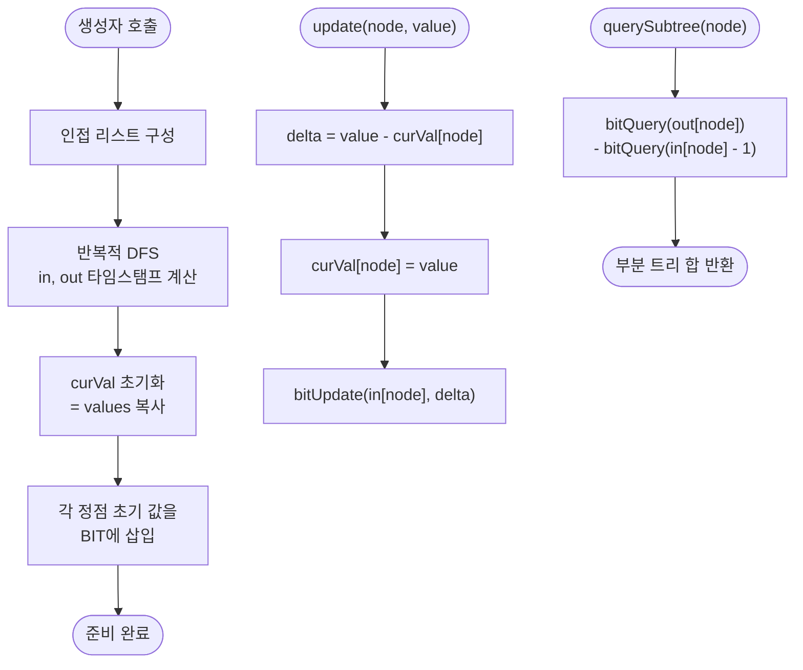

import { AlgorithmSimulation } from "#guide-sim";

# subtreeSumQuery — DFS 시각표로 트리를 한 줄로 펴서 세는 이유

## 한눈에 보는 컨셉

트리의 정점 값이 계속 바뀌는 상황에서, 특정 정점을 루트로 하는 부분 트리 전체의 합을 빠르게 구하는 자료구조예요. 핵심 관찰은 DFS로 트리를 훑을 때 정점마다 매기는 **진입 시각**과 **탈출 시각**이 그 정점의 부분 트리를 배열의 **연속 구간**으로 접어 준다는 것입니다. 구간이 배열 위에 고정되고 나면, 점 갱신과 구간 합을 각각 `O(log n)`에 처리하는 Fenwick Tree(BIT) 하나로 `update`와 `querySubtree`를 모두 빠르게 만들 수 있어요.

## 출발점: 가장 순진한 방법부터

문제를 먼저 정확히 잡을게요.

```ts
class SubtreeSumQuery {
  constructor(
    n: number,
    edges: [number, number][],
    root: number,
    values: number[]
  );
  update(node: number, value: number): void;
  querySubtree(node: number): number;
}
```

- `n`은 정점 수, 최대 $10^5$. `edges`는 길이 $n-1$인 무방향 간선 목록이고, 주어진 그래프는 항상 연결된 트리입니다.
- `root`는 트리의 뿌리, `values[i]`는 정점 `i`의 초기 값(음수 가능)입니다.
- `update(node, value)`는 정점 `node`의 값을 `value`로 **교체**합니다(누적이 아니에요). 반환값 없음.
- `querySubtree(node)`는 `node` 자신과 `node`의 모든 자손 값의 합을 반환합니다.
- `update`와 `querySubtree`를 합쳐 최대 $10^5$번 호출됩니다.

"부분 트리 합"이라는 말 자체가 이미 풀이 방향을 하나 알려줘요 — 정점 `node`의 값에 각 자식의 부분 트리 합을 재귀적으로 더하면 됩니다. 이게 가장 정직한 출발점입니다.

```ts
function querySubtreeNaive(
  node: number,
  children: number[][],
  values: number[]
): number {
  let total = values[node]!;
  for (const child of children[node]!) {
    total += querySubtreeNaive(child, children, values); // 자식의 부분 트리 합을 재귀적으로 더한다
  }
  return total;
}
```

`update`는 배열 한 칸을 바꾸는 일이라 `O(1)`이지만, `querySubtree`는 대상 부분 트리를 매번 DFS로 통째로 훑습니다.

```text
n = 100,000, 질의(update + querySubtree) 최대 100,000회

querySubtree(u): u의 부분 트리 크기만큼 방문   → 최악 O(n)  (u가 루트일 때 전체 순회)
update(u, v):    배열 한 칸 교체                → O(1)

질의가 querySubtree에 몰리면: O(n) × q = 100,000 × 100,000 = 10,000,000,000  ← 시간 초과
```

매 `querySubtree` 호출마다 대상 부분 트리를 처음부터 다시 훑는 게 범인이에요. 트리 모양은 그대로인데 같은 부분 트리를 두 번, 세 번 물어봐도 매번 새로 셉니다 — **이 중복 탐색을 버릴 방법이 없을까요?**

## 아이디어 자세히 들여다보기

### 트리를 한 줄로 펴기 — 수식과 그림

트리 모양은 안 바뀌니, 딱 한 번만 DFS로 훑어서 "부분 트리가 배열의 어느 구간에 해당하는지"를 미리 알아 두면 어떨까요? DFS가 정점 `v`에 **처음 들어갈 때** 전역 타이머를 하나 올려 `in[v]`에 적고, `v`의 자손을 **모두 방문하고 빠져나올 때** `out[v]`에 그 시점의 타이머 값을 적습니다.

```text
트리 (자식 순서: 왼쪽부터):
        0
       / \
      1   2
     / \
    3   4

DFS 방문 순서: 0 진입 → 1 진입 → 3 진입 → 3 탈출 → 4 진입 → 4 탈출 → 1 탈출 → 2 진입 → 2 탈출 → 0 탈출

정점    0   1   2   3   4
in      1   2   5   3   4
out     5   4   5   3   4
```

이 두 숫자가 만드는 동치 관계가 이 알고리즘 전체의 기둥입니다.

$$x \in \text{subtree}(v) \iff \text{in}[v] \leq \text{in}[x] \leq \text{out}[v]$$

왜 성립할까요? DFS는 `v`에 진입한 뒤 `v`의 자손을 **남김없이** 방문하고서야 `v`를 탈출합니다. 그러니 자손의 진입 시각은 반드시 `[in[v], out[v]]` 안에 있어요. 반대로 이 구간 밖의 정점은 `v`에 진입하기 전에 이미 방문을 마쳤거나, `v`를 탈출한 뒤에야 방문된 것이니 자손일 수 없습니다.

잠깐, 확인 하나만 해 볼까요? 위 그림에서 `in[2]`와 `out[2]`는 각각 몇일까요? 정점 2는 자식이 없는 리프이니, 진입한 순간 곧바로 탈출합니다 — 그래서 `in[2] = out[2] = 5`예요.

이제 각 정점의 값을 **진입 시각 순서로** 1차원 배열에 옮겨 담습니다.

$$\text{flatVal}[\text{in}[v]] = \text{values}[v] \quad (\text{모든 } v)$$

`values = [10, 20, 30, 40, 50]`이라면 이렇게 펼쳐져요.

```text
위치       1    2    3    4    5
정점       0    1    3    4    2
flatVal   10   20   40   50   30
```

정점 1의 부분 트리 `{1, 3, 4}`는 위치 `[2, 4]`에 **연속으로** 모여 있죠? 이게 바로 부분 트리 합이 구간 합으로 바뀌는 지점이에요.

이 정의가 왜 하필 "DFS **진입** 순서"여야 하는지도 짚어 볼게요. 만약 너비 우선(BFS) 순서로 위치를 매겼다면 `0→1→2→3→4` 순서로 위치 `1,2,3,4,5`가 배정되고, 정점 1의 부분 트리 `{1,3,4}`는 위치 `{2,4,5}`에 흩어집니다 — 위치 3(정점 2)이 중간에 끼어들어 더는 연속 구간이 아니에요. DFS는 한 정점의 자손을 형제로 넘어가기 전에 **모두 소진**하기 때문에만 연속성이 보장됩니다.

### 셈을 맡는 자료구조 — Fenwick Tree(BIT)

문제가 이제 "1차원 배열에서 특정 위치를 바꾸고(점 갱신), 어떤 구간의 합을 구하는(구간 합) 일을 반복 처리하기"로 바뀌었습니다. 이 조합이 보이면 이 프로젝트에서는 Fenwick Tree(BIT)를 씁니다 — 점 갱신과 접두사 합을 각각 `O(log n)`에 처리하는 자료구조예요. 내부 동작(비트 트릭으로 구간을 나눠 맡기는 방식)은 이미 자세히 다뤄져 있으니 직접 설명하지 않고 링크로 대신할게요: [Fenwick Tree 가이드](../../../data-structures/range-query/fenwickTree/fenwickTree-guide.mdx). 여기서는 "점 갱신 `O(log n)`, 접두사 합 조회 `O(log n)`을 제공하는 도구"로만 쓰고, 이 문제 고유의 사용법(부분 트리 구간을 접두사 합의 차로 구하기, 값 교체를 델타로 바꾸기)에 집중합니다.

### 왜 모순 없이 작동하는가

`querySubtree(v)`가 항상 정확히 $\sum_{x \in \text{subtree}(v)} \text{values}[x]$를 반환한다는 것을 부분 트리 크기에 대한 귀납으로 보입니다.

**기저**: `v`가 리프면 `in[v] = out[v]`이므로 구간 `[in[v], out[v]]`에는 `v` 자신만 있습니다. `querySubtree(2)`를 예로 들면 `in[2] = out[2] = 5`이고 구간 합은 `flatVal[5] = 30`, 즉 `values[2] = 30`과 정확히 일치해요.

**귀납**: `v`가 자식 $c_1, \dots, c_k$를 가진 내부 정점이라면, 앞 절의 동치 관계에 따라 `[in[v], out[v]]`는 `v` 자신의 위치(`in[v]`) 하나와 각 자식의 구간 `[in[c_i], out[c_i]]`들의 합집합이고, 이 조각들은 서로 겹치지 않으면서 빈틈없이 `[in[v], out[v]]`를 채웁니다(DFS가 한 자식의 방문을 완전히 마친 뒤에야 다음 자식으로 넘어가기 때문). 따라서 구간 합은 `values[v] + (각 자식 부분 트리 합의 합)`이 되고, 귀납 가정에 의해 각 자식 항은 이미 정확하므로 전체도 정확합니다.

`update` 이후에도 정확성이 유지되는 이유는, `delta = 새 값 - 이전 값`을 `in[node]` 위치 **한 곳**에만 더하기 때문이에요. `node`의 자손들은 `node`와 다른 `in` 값을 가지므로 영향을 받지 않고, `node`를 조상으로 둔 모든 정점 `w`(즉 `in[node]`가 `[in[w], out[w]]` 안에 드는 정점들)의 부분 트리 합에만 정확히 `delta`만큼 반영됩니다.

여기서 **헷갈리기 쉬운 포인트**가 둘 있습니다.

- **절댓값이 아니라 델타를 더해야 합니다.** `curVal[node]`로 이전 값을 추적하지 않고 새 값을 그대로 BIT에 더하면, 이전에 쌓여 있던 값 위에 새 값이 겹쳐 쌓입니다. 예를 들어 정점 3의 값이 40인 상태에서 `update(3, 100)`을 호출했을 때, 델타(60)가 아니라 100을 그대로 더하면 `querySubtree(1)`은 정답 `170`(=20+100+50) 대신 `210`이 나오고, `querySubtree(0)`은 정답 `210` 대신 `250`이 나옵니다 — 실제로 이 값들로 검증했습니다.
- **`in[node] - 1`에서 `-1`을 빼먹으면 안 됩니다.** `querySubtree(node) = bitQuery(out[node]) - bitQuery(in[node] - 1)`인데, `in[node] - 1` 대신 `in[node]`로 빼면 `node` 자신의 값이 결과에서 통째로 빠집니다. 위와 같은 예시 트리에서 `update(3, 100)` 이후 `querySubtree(1)`을 `-1` 없이 계산하면 정답 `170` 대신 `150`(정점 1 자신의 값 20이 빠진 값)이 나옵니다.

엣지 케이스도 확인해 둘게요.

```text
n = 1, edges = []           → in[0]=out[0]=1, querySubtree(0) = values[0]
리프 정점 질의               → in[v]=out[v] 이므로 flatVal[in[v]] 한 칸만 반환
루트 정점 질의                → in[root]=1, out[root]=n 이므로 전체 합
연속 update(u, v1), (u, v2)  → curVal[u]가 항상 최신값을 들고 있어 v2만 반영됨
음수 값                       → delta 계산·BIT 합산 모두 부호 그대로 처리되어 문제없음
```

## 아이디어를 코드로 옮기기

Euler Tour로 부분 트리를 구간으로 바꾸는 아이디어를 가장 직접적인 방식으로 옮겨 봅니다. 아직 BIT는 쓰지 않고, 평탄화한 배열을 **그때그때 선형으로 스캔**해서 합을 구해요.

```ts
class SubtreeSumQueryFlatScan {
  private in_: number[];
  private out_: number[];
  private flatVal: number[]; // 1-indexed, flatVal[0]은 미사용

  constructor(n: number, edges: [number, number][], root: number, values: number[]) {
    this.in_ = new Array(n).fill(0);
    this.out_ = new Array(n).fill(0);
    this.flatVal = new Array(n + 1).fill(0);

    const adj: number[][] = Array.from({ length: n }, () => []);
    for (const [u, v] of edges) {
      adj[u]!.push(v);
      adj[v]!.push(u);
    }

    let timer = 0;
    // 재귀 대신 반복적 DFS — n이 10^5까지 갈 수 있어 재귀는 스택 오버플로 위험이 있다
    const stack: [number, number, number][] = [[root, -1, 0]]; // [정점, 부모, 탈출마커]
    while (stack.length > 0) {
      const [v, par, leaving] = stack.pop()!;
      if (leaving) {
        this.out_[v] = timer; // 자손을 모두 방문한 뒤에야 탈출 시각을 적는다
      } else {
        timer++;
        this.in_[v] = timer;
        stack.push([v, par, 1]); // 탈출 마커를 먼저 넣어 두고
        const neighbors = adj[v]!;
        for (let k = neighbors.length - 1; k >= 0; k--) {
          const u = neighbors[k]!;
          if (u !== par) stack.push([u, v, 0]); // 자식들을 역순으로 넣어 원래 순서로 방문
        }
      }
    }

    for (let v = 0; v < n; v++) {
      this.flatVal[this.in_[v]!] = values[v]!;
    }
  }

  update(node: number, value: number): void {
    this.flatVal[this.in_[node]!] = value; // O(1) — 값을 그 자리에서 바로 교체
  }

  querySubtree(node: number): number {
    let total = 0;
    for (let i = this.in_[node]!; i <= this.out_[node]!; i++) {
      total += this.flatVal[i]!; // O(구간 길이) — 여전히 최악 O(n)
    }
    return total;
  }
}
```

가장 중요한 부분은 `if (leaving)` 분기입니다. 탈출 마커를 정점과 함께 스택에 미리 넣어 두고, 그 마커가 다시 튀어나올 때(=해당 정점의 자손을 모두 처리한 뒤)만 `out[v]`를 적습니다. 이 순서를 지키지 않으면 자손을 채 방문하기도 전에 `out[v]`가 확정돼 버려 구간이 실제 부분 트리보다 작게 잡힙니다. 그 외에 놓치기 쉬운 지점은 `timer`를 `1`부터 시작하도록 진입 시점에 미리 증가시키는 것(`in[root] = 1`이 되어야 BIT를 1-indexed로 쓸 수 있어요)과, 자식들을 **역순으로** 스택에 넣어야 실제 방문 순서가 원래 인접 리스트 순서와 같아진다는 점입니다.

## 더 빠르게 만들 단서 찾기

`update`는 `O(1)`로 빨라졌지만, `querySubtree`는 여전히 구간을 매번 처음부터 스캔합니다. 트리 모양은 안 변했는데 값만 바뀌었을 뿐인데도, 자료구조를 배열로 바꿨을 뿐 낭비의 본질은 그대로예요.

```text
flatVal:  [10, 20, 40, 50, 30]

querySubtree(0): 구간 [1, 5] 전체를 매번 선형으로 스캔  → O(n)
같은 querySubtree(0)을 q번 반복하면: O(n) × q  ← naive 때와 다를 게 없다
```

여기서 필요한 연산을 다시 정리해 보면 딱 두 가지뿐입니다 — **어떤 위치의 값을 바꾸기**, **어떤 접두사까지의 합을 구하기**. 이 조합을 `O(log n)`에 처리하는 자료구조가 있었죠? 바로 앞서 3번째 절에서 짚어 둔 Fenwick Tree(BIT)입니다.

## 단서를 최적화로 연결하기

평탄화한 배열 `flatVal`을 그대로 두는 대신, BIT 위에 값을 올립니다. 이때 주의할 점은 BIT는 "각 위치의 절댓값"이 아니라 "위치별 변화량(델타)의 누적"으로 관리해야 한다는 것이에요. 그래서 각 정점의 **현재 값**을 별도로 `curVal[]`에 기억해 두고, `update`가 호출될 때마다 `새 값 - curVal[node]`만큼만 BIT에 반영합니다.

```text
Before (선형 스캔):
  flatVal = [10, 20, 40, 50, 30]          저장: 절댓값 직접
  query([l, r]): l..r 순회하며 flatVal 합산   → O(구간 길이)

After (BIT):
  bit[1..5] 각 칸이 lowbit(i) 크기의 구간 합을 나눠서 책임진다
  query([l, r]): bitQuery(r) - bitQuery(l - 1)   → O(log n)
  update(node, value): delta = value - curVal[node]; bitUpdate(in[node], delta)  → O(log n)
```

불변식은 [Fenwick Tree 가이드](../../../data-structures/range-query/fenwickTree/fenwickTree-guide.mdx)와 같습니다 — `bit[i]`는 `flatVal[i - lowbit(i) + 1 .. i]` 구간의 합을 들고 있고, 이 덕분에 접두사 합을 `O(log n)`에 복원할 수 있어요.

## 최적화 코드

```ts
class SubtreeSumQuery {
  private n: number;
  private in_: number[];
  private out_: number[];
  private curVal: number[]; // 각 정점의 현재 값 — 델타 계산용
  private bit: number[];    // Fenwick Tree, 1-indexed

  constructor(n: number, edges: [number, number][], root: number, values: number[]) {
    this.n = n;
    this.in_ = new Array(n).fill(0);
    this.out_ = new Array(n).fill(0);
    this.curVal = values.slice();
    this.bit = new Array(n + 1).fill(0);

    const adj: number[][] = Array.from({ length: n }, () => []);
    for (const [u, v] of edges) {
      adj[u]!.push(v);
      adj[v]!.push(u);
    }

    let timer = 0;
    const stack: [number, number, number][] = [[root, -1, 0]];
    while (stack.length > 0) {
      const [v, par, leaving] = stack.pop()!;
      if (leaving) {
        this.out_[v] = timer;
      } else {
        timer++;
        this.in_[v] = timer;
        stack.push([v, par, 1]);
        const neighbors = adj[v]!;
        for (let k = neighbors.length - 1; k >= 0; k--) {
          const u = neighbors[k]!;
          if (u !== par) stack.push([u, v, 0]);
        }
      }
    }

    for (let v = 0; v < n; v++) {
      this.bitUpdate(this.in_[v]!, values[v]!); // 초기 값도 "0에서 values[v]로" 델타로 반영
    }
  }

  private bitUpdate(i: number, delta: number): void {
    for (; i <= this.n; i += i & -i) this.bit[i]! += delta;
  }

  private bitQuery(i: number): number {
    let s = 0;
    for (; i > 0; i -= i & -i) s += this.bit[i]!;
    return s;
  }

  update(node: number, value: number): void {
    const delta = value - this.curVal[node]!;
    this.curVal[node] = value;
    this.bitUpdate(this.in_[node]!, delta);
  }

  querySubtree(node: number): number {
    return this.bitQuery(this.out_[node]!) - this.bitQuery(this.in_[node]! - 1);
  }
}
```

기본 구현과 달라진 곳은 `querySubtree`의 선형 스캔이 `bitQuery` 두 번의 차로 바뀐 것, 그리고 `update`가 `flatVal`을 직접 덮어쓰는 대신 `curVal`로 이전 값을 추적해 델타를 계산한다는 것입니다. **가장 중요한 줄은 `const delta = value - this.curVal[node]!;` 입니다.** 이 줄과 그다음 `this.curVal[node] = value;`의 순서를 지키지 않고 `curVal`을 먼저 덮어써 버리면 델타가 항상 0이 되어 버려 BIT가 갱신되지 않는 조용한 버그가 생깁니다. 그리고 `querySubtree`의 `this.in_[node]! - 1`에서 `- 1`을 빠뜨리면 앞 절에서 실측한 대로 `node` 자신의 값이 결과에서 빠집니다.

> 기억법: "BIT에는 얼마가 있었는지가 아니라 얼마나 바뀌었는지를 알려줘야 한다."

이제 더 최적화할 여지가 있을까요? 지금 필요한 연산은 "1차원 배열의 점 갱신 + 접두사 합"뿐이고, Fenwick Tree는 이 조합을 이미 `O(log n)`에 처리합니다. 세그먼트 트리로 바꿔도 점근 복잡도는 같고 재귀·양쪽 자식 포인터 관리 비용만 늘어나요. 갱신이 아예 없다면 오일러 투어 + Sparse Table로 질의를 `O(1)`까지 낮출 수도 있지만, 이 문제는 `update`가 필수라 해당하지 않습니다. 그래서 여기서 최적화를 마칩니다 — 전처리 `O(n log n)`, `update`·`querySubtree` 각각 `O(log n)`, 공간 `O(n)`으로 애초에 세운 목표를 달성했습니다. Mo's Algorithm 같은 구간 트릭과 달리 여기서 값진 부분은 **"트리 문제를 배열 문제로 접어서, 이미 있는 표준 자료구조(BIT)를 그대로 재사용한다"**는 패턴 자체예요. 이 패턴은 부분 트리 최솟값, 부분 트리 XOR처럼 다른 집계 함수를 세그먼트 트리로 바꿔 끼우기만 하면 그대로 재사용할 수 있습니다.

## 실행 시각화

트리 `n = 5`, `edges = [[0,1], [0,2], [1,3], [1,4]]`, `root = 0`, `values = [10,20,30,40,50]`에 대해 `querySubtree(1)` → `update(3, 100)` → `querySubtree(0)` 순서로 연산을 처리하는 과정입니다. 위 코드로 실제 실행하면 `querySubtree(1) = 110`, `update(3, 100)` 이후 `querySubtree(0) = 210`이 나오며, 아래 시뮬레이션의 마지막 프레임과 일치합니다. 트리 패널의 색은 현재 질의·갱신 대상 부분 트리(active=대상 루트, frontier=구간에 포함된 자손)를 나타내고, keyValue 패널은 그 순간의 `in`/`out` 타임스탬프나 BIT 구간 합 계산 스냅샷입니다.

> 대화형 시뮬레이션은 MDX 런타임에서 표시됩니다.

export const mkTree = (s) => ({
  id: 0, label: "0", status: s[0],
  children: [
    { id: 1, label: "1", status: s[1], children: [
      { id: 3, label: "3", status: s[3] },
      { id: 4, label: "4", status: s[4] },
    ]},
    { id: 2, label: "2", status: s[2] },
  ],
});

export const none = { 0: "default", 1: "default", 2: "default", 3: "default", 4: "default" };

export const steps = [
  {
    title: "생성자: Euler Tour",
    detail: "DFS 진입/탈출 시각 기록. in=[1,2,5,3,4], out=[5,4,5,3,4]. flatVal(진입순)=[10,20,40,50,30].",
    root: mkTree({ ...none, 0: "visited" }),
    entries: [
      { label: "in", value: "[1, 2, 5, 3, 4]" },
      { label: "out", value: "[5, 4, 5, 3, 4]" },
    ],
  },
  {
    title: "생성자: BIT 초기화",
    detail: "각 정점 값을 flatVal[in[v]]에 삽입. BIT가 접두사 합을 O(log n)에 복원할 준비 완료.",
    root: mkTree({ ...none, 0: "visited" }),
    entries: [
      { label: "flatVal (위치 1..5)", value: "[10, 20, 40, 50, 30]" },
      { label: "curVal", value: "[10, 20, 30, 40, 50]" },
    ],
  },
  {
    title: "querySubtree(1)",
    detail: "구간 [in[1]=2, out[1]=4] 합 = flatVal[2..4] = 20+40+50.",
    root: mkTree({ ...none, 1: "active", 3: "frontier", 4: "frontier" }),
    entries: [
      { label: "구간 [in,out]", value: "[2, 4]" },
      { label: "bitQuery(4) - bitQuery(1)", value: "120 - 10 = 110" },
    ],
  },
  {
    title: "querySubtree(1) = 110",
    detail: "정점 1의 부분 트리 합 = 20(1) + 40(3) + 50(4) = 110.",
    root: mkTree({ ...none, 1: "active", 3: "frontier", 4: "frontier" }),
    entries: [
      { label: "결과", value: "110" },
      { label: "results", value: "[110]" },
    ],
  },
  {
    title: "update(3, 100)",
    detail: "delta = 100 - curVal[3]=40 = 60. curVal[3]=100. bitUpdate(in[3]=3, 60).",
    root: mkTree({ ...none, 3: "active" }),
    entries: [
      { label: "delta", value: "100 - 40 = 60" },
      { label: "curVal", value: "[10, 20, 30, 100, 50]" },
    ],
  },
  {
    title: "querySubtree(0)",
    detail: "구간 [in[0]=1, out[0]=5] 합 = 전체. flatVal=[10,20,100,50,30] 합산.",
    root: mkTree({ 0: "active", 1: "frontier", 2: "frontier", 3: "frontier", 4: "frontier" }),
    entries: [
      { label: "구간 [in,out]", value: "[1, 5]" },
      { label: "bitQuery(5) - bitQuery(0)", value: "210 - 0 = 210" },
    ],
  },
  {
    title: "완료: querySubtree(0) = 210",
    detail: "루트 부분 트리 합 = 10+20+30+100+50 = 210 (정점 3이 40→100으로 반영됨).",
    root: mkTree({ 0: "active", 1: "frontier", 2: "frontier", 3: "frontier", 4: "frontier" }),
    entries: [
      { label: "결과", value: "210" },
      { label: "results", value: "[110, 210]" },
    ],
  },
];

<AlgorithmSimulation view={["tree", "keyValue"]} steps={steps} title="Euler Tour + BIT 부분 트리 합" />

## 흐름 한눈에 보기


```mermaid
flowchart TD
    A([생성자 호출]) --> B[인접 리스트 구성]
    B --> C["반복적 DFS<br/>in, out 타임스탬프 계산"]
    C --> D["curVal 초기화<br/>= values 복사"]
    D --> E["각 정점 초기 값을<br/>BIT에 삽입"]
    E --> F([준비 완료])

    G(["update(node, value)"]) --> H["delta = value - curVal[node]"]
    H --> I["curVal[node] = value"]
    I --> J["bitUpdate(in[node], delta)"]

    K(["querySubtree(node)"]) --> L["bitQuery(out[node])<br/>- bitQuery(in[node] - 1)"]
    L --> M([부분 트리 합 반환])
```

## 스스로 점검하기

1. 트리 `n = 4`, `edges = [[0,1], [1,2], [1,3]]`, `root = 0`, `values = [5, 1, 2, 3]`일 때 `in`/`out` 배열과 `querySubtree(1)`을 손으로 구해 보세요. (`in = [1, 2, 3, 4]`, `out = [4, 4, 3, 4]`이고 `querySubtree(1) = values[1] + values[2] + values[3] = 1 + 2 + 3 = 6`입니다.)
2. 본문의 시뮬레이션 입력에서 `update(3, 100)`을 처리할 때, `curVal`을 먼저 갱신하지 않고 `delta = 100 - curVal[3]` 대신 `bitUpdate(in[3], 100)`을 그대로 호출하면 `querySubtree(1)`과 `querySubtree(0)`은 각각 얼마가 나올지 예측하고, 왜 그렇게 되는지 설명해 보세요. (정답: `querySubtree(1) = 210`, `querySubtree(0) = 250`이 나옵니다 — 원래 있던 값 40 위에 100이 그대로 더 쌓이기 때문입니다.)
3. 만약 `update`가 "값을 교체"가 아니라 "부분 트리 전체 정점에 `delta`를 더하기"로 바뀐다면(부분 트리 범위 갱신 + 정점 하나 값 조회), 지금의 `in`/`out` 타임스탬프 골격을 그대로 쓰면서 BIT를 어떻게 바꿔야 할까요? (힌트: 지금은 "정점 하나 갱신 + 구간 합 조회"였다면, 이번엔 반대로 "구간 갱신 + 정점 하나 조회"가 됩니다 — 차분 배열(diff array) 위에 BIT를 얹는 방식을 떠올려 보세요.)
