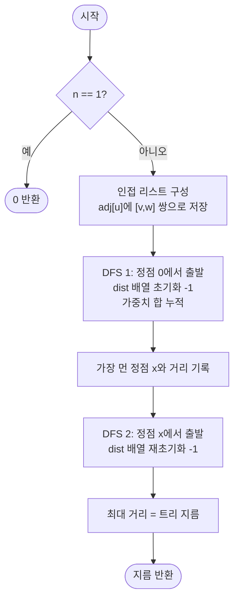

import { AlgorithmSimulation } from "#guide-sim";

# treeDiameter — 아무 정점에서나 출발해도 가장 먼 점이 지름의 끝이 되는 이유

## 한눈에 보는 컨셉

가중치 있는 트리에서 두 정점 사이 경로 길이의 최댓값(지름)을 구하는 문제예요. 모든 정점 쌍을 직접 비교하면 `O(n²)`이지만, 트리에서는 **"아무 정점에서나 가장 먼 정점은 반드시 지름의 한쪽 끝"**이라는 성질이 성립합니다. 이 성질 덕분에 DFS(또는 BFS)를 딱 두 번만 돌리면 `O(n)`에 지름을 구할 수 있어요.

## 출발점: 가장 순진한 방법부터

문제를 먼저 정확히 잡을게요.

```ts
function treeDiameter(n: number, edges: [number, number, number][]): number
```

- `n` — 정점 수, $1 \leq n \leq 10^5$
- `edges` — 가중치 있는 무방향 간선 목록. 각 원소 `[u, v, w]`는 정점 `u`와 `v`를 잇고 거리가 `w`인 간선 (0-based, $w \geq 0$)
- `edges`의 길이는 정확히 $n-1$이고, 주어진 그래프는 사이클이 없는 **연결된 트리**입니다 — 즉 어떤 두 정점 사이에도 경로가 정확히 하나뿐이에요.
- 반환 — 두 정점 사이 경로 길이(경로 위 간선 가중치 합)의 최댓값. 이것이 트리의 **지름**입니다.

두 정점 사이의 최댓값을 구하는 문제를 만나면 가장 정직한 접근은 **후보(정점 쌍)를 전부 나열해 비교**하는 것입니다. 트리에서 두 정점 사이 경로는 유일하니, 각 쌍마다 BFS/DFS로 경로 길이를 재고 최댓값을 갱신하면 됩니다.

```
// naive: 모든 쌍의 경로 길이를 직접 잰다
diameter = 0
for u in 0..n-1:
    dist = BFS_or_DFS(u)       // u에서 모든 정점까지의 거리, O(n)
    diameter = max(diameter, max(dist))
```

작은 예로 비용을 체감해 봅시다. 별 모양 트리 `n = 4`(중심 0에 리프 1, 2, 3이 가중치 3, 1, 2로 연결)라면 정점 쌍은 $\binom{4}{2} = 6$개뿐이라 문제없어 보여요. 하지만 이 문제의 진짜 제약은 $n \leq 10^5$입니다.

```text
n = 10^5 일 때:

BFS/DFS 1회             : O(n)     = 10^5
정점마다 반복            : O(n) 번
총 비용                  : O(n²)   ≈ 10^10   →  1초 안에 절대 불가능
```

$n$번 BFS를 돌리는 대신, "가장 먼 두 정점"만 정확히 찍어낼 수 있다면 어떨까요? 실제로 후보 전부를 볼 필요가 없다는 낌새가 있습니다 — **한 점에서 가장 먼 정점 하나만 알아도 지름의 절반은 이미 알아낸 셈**이라는 관찰입니다. 다음 절에서 이 관찰을 정식화해 봅니다.

## 아이디어 자세히 들여다보기

### 가장 먼 점이 지름의 끝점이라는 성질 — 수식과 그림

트리의 지름을 잇는 두 정점을 $a$, $b$라 하고 $\text{dist}(a,b) = D$(지름)라 합시다. 핵심 주장은 이렇습니다.

$$\forall s \in V,\quad x = \operatorname*{arg\,max}_{v \in V} \text{dist}(s, v) \;\Longrightarrow\; \exists\, y \in V,\ \text{dist}(x, y) = D$$

즉 **어떤 정점 $s$에서 시작하든, $s$에서 가장 먼 정점 $x$는 반드시 어떤 지름 경로의 한쪽 끝점**이라는 뜻이에요. 이 성질이 성립하면 절차는 단순해집니다.

```text
1단계: 아무 정점 0에서 BFS/DFS → 가장 먼 정점 x를 얻는다     (x는 지름의 끝점 하나)
2단계: x에서 BFS/DFS → 가장 먼 거리를 얻는다                 (그 거리가 곧 지름)
```

작은 예로 확인해 봅시다. 별 모양 트리 `n = 4`, 간선 `[0,1,3], [0,2,1], [0,3,2]`에서 시작점 `s = 0`으로 DFS를 돌리면 `dist = [0, 3, 1, 2]`, 가장 먼 정점은 `x = 1`(거리 3)입니다. `x = 1`에서 다시 DFS를 돌리면 `dist = [3, 0, 4, 5]`, 최대 거리는 `5`(정점 3까지) — 이것이 실제 지름입니다(경로 `1 → 0 → 3`, 비용 `3+2=5`).

> 확인 질문 하나만 해 볼까요? 만약 시작점 `s`가 **이미 지름 경로 위**에 있다면 가장 먼 정점 `x`는 누가 될까요? 위 예시가 정확히 이 경우예요 — 지름 경로가 `1-0-3`이고 `s = 0`은 이 경로 위의 한 점입니다. 이때 `x`는 경로 위에서 `s`로부터 더 먼 쪽 끝점(`1`)이 됩니다. `s`가 경로 밖에 있을 때도 성질이 성립하는지는 바로 다음 절에서 다른 예시로 확인해요.

**왜 하필 "가장 먼 점" 성질로 정의하는가**: 지름을 "모든 쌍의 최댓값"으로 그대로 두면 탐색 공간이 $\binom{n}{2}$개 쌍입니다. 반면 "한 점에서의 최원점"은 BFS/DFS 한 번, 즉 $O(n)$짜리 연산으로 계산되는 값이에요. 같은 값(지름)을 조합적 탐색 문제에서 **위치를 하나 찍는 문제**로 바꿔치기한 것이 이 정의의 핵심 이득입니다.

### 셈을 맡는 자료구조 — 스택

지름을 구하려면 결국 DFS로 트리를 순회해야 합니다. 재귀 없이 반복문으로 DFS를 구현하려면 "다음에 파고들 정점들"을 어떤 순서로 꺼낼지 정해야 하는데, DFS는 **가장 최근에 발견한 정점부터 마저 파고드는** 순회이므로 LIFO(후입선출) 순서가 필요해요. 이 역할을 스택이 맡습니다. 스택 자체의 동작 원리는 이 프로젝트의 [stack 가이드](../../../data-structures/linear/stack/stack-guide.mdx)를 참고하세요 — 여기서는 "push한 순서의 역순으로 꺼내는 통"으로만 쓰면 충분합니다.

### 왜 모순 없이 작동하는가

**기저**: $n = 1$이면 정점이 하나뿐이라 지름은 자명하게 $0$입니다. $n = 2$면 간선이 하나뿐이라 그 가중치가 곧 지름이고, 어느 정점에서 시작해도 나머지 한 정점이 가장 먼 정점이자 지름의 끝점입니다.

**일반 케이스(귀류법)**: 지름 경로의 끝점을 $a, b$($\text{dist}(a,b) = D$)라 하고, 임의의 정점 $s$에서 DFS로 얻은 가장 먼 정점을 $x$라 합시다. 트리에서 임의의 두 정점 사이 경로는 유일하므로, $s$에서 $x$까지의 경로와 $a$에서 $b$까지의 경로(지름 경로)는 정확히 한 점 $m$에서 만납니다(둘 다 트리라는 하나의 연결된 구조 위에 있으므로, $s \to x$ 경로가 지름 경로에 닿는 첫 지점이 유일하게 존재합니다. $s$가 지름 경로 위에 있다면 $m = s$입니다).

$m$이 $s{\to}a$, $s{\to}b$, $s{\to}x$ 경로 모두에 공통으로 놓인 점이므로 다음이 성립합니다.

$$\text{dist}(s,a) = \text{dist}(s,m) + \text{dist}(m,a), \qquad \text{dist}(s,b) = \text{dist}(s,m) + \text{dist}(m,b)$$
$$\text{dist}(s,x) = \text{dist}(s,m) + \text{dist}(m,x)$$

$x$가 $s$에서 가장 먼 정점이므로 $\text{dist}(s,x) \geq \text{dist}(s,a)$이고 $\text{dist}(s,x) \geq \text{dist}(s,b)$입니다. 양변에서 공통항 $\text{dist}(s,m)$을 빼면

$$\text{dist}(m,x) \geq \text{dist}(m,a), \qquad \text{dist}(m,x) \geq \text{dist}(m,b)$$

를 얻습니다. 이제 $x$에서 $b$까지의 거리를 봅시다.

$$\text{dist}(x,b) = \text{dist}(x,m) + \text{dist}(m,b) \geq \text{dist}(m,a) + \text{dist}(m,b) = \text{dist}(a,b) = D$$

그런데 $D$는 트리 전체에서 가장 큰 경로 길이(지름)이므로 $\text{dist}(x,b) \leq D$이기도 합니다. 두 부등식을 합치면 $\text{dist}(x,b) = D$ — 즉 **$x$는 $b$와 함께 또 다른 지름 경로를 이룹니다.** 이것으로 $x$가 지름의 끝점이라는 주장이 증명됩니다.

작은 예로 직접 확인해 봅시다. 체인 `0(w2)-1(w2)-2(w2)-3` 에 곁가지 리프 `4`가 `1`에 가중치 `1`로 붙은 트리(진짜 지름은 `0-3` 경로, 길이 `6`)에서 `s = 4`(지름 경로 밖의 점)로 DFS를 돌리면 `dist = [3, 1, 3, 5, 0]`이라 가장 먼 정점은 `x = 3`(거리 5)입니다. `x = 3`에서 다시 DFS를 돌리면 `dist = [6, 4, 2, 0, 5]`, 최대 거리 `6` — 정확히 진짜 지름과 일치하고, 끝점도 `0`으로 실제 지름의 끝점입니다. $s$가 지름 경로 밖에 있어도 성질이 무너지지 않는다는 걸 수치로 확인한 셈이에요.

여기서 **헷갈리기 쉬운 포인트**가 두 가지 있습니다.

- **"시작점이 지름 경로 위에 있어야 하는 거 아닌가?"** — 아닙니다. 위 증명은 $s$가 어디 있든(경로 위든 밖이든) 성립합니다. 방금 확인한 `s = 4` 예시가 정확히 경로 밖에서 시작한 반례 아닌 증거예요.
- **"$x$가 지름의 유일한 끝점이라고 착각하기 쉽습니다."** — $x$는 *어떤* 지름 경로의 끝점(위 증명에서는 $b$와 짝을 이루는 끝점)일 뿐, 지름이 여러 개 존재할 수 있는 트리에서 $x$가 항상 처음에 고른 $a$와 같다는 보장은 없습니다. 두 번째 DFS가 $x$를 기준으로 다시 최원점을 찾는 이유가 바로 이것이에요 — $x$와 짝이 되는 진짜 끝점을 별도로 찾아야 합니다.

엣지 케이스도 이 성질 위에서 점검해 두면:

```text
n = 1, 간선 없음        → DFS는 시작점 자신만 봄, maxDist = 0 → 지름 0
모든 간선 가중치 0      → dist가 전부 0으로 전파, maxDist = 0 → 지름 0 (정점은 여러 개라도 무방)
n = 2, 간선 1개         → 유일한 이웃이 가장 먼 정점, 지름 = 그 간선 가중치
```

## 아이디어를 코드로 옮기기

증명을 그대로 코드로 옮긴 기본 구현입니다. DFS는 가장 자연스러운 형태인 **재귀**로 작성했어요.

```ts
type Edge = [number, number, number];

function treeDiameterRecursive(n: number, edges: Edge[]): number {
  if (n === 1) return 0;

  const adj: [number, number][][] = Array.from({ length: n }, () => []);
  for (const [u, v, w] of edges) {
    adj[u].push([v, w]);
    adj[v].push([u, w]);
  }

  function dfs(start: number): { farthest: number; maxDist: number } {
    const dist = new Array<number>(n).fill(-1); // 불변식: 미방문 = -1
    dist[start] = 0;
    let farthest = start;
    let maxDist = 0;

    function visit(u: number) {
      for (const [v, w] of adj[u]) {
        if (dist[v] === -1) {
          dist[v] = dist[u] + w;
          if (dist[v] > maxDist) {
            maxDist = dist[v];
            farthest = v;
          }
          visit(v);
        }
      }
    }
    visit(start);
    return { farthest, maxDist };
  }

  const { farthest: x } = dfs(0);      // 1단계: 임의 정점 0에서 가장 먼 정점 x
  const { maxDist: diameter } = dfs(x); // 2단계: x에서 가장 먼 거리 = 지름
  return diameter;
}
```

**가장 실수가 잦은 줄은 `const dist = new Array<number>(n).fill(-1)`입니다.** 미방문 표시를 `-1`이 아니라 `0`으로 하면, 시작 정점의 실제 거리(`0`)와 미방문 표식(`0`)이 겹쳐 버립니다. 실제로 별 모양 예시(`n=4`, 정답 `5`)에 이 버그를 넣고 돌려 보면 시작점 `0`이 리프 `3`을 거쳐 다시 "미방문"으로 오인되어 `dist[0]`이 `0`에서 `4`로 덮어써지고, 최종 결과가 `4`로 잘못 나옵니다(정답은 `5`) — 조용히 틀리는 대표 사례예요.

그 외에 결정 지점 두 가지: `visit` 안에서 `dist[v]`를 먼저 채운 뒤 재귀를 호출하는 순서(먼저 표시해야 같은 정점을 두 번 방문하지 않습니다), 그리고 `farthest`/`maxDist` 갱신을 `dist[v] > maxDist`로 엄격 부등호를 쓰는 점(같은 값이면 먼저 찾은 정점을 유지해도 지름 값 자체는 달라지지 않습니다).

## 더 빠르게 만들 단서 찾기

점근 복잡도만 보면 위 구현은 이미 $O(n)$이라 더 줄일 여지가 없어 보입니다. 그런데 이 문제의 제약은 $n \leq 10^5$이고, `visit`은 **재귀 함수**예요. 체인처럼 생긴 트리(`0-1-2-...-(n-1)`)에서는 재귀 깊이가 그대로 $n$이 됩니다. 실제로 돌려서 확인해 보면:

```text
체인 트리 크기별 재귀 DFS 결과 (Bun 런타임 실측):

n = 20,000   →  OK   (재귀 깊이 20,000 성공)
n = 30,000   →  FAIL  RangeError: Maximum call stack size exceeded
n = 50,000   →  FAIL  RangeError: Maximum call stack size exceeded
n = 100,000  →  FAIL  RangeError: Maximum call stack size exceeded
```

$n = 10^5$까지 허용하는 문제인데, 정확히 그 규모의 체인 트리에서 함수 콜스택이 터져 버립니다. 점근 복잡도는 $O(n)$으로 맞았지만 **재귀 호출 자체의 비용(스택 프레임 쌓기)**이 실전 규모에서 크래시를 일으키는 낌새예요.

```text
call stack (체인 트리, 재귀 DFS):

visit(0)
 └ visit(1)
    └ visit(2)
       └ visit(3)
          └ ...                ← n=10^5까지 계속 쌓임
             └ visit(n-1)      ← 스택 한계 초과, RangeError
```

## 단서를 최적화로 연결하기

재귀가 쌓는 건 "돌아올 다음 작업"을 기억하는 스택 프레임입니다. 이 정보를 함수 호출 스택 대신 **우리가 직접 관리하는 스택(배열)**에 담으면, 콜스택 깊이는 항상 1로 고정되고 대신 힙에 우리 스택이 커집니다(힙은 콜스택보다 훨씬 여유롭습니다).

```text
Before (재귀)                       After (반복 + 명시적 스택)

함수 콜스택에 프레임 n개 쌓임        콜스택 깊이 = 1(고정)
스택 깊이 = n  → 한계 초과 위험      직접 만든 stack 배열에 정점 n개 push
                                    → 힙 메모리라 여유로움
```

방문 판정 규칙(`dist[v] === -1`)과 갱신 규칙(`dist[v] = dist[u] + w`)은 그대로 유지합니다. 달라지는 것은 "다음에 처리할 정점을 어디서 꺼내는가"뿐이에요 — 재귀 호출 대신 스택에서 `pop()`합니다. 두 방식 모두 각 정점을 정확히 한 번씩 방문하므로(불변식은 그대로), 순회 순서만 다를 뿐 결과는 같습니다.

## 최적화 코드

바뀌는 곳은 `dfs` 내부, 재귀 호출을 스택 루프로 바꾼 부분뿐입니다.

```ts
function treeDiameter(n: number, edges: Edge[]): number {
  if (n === 1) return 0;

  const adj: [number, number][][] = Array.from({ length: n }, () => []);
  for (const [u, v, w] of edges) {
    adj[u].push([v, w]);
    adj[v].push([u, w]);
  }

  function dfs(start: number): { farthest: number; maxDist: number } {
    const dist = new Array<number>(n).fill(-1);
    dist[start] = 0;
    let farthest = start;
    let maxDist = 0;
    const stack = [start]; // 재귀 호출 스택 대신 직접 관리하는 스택

    while (stack.length > 0) {
      const cur = stack.pop()!;
      for (const [next, w] of adj[cur]) {
        if (dist[next] === -1) {
          dist[next] = dist[cur] + w;
          stack.push(next);
          if (dist[next] > maxDist) {
            maxDist = dist[next];
            farthest = next;
          }
        }
      }
    }
    return { farthest, maxDist };
  }

  const { farthest: x } = dfs(0);
  const { maxDist: diameter } = dfs(x);
  return diameter;
}
```

**가장 중요한 줄은 `stack.push(next)`가 `dist[next]` 대입 직후, 그리고 `while` 루프 조건이 `stack.length > 0`이라는 점입니다.** `dist[next]`를 먼저 채우고 나서 push해야 같은 정점이 스택에 중복으로 들어가는 일을 막습니다(순서를 바꿔 push를 먼저 하면, 아직 `dist`가 채워지기 전에 다른 이웃이 같은 정점을 또 push할 여지가 생겨 중복 방문이 생깁니다). 실측으로 확인한 결과, 체인 트리 `n = 100,000`에서 반복 버전은 문제없이 `99999`(정답과 일치, 간선 가중치 1씩 `n-1`개)를 반환합니다 — 재귀 버전이 `n = 30,000`부터 크래시 나던 것과 대비됩니다.

> 기억법: **"재귀가 못 미더우면 스택을 직접 들고 다녀라."** 재귀는 언어가 대신 관리해 주는 스택일 뿐이니, 직접 배열로 관리하면 깊이 제한에서 자유로워집니다.

더 최적화할 여지가 있을까요? 점근적으로는 이미 $O(n)$이 하한입니다 — 지름을 정확히 구하려면 모든 정점을 최소 한 번은 봐야 하므로($\Omega(n)$, 보지 않은 정점이 실제로는 더 먼 쪽에 있었을 가능성을 배제할 수 없습니다) 이보다 빠른 점근 복잡도는 존재할 수 없습니다. 참고로 **트리 DP**(각 정점에서 자식 쪽으로 뻗는 가장 긴 경로와 두 번째로 긴 경로의 합을 추적)로도 동일하게 $O(n)$에 풀리며 DFS 한 번으로 끝나지만, 정점마다 "최장·차장" 두 값을 함께 추적해야 해서 구현이 2-DFS보다 복잡합니다. 2-DFS 방식의 가치는 **단순함** — 거리 배열 하나만으로 충분하다는 점입니다.

## 실행 시각화

별 모양 트리 `n = 4`, `edges = [[0,1,3], [0,2,1], [0,3,2]]`(중심 0에 리프 1, 2, 3이 가중치 3, 1, 2로 연결)에 대해 2-DFS로 지름을 구하는 과정입니다. 트리 패널의 노드 색은 DFS 진행 상태(frontier=스택 대기, active=현재 처리, visited=완료)를 뜻하고, keyValue 패널은 거리 배열과 현재까지의 가장 먼 정점/거리 스냅샷이에요.

실제 반환값은 `5`(지름 경로 `1 → 0 → 3`, 비용 `3+2=5`)이며, 시뮬레이션 마지막 프레임의 `maxDist`와 일치합니다.

> 대화형 시뮬레이션은 MDX 런타임에서 표시됩니다.

export const tree1 = (s) => ({
  id: 0, label: "0", status: s[0],
  children: [
    { id: 1, label: "1", status: s[1] },
    { id: 2, label: "2", status: s[2] },
    { id: 3, label: "3", status: s[3] },
  ],
});

export const steps = [
  {
    title: "DFS1 초기화 (start=0)",
    detail: "dist 전체 -1, dist[0]=0. 스택에 0을 넣는다. farthest=0, maxDist=0.",
    root: tree1({ 0: "active", 1: "default", 2: "default", 3: "default" }),
    entries: [
      { label: "dist", value: "[0, -1, -1, -1]" },
      { label: "farthest / maxDist", value: "0 / 0" },
    ],
  },
  {
    title: "0 처리 → 이웃 완화",
    detail: "0을 꺼냄. dist[1]=3, dist[2]=1, dist[3]=2. maxDist=3 (정점 1).",
    root: tree1({ 0: "active", 1: "frontier", 2: "frontier", 3: "frontier" }),
    entries: [
      { label: "dist", value: "[0, 3, 1, 2]" },
      { label: "farthest / maxDist", value: "1 / 3" },
    ],
  },
  {
    title: "리프 처리",
    detail: "스택에서 3, 2, 1을 차례로 꺼냄. 미방문 이웃 없음. 최댓값 갱신 없음.",
    root: tree1({ 0: "visited", 1: "visited", 2: "visited", 3: "visited" }),
    entries: [
      { label: "dist", value: "[0, 3, 1, 2]" },
      { label: "farthest / maxDist", value: "1 / 3" },
    ],
  },
  {
    title: "DFS1 종료 → x = 1",
    detail: "0에서 가장 먼 정점 x=1을 얻었다. x는 지름의 한쪽 끝점이다.",
    root: tree1({ 0: "visited", 1: "active", 2: "visited", 3: "visited" }),
    entries: [
      { label: "x (지름 끝점)", value: "1" },
      { label: "maxDist", value: "3" },
    ],
  },
  {
    title: "DFS2 초기화 (start=1)",
    detail: "dist 재초기화: 전체 -1, dist[1]=0. 스택에 1을 넣는다. farthest=1, maxDist=0.",
    root: tree1({ 0: "default", 1: "active", 2: "default", 3: "default" }),
    entries: [
      { label: "dist", value: "[-1, 0, -1, -1]" },
      { label: "farthest / maxDist", value: "1 / 0" },
    ],
  },
  {
    title: "1 처리 → 0 완화",
    detail: "1을 꺼냄. 이웃 0만 미방문: dist[0]=0+3=3. maxDist=3 (정점 0).",
    root: tree1({ 0: "frontier", 1: "active", 2: "default", 3: "default" }),
    entries: [
      { label: "dist", value: "[3, 0, -1, -1]" },
      { label: "farthest / maxDist", value: "0 / 3" },
    ],
  },
  {
    title: "0 처리 → 2, 3 완화",
    detail: "0을 꺼냄. dist[2]=3+1=4, dist[3]=3+2=5. maxDist=5 (정점 3).",
    root: tree1({ 0: "active", 1: "visited", 2: "frontier", 3: "frontier" }),
    entries: [
      { label: "dist", value: "[3, 0, 4, 5]" },
      { label: "farthest / maxDist", value: "3 / 5" },
    ],
  },
  {
    title: "완료: diameter = 5",
    detail: "스택에서 3, 2를 꺼냄. 미방문 이웃 없음. 최대 거리 5 = 지름 (경로 1→0→3).",
    root: tree1({ 0: "visited", 1: "visited", 2: "visited", 3: "visited" }),
    entries: [
      { label: "dist", value: "[3, 0, 4, 5]" },
      { label: "diameter", value: "5" },
    ],
  },
];

<AlgorithmSimulation view={["tree", "keyValue"]} steps={steps} title="treeDiameter: 2-DFS" />

## 흐름 한눈에 보기



## 스스로 점검하기

1. 체인 트리 `n = 5`, `edges = [[0,1,2],[1,2,2],[2,3,2],[3,4,2]]`에서 시작점을 `2`(중간 정점)로 잡고 DFS를 한 번 돌리면 `dist` 배열과 가장 먼 정점 `x`가 무엇일지 손으로 구해 보세요. (힌트: 양쪽 끝 `0`과 `4`까지의 거리를 비교해 보면, 두 값이 같은 경우 구현이 어느 쪽을 `x`로 고르는지도 함께 확인해 보세요.)
2. `dist` 배열의 미방문 초기값을 `-1` 대신 `0`으로 바꾸면 별 모양 예시(`n=4`, 정답 `5`)에서 정확히 어떤 값이 잘못 계산되는지 추적해 보세요. (본문의 "아이디어를 코드로 옮기기" 절에서 실측한 잘못된 결과값을 되짚어 확인할 수 있어요.)
3. 만약 트리가 아니라 **사이클이 있는 일반 가중치 그래프**라면, 이 2-DFS 방법을 그대로 적용해도 될까요? 어느 단계에서 어떤 가정이 깨지는지 짚어 보세요. (힌트: "두 정점 사이 경로가 유일하다"는 성질이 어디서 쓰였는지 되짚어 보세요.)
