# 트리 동형 판정 — 중심에 뿌리를 두고 자식 번호를 정렬해 붙이면 두 트리의 비교가 번호 하나의 비교가 된다

## 파트 1 — 아이디어에서 동작하는 코드까지

이 파트에서는 전체 그림을 먼저 보고, 그 그림을 읽는 데 필요한 지식을 확인합니다. 그다음 정점 대응을 전부 해 보는
방법에서 출발해 AHU 정규형까지 가고, 그 방법을 준비되는 차례대로 값으로 푼 뒤, 실제로 동작하는 코드를 한 조각씩
만듭니다.

### 전체 컨셉

정점 수가 같은 트리 둘이 있을 때, **정점 번호를 바꿔 붙여서 두 트리를 포갤 수 있는지** 묻는 것이 트리 동형
판정입니다. 포갤 수 있으면 두 트리가 **동형**이라고 불러요. 정확히는 A 의 정점을 B 의 정점으로 하나씩 옮기는
대응이 있어서, A 에서 이어진 두 정점은 B 에서도 이어지고 A 에서 안 이어진 두 정점은 B 에서도 안 이어지면 동형입니다.
아래 두 트리는 번호가 다르게 붙어 있지만 동형이에요.

<!--fig:concept-pair-->


대응 하나를 실제로 만들어 A 의 간선을 옮겨 보면 이렇습니다.

<!--proof:concept-map-->

| A 의 간선 | 번호를 옮긴 간선 | B 의 간선 여부 |
| --- | --- | --- |
| (0, 1) | (0, 6) | 있다 |
| (0, 6) | (0, 1) | 있다 |
| (1, 2) | (6, 7) | 있다 |
| (1, 7) | (6, 2) | 있다 |
| (2, 3) | (7, 3) | 있다 |
| (3, 4) | (3, 4) | 있다 |
| (3, 5) | (3, 5) | 있다 |

대응은 A 의 정점 0 ~ 7 을 차례로 B 의 0 · 6 · 7 · 3 · 4 · 5 · 1 · 2 로 옮깁니다. A 의 간선 7 개 가운데 옮긴 간선이 B 에 있는 것은 7 개입니다.

<!--/proof-->

대응을 찾아내면 답이 나오지만, 대응의 가짓수는 정점 수의 계승 `N!` 이라 정점이 조금만 늘어도 전부 해 볼 수 없습니다.
이 글의 방법은 대응을 하나도 만들지 않고 **트리마다 수 하나를 매겨 그 수를 비교**해요. 그 수를 만드는 규칙은 한
줄입니다. 트리 하나에서 정점 하나를 **뿌리**로 정해 매달면, 정점마다 그 정점과 그 아래에 매달린 정점 전부로 이루어진
**부분트리**가 생깁니다. 정점 `v` 의 **모양 번호**는 `v` 의 자식들이 받은 모양 번호를 작은 것부터 늘어놓은 목록 하나로
정해지는 수예요. 자식이 없는 잎은 목록이 비어 있고, 그 빈 목록도 번호 하나를 받습니다.

목록을 번호로 바꾸는 일은 **모양 번호표**가 맡습니다. 처음 보는 목록이면 다음 번호를 새로 주고, 본 적 있는 목록이면
앞서 준 번호를 그대로 줘요. 두 트리가 이 표 하나를 함께 쓰면 **모양 번호가 같다는 것이 부분트리의 모양이 같다는 것**이
됩니다. 위 두 트리에서 A 는 정점 2, B 는 정점 7 을 뿌리로 삼아 매긴 모양 번호를 정점 안에 적었습니다.

<!--fig:concept-codes-->


위 대응으로 짝지어지는 정점끼리 모양 번호를 나란히 놓으면 이렇습니다.

<!--proof:concept-codes-->

| A 의 정점 | A 에서의 모양 번호 (뿌리 2) | 대응하는 B 의 정점 | B 에서의 모양 번호 (뿌리 7) |
| --- | ---: | --- | ---: |
| 0 | 3 | 0 | 3 |
| 1 | 5 | 6 | 5 |
| 2 | 6 | 7 | 6 |
| 3 | 1 | 3 | 1 |
| 4 | 0 | 4 | 0 |
| 5 | 0 | 5 | 0 |
| 6 | 0 | 1 | 0 |
| 7 | 0 | 2 | 0 |

대응하는 두 정점의 모양 번호가 8 쌍 가운데 8 쌍에서 같습니다. 두 뿌리의 번호는 6 과 6 입니다.

<!--/proof-->

남는 물음은 **뿌리를 어디에 두느냐**입니다. 같은 트리라도 뿌리를 옮기면 아래에 매달리는 모양이 바뀌므로, 두 트리에서
서로 대응하는 자리를 뿌리로 잡아야 해요. 그 자리가 트리의 **중심**입니다. 차수가 1 인 정점(잎)을 한꺼번에 벗겨 내는
일을 되풀이하면 마지막에 정점 하나나 둘이 남는데, 그것이 중심이에요. 동형 대응은 잎을 잎으로 옮기므로 벗기는 겹도,
마지막에 남는 중심도 대응하는 자리끼리 옮겨 갑니다. 그래서 두 트리의 중심에 뿌리를 두고 뿌리의 모양 번호를 비교하면
답이 나와요. 이 방법은 Aho · Hopcroft · Ullman 세 사람의 이름을 따 **AHU 알고리즘**이라고 부르고, 뿌리에서 매긴 모양
번호처럼 「같은 모양이면 같고 다른 모양이면 다른 값」을 **정규형**이라고 부릅니다. 이 글은 그 정규형을 **AHU 정규형**이라
부르겠습니다.

정점 100,000 개에서 두 방법의 규모를 나란히 놓으면 이렇습니다. 기본 연산은 간선이나 이웃 항목 하나를 읽는 일, 잎 하나를
벗기는 일, 맵을 한 번 찾는 일처럼 한 번에 끝나는 일 하나를 한 번으로 센 수예요.

<!--proof:concept-scale-->

```text
정점 N   정점 대응의 가짓수 N!  AHU 정규형의 기본 연산
100,000  456,574 자리 수        2,823,805
```

비용은 결과만 적으면 `O(N log N)` 입니다. 로그가 붙는 자리는 자식 번호를 정렬하는 일 하나예요.

> 중심에 뿌리를 두고, 잎부터 자식 번호를 정렬해 모양 번호표에서 번호를 받는다 — 두 뿌리의 번호가 같으면 동형이다.

### 시작하기 전에 — 이미 알고 있어야 하는 것

- **트리와 잎.** 정점 `N` 개와 간선 `N − 1` 개로 이어져 있고 사이클이 없는 그래프가 트리입니다. 정점 하나에 붙은 간선
  수가 차수이고, 차수가 1 인 정점이 잎이에요.
- **이심률 · 지름 · 중심.** 정점 하나에서 가장 먼 정점까지의 거리가 그 정점의 이심률이고, 이심률의 최댓값이 지름,
  최솟값이 나오는 정점이 중심입니다. 가중치 있는 트리에서의 정의와 값은
  [`treeDiameter`](../treeDiameter/treeDiameter-guide.md)의 「알아 두면 좋은 개념」에 있어요. 그 편이 증명하지 않고
  넘긴 「중심은 지름 경로의 한가운데에 있다」를 이 글의 「수식 정의와 유도」가 가중치 없는 트리에서 식으로 확인합니다.
- **이웃 목록.** 정점마다 「이 정점과 이어진 정점들」을 모아 둔 배열입니다. 무방향 간선 하나는 양 끝 정점의 목록에 한
  번씩 들어가요. 모르면 [`graphAdjList` 가이드](../../../data-structures/graph-repr/graphAdjList/graphAdjList-guide.mdx)를
  보세요.
- **뿌리를 정한 트리의 부모 · 자식 · 부분트리.** 뿌리에서 멀어지는 쪽이 자식이고 가까워지는 쪽이 부모입니다. 부모가
  자식보다 앞에 오는 방문 차례를 한 번 적고 그 차례를 거꾸로 읽어 자식의 값을 부모에 모으는 방법은
  [`treeRerooting`](../treeRerooting/treeRerooting-guide.md)의 첫 번째 지나감과 같아요.
- **너비 우선 순회.** 배열 하나에 정점을 담아 가며 앞에서부터 읽는 순회입니다. 모르면
  [너비 우선 탐색으로 최단 거리](../../graph/bfsShortestPath/bfsShortestPath-guide.md)를 보세요.
- **맵.** 열쇠 하나에 값 하나를 붙여 두고 열쇠로 찾는 그릇입니다. 모양 번호표가 그것이고, 열쇠는 자식 번호 목록을
  쉼표로 이어 붙인 문자열이에요.

이름이 비슷한 과제와 나란히 놓으면 이 글의 범위가 갈립니다.

| 과제 | 입력의 모양 | 이 글의 범위 |
| --- | --- | --- |
| 정점 번호를 지웠을 때 두 트리가 같은가 | 뿌리가 없는 트리 둘 | 다룬다 |
| 뿌리가 정해진 두 트리가 같은가 | 뿌리가 있는 트리 둘 | 중심을 찾는 일을 빼면 된다 — 뿌리 하나씩에서 모양 번호를 매긴다 |
| 가장 먼 두 정점 사이의 거리 | 트리 | 다루지 않는다 — [`treeDiameter`](../treeDiameter/treeDiameter-guide.md) |
| 모든 정점에서의 거리 합 | 트리 | 다루지 않는다 — [`treeRerooting`](../treeRerooting/treeRerooting-guide.md) |
| 두 일반 그래프가 같은가 | 사이클이 있는 그래프 | 다루지 않는다 — 잎 벗기기와 부분트리가 뜻을 잃는다 |

### 아이디어를 떠올리는 과정 — 정점 대응 전부 해 보기에서 AHU 정규형까지

아이디어를 찾기 전에 무엇을 만들어야 하는지부터 정해 둡시다. 함수 하나가 정점 수와 간선 목록 둘을 받아 두 트리가
동형인지를 돌려줍니다.

```ts
function treeIsomorphism(n: number, edges1: Edge[], edges2: Edge[]): boolean;
```

- 입력: 정점 수 `n` 과 무방향 간선 목록 둘. 두 목록 다 길이가 `n − 1` 이고, 원소 `[u, v]` 의 정점 번호는 `0` 부터
  `n − 1` 까지이며 `u` 와 `v` 가 다릅니다. 두 목록 각각이 이어진 트리를 이룹니다. `[u, v]` 와 `[v, u]` 는 같은 간선이에요.
- 출력: 두 트리가 동형이면 `true`, 아니면 `false`.
- 규모: 정점 100,000 개 이하. 규모를 이만큼 잡은 까닭은 정점 대응을 전부 해 보는 방법의 가짓수가 이 규모에서 적을 수
  없는 크기가 되고, AHU 정규형은 기본 연산 수백만 번 안쪽에서 끝난다는 것을 한 표에서 보이기 위해서예요. 비용은 흔한
  채점 환경의 예산인 1 초, 곧 기본 연산 1 억 번에 대어 잽니다.

이 글이 쓰는 기호는 열둘입니다. 여기서 정하고 끝까지 같은 뜻으로 씁니다.

| 기호 | 무엇인가 | 이 과제에서 |
| --- | --- | --- |
| `N` | 트리 하나의 정점 수. 코드의 매개변수는 `n` | `1 ≤ N ≤ 100,000` |
| A · B | 비교하는 두 트리. 코드의 `edges1` 이 A, `edges2` 가 B | A 의 정점 3 과 B 의 정점 3 은 서로 다른 정점이다 |
| `u` · `v` · `w` | 정점 번호. `v` 는 지금 보는 정점, `w` 는 그 이웃 목록에서 읽은 정점 | `0` 이상 `N − 1` 이하 |
| `deg(v)` | `v` 에 붙은 간선 수. 코드의 이웃 목록 한 줄의 길이 | `1 ≤ deg(v) ≤ N − 1` (`N ≥ 2`) |
| `d` | 지름. 두 정점 사이 거리의 최댓값 | `0 ≤ d ≤ N − 1` |
| `C(T)` | 트리 `T` 의 중심. 잎 벗기기가 남기는 정점의 모임 | 크기가 1 이거나 2 |
| `r` | 뿌리로 삼은 정점. 언제나 중심의 원소 | `0` 이상 `N − 1` 이하 |
| `sub(v)` | 뿌리를 정한 뒤 `v` 와 `v` 아래에 매달린 정점 전부(`v` 의 부분트리) | 정점 1 개 이상 `N` 개 이하 |
| `kids(v)` | `v` 바로 아래에 매달린 정점들 | `sub(v)` 의 부분집합 |
| `code(v)` | `sub(v)` 의 모양에 붙은 모양 번호. 코드의 배열 `code` | `0` 이상 `K − 1` 이하 |
| `table` | 모양 번호표. 자식 번호 목록(열쇠)에서 모양 번호로 가는 맵 | 두 트리가 하나를 함께 쓴다 |
| `K` | 모양 번호표에 든 열쇠의 개수 | `1 ≤ K` |

괄호 두 가지를 갈라 씁니다. 소괄호 `code(v)` 는 수 자체이고 대괄호 `code[v]` 는 그 수가 들어 있는 배열 칸이에요.

가장 먼저 떠오르는 방법은 정의를 그대로 옮기는 것입니다. A 의 정점을 B 의 정점으로 옮기는 대응을 하나씩 만들고, 그
대응 아래에서 A 의 간선이 전부 B 의 간선이 되는지 확인해요.

```ts
// 대응 p 하나를 만들 때마다 A 의 간선을 옮겨 B 의 간선 집합에서 찾는다. 하나라도 없으면 다음 대응으로 간다.
for (const p of permutations(n)) {
  let ok = true;
  for (const [u, v] of edges1) {
    if (!edgeSetB.has(key(p[u], p[v]))) {
      ok = false;
      break;
    }
  }
  if (ok) return true;
}
return false;
```

이 방법은 답이 맞습니다. 비용은 **기본 연산**으로 셉니다. 간선 목록에서 간선 하나를 읽는 일, 이웃 목록의 항목 하나를
읽는 일, 잎 하나를 벗기는 일, 방문 차례에 정점 하나를 담는 일, 자식 번호 두 개를 한 번 비교하는 일, 맵(모양 번호표나
간선 집합)을 한 번 찾는 일을 각각 한 번으로 세요. 이 기준은 글 끝까지 바꾸지 않습니다. 동형이 아닌 두 트리를 넣으면 이
방법은 대응을 전부 해 보고서야 `false` 를 내므로 그것이 이 방법의 최악이에요. 오른쪽 끝에 이 글의 방법이 같은 입력에서
하는 기본 연산을 나란히 놓았습니다.

<!--proof:origin-naive-->

| 정점 N | 정점 대응의 가짓수 N! | 해 본 대응 | 대응을 전부 해 보기의 기본 연산 | AHU 정규형의 기본 연산 |
| ---: | ---: | ---: | ---: | ---: |
| 6 | 720 | 720 | 2,081 | 104 |
| 7 | 5,040 | 5,040 | 13,690 | 198 |
| 8 | 40,320 | 40,320 | 104,867 | 144 |
| 9 | 362,880 | 362,880 | 914,052 | 262 |
| 20 | 2,432,902,008,176,640,000 | 재지 않았다 | 재지 않았다 | 384 |
| 100,000 | 456,574 자리 수 | 재지 않았다 | 재지 않았다 | 2,823,805 |

정점 6 ~ 9 와 20 은 사슬의 둘째 정점에 잎을 단 트리와 셋째 정점에 잎을 단 트리를 비교했습니다. 두 트리가 동형이 아니라 해 본 대응이 N! 과 같습니다. 정점 20 과 100,000 의 N! 은 곱셈으로 계산한 값이고, 정점 100,000 의 AHU 정규형은 생성식 무작위 트리와 그 번호를 섞은 트리를 비교해 센 값입니다.

<!--/proof-->

정점 아홉에서 이미 90 만 번이 넘고, 정점 스물이면 대응만 240 경 가지가 넘습니다. 정점 100,000 개에서는 대응의 가짓수가
456,574 자리 수라 1 초 예산과 비교할 수조차 없어요. 대응을 만들지 않고 두 트리를 비교할 값이 필요합니다. 가장 먼저
떠오르는 값은 **차수 수열**이에요 — 정점마다 차수를 세어 크기 순으로 늘어놓은 것입니다. 번호를 바꿔 붙여도 안 바뀌고,
정점마다 한 번씩 세면 나와요. 정점 여섯짜리 트리 둘에서 재 봅시다.

<!--fig:origin-degree-->


두 트리의 차수 수열을 적고 정의대로 판정하면 이렇습니다.

<!--proof:origin-degree-->

| 트리 | 간선 목록 | 차수 수열 |
| --- | --- | --- |
| P | 2-3 1-2 0-1 0-4 0-5 | 1 1 1 2 2 3 |
| Q | 2-4 1-3 0-1 0-4 0-5 | 1 1 1 2 2 3 |

두 차수 수열이 글자 그대로 같습니다. 정점 대응을 되추적으로 찾으면 대응이 없고, 정본의 답도 false 입니다.

<!--/proof-->

차수 수열은 같은데 동형이 아닙니다. P 에서는 차수 3 인 정점 0 에 길이 3 짜리 가지 하나(1-2-3)와 잎 둘이 붙어 있고,
Q 에서는 같은 정점 0 에 길이 2 짜리 가지 둘(1-3, 4-2)과 잎 하나가 붙어 있어요. 차수 수열은 「차수 3 인 정점이 하나
있다」까지만 말하고 **그 정점에 무엇이 매달렸는지**는 지웁니다. 이 일이 작은 예외인지 정점 수를 늘려 세어 봤어요.

<!--proof:origin-degree-count-->

| 정점 N | 서로 다른 모양 | 서로 다른 차수 수열 |
| ---: | ---: | ---: |
| 1 | 1 | 1 |
| 2 | 1 | 1 |
| 3 | 1 | 1 |
| 4 | 2 | 2 |
| 5 | 3 | 3 |
| 6 | 6 | 5 |
| 7 | 11 | 7 |
| 8 | 23 | 11 |

차수 수열의 가짓수가 모양의 가짓수보다 처음 적어지는 정점 수는 6 이고, 그때 모양 6 가지에 차수 수열은 5 가지입니다. 모양의 가짓수는 라벨 붙은 트리를 전부 만들어 모양 번호로 묶어 셌고, 묶음마다 되추적으로 다시 판정했습니다.

<!--/proof-->

정점 여덟이면 모양 23 가지를 차수 수열 11 가지가 나눠 가지니, 차수 수열로는 절반도 못 가릅니다. 여기서 관찰한 것이
다음 걸음의 재료예요. **정점 하나를 볼 때 그 정점의 차수가 아니라 그 아래에 매달린 모양 전체를 봐야 합니다.** 그 모양을
값 하나로 적은 것이 전체 컨셉의 모양 번호이고, 「아래에 매달린」이 뜻을 가지려면 뿌리가 있어야 해요. 그래서 물음이
**뿌리를 어디에 두는가**로 바뀝니다. 한 트리의 뿌리는 정점 0 에 두고, 다른 트리는 모든 정점을 차례로 뿌리로 삼다가 번호가
같은 뿌리를 만나면 멈추면 답이 틀릴 수 없어요. 그것을 중심에 뿌리를 두는 방법과 같은 입력에서 나란히 셌습니다.

<!--proof:origin-two-ways-->

| 입력 | 뿌리를 두는 자리 | 번호를 매긴 벌 수 | 기본 연산 | 답 |
| --- | --- | ---: | ---: | --- |
| 전개 입력 (정점 8) | 모든 정점을 뿌리로 | 2 | 108 | true |
| 전개 입력 (정점 8) | 중심을 뿌리로 | 3 | 186 | true |
| P 대 Q (정점 6) | 모든 정점을 뿌리로 | 7 | 247 | false |
| P 대 Q (정점 6) | 중심을 뿌리로 | 2 | 104 | false |
| 무작위 (정점 1,024) | 모든 정점을 뿌리로 | 344 | 2,372,823 | true |
| 무작위 (정점 1,024) | 중심을 뿌리로 | 3 | 28,886 | true |
| 무작위 (정점 100,000) | 모든 정점을 뿌리로 | 많아야 100,001 | 어림 67,730,477,294 | 재지 않았다 |
| 무작위 (정점 100,000) | 중심을 뿌리로 | 3 | 2,823,805 | true |

모든 정점을 뿌리로 두는 판은 A 의 정점 0 에서 번호를 한 벌 매기고, B 의 정점을 0 부터 차례로 뿌리로 삼다가 번호가 같은 뿌리를 만나면 멈춥니다. 앞의 세 입력은 두 판을 실제로 실행했고, 두 판의 답이 서로 같습니다. 마지막 입력의 모든 정점 판은 실행하지 않고, 뿌리 하나의 기본 연산 677,296 번에 벌 수 100,001 을 곱하고 간선 읽기를 더해 늘린 어림입니다.

<!--/proof-->

전개 입력에서는 모든 정점 판이 오히려 적게 들었습니다. B 의 정점 0 이 A 의 정점 0 과 마침 대응하는 자리라 첫 뿌리에서
멈췄기 때문이에요. 그런 운이 없으면 벌 수가 정점 수를 따라가고, 동형이 아닌 P 대 Q 는 모든 정점을 다 뿌리로 삼아야
`false` 가 납니다. 정점 1,024 개에서 이미 80 배가 넘게 갈려요. 중심에 두는 쪽은 그런 운에 기대지 않습니다 — **번호를 매기는 벌 수가
정점 수와 무관하게 많아야 넷**이기 때문입니다. 이제 남은 후보를 전부 시험해 봅시다. 가장 단순한 것은 두 트리 다 정점 0
에 뿌리를 두는 판이에요.

<!--proof:origin-roots-->

| 정점 N | 비교한 짝 | 정점 0 에 뿌리를 둔 판이 틀린 짝 | 모든 정점을 뿌리로 둔 판이 틀린 짝 | 중심에 뿌리를 둔 판이 틀린 짝 |
| ---: | ---: | ---: | ---: | ---: |
| 4 | 256 | 78 | 0 | 0 |
| 5 | 14,400 | 4,524 | 0 | 0 |
| 6 | 14,400 | 1,566 | 0 | 0 |
| 7 | 14,400 | 200 | 0 | 0 |

정점 0 에 뿌리를 둔 판이 틀린 짝은 모두 6,368 개입니다. 옳은 답은 정점 대응을 되추적으로 찾아 정했고, 라벨 붙은 트리를 프뤼퍼 수열 차례로 만들어 앞의 120 벌까지 서로 전부 짝지었습니다.

<!--/proof-->

정점 0 은 두 트리에서 대응하는 자리라는 보장이 없어서 동형인 짝을 동형이 아니라고 답합니다. 모든 정점을 뿌리로 삼으면
답은 맞지만 벌 수가 정점 수만큼 늘고, 중심에 두면 답도 맞고 벌 수도 많아야 넷이에요. 지금까지 해 본 방법을 차례로
놓으면 이렇습니다.

<!--fig:origin-approaches-->


남은 방법이 **AHU 정규형**입니다. 두 트리의 중심을 잎 벗기기로 찾고, 중심에 뿌리를 두고, 잎부터 자식 번호를 정렬해
모양 번호표 하나에서 번호를 받아, 뿌리의 번호를 비교해요. 모양 번호가 어떻게 생겼는지, 무엇을 어떤 차례로 준비해야
하는지, 번호를 왜 표에서 받는지는 다음 절에서 실현하는 차례대로 확인합니다.

### 아이디어 상세 — AHU 정규형

이 아이디어를 한 문장으로 줄이면 이렇습니다. **두 트리의 중심을 잎 벗기기로 찾아 그 중심에 뿌리를 두고, 방문 차례를
거꾸로 읽으며 자식 번호를 정렬한 목록을 모양 번호표에서 번호로 바꾼 뒤, 뿌리의 모양 번호를 비교합니다.** 모양 번호는
처음 보는 사람에게 낯선 값이라 그 개념을 먼저 따로 설명합니다. 그다음 실현하는 차례대로 여섯 단계를 설명해요. 앞
단계에서 만든 것을 뒤 단계에서 씁니다.

| 언제 | 단계 | 하는 일 | 앞 단계에서 받아 쓰는 것 |
| --- | --- | --- | --- |
| 트리마다 한 번 | 1단계 이웃 목록 만들기 | 간선 하나를 양 끝의 목록에 넣는다 | — |
| 트리마다 한 번 | 2단계 잎을 한 겹씩 벗겨 중심 찾기 | 차수 1 인 정점을 바퀴마다 한꺼번에 벗긴다 | 1단계의 이웃 목록 |
| 두 트리에 한 번 | 3단계 중심 개수 비교하기 | 개수가 다르면 `false` 를 돌려준다 | 2단계의 중심 |
| 뿌리마다 | 4단계 중심에서 방문 차례와 부모 적기 | 너비 우선으로 `order` · `parent` 를 적는다 | 1단계의 이웃 목록 · 2단계의 중심 |
| 뿌리마다 | 5단계 차례를 거꾸로 읽으며 모양 번호 받기 | 자식 번호를 정렬한 목록을 열쇠로 모양 번호표를 찾는다 | 4단계의 `order` · `parent` |
| 두 트리에 한 번 | 6단계 뿌리의 모양 번호 비교하기 | B 의 중심 번호 목록에 A 의 중심 번호가 있으면 `true` | 5단계의 뿌리 번호 |

#### 먼저 알아 둘 개념 — 모양 번호

**모양 번호는 뿌리를 정한 트리에서 정점 하나 아래에 매달린 부분트리의 모양에 붙인 이름표입니다.** 식으로 적으면 자식
번호를 작은 것부터 늘어놓은 목록을 모양 번호표에서 찾은 값이에요.

```text
code(v) = table[ kids(v) 의 code 를 작은 것부터 늘어놓아 쉼표로 이은 문자열 ]
```

잎은 자식이 없으니 열쇠가 빈 문자열 `""` 이고, 모양 번호표는 처음 본 열쇠에 0, 1, 2 … 를 차례로 줍니다. 그래서 수
자체에는 뜻이 없고 **어느 모양을 먼저 만났는가**가 수를 정해요. 이 글의 모양 번호는 모두 전개 입력을 실제로 판정할 때
받은 수이고, 그 판정은 B 를 먼저 매깁니다.

##### 입력 위의 모양 번호

전개 입력의 트리 A 를 중심 2 에 매달고, 정점마다 열쇠와 받은 모양 번호를 적었습니다.

<!--fig:build-codes-->


정점마다 자식과 열쇠를 적으면 이렇습니다.

<!--proof:build-codes-->

| 정점 v | 자식 | 열쇠 | 모양 번호 |
| --- | --- | --- | ---: |
| 0 | 6 | 0 | 3 |
| 1 | 0 · 7 | 0,3 | 5 |
| 2 | 1 · 3 | 1,5 | 6 |
| 3 | 4 · 5 | 0,0 | 1 |
| 4 | 없음 | "" | 0 |
| 5 | 없음 | "" | 0 |
| 6 | 없음 | "" | 0 |
| 7 | 없음 | "" | 0 |

정점 8 개에 모양 번호가 5 가지 붙었습니다. 잎 4 개가 모양 번호 0 을 함께 씁니다.

<!--/proof-->

##### 모양 번호 하나를 읽는 법

뿌리 2 의 번호 6 을 골라 끝까지 펴 봅시다. 번호 6 의 열쇠는 `1,5` 이니 「번호 1 짜리 자식 하나와 번호 5 짜리 자식 하나」
예요. 번호 1 의 열쇠는 `0,0` 이라 잎 둘을 단 정점이고, 번호 5 의 열쇠는 `0,3` 이라 잎 하나와 번호 3 짜리 자식을 단
정점이며, 번호 3 의 열쇠 `0` 은 잎 하나를 단 정점입니다. 정점 하나를 괄호 한 쌍으로, 자식을 그 괄호 안에 차례로 적으면
번호 하나가 괄호 문자열 하나로 펴져요.

<!--proof:build-read-->

| 모양 번호 | 열쇠 | 괄호 문자열 |
| --- | --- | --- |
| 0 | "" | () |
| 3 | 0 | (()) |
| 1 | 0,0 | (()()) |
| 5 | 0,3 | (()(())) |
| 6 | 1,5 | ((()())(()(()))) |

뿌리 2 의 모양 번호 6 을 끝까지 펴면 괄호 16 개이고, 여는 괄호 8 개가 정점 8 개와 하나씩 짝입니다.

<!--/proof-->

AHU 알고리즘의 처음 꼴은 이 괄호 문자열을 부분트리마다 그대로 만들어 비교하는 것이고, 모양 번호는 그 문자열을 번호
하나로 줄여 쓰는 꼴입니다. 괄호가 포개지거나 떨어져 있을 뿐 절반만 걸치지 않는 모양은
[`subtreeSumQuery`](../subtreeSumQuery/subtreeSumQuery-guide.md)의 「괄호 구조」와 같아요.

##### 모양 번호끼리의 관계

부모의 번호는 자식들의 번호에서만 나옵니다. 그래서 두 정점의 번호가 같으면 자식 번호의 목록이 같고, 그 자식들도
번호가 같으니 그 아래도 같아요. 한 트리 안에서만이 아니라 **모양 번호표를 함께 쓰는 두 트리 사이에서도** 그렇습니다.
A 를 중심 2 에, B 를 중심 7 에 매단 두 모양에서 번호마다 그 번호를 받은 정점을 모았습니다.

<!--proof:build-relation-->

| 모양 번호 | A 에서 받은 정점 (뿌리 2) | B 에서 받은 정점 (뿌리 7) |
| ---: | --- | --- |
| 0 | 4 · 5 · 6 · 7 | 1 · 2 · 4 · 5 |
| 1 | 3 | 3 |
| 3 | 0 | 0 |
| 5 | 1 | 6 |
| 6 | 2 | 7 |

번호가 같은 A · B 정점 짝 20 개 가운데 두 부분트리가 뿌리째 동형인 짝이 20 개이고, 번호가 다른 짝 44 개 가운데 뿌리째 동형인 짝은 0 개입니다. 뿌리째 동형인지는 모양 번호를 쓰지 않고 자식끼리의 대응을 되추적으로 찾아 정했습니다.

<!--/proof-->

「뿌리째 동형」은 두 부분트리를 포개되 뿌리는 뿌리로 보내는 대응이 있다는 뜻입니다. 번호가 같은 짝은 전부 뿌리째
동형이고, 번호가 다른 짝은 하나도 뿌리째 동형이 아니에요. 번호 두 개를 한 번 비교하는 것이 부분트리 두 개를 통째로
비교하는 것과 같은 답을 냅니다.

##### 정점 번호와 모양 번호의 차이

헷갈리기 쉬운 것은 모양 번호가 **정점에 붙는 이름이 아니라는** 점입니다. 같은 트리 B 를 두 중심 6 과 7 에 각각 매달고
번호를 매기면 같은 정점이 다른 번호를 받아요.

<!--fig:build-contrast-->


정점마다 두 뿌리에서의 번호와 부분트리 정점 수를 나란히 적었습니다.

<!--proof:build-contrast-->

| B 의 정점 | 모양 번호 (뿌리 6) | 부분트리 정점 수 (뿌리 6) | 모양 번호 (뿌리 7) | 부분트리 정점 수 (뿌리 7) |
| --- | ---: | ---: | ---: | ---: |
| 0 | 3 | 2 | 3 | 2 |
| 1 | 0 | 1 | 0 | 1 |
| 2 | 0 | 1 | 0 | 1 |
| 3 | 1 | 3 | 1 | 3 |
| 4 | 0 | 1 | 0 | 1 |
| 5 | 0 | 1 | 0 | 1 |
| 6 | 4 | 8 | 5 | 4 |
| 7 | 2 | 4 | 6 | 8 |

정점 8 개 가운데 뿌리에 따라 모양 번호가 달라진 정점은 6 · 7 의 2 개입니다. 정점 번호는 그대로이고, 달라진 것은 그 정점 아래에 매달린 부분트리입니다.

<!--/proof-->

뿌리를 6 에서 7 로 옮기면 두 중심 사이의 간선이 뒤집혀, 6 과 7 아래에 매달리는 정점이 바뀝니다. 나머지 여섯 정점은 두
중심 어느 쪽의 아래에 있든 매달린 정점이 그대로라 번호도 그대로예요. 그래서 **트리 전체를 가리키는 번호는 뿌리의 번호
하나뿐**이고, 뿌리를 어디에 두었는지와 함께 읽어야 합니다.

##### 이렇게 생긴 까닭

두 트리를 번호 하나로 비교하려면 두 요구를 채워야 합니다. 하나는 **자식이 적힌 차례에 안 흔들리는 것**이에요. 이웃
목록의 차례는 간선 목록을 적은 차례일 뿐 모양이 아니므로, 자식 번호를 정렬해 차례를 지웁니다. 다른 하나는 **두 트리에서
같은 모양이 같은 수를 받는 것**이에요. 표를 트리마다 따로 두면 A 의 번호 3 과 B 의 번호 3 이 서로 다른 모양일 수 있으므로,
모양 번호표를 하나만 두고 두 트리가 함께 씁니다. 두 요구가 5단계의 정렬 한 줄과 6단계 앞의 표 한 벌로 코드에 들어가요.

| 요구 | 없으면 생기는 일 | 코드에서 맡는 자리 |
| --- | --- | --- |
| 자식 차례에 안 흔들린다 | 같은 모양이 입력을 적은 차례에 따라 다른 번호를 받는다 | 5단계 — 자식 번호 정렬 |
| 두 트리에서 같은 모양이 같은 수를 받는다 | 번호가 같아도 모양이 같다는 보장이 없다 | 6단계 앞 — 모양 번호표 하나를 두 트리가 함께 쓴다 |
| 두 트리의 뿌리가 대응하는 자리다 | 동형인 짝을 동형이 아니라고 답한다 | 2단계 — 중심에 뿌리를 둔다 |

#### 1단계 — 두 트리의 이웃 목록 만들기

간선 목록은 `[u, v]` 쌍의 나열이라 「정점 3 과 이어진 정점이 누구인가」를 바로 답하지 못합니다. 간선을 한 번 읽으면서
양 끝의 목록에 서로를 넣어 두면 그 물음을 목록 하나로 답해요. 잎 벗기기는 목록의 길이(차수)를, 방문 차례와 자식 모으기는
목록의 항목을 씁니다.

<!--proof:build-lists-->

| 정점 v | A 의 이웃 목록 | B 의 이웃 목록 |
| --- | --- | --- |
| 0 | [1, 6] | [1, 6] |
| 1 | [0, 2, 7] | [0] |
| 2 | [1, 3] | [6] |
| 3 | [2, 4, 5] | [4, 5, 7] |
| 4 | [3] | [3] |
| 5 | [3] | [3] |
| 6 | [0] | [0, 2, 7] |
| 7 | [1] | [3, 6] |

트리마다 목록 길이를 더하면 14 이고, 간선 7 개의 두 배입니다. 목록 길이를 크기 순으로 적으면 A 가 1 1 1 1 2 2 3 3, B 가 1 1 1 1 2 2 3 3 입니다.

<!--/proof-->

두 트리의 차수 수열이 글자 그대로 같습니다. 그래도 그것만으로 동형이라고 말할 수 없다는 것은 앞 절의 P 와 Q 가
보였어요.

#### 2단계 — 잎을 한 겹씩 벗겨 중심 찾기

차수가 1 인 정점을 한 바퀴에 한꺼번에 벗기고, 벗긴 정점의 이웃마다 남은 차수를 하나씩 줄입니다. 남은 차수가 1 이 된
이웃이 다음 바퀴의 잎이에요. 남은 정점이 2 개 이하가 되면 멈추고, 그때의 잎 목록이 중심입니다. 전개 입력의 두 트리를
바퀴마다 적으면 이렇습니다. 정점 안의 수는 그 정점을 벗긴 바퀴이고, 끝까지 남은 정점이 중심이에요.

<!--fig:build-layers-->


바퀴마다의 상태를 적으면 이렇습니다.

<!--proof:build-peel-->

| 트리 | 바퀴 | 벗긴 잎 | 차수가 줄어든 이웃 | 남은 정점 | 남은 차수 (정점 0 ~ 7) |
| --- | ---: | --- | --- | ---: | --- |
| A | 1 | 4 · 5 · 6 · 7 | 3 · 0 · 1 | 4 | 1 2 2 1 0 0 0 0 |
| A | 2 | 3 · 0 | 2 · 1 | 2 | 0 1 1 0 0 0 0 0 |
| B | 1 | 1 · 2 · 4 · 5 | 0 · 6 · 3 | 4 | 1 0 0 1 0 0 2 2 |
| B | 2 | 0 · 3 | 6 · 7 | 2 | 0 0 0 0 0 0 1 1 |

남은 차수는 벗긴 정점을 0 으로 적었습니다. 남은 정점이 2 개가 된 바퀴에서 멈추고, A 에는 2 · 1, B 에는 6 · 7 이 남습니다.

<!--/proof-->

쉬운 경우는 바퀴마다 잎이 여럿인 이 모양이고, 불안한 경우는 **바퀴 중간에 이웃이 잎이 되는 자리**입니다. A 의 첫 바퀴에서
정점 3 은 잎 4 를 벗길 때 차수가 3 에서 2 로, 잎 5 를 벗길 때 2 에서 1 로 줄어 다음 바퀴의 잎이 돼요. 이번 바퀴의 잎 목록은
바퀴를 시작할 때 이미 정해져 있어서, 바퀴 중간에 새로 잎이 된 3 을 이번 바퀴에 벗기지는 않습니다. 벗긴 정점의 차수를 0
으로 적어 두는 것도 그 때문이에요 — 뒤에 벗길 잎이 이미 벗긴 이웃의 차수를 다시 줄이지 않습니다. 중심이 하나인 경우와
경계도 봐 둡시다.

<!--proof:build-peel-edge-->

| 입력 | 정점 N | 벗긴 바퀴 | 중심 |
| --- | ---: | ---: | --- |
| 정점 하나 | 1 | 0 | 0 |
| 정점 둘 | 2 | 0 | 0 · 1 |
| 사슬 다섯 | 5 | 2 | 2 |
| 사슬 여섯 | 6 | 2 | 2 · 3 |
| 별 여덟 | 8 | 1 | 0 |

정점 하나는 벗기기 전에 그 정점을 돌려주고, 정점 둘은 남은 정점이 처음부터 2 개라 한 바퀴도 벗기지 않습니다.

<!--/proof-->

멈추는 조건이 「남은 정점 2 개 이하」인 까닭은 중심 둘이 서로 이웃한 잎이 되는 순간이 있기 때문입니다. 거기서 한 바퀴를
더 벗기면 둘 다 없어져 중심이 사라져요. 빠뜨리는 정점이 없다는 근거는 반복의 종료 조건에 있습니다. 바퀴마다 그 바퀴의 잎을
전부 벗기고 `alive` 를 벗긴 수만큼 줄이므로, 반복이 끝날 때 `alive` 는 2 이하이고 벗긴 정점과 남은 정점을 더하면 정점 전부예요.

#### 3단계 — 중심 개수 비교하기

동형인 두 트리는 중심도 대응하는 자리끼리 옮겨 가므로 중심 개수가 같아야 합니다. 개수가 다르면 번호를 매기지 않고 그
자리에서 `false` 를 돌려줘요.

<!--proof:build-count-->

| 입력 | 두 트리의 중심 개수 | 모양 번호를 매긴 벌 수 | 답 |
| --- | --- | ---: | --- |
| 전개 입력 | 2 와 2 | 3 | true |
| 사슬 여덟 대 별 여덟 | 2 와 1 | 0 | false |
| 중심이 하나인 트리 대 중심이 둘인 트리 | 1 과 2 | 0 | false |

중심 개수가 다른 두 입력은 모양 번호를 한 벌도 매기지 않고 false 로 끝났습니다.

<!--/proof-->

이 단계가 답을 바꾸는지, 아니면 일을 줄이기만 하는지는 「수행으로 알아보는 알고리즘」에서 그 줄을 빼 보고 확인합니다.

#### 4단계 — 중심에서 방문 차례와 부모 적기

번호는 아래에서 위로 매겨야 합니다. 자식이 번호를 받아야 부모의 열쇠가 완성되니까요. 그 차례를 만들려고 뿌리를
`order` 의 첫 칸에 두고, 앞에서부터 읽으며 읽은 정점의 이웃 가운데 부모가 아닌 것을 자식으로 뒤에 붙입니다. B 를 중심
6 에 매달면 이렇게 적혀요.

<!--proof:build-order-->

| 자리 i | 읽은 정점 v | 부모라 건너뛴 이웃 | 새로 담은 자식 | 그 뒤 order |
| ---: | --- | --- | --- | --- |
| 0 | 6 | 없음 | 0 · 2 · 7 | [6, 0, 2, 7] |
| 1 | 0 | 6 | 1 | [6, 0, 2, 7, 1] |
| 2 | 2 | 6 | 없음 | [6, 0, 2, 7, 1] |
| 3 | 7 | 6 | 3 | [6, 0, 2, 7, 1, 3] |
| 4 | 1 | 0 | 없음 | [6, 0, 2, 7, 1, 3] |
| 5 | 3 | 7 | 4 · 5 | [6, 0, 2, 7, 1, 3, 4, 5] |
| 6 | 4 | 3 | 없음 | [6, 0, 2, 7, 1, 3, 4, 5] |
| 7 | 5 | 3 | 없음 | [6, 0, 2, 7, 1, 3, 4, 5] |

parent 는 [6, 0, 6, 7, 3, 3, -1, 6] 입니다. 간선 7 개 가운데 order 에서 부모가 자식보다 앞에 놓인 간선은 7 개입니다.

<!--/proof-->

트리에는 사이클이 없으므로 이웃 가운데 이미 담긴 것은 부모 하나뿐이고, 그 부모만 건너뛰면 남는 이웃이 전부 자식입니다.
자식은 부모를 읽을 때 담기니 `order` 에서 **부모가 언제나 자식보다 앞**이에요. 그러니 이 배열을 거꾸로 읽으면 자식이
부모보다 먼저 나옵니다.

#### 5단계 — 차례를 거꾸로 읽으며 모양 번호 받기

`order` 를 맨 뒤부터 읽으며 정점마다 자식 번호를 모으고, 작은 것부터 정렬해 쉼표로 이은 열쇠로 모양 번호표를 찾습니다.
있으면 있던 번호를, 없으면 표의 크기를 새 번호로 줘요. B 를 중심 6 에 매단 채로 여덟 정점이 번호를 받는 차례입니다.

<!--proof:build-number-->

| 자리 i | 정점 v | 모은 자식 번호 | 열쇠 | 모양 번호 | 번호표 |
| ---: | --- | --- | --- | ---: | --- |
| 7 | 5 | [] | "" | 0 | 새로 줬다 |
| 6 | 4 | [] | "" | 0 | 있던 번호 |
| 5 | 3 | [0, 0] | 0,0 | 1 | 새로 줬다 |
| 4 | 1 | [] | "" | 0 | 있던 번호 |
| 3 | 7 | [1] | 1 | 2 | 새로 줬다 |
| 2 | 2 | [] | "" | 0 | 있던 번호 |
| 1 | 0 | [0] | 0 | 3 | 새로 줬다 |
| 0 | 6 | [3, 0, 2] | 0,2,3 | 4 | 새로 줬다 |

번호를 받은 정점 8 개 가운데 번호표에 새 열쇠를 더한 정점은 5 개입니다. 마지막에 번호를 받는 것이 뿌리 6 입니다.

<!--/proof-->

쉬운 경우는 잎이에요. 자식이 없으니 열쇠가 언제나 `""` 이고, 처음 한 번만 새 번호를 받고 그 뒤로는 있던 번호 0 을
받습니다. 불안한 경우는 **자식이 여럿이고 그 자식들의 번호가 서로 다른 정점**입니다. 뿌리 6 은 자식 번호를 `[3, 0, 2]`
차례로 모았는데, 이 차례는 이웃 목록에 적힌 차례일 뿐이에요. 자식이 적힌 차례가 서로 다른 두 정점을 나란히 놓아
봅시다.

<!--proof:build-sort-->

| 정점 | 자식 (이웃 목록 차례) | 모은 자식 번호 | 정렬하지 않은 열쇠 | 정렬한 열쇠 |
| --- | --- | --- | --- | --- |
| A 의 2 (뿌리 2) | 1 · 3 | [5, 1] | 5,1 | 1,5 |
| B 의 7 (뿌리 7) | 3 · 6 | [1, 5] | 1,5 | 1,5 |

정렬하지 않은 두 열쇠는 서로 다르고, 정렬한 두 열쇠는 같습니다.

<!--/proof-->

두 정점은 대응하는 자리인데, 정렬하지 않으면 열쇠가 갈려 다른 번호를 받습니다. 정렬이 자식의 차례를 지워 **자식들의
번호 모음**만 열쇠에 남겨요. 빠뜨리는 정점이 없다는 근거는 반복의 범위입니다. `i` 가 `N − 1` 부터 0 까지 한 칸씩 줄어드니
정점 `N` 개가 정확히 한 번씩 번호를 받고, 4단계 덕분에 정점 `v` 차례가 왔을 때 `v` 의 자식은 이미 모두 번호를 받았어요.

#### 6단계 — 뿌리의 모양 번호 비교하기

B 의 중심마다 뿌리 번호를 매겨 목록으로 모으고, A 의 중심에서 차례로 뿌리 번호를 매겨 그 목록에 있는지 봅니다. 하나라도
있으면 동형이에요. 한쪽 트리에서만 중심 전부를 뿌리로 삼으면 되는 까닭은, A 의 중심 하나가 B 의 두 중심 가운데 어느
쪽과 대응하든 B 쪽 목록이 둘 다 들고 있기 때문입니다.

<!--proof:build-match-->

| 트리 | 뿌리 | 뿌리의 모양 번호 | 하는 일 |
| --- | --- | ---: | --- |
| B | 6 | 4 | B 의 중심 번호 목록에 넣는다 |
| B | 7 | 6 | B 의 중심 번호 목록에 넣는다 |
| A | 2 | 6 | [4, 6] 안에 있어 true |

A 의 중심 2 · 1 가운데 첫 중심 2 에서 답이 정해져, 둘째 중심 1 은 번호를 매기지 않습니다.

<!--/proof-->

A 의 첫 중심에서 번호가 목록에 없으면 둘째 중심도 답을 바꾸지 못합니다. 두 트리가 동형이라면 A 의 첫 중심이 이미 B 의 두
중심 가운데 하나와 대응해 그 번호가 목록에 있었을 것이기 때문이에요. 그래서 A 의 둘째 중심까지 매기는 일은 동형이 아닌
짝에서 일만 늘리고, 매긴 벌 수가 넷이 되는 것이 그때입니다.

지금까지의 상태가 어느 범위에 있는지 모으면 이렇습니다. 가운데 열은 전개 입력에서 실제로 나온 값이고, 끝값을 내는 작은
입력을 오른쪽에 함께 실행했어요.

<!--proof:build-ranges-->

| 상태 | 범위 | 전개 입력에서 나온 값 | 끝값이 나오는 자리 |
| --- | --- | --- | --- |
| 중심 개수 | 1 또는 2 | 2 · 2 | 별 여덟은 1 · 사슬 여덟은 2 |
| 모양 번호를 매긴 벌 수 | 0 이상 4 이하 | 3 | 사슬 여덟 대 별 여덟은 0 · 잎이 한곳에 몰린 여섯 대 두 곳으로 갈린 여섯은 4 |
| 모양 번호표의 열쇠 개수 K | 1 이상, 매긴 벌 수 × N 이하 | 7 | 별 여덟 둘은 2 · 사슬 여덟 둘은 5 · 잎이 한곳에 몰린 여섯 대 두 곳으로 갈린 여섯은 7 (N = 6) |
| 모양 번호 | 0 이상 K − 1 이하 | 0 ~ 6 | 처음 본 열쇠가 K − 1 을 받는다 |

<!--/proof-->

열쇠 개수는 한 벌에 정점 수만큼까지 늘 수 있어서, 동형이 아닌 두 트리를 여러 벌 매기면 정점 수 `N` 을 넘기도 해요. 잎이 한곳에
몰린 여섯 대 두 곳으로 갈린 여섯이 정점 6 개에 열쇠 7 개입니다.

#### 이 방법이 기대는 전제

AHU 정규형은 전제 둘에 기댑니다. 하나라도 빠지면 정본은 답을 내지 못해요.

| 전제 | 쓰이는 곳 | 없을 때 |
| --- | --- | --- |
| 사이클이 없다 | 2단계 — 차수 1 인 정점이 늘 있다 | 벗길 잎이 없어 잎 벗기기가 끝나지 않는다 |
| 이어져 있다 | 2단계와 4단계 — 벗기기와 방문 차례가 정점 전부에 이른다 | 간선이 `N − 1` 개인데 끊겨 있으면 어딘가에 사이클이 있어 위와 같아진다 |

두 전제를 하나씩 깨뜨린 입력을, 잎 벗기기만 옮기고 바퀴에 상한을 둔 사본으로 실행했습니다.

<!--proof:build-premise-->

| 입력 | 깨진 전제 | 처음 잎 | 1,000 바퀴 뒤 남은 정점 |
| --- | --- | --- | ---: |
| 정점 4 · 간선 (0,1) (1,2) (2,3) (3,0) | 사이클이 없다 | 없음 | 4 |
| 정점 4 · 간선 (0,1) (1,2) (2,0) | 이어져 있다 | 없음 | 4 |

두 입력 다 간선이 N − 1 개가 아니거나 하나로 이어지지 않아 차수 1 인 정점이 처음부터 없습니다. 벗길 잎이 없으니 남은 정점이 줄지 않고, 바퀴에 상한을 둔 사본이 1,000 바퀴에서 끊었습니다. 정본은 상한이 없어 이 입력에서 끝나지 않습니다.

<!--/proof-->

입력이 트리라는 것은 이 절차가 확인하는 것이 아니라 **받는 쪽이 보장하는 것**입니다. 트리인지 모르는 입력을 받으면 간선
수와 이어짐을 먼저 따로 확인해야 해요.

#### 수 해시 대신 모양 번호표를 쓰는 까닭

모양 번호표는 정점마다 열쇠 문자열을 만들고 맵을 찾습니다. 그 대신 자식들의 값을 섞어 더해 **수 하나**로 줄이면 문자열도
맵도 필요 없어 보여요. 이 방법을 수 해시라고 부릅니다. 정할 값은 해시의 폭(몇 비트짜리 수로 줄이는가)이니, 폭을 여섯
가지로 놓고 동형이 아닌 두 트리가 같은 수로 줄어드는 첫 자리를 찾았습니다.

<!--proof:build-hash-->

| 해시 폭 | 쓸 수 있는 수 | 처음 충돌한 트리의 차례 |
| --- | ---: | ---: |
| 12 비트 | 4,096 | 65 |
| 16 비트 | 65,536 | 92 |
| 20 비트 | 1,048,576 | 675 |
| 24 비트 | 16,777,216 | 4,358 |
| 28 비트 | 268,435,456 | 8,303 |
| 32 비트 | 4,294,967,296 | 108,088 |

정점 40 짜리 생성식 무작위 트리를 차례로 만들어, 앞서 만든 트리와 같은 수로 접히는데 정본이 동형이 아니라고 답하는 첫 트리를 찾았습니다. 폭을 12 비트에서 32 비트로 넓혀도 충돌이 늦게 나올 뿐 400,000 벌 안에서 사라지지 않았습니다.

<!--/proof-->

폭을 넓히면 첫 충돌이 늦어질 뿐 없어지지 않습니다. 폭이 32 비트면 쓸 수 있는 수가 2^32 개인데 트리 모양의 가짓수에는
상한이 없으니, 서로 다른 두 모양이 같은 수를 받는 일을 막을 길이 없어요. 폭을 8 비트로 좁히면 정점 아홉짜리 트리에서도
충돌이 보입니다.

<!--proof:build-hash-small-->

| 트리 | 간선 목록 | 차수 수열 | 8 비트 해시 |
| --- | --- | --- | ---: |
| 앞의 트리 | 0-1 0-2 0-3 0-4 1-5 4-6 0-7 0-8 | 1 1 1 1 1 1 2 2 6 | 204 |
| 뒤의 트리 | 0-1 0-2 2-3 0-4 2-5 1-6 2-7 2-8 | 1 1 1 1 1 1 2 3 5 | 204 |

두 트리가 같은 수 204 로 접히는데 정본의 답은 false 입니다. 차수 수열부터 서로 다른 두 트리입니다.

<!--/proof-->

모양 번호표는 **열쇠가 글자 그대로 같을 때만** 같은 번호를 주므로 이런 일이 없습니다. 번호가 트리에 실제로 나타난 모양
하나에만 붙어서, 열쇠가 `K` 개면 번호도 `K` 개예요. 대가는 열쇠 문자열을 담는 메모리이고, 그 크기는 「비용 계산」에서
모양마다 잽니다. 이 글은 틀릴 수 있는 자리를 남기지 않는 쪽을 골라 모양 번호표를 씁니다.

#### 여섯 단계를 이은 절차

여섯 단계를 코드의 차례로 다시 적으면 이렇습니다. 대응을 하나씩 만들어 보던 일이 트리마다 잎을 벗기고 뿌리마다 배열을
한 번 거꾸로 읽는 일이 됐어요.

1. 간선 `[u, v]` 마다 트리의 `link[u]` 에 `v` 를, `link[v]` 에 `u` 를 넣는다
2. 트리마다 차수 1 인 정점을 바퀴마다 한꺼번에 벗기고, 남은 정점이 2 개 이하가 되면 그때의 잎 목록을 중심으로 돌려준다
3. 두 트리의 중심 개수가 다르면 `false` 를 돌려준다
4. 모양 번호표 `table` 하나를 만들고, 뿌리 `r` 마다 `order = [r]` 에서 시작해 앞에서부터 읽으며 부모가 아닌 이웃을 뒤에 붙인다
5. `order` 를 뒤에서부터 읽으며 자식 번호를 정렬해 쉼표로 이은 열쇠로 `table` 을 찾고, 없으면 `table.size` 를 새 번호로 준다
6. B 의 중심마다 뿌리 번호를 모으고, A 의 중심을 차례로 매겨 그 목록에 있으면 `true`, 끝까지 없으면 `false`

### 수행으로 알아보는 알고리즘 — 정점 여덟짜리 트리 둘을 서른네 걸음으로 비교한다

아이디어를 세웠으니 이제 **실제로 동작하는 코드**로 옮겨 봅시다. 입력 하나를 잡고 끝까지 가되, 조각마다 그 조각만
실행해서 나온 값을 확인하고 넘어갑니다.

<!--proof:walk-input-->

```ts
const n = 8;
const edges1: Edge[] = [[0, 1], [0, 6], [1, 2], [1, 7], [2, 3], [3, 4], [3, 5]];
const edges2: Edge[] = [[0, 1], [0, 6], [2, 6], [3, 4], [3, 5], [3, 7], [6, 7]];
// 이 절이 끝나면 반환값은 true
```

이 입력을 고른 까닭은 **갈래가 한 입력에서 많이 실행되기 때문**입니다. 두 트리 다 중심이 둘이라 뿌리를 두 번 잡는
갈래가 실행되고, B 의 두 중심이 서로 다른 번호를 받아 한쪽만 봐서는 안 된다는 것이 값으로 나와요. 잎이 넷씩이라 있던
번호를 다시 받는 자리와 새 번호를 받는 자리가 둘 다 나옵니다. 동형인 입력이라 ⑦ 의 이른 반환과 ⑨ 의 거짓 갈래는 이
입력에서 실행되지 않고, 「짚고 가기」의 표들이 다른 입력으로 실행합니다. 절차 전체를 한 장으로 적으면 이렇습니다.

```text
treeIsomorphism(n, edges1, edges2):
    ① 트리마다 간선 [u, v] 를 link[u] 와 link[v] 에 넣는다
    ② 트리마다 차수 1 인 정점을 바퀴마다 벗겨, 남은 정점이 2 개 이하가 되면 그 잎 목록을 중심으로 돌려준다
    ⑦ 두 트리의 중심 개수가 다르면 false
    ⑧ 모양 번호표 table 하나를 만든다
    B 의 중심 r 마다, 그리고 A 의 중심 r 마다 차례로:
        ③ order = [r] 에서 시작해 앞에서부터 읽으며 부모가 아닌 이웃을 뒤에 붙인다
        ④ order 를 뒤에서부터 읽는다
        ⑤ 정점마다 자식 번호를 정렬한다
        ⑥ 정렬한 번호를 쉼표로 이은 열쇠로 table 을 찾고, 없으면 table.size 를 새 번호로 준다
    ⑨ A 의 뿌리 번호가 B 의 중심 번호 목록에 있으면 true, A 의 중심을 다 봐도 없으면 false
```

#### 1. 간선 목록을 이웃 목록으로 옮긴다

「아이디어 상세」의 1단계를 코드로 옮깁니다. 정점마다 빈 목록을 만들어 두고, 간선 하나를 양 끝의 목록에 한 번씩 넣어요.

```ts
export function neighbors(n: number, edges: Edge[]): number[][] {
  // ① 무방향 간선 하나를 두 정점에 나눠 담는다. 간선 하나가 이웃 자리 둘을 만든다.
  const link: number[][] = Array.from({ length: n }, () => []);
  for (const [u, v] of edges) {
    (link[u] as number[]).push(v);
    (link[v] as number[]).push(u);
  }
  return link;
}
```

T1 에서 두 트리에 이 조각만 실행하면 이렇게 나옵니다.

<!--proof:walk-adj-->

```text
A link[0] = [1, 6]     B link[0] = [1, 6]
A link[1] = [0, 2, 7]  B link[1] = [0]
A link[2] = [1, 3]     B link[2] = [6]
A link[3] = [2, 4, 5]  B link[3] = [4, 5, 7]
A link[4] = [3]        B link[4] = [3]
A link[5] = [3]        B link[5] = [3]
A link[6] = [0]        B link[6] = [0, 2, 7]
A link[7] = [1]        B link[7] = [3, 6]
항목 수의 합 A 14 · B 14 = 간선 7 개의 두 배
```

두 트리 다 목록 길이가 1 인 정점이 넷이고, 2 인 정점과 3 인 정점이 둘씩입니다.

#### 짚고 가기 — 차수 수열이 같으면 동형이라고 읽기 쉽다

여기서 헷갈리기 쉬운 포인트는 **T1 이 낸 두 목록의 길이가 똑같이 늘어서 있다는 것**입니다. 차수 수열에 지름까지 같으면
이제 동형이라고 말해도 될 것처럼 읽혀요. 「아이디어를 떠올리는 과정」의 P 와 Q 에 지름과 중심의 모양 번호를 더해
나란히 놓아 봅시다.

<!--proof:pause-degree-->

| 트리 | 차수 수열 | 지름 | 중심 | 중심의 모양 번호 |
| --- | --- | ---: | --- | --- |
| P | 1 1 1 2 2 3 | 4 | 1 | 3 |
| Q | 1 1 1 2 2 3 | 4 | 0 | 4 |

두 트리의 차수 수열과 지름은 서로 같고, 중심의 모양 번호는 3 과 4 로 서로 다릅니다. 정본의 답은 false 입니다. 두 트리는 모양 번호표 하나를 함께 썼습니다.

<!--/proof-->

**차수 수열도 지름도 같은데 정본은 `false` 를 돌려줍니다.** 두 값은 트리 전체에서 모은 수 하나라, 어느 정점 아래에 무엇이
매달렸는지를 지워요. 중심의 모양 번호는 그 정보를 전부 담은 값이라 두 트리를 가릅니다. 전개 입력의 A 와 B 가 동형인지는
T1 의 목록만으로 아직 모르고, 번호를 끝까지 매긴 T34 에서 정해집니다.

#### 2. 잎을 한 겹씩 벗겨 중심을 찾는다

「아이디어 상세」의 2단계입니다. 남은 차수를 배열 `left` 에 두고, 이번 바퀴의 잎 목록 `layer` 를 벗기면서 다음 바퀴의 잎을
`next` 에 모아요.

```ts
export function centers(n: number, link: number[][]): number[] {
  // ② 잎을 한 겹씩 벗긴다. 정점이 둘 이하로 줄면 그때 남은 것이 중심이다.
  if (n === 1) return [0];
  const left: number[] = link.map((row) => row.length);
  let layer: number[] = [];
  for (let v = 0; v < n; v++) if (left[v] === 1) layer.push(v);
  let alive = n;
  while (alive > 2) {
    const next: number[] = [];
    for (const v of layer) {
      left[v] = 0;
      alive--;
      for (const w of link[v] as number[]) {
        if ((left[w] as number) > 0) {
          left[w] = (left[w] as number) - 1;
          if (left[w] === 1) next.push(w);
        }
      }
    }
    layer = next;
  }
  return layer;
}
```

T2 부터 T5 까지 네 걸음이 이렇게 실행됩니다. 걸음 하나가 트리 하나의 한 바퀴예요.

<!--proof:walk-center-->

| 걸음 | 트리 | 바퀴 | 벗긴 잎 | 그 뒤 alive | 반복 조건 | 돌려준 중심 |
| --- | --- | ---: | --- | ---: | --- | --- |
| T2 | A | 1 | 4 · 5 · 6 · 7 | 4 | alive > 2 참 — 다음 바퀴 | — |
| T3 | A | 2 | 3 · 0 | 2 | alive > 2 거짓 — 멈춘다 | 2 · 1 |
| T4 | B | 1 | 1 · 2 · 4 · 5 | 4 | alive > 2 참 — 다음 바퀴 | — |
| T5 | B | 2 | 0 · 3 | 2 | alive > 2 거짓 — 멈춘다 | 6 · 7 |

<!--/proof-->

여기서 가장 중요한 줄은 `if ((left[w] as number) > 0) {` 입니다. 이미 벗긴 이웃의 차수는 0 으로 적어 두었으니, 이 줄이
그 이웃을 다시 줄이지 않게 막아요. T3 에서 잎 3 을 벗길 때 이웃 4 와 5 는 T2 에 벗겨져 0 이라 건너뛰고, 아직 남은 2 만
차수가 줄어 1 이 됩니다.

#### 짚고 가기 — 중심이 둘이면 앞의 하나만 봐도 될 것 같다

여기서 헷갈리기 쉬운 포인트는 **중심 둘이 늘 이웃한 정점이라는 것**입니다. 이웃한 두 정점이니 어느 쪽에 뿌리를 두든 같은
트리를 보는 것이고, 앞의 하나만 돌려주면 번호 매기기를 한 번 줄일 수 있을 것처럼 읽혀요. 돌려주는 줄 하나만 바꿔 봅시다.

```ts
  return layer.slice(0, 1); // ← 중심이 둘이어도 앞의 하나만 돌려주는 판
```

<!--proof:pause-oneroot-->

| 입력 | 두 트리의 중심 개수 | 정본 | 앞의 중심만 보는 판 | 두 답 |
| --- | --- | --- | --- | --- |
| 전개 입력 | 2 와 2 | true | false | 다르다 |
| 정점 하나 | 1 과 1 | true | true | 같다 |
| 정점 둘 | 2 와 2 | true | true | 같다 |
| 사슬 여덟 대 사슬 여덟 | 2 와 2 | true | true | 같다 |
| 사슬 여덟 대 별 여덟 | 2 와 1 | false | false | 같다 |
| 별 여덟 대 별 여덟 | 1 과 1 | true | true | 같다 |
| 완전 이진 열다섯 대 번호를 섞은 것 | 1 과 1 | true | true | 같다 |
| 애벌레 열둘 대 번호를 섞은 것 | 2 와 2 | true | true | 같다 |
| P 대 Q | 1 과 1 | false | false | 같다 |
| 잎이 한곳에 몰린 여섯 대 두 곳으로 갈린 여섯 | 2 와 2 | false | false | 같다 |
| 중심이 하나인 트리 대 중심이 둘인 트리 | 1 과 2 | false | false | 같다 |
| 무작위 스물 대 번호를 섞은 것 | 2 와 2 | true | false | 다르다 |
| 무작위 스물 대 다른 무작위 스물 | 2 와 2 | false | false | 같다 |

<!--/proof-->

**전개 입력에서 바로 답이 틀립니다.** 두 트리가 동형인데 이 판은 `false` 를 돌려줘요. 바꾼 판에서 A 의 뿌리는 2, B 의 뿌리는
6 이 되는데, 「아이디어 상세」의 「정점 번호와 모양 번호의 차이」가 보인 대로 B 를 6 에 매단 뿌리 번호는 4 이고 A 를 2 에
매단 뿌리 번호는 6 이에요. A 의 2 와 대응하는 자리는 B 의 7 인데, 두 트리의 중심을 각자 앞에서부터 하나씩 고르면 대응하는
자리끼리 짝지어진다는 보장이 없습니다. 중심이 하나뿐인 트리끼리는 그 하나가 전부라 답이 안 갈리고, 갈린 두 줄은 모두
중심이 둘인 트리끼리의 동형인 짝이에요.

#### 3. 중심 개수를 비교하고 모양 번호표를 만든다

「아이디어 상세」의 3단계와, 6단계가 쓸 모양 번호표를 만드는 줄입니다. 두 줄 다 `treeIsomorphism` 안에 있어요.

```ts
  // ⑦ 중심 개수가 다르면 그 자리에서 비동형이다. 동형이면 중심이 중심으로 옮겨 가야 한다.
  if (root1.length !== root2.length) return false;

  // ⑧ 번호표 하나를 두 트리가 함께 쓴다.
  const table = new Map<string, number>();
```

T6 에서 두 트리의 중심 개수가 2 와 2 라 조건이 거짓이고, 번호 매기기로 넘어갑니다. 모양 번호표는 T7 에서 비어 있는 채로
만들어져, 이 뒤로 세 뿌리가 번호를 매기는 내내 한 벌로 남아요.

#### 짚고 가기 — 중심 개수 비교는 빼도 답이 안 틀린다

여기서 헷갈리기 쉬운 포인트는 **⑦ 이 답을 지키는 줄인가**입니다. 개수가 다르면 비동형이라는 것은 맞는 말이라, 이 줄이
빠지면 개수가 다른 짝을 동형이라고 답할 것처럼 읽혀요. **먼저 답부터 적어 두면, 이 줄을 지워도 답은 한 번도 안
틀립니다.**

```ts
  if (root1.length !== root2.length) return false; // ← 이 줄을 지운 판
```

<!--proof:pause-count-->

| 입력 | 두 트리의 중심 개수 | 정본 | 비교를 뺀 판 | 두 답 | 정본의 기본 연산 | 뺀 판의 기본 연산 |
| --- | --- | --- | --- | --- | ---: | ---: |
| 전개 입력 | 2 와 2 | true | true | 같다 | 186 | 186 |
| 정점 하나 | 1 과 1 | true | true | 같다 | 4 | 4 |
| 정점 둘 | 2 와 2 | true | true | 같다 | 26 | 26 |
| 사슬 여덟 대 사슬 여덟 | 2 와 2 | true | true | 같다 | 181 | 181 |
| 사슬 여덟 대 별 여덟 | 2 와 1 | false | false | 같다 | 44 | 188 |
| 별 여덟 대 별 여덟 | 1 과 1 | true | true | 같다 | 150 | 150 |
| 완전 이진 열다섯 대 번호를 섞은 것 | 1 과 1 | true | true | 같다 | 294 | 294 |
| 애벌레 열둘 대 번호를 섞은 것 | 2 와 2 | true | true | 같다 | 296 | 296 |
| P 대 Q | 1 과 1 | false | false | 같다 | 104 | 104 |
| 잎이 한곳에 몰린 여섯 대 두 곳으로 갈린 여섯 | 2 와 2 | false | false | 같다 | 170 | 170 |
| 중심이 하나인 트리 대 중심이 둘인 트리 | 1 과 2 | false | false | 같다 | 40 | 160 |
| 무작위 스물 대 번호를 섞은 것 | 2 와 2 | true | true | 같다 | 518 | 518 |
| 무작위 스물 대 다른 무작위 스물 | 2 와 2 | false | false | 같다 | 650 | 650 |

정점 일곱까지 라벨 붙은 트리를 앞에서부터 120 벌씩 전부 짝지은 43,467 짝에서도 두 판의 답이 갈린 짝은 0 개입니다.

<!--/proof-->

**답이 안 틀리는 까닭은 모양 번호가 이미 그것을 담고 있기 때문입니다.** 뿌리 번호가 같으면 두 트리가 동형이고, 동형이면
중심 개수가 같아요. 그러니 중심 개수가 다른데 뿌리 번호가 맞는 일은 없고, 줄을 지운 판도 번호를 끝까지 매긴 뒤 같은 `false`
를 냅니다. 그럼에도 줄을 두는 까닭은 일의 양이에요. 개수가 갈리는 두 줄에서 정본은 번호를 한 벌도 매기지 않아 기본
연산이 44 와 40 인데, 줄을 지운 판은 188 과 160 입니다. 시험이 답만 보면 이 줄이 빠진 것을 잡지 못해요.

#### 4. 뿌리에서 방문 차례를 적는다

「아이디어 상세」의 4단계입니다. `order` 를 앞에서부터 읽는 반복이 읽는 도중에 뒤로 길어져, 정점을 전부 담을 때까지
이어져요.

```ts
  // ③ 뿌리에서 시작하는 방문 차례를 배열에 적는다. 부모를 함께 적어 되돌아가지 않는다.
  const parent: number[] = Array.from({ length: n }, () => -1);
  const order: number[] = [root];
  for (let i = 0; i < order.length; i++) {
    const v = order[i] as number;
    for (const w of link[v] as number[]) {
      if (w !== parent[v]) {
        parent[w] = v;
        order.push(w);
      }
    }
  }
```

세 뿌리에서 이 조각을 실행한 걸음은 T7 · T16 · T25 입니다.

<!--proof:walk-order-->

| 걸음 | 트리 | 뿌리 | order | parent (정점 0 ~ 7) |
| --- | --- | --- | --- | --- |
| T7 | B | 6 | [6, 0, 2, 7, 1, 3, 4, 5] | [6, 0, 6, 7, 3, 3, -1, 6] |
| T16 | B | 7 | [7, 3, 6, 4, 5, 0, 2, 1] | [6, 0, 6, 7, 3, 3, 7, -1] |
| T25 | A | 2 | [2, 1, 3, 0, 7, 4, 5, 6] | [1, 2, -1, 2, 3, 3, 0, 1] |

<!--/proof-->

T7 과 T16 은 같은 트리 B 인데 `parent[6]` 과 `parent[7]` 만 뒤바뀌었습니다. 뿌리를 6 에서 7 로 옮기면 두 중심 사이 간선의
방향만 뒤집히고 나머지 부모는 그대로예요. 재귀로 내려갔다 올라오면 같은 차례를 따로 적지 않아도 되지만, 그 대신 호출
깊이가 트리 깊이만큼 쌓입니다. 그 대조는 「최악을 만드는 입력」에서 값으로 봅니다.

#### 5. 차례를 거꾸로 읽으며 모양 번호를 받는다

「아이디어 상세」의 5단계입니다. `order` 의 맨 뒤부터 읽으며 부모가 아닌 이웃의 번호를 모으고, 정렬해 열쇠를 만들어
모양 번호표를 찾아요.

```ts
  // ④ 그 배열을 거꾸로 읽으면 자식이 부모보다 항상 먼저 온다.
  const code: number[] = Array.from({ length: n }, () => -1);
  for (let i = order.length - 1; i >= 0; i--) {
    const v = order[i] as number;
    const kids: number[] = [];
    for (const w of link[v] as number[]) {
      if (w !== parent[v]) kids.push(code[w] as number);
    }

    // ⑤ 자식 번호를 오름차순으로 세운다. 자식이 적힌 차례는 모양이 아니라 입력의 차례다.
    kids.sort((a, b) => a - b);

    // ⑥ 같은 자식 번호 목록에는 같은 번호를 준다. 처음 보는 목록이면 다음 번호를 새로 준다.
    const key = kids.join(",");
    let id = table.get(key);
    if (id === undefined) {
      id = table.size;
      table.set(key, id);
    }
    code[v] = id;
  }
  return code[root] as number;
```

B 를 중심 6 에 매단 채로 T8 부터 T15 까지 여덟 걸음이 이렇게 실행됩니다. 걸음 하나가 정점 하나에 번호를 주는 일이에요.

<!--proof:walk-number-->

| 걸음 | i | v | kids | 정렬한 kids | key | table.get(key) | code[v] |
| --- | ---: | --- | --- | --- | --- | --- | ---: |
| T8 | 7 | 5 | [] | [] | "" | undefined — 새로 준다 | 0 |
| T9 | 6 | 4 | [] | [] | "" | 있다 | 0 |
| T10 | 5 | 3 | [0, 0] | [0, 0] | "0,0" | undefined — 새로 준다 | 1 |
| T11 | 4 | 1 | [] | [] | "" | 있다 | 0 |
| T12 | 3 | 7 | [1] | [1] | "1" | undefined — 새로 준다 | 2 |
| T13 | 2 | 2 | [] | [] | "" | 있다 | 0 |
| T14 | 1 | 0 | [0] | [0] | "0" | undefined — 새로 준다 | 3 |
| T15 | 0 | 6 | [3, 0, 2] | [0, 2, 3] | "0,2,3" | undefined — 새로 준다 | 4 |

<!--/proof-->

여기서 가장 중요한 줄은 `kids.sort((a, b) => a - b);` 입니다. T15 에서 뿌리 6 의 자식 번호가 이웃 목록 차례대로 `[3, 0, 2]`
로 모였는데, 이 줄이 그것을 `[0, 2, 3]` 으로 세워 열쇠에서 차례를 지워요. 이 줄을 지웠을 때 나오는 값은 「불변식」 절에서
봅니다. T15 가 끝나면 B 의 첫 중심 번호 4 가 정해지고, T16 부터 같은 일을 뿌리 7 에서 되풀이해요.

#### 6. 뿌리의 모양 번호를 비교한다

「아이디어 상세」의 6단계입니다. B 의 중심 전부에서 뿌리 번호를 모으고, A 의 중심을 차례로 매겨 그 목록에서 찾아요.

```ts
  const code2 = root2.map((r) => shapeCode(n, link2, r, table));

  for (const r of root1) {
    // ⑨ 한쪽 중심의 번호가 다른 쪽 중심의 번호와 하나라도 같으면 동형이다.
    if (code2.includes(shapeCode(n, link1, r, table))) return true;
  }
  return false;
```

T24 에서 B 의 두 번째 중심 번호 6 이 정해져 `code2` 가 `[4, 6]` 이 되고, T33 에서 A 의 뿌리 2 가 번호 6 을 받습니다. T34 에서
`[4, 6]` 에 6 이 있어 `true` 를 돌려줘요. A 의 둘째 중심 1 은 번호를 매기지 않습니다.

#### 7. 서른네 걸음을 끝까지 실행한다

앞의 조각을 이어 실제로 실행하면 서른네 걸음이 나옵니다. 걸음 재생 패널에서 두 트리는 중심 둘을 맨 위 줄에 두고 그
아래로 매달았어요. 잎을 벗기는 걸음에서 정점 안은 남은 차수이고, 벗긴 정점은 벗긴 바퀴를 흐리게 적었습니다. 번호를
매기는 걸음에서는 그 뿌리에서 받은 모양 번호예요(아직 안 받았으면 `—`). 이번 걸음에 벗긴 잎과 번호를 준 정점의 자식은
진한 테, 차수가 줄어든 이웃과 번호를 받은 정점은 강조색입니다. 무대 아래 띠 셋이 방문 차례 `order` 와 모양 번호표의 열쇠 ·
모양 번호예요.

<!--viz:isoWalk-->
<!--fig:walk-film-->


<!--result:isoWalk=true-->

한 걸음마다 조건이 어떻게 판정되는지 전부 적으면 이렇습니다.

<!--proof:walk-trace-->

| 걸음 | 갈래 | 하는 일 | 조건 판정 | 그 뒤 |
| --- | --- | --- | --- | --- |
| T1 | ① | 간선 목록 둘을 이웃 목록 둘로 옮긴다 | — | link 항목 A 14 · B 14 |
| T2 | ② | A 의 잎 4 · 5 · 6 · 7 을 벗긴다 | alive > 2 참 → 벗긴 뒤 alive = 4 | 다음 잎 3 · 0 |
| T3 | ② | A 의 잎 3 · 0 을 벗긴다 | alive > 2 참 → 벗긴 뒤 alive = 2 | 중심 2 · 1 · 반복 끝 |
| T4 | ② | B 의 잎 1 · 2 · 4 · 5 를 벗긴다 | alive > 2 참 → 벗긴 뒤 alive = 4 | 다음 잎 0 · 3 |
| T5 | ② | B 의 잎 0 · 3 을 벗긴다 | alive > 2 참 → 벗긴 뒤 alive = 2 | 중심 6 · 7 · 반복 끝 |
| T6 | ⑦ | 두 트리의 중심 개수를 비교한다 | root1.length !== root2.length 거짓 (2 와 2) | 번호 매기기로 간다 |
| T7 | ⑧③ | B 를 정점 6 에 두고 방문 차례를 적는다 | w !== parent[v] 참 7 번 · 거짓 7 번 | order [6, 0, 2, 7, 1, 3, 4, 5] |
| T8 | ④⑤⑥ | B 의 정점 5 에 모양 번호를 준다 | table.get("") === undefined 참 | code[5] = 0 |
| T9 | ④⑤⑥ | B 의 정점 4 에 모양 번호를 준다 | table.get("") === undefined 거짓 | code[4] = 0 |
| T10 | ④⑤⑥ | B 의 정점 3 에 모양 번호를 준다 | table.get("0,0") === undefined 참 | code[3] = 1 |
| T11 | ④⑤⑥ | B 의 정점 1 에 모양 번호를 준다 | table.get("") === undefined 거짓 | code[1] = 0 |
| T12 | ④⑤⑥ | B 의 정점 7 에 모양 번호를 준다 | table.get("1") === undefined 참 | code[7] = 2 |
| T13 | ④⑤⑥ | B 의 정점 2 에 모양 번호를 준다 | table.get("") === undefined 거짓 | code[2] = 0 |
| T14 | ④⑤⑥ | B 의 정점 0 에 모양 번호를 준다 | table.get("0") === undefined 참 | code[0] = 3 |
| T15 | ④⑤⑥ | B 의 정점 6 에 모양 번호를 준다 | table.get("0,2,3") === undefined 참 | code[6] = 4 |
| T16 | ③ | B 를 정점 7 에 두고 방문 차례를 적는다 | w !== parent[v] 참 7 번 · 거짓 7 번 | order [7, 3, 6, 4, 5, 0, 2, 1] |
| T17 | ④⑤⑥ | B 의 정점 1 에 모양 번호를 준다 | table.get("") === undefined 거짓 | code[1] = 0 |
| T18 | ④⑤⑥ | B 의 정점 2 에 모양 번호를 준다 | table.get("") === undefined 거짓 | code[2] = 0 |
| T19 | ④⑤⑥ | B 의 정점 0 에 모양 번호를 준다 | table.get("0") === undefined 거짓 | code[0] = 3 |
| T20 | ④⑤⑥ | B 의 정점 5 에 모양 번호를 준다 | table.get("") === undefined 거짓 | code[5] = 0 |
| T21 | ④⑤⑥ | B 의 정점 4 에 모양 번호를 준다 | table.get("") === undefined 거짓 | code[4] = 0 |
| T22 | ④⑤⑥ | B 의 정점 6 에 모양 번호를 준다 | table.get("0,3") === undefined 참 | code[6] = 5 |
| T23 | ④⑤⑥ | B 의 정점 3 에 모양 번호를 준다 | table.get("0,0") === undefined 거짓 | code[3] = 1 |
| T24 | ④⑤⑥ | B 의 정점 7 에 모양 번호를 준다 | table.get("1,5") === undefined 참 | code[7] = 6 |
| T25 | ③ | A 를 정점 2 에 두고 방문 차례를 적는다 | w !== parent[v] 참 7 번 · 거짓 7 번 | order [2, 1, 3, 0, 7, 4, 5, 6] |
| T26 | ④⑤⑥ | A 의 정점 6 에 모양 번호를 준다 | table.get("") === undefined 거짓 | code[6] = 0 |
| T27 | ④⑤⑥ | A 의 정점 5 에 모양 번호를 준다 | table.get("") === undefined 거짓 | code[5] = 0 |
| T28 | ④⑤⑥ | A 의 정점 4 에 모양 번호를 준다 | table.get("") === undefined 거짓 | code[4] = 0 |
| T29 | ④⑤⑥ | A 의 정점 7 에 모양 번호를 준다 | table.get("") === undefined 거짓 | code[7] = 0 |
| T30 | ④⑤⑥ | A 의 정점 0 에 모양 번호를 준다 | table.get("0") === undefined 거짓 | code[0] = 3 |
| T31 | ④⑤⑥ | A 의 정점 3 에 모양 번호를 준다 | table.get("0,0") === undefined 거짓 | code[3] = 1 |
| T32 | ④⑤⑥ | A 의 정점 1 에 모양 번호를 준다 | table.get("0,3") === undefined 거짓 | code[1] = 5 |
| T33 | ④⑤⑥ | A 의 정점 2 에 모양 번호를 준다 | table.get("1,5") === undefined 거짓 | code[2] = 6 |
| T34 | ⑨ | A 의 뿌리 번호를 B 의 중심 번호와 비교한다 | [4, 6].includes(6) 참 | true 를 돌려준다 |

① 은 T1, ② 는 T2~T5, ⑦ 은 T6, ⑧ 은 T7, ③ 은 T7 · T16 · T25, ④⑤⑥ 은 번호를 받은 24 걸음, ⑨ 는 T34 에서 실행됐습니다. 번호를 받은 24 걸음 가운데 새 열쇠를 더한 걸음은 7 걸음입니다. 반환값은 true 입니다.

<!--/proof-->

**아홉 갈래가 모두 나왔습니다.** A 의 번호 매기기 여덟 걸음(T26\~T33)은 새 열쇠를 하나도 더하지 않아요. A 의 부분트리
모양이 전부 B 를 매기는 동안 이미 표에 들어갔고, A 의 뿌리가 받은 번호 6 도 B 를 정점 7 에 매단 T24 에서 생긴 번호입니다.
대응을 하나도 만들지 않고 T34 의 비교 한 번으로 답이 정해진 자리가 여기예요.

#### 8. 전체 코드

조각을 한 파일에 잇습니다. 앞에서 안 보인 것은 간선 하나를 적는 타입 이름과, 조각 셋을 부르는 마지막 함수의 앞부분 —
두 트리의 이웃 목록과 중심을 구하는 네 줄 — 이에요. 배열 첨자 읽기에 붙은 `as number` 는 설정 `noUncheckedIndexedAccess`
가 첨자 읽기를 `number | undefined` 로 보기 때문에 단 타입 단언이고, 실행에는 아무 영향이 없습니다.

```ts
export type Edge = [number, number];

export function neighbors(n: number, edges: Edge[]): number[][] {
  // ① 무방향 간선 하나를 두 정점에 나눠 담는다. 간선 하나가 이웃 자리 둘을 만든다.
  const link: number[][] = Array.from({ length: n }, () => []);
  for (const [u, v] of edges) {
    (link[u] as number[]).push(v);
    (link[v] as number[]).push(u);
  }
  return link;
}

export function centers(n: number, link: number[][]): number[] {
  // ② 잎을 한 겹씩 벗긴다. 정점이 둘 이하로 줄면 그때 남은 것이 중심이다.
  if (n === 1) return [0];
  const left: number[] = link.map((row) => row.length);
  let layer: number[] = [];
  for (let v = 0; v < n; v++) if (left[v] === 1) layer.push(v);
  let alive = n;
  while (alive > 2) {
    const next: number[] = [];
    for (const v of layer) {
      left[v] = 0;
      alive--;
      for (const w of link[v] as number[]) {
        if ((left[w] as number) > 0) {
          left[w] = (left[w] as number) - 1;
          if (left[w] === 1) next.push(w);
        }
      }
    }
    layer = next;
  }
  return layer;
}

export function shapeCode(
  n: number,
  link: number[][],
  root: number,
  table: Map<string, number>,
): number {
  // ③ 뿌리에서 시작하는 방문 차례를 배열에 적는다. 부모를 함께 적어 되돌아가지 않는다.
  const parent: number[] = Array.from({ length: n }, () => -1);
  const order: number[] = [root];
  for (let i = 0; i < order.length; i++) {
    const v = order[i] as number;
    for (const w of link[v] as number[]) {
      if (w !== parent[v]) {
        parent[w] = v;
        order.push(w);
      }
    }
  }

  // ④ 그 배열을 거꾸로 읽으면 자식이 부모보다 항상 먼저 온다.
  const code: number[] = Array.from({ length: n }, () => -1);
  for (let i = order.length - 1; i >= 0; i--) {
    const v = order[i] as number;
    const kids: number[] = [];
    for (const w of link[v] as number[]) {
      if (w !== parent[v]) kids.push(code[w] as number);
    }

    // ⑤ 자식 번호를 오름차순으로 세운다. 자식이 적힌 차례는 모양이 아니라 입력의 차례다.
    kids.sort((a, b) => a - b);

    // ⑥ 같은 자식 번호 목록에는 같은 번호를 준다. 처음 보는 목록이면 다음 번호를 새로 준다.
    const key = kids.join(",");
    let id = table.get(key);
    if (id === undefined) {
      id = table.size;
      table.set(key, id);
    }
    code[v] = id;
  }
  return code[root] as number;
}

export function treeIsomorphism(
  n: number,
  edges1: Edge[],
  edges2: Edge[],
): boolean {
  const link1 = neighbors(n, edges1);
  const link2 = neighbors(n, edges2);
  const root1 = centers(n, link1);
  const root2 = centers(n, link2);

  // ⑦ 중심 개수가 다르면 그 자리에서 비동형이다. 동형이면 중심이 중심으로 옮겨 가야 한다.
  if (root1.length !== root2.length) return false;

  // ⑧ 번호표 하나를 두 트리가 함께 쓴다.
  const table = new Map<string, number>();
  const code2 = root2.map((r) => shapeCode(n, link2, r, table));

  for (const r of root1) {
    // ⑨ 한쪽 중심의 번호가 다른 쪽 중심의 번호와 하나라도 같으면 동형이다.
    if (code2.includes(shapeCode(n, link1, r, table))) return true;
  }
  return false;
}
```

재귀를 쓰지 않은 것도 이 모양의 일부입니다. 여러 입력에 실행하면 이렇게 나옵니다.

<!--proof:walk-result-->

```text
전개 입력                                     →  true
정점 하나                                     →  true
정점 둘                                       →  true
사슬 여덟 대 사슬 여덟                        →  true
사슬 여덟 대 별 여덟                          →  false
별 여덟 대 별 여덟                            →  true
완전 이진 열다섯 대 번호를 섞은 것            →  true
애벌레 열둘 대 번호를 섞은 것                 →  true
P 대 Q                                        →  false
잎이 한곳에 몰린 여섯 대 두 곳으로 갈린 여섯  →  false
중심이 하나인 트리 대 중심이 둘인 트리        →  false
무작위 스물 대 번호를 섞은 것                 →  true
무작위 스물 대 다른 무작위 스물               →  false
```

### 알아 두면 좋은 개념 — 인터닝

파트 1 이 값으로 보인 것 가운데 이름이 붙어 있는 것이 하나 있습니다. 모양 번호표가 한 일이에요. 표는 **처음 보는 값에만
새 번호를 주고, 같은 값이 다시 오면 앞서 준 번호를 그대로 줍니다.** 그 결과 긴 값끼리의 비교가 번호끼리의 비교로 바뀌어요.
전개 입력에서 열쇠마다 몇 번 찾았는지 세었습니다.

<!--proof:related-reuse-->

| 열쇠 | 모양 번호 | 이 열쇠를 찾은 횟수 |
| --- | ---: | ---: |
| "" | 0 | 12 |
| 0,0 | 1 | 3 |
| 1 | 2 | 1 |
| 0 | 3 | 3 |
| 0,2,3 | 4 | 1 |
| 0,3 | 5 | 2 |
| 1,5 | 6 | 2 |

전개 입력에서 모양 번호표를 24 번 찾는 동안 새 열쇠가 7 번 생기고, 나머지 17 번은 있던 번호를 받았습니다.

<!--/proof-->

같은 값을 한 벌만 두고 그 뒤로는 대표 번호로 부르는 이 장치를 **인터닝**(interning)이라고 부릅니다. 규모가 커지면 다시 쓴
비율이 모양에 따라 이렇게 갈려요.

<!--proof:related-scale-->

| 모양 | 번호표를 찾은 횟수 | 새로 준 번호 | 있던 번호를 다시 쓴 비율 |
| --- | ---: | ---: | ---: |
| 사슬 64 | 192 | 33 | 82.8 % |
| 사슬 4,096 | 12,288 | 2,049 | 83.3 % |
| 별 64 | 128 | 2 | 98.4 % |
| 별 4,096 | 8,192 | 2 | 100.0 % |
| 무작위 64 | 128 | 21 | 83.6 % |
| 무작위 4,096 | 8,192 | 559 | 93.2 % |

<!--/proof-->

같은 이름을 이 편 밖에서 다시 만납니다.

| 다시 나오는 자리 | 대표 번호로 바꾸는 값 |
| --- | --- |
| 좌표 압축 | 정렬한 값 목록에서 값 하나를 그 자리 번호로 바꾼다 |
| 문자열 인터닝 | 같은 문자열을 하나만 두고 나머지는 그것을 가리키게 한다 |
| 해시 컨싱 | 같은 모양의 자료구조를 한 벌만 만들어 함께 쓴다 |

셋 다 「같은 것을 한 번만 만들고 그 뒤로는 대표를 비교한다」는 같은 모양입니다. 이 글의 모양 번호표는 그 가운데 해시
컨싱에 가장 가까워요 — 부분트리라는 자료구조의 모양을 열쇠로 삼으니까요.

## 파트 2 — 적용 조건 · 보장 · 비용

파트 1 에서 만든 것을 따져 봅니다. 어떤 과제에 이것을 쓰는지, 중심과 지름이 식으로 어떻게 묶이는지, 무엇이 매 순간 참으로
남는지, 그리고 비용이 얼마인지 차례로 봅니다.

### 이 알고리즘이 최적의 솔루션인 경우

#### 최적인 문제의 모양

세 조건이 함께 맞을 때입니다. 조건마다 그 조건이 코드의 어느 모양으로 나타나는지 함께 적었어요.

| 조건 | 풀어 쓴 뜻 | 코드에 나타나는 모양 |
| --- | --- | --- |
| 입력이 트리다 | 사이클이 있으면 잎 벗기기가 끝나지 않고 부분트리가 뜻을 잃는다 | 잎 벗기기로 중심을 찾아 뿌리로 삼는다 |
| 정점 번호를 무시하고 모양만 비교한다 | 번호까지 같아야 하면 간선 목록을 정렬해 비교하는 것으로 끝난다 | 자식 번호를 정렬해 열쇠를 만든다 |
| 답이 정확해야 한다 | 틀릴 확률을 받아들이면 수 해시가 열쇠 문자열 없이 같은 일을 한다 | 수를 섞는 대신 열쇠를 모양 번호표에 넣는다 |

뿌리가 미리 정해진 두 트리를 비교하는 과제라면 중심을 찾는 걸음이 통째로 필요 없고, 뿌리마다 번호 매기기 한 벌씩으로
끝납니다. 뿌리가 없을 때에만 **뿌리를 정하는 일이 답의 일부**가 되고, 그 자리를 중심이 맡아요.

#### 문제에서 이것을 떠올리게 하는 단서

- 「정점 번호를 적절히 바꾸면 두 트리가 같아지는가」 · 「구조가 같은가」처럼 번호가 아니라 모양을 묻는 문장이 있고, 그
  대상이 트리인 경우.
- 「구조가 같은 트리끼리 묶어라」 · 「서로 다른 모양이 몇 가지인가」처럼 여러 트리를 모양으로 가르는 경우. 트리마다
  뿌리 번호를 매겨 번호로 묶으면 됩니다.
- 「같은 하위 구조가 몇 번 나오는가」처럼 한 트리 안에서 같은 부분트리를 세는 경우. 뿌리 하나에서 매긴 모양 번호가 몇 번
  겹치는지 세면 됩니다.
- 정점 수가 `10^5` 언저리인데 트리라고 못 박고 뿌리를 준다고 적지 않은 경우. 대응을 만들어 보는 풀이는 안 되는 규모이고,
  뿌리를 절차가 스스로 정해야 합니다.

반대로 「간선에 가중치가 있다」거나 「그래프에 사이클이 있을 수 있다」는 말이 보이면 이 절차가 그대로는 맞지 않아요. 가중치는
열쇠에 함께 넣어야 하고, 사이클이 있는 그래프의 동형 판정은 다른 과제입니다.

#### 실제로 쓰이는 곳

- **NetworkX 의 `tree_isomorphism`** — 파이썬 그래프 라이브러리에 이 과제가 함수 하나로 들어 있습니다. 모듈 문서
  문자열 첫 줄이 *"An algorithm for finding if two undirected trees are isomorphic, and if so returns an isomorphism
  between the two sets of nodes."* 로 **무방향 트리**임을 못 박고, 함수 문서 문자열의 「Notes」가 *"This runs in
  ``O(n*log(n))`` time for trees with ``n`` nodes."* 로 비용을 적어요. 같은 문서 문자열의 「Raises」가 *"If either `t1`
  or `t2` is not a tree"* 라고 적어 **트리가 아니면 오류**로 끝낸다는 것도 밝힙니다. 돌려주는 것이 판정이 아니라 대응이라는
  점이 이 글과 다르고, *"Note that two trees may have more than one isomorphism, and this routine just returns one valid
  mapping."* 라고 대응이 여럿일 수 있음을 함께 적습니다. 1차 출처:
  [`networkx/algorithms/isomorphism/tree_isomorphism.py`](https://github.com/networkx/networkx/blob/main/networkx/algorithms/isomorphism/tree_isomorphism.py)
  (2026-09-30 조회).
- **NetworkX 의 `weisfeiler_lehman_graph_hash`** — 같은 라이브러리의 다른 함수이고, 이 글이 「수 해시 대신 모양 번호표를
  쓰는 까닭」에서 본 **수 해시 쪽**입니다. 모듈 문서 문자열이 *"Functions for hashing graphs to strings. Isomorphic
  graphs should be assigned identical hashes."* 이고, 함수 문서 문자열이 *"Hashes are identical for isomorphic graphs and
  strong guarantees that non-isomorphic graphs will get different hashes."* 라고 적어요. 동형이면 같다는 쪽은
  「identical」로 단정하는데, 동형이 아니면 다르다는 쪽은 「strong guarantees」로 낱말이 갈립니다. 1차 출처:
  [`networkx/algorithms/graph_hashing.py`](https://github.com/networkx/networkx/blob/main/networkx/algorithms/graph_hashing.py)
  (2026-09-30 조회).

세 출처에서 확인한 것과 확인하지 못한 것을 나누면 이렇습니다.

| 내용 | 확인 여부 |
| --- | --- |
| 트리 동형 판정이 그래프 라이브러리의 공개 함수로 있고, 비용을 `O(n log n)` 으로 적는다 | 확인했다 — `tree_isomorphism` 의 문서 문자열 |
| 수 해시 쪽 함수가 비동형에 대해 「보장」이 아니라 「강한 보장」이라고 적는다 | 확인했다 — `graph_hashing` 의 문서 문자열 |
| Aho · Hopcroft · Ullman 1974 년 책의 원문 | 확인 안 함 — 서지를 열지 못해 인용을 싣지 않는다 |

**두 함수가 이 글의 두 갈래를 나눠 갖고 있습니다.** 앞의 것은 정확한 답을 내고 트리가 아닌 입력을 오류로 끊으며 비용도 이
글과 같은 `O(n log n)` 이고, 뒤의 것은 수 해시라 문서가 「보장」 대신 「강한 보장」이라는 낱말을 씁니다. 두 문서 어디에도
「어느 구현이 더 빠른가」는 없고, 이 글의 수는 전부 이 저장소에서 실행해 얻은 것이에요.

### 수식 정의와 유도

트리 $T$ 의 정점 집합을 $V$ 라 적고, 두 정점 사이의 거리 $\operatorname{dist}(u,v)$ 를 둘을 잇는 유일한 경로의 간선 수로
둡니다. 정점 하나에서 가장 먼 곳까지의 거리를 그 정점의 이심률이라 하고, 지름과 반지름을 그 최댓값과 최솟값으로 적어요.
중심은 이심률이 최소인 정점의 모임입니다.

$$
\operatorname{ecc}(v) = \max_{u \in V} \operatorname{dist}(u,v) \qquad d = \max_{v \in V} \operatorname{ecc}(v) \qquad R = \min_{v \in V} \operatorname{ecc}(v) \qquad C(T) = \{\, v \in V : \operatorname{ecc}(v) = R \,\}
$$

정점 다섯짜리 사슬 0-1-2-3-4 에 정의를 그대로 넣으면 이렇습니다.

<!--proof:math-ecc-->

```text
정점 v  0  1  2  3  4
ecc(v)  4  3  2  3  4
d = 4 · R = 2 · C(T) = {2}
```

잎을 한 겹 벗기는 연산을 $P$ 라 적겠습니다. $P(T)$ 는 $T$ 에서 차수가 1 인 정점을 **한꺼번에** 모두 없앤 트리예요. 같은
사슬에 $P$ 를 두 번 걸고, 남은 정점만으로 이심률을 다시 재면 이렇습니다.

<!--proof:math-peel-->

```text
T        0 - 1 - 2 - 3 - 4  ecc 4 3 2 3 4
P(T)     1 - 2 - 3          ecc 2 1 2
P(P(T))  2                  ecc 0
```

남은 정점의 이심률이 모두 정확히 1 씩 줄었습니다. 이것이 이 절의 열쇠이고, 식으로 세우면 이렇습니다.

**주장.** $|V| \ge 3$ 이면 $P(T)$ 도 트리이고, 남은 모든 정점 $v$ 에서 $\operatorname{ecc}_{P(T)}(v) = \operatorname{ecc}_T(v) - 1$
입니다. 남은 정점은 곧 잎이 아닌 정점이에요. 세 조각으로 나눠 폅니다.

| 조각 | 세우는 것 |
| --- | --- |
| 1 | 남은 정점 사이의 거리는 그대로다 |
| 2 | 한 정점에서 가장 먼 정점은 잎이다 |
| 3 | 남은 정점의 가장 먼 거리가 정확히 1 줄어든다 |

**조각 1 — 남은 정점 사이의 거리는 그대로입니다.** 잎은 간선이 하나뿐이라 두 정점을 잇는 경로의 **가운데**에 올 수
없습니다. 그러니 잎이 아닌 두 정점을 잇는 경로는 잎을 지나지 않고, 잎을 없애도 그 경로가 그대로 남아요. 남은 정점끼리
여전히 이어져 있고 사이클도 새로 생기지 않으니 $P(T)$ 는 트리이고, 남은 두 정점 사이의 거리도 $T$ 에서와 같습니다.

**조각 2 — $v$ 에서 가장 먼 정점은 잎입니다.** $v$ 에서 가장 먼 정점 $u$ 가 잎이 아니라고 해 봅시다. 그러면 $u$ 에 붙은
간선이 둘 이상이라 $v$ 쪽으로 가는 간선이 아닌 것이 하나 있고, 그 간선을 따라 한 칸 더 간 정점까지의 경로는 $u$ 를 지나므로
$v$ 에서의 거리가 1 늘어나요. 이것은 $u$ 가 가장 먼 정점이라는 것과 어긋나므로 $u$ 는 잎입니다. 전개 입력의 트리 A 에서
정점마다 확인하면 이렇습니다.

<!--proof:math-farthest-->

| 정점 v | ecc(v) | 거리가 ecc(v) 인 정점 | 잎 여부 |
| --- | ---: | --- | --- |
| 0 | 4 | 4 · 5 | 모두 잎 |
| 1 | 3 | 4 · 5 | 모두 잎 |
| 2 | 3 | 6 | 모두 잎 |
| 3 | 4 | 6 | 모두 잎 |
| 4 | 5 | 6 | 모두 잎 |
| 5 | 5 | 6 | 모두 잎 |
| 6 | 5 | 4 · 5 | 모두 잎 |
| 7 | 4 | 4 · 5 | 모두 잎 |

전개 입력의 트리 A 에서 정점 8 개 가운데 가장 먼 정점이 모두 잎인 정점은 8 개입니다.

<!--/proof-->

**조각 3 — 가장 먼 거리가 정확히 1 줄어듭니다.** 조각 2 로 $v$ 에서 거리가 $\operatorname{ecc}_T(v)$ 인 정점은 **전부** 잎이라
한꺼번에 없어지고, 조각 1 로 남은 정점까지의 거리는 그대로이니 새 최댓값은 $\operatorname{ecc}_T(v) - 1$ 이하입니다. 한편
$v$ 에서 가장 먼 잎 $u$ 로 가는 경로에서 $u$ 바로 앞의 정점 $x$ 는 남아요. $x = v$ 이면 $v$ 가 남은 정점이라는 가정 그대로이고,
$x \ne v$ 이면 $x$ 에 $v$ 쪽 간선과 $u$ 쪽 간선이 함께 있어 잎이 아니기 때문입니다. $x$ 까지의 거리가 $\operatorname{ecc}_T(v) - 1$
이니 새 최댓값은 정확히 그 값이에요.

남은 정점의 이심률이 모두 1 씩 줄면 최솟값도 1 줄어듭니다. 중심은 없어지지 않아요 — $|V| \ge 3$ 에서 잎의 이심률은 그
이웃의 이심률보다 1 크니 잎은 최소가 될 수 없고, 남은 정점끼리의 크고 작음은 모두 1 씩 줄어도 그대로이기 때문입니다.
지름 쪽은 이렇습니다. 이심률이 $d$ 인 정점은 어떤 정점에서 거리 $d$ 로 가장 먼 정점이니 조각 2 로 잎이고, 그래서 남은
정점의 이심률은 $d - 1$ 이하입니다. 지름 경로에서 끝 바로 안쪽 정점은 반대쪽 끝까지 $d - 1$ 이라 그 값을 가지고요. 벗긴 뒤
최댓값이 $(d - 1) - 1 = d - 2$ 가 되는 까닭이에요. $k$ 바퀴 벗긴 트리를 $P^k(T)$ 라 적고, 세 트리를 바퀴마다 멈춰 세 값을
다시 재 보면 이렇습니다.

<!--proof:math-shrink-->

| 트리 | 벗긴 바퀴 k | 남은 정점 | 지름 | 반지름 | 중심 |
| --- | ---: | ---: | ---: | ---: | --- |
| 전개 입력 A | 0 | 8 | 5 | 3 | 1 · 2 |
| 전개 입력 A | 1 | 4 | 3 | 2 | 1 · 2 |
| 전개 입력 A | 2 | 2 | 1 | 1 | 1 · 2 |
| 사슬 일곱 | 0 | 7 | 6 | 3 | 3 |
| 사슬 일곱 | 1 | 5 | 4 | 2 | 3 |
| 사슬 일곱 | 2 | 3 | 2 | 1 | 3 |
| 사슬 일곱 | 3 | 1 | 0 | 0 | 3 |
| 완전 이진 열다섯 | 0 | 15 | 6 | 3 | 0 |
| 완전 이진 열다섯 | 1 | 7 | 4 | 2 | 0 |
| 완전 이진 열다섯 | 2 | 3 | 2 | 1 | 0 |
| 완전 이진 열다섯 | 3 | 1 | 0 | 0 | 0 |

11 줄 가운데 지름이 d − 2k, 반지름이 R − k 이고 중심이 처음과 그대로인 줄은 11 줄입니다.

<!--/proof-->

바퀴마다 지름이 2, 반지름이 1 줄고 중심은 그대로입니다. 코드가 멈추는 자리는 남은 정점이 둘 이하일 때이고, 트리에서 그것은
지름이 1 이하라는 것과 같아요. 정점 하나면 지름 0, 정점 둘이면 지름 1 입니다. 그러니 $k$ 바퀴 벗긴 뒤의 지름 $d_k$ 가 1 이하가 되는
가장 작은 $k$ 를 풀면 벗기기 바퀴 수와 마지막에 남는 지름이 함께 나옵니다.

$$
d_k = d - 2k \qquad R_k = R - k \qquad C(P^k(T)) = C(T) \qquad k^{*} = \left\lfloor \frac{d}{2} \right\rfloor \qquad d_{k^{*}} = d - 2\left\lfloor \frac{d}{2} \right\rfloor = d \bmod 2
$$

마지막에 남는 트리는 지름의 홀짝 하나로 정해집니다.

| d mod 2 | 남는 트리 | 중심 개수 | 남는 트리의 반지름 $R_{k^{*}}$ |
| --- | --- | --- | --- |
| 0 | 정점 하나 | 1 | 0 |
| 1 | 이웃한 정점 둘 | 2 | 1 |

반지름은 $R = k^{*} + R_{k^{*}}$ 에서 나와요. 두 줄을 한 식으로 적으면 이렇습니다.

$$
|C(T)| = 1 + (d \bmod 2) \qquad R = \left\lfloor \frac{d}{2} \right\rfloor + (d \bmod 2) = \left\lceil \frac{d}{2} \right\rceil
$$

세 식은 코드의 세 자리와 하나씩 맞물립니다. 식을 그대로 옮긴 조각으로 적으면 이렇습니다.

```ts
const rounds = Math.floor(d / 2); // centers 의 while 이 벗기는 바퀴 수
const centerCount = 1 + (d % 2); // centers 가 돌려주는 배열의 길이
const radius = Math.ceil(d / 2); // 그 중심에서 가장 먼 정점까지의 거리
```

세 식을 여러 모양에 넣어 실행 값과 맞대 봅니다.

<!--proof:math-center-->

| 모양 | 정점 N | 지름 d | 센 중심 개수 | 1 + (d mod 2) | 센 벗기기 바퀴 | ⌊d/2⌋ | 센 중심의 이심률 | ⌈d/2⌉ | 세 식 |
| --- | ---: | ---: | ---: | ---: | ---: | ---: | ---: | ---: | --- |
| 정점 하나 | 1 | 0 | 1 | 1 | 0 | 0 | 0 | 0 | 같다 |
| 사슬 둘 | 2 | 1 | 2 | 2 | 0 | 0 | 1 | 1 | 같다 |
| 사슬 셋 | 3 | 2 | 1 | 1 | 1 | 1 | 1 | 1 | 같다 |
| 사슬 넷 | 4 | 3 | 2 | 2 | 1 | 1 | 2 | 2 | 같다 |
| 사슬 다섯 | 5 | 4 | 1 | 1 | 2 | 2 | 2 | 2 | 같다 |
| 사슬 여섯 | 6 | 5 | 2 | 2 | 2 | 2 | 3 | 3 | 같다 |
| 전개 입력 A | 8 | 5 | 2 | 2 | 2 | 2 | 3 | 3 | 같다 |
| 전개 입력 B | 8 | 5 | 2 | 2 | 2 | 2 | 3 | 3 | 같다 |
| 별 여덟 | 8 | 2 | 1 | 1 | 1 | 1 | 1 | 1 | 같다 |
| 완전 이진 열다섯 | 15 | 6 | 1 | 1 | 3 | 3 | 3 | 3 | 같다 |
| 애벌레 열둘 | 12 | 7 | 2 | 2 | 3 | 3 | 4 | 4 | 같다 |
| 무작위 스물 | 20 | 9 | 2 | 2 | 4 | 4 | 5 | 5 | 같다 |

정점 여덟까지의 라벨 붙은 트리 280,393 개 전부에서도 세 식과 어긋난 자리는 0 개입니다.

<!--/proof-->

본문의 값만으로는 전개 입력 두 트리가 두 바퀴 만에 중심 둘을 남긴다는 것까지만 나왔습니다. 이 식은 **지름 하나만 알면 바퀴
수 · 중심 개수 · 반지름이 모두 정해진다**는 것을 임의의 트리에서 줘요. 한 바퀴 벗길 때마다 지름 경로의 두 끝은 잎이라 없어지고
나머지는 남은 트리의 지름 경로로 그대로 남으니, 마지막에 남는 중심은 처음 지름 경로의 한가운데 정점(하나나 둘)입니다.
「중심은 지름 경로의 한가운데에 있다」가 가중치 없는 트리에서 이렇게 닫히고, 가중치 있는 트리에서는
[`treeDiameter`](../treeDiameter/treeDiameter-guide.md) 가 이 성질을 증명하지 않고 소개합니다.

이제 비용 쪽 식을 세웁니다. 정점 $v$ 마다 자식 번호를 정렬하므로 비교 횟수의 상한은 자식 수에 그 로그를 곱해 더한 값이에요.
자식 수의 합은 $N - 1$ 로 정해져 있고 $x \log_2 x$ 가 아래로 볼록하므로, 합은 한 정점에 자식을 전부 몰았을 때 가장 큽니다.
볼록성이 상한을 정하는 자리를 자식 아홉으로 재 보면 이렇습니다.

<!--proof:math-convex-->

```text
자식 9 개를 셋씩 세 정점에  3 × (3 · log₂ 3) = 14.3
자식 9 개를 한 정점에       9 · log₂ 9 = 28.5
```

합이 같아도 한 정점에 몰수록 커지니, 뿌리 하나의 정렬 비교는 다음 값을 넘지 않습니다.

$$
\sum_{v \in V} |\operatorname{kids}(v)| \left\lceil \log_2 |\operatorname{kids}(v)| \right\rceil \le (N-1)\left\lceil \log_2 (N-1) \right\rceil
$$

상한을 그대로 옮긴 조각입니다.

```ts
const sortBound = (n - 1) * Math.ceil(Math.log2(n - 1)); // 뿌리 하나의 정렬 비교 상한
```

규모를 넣어 수를 냅니다.

<!--proof:math-scale-->

| 정점 N | ⌈log₂(N−1)⌉ | (N−1)⌈log₂(N−1)⌉ |
| ---: | ---: | ---: |
| 16 | 4 | 60 |
| 1,024 | 10 | 10,230 |
| 65,536 | 16 | 1,048,560 |
| 100,000 | 17 | 1,699,983 |

<!--/proof-->

**정점 100,000 에서 뿌리 하나의 정렬 비교 상한이 170 만에 조금 못 미칩니다.** 뿌리가 많아야 넷이라 정렬만으로는 700 만을
넘지 않아요. 이 식은 상한이고, 실제 모양에서 비교가 얼마인지는 「비용 계산」에서 잽니다.

### 불변식 — 같은 모양 번호표를 쓰는 동안 두 정점의 번호가 같다는 것과 두 부분트리가 뿌리째 동형이라는 것이 같은 일이다

> 모양 번호표 하나를 함께 쓰는 동안, 정점 `x` 와 `y` 가 번호를 받은 뒤라면 `code(x) = code(y)` 인 것과 `sub(x)` 와
> `sub(y)` 가 뿌리째 동형인 것이 같은 일입니다. 두 정점이 서로 다른 트리에 있어도, 같은 트리를 다른 뿌리에서 매긴
> 번호끼리여도 그렇습니다.

「번호를 받은 뒤」가 중요합니다. 정점 `v` 의 번호는 `v` 의 자식이 전부 번호를 받은 뒤에만 뜻이 있고, 방문 차례를 거꾸로
읽는 것이 그 시점을 보장해요. 파트 1 의 서른네 걸음은 입력 하나에서 맞았다는 뜻일 뿐이라, 이 문장이 언제나 참인지를
**깊이에 대한 귀납**으로 보이고 값으로 확인합니다.

| 걸음 | 보이는 것 | 근거 |
| --- | --- | --- |
| 기저 — 잎 | 잎끼리는 번호가 같고 뿌리째 동형이다. 잎과 잎 아닌 정점은 번호도 모양도 다르다 | 잎의 열쇠는 `""` 이고 잎 아닌 정점의 열쇠는 비어 있지 않다. 열쇠가 다르면 번호표가 다른 번호를 준다 |
| 단계 — 번호가 같으면 동형 | `code(x) = code(y)` 이면 두 열쇠가 같다 | 번호표는 같은 번호를 한 열쇠에만 준다. 열쇠가 같으면 정렬한 자식 번호 목록이 같아, 자식을 번호가 같은 것끼리 짝지을 수 있다. 짝마다 귀납 가정으로 뿌리째 동형이고, 그 대응을 이어 붙이면 `sub(x)` 와 `sub(y)` 의 대응이 된다 |
| 단계 — 동형이면 번호가 같다 | 뿌리째 동형이면 자식끼리 뿌리째 동형인 짝이 있다 | 짝마다 귀납 가정으로 번호가 같으니 정렬한 자식 번호 목록이 같고, 열쇠가 같아 번호표가 같은 번호를 준다 |

귀납은 증명이고, 실행은 그 증명이 코드와 어긋나지 않는지를 봅니다. 번호가 같은 두 트리와 다른 두 트리를 모양 번호를
쓰지 않는 되추적으로 다시 판정했어요.

<!--proof:invariant-hold-->

| 정점 N | 라벨 붙은 트리 | 모양 번호가 가른 묶음 | 묶음 안 되추적 대조 | 그중 동형이 아닌 짝 | 묶음 사이 되추적 대조 | 그중 동형인 짝 |
| ---: | ---: | ---: | ---: | ---: | ---: | ---: |
| 1 | 1 | 1 | 0 | 0 | 0 | 0 |
| 2 | 1 | 1 | 0 | 0 | 0 | 0 |
| 3 | 3 | 1 | 2 | 0 | 0 | 0 |
| 4 | 16 | 2 | 14 | 0 | 1 | 0 |
| 5 | 125 | 3 | 122 | 0 | 3 | 0 |
| 6 | 1,296 | 6 | 1,290 | 0 | 15 | 0 |
| 7 | 16,807 | 11 | 16,796 | 0 | 55 | 0 |
| 8 | 262,144 | 23 | 4,407 | 0 | 253 | 0 |

정점 일곱까지는 전수이고 정점 여덟은 묶음마다 200 벌까지 대조했습니다. 따로 정점 번호만 섞은 트리를 54,747 번 다시 물었고, 세 대조에서 어긋난 자리를 더하면 0 개입니다.

<!--/proof-->

**상태를 바꾸는 갈래는 둘입니다** — 모양 번호표에 새 열쇠를 넣는 것과, 있던 번호를 그대로 주는 것이에요. 새 열쇠를 넣으면
그 번호는 그 열쇠 하나에만 붙으니 번호가 같은 짝이 새로 생기지 않고, 있던 번호를 주면 열쇠가 같으니 위 귀납의 단계가
그대로 성립합니다. 경계에 있는 입력과, 갈래가 서로 다르게 실행되는 입력도 함께 봅시다.

<!--proof:invariant-edges-->

| 입력 | 정점 N | 두 트리의 중심 개수 | 모양 번호를 매긴 벌 수 | 열쇠 개수 | 정본 | 되추적 대조 |
| --- | ---: | --- | ---: | ---: | --- | --- |
| 전개 입력 | 8 | 2 와 2 | 3 | 7 | true | 같다 |
| 정점 하나 | 1 | 1 과 1 | 2 | 1 | true | 같다 |
| 정점 둘 | 2 | 2 와 2 | 3 | 2 | true | 같다 |
| 사슬 여덟 대 사슬 여덟 | 8 | 2 와 2 | 3 | 5 | true | 같다 |
| 사슬 여덟 대 별 여덟 | 8 | 2 와 1 | 0 | 0 | false | 같다 |
| 별 여덟 대 별 여덟 | 8 | 1 과 1 | 2 | 2 | true | 같다 |
| 완전 이진 열다섯 대 번호를 섞은 것 | 15 | 1 과 1 | 2 | 4 | true | 같다 |
| 애벌레 열둘 대 번호를 섞은 것 | 12 | 2 와 2 | 3 | 5 | true | 같다 |
| P 대 Q | 6 | 1 과 1 | 2 | 5 | false | 같다 |
| 잎이 한곳에 몰린 여섯 대 두 곳으로 갈린 여섯 | 6 | 2 와 2 | 4 | 7 | false | 같다 |
| 중심이 하나인 트리 대 중심이 둘인 트리 | 7 | 1 과 2 | 0 | 0 | false | 같다 |
| 무작위 스물 대 번호를 섞은 것 | 20 | 2 와 2 | 3 | 10 | true | 같다 |
| 무작위 스물 대 다른 무작위 스물 | 20 | 2 와 2 | 4 | 15 | false | 같다 |

<!--/proof-->

**열셋 모두 되추적과 답이 같습니다.** 정점 하나짜리 트리는 간선이 없어 `centers` 의 첫 줄이 곧바로 `[0]` 을 돌려주고, 정점
둘은 둘 다 차수 1 이라 한 바퀴도 벗기지 않고 둘 다 중심이에요. 「사슬 여덟 대 별 여덟」과 「중심이 하나인 트리 대 중심이
둘인 트리」는 번호를 한 벌도 매기지 않고 끝나고, 「잎이 한곳에 몰린 여섯 대 두 곳으로 갈린 여섯」은 A 의 두 중심을 다
매겨 보고서야 `false` 가 나 벌 수가 넷입니다.

**이제 깨뜨려 봅시다.** 불변식에서 「번호가 같으면 모양이 같다」의 반대쪽, 곧 「모양이 같으면 번호가 같다」를 지키는 것은
자식 번호를 정렬하는 한 줄이에요. 그 줄이 없으면 열쇠가 자식들의 번호 모음이 아니라 「자식이 이웃 목록에 적힌 차례」까지
담습니다. **그 줄 하나만** 지웁니다.

```ts
    kids.sort((a, b) => a - b); // ← 이 줄을 지운 판
```

<!--proof:mutant-sort-->

| 입력 | 그 줄을 지나간 횟수 | 정본 | 정렬을 뺀 판 | 두 답 |
| --- | ---: | --- | --- | --- |
| 전개 입력 | 24 | true | false | 다르다 |
| 정점 하나 | 2 | true | true | 같다 |
| 정점 둘 | 6 | true | true | 같다 |
| 사슬 여덟 대 사슬 여덟 | 24 | true | true | 같다 |
| 사슬 여덟 대 별 여덟 | 0 | false | false | 같다 |
| 별 여덟 대 별 여덟 | 16 | true | true | 같다 |
| 완전 이진 열다섯 대 번호를 섞은 것 | 30 | true | true | 같다 |
| 애벌레 열둘 대 번호를 섞은 것 | 36 | true | true | 같다 |
| P 대 Q | 12 | false | false | 같다 |
| 잎이 한곳에 몰린 여섯 대 두 곳으로 갈린 여섯 | 24 | false | false | 같다 |
| 중심이 하나인 트리 대 중심이 둘인 트리 | 0 | false | false | 같다 |
| 무작위 스물 대 번호를 섞은 것 | 60 | true | false | 다르다 |
| 무작위 스물 대 다른 무작위 스물 | 80 | false | false | 같다 |

<!--/proof-->

**열셋 가운데 둘에서 답이 틀립니다.** 틀린 쪽은 언제나 동형인 짝을 동형이 아니라고 답하는 쪽이에요 — 정렬을 빼면 같은
모양이 다른 번호를 받을 수는 있어도, 다른 모양이 같은 번호를 받지는 않기 때문입니다. 그 줄을 지나가고도 답이 같은 줄은
자식이 하나뿐이거나 자식 번호가 이미 같거나, 입력의 적힌 차례가 우연히 정렬된 차례와 같았던 경우예요. 전개 입력에서 어느
정점이 갈리는지 따라가면 이렇습니다.

<!--proof:mutant-sort-trace-->

| 정점 | 정렬을 뺀 판의 열쇠 | 받은 모양 번호 |
| --- | --- | ---: |
| A 의 2 (뿌리) | 5,1 | 7 |
| B 의 7 (뿌리) | 1,5 | 6 |

정렬을 뺀 판에서 B 의 중심 번호는 [4, 6] 이고 A 의 뿌리 번호는 7 입니다. 목록에 없어 답이 false 로 바뀝니다. 정렬한 판에서는 두 뿌리의 열쇠가 모두 1,5 입니다.

<!--/proof-->

**대응하는 두 뿌리가 열쇠 `5,1` 과 `1,5` 로 갈립니다.** 「아이디어 상세」 5단계의 표가 보인 그 두 정점이에요. 불변식이
요구하는 것은 「자식들의 모양의 모음」이고, 차례를 지우는 곳이 이 한 줄뿐입니다.

### 비용 계산

#### 비용을 세는 과정

이 함수는 트리마다 이웃 목록을 만들고 잎을 벗긴 뒤, 뿌리마다 방문 차례를 적고 거꾸로 읽으며 번호를 매깁니다. 비용은
파트 1 과 같은 기본 연산으로 셉니다. 전개 입력의 서른네 걸음을 갈래별로 나누어 셌어요.

<!--proof:perf-derive-->

| 갈래 | 하는 일 | 전개의 걸음 | 이 입력의 횟수 | N 으로 |
| --- | --- | --- | ---: | --- |
| ① | 이웃 목록 둘을 만든다 | T1 | 14 | 2(N − 1) |
| ② | 잎을 벗긴다 | T2~T5 | 30 | 벗긴 정점 수 + 그 정점들의 차수 합 |
| ③④⑥ | 뿌리마다 차례를 적고 번호표를 찾는다 | T7 · T16 · T25 부터 | 132 | 매긴 벌 수 × (N + 4(N − 1) + N) = 3 × 44 |
| ⑤ | 자식 번호를 정렬한다 | 번호를 받는 걸음 | 10 | 모양이 정한다 |

네 갈래의 합 186 과 실행이 센 기본 연산 186 이 같습니다. 모양 번호를 매긴 벌 수는 3 입니다.

<!--/proof-->

T1 이 두 트리의 간선을 한 번씩 읽어 `2(N − 1)` 이고, T2\~T5 가 벗긴 정점 하나마다 한 번과 그 정점의 이웃 항목을 읽은 수예요.
뿌리 한 벌은 T7 처럼 정점 `N` 개를 `order` 에 담고 이웃 항목 `2(N − 1)` 개를 읽은 뒤, T8\~T15 처럼 정점마다 이웃 항목을 다시
읽어 자식을 모으고(`2(N − 1)`) 번호표를 한 번씩 찾습니다(`N`). 그래서 한 벌이 `6N − 4` 로 정해지고, 모양이 들어갈 자리는
벗기기의 차수 합과 정렬의 비교 수 둘뿐이에요. 벗긴 정점의 차수를 모두 더해도 두 트리의 차수 합 `4(N − 1)` 을 넘지 않으니
총식은 이렇습니다.

$$
\underbrace{2(N-1)}_{\text{이웃 목록}} + \underbrace{\text{벗긴 정점} + \text{그 차수 합}}_{\text{잎 벗기기} \,\le\, 2N + 4(N-1)} + \underbrace{\rho\,(6N - 4)}_{\text{차례와 번호표}} + \underbrace{\text{정렬 비교}}_{\le\, \rho\,(N-1)\lceil \log_2 (N-1) \rceil}
$$

여기서 $\rho$ 는 모양 번호를 매긴 벌 수이고 0 이상 4 이하입니다. 모양을 갈아 가며 같은 등식이 성립하는지 쟀습니다.

<!--proof:perf-growth-->

| 모양 (정점 1,024) | 기본 연산 | 2(N − 1) + 벌 수 × (6N − 4) | 잎 벗기기 | 자식 번호 비교 | 매긴 벌 수 | 세 몫의 합 대조 |
| --- | ---: | ---: | ---: | ---: | ---: | --- |
| 사슬 | 26,597 | 20,466 | 6,128 | 3 | 3 | 같다 |
| 사슬을 간선 목록에 거꾸로 적은 것 | 26,597 | 20,466 | 6,128 | 3 | 3 | 같다 |
| 별 | 20,462 | 14,326 | 4,092 | 2,044 | 2 | 같다 |
| 완전 이진 | 28,126 | 20,466 | 6,126 | 1,534 | 3 | 같다 |
| 애벌레(등뼈 절반) | 28,126 | 20,466 | 6,124 | 1,536 | 3 | 같다 |
| 다리 길이가 모두 다른 거미 | 27,079 | 20,466 | 6,042 | 571 | 3 | 같다 |
| 무작위 | 28,886 | 20,466 | 6,102 | 2,318 | 3 | 같다 |

두 트리 가운데 하나는 앞의 모양이고 다른 하나는 그 번호를 섞은 것입니다.

<!--/proof-->

**일곱 모양 모두 세 몫의 합이 실행이 센 기본 연산과 같습니다.** 벌 수는 중심이 하나인 별에서 2, 나머지에서 3 이에요.
모양이 가장 크게 흔드는 것은 자식 번호 비교이고, 그것도 이 규모에서 전체의 10 분의 1 안팎입니다.

#### 케이스별 비용과 그 경계

**케이스와 경계는 다른 축입니다.** 케이스는 어떤 입력인가이고, 경계는 그 케이스에서 비용을 어떻게 적었는가예요. 상한은 그
차수를 넘지 않는다는 데까지만 말하고, 타이트한 값은 정말 그 차수로 자란다는 것까지 말합니다.

| 케이스 | 간선 읽기 · 차례 · 번호표 | 잎 벗기기 | 자식 번호 비교 | 전체 |
| --- | --- | --- | --- | --- |
| 중심 개수가 다른 짝 | 간선 읽기 `2(N − 1)` 만 | 트리마다 정점 수 · 차수 합 | 없다 | $\Theta(N)$ |
| 동형인 짝 | `2(N − 1) + ρ(6N − 4)`, `ρ` 는 2 또는 3 | 트리마다 정점 수 · 차수 합 | 상한 `ρ(N − 1)⌈log₂(N − 1)⌉` | 상한 $O(N \log N)$ · 하한 $\Omega(N)$ |
| 동형이 아닌데 중심 개수가 같은 짝 | 같은 식, `ρ` 는 2 또는 4 | 같다 | 같은 상한 | 상한 $O(N \log N)$ · 하한 $\Omega(N)$ |
| 평균적인 경우 | 트리를 뽑는 분포를 정하지 않으면 값을 못 정한다 | — | — | 정하지 않는다 |

**간선 읽기 · 차례 · 번호표 몫은 등식입니다.** 입력이 무엇이든 그 수 자체가 그 값이에요. 모양을 타는 것은 잎 벗기기의 차수 합과
정렬의 비교 수 둘인데, 차수 합은 `4(N − 1)` 을 넘지 않아 선형이고, 정렬만 로그가 붙는 상한을 가집니다. 그래서 전체의 경계는
상한 $O(N \log N)$ 이고, 모든 입력이 적어도 `2(N − 1)` 을 읽으니 하한은 $\Omega(N)$ 이에요. 상한이 타이트한지, 곧 비교가 정말
$N \log N$ 차수로 자라는 트리가 있는지는 「최악을 만드는 입력」에서 이 글이 잰 모양 안에서만 확인합니다.

**보장의 종류는 최악 보장입니다.** 절차 안에 난수가 없고 입력의 분포에 대한 가정도 없으니 기댓값이 아니에요. 평균 줄을 비운 것은
「트리를 어떤 분포에서 뽑는가」를 누군가 먼저 정해 줘야 채울 수 있기 때문입니다. 메모리는 배열 칸과 열쇠 글자로 셉니다.

| 무엇 | 칸 수 | 모양의 영향 |
| --- | --- | --- |
| 이웃 목록 둘 | `4(N − 1)` | 없음 |
| `left` · `parent` · `order` · `code` | 트리 하나나 뿌리 하나마다 배열 하나에 `N` | 없음 |
| 모양 번호표 | 열쇠 `K` 개와 그 글자 수 | 있음 — 「최악을 만드는 입력」 |

#### 최악을 만드는 입력

**최악은 지어서 실행해 봅니다.** 「정점이 많으면 연산도 많다」로는 어느 모양이 최악인지가 안 정해지니까요. 등식인 몫은 모양으로
흔들 수 없고, 남는 축은 **정렬 비교가 많아지는 모양**과 **열쇠가 많아지는 모양**입니다. 정점 수를 4,096 에 고정하고 모양만
일곱 가지로 바꿔 쟀어요. 거미는 가운데 정점에 길이가 1 · 2 · 3 … 인 다리를 섞은 차례로 단 모양이라, 가운데 정점의 자식
번호가 모두 다르고 정렬이 실제로 차례를 바꿉니다.

<!--proof:perf-worst-->

| 모양 (정점 4,096) | 기본 연산 | 자식 번호 비교 | 정점 0 을 뿌리로 둘 때 가장 많은 자식 수 | 뿌리 하나의 정렬 상한 Σ kids⌈log₂ kids⌉ | 열쇠 개수 | 열쇠 글자 수 |
| --- | ---: | ---: | ---: | ---: | ---: | ---: |
| 사슬 | 106,469 | 3 | 1 | 0 | 2,049 | 7,087 |
| 사슬을 간선 목록에 거꾸로 적은 것 | 106,469 | 3 | 1 | 0 | 2,049 | 7,087 |
| 별 | 81,902 | 8,188 | 4,095 | 49,140 | 2 | 8,189 |
| 완전 이진 | 112,606 | 6,142 | 2 | 4,094 | 25 | 94 |
| 애벌레(등뼈 절반) | 112,605 | 6,143 | 2 | 4,094 | 1,026 | 5,043 |
| 다리 길이가 모두 다른 거미 | 107,728 | 1,438 | 90 | 630 | 93 | 688 |
| 무작위 | 88,037 | 6,155 | 10 | 5,924 | 559 | 4,511 |

기본 연산이 가장 많은 모양은 「완전 이진」이고 112,606 번입니다. 자식 번호 비교가 가장 많은 모양은 「별」이고 8,188 번, 열쇠 글자 수가 가장 많은 모양은 「별」이고 8,189 글자입니다.

<!--/proof-->

**비교가 가장 많은 별도 상한에 한참 못 미칩니다.** 별의 가운데 정점은 자식이 4,095 개이지만 자식 번호가 전부 0 이라, 정렬이
이미 세워진 목록을 한 번 읽고 끝나요. 자식 수가 많은 정점일수록 그 자식들이 모두 다른 모양이기는 어렵습니다 — 다른 모양의
부분트리는 정점을 더 많이 쓰기 때문이에요. 거미가 그 예로, 다리마다 모양이 다르게 하려고 다리를 하나씩 길게 만들자 가운데 정점의
자식이 별의 4,095 개에서 90 개로 줄었어요. 열쇠 쪽은 사슬이 가장 많아 2,049 개이고, 글자 수는 자식 4,095 개의 번호를 한 열쇠에 적는
별이 가장 많아요. 규모를 네 배씩 늘리면 값이 이렇게 자랍니다.

<!--proof:perf-worst-growth-->

| 모양 | 정점 N | 기본 연산 | 직전 줄 대비 | 열쇠 글자 수 |
| --- | ---: | ---: | ---: | ---: |
| 사슬 | 1,024 | 26,597 | — | 1,430 |
| 사슬 | 4,096 | 106,469 | 4.00 배 | 7,087 |
| 사슬 | 16,384 | 425,957 | 4.00 배 | 31,663 |
| 별 | 1,024 | 20,462 | — | 2,045 |
| 별 | 4,096 | 81,902 | 4.00 배 | 8,189 |
| 별 | 16,384 | 327,662 | 4.00 배 | 32,765 |
| 다리 길이가 모두 다른 거미 | 1,024 | 27,079 | — | 326 |
| 다리 길이가 모두 다른 거미 | 4,096 | 107,728 | 3.98 배 | 688 |
| 다리 길이가 모두 다른 거미 | 16,384 | 428,980 | 3.98 배 | 1,654 |

<!--/proof-->

**세 모양 모두 정점 수가 네 배가 되면 기본 연산이 네 배 남짓입니다.** 이 글이 잰 모양에서는 비용이 선형으로 자랐고, 정렬 상한이
말하는 $N \log N$ 차수로 자라는 모양은 찾지 못했어요. 그래서 이 글은 경계를 상한 $O(N \log N)$ 으로만 적고, 그 상한이 타이트한지는
확인 안 함으로 남깁니다. 사슬의 열쇠 글자 수는 네 배보다 조금 더 늘어나는데, 번호가 커지면서 번호 하나를 적는 자릿수가 늘기
때문이에요.

**재귀로 적으면 사슬에서 끝까지 실행되지 않습니다.** 4단계와 5단계를 재귀 하나로 적으면 방문 차례 배열이 필요 없어 짧아지지만,
호출 깊이가 트리 깊이만큼 쌓여요. 재귀로 적은 사본을 사슬에 실행해 봅시다.

<!--proof:perf-recursion-->

| 사슬 정점 수 | 필요한 호출 깊이 | 재귀 사본 | 정본 (배열 차례) |
| ---: | ---: | --- | --- |
| 1,000 | 999 | 끝까지 실행된다 | 끝까지 실행된다 |
| 10,000 | 9,999 | 끝까지 실행된다 | 끝까지 실행된다 |
| 100,000 | 99,999 | RangeError | 끝까지 실행된다 |

재귀 사본은 뿌리 0 에서 자식마다 자기를 다시 부르고, 정본은 방문 차례 배열 하나를 거꾸로 읽습니다.

<!--/proof-->

정점 100,000 짜리 사슬에서 재귀 사본은 `RangeError` 를 냅니다. 1,000 과 10,000 은 통과하는데, 그 사이 어디가 경계인지는 호출
한 번이 차지하는 크기와 실행 환경에 달려 있어 고정된 수가 아니에요. 배열로 차례를 적으면 그 물음 자체가 없어집니다.

| 재는 축 | 가장 크게 만드는 모양 (이 글이 잰 일곱 가운데) | 정점 4,096 에서의 값 |
| --- | --- | --- |
| 기본 연산 | 완전 이진 — 일곱 모양이 81,902 ~ 112,606 사이에서 갈린다 | 112,606 |
| 자식 번호 비교 | 별 | 8,188 |
| 열쇠 개수 | 사슬 | 2,049 |
| 열쇠 글자 수 | 별 | 8,189 |
| 호출 깊이 (재귀로 적었을 때) | 사슬 | 4,095 |

### 스스로 점검하기

여기까지 다룬 것을 한 줄로 정리하면 이렇습니다. 두 트리의 **중심을 잎 벗기기로 찾아(T2\~T5) 거기에 뿌리를 두고, 방문 차례를
거꾸로 읽으며 자식 번호를 정렬해 모양 번호표에서 번호를 받은 뒤(T8\~T33), 뿌리의 번호 하나를 비교했습니다(T34).** 번호표
하나를 두 트리가 함께 쓰기 때문에 번호가 같다는 것이 모양이 같다는 것이 됐어요.

```text
이웃 목록 → 잎을 바퀴마다 벗겨 중심 → 중심 개수 비교 → 뿌리마다 order → order 를 거꾸로 읽어 정렬한 자식 번호로 table 찾기 → 뿌리 번호 비교
```

먼저 답이 붙는 문제 하나입니다. 전개의 T15 에서 B 의 정점 6 이 모양 번호 4 를 받고, T22 에서 같은 정점 6 이 모양 번호 5 를
받았습니다. 같은 정점인데 번호가 다른 것이 잘못이 아니라면, 두 번호가 뜻하는 것은 각각 무엇일까요?

<!--check:c1-->
답: 두 번호는 **서로 다른 부분트리의 모양**을 가리킵니다. T15 는 뿌리를 6 에 둔 판이라 정점 6 아래에 정점 여덟 전부가
매달렸고, T22 는 뿌리를 7 에 둔 판이라 정점 6 아래에 넷만 매달렸어요. 번호는 정점에 붙는 것이 아니라 **그 뿌리에서 본
부분트리의 모양**에 붙습니다. 그래서 뿌리를 바꾸면 같은 정점이 다른 번호를 받는 것이 정상이고, 트리 전체를 가리키는 번호는
뿌리가 받은 번호 하나뿐이에요.

<!--proof:selfcheck-answer-->

| 걸음 | 뿌리 | 정점 6 아래의 부분트리 | 열쇠 | 모양 번호 |
| --- | --- | --- | --- | ---: |
| T15 | 6 | {0, 1, 2, 3, 4, 5, 6, 7} | 0,2,3 | 4 |
| T22 | 7 | {0, 1, 2, 6} | 0,3 | 5 |

<!--/proof-->
<!--/check-->

아래 셋은 답을 싣지 않았습니다. 막히면 차례대로 「수행으로 알아보는 알고리즘」의 T25\~T33, 「짚고 가기 — 중심이 둘이면 앞의
하나만 봐도 될 것 같다」, 「불변식」의 귀납 표를 다시 보세요.

- 전개 입력에서 A 의 간선 목록 차례를 `[[3,5],[3,4],[2,3],[1,7],[1,2],[0,6],[0,1]]` 로 뒤집으면 T25 의 방문 차례가 어떻게
  바뀔까요? 걸음이 서른넷 그대로인지, 모양 번호표에 남는 열쇠가 일곱 그대로인지 먼저 적어 두고 정본을 실행해 맞춰 보세요.
- 중심이 둘일 때 **양쪽에서 하나씩** 잡으면 답이 틀렸습니다. 정본은 B 에서 둘 다, A 에서 차례로 잡아요. 이것을 반대로 해서
  **A 에서 둘 다 잡고 B 에서 하나만** 잡으면 답이 맞을까요? 몇 가지 모양에서 실제로 대조해 보세요.
- 이 함수를 「동형인가」가 아니라 「정점 대응을 하나 돌려줘라」로 바꾸려면 어디를 고쳐야 할까요? 번호가 같은 자식끼리 짝지으면
  되는데, 같은 번호를 받은 자식이 여럿일 때 어느 것과 짝지어도 되는 이유를 불변식의 문장으로 설명해 보세요.

## 실습 — 직접 풀어 보기

이 글의 알고리즘으로 풀어 볼 문제입니다. 스텁을 채운 뒤 테스트로 확인하세요.

### 트리 동형 판정

풀 파일: [`treeIsomorphism.ts`](./treeIsomorphism.ts) · 테스트: [`treeIsomorphism.test.ts`](./treeIsomorphism.test.ts) · 실행: `bun test src/algorithms/tree/treeIsomorphism/treeIsomorphism.test.ts`

#### 한 줄 요약

> 같은 수의 정점을 가진 두 트리가 정점 번호를 무시했을 때 구조적으로 동일한지 판정한다.

#### 스토리

식물학자 두 명이 각각 서로 다른 표본 나무를 스케치했다. 두 사람은 나뭇가지의 분기 패턴을 기록하는 방식이 달랐다. 한 사람은 뿌리부터 번호를 매겨 가지를 기록했고, 다른 사람은 자신만의 순서로 번호를 붙였다.

연구소에서는 두 스케치가 "실제로 같은 분기 구조를 가진 나무를 그린 것인지" 판별해야 한다. 정점에 붙인 번호는 의미가 없으며, 가지가 뻗는 패턴만 비교하면 된다.

두 트리의 정점 개수가 같고 번호를 적절히 재배치했을 때 간선 연결이 완전히 일치하면 동형이라고 한다.

#### 함수 인터페이스

```ts
export function treeIsomorphism(
  n: number,
  edges1: [number, number][],
  edges2: [number, number][]
): boolean;
```

- `n` — 두 트리 각각의 정점 수
- `edges1` — 첫 번째 트리의 무방향 간선 목록. 각 원소 `[u, v]` (0-based 인덱스)
- `edges2` — 두 번째 트리의 무방향 간선 목록. 각 원소 `[u, v]` (0-based 인덱스)
- 반환 — 두 트리가 동형이면 `true`, 아니면 `false`

#### 제약 조건

- $1 \leq N \leq 10^5$ (각 트리의 정점 수)
- `edges1`, `edges2`의 길이는 각각 $N - 1$
- 각 간선 $[u, v]$에 대해 $0 \leq u, v < N$, $u \neq v$ (0-based)
- `edges1`, `edges2` 각각은 연결된 무방향 트리를 형성한다
- 시간 제한: 1초, 메모리 제한: 256 MB

#### 문제 상세

두 트리가 동형이라는 것은, 정점 사이의 전단사 함수 $\phi$가 존재하여 두 정점이 첫 번째 트리에서 인접할 때, 그리고 그럴 때에만 대응하는 두 정점이 두 번째 트리에서도 인접하는 것을 의미한다.

트리는 루트가 없는 무방향 트리로 취급한다. 정점 번호가 다르더라도 분기 구조가 같으면 동형이다.

정점이 하나인 트리는 항상 서로 동형이다.

#### 예시

```ts
// 같은 구조, 정점 번호만 다름
// T1: 0이 루트, T2: 2가 같은 위치
treeIsomorphism(4, [[0,1],[0,2],[1,3]], [[2,0],[2,1],[1,3]]);
// true — 적절한 번호 재배치로 간선 관계 일치

// 경로 트리(chain) vs 별 모양 트리(star): 구조 자체가 다름
treeIsomorphism(4, [[0,1],[1,2],[2,3]], [[0,1],[0,2],[0,3]]);
// false — 차수 분포가 다름

// 단일 정점: 항상 동형
treeIsomorphism(1, [], []);
// true

// 스타 트리 두 개: 중심 정점만 다름
treeIsomorphism(
  5,
  [[0,1],[0,2],[0,3],[0,4]],    // 중심 0
  [[4,0],[4,1],[4,2],[4,3]]     // 중심 4
);
// true — 구조 동일

// 같은 크기지만 가지 분기 위치가 다름
// T1: 0-1-2-3, 0-4  (0에서 분기)
// T2: 0-1, 0-2, 0-3, 0-4  (스타)
treeIsomorphism(
  5,
  [[0,1],[1,2],[2,3],[0,4]],
  [[0,1],[0,2],[0,3],[0,4]]
);
// false

// 두 노드: 방향만 다르게 표기
treeIsomorphism(2, [[0,1]], [[1,0]]);
// true
```
