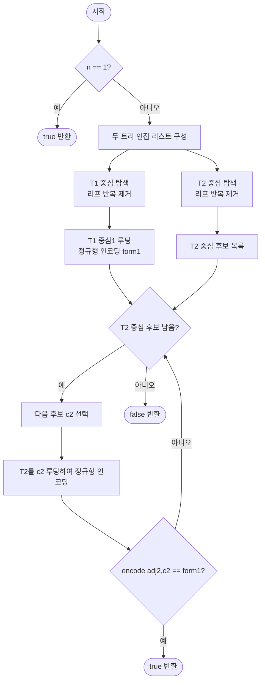

import { AlgorithmSimulation } from "#guide-sim";

# treeIsomorphism 해설

## 성능 목표 예측

### 제약 표

| 항목 | 값 |
|------|-----|
| 두 트리의 정점 수 $n$ | $1 \leq n \leq 10^5$ |
| 정점 레이블 | 0부터 $n-1$ |
| 간선 수 (각 트리) | $n - 1$ |

### Naive 접근의 한계

두 트리의 동형 판정을 단순하게 시도하면, 한 트리의 모든 정점 순열에 대해 다른 트리와 간선이 일치하는지 확인한다.

- 순열의 수: $n!$
- 각 순열 검증: $O(n)$
- 총: $O(n \cdot n!) = O(10^5!)$ → 완전히 불가

더 현실적인 naive로는 DFS로 두 트리를 동시에 탐색하며 부분 트리 구조를 직접 비교하는 방법이 있으나, 자식 순서가 다른 동형 트리를 잘못 처리하면 $O(n^2)$에 달한다. $n = 10^5$에서 $O(n^2) = 10^{10}$ → 시간 초과.

### 목표 복잡도와 근거

| 연산 | 목표 복잡도 | 근거 |
|------|-------------|------|
| 중심 탐색 | $O(n)$ | 리프 반복 제거 (BFS) |
| 정규형 인코딩 | $O(n \log n)$ | 자식 정규형 정렬 $O(\text{degree} \times \log)$ |
| 총 | $O(n \log n)$ | 정렬이 병목 |
| 공간 | $O(n)$ | 정규형 문자열 총 길이 $O(n)$ |

---

## 목표 함수

```ts
function treeIsomorphism(
  n: number,
  edges1: [number, number][],
  edges2: [number, number][]
): boolean
```

### 파라미터 표

| 파라미터 | 의미 | 제약 |
|----------|------|------|
| `n` | 두 트리의 공통 정점 수 | $1 \leq n \leq 10^5$ |
| `edges1` | 첫 번째 트리의 간선 목록 | 길이 $n - 1$ |
| `edges2` | 두 번째 트리의 간선 목록 | 길이 $n - 1$ |

### 반환값

두 트리 사이에 동형 사상(isomorphism) $\phi: V_1 \to V_2$가 존재하면 `true`, 아니면 `false`.

### 엣지케이스

| 케이스 | 조건 | 기대 출력 |
|--------|------|-----------|
| 단일 정점 | $n = 1$ | `true` |
| 두 정점 | $n = 2$ | `true` (단일 간선 트리는 항상 동형) |
| 선형 체인 vs 별 모양 | 구조가 완전히 다름 | `false` |
| 중심 2개인 트리 | 짝수 길이 체인 | 양쪽 루팅 모두 시도 후 판단 |

---

## 핵심 아이디어

**핵심 아이디어**: "각 서브트리의 구조를 자식 순서 무관한 정규형으로 인코딩하면, 두 트리의 동형 판정이 문자열 비교 하나로 줄어든다."

트리 동형 판정을 순열 탐색으로 시도하면 최악 O(n!)이 걸린다. 핵심 아이디어는 각 서브트리의 구조를 자식들의 정규형을 정렬해 결합하는 방식으로 유일한 문자열로 표현하는 것이다. 동형인 두 서브트리는 자식 순서가 달라도 정렬 후 동일한 정규형을 가진다. 여기에 두 트리를 같은 "중심" 정점에서 루팅해야 공정하게 비교할 수 있다.

**풀이 구조**
1. 각 트리의 중심(center)을 BFS 리프 반복 제거로 찾는다. (1개 또는 2개)
2. 두 트리를 각각 중심에서 루팅한다.
3. DFS 후위 순서로 각 정점의 정규형을 계산한다. (자식 정규형 정렬 후 괄호로 감싸기)
4. 루트의 정규형을 비교해 동일하면 동형, 다르면 비동형으로 판정한다.
5. 중심이 2개인 경우 두 중심 모두 시도한다.

**조건**: 두 트리의 정점 수가 동일해야 한다. 레이블 없는 비루팅 트리의 구조적 동형 판정.

**대표 예시**: 선형 체인(0-1-2-3-4) vs 별 모양(0이 중심, 1-2-3-4가 리프) 비교
중심 탐색에서 체인의 중심은 2, 별의 중심은 0이다. 체인의 정규형은 `"(((())))"` 형태, 별의 정규형은 `"(()()()())"` 형태가 되어 서로 달라 false를 반환한다.

**언제 쓰나**
두 트리가 구조적으로 같은지(레이블은 다를 수 있음)를 판정해야 할 때, 특히 자식 순서가 다른 동형 케이스를 올바르게 처리해야 하는 경쟁 프로그래밍 문제에서 사용한다.

---

### 원형 아이디어와 naive 접근

두 트리가 동형인지 확인하려면 구조가 "같은가"를 정의해야 한다. 가장 단순한 시도는 임의의 루트를 선택하고 DFS로 두 트리를 동시에 탐색하며 자식 수가 같은지 재귀 비교하는 것이다.

```
// naive: 재귀 비교 (루트 고정 가정)
function sameStructure(u1, par1, u2, par2):
    children1 = [c for c in adj1[u1] if c != par1]
    children2 = [c for c in adj2[u2] if c != par2]
    if len(children1) != len(children2): return false
    // 자식 순서 매칭 시도: 순열 탐색
    for each permutation of children2:
        if all sameStructure(children1[i], u1, permutation[i], u2):
            return true
    return false
```

이 접근의 문제점:
1. 자식 순서가 다른 동형 트리도 있으므로 순열 탐색이 필요하다.
2. 순열 탐색은 $O(\text{degree}!)$이며 최악의 경우 별 모양 트리에서 $O(n!)$이 된다.
3. 루트 선택이 잘못되면 동형임에도 `false`가 반환될 수 있다 (루트 위치에 따라 구조가 다르게 보임).

### 어떤 관찰이 돌파구가 되는가

- **관찰 1**: 각 부분 트리의 구조를 **유일한 문자열(정규형)**로 인코딩할 수 있다면, 두 트리의 동형 판정은 단순한 문자열 비교로 축약된다.
- **관찰 2**: 자식들의 정규형을 **정렬**하여 결합하면 자식 순서에 무관한 표현을 얻을 수 있다. 동형인 두 서브트리는 정규형이 일치한다.
- **관찰 3**: 루트 선택이 결과에 영향을 준다. 이를 해결하려면 두 트리를 **같은 기준점(중심)**에서 루팅해야 한다. 트리의 중심은 반복적 리프 제거로 유일하게 결정된다.

### 관찰을 형식화: 상태/구조 정의

**정규형 인코딩(Canonical Form)**:

$$\text{canon}(v) = \texttt{"("} + \text{join}(\text{sorted}([\text{canon}(c) : c \in \text{children}(v)])) + \texttt{")"}$$

- 리프: $\text{canon}(v) = \texttt{"()"}$
- 내부 노드: 자식들의 정규형을 사전 순 정렬 후 괄호로 감싼다.

이 정의가 이 형태여야 하는 이유: 자식 정렬 없이 순서대로 결합하면 자식이 다른 순서로 연결된 동형 트리에서 서로 다른 문자열이 생성된다. 반드시 정렬해야 "자식 순서 무관한" 정규형이 된다.

**트리의 중심(Center)**:

트리에서 리프를 반복적으로 제거하면 마지막에 1개 또는 2개의 정점이 남는다. 이것이 트리의 중심이다. 중심은 트리의 "무게 중심"으로, 어느 방향에서 루팅해도 가장 균형 잡힌 표현을 만든다.

중심이 2개인 경우: 두 중심은 반드시 인접한다. 이 경우 $T_1$의 중심 1을 루트로 한 정규형을 $T_2$의 두 중심 루팅과 각각 비교한다.

| 상태 | 의미 |
|------|------|
| `degree[v]` | 현재 남은 간선 수 |
| `removed[v]` | 리프 제거 여부 |
| `canon[v]` | $v$의 정규형 문자열 |
| `parent[v]` | DFS 부모 (인코딩 방향 제어) |

### 점화식 또는 핵심 연산

**중심 탐색 (BFS 리프 제거)**:

```
// 초기 리프: degree[v] == 1 (또는 n==1이면 degree[v] == 0)
remaining = n
while remaining > 2:
    nextLeaves = []
    for v in currentLeaves:
        removed[v] = true
        remaining -= 1
        for u in adj[v]:
            if not removed[u]:
                degree[u] -= 1
                if degree[u] == 1:
                    nextLeaves.push(u)
    currentLeaves = nextLeaves
return currentLeaves  // 1개 또는 2개
```

각 단계에서 현재 리프들을 모두 제거하면 내부 정점의 degree가 감소한다. `remaining > 2`를 유지하는 이유: 중심이 1개인 경우 `remaining == 1`, 중심이 2개인 경우 `remaining == 2`에서 종료되어야 하기 때문이다.

**정규형 인코딩 (DFS 포스트오더)**:

리프부터 루트 방향으로 정규형을 계산한다.

```
// DFS 포스트오더로 방문 순서 기록 후 역순 처리
for v in reverse(dfsOrder):
    childForms = sorted([canon[c] for c in children(v)])
    canon[v] = "(" + join(childForms) + ")"
```

- 리프: `childForms = []` → `canon[v] = "()"`
- 내부 노드: 자식 정규형을 사전 순 정렬 후 결합

### 정당성 — 왜 이것이 옳은가

**정규형의 유일성**: 같은 구조를 가진 두 루팅 트리에서 정규형이 동일함을 귀납법으로 증명한다.

기저: 리프 노드. 모든 리프의 정규형 = `"()"`. 두 트리에서 같은 구조의 리프는 같은 정규형을 가진다.

귀납: 자식들의 정규형이 동일하다고 가정하자. 자식 목록을 정렬 후 결합하면 자식 순서에 무관한 표현을 얻는다. 두 트리에서 동형인 내부 노드는 자식들의 정규형 집합이 동일하므로 (귀납 가정), 정렬 후 결합 결과도 동일하다.

**중심 기반 루팅의 필요성**: 루트 없는 트리에서 루팅 방식에 따라 정규형이 달라진다. 중심은 "위상학적으로 가장 중립적인" 위치이므로, 두 트리의 중심을 루트로 선택하면 동형인 경우 정규형이 반드시 일치한다.

중심이 2개인 경우: 두 중심 $c_1, c_2$ 중 하나를 루트로 선택하면 나머지가 heavy child 방향으로 내려가게 된다. $T_1$의 중심 $c_1^{(1)}$과 $T_2$의 중심 $c_1^{(2)}, c_2^{(2)}$ 중 어느 것이 대응되는지 모르므로 두 경우를 모두 시도한다.

### 구현 디테일과 최적화

**문자열 대신 해시 사용**: 정규형 문자열이 최악의 경우 $O(n)$ 길이가 될 수 있다. 비교를 $O(n)$에 수행하면 총 $O(n^2)$이 될 수 있으므로, 롤링 해시 또는 정수 라벨링으로 각 고유 정규형에 정수 ID를 부여하면 비교가 $O(1)$이 된다.

**정수 라벨링 방법**: 각 고유 정규형 문자열을 HashMap에 저장하고 등장 순서대로 정수 ID를 부여한다. 자식들의 ID 목록을 정렬하여 이 목록 자체를 HashMap 키로 사용하면 문자열 없이도 인코딩이 가능하다.

**반복적 DFS**: 재귀 깊이 $O(n)$ 가능성으로 반복적 DFS가 필요하다.

**함정 - n=1 예외 처리**: $n = 1$일 때 리프 제거 루프 자체가 시작되지 않으므로 (degree[0] = 0, remaining = 1) 별도 처리가 필요하다.

**함정 - 정렬 방향**: 자식 정규형은 반드시 사전 순(lexicographic) 정렬해야 한다. 정렬 없이 결합하면 자식 순서가 다른 동형 트리에서 다른 문자열이 생성된다.

---

## 시뮬레이션

두 트리 `n = 4`, `edges1 = [[0,1], [1,2], [1,3]]`(중심 1), `edges2 = [[2,0], [2,1], [2,3]]`(중심 2)에 대해 동형 여부를 판정하는 과정이다. 두 트리 모두 한 정점에 세 리프가 달린 별 모양이라 자식 레이블만 다를 뿐 구조가 같다. 트리 패널은 각 트리를 중심에서 루팅한 모습이고(active=중심/현재 정점, visited=정규형 확정), keyValue 패널은 중심과 정규형 문자열 스냅샷이다.

실제 반환값은 `true` (두 정규형이 모두 `(()()())` 로 일치)이며, 시뮬레이션 마지막 프레임의 판정과 일치한다.

> 대화형 시뮬레이션은 MDX 런타임에서 표시됩니다.

export const t1 = (s) => ({
  id: 1, label: "1", status: s[1],
  children: [
    { id: 0, label: "0", status: s[0] },
    { id: 2, label: "2", status: s[2] },
    { id: 3, label: "3", status: s[3] },
  ],
});

export const t2 = (s) => ({
  id: 2, label: "2", status: s[2],
  children: [
    { id: 0, label: "0", status: s[0] },
    { id: 1, label: "1", status: s[1] },
    { id: 3, label: "3", status: s[3] },
  ],
});

export const none = { 0: "default", 1: "default", 2: "default", 3: "default" };

export const steps = [
  {
    title: "T1 중심 탐색",
    detail: "리프 0, 2, 3을 제거 → remaining=1. T1의 중심은 정점 1.",
    root: t1({ ...none, 1: "active" }),
    entries: [
      { label: "T1 degree", value: "1:3, 0/2/3:1" },
      { label: "centers1", value: "[1]" },
    ],
  },
  {
    title: "T1 정규형 인코딩",
    detail: "리프 canon=(). 중심 1: sorted((),(),()) 결합 → ( ()()() ).",
    root: t1({ 0: "visited", 1: "active", 2: "visited", 3: "visited" }),
    entries: [
      { label: "canon(리프)", value: "()" },
      { label: "form1 = canon(1)", value: "(()()())" },
    ],
  },
  {
    title: "T2 중심 탐색",
    detail: "리프 0, 1, 3을 제거 → remaining=1. T2의 중심은 정점 2.",
    root: t2({ ...none, 2: "active" }),
    entries: [
      { label: "T2 degree", value: "2:3, 0/1/3:1" },
      { label: "centers2", value: "[2]" },
    ],
  },
  {
    title: "T2 정규형 인코딩 (중심 2)",
    detail: "리프 canon=(). 중심 2: sorted((),(),()) 결합 → ( ()()() ).",
    root: t2({ 0: "visited", 1: "visited", 2: "active", 3: "visited" }),
    entries: [
      { label: "canon(리프)", value: "()" },
      { label: "encode(T2, 2)", value: "(()()())" },
    ],
  },
  {
    title: "정규형 비교",
    detail: "form1 = (()()()) 와 encode(T2, 2) = (()()()) 가 일치한다.",
    root: t2({ 0: "visited", 1: "visited", 2: "active", 3: "visited" }),
    entries: [
      { label: "form1", value: "(()()())" },
      { label: "form2", value: "(()()())" },
    ],
  },
  {
    title: "완료: true",
    detail: "두 정규형이 같으므로 두 트리는 동형이다. true 반환.",
    root: t2({ 0: "visited", 1: "visited", 2: "visited", 3: "visited" }),
    entries: [
      { label: "동형 여부", value: "true" },
    ],
  },
];

<AlgorithmSimulation view={["tree", "keyValue"]} steps={steps} title="Tree Isomorphism: 정규형 비교" />

## 수도 코드와 Activity Diagram

### 의사코드

```
function treeIsomorphism(n, edges1, edges2):
    if n == 1: return true       // 단일 정점은 항상 동형

    // 인접 리스트 구성
    function buildAdj(edges):
        adj[0..n-1] = []
        for each [u, v] in edges:
            adj[u].push(v), adj[v].push(u)
        return adj

    // 중심 탐색: 리프 반복 제거
    function findCenter(adj):
        degree[v] = adj[v].length for all v
        leaves = [v | degree[v] == 1]
        removed[0..n-1] = false
        remaining = n
        while remaining > 2:
            nextLeaves = []
            for v in leaves:
                removed[v] = true
                remaining -= 1                 // 불변식: remaining = 아직 남은 정점 수
                for u in adj[v]:
                    if not removed[u]:
                        degree[u] -= 1
                        if degree[u] == 1:
                            nextLeaves.push(u)
            leaves = nextLeaves
        return leaves    // 불변식: 길이 1 또는 2

    // 정규형 인코딩 (루트 지정)
    function encode(adj, root):
        parent[0..n-1] = -1
        order = []                            // DFS 방문 순서
        stack = [(root, -1)]
        while stack not empty:
            (v, par) = stack.pop()
            parent[v] = par
            order.push(v)
            for u in adj[v]:
                if u != par:
                    stack.push((u, v))

        canon[0..n-1] = ""
        for v in reverse(order):              // 리프 → 루트 순서
            childForms = []
            for u in adj[v]:
                if u != parent[v]:
                    childForms.push(canon[u])
            childForms.sort()                 // 불변식: 자식 정렬로 순서 무관 표현
            canon[v] = "(" + join(childForms) + ")"
        return canon[root]                    // 루트의 정규형 = 전체 트리 정규형

    adj1 = buildAdj(edges1)
    adj2 = buildAdj(edges2)
    centers1 = findCenter(adj1)
    centers2 = findCenter(adj2)

    // T1의 중심1 정규형 계산
    form1 = encode(adj1, centers1[0])

    // T2의 각 중심으로 루팅하여 비교
    for c2 in centers2:
        if encode(adj2, c2) == form1:
            return true                       // 동형 발견
    return false                              // 모든 후보 불일치
```

**핵심 불변식**: `canon[v]`는 $v$를 루트로 하는 서브트리의 정규형이며, 동형인 두 서브트리에서 항상 동일한 값을 가진다.

### Activity Diagram



**핵심 불변식**: 정규형 인코딩 시 `childForms`를 정렬하므로, 동형인 서브트리는 자식 방문 순서에 무관하게 동일한 `canon[v]` 값을 가진다.
