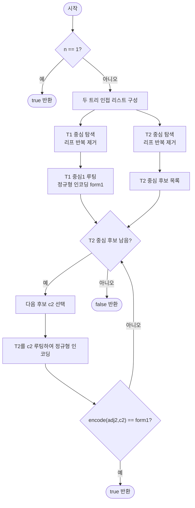

import { AlgorithmSimulation } from "#guide-sim";

# treeIsomorphism — 트리를 정규형 문자열로 접어 구조를 비교하는 이유

## 한눈에 보는 컨셉

두 트리가 정점 번호만 다를 뿐 실제로는 같은 모양인지 확인하는 문제예요. 각 서브트리를 "자식들의 정규형을 정렬해 괄호로 묶은 문자열"로 접으면, 동형인 서브트리는 항상 똑같은 문자열을 갖습니다. 여기에 두 트리를 같은 기준점인 "중심(center)"에서 루팅해 공정하게 비교하면, 동형 판정이 `O(n log n)`짜리 값 비교 하나로 끝나요.

## 출발점: 가장 순진한 방법부터

문제를 먼저 정확히 잡을게요.

```ts
function treeIsomorphism(
  n: number,
  edges1: [number, number][],
  edges2: [number, number][]
): boolean
```

`n`은 두 트리 각각의 정점 수(`1 ≤ n ≤ 10^5`), `edges1`·`edges2`는 각각 `n-1`개의 무방향 간선으로 이루어진 연결된 트리입니다. 두 트리 사이에 정점 대응 `φ: V₁ → V₂`가 존재해서, `T1`의 모든 간선 `(u, v)`가 `T2`에서 정확히 `(φ(u), φ(v))`로 대응되면(그리고 그런 경우에만) `true`를 반환합니다.

문제 정의 자체가 "그런 대응 `φ`가 존재하는가"를 묻고 있으니, 가장 정직한 방법은 실제로 `φ`를 전부 찾아보는 겁니다. 정점 번호 `0..n-1`을 `T2`의 번호에 대응시키는 순열을 하나씩 시도하고, 그 순열이 `edges1`의 모든 간선을 `edges2`의 간선으로 정확히 옮기는지 확인하면 됩니다.

```ts
function isIsomorphicByPermutation(
  n: number,
  edges1: [number, number][],
  edges2: [number, number][]
): boolean {
  const edgeSet2 = new Set(
    edges2.map(([u, v]) => (u < v ? `${u},${v}` : `${v},${u}`))
  );
  const perm = Array.from({ length: n }, (_, i) => i);

  function tryPermutations(k: number): boolean {
    if (k === n) {
      for (const [u, v] of edges1) {
        const a = perm[u]!;
        const b = perm[v]!;
        const key = a < b ? `${a},${b}` : `${b},${a}`;
        if (!edgeSet2.has(key)) return false; // 이 순열로는 간선이 안 맞음
      }
      return true;
    }
    for (let i = k; i < n; i++) {
      [perm[k], perm[i]] = [perm[i]!, perm[k]!];
      if (tryPermutations(k + 1)) return true;
      [perm[k], perm[i]] = [perm[i]!, perm[k]!]; // 백트래킹
    }
    return false;
  }

  return tryPermutations(0);
}
```

문제가 되는 건 순열의 개수입니다. `n`개의 정점 번호를 재배치하는 방법은 `n!`가지고, 매번 `edges1`을 전부 검사하니 총 `O(n · n!)`이에요.

```text
n = 4   →   4! =                24 가지
n = 8   →   8! =            40,320 가지
n = 12  →  12! =       479,001,600 가지
n = 16  →  16! =    20,922,789,888,000 가지
n = 20  →  20! = 2,432,902,008,176,640,000 가지

n = 10^5 이면 → 상상하기도 힘든 자릿수, 완전히 불가능
```

정점이 20개만 넘어가도 이미 계산 불가능한 영역이고, `n ≤ 10^5`인 이 문제에서는 말할 것도 없습니다. 그런데 조금만 생각해 보면 낌새가 하나 보여요. **차수(degree)가 다른 정점끼리는 애초에 대응될 수 없습니다.** 순열을 무작정 뒤지는 대신, 각 서브트리의 "모양"을 요약된 값 하나로 표현해서 곧바로 비교할 수는 없을까요? 이것이 이번 알고리즘의 출발 단서입니다.

## 아이디어 자세히 들여다보기

### 부분 구조를 괄호 문자열로 접기 — 정규형과 그림

핵심 아이디어는 이겁니다: **"각 서브트리의 구조를 자식 순서와 무관한 유일한 문자열로 접을 수 있다면, 두 트리의 동형 판정은 문자열 비교 하나로 줄어든다."** 정점 `v`를 루트로 하는 서브트리의 정규형(canonical form)을 이렇게 정의해요.

$$\text{canon}(v) = \texttt{"("} + \text{join}\big(\text{sorted}([\text{canon}(c) : c \in \text{children}(v)])\big) + \texttt{")"}$$

리프는 자식이 없으니 `canon(v) = "()"`. 내부 노드는 자식들의 정규형을 사전순으로 정렬한 뒤 이어 붙이고 괄호로 감쌉니다. 시뮬레이션에서 쓸 별 모양 트리(중심이 정점 1이고 리프가 0, 2, 3)로 직접 채워 볼게요.

```text
리프 0, 2, 3:   canon(0) = canon(2) = canon(3) = "()"

중심 1(자식 0,2,3):
  sorted(["()", "()", "()"]) = ["()", "()", "()"]   ← 이미 다 같아서 정렬해도 그대로
  canon(1) = "(" + "()"+"()"+"()" + ")" = "(()()())"
```

잠깐, 확인 하나만 해 볼까요? 만약 중심 1의 자식이 `0, 2, 3`이 아니라 `2, 3, 0` 순서로 나열돼 있었다면 `canon(1)`이 달라질까요? — 아니요. `sorted(...)`를 거치는 순간 나열 순서는 결과에 영향을 주지 않습니다. 세 값이 전부 `"()"`로 같으니 더더욱 그렇고요.

여기서 "왜 하필 정렬까지 해야 하는가"가 궁금할 수 있어요. 정렬 없이 그냥 순서대로 이어 붙이면 어떻게 될까요? 자식 순서가 다르게 나열된 두 서브트리(구조는 동일)가 서로 다른 문자열을 만들어 냅니다 — 이 실패는 `왜 모순 없이 작동하는가` 절에서 실제 수치로 확인해 볼게요.

### 단서를 설명해 주는 이론 — 트리의 중심(Center)

정규형 자체는 "루트가 정해진" 트리에만 적용됩니다. 그런데 문제의 두 트리는 루트가 없는 무방향 트리예요. 아무 정점이나 루트로 잡으면 같은 트리라도 다른 정규형이 나올 수 있습니다(이 실패도 곧 구체적으로 봅니다). 그래서 "어느 트리에서 골라도 항상 같은 자리"인 기준점이 필요한데, 그게 트리의 **중심(center)**입니다.

중심을 찾는 방법은 리프를 반복적으로 제거하는 것뿐이에요. 양파 껍질을 벗기듯 바깥에서부터 지워 나가면 마지막에 1개 또는 2개의 정점이 남는데, 그게 중심입니다.

```text
체인 0 - 1 - 2 - 3  (n = 4)

1라운드: 리프 {0, 3} 제거      →  남은 정점 {1, 2}, remaining = 2
remaining ≤ 2 이므로 종료      →  중심 = {1, 2}  (짝수 길이 체인은 중심이 2개)
```

왜 1개 또는 2개에서 멈추는 게 맞을까요? 매 라운드마다 "현재 바깥쪽 리프 전부"를 동시에 지우는데, 트리는 사이클이 없으므로 이 과정은 안쪽으로만 수렴합니다. 남은 정점이 3개 이상이면 그중에도 반드시 차수 1인 리프가 있어(트리는 간선 수가 정점 수보다 하나 적으므로) 다음 라운드에 또 지워지고, 결국 서로 인접한 2개 또는 홀로 남은 1개에서 멈춰요.

### 왜 모순 없이 작동하는가

정규형이 "동형이면 반드시 같은 문자열"이라는 약속을 지키는지 귀납법으로 확인해 볼게요.

**기저**: `v`가 리프인 경우. 자식이 없으므로 `canon(v) = "()"`. 두 트리에서 서로 대응하는 리프는 항상 같은 정규형을 가집니다.

**귀납**: `v`의 자식이 `k`개(`k ≥ 0`)라고 합시다. `k = 0`이면 기저와 같은 경우고, `k ≥ 1`이면 귀납 가정에 의해 대응하는 자식들의 정규형이 이미 각각 동일합니다. 동형 사상은 자식들을 어떤 순서로도 대응시킬 수 있으므로, 이 시점에서 "자식 정규형의 멀티셋"은 두 트리에서 같습니다. `sorted(...)`는 멀티셋을 유일한 순서로 나열하는 연산이므로, 정렬 후 결합한 결과 역시 두 트리에서 같습니다. 자식 개수에 대한 경우는 `k = 0`과 `k ≥ 1` 두 가지뿐이라 이걸로 모든 노드를 다 덮습니다.

여기서 **헷갈리기 쉬운 포인트**가 둘 있습니다.

- **"아무 정점이나 루트로 잡아도 되지 않을까?"** — 아닙니다. 다음 두 트리로 확인해 볼게요.

  ```text
  T1: 0-1-2-3 체인에 2가 리프 3,4를 더 매담  →  edges1 = [[0,1],[1,2],[2,3],[2,4]]
  T2: 정점 0과 2의 번호만 맞바꾼 같은 트리     →  edges2 = [[2,1],[1,0],[0,3],[0,4]]
  ```

  두 트리는 실제로 동형입니다(순열 탐색으로 직접 확인하면 `true`). 그런데 그냥 정점 0을 루트로 고정해 보면,

  ```text
  T1을 정점 0에서 루팅 → "(((()())))"
  T2를 정점 0에서 루팅 → "((())()())"     ← 다르다! 동형인데 false로 오판
  ```

  T1에서 정점 0은 나뭇가지 끝의 리프이고, T2에서 정점 0은 차수 3인 허브입니다 — 같은 번호 "0"이 두 트리에서 전혀 다른 구조적 위치를 가리키니 당연히 다른 문자열이 나옵니다. 반면 두 트리의 중심(둘 다 정점 1을 포함)에서 루팅하면,

  ```text
  T1을 중심 1에서 루팅 → "((()())())"
  T2를 중심 1에서 루팅 → "((()())())"     ← 일치!
  ```

  중심은 "어느 트리에서 골라도 구조적으로 같은 자리"이기 때문에 이 문제가 사라집니다.

- **"정렬은 생략하고 순서만 맞춰 넣으면 되지 않을까?"** — 같은 트리를 간선 나열 순서만 바꿔서 인코딩하면 확인할 수 있습니다.

  ```text
  중심 5에 리프 0, 단일 체인 1-2, 단일 체인 3-4가 매달린 트리(둘 다 같은 트리, 나열 순서만 다름)

  edgesA = [[5,0],[5,1],[1,2],[5,3],[3,4]]
  edgesB = [[5,3],[3,4],[5,1],[1,2],[5,0]]

  정렬 없이 결합: "(()(())(()))"  vs  "((())(())())"   ← 다르다!
  정렬 포함 결합: "((())(())())"  vs  "((())(())())"   ← 일치
  ```

  자식들이 인접 리스트에 나열된 순서가 다르면, 정렬 없이는 서로 다른 문자열이 나옵니다. `sorted(...)` 한 줄이 이 문제를 없애는 전부예요.

엣지 케이스도 짚어 두면:

```text
n = 1                        → 특수 처리로 곧장 true (정규형 개념 자체가 필요 없음)
n = 2 (간선 1개)              → 두 정점 모두 중심, centers = [0, 1]
짝수 길이 체인(n = 4)         → 중심 2개, centers = [1, 2]
완전히 다른 구조(체인 vs 별)  → 정규형이 달라 false
```

## 아이디어를 코드로 옮기기

지금까지의 아이디어를 그대로 옮기면 이렇습니다.

```ts
function buildAdjacency(n: number, edges: [number, number][]): number[][] {
  const adj: number[][] = Array.from({ length: n }, () => []);
  for (const [u, v] of edges) {
    adj[u]!.push(v);
    adj[v]!.push(u);
  }
  return adj;
}

function findCenters(n: number, adj: number[][]): number[] {
  const degree = adj.map((list) => list.length);
  const removed = new Array<boolean>(n).fill(false);
  let leaves: number[] = [];
  for (let v = 0; v < n; v++) if (degree[v] === 1) leaves.push(v);
  let remaining = n;
  while (remaining > 2) {
    const next: number[] = [];
    for (const v of leaves) {
      removed[v] = true;
      remaining--;
      for (const u of adj[v]!) {
        if (!removed[u]) {
          degree[u]!--;
          if (degree[u] === 1) next.push(u);
        }
      }
    }
    leaves = next;
  }
  return leaves; // 길이 1 또는 2
}

function encodeStringForm(adj: number[][], root: number): string {
  const n = adj.length;
  const parent = new Array<number>(n).fill(-1);
  const order: number[] = [];
  const visited = new Array<boolean>(n).fill(false);
  const stack: number[] = [root];
  visited[root] = true;
  while (stack.length > 0) {
    const v = stack.pop()!;
    order.push(v);
    for (const u of adj[v]!) {
      if (!visited[u]) {
        visited[u] = true;
        parent[u] = v;
        stack.push(u);
      }
    }
  }
  const canon = new Array<string>(n).fill("");
  for (let i = order.length - 1; i >= 0; i--) {
    const v = order[i]!;
    const childForms: string[] = [];
    for (const u of adj[v]!) {
      if (u !== parent[v]) childForms.push(canon[u]!);
    }
    childForms.sort();
    canon[v] = "(" + childForms.join("") + ")";
  }
  return canon[root]!;
}

function treeIsomorphismBasic(
  n: number,
  edges1: [number, number][],
  edges2: [number, number][]
): boolean {
  if (n === 1) return true; // 정점 하나뿐이면 항상 동형
  const adj1 = buildAdjacency(n, edges1);
  const adj2 = buildAdjacency(n, edges2);
  const centers1 = findCenters(n, adj1);
  const centers2 = findCenters(n, adj2);
  const form1 = encodeStringForm(adj1, centers1[0]!);
  for (const c2 of centers2) {
    if (encodeStringForm(adj2, c2) === form1) return true;
  }
  return false;
}
```

**가장 실수가 잦은 줄은 `childForms.sort()`입니다.** 바로 앞 절에서 본 것처럼, 이 한 줄이 빠지면 같은 트리도 간선 나열 순서에 따라 다른 문자열이 나와 조용히 `false`를 뱉습니다.

- `if (u !== parent[v])` 가드는 부모 방향으로 되돌아가지 않게 막는 장치입니다. 스택 기반 DFS라 재귀 깊이 제한 없이 `n = 10^5`짜리 체인도 안전하게 처리합니다.
- `centers1[0]`은 하나만 쓰지만 `centers2`는 루프를 돕니다. 중심이 2개일 때 어느 쪽이 "대응하는" 중심인지 미리 알 수 없으므로, `T2`의 두 후보를 모두 시도해야 정확합니다(`T1` 쪽은 하나만 고정해도 됩니다 — 대응되는 중심이 `T2`의 후보 중 하나로 반드시 걸리기 때문이에요).

## 더 빠르게 만들 단서 찾기

이 구현이 실제로 무슨 일을 하는지 조금 더 들여다볼게요. `canon[v] = "(" + childForms.join("") + ")"` 줄은 자식 문자열 전체를 매번 다시 결합합니다. 한쪽으로 치우친 체인 트리에서 이 결합이 실제로 몇 글자를 복사하는지 세어 보면 이렇습니다.

```text
체인 길이 n에서 "결합 시 복사되는 총 글자 수"

n = 10    →      50자   (n² 대비 정확히 0.500)
n = 100   →   5,000자   (n² 대비 정확히 0.500)
n = 1000  → 500,000자   (n² 대비 정확히 0.500)
n = 4000  → 8,000,000자 (n² 대비 정확히 0.500)

비율이 항상 0.5로 고정 → 복사량이 정확히 n²/2, 즉 O(n²)
```

성능 목표 예측에서 정규형 인코딩의 목표는 `O(n log n)`이었는데, 체인처럼 한쪽으로 치우친 트리에서는 매 레벨마다 자식 문자열 전체를 다시 복사해 담다 보니 총 복사량이 `O(n²)`까지 치솟습니다. `n = 10^5`라면 `n²/2 ≈ 5 × 10^9`글자를 복사하는 셈이니, 목표에서 한참 벗어나요.

## 단서를 최적화로 연결하기

낭비의 정체는 "이미 확정된 자식의 모양을 매번 통째로 다시 복사해 옮긴다"는 데 있습니다. 문자열 대신, 자식들의 **이미 계산된 정수 라벨**만 정렬해서 짧은 키로 쓰면 어떨까요?

```text
Before(문자열):  canon(v) = "(" + join(sorted(자식 문자열들)) + ")"
                 → 키 길이가 서브트리 크기만큼 커짐 (체인이면 O(n))

After(정수 라벨): key = sorted(자식 라벨 정수들).join(",")
                 → 키 길이가 "자식 개수"만큼만 커짐 (체인이면 항상 1개)
```

핵심 불변식은 이겁니다: **같은 모양의 서브트리는 정수 라벨로도 항상 같은 값을 가져야 한다.** 이걸 지키려면 "모양 문자열 키 → 정수"를 기록하는 사전(`labelOf`)을 **두 트리가 함께 공유**해야 합니다. 어느 트리에서 먼저 봤든, 같은 모양이면 같은 정수가 나와야 비교가 의미를 가지니까요.

## 최적화 코드

바뀌는 부분은 인코딩 함수 하나입니다. `buildAdjacency`와 `findCenters`는 그대로 두고, 문자열 결합 대신 정수 라벨을 매기도록 바꿉니다.

```ts
function encodeLabeled(
  adj: number[][],
  root: number,
  labelOf: Map<string, number> // 두 트리가 함께 쓰는 라벨 사전
): number {
  const n = adj.length;
  const parent = new Array<number>(n).fill(-1);
  const order: number[] = [];
  const visited = new Array<boolean>(n).fill(false);
  const stack: number[] = [root];
  visited[root] = true;
  while (stack.length > 0) {
    const v = stack.pop()!;
    order.push(v);
    for (const u of adj[v]!) {
      if (!visited[u]) {
        visited[u] = true;
        parent[u] = v;
        stack.push(u);
      }
    }
  }
  const label = new Array<number>(n).fill(-1);
  for (let i = order.length - 1; i >= 0; i--) {
    const v = order[i]!;
    const childLabels: number[] = [];
    for (const u of adj[v]!) {
      if (u !== parent[v]) childLabels.push(label[u]!);
    }
    childLabels.sort((a, b) => a - b);
    const key = childLabels.join(","); // 키 길이 = 자식 개수
    let id = labelOf.get(key);
    if (id === undefined) {
      id = labelOf.size;
      labelOf.set(key, id);
    }
    label[v] = id;
  }
  return label[root]!;
}

function treeIsomorphism(
  n: number,
  edges1: [number, number][],
  edges2: [number, number][]
): boolean {
  if (n === 1) return true;
  const adj1 = buildAdjacency(n, edges1);
  const adj2 = buildAdjacency(n, edges2);
  const centers1 = findCenters(n, adj1);
  const centers2 = findCenters(n, adj2);

  const labelOf = new Map<string, number>(); // 반드시 공유
  const id1 = encodeLabeled(adj1, centers1[0]!, labelOf);
  for (const c2 of centers2) {
    if (encodeLabeled(adj2, c2, labelOf) === id1) return true;
  }
  return false;
}
```

**가장 중요한 줄은 `const labelOf = new Map(...)`를 두 인코딩 호출이 그대로 공유한다는 점입니다.** 만약 트리마다 새 맵을 따로 만들면 어떤 일이 벌어지는지, 실제로 비동형인 두 트리로 확인해 볼게요.

```text
edges1 = [[0,1],[0,2],[0,3],[2,4],[2,5]]   (차수: 3,1,3,1,1,1)
edges2 = [[0,1],[0,2],[1,3],[2,4],[0,5]]   (차수: 3,2,2,1,1,1)

차수 분포부터 다르므로 실제로는 비동형 (순열 탐색 결과 false)

맵을 트리마다 따로 쓰면:
  T1 중심(0) 인코딩 결과 id = 2
  T2 중심(0) 인코딩 결과 id = 2   ← 우연히 같은 번호! true로 오판

맵을 공유하면:
  두 인코딩 모두 같은 사전을 참조 → 정확히 false
```

두 트리가 서로 다른 모양인데도, 각자의 맵에서 "몇 번째로 새로운 모양을 만났는가"가 우연히 같아지면서 같은 정수를 받아버렸습니다. 라벨 정수는 그 자체로 의미가 있는 게 아니라 "같은 사전 안에서만" 비교할 수 있는 값이라는 걸 잊으면 이렇게 조용히 틀립니다.

`n = 10^5`짜리 체인과 별 모양 트리로 최종 구현을 재 보면 각각 약 25ms, 16ms 안에 끝납니다 — 애초 목표였던 `O(n log n)`대로 움직인다는 뜻이에요. 더 줄일 여지가 있을까요? 자식 정규형을 비교 기반으로 정렬하는 한, 차수가 큰 노드(별 모양의 중심처럼 자식이 `n-1`개인 경우)에서 `O(k log k)` 정렬 비용은 피할 수 없습니다. 기수 정렬 같은 비교 없는 특화 기법으로 이 로그 인자를 더 줄이는 것도 가능은 하지만, 이 가이드는 어떤 자식 개수 분포에도 그대로 통하는 비교 기반 정렬을 그대로 씁니다 — 여기서 멈추는 이유는 **범용성**이에요.

## 실행 시각화

두 트리 `n = 4`, `edges1 = [[0,1], [1,2], [1,3]]`(중심 1), `edges2 = [[2,0], [2,1], [2,3]]`(중심 2)에 대해 동형 여부를 판정하는 과정입니다. 두 트리 모두 한 정점에 세 리프가 달린 별 모양이라 자식 레이블만 다를 뿐 구조가 같습니다. 트리 패널은 각 트리를 중심에서 루팅한 모습이고(active=중심/현재 정점, visited=정규형 확정), keyValue 패널은 중심과 정규형 문자열 스냅샷입니다.

실제 반환값은 `true`(두 정규형이 모두 `(()()())`로 일치)이며, 시뮬레이션 마지막 프레임의 판정과 일치합니다.

> 대화형 시뮬레이션은 MDX 런타임에서 표시됩니다.

export const t1 = (s) => ({
  id: 1, label: "1", status: s[1],
  children: [
    { id: 0, label: "0", status: s[0] },
    { id: 2, label: "2", status: s[2] },
    { id: 3, label: "3", status: s[3] },
  ],
});

export const t2 = (s) => ({
  id: 2, label: "2", status: s[2],
  children: [
    { id: 0, label: "0", status: s[0] },
    { id: 1, label: "1", status: s[1] },
    { id: 3, label: "3", status: s[3] },
  ],
});

export const none = { 0: "default", 1: "default", 2: "default", 3: "default" };

export const steps = [
  {
    title: "T1 중심 탐색",
    detail: "리프 0, 2, 3을 제거 → remaining=1. T1의 중심은 정점 1.",
    root: t1({ ...none, 1: "active" }),
    entries: [
      { label: "T1 degree", value: "1:3, 0/2/3:1" },
      { label: "centers1", value: "[1]" },
    ],
  },
  {
    title: "T1 정규형 인코딩",
    detail: "리프 canon=(). 중심 1: sorted((),(),()) 결합 → ( ()()() ).",
    root: t1({ 0: "visited", 1: "active", 2: "visited", 3: "visited" }),
    entries: [
      { label: "canon(리프)", value: "()" },
      { label: "form1 = canon(1)", value: "(()()())" },
    ],
  },
  {
    title: "T2 중심 탐색",
    detail: "리프 0, 1, 3을 제거 → remaining=1. T2의 중심은 정점 2.",
    root: t2({ ...none, 2: "active" }),
    entries: [
      { label: "T2 degree", value: "2:3, 0/1/3:1" },
      { label: "centers2", value: "[2]" },
    ],
  },
  {
    title: "T2 정규형 인코딩 (중심 2)",
    detail: "리프 canon=(). 중심 2: sorted((),(),()) 결합 → ( ()()() ).",
    root: t2({ 0: "visited", 1: "visited", 2: "active", 3: "visited" }),
    entries: [
      { label: "canon(리프)", value: "()" },
      { label: "encode(T2, 2)", value: "(()()())" },
    ],
  },
  {
    title: "정규형 비교",
    detail: "form1 = (()()()) 와 encode(T2, 2) = (()()()) 가 일치한다.",
    root: t2({ 0: "visited", 1: "visited", 2: "active", 3: "visited" }),
    entries: [
      { label: "form1", value: "(()()())" },
      { label: "form2", value: "(()()())" },
    ],
  },
  {
    title: "완료: true",
    detail: "두 정규형이 같으므로 두 트리는 동형이다. true 반환.",
    root: t2({ 0: "visited", 1: "visited", 2: "visited", 3: "visited" }),
    entries: [
      { label: "동형 여부", value: "true" },
    ],
  },
];

<AlgorithmSimulation view={["tree", "keyValue"]} steps={steps} title="Tree Isomorphism: 정규형 비교" />

## 흐름 한눈에 보기


```mermaid
flowchart TD
    A([시작]) --> B{"n == 1?"}
    B -- 예 --> C([true 반환])
    B -- 아니오 --> D["두 트리 인접 리스트 구성"]
    D --> E1["T1 중심 탐색<br/>리프 반복 제거"]
    D --> E2["T2 중심 탐색<br/>리프 반복 제거"]
    E1 --> F["T1 중심1 루팅<br/>정규형 인코딩 form1"]
    E2 --> G["T2 중심 후보 목록"]
    F --> H{"T2 중심 후보 남음?"}
    G --> H
    H -- 예 --> I["다음 후보 c2 선택"]
    I --> J["T2를 c2 루팅하여 정규형 인코딩"]
    J --> K{"encode(adj2,c2) == form1?"}
    K -- 예 --> L([true 반환])
    K -- 아니오 --> H
    H -- 아니오 --> M([false 반환])
```

## 스스로 점검하기

1. 체인 `0-1-2-3-4`(n=5)의 중심을 리프 반복 제거로 손수 구해 보세요. (힌트: 1라운드에 리프 `{0, 4}`를 제거하면 `{1,2,3}`이 남고, 그중 다시 리프가 되는 정점을 제거하면 `remaining = 1`에서 멈춥니다. 정답은 중심 하나, 정점 `2`입니다.)
2. `왜 모순 없이 작동하는가`의 broom 트리 반례(`edges1 = [[0,1],[1,2],[2,3],[2,4]]`, `edges2 = [[2,1],[1,0],[0,3],[0,4]]`)에서, 정점 `0`을 그냥 루트로 고정하면 왜 `"(((()())))"`와 `"((())()())"`처럼 다른 문자열이 나오는지, 각 트리에서 정점 `0`이 맡은 구조적 역할이 무엇인지 짚어 설명해 보세요.
3. 이 알고리즘은 입력이 사이클 없는 트리라는 전제에 기대고 있습니다. 만약 `edges1`에 사이클이 있는 그래프가 섞여 들어온다면(간선 수가 `n`개 이상), `findCenters`의 "리프를 반복적으로 제거해 1~2개가 남는다"는 불변식이 왜 깨지는지 생각해 보세요.
