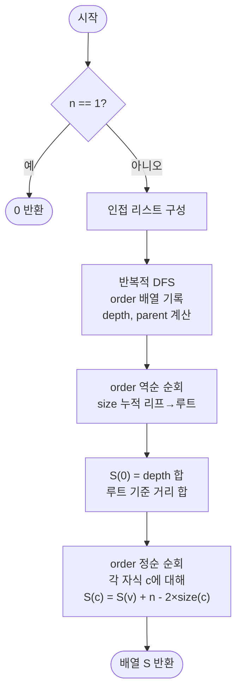

import { AlgorithmSimulation } from "#guide-sim";

# treeRerooting — 루트를 옮기면 정확히 얼마나 가까워지고 멀어지는지 세면 O(n)에 끝나는 이유

## 한눈에 보는 컨셉

트리에서 각 정점을 루트로 놓았을 때 다른 모든 정점까지의 거리 합을 한꺼번에 구하는 문제예요. 정점마다 독립적으로 BFS를 돌리면 `O(n^2)`이 걸리지만, 루트를 이웃 정점으로 한 칸 옮길 때 거리 합이 정확히 얼마나 바뀌는지 계산하면 그 변화량만 전파해서 전체를 `O(n)`에 구할 수 있습니다. 핵심 관찰은 "루트가 $r$에서 이웃 $c$로 옮겨가면, $c$의 서브트리 안 정점들은 모두 1칸씩 가까워지고 바깥 정점들은 모두 1칸씩 멀어진다"는 것입니다.

## 출발점: 가장 순진한 방법부터

문제를 먼저 정확히 잡을게요.

```ts
function treeRerooting(n: number, edges: [number, number][]): number[]
```

- `n` — 정점 수, $1 \leq n \leq 10^5$
- `edges` — 무방향 간선 목록. 길이 $n-1$, 모든 간선의 가중치는 1이고 그래프는 사이클 없는 연결 트리
- 반환 — 길이 $n$인 배열. `result[v]`는 정점 $v$에서 다른 모든 정점까지의 거리 합 $S(v) = \sum_{u \in V} d(v, u)$

엣지케이스로 정점이 1개(`n = 1`)면 다른 정점이 없으니 `[0]`, 정점이 2개면 서로 거리 1이니 `[1, 1]`입니다.

가장 정직한 방법은 정점마다 BFS를 돌려서 다른 모든 정점까지의 거리를 구하고 더하는 겁니다.

```text
정점마다:  BFS로 depth 배열을 채운다   →   depth 합이 그 정점의 답
비용:      정점당 O(n)  ×  n개  =  O(n^2)      n = 10^5이면 10^10 → 시간 초과
```

코드로 그대로 옮기면 이렇습니다.

```ts
function treeRerootingNaive(n: number, edges: [number, number][]): number[] {
  const adj: number[][] = Array.from({ length: n }, () => []);
  for (const [u, v] of edges) { adj[u].push(v); adj[v].push(u); }

  return Array.from({ length: n }, (_, start) => {
    const dist = new Array<number>(n).fill(-1);
    dist[start] = 0;
    const queue = [start];
    for (let qi = 0; qi < queue.length; qi++) {
      const v = queue[qi];
      for (const u of adj[v]) {
        if (dist[u] === -1) { dist[u] = dist[v] + 1; queue.push(u); }
      }
    }
    return dist.reduce((sum, d) => sum + d, 0); // 정점마다 O(n) BFS를 처음부터 새로 돈다
  });
}
```

왜 느린가: 정점마다 트리 전체를 처음부터 다시 BFS로 훑으므로, 정점당 `O(n)`이 `n`번 반복되어 총 `O(n^2)`입니다.

그런데 나열해 보면 낌새가 하나 보여요. 체인 `0-1-2-3-4`에서 BFS를 세 번 따로 돌려 보면 이렇습니다.

```text
BFS(0): depth = [0, 1, 2, 3, 4]   합 = 10
BFS(1): depth = [1, 0, 1, 2, 3]   합 = 7    ← 정점 2,3,4까지 거리는 BFS(0)과 겹치는 구조
BFS(2): depth = [2, 1, 0, 1, 2]   합 = 6

세 번 다 처음부터 다시 재는 대신, "루트를 옮기면 거리 합이 정확히 얼마나 바뀌는지"만 알면 되지 않을까?
```

이것이 이번 알고리즘의 출발 단서입니다.

## 아이디어 자세히 들여다보기

### 이웃으로 루트를 한 칸 옮기면 무슨 일이 일어날까 — 수식과 그림

작은 트리로 감을 잡아 봅시다. `n = 5`, 간선은 `(0,1), (0,2), (1,3), (1,4)`입니다.

```text
        0
       / \
      1   2
     / \
    3   4
```

**부분 트리 크기** $\text{size}(v)$: 정점 $v$를 루트로 하는 서브트리에 속한 정점 수(자신 포함)입니다.

$$\text{size}(v) = 1 + \sum_{c \in \text{children}(v)} \text{size}(c)$$

**깊이** $\text{depth}(v)$: 고정된 기준 루트(정점 0)에서 $v$까지의 거리입니다.

**거리 합** $S(v) = \sum_{u \in V} d(v, u)$: $v$를 루트로 삼았을 때 우리가 구해야 하는 답입니다.

위 트리에 값을 채워 보면 이렇습니다.

```text
        0   size=5, depth=0
       / \
      1   2      size(1)=3, depth(1)=1     size(2)=1, depth(2)=1
     / \
    3   4         size(3)=1, depth(3)=2    size(4)=1, depth(4)=2

depth 합 = 0+1+1+2+2 = 6  →  S(0) = 6
```

루트 0에서의 답 $S(0) = 6$은 depth 배열을 한 번 더하기만 하면 나옵니다 — DFS 한 번(`O(n)`)으로 끝나요. 문제는 나머지 네 정점의 답을 각각 새로 BFS하지 않고 구하는 방법입니다.

잠깐, 확인 질문 하나만 해 볼까요? 루트를 0에서 2로 옮기면, 정점이 몇 개나 가까워지고 몇 개나 멀어질까요? 정점 2의 서브트리는 자기 자신 1개뿐이니, 1개는 1칸 가까워지고 나머지 4개는 1칸 멀어집니다. 따라서 $S(2) = 6 - 1 + 4 = 9$입니다.

이걸 일반화하면 다음 관찰이 나옵니다.

**관찰**: 루트를 $r$에서 이웃 $c$($r$의 자식)로 옮기면, $c$의 서브트리 안 $\text{size}(c)$개 정점은 1칸씩 가까워지고, 나머지 $n - \text{size}(c)$개 정점은 1칸씩 멀어집니다.

$$S(c) = S(r) - \text{size}(c) + (n - \text{size}(c)) = S(r) + (n - 2 \times \text{size}(c))$$

**유도**: 모든 $u \in V$를 두 그룹으로 나눕니다.

- 그룹 A ($u \in \text{subtree}(c)$, $\text{size}(c)$개): $r$ 기준으로 $d(r, u) = d(r, c) + d(c, u) = 1 + d(c, u)$이므로 $d(c, u) = d(r, u) - 1$.
- 그룹 B ($u \notin \text{subtree}(c)$, $n - \text{size}(c)$개): $c$ 기준으로 $d(c, u) = d(c, r) + d(r, u) = 1 + d(r, u)$.

$$S(c) = \sum_{u \in A}(d(r,u) - 1) + \sum_{u \in B}(d(r,u) + 1) = \sum_{u \in V} d(r, u) - \text{size}(c) + (n - \text{size}(c)) = S(r) + n - 2\times\text{size}(c)$$

실제로 확인해 보면, $S(1) = S(0) + (5 - 2 \times \text{size}(1)) = 6 + (5 - 6) = 5$이고, $S(3) = S(1) + (5 - 2 \times \text{size}(3)) = 5 + (5-2) = 8$입니다. 뒤에서 코드로 실행한 값과 정확히 일치하는지 다시 확인할게요.

이 정의가 "고정된 기준 루트(0) 기준" size여야 하는 이유도 짚고 갈게요. 점화식은 "루트를 $r$에서 $c$로 옮길 때 이동하는 정점 수"를 $\text{size}(c)$로 세는데, 이 값이 정확하려면 $c$가 매 순간의 루트일 때가 아니라 **처음부터 고정한 기준 루트에서 본 서브트리 크기**여야 합니다. 만약 "현재 루트 기준"으로 size를 매번 다시 재는 정의를 쓰면, size 자체가 루트가 바뀔 때마다 다시 계산돼야 해서 애초에 $O(n)$ 전파가 성립하지 않습니다.

| 상태 변수 | 의미 |
|-----------|------|
| `size[v]` | 기준 루트(정점 0) 기준으로 $v$의 서브트리 크기 |
| `depth[v]` | 기준 루트 0에서 $v$까지의 거리 |
| `parent[v]` | 기준 루트 0 기준 $v$의 부모 |
| `S[v]` | $v$를 루트로 했을 때 모든 정점까지의 거리 합 |

### 왜 모순 없이 작동하는가

정당성은 귀납으로 보입니다.

**기저**: $S(0)$은 DFS 한 번으로 모든 정점의 `depth`를 더해 직접 계산합니다. $\text{depth}(v) = d(0, v)$로 정의했으므로, 이 합은 정의 그대로 $S(0) = \sum_{v} d(0,v)$와 정확히 일치합니다.

**귀납 단계**: 정점 $v$의 부모 $p$에 대해 $S(p)$가 이미 정확하다고 가정합니다(귀납 가정). 이때 위에서 유도한 점화식 $S(v) = S(p) + (n - 2 \times \text{size}(v))$을 적용합니다.

- **경우의 완전성**: 트리이므로 모든 정점 $u$는 $\text{subtree}(v)$ 안에 있거나(그룹 A) 바깥에 있거나(그룹 B) 정확히 둘 중 하나이며, 두 그룹은 겹치지 않습니다 — 트리의 경로가 유일하기 때문에 "$v$를 거쳐야 $p$ 반대쪽에 닿는 정점"과 "$v$를 거치지 않는 정점"은 명확히 나뉩니다.
- **각 경우의 정확성**: 그룹 A의 $u$는 $p \to v$가 최단 경로 위에 있으므로 $d(v,u) = d(p,u) - 1$이 항상 성립하고, 그룹 B의 $u$는 $d(v,u) = d(p,u) + 1$이 항상 성립합니다. 둘 다 트리의 경로 유일성에서 바로 나옵니다.

따라서 $S(v) = S(p) + (n - 2 \times \text{size}(v))$는 모든 $v$에 대해 정확합니다. 처리 순서를 루트 → 리프 방향(부모가 자식보다 먼저)으로 두면 귀납 가정("부모의 $S$는 이미 계산됨")이 항상 만족되므로, 모든 정점이 순서대로 정확한 값을 얻습니다.

**여기서 헷갈리기 쉬운 포인트는 처리 순서입니다.** 점화식은 항상 "부모의 $S$"를 참조하므로, 자식을 부모보다 먼저 계산하면 아직 확정되지 않은 초기값을 참조하는 조용한 오류가 생깁니다. 순서를 거꾸로(리프 → 루트 방향) 돌리면 어떻게 되는지 체인 `n=5`(`0-1-2-3-4`)로 실제 확인해 봅시다.

```text
정답(부모 먼저 처리):     S = [10, 7, 6, 7, 10]
오답(순서를 거꾸로 처리): S = [10, 7, -1, 1, 3]
                                     ^^ 거리 합이 음수?! 명백히 틀렸다는 신호
```

순서를 거꾸로 돌리면 정점 3을 처리하는 시점에 3 자신의 최종값 $S(3) = 7$은 아직 계산되지 않은 채(초기값 0인 상태)로 자식 $S(4)$를 구하는 데 쓰입니다. 실제로 그 시점의 $S[3] = 0$이므로 $S(4) = 0 + (5 - 2\times1) = 3$(정답 10과 다름)이 되고, 이 오류가 뒤로 계속 전파되어 $S(2)$까지 음수(-1)로 무너집니다.

엣지 케이스도 점화식 위에서 확인해 둘게요.

```text
n = 1                 → 점화식 적용 없이 [0] 바로 반환
n = 2 (간선 0-1)       → S(0) = depth 합 = 0+1 = 1
                         S(1) = S(0) + (2 - 2×size(1)) = 1 + (2-2) = 1
                         → [1, 1]
```

## 아이디어를 코드로 옮기기

```ts
function treeRerooting(n: number, edges: [number, number][]): number[] {
  if (n === 1) return [0];

  const adj: number[][] = Array.from({ length: n }, () => []);
  for (const [u, v] of edges) {
    adj[u].push(v);
    adj[v].push(u);
  }

  const parent = new Int32Array(n).fill(-1);
  const depth = new Int32Array(n);
  const size = new Int32Array(n).fill(1);
  const order: number[] = [];

  // DFS 1 (반복형): 방문 순서, depth, parent 계산
  const visited = new Uint8Array(n);
  const stack: number[] = [0];
  visited[0] = 1;
  while (stack.length > 0) {
    const v = stack.pop()!;
    order.push(v);
    for (const u of adj[v]) {
      if (!visited[u]) {
        visited[u] = 1;
        parent[u] = v;
        depth[u] = depth[v] + 1;
        stack.push(u);
      }
    }
  }

  // order 역순: size를 리프 → 루트로 누적 (자식이 부모보다 먼저 처리돼야 함)
  for (let i = order.length - 1; i >= 0; i--) {
    const v = order[i];
    if (parent[v] !== -1) size[parent[v]] += size[v];
  }

  const S = new Array<number>(n).fill(0);
  for (let v = 0; v < n; v++) S[0] += depth[v];

  // order 정순: 루트 → 리프 방향으로 점화식 전파 (부모가 자식보다 먼저 처리돼야 함)
  for (const v of order) {
    for (const c of adj[v]) {
      if (c !== parent[v]) {
        S[c] = S[v] + (n - 2 * size[c]);
      }
    }
  }

  return S;
}
```

DFS를 재귀 대신 배열 스택으로 반복 구현한 이유부터 짚을게요. `n`이 최대 `10^5`인 체인 형태 트리라면 재귀 DFS는 호출 스택 깊이가 `10^5`까지 쌓여 스택 오버플로우 위험이 있습니다. 배열 기반 스택으로 반복 구현하면 이 위험이 없습니다.

**가장 실수가 잦은 부분은 두 번째 루프(size 누적)와 세 번째 루프(S 전파)의 순회 방향이 정반대라는 점입니다.** size 누적은 `order`를 거꾸로(자식이 부모보다 먼저 처리되어야 부모에게 정확한 합을 더할 수 있음), S 전파는 `order`를 그대로(부모가 자식보다 먼저 처리되어야 점화식이 참조할 부모의 값이 이미 확정돼 있음) 돕니다. 둘을 헷갈리면 앞서 본 `[10, 7, -1, 1, 3]` 같은 오답이 조용히 나옵니다. `if (c !== parent[v])`는 부모 방향으로 되짚어 가는 것을 막는 가드입니다 — 이게 없으면 무한히 부모·자식을 왕복하며 점화식을 잘못 덮어씁니다.

더 나아갈 여지가 있을까요? 정점 수 `n`개의 답을 모두 채워야 하므로 출력 자체가 이미 `Θ(n)`이라, 이 문제의 이론적 하한도 `Ω(n)`입니다. naive `O(n^2)`에서 Rerooting `O(n)`으로 가는 한 번의 도약이 이 문제의 전부이고, DFS 2회(`O(n)`)로 이미 그 하한에 닿아 있어서 더 줄일 여지가 없습니다. 그래서 이 가이드에는 "더 빠르게 만들 단서 찾기" 이후의 추가 최적화 절이 없습니다 — 위 코드가 이미 최종 구현입니다.

## 실행 시각화

선형 체인 트리 `n = 5`, `edges = [[0,1], [1,2], [2,3], [3,4]]`에 대해 Rerooting으로 각 정점의 거리 합을 구하는 과정입니다. 트리 패널(루트 0으로 그림)의 색은 현재 점화식 적용 대상(active=값을 막 확정한 정점, visited=이미 확정된 정점)이고, keyValue 패널은 `size` 배열과 `S` 배열의 스냅샷입니다. 실제 반환값은 `[10, 7, 6, 7, 10]`이며(위 코드를 직접 실행해 확인한 값입니다), 시뮬레이션 마지막 프레임의 `S` 배열과 일치합니다.

> 대화형 시뮬레이션은 MDX 런타임에서 표시됩니다.

export const chain = (s) => ({
  id: 0, label: "0", status: s[0],
  children: [{ id: 1, label: "1", status: s[1],
    children: [{ id: 2, label: "2", status: s[2],
      children: [{ id: 3, label: "3", status: s[3],
        children: [{ id: 4, label: "4", status: s[4] }],
      }],
    }],
  }],
});

export const none = { 0: "default", 1: "default", 2: "default", 3: "default", 4: "default" };

export const steps = [
  {
    title: "DFS1: depth, order",
    detail: "루트 0 기준 DFS. depth=[0,1,2,3,4], order=[0,1,2,3,4].",
    root: chain({ ...none, 0: "active" }),
    entries: [
      { label: "depth", value: "[0, 1, 2, 3, 4]" },
      { label: "order", value: "[0, 1, 2, 3, 4]" },
    ],
  },
  {
    title: "역순 누적: size",
    detail: "order 역순으로 size 누적(리프→루트). size=[5,4,3,2,1].",
    root: chain({ ...none, 0: "visited" }),
    entries: [
      { label: "size", value: "[5, 4, 3, 2, 1]" },
      { label: "S[0] = sum(depth)", value: "0+1+2+3+4 = 10" },
    ],
  },
  {
    title: "Rerooting v=0 → 자식 1",
    detail: "S[1] = S[0] + (n - 2·size[1]) = 10 + (5 - 8) = 7.",
    root: chain({ ...none, 0: "visited", 1: "active" }),
    entries: [
      { label: "n - 2·size[1]", value: "5 - 8 = -3" },
      { label: "S", value: "[10, 7, ?, ?, ?]" },
    ],
  },
  {
    title: "Rerooting v=1 → 자식 2",
    detail: "S[2] = S[1] + (5 - 2·3) = 7 + (-1) = 6.",
    root: chain({ ...none, 0: "visited", 1: "visited", 2: "active" }),
    entries: [
      { label: "n - 2·size[2]", value: "5 - 6 = -1" },
      { label: "S", value: "[10, 7, 6, ?, ?]" },
    ],
  },
  {
    title: "Rerooting v=2 → 자식 3",
    detail: "S[3] = S[2] + (5 - 2·2) = 6 + 1 = 7.",
    root: chain({ ...none, 0: "visited", 1: "visited", 2: "visited", 3: "active" }),
    entries: [
      { label: "n - 2·size[3]", value: "5 - 4 = +1" },
      { label: "S", value: "[10, 7, 6, 7, ?]" },
    ],
  },
  {
    title: "Rerooting v=3 → 자식 4",
    detail: "S[4] = S[3] + (5 - 2·1) = 7 + 3 = 10.",
    root: chain({ ...none, 0: "visited", 1: "visited", 2: "visited", 3: "visited", 4: "active" }),
    entries: [
      { label: "n - 2·size[4]", value: "5 - 2 = +3" },
      { label: "S", value: "[10, 7, 6, 7, 10]" },
    ],
  },
  {
    title: "완료: S = [10, 7, 6, 7, 10]",
    detail: "모든 정점 전파 완료. 양 끝(0, 4)이 최댓값 10, 중앙(2)이 최솟값 6.",
    root: chain({ 0: "visited", 1: "visited", 2: "visited", 3: "visited", 4: "visited" }),
    entries: [
      { label: "S (반환)", value: "[10, 7, 6, 7, 10]" },
    ],
  },
];

<AlgorithmSimulation view={["tree", "keyValue"]} steps={steps} title="Tree Rerooting: 거리 합" />

## 흐름 한눈에 보기



## 스스로 점검하기

1. 별 모양 트리 `n = 5`(정점 0이 중심, 1~4가 리프)에서 `size(1)`부터 손으로 구하고, $S(0)$과 $S(1)$을 점화식으로 계산해 보세요. (힌트: $S(0) = 4$, $\text{size}(1) = 1$이므로 $S(1) = S(0) + (5 - 2\times1) = 4 + 3 = 7$입니다.)
2. 본문에서 처리 순서를 거꾸로 돌렸더니 `S = [10, 7, -1, 1, 3]`이 나왔습니다. 정점 3을 처리하는 순간 구체적으로 어떤 값이 아직 확정되지 않은 상태였는지, 그 오류가 정점 2까지 어떻게 전파되어 음수가 나오는지 단계별로 짚어 보세요.
3. 만약 간선마다 가중치가 있다면(모두 1이 아니라 임의의 양의 정수라면), 점화식의 `size(c)` 자리에 무엇을 넣어야 같은 구조의 전파가 성립할지 생각해 보세요. (힌트: 서브트리 안 정점의 "개수" 대신, 루트가 옮겨갈 때 각 정점이 실제로 가까워지거나 멀어지는 "가중치 합"을 반영해야 합니다.)
