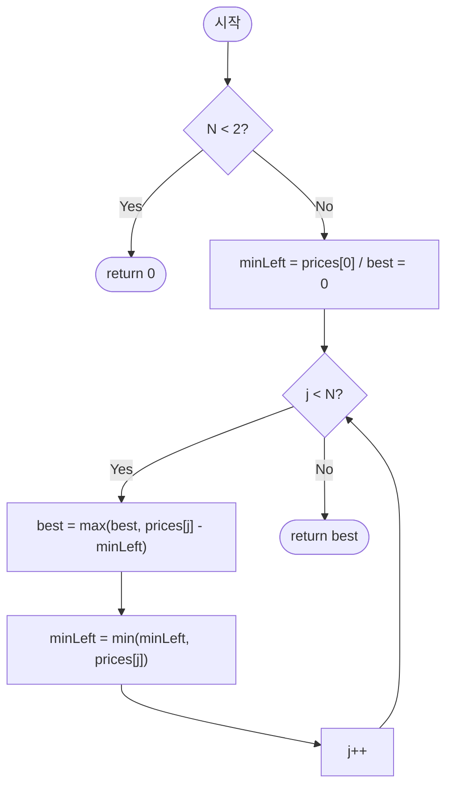

# bestTimeToBuyAndSellStock — 주식 매매 최대 이익 (1회 거래)

## 성능 목표 예측

| 항목 | 값 |
|------|-----|
| 입력 크기 | $1 \leq N \leq 100{,}000$ |
| 가격 범위 | $0 \leq prices[i] \leq 10{,}000$ |
| 거래 횟수 | 최대 1회 |

**naive 접근의 문제점**: 매수일 $i$와 매도일 $j$ $(i \leq j)$ 의 모든 조합을 시도하면 $O(N^2)$ 이다. $N = 10^5$ 일 때 $10^{10}$ 연산으로 시간 초과가 발생한다.

**목표 복잡도**: 시간 $O(N)$, 공간 $O(1)$. 배열을 한 번만 순회하면 충분하다는 것이 핵심이다.

**공간 복잡도**: 변수 두 개(`minLeft`, `best`)만 유지하므로 $O(1)$이다.

---

## 목표 함수

```ts
function bestTimeToBuyAndSellStock(prices: number[]): number
```

| 파라미터 | 의미 | 제약 |
|----------|------|------|
| `prices` | 날짜별 주식 가격 배열 | $1 \leq N \leq 100{,}000$, $0 \leq prices[i] \leq 10{,}000$ |

**반환값**: 한 번의 매수·매도로 얻을 수 있는 최대 이익. 거래하지 않는 경우 $0$.

**엣지케이스**:

| 입력 | 기대 출력 | 이유 |
|------|-----------|------|
| `[]` | `0` | 거래 불가 |
| `[5]` | `0` | 매도 가능한 날이 없음 |
| `[5, 4, 3, 2, 1]` | `0` | 단조 감소 — 어떤 조합도 이익 음수 |
| `[1, 10000]` | `9999` | 최대 이익 경계값 |

---

## 핵심 아이디어

**핵심 아이디어**: "오늘 팔 때의 최대 이익은 오늘 가격에서 지금까지의 최저 매수가를 빼면 구한다."

배열을 한 번만 왼쪽에서 오른쪽으로 순회하면서, 지금까지 본 최저 가격과 그 최저가로 매수했을 때 오늘 팔면 얻는 이익을 동시에 관리한다. 이 두 변수만 유지하면 모든 날짜 조합을 열거하지 않아도 최적 거래를 찾을 수 있다.

**풀이 구조**
1. `minLeft = prices[0]`, `best = 0`으로 초기화한다.
2. 각 날짜 `j`에 대해 `best = max(best, prices[j] - minLeft)`로 이익을 갱신한다.
3. `minLeft = min(minLeft, prices[j])`로 좌측 최솟값을 갱신한다.
4. 순회 종료 후 `best`를 반환한다.

**조건**: 최대 1회 거래만 허용. 매수 후 매도 순서 보장 (`i ≤ j`).

**대표 예시**: `prices = [7, 1, 5, 3, 6, 4]`
1일에 매수(가격 1), 5일에 매도(가격 6)하면 이익 5가 최대다. 순회 중 `minLeft`가 1로 갱신된 시점부터 이후 모든 가격에서 차익을 계산해 `best = 5`를 찾는다.

**언제 쓰나**
"지금까지의 최솟값(또는 최댓값)을 유지하면서 현재 값과의 차이를 구하는" 패턴의 문제에서 사용한다. 단방향 순회로 O(N)에 풀리며, 두 포인터가 필요 없다.

---

### 원형 아이디어와 naive 접근

가장 단순한 접근: 모든 매수일 $i$와 매도일 $j$ $(i \leq j)$ 조합을 열거한다.

```
for i in 0..N-1:
    for j in i..N-1:
        best = max(best, prices[j] - prices[i])
```

$N = 10^5$ 이면 조합이 $\approx 5 \times 10^9$ 개여서 시간 초과가 발생한다.

### 어떤 관찰이 돌파구가 되는가

- **관찰 1**: $j$ 일에 팔 때, 최적 매수일은 항상 $j$ 이전 중 가격이 가장 낮은 날이다. $i_* = \arg\min_{0 \leq i \leq j} prices[i]$.
- **관찰 2**: $j$가 왼쪽에서 오른쪽으로 증가할 때, $\min_{0 \leq i \leq j} prices[i]$ 는 이전 최솟값과 $prices[j]$ 중 작은 값으로 $O(1)$ 갱신할 수 있다.
- **관찰 3**: 두 값(현재까지의 최솟값, 현재까지의 최대 이익)만 유지하면 $O(1)$ 공간으로 해결된다.

### 관찰을 형식화: 상태/구조 정의

다음 두 변수를 유지한다.

$$minLeft_j = \min_{0 \leq i \leq j} prices[i]$$

$$best_j = \max_{0 \leq k \leq j} \bigl(prices[k] - minLeft_k\bigr)$$

$j$가 1씩 증가할 때 두 변수는 모두 상수 시간에 갱신된다. 배열 전체를 저장할 필요가 없으므로 공간은 $O(1)$이다.

다른 정의(예: 우측에서 최댓값을 추적하는 방식)도 동일한 복잡도를 줄 수 있지만, 좌측 최솟값 방식이 단방향 순회 한 번으로 끝나므로 캐시 효율이 가장 좋다.

### 점화식 또는 핵심 연산

각 $j = 1, 2, \ldots, N-1$ 에 대해:

$$minLeft \leftarrow \min(minLeft, prices[j])$$

$$best \leftarrow \max(best, \; prices[j] - minLeft)$$

- 첫 번째 식: $j$일 포함 좌측 최솟값을 갱신한다. 이것이 $j$일에 팔 때 고를 수 있는 최적 매수가다.
- 두 번째 식: $j$일을 매도일로 삼았을 때의 이익을 계산하고, 전역 최대 이익과 비교한다.

초기 조건: $minLeft = prices[0]$, $best = 0$.

### 정당성 — 왜 이것이 옳은가

귀납적으로 증명한다. $j-1$ 까지 순회를 마쳤을 때 $minLeft = \min(prices[0..j-1])$, $best = \max_{k \leq j-1}(prices[k] - minLeft_k)$ 가 성립한다고 가정한다.

$j$ 단계에서 $minLeft$ 를 갱신하면 $minLeft = \min(prices[0..j])$ 가 되고, 이를 이용해 이익을 계산하면 $j$일 매도 시 최대 이익을 구할 수 있다. 이를 $best$와 비교하므로 루프 후 $best = \max_{k \leq j}(prices[k] - minLeft_k)$ 이 성립한다.

가격이 단조 감소하는 경우: $prices[j] - minLeft$ 는 항상 $\leq 0$ 이고 $best$ 는 초기값 $0$에서 갱신되지 않으므로 올바르게 $0$을 반환한다. 단일 원소 배열은 루프 자체가 실행되지 않아 $0$을 반환한다.

### 구현 디테일과 최적화

- `best` 갱신과 `minLeft` 갱신 **순서를 바꾸면 안 된다**. `minLeft` 를 먼저 갱신한 뒤 이익을 계산하면, 같은 날 사고 파는 이익 $0$이 포함되어 결과에 영향이 없으나, 의미상 "현재 날의 가격으로 사서 같은 날 팔기"를 허용하게 된다. 문제 제약상 $i \leq j$ 이므로 같은 날 거래는 허용되지만, 이익은 $0$이므로 결과 자체는 동일하다. 그러나 논리 명확성을 위해 기존 코드처럼 이익 계산 후 `minLeft` 갱신을 권장한다.
- 이익이 음수일 수 없으므로 `best = 0` 초기화는 "거래 안 함" 케이스를 자연스럽게 처리한다.
- `prices.length < 2` 조기 반환은 단일 원소 배열에서 루프 진입을 막아 명시적으로 $0$을 반환한다.

---

## 수도 코드와 Activity Diagram

### 의사코드

```
function bestTimeToBuyAndSellStock(prices):
    if len(prices) < 2: return 0

    minLeft ← prices[0]       // 불변식: prices[0..j-1] 의 최솟값
    best    ← 0               // 불변식: 지금까지 본 최대 이익 (≥ 0)

    for j from 1 to N-1:
        best    ← max(best, prices[j] - minLeft)   // j 일 매도 시 이익 계산
        minLeft ← min(minLeft, prices[j])           // j 포함 좌측 최솟값 갱신

    return best
```

### Activity Diagram



**핵심 불변식**: 루프 변수 $j$ 진입 시점에 `minLeft` $= \min(prices[0..j-1])$, `best` $= \max_{k < j}(prices[k] - minLeft_k)$ 이며, 루프 종료 후 `best` $\geq 0$ 이 보장된다.

---

## 복잡도 분석 심화

| 접근 방식 | 시간 | 공간 | 비고 |
|-----------|------|------|------|
| 이중 루프 (naive) | $O(N^2)$ | $O(1)$ | $N=10^5$에서 불가 |
| 좌측 최솟값 추적 | $O(N)$ | $O(1)$ | 최적 |
| 분할 정복 | $O(N \log N)$ | $O(\log N)$ | 실용성 낮음 |

**변형 1 — 최저 매수가와 매수일 추적**: `minLeft` 갱신 시 `minLeftIdx`도 갱신한다. `best` 갱신 시 `bestBuyIdx = minLeftIdx`, `bestSellIdx = j`를 기록해 실제 날짜를 복원할 수 있다.

**변형 2 — 2회 거래 (k=2)**: 앞에서 뒤로 순회하며 각 날짜까지의 최대 1회 이익 `left[j]`를 계산하고, 뒤에서 앞으로 순회하며 각 날짜부터의 최대 1회 이익 `right[j]`를 계산한다. 최적 분할점 $j$에서 $left[j] + right[j+1]$의 최댓값이 답이다. 시간 $O(N)$, 공간 $O(N)$.

**변형 3 — 수수료 포함 무제한 거래**: 매도 시 수수료 $fee$가 있으면, 매도 이익에서 $fee$를 차감한다. 이를 Kadane 형태로 처리해 $O(N)$에 해결할 수 있다.
