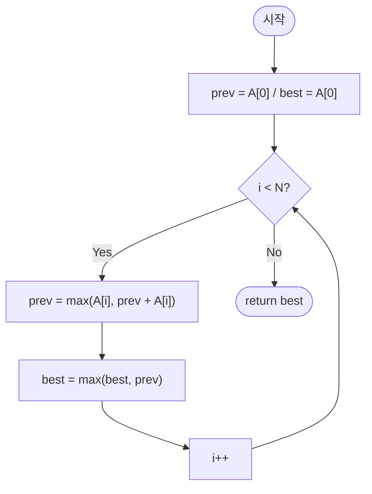

# kadane — 최대 부분합 (Maximum Slice)

## 성능 목표 예측

| 항목 | 값 |
|------|-----|
| 입력 크기 | $1 \leq N \leq 100{,}000$ |
| 원소 범위 | $-10{,}000 \leq A[i] \leq 10{,}000$ |

**naive 접근의 문제점**: 가능한 모든 연속 부분 배열의 합을 계산하면 $O(N^2)$ 또는 $O(N^3)$이다. $N = 10^5$에서 $O(N^2) = 10^{10}$으로 시간 초과가 발생한다.

**목표 복잡도**: 시간 $O(N)$, 공간 $O(1)$. 배열을 한 번만 순회해 $O(N)$에 해결할 수 있다.

**공간 복잡도**: DP 배열을 저장하지 않고 이전 값과 전역 최댓값 두 변수만 유지하면 $O(1)$이다.

---

## 목표 함수

```ts
function kadane(A: number[]): number
```

| 파라미터 | 의미 | 제약 |
|----------|------|------|
| `A` | 정수 배열 | $1 \leq N \leq 100{,}000$, $-10{,}000 \leq A[i] \leq 10{,}000$ |

**반환값**: 연속된 부분 배열의 합의 최댓값. 최소 길이 1이므로 항상 배열의 어떤 원소 이상이다.

**엣지케이스**:

| 입력 | 기대 출력 | 이유 |
|------|-----------|------|
| `[-3, -1, -2]` | `-1` | 모두 음수 — 가장 큰 원소 하나가 최선 |
| `[1]` | `1` | 단일 원소 |
| `[0, 0, 0]` | `0` | 합이 0인 부분 배열 |
| `[-10000, 10000, -10000]` | `10000` | 양수 하나가 최선 |

---

## 핵심 아이디어

**핵심 아이디어**: "현재 위치에서 끝나는 최대합은 이전 최대합이 양수면 이어받고, 음수면 버리고 새로 시작하면 된다."

연속 부분 배열의 최대합을 구할 때, 이전 구간의 합이 음수라면 그것을 이어받는 것보다 현재 원소 하나로 새로 시작하는 편이 항상 유리하다. 이 단순한 관찰 하나로 O(N²) 탐색을 O(N) 단일 순회로 줄일 수 있다.

**풀이 구조**
1. `prev = A[0]`, `best = A[0]`으로 초기화한다.
2. i=1..N-1에 대해 `prev = max(A[i], prev + A[i])`로 현재 위치에서 끝나는 최대합을 갱신한다.
3. `best = max(best, prev)`로 전역 최댓값을 추적한다.
4. `best`를 반환한다.

**조건**: 최소 길이 1인 연속 부분 배열을 반드시 선택해야 한다. 빈 배열(합 0)을 허용하는 변형이라면 `best = 0`으로 초기화한다.

**대표 예시**: `A=[-2,1,-3,4,-1,2,1,-5,4]`
순회하면서 `prev`가 -2 → 1 → -2 → 4 → 3 → 5 → 6 → 1 → 5로 변한다. `best = 6`이 답이며, 이는 구간 [3,6]의 합 4+(-1)+2+1=6이다.

**언제 쓰나**
연속 구간의 합을 최대화하거나, "지금까지의 누적이 마이너스이면 리셋"하는 패턴의 문제에서 사용한다. 최대 이익, 최대 점수 등 다양한 형태로 변형되어 자주 출제되는 기본 알고리즘이다.

---

### 원형 아이디어와 naive 접근

모든 시작점 $i$와 끝점 $j \geq i$를 열거한다.

```
best = A[0]
for i from 0 to N-1:
    s = 0
    for j from i to N-1:
        s += A[j]
        best = max(best, s)
```

$O(N^2)$ 으로 $N = 10^5$에서 $10^{10}$ 연산이 발생한다. 중복 계산의 원인은 시작점 $i$마다 누적합을 처음부터 다시 계산하는 것이다.

### 어떤 관찰이 돌파구가 되는가

- **관찰 1**: 위치 $i$에서 끝나는 최대합 부분 배열은 두 경우 중 하나다: $A[i]$ 하나로만 구성되거나, $i-1$에서 끝나는 최대합 부분 배열에 $A[i]$를 이어 붙이거나. 이전 결과를 재사용할 수 있다.
- **관찰 2**: $i-1$에서 끝나는 최대합이 음수라면, 그것을 이어받는 것보다 $A[i]$에서 새로 시작하는 편이 항상 유리하다. 반대로 양수라면 이어받는 편이 항상 유리하다.
- **관찰 3**: 따라서 "현재 위치에서 끝나는 최대합"은 $O(1)$에 갱신 가능하다. 전역 최댓값을 동시에 추적하면 $O(N)$ 전체 처리가 가능하다.

### 관찰을 형식화: 상태/구조 정의

상태 $dp[i]$를 다음과 같이 정의한다.

$$dp[i] = \text{위치 } i \text{에서 끝나는 연속 부분 배열의 합의 최댓값}$$

이 정의가 왜 이 형태여야 하는가: "끝 위치를 고정"하면 부분 문제들이 선형 순서로 배열되어 $dp[i]$가 $dp[i-1]$만 참조한다. "임의 구간의 최댓값"으로 정의하면 순환 의존성이 생겨 단일 순회로 해결이 불가능하다.

초기 조건: $dp[0] = A[0]$.

### 점화식 또는 핵심 연산

$i = 1, 2, \ldots, N-1$에 대해:

$$dp[i] = \max\bigl(A[i],\; dp[i-1] + A[i]\bigr)$$

결과:

$$\text{kadane}(A) = \max_{0 \leq i < N} dp[i]$$

- $A[i]$: 위치 $i$에서 새로운 부분 배열을 시작하는 경우
- $dp[i-1] + A[i]$: $i-1$에서 끝나는 최대합 부분 배열에 $A[i]$를 이어 붙이는 경우
- $\max$: $dp[i-1] < 0$이면 새로 시작하는 편이 유리하다는 것을 자동으로 처리한다

### 정당성 — 왜 이것이 옳은가

귀납적으로 증명한다. $dp[0] = A[0]$은 위치 $0$에서 끝나는 유일한 부분 배열이다.

귀납 가정: $dp[i-1]$이 위치 $i-1$에서 끝나는 부분 배열의 최대합이라고 가정한다. 위치 $i$에서 끝나는 임의의 부분 배열은 $A[l..i]$ $(0 \leq l \leq i)$ 꼴이다. $l = i$이면 $A[i]$가 합이고, $l < i$이면 $A[l..i-1]$에 $A[i]$를 이어 붙인 것이므로 그 합은 $A[i] + (\text{위치 } i-1 \text{ 에서 끝나는 어떤 부분 배열의 합})$이다. 위치 $i-1$에서 끝나는 최대합이 $dp[i-1]$이므로, 이 경우의 최댓값은 $dp[i-1] + A[i]$이다. 두 경우의 최댓값이 $dp[i]$이므로 귀납이 성립한다.

모두 음수인 케이스: $dp[i-1] < 0$이면 $dp[i-1] + A[i] < A[i]$이므로 $dp[i] = A[i]$가 된다. 즉, 최대합이 가장 큰 단일 원소가 된다.

### 구현 디테일과 최적화

- 롤링 변수: `prev = dp[i-1]`, `best = max(dp[0..i-1])`만 유지한다.
- 초기화: `prev = A[0]`, `best = A[0]`. `best = 0`으로 초기화하면 모두 음수인 배열에서 $0$을 반환하는 오류가 발생한다 (길이 0인 부분 배열을 허용하는 셈이다).
- **함정**: 최소 길이 1 제약을 지키려면 `best`를 `A[0]`으로 초기화해야 한다. `0`으로 초기화하면 빈 부분 배열(이익 $0$)을 최적해로 잘못 반환할 수 있다.
- **함정**: `prev = max(A[i], prev + A[i])`와 `best = max(best, prev)` 순서를 반드시 지켜야 한다. `best`를 먼저 갱신하면 아직 업데이트되지 않은 `prev` 값을 참조한다.
- `max(A[i], prev + A[i]) = A[i] + max(0, prev)`로 단순화할 수 있다.

---

## 수도 코드와 Activity Diagram

### 의사코드

```
function kadane(A):
    prev ← A[0]          // 불변식: dp[i-1] — 위치 i-1에서 끝나는 최대합
    best ← A[0]          // 불변식: max(dp[0..i-1]) — 지금까지의 전역 최대합

    for i from 1 to N-1:
        prev ← max(A[i], prev + A[i])   // dp[i]: 새 시작 vs 이어 붙이기
        best ← max(best, prev)           // 전역 최대 갱신

    return best
```

### Activity Diagram



**핵심 불변식**: 루프 변수 $i$ 진입 시점에 `prev` $= dp[i-1]$이고 `best` $= \max(dp[0], dp[1], \ldots, dp[i-1])$이며, 루프 종료 후 `best` $= \max_{0 \leq i < N} dp[i]$가 정답이다.

---

## 복잡도 분석 심화

| 접근 방식 | 시간 | 공간 | 비고 |
|-----------|------|------|------|
| naive (이중 루프) | $O(N^2)$ | $O(1)$ | $N=10^5$에서 불가 |
| Kadane (롤링 변수) | $O(N)$ | $O(1)$ | 최적 |
| divide & conquer | $O(N \log N)$ | $O(\log N)$ | 병렬화 가능, 실용성 낮음 |

**변형 1 — 최대합 부분 배열의 시작/끝 인덱스 복원**: `prev`가 갱신될 때 현재 구간의 시작 인덱스를 별도 변수 `start`로 관리한다. `prev = A[i]` (새로 시작)면 `start = i`, `prev = prev + A[i]` (이어 붙이기)면 `start` 유지. `best`가 갱신될 때 `best_start = start`, `best_end = i`를 기록한다.

**변형 2 — 모든 원소가 음수인 경우**: `best = A[0]`으로 초기화하면 자동으로 처리된다. "비어있는 부분 배열(합 $0$)"을 허용하는 문제라면 `best = 0`으로 초기화한다.

**변형 3 — 최대합 원형 부분 배열**: $A$를 원형으로 이어 붙인 경우. 일반 Kadane 결과와 "전체 합 $-$ 최소합 부분 배열(음의 Kadane)"의 최댓값을 취한다. 단, 전체가 음수인 경우 일반 Kadane 결과를 사용한다.
