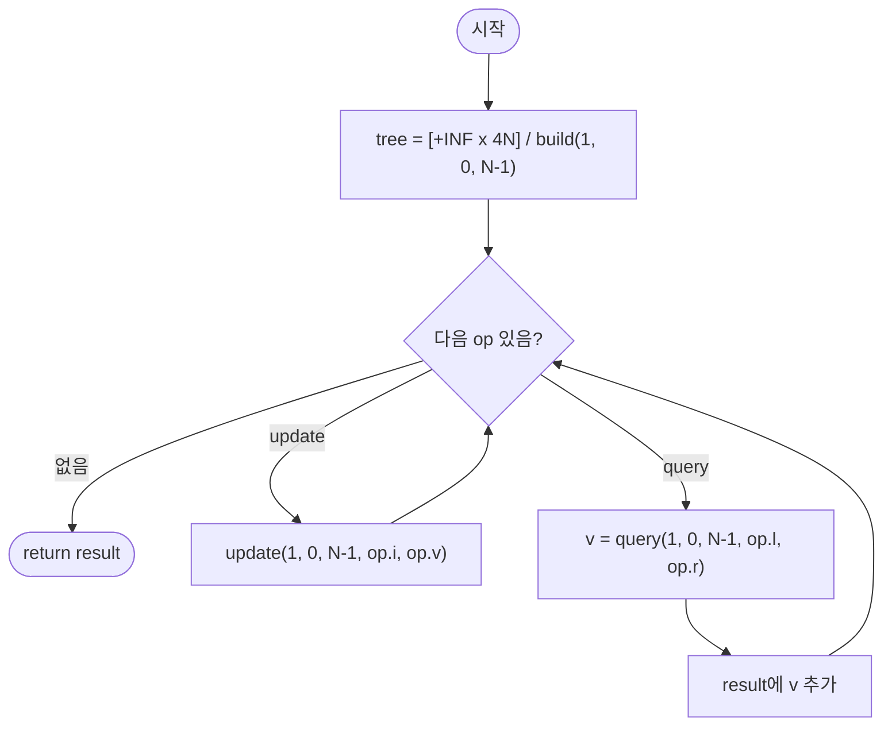

# segmentTreeRangeMin — 구간 최솟값 질의 (동적 갱신, Segment Tree)

## 성능 목표 예측

| 항목 | 값 |
|------|-----|
| 배열 길이 | $1 \leq N \leq 100{,}000$ |
| 연산 수 | $1 \leq Q \leq 100{,}000$ |
| 원소 범위 | $-10^9 \leq A[i], v \leq 10^9$ |

**naive 접근의 문제점**: 갱신은 $O(1)$이지만 질의는 $O(N)$이다. $Q$개의 질의에 전체 $O(NQ) = 10^{10}$으로 시간 초과가 발생한다. 정적 Sparse Table은 갱신 시 재계산에 $O(N \log N)$이 필요해 부적합하다.

**목표 복잡도**: 빌드 $O(N)$, 갱신 $O(\log N)$, 질의 $O(\log N)$, 전체 $O(N + Q \log N) \approx 1.7 \times 10^6$. 충분히 통과한다.

**공간 복잡도**: 트리 배열 $O(4N)$. 최악의 경우 완전 이진 트리 노드 수가 $4N-1$까지 커질 수 있다.

---

## 목표 함수

```ts
function segmentTreeRangeMin(A: number[], ops: SegOp[]): number[]

type SegOp =
  | { type: "update"; i: number; v: number }
  | { type: "query"; l: number; r: number }
```

| 파라미터 | 의미 | 제약 |
|----------|------|------|
| `A` | 초기 정수 배열 | $1 \leq N \leq 100{,}000$ |
| `ops` | 갱신/질의 연산 목록 | $1 \leq Q \leq 100{,}000$ |

**반환값**: `query` 연산 결과만 순서대로 담은 배열.

**엣지케이스**:

| 입력 | 기대 출력 | 이유 |
|------|-----------|------|
| ops에 query만 있음 | 초기 배열 기반 구간 최솟값 | 갱신 없음 |
| ops에 update만 있음 | `[]` | query가 없어 결과 없음 |
| `l == r`인 query | 단일 원소 | 길이 1 구간 |
| update 후 같은 구간 query | 갱신 반영된 최솟값 | 동적 갱신 정확성 |

---

## 핵심 아이디어

**핵심 아이디어**: "구간을 절반씩 분할하는 완전 이진 트리를 배열로 표현하면, 갱신과 구간 최솟값 질의를 모두 O(log N)에 처리할 수 있다."

세그먼트 트리는 각 노드가 담당 구간의 최솟값을 저장하는 완전 이진 트리다. 갱신 시에는 리프에서 루트까지 경로만 O(log N)번 재계산하고, 질의 시에는 목표 구간과 겹치지 않으면 즉시 중단하고 완전히 포함되면 저장값을 바로 반환해 O(log N)에 처리된다. 트리를 배열로 표현하면 노드 i의 자식이 2i, 2i+1이 되어 포인터 없이 구현된다.

**풀이 구조**
1. 크기 4N의 트리 배열을 만들고, `build(1, 0, N-1)`으로 초기화한다.
2. 각 갱신 (i, v): `update(1, 0, N-1, i, v)`를 호출해 리프를 수정하고 경로를 재계산한다.
3. 각 질의 (l, r): `query(1, 0, N-1, l, r)`으로 겹치지 않으면 +INF, 완전 포함이면 저장값, 부분 겹침이면 재귀 분할을 수행한다.
4. 질의 결과 배열을 반환한다.

**조건**: 점 갱신(단일 원소 변경)과 구간 최솟값 질의가 혼재하는 동적 환경. 구간 갱신이 필요하면 Lazy Propagation을 추가해야 한다.

**대표 예시**: `A=[1,3,2,7,9,11]`, `query(1,4)`
세그먼트 트리를 빌드하면 루트가 전체 최솟값 1을 저장한다. query(1,4)는 min(3,2,7,9)=2를 O(log N)에 반환한다.

**언제 쓰나**
동적 갱신이 있으면서 구간 최솟값(또는 최댓값, 합 등)을 반복 조회해야 하는 문제에서 사용한다. 정적 배열이면 Sparse Table이 더 빠르지만, 갱신이 있다면 세그먼트 트리가 표준 선택이다.

---

### 원형 아이디어와 naive 접근

배열 $A$를 그대로 유지하고, 질의마다 직접 최솟값을 탐색한다.

```
update(i, v): A[i] = v                              // O(1)
query(l, r):  return min(A[l], A[l+1], ..., A[r])  // O(N)
```

질의가 $O(N)$이므로 $Q$개에 $O(NQ) = 10^{10}$이 된다. 갱신이 있으므로 누적합(정적)이나 Sparse Table(재계산 비용 $O(N \log N)$)도 부적합하다.

### 어떤 관찰이 돌파구가 되는가

- **관찰 1**: 구간을 절반씩 분할하면 $O(\log N)$ 깊이의 트리가 만들어진다. 각 노드가 담당 구간의 최솟값을 저장하면, 질의를 $O(\log N)$번의 비교로 처리할 수 있다.
- **관찰 2**: 갱신 시 리프 노드에서 루트까지의 경로($O(\log N)$개 노드)만 재계산하면 된다. 영향 받지 않는 노드는 변경 불필요하다.
- **관찰 3**: 완전 이진 트리를 배열로 표현하면 노드 $node$의 자식이 $2 \times node$와 $2 \times node + 1$이다. 명시적 트리 구조 없이 배열만으로 구현된다.

### 관찰을 형식화: 상태/구조 정의

트리 배열 $tree$를 크기 $4N$으로 정의한다.

$$tree[node] = \min(A[s], A[s+1], \ldots, A[e]) \quad \text{(노드 } node \text{가 구간 } [s, e] \text{를 담당)}$$

트리 구조:
- 루트: $node = 1$, 담당 구간 $[0, N-1]$
- 노드 $node$의 왼쪽 자식: $2 \times node$, 담당 $[s, mid]$
- 노드 $node$의 오른쪽 자식: $2 \times node + 1$, 담당 $[mid+1, e]$
- 리프 ($s = e$): $tree[node] = A[s]$

이 정의가 왜 이 형태여야 하는가: 구간 최솟값 연산이 교환·결합 법칙을 만족하므로 분할 정복이 가능하다. "두 자식의 최솟값 = 부모의 최솟값"이 성립한다.

$$tree[node] = \min\bigl(tree[2 \cdot node],\; tree[2 \cdot node + 1]\bigr)$$

### 점화식 또는 핵심 연산

**빌드** (재귀, $O(N)$):

```
build(node, s, e):
    if s == e: tree[node] = A[s]; return
    mid = (s + e) / 2
    build(2*node, s, mid)
    build(2*node+1, mid+1, e)
    tree[node] = min(tree[2*node], tree[2*node+1])
```

**점 갱신** ($O(\log N)$):

```
update(node, s, e, i, v):
    if s == e: tree[node] = v; return
    mid = (s + e) / 2
    if i <= mid: update(2*node, s, mid, i, v)
    else:        update(2*node+1, mid+1, e, i, v)
    tree[node] = min(tree[2*node], tree[2*node+1])  // 내부 노드 재계산
```

**구간 질의** ($O(\log N)$):

```
query(node, s, e, l, r):
    if r < s or e < l: return +INF              // 겹치지 않음
    if l <= s and e <= r: return tree[node]     // 완전 포함
    mid = (s + e) / 2
    return min(query(2*node, s, mid, l, r),
               query(2*node+1, mid+1, e, l, r))
```

- 겹치지 않음: $+\infty$ 반환 (최솟값 계산에서 무시됨)
- 완전 포함: 저장된 최솟값 즉시 반환
- 부분 겹침: 분할 정복으로 재귀

### 정당성 — 왜 이것이 옳은가

귀납적으로 $tree[node]$가 해당 구간 $[s, e]$의 최솟값임을 증명한다.

빌드: 리프에서 $tree[node] = A[s]$는 단일 원소의 최솟값이다. 내부 노드에서 두 자식이 각각 $[s, mid]$와 $[mid+1, e]$의 최솟값이면, $\min$이 $[s, e]$의 최솟값이다. 귀납적으로 모든 노드가 올바르다.

갱신: 리프를 갱신한 후 루트까지 경로의 모든 내부 노드를 재계산한다. 경로 이외의 노드는 영향을 받지 않으므로 불변식이 유지된다.

질의: 담당 구간이 질의 구간과 겹치지 않으면 $+\infty$를 반환해 최솟값 계산에서 무시된다. 완전 포함이면 저장된 값을 반환한다. 부분 겹침이면 두 자식에서 재귀적으로 최솟값을 구한다. 이 세 경우가 완전하며 겹치지 않으므로 올바르다.

### 구현 디테일과 최적화

- **트리 크기**: $4N$으로 할당한다. $2N$으로 할당하면 일부 구성에서 인덱스가 범위를 초과한다.
- **INF 값**: 질의 반환의 초기값으로 `Number.MAX_SAFE_INTEGER` 또는 충분히 큰 값을 사용한다. $-10^9 \leq A[i] \leq 10^9$이므로 $10^{10}$이면 충분하다.
- **1-indexed 노드**: 루트가 $1$이어야 자식이 $2$와 $3$이 된다. $0$을 루트로 쓰면 자식이 $0$이 되어 무한 루프가 발생한다.
- **함정**: 갱신 후 내부 노드 재계산 (`tree[node] = min(...)`) 줄을 빠뜨리면 상위 노드가 갱신되지 않아 질의 오답이 발생한다.
- **함정**: 질의 겹치지 않음 조건 `r < s or e < l`을 잘못 쓰면 잘못된 구간을 포함하게 된다. 반드시 두 조건 모두 확인해야 한다.

---

## 수도 코드와 Activity Diagram

### 의사코드

```
function segmentTreeRangeMin(A, ops):
    N    ← len(A)
    tree ← 크기 4N의 +INF 배열         // 불변식: tree[node] = 담당 구간의 최솟값

    build(1, 0, N-1)                   // 트리 초기화
    result ← []

    for each op in ops:
        if op.type == "update":
            update(1, 0, N-1, op.i, op.v)
        else:
            result.push(query(1, 0, N-1, op.l, op.r))

    return result

build(node, s, e):
    if s == e: tree[node] ← A[s]; return
    mid ← (s + e) >> 1
    build(2*node, s, mid)
    build(2*node+1, mid+1, e)
    tree[node] ← min(tree[2*node], tree[2*node+1])    // 불변식 유지

update(node, s, e, i, v):
    if s == e: tree[node] ← v; return
    mid ← (s + e) >> 1
    if i <= mid: update(2*node, s, mid, i, v)
    else:        update(2*node+1, mid+1, e, i, v)
    tree[node] ← min(tree[2*node], tree[2*node+1])    // 불변식 유지: 상향 재계산

query(node, s, e, l, r):
    if r < s or e < l: return +INF                    // 겹치지 않음
    if l <= s and e <= r: return tree[node]            // 완전 포함
    mid ← (s + e) >> 1
    return min(query(2*node, s, mid, l, r),
               query(2*node+1, mid+1, e, l, r))
```

### Activity Diagram



**핵심 불변식**: 임의 시점에 $tree[node]$는 노드가 담당하는 구간 $[s, e]$의 정확한 최솟값이며, 갱신 후 경로 상의 모든 내부 노드가 즉시 재계산된다. 이 불변식이 깨지면 질의 결과가 잘못된다.
