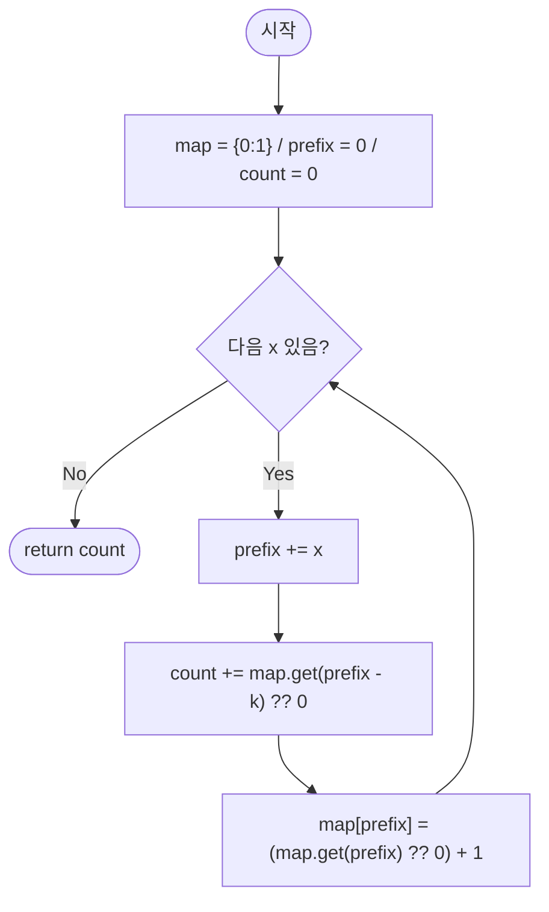

# subarraySumEqualsK — 부분합이 K인 부분 배열 개수

## 성능 목표 예측

| 항목 | 값 |
|------|-----|
| 입력 크기 | $1 \leq N \leq 100{,}000$ |
| 원소 범위 | $-10{,}000 \leq nums[i] \leq 10{,}000$ |
| 목표 합 | $-10^9 \leq k \leq 10^9$ |

**naive 접근의 문제점**: 모든 구간 $[i, j]$의 합을 계산하면 $O(N^2)$이다. $N = 10^5$에서 $10^{10}$ 연산으로 시간 초과가 발생한다. 음수 원소가 있으므로 슬라이딩 윈도우(단조 증가 합 가정)도 사용 불가하다.

**목표 복잡도**: 시간 $O(N)$, 공간 $O(N)$. 누적합과 해시맵을 결합해 각 위치를 한 번만 방문한다.

**공간 복잡도**: 해시맵에 최대 $N+1$개의 누적합 값이 저장되므로 $O(N)$이다.

---

## 목표 함수

```ts
function subarraySumEqualsK(nums: number[], k: number): number
```

| 파라미터 | 의미 | 제약 |
|----------|------|------|
| `nums` | 정수 배열 | $1 \leq N \leq 100{,}000$, $-10{,}000 \leq nums[i] \leq 10{,}000$ |
| `k` | 목표 합 | $-10^9 \leq k \leq 10^9$ |

**반환값**: 합이 정확히 $k$인 연속 부분 배열의 개수.

**엣지케이스**:

| 입력 | 기대 출력 | 이유 |
|------|-----------|------|
| `nums=[1,2,3], k=3` | `2` | [1,2]와 [3]이 합 3 |
| `nums=[1], k=0` | `0` | 합 0인 부분 배열 없음 |
| `nums=[0,0,0], k=0` | `6` | 길이 1, 2, 3짜리 등 6개 |
| `nums=[-1,1], k=0` | `1` | 음수 원소 처리 |

---

## 핵심 아이디어

**핵심 아이디어**: "구간 합이 k인 쌍 (i,j)를 찾는 것은 prefix[j] - prefix[i] = k, 즉 prefix[i] = prefix[j] - k인 이전 누적합의 개수를 세는 것과 같다."

음수 원소가 있어 슬라이딩 윈도우가 불가한 상황에서, 누적합과 해시맵을 조합하면 O(N)에 해결할 수 있다. 오른쪽 끝 j에서 prefix[j]를 계산한 후 해시맵에서 prefix[j]-k가 이전에 몇 번 등장했는지 조회한다. 조회 후 현재 prefix[j]를 해시맵에 기록하면, i < j 조건이 자동으로 보장된다.

**풀이 구조**
1. `map = {0: 1}`, `prefix = 0`, `count = 0`으로 초기화한다.
2. 각 원소 x에 대해 `prefix += x`로 누적합을 갱신한다.
3. `count += map.get(prefix - k) ?? 0`으로 이전 위치에서 조회한다.
4. `map[prefix] += 1`로 현재 누적합을 기록한다.
5. `count`를 반환한다.

**조건**: 음수 원소와 음수 k를 모두 허용. 해시맵은 임의 정수 키를 지원하므로 제약 없음. 조회 후 기록 순서가 반드시 지켜져야 한다.

**대표 예시**: `nums=[1,2,3], k=3`
prefix 변화: 0(초기) → 1 → 3 → 6. j=1(prefix=3)에서 map[0]=1을 조회해 count=1, j=2(prefix=6)에서 map[3]=1을 조회해 count=2. 답 2([1,2]와 [3]).

**언제 쓰나**
음수 원소가 포함된 배열에서 합이 정확히 k인 연속 부분 배열의 개수를 세는 문제에서 사용한다. 슬라이딩 윈도우가 "합이 단조 증가"를 보장할 수 없을 때, 누적합 + 해시맵 패턴이 표준 대안이다.

---

### 원형 아이디어와 naive 접근

모든 시작점 $i$와 끝점 $j \geq i$를 열거해 합을 계산한다.

```
count = 0
for i from 0 to N-1:
    s = 0
    for j from i to N-1:
        s += nums[j]
        if s == k: count++
```

$O(N^2)$으로 $N = 10^5$에서 $10^{10}$ 연산이 발생한다. 음수 원소가 있어 "합이 $k$를 초과하면 break"도 불가능하다.

### 어떤 관찰이 돌파구가 되는가

- **관찰 1**: 누적합 $P[j] = \sum_{i=0}^{j-1} nums[i]$를 정의하면, 구간 $[i, j-1]$의 합은 $P[j] - P[i]$이다. 합이 $k$인 구간을 찾는 것은 $P[j] - P[i] = k$, 즉 $P[i] = P[j] - k$를 만족하는 쌍 $(i, j)$를 세는 것과 동치이다.
- **관찰 2**: $j$를 왼쪽에서 오른쪽으로 순회할 때, $P[j]$를 계산한 시점에 "지금까지 나온 $P[j] - k$ 값의 개수"를 해시맵에서 $O(1)$에 조회할 수 있다.
- **관찰 3**: 조회 후 현재 $P[j]$를 해시맵에 추가한다. 이 순서를 지키면 $i < j$ 조건이 자동으로 보장된다.

### 관찰을 형식화: 상태/구조 정의

누적합 $P$와 해시맵 $map$을 정의한다.

$$P[0] = 0, \quad P[j] = \sum_{i=0}^{j-1} nums[i]$$

$$map[v] = \#\{j \mid 0 \leq j \leq \text{현재 인덱스},\; P[j] = v\}$$

초기 조건: $map[0] = 1$ ($P[0] = 0$은 배열 시작 전 위치를 나타냄).

구간 $[i, j-1]$의 합이 $k$인 경우: $P[j] - P[i] = k$이므로 $P[i] = P[j] - k$. 현재 $j$에서 기여하는 개수는 $map[P[j] - k]$이다.

이 정의가 왜 이 형태여야 하는가: "두 누적합의 차"로 구간 합을 표현하면, 오른쪽 누적합 $P[j]$를 고정하고 왼쪽 누적합 $P[i]$의 개수를 해시맵에서 조회할 수 있다. $P[i]$를 직접 배열에 저장하면 $O(j)$ 탐색이 필요하지만, 해시맵을 쓰면 $O(1)$이다.

### 점화식 또는 핵심 연산

$j = 1, 2, \ldots, N$ (1-indexed 누적합):

$$P[j] \mathrel{+}= nums[j-1]$$

$$count \mathrel{+}= map[P[j] - k]$$

$$map[P[j]] \mathrel{+}= 1$$

- $P[j]$: 현재까지의 누적합 갱신
- $map[P[j] - k]$: $P[i] = P[j] - k$인 이전 위치 $i$의 개수 조회 (없으면 $0$)
- $map[P[j]] \mathrel{+}= 1$: 현재 누적합을 미래 질의를 위해 기록

순서가 중요하다: 조회 후 기록해야 $i = j$인 길이 $0$ 구간이 계산되지 않는다.

### 정당성 — 왜 이것이 옳은가

귀납적으로 증명한다. $j$번째 원소를 처리할 때 $map[v]$는 $P[0], P[1], \ldots, P[j-1]$ 중 값이 $v$인 것의 개수다.

$count \mathrel{+}= map[P[j] - k]$에서: $map[P[j] - k]$는 $P[i] = P[j] - k$를 만족하는 $i < j$의 개수이다. 이는 구간 $[i, j-1]$의 합 $= P[j] - P[i] = k$인 구간의 수이다. 모든 $j$에 대해 이를 합산하면 합이 $k$인 모든 구간이 정확히 한 번 계산된다.

$map[0] = 1$의 필요성: $i = 0$이면 구간이 $[0, j-1]$이고 합이 $P[j] = k$이다. 이 경우 $P[j] - k = 0$이므로 $map[0]$을 조회한다. $map[0]$이 초기화되지 않으면 이 구간이 무시된다.

음수 원소와 음수 $k$: 누적합 $P[j]$가 음수일 수 있고, $P[j] - k$도 음수일 수 있다. 해시맵은 임의의 정수 키를 지원하므로 문제없이 동작한다.

같은 누적합 $P[j] = P[j']$ $(j < j')$: 구간 $[j, j'-1]$의 합이 $0$이다. $k = 0$이면 이 구간이 계산되어야 한다. 위 알고리즘에서 $j'$ 처리 시 $map[P[j'] - 0] = map[P[j]]$가 이전에 기록된 $P[j]$의 횟수를 반환하므로 올바르게 처리된다.

### 구현 디테일과 최적화

- **초기화**: `map.set(0, 1)`로 $P[0] = 0$을 먼저 기록해야 한다. 빠뜨리면 배열 시작부터의 합이 $k$인 구간이 계산되지 않는다.
- **함정**: 조회 후 기록 순서가 중요하다. 기록 후 조회하면 $i = j$ 쌍($P[j] - P[j] = 0 = k$일 때)이 잘못 계산된다.
- **함정**: `map.get(prefix - k)` 에서 없는 키를 조회하면 `undefined`가 반환된다. `map.get(prefix - k) ?? 0` 또는 `(map.get(prefix - k) || 0)`으로 기본값 $0$을 처리해야 한다.
- **대안**: 누적합 배열 $P[0..N]$을 미리 계산한 후 해시맵으로 두 인덱스를 매칭할 수도 있지만, 실시간 처리가 공간을 추가 절약한다.

---

## 수도 코드와 Activity Diagram

### 의사코드

```
function subarraySumEqualsK(nums, k):
    map    ← {0: 1}     // 불변식: map[v] = 지금까지 등장한 누적합 v의 횟수
    prefix ← 0          // 불변식: nums[0..i-1]의 합 = P[i]
    count  ← 0          // 불변식: 지금까지 발견된 합 k인 구간의 수

    for each x in nums:
        prefix += x
        count  += map.get(prefix - k) ?? 0    // P[i] = P[j] - k인 이전 위치 조회
        map[prefix] = (map.get(prefix) ?? 0) + 1  // 현재 누적합 기록

    return count
```

### Activity Diagram



**핵심 불변식**: 루프 진입 시점에 `prefix` $= P[i]$ (현재까지의 누적합)이며, `map[v]`는 $P[0], P[1], \ldots, P[i-1]$ 중 값이 $v$인 것의 개수이다. `count` $=$ 지금까지 발견된 합 $k$인 부분 배열의 수이다. 조회 후 기록 순서가 이 불변식을 유지하는 핵심이다.

---

## 복잡도 분석 심화

| 접근 방식 | 시간 | 공간 | 비고 |
|-----------|------|------|------|
| 이중 루프 (naive) | $O(N^2)$ | $O(1)$ | $N=10^5$에서 불가 |
| 누적합 + 해시맵 | $O(N)$ | $O(N)$ | 최적 |
| 슬라이딩 윈도우 | 불가 | — | 음수 원소 허용 시 단조 증가 보장 없음 |

**왜 슬라이딩 윈도우가 불가한가**: 비음의 정수 배열이면 윈도우 합이 단조 증가해 투 포인터가 동작한다. 그러나 이 문제는 음수 원소를 허용하므로 윈도우를 확장해도 합이 줄어들 수 있어 유효하지 않다.

**수치 예시 추적** ($nums=[1,-1,1]$, $k=1$):

| $i$ | $x$ | `prefix` | `map[prefix-k]` | `count` | `map` 갱신 후 |
|-----|-----|----------|-----------------|---------|----------------|
| 초기 | — | 0 | — | 0 | $\{0:1\}$ |
| 0 | 1 | 1 | $map[0]=1$ → count=1 | 1 | $\{0:1, 1:1\}$ |
| 1 | -1 | 0 | $map[-1]=0$ → count=1 | 1 | $\{0:2, 1:1\}$ |
| 2 | 1 | 1 | $map[0]=2$ → count=3 | 3 | $\{0:2, 1:2\}$ |

결과: $3$ — 구간 $[0,0]$, $[0,2]$, $[2,2]$ (합 1인 구간 3개).

**$k=0$ 케이스 주의**: 합이 $0$인 구간은 누적합이 같은 두 위치의 쌍이다. $map[prefix - 0] = map[prefix]$를 조회하므로 이전에 같은 누적합이 몇 번 등장했는지가 자동으로 계산된다. 특별한 처리가 필요 없다.
