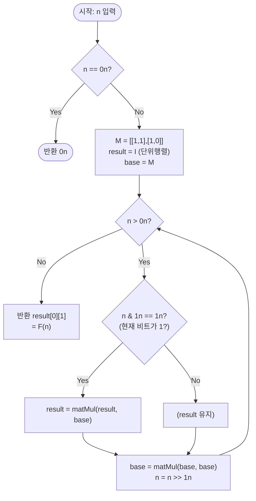

# 행렬 거듭제곱을 이용한 피보나치 (Matrix Power Fibonacci) 해설

## 성능 목표 예측

| 항목 | 값 |
|------|-----|
| 입력 범위 | `0 ≤ n ≤ 10^18` |
| 입력 타입 | `bigint` |
| 결과 크기 | $F_{10^{18}}$은 천문학적으로 큰 수 (자릿수 $\approx 10^{17}$) |

**naive 접근의 시간복잡도:** 가장 단순한 방법은 $F(0), F(1), F(2), \ldots, F(n)$을 순서대로 계산하는 선형 반복이다.

```
a ← 0, b ← 1
for i in 1..n:
    a, b ← b, a + b
return a
```

이 방법의 시간복잡도는 $O(n)$이다. $n \leq 10^{18}$이면 $10^{18}$번 반복이 필요하다. 현대 CPU가 초당 $10^9$번 연산을 수행한다고 해도 $10^9$초($\approx 31$ 년)가 소요된다. 완전히 불가능하다.

**목표 복잡도:** $O(\log n)$ — 행렬 거듭제곱(반복 제곱법)을 사용한다. $n = 10^{18}$이면 $\log_2(10^{18}) \approx 60$번의 행렬 곱셈으로 충분하다. 2×2 행렬 곱셈은 상수 시간이므로 전체 $O(\log n)$이다.

**공간 복잡도:** $O(1)$ — 2×2 행렬 상수 개(재귀 대신 반복문으로 구현 시)를 유지한다. 재귀로 구현하면 호출 스택 깊이가 $O(\log n)$이다.

**메모리 트레이드오프:** $F(n)$ 자체가 매우 큰 수($\approx 10^{17}$ 자릿수)이므로, 실제 bigint 연산 비용이 상수가 아니다. 엄밀한 비트 복잡도는 $O(\log^2 n)$ 이상이지만, 이 문제에서는 논의를 생략한다.

---

## 목표 함수

```ts
function matrixPowerFibonacci(n: bigint): bigint
```

| 파라미터 | 의미 | 제약 |
|----------|------|------|
| `n` | 피보나치 수열의 인덱스 | `0n ≤ n ≤ 10^18n` |

**반환값:** $F(n)$ — 0-인덱스 피보나치 수. $F(0) = 0$, $F(1) = 1$, $F(n) = F(n-1) + F(n-2)$.

**엣지케이스:**

1. `n = 0n` → `0n`: 단위행렬 $I = M^0$의 $(0,1)$ 위치가 $F(0) = 0$이어야 하므로 별도 처리하거나 기저 케이스로 처리한다.
2. `n = 1n` → `1n`: $M^1 = M$의 $(0,1)$ 위치는 1이다.
3. `n = 10n` → `55n`: $F(10) = 55$로 검산이 쉽다.

---

## 핵심 아이디어

**핵심 아이디어**: "피보나치 점화식을 행렬 곱으로 변환하면, $F(n)$을 구하는 문제가 행렬의 $n$제곱 문제가 되고 — 이것은 분할 정복으로 $O(\log n)$에 풀린다."

$F(n) = F(n-1) + F(n-2)$를 선형 반복으로 계산하면 $O(n)$이라 $n = 10^{18}$에서 수십 년이 걸린다. 하지만 이 점화식은 행렬 $M = \begin{pmatrix}1 & 1 \\ 1 & 0\end{pmatrix}$의 $n$제곱으로 표현되고, 반복 제곱법(exponentiation by squaring)으로 약 60번의 행렬 곱셈만으로 $M^n$을 구할 수 있다.

**풀이 구조**
1. $n = 0$이면 `0`을 직접 반환한다.
2. 전이 행렬 $M = \begin{pmatrix}1 & 1 \\ 1 & 0\end{pmatrix}$을 정의하고, 결과 행렬을 단위행렬 $I$로 초기화한다.
3. `n`을 이진수로 처리하며, 현재 비트가 1이면 `result = result × base`, 매 단계마다 `base = base × base`하고 `n >>= 1`한다.
4. 루프 종료 후 `result[0][1]` (= $F(n)$)을 반환한다.

**조건**: $n \geq 0$이어야 하며, $n$이 $10^{18}$에 이르므로 `bigint` 타입을 사용해야 한다. 행렬 원소도 `bigint`로 처리해야 정밀도 손실이 없다.

**대표 예시**: $F(10) = 55$ 계산 ($n = 10 = \text{0b}1010$)
비트 4개를 처리하며 `base`를 $M, M^2, M^4, M^8$로 제곱하고, 비트 1이 켜진 위치($M^2, M^8$)만 `result`에 곱한다. 최종 `result = M^{10}[0][1] = 55`. 10번 덧셈 대신 4번의 행렬 곱셈으로 완료.

**언제 쓰나**
"선형 점화식의 $n$번째 항을 $n$이 매우 클 때 구하라"는 유형에 사용한다. 피보나치뿐 아니라 임의의 $k$차 선형 점화식도 $k \times k$ 행렬로 변환해 같은 방법으로 $O(k^3 \log n)$에 풀 수 있다.

---

### 원형 아이디어와 naive 접근

피보나치를 $O(n)$으로 계산하는 방법은 직관적이다.

```
F(0) = 0
F(1) = 1
F(n) = F(n-1) + F(n-2)
```

이를 메모이제이션 없이 단순 재귀로 구현하면 $O(2^n)$이다. 선형 반복으로 개선해도 $O(n)$이다. 폭발 지점은 $n = 10^{18}$: 선형 반복으로는 수십 년이 걸린다. "어떻게든 $O(\log n)$으로 줄여야 한다"는 요구가 출발점이다.

### 어떤 관찰이 돌파구가 되는가

- **관찰 1:** 피보나치 점화식 $F(n) = F(n-1) + F(n-2)$는 **선형 점화식**이다. 선형 점화식은 항상 행렬 곱으로 표현할 수 있다.
- **관찰 2:** $\begin{pmatrix} F(n+1) \\ F(n) \end{pmatrix} = \begin{pmatrix} 1 & 1 \\ 1 & 0 \end{pmatrix} \begin{pmatrix} F(n) \\ F(n-1) \end{pmatrix}$이므로, 이 행렬 $M$을 $n$번 곱하면 $F(n)$을 얻는다.
- **관찰 3:** 행렬 거듭제곱 $M^n$은 분할 정복(반복 제곱법)으로 $O(\log n)$ 번의 행렬 곱셈으로 계산 가능하다.

### 관찰을 형식화: 상태/구조 정의

2×2 행렬 $M = \begin{pmatrix} 1 & 1 \\ 1 & 0 \end{pmatrix}$을 정의한다. 다음 항등식이 성립한다.

$$M^n = \begin{pmatrix} F(n+1) & F(n) \\ F(n) & F(n-1) \end{pmatrix}$$

이 형태여야 하는 근거: 상태 벡터 $\begin{pmatrix} F(n) \\ F(n-1) \end{pmatrix}$에서 $\begin{pmatrix} F(n+1) \\ F(n) \end{pmatrix}$으로의 선형 변환이 $M$이다. 선형 변환의 $n$번 합성은 행렬의 $n$제곱이다. 이 항등식은 $F(n)$을 $M^n$의 $(0,1)$ 또는 $(1,0)$ 원소로 추출할 수 있음을 의미한다.

반복 제곱법의 상태 정의: 매 단계에서 `base`(현재 밑, $M$의 거듭제곱)와 `result`(누적 곱)를 유지하고, `n`을 비트 단위로 처리한다.

$$\text{result} \leftarrow \begin{cases} \text{result} \times \text{base} & \text{if } n \text{ 의 현재 비트가 1} \\ \text{result} & \text{otherwise} \end{cases}, \quad \text{base} \leftarrow \text{base}^2, \quad n \leftarrow \lfloor n/2 \rfloor$$

### 점화식 또는 핵심 연산

**행렬 항등식(귀납으로 유도):**

$$M^n = \begin{pmatrix} F(n+1) & F(n) \\ F(n) & F(n-1) \end{pmatrix}$$

**기저 ($n = 1$):**

$$M^1 = \begin{pmatrix} 1 & 1 \\ 1 & 0 \end{pmatrix} = \begin{pmatrix} F(2) & F(1) \\ F(1) & F(0) \end{pmatrix} = \begin{pmatrix} 1 & 1 \\ 1 & 0 \end{pmatrix}$$

**귀납 ($n \to n+1$):**

$$M^{n+1} = M^n \cdot M = \begin{pmatrix} F(n+1) & F(n) \\ F(n) & F(n-1) \end{pmatrix} \begin{pmatrix} 1 & 1 \\ 1 & 0 \end{pmatrix}$$

$$= \begin{pmatrix} F(n+1) + F(n) & F(n+1) \\ F(n) + F(n-1) & F(n) \end{pmatrix} = \begin{pmatrix} F(n+2) & F(n+1) \\ F(n+1) & F(n) \end{pmatrix}$$

피보나치 정의 $F(n+2) = F(n+1) + F(n)$을 사용하면 귀납이 성립한다.

**반복 제곱법:**

$$M^n = \begin{cases} I & (n = 0) \\ (M^{n/2})^2 & (n \text{ 짝수}) \\ M \cdot M^{n-1} & (n \text{ 홀수}) \end{cases}$$

이 분기를 재귀 또는 비트 단위 반복으로 구현하면 $O(\log n)$ 행렬 곱셈이 수행된다.

### 정당성 — 왜 이것이 옳은가

**행렬 항등식의 귀납적 정당성**은 위 유도 과정에서 완성되었다. 추가로 $n = 0$ 케이스를 확인한다.

$$M^0 = I = \begin{pmatrix} 1 & 0 \\ 0 & 1 \end{pmatrix}$$

항등식 우변은 $\begin{pmatrix} F(1) & F(0) \\ F(0) & F(-1) \end{pmatrix} = \begin{pmatrix} 1 & 0 \\ 0 & 1 \end{pmatrix}$이어야 한다. $F(-1) = 1$로 정의하면 성립하지만, 구현에서는 $n = 0$일 때 $F(0) = 0$을 직접 반환하는 것이 안전하다.

**반복 제곱법의 정당성:** $n$을 이진수로 쓰면 $n = b_k 2^k + b_{k-1} 2^{k-1} + \cdots + b_0$이다. `base`를 $M, M^2, M^4, \ldots, M^{2^k}$ 순으로 제곱하면서 `n`의 비트가 1인 위치에서 `result`에 곱하면:

$$\text{result} = M^{b_0} \cdot M^{b_1 \cdot 2} \cdot M^{b_2 \cdot 4} \cdots = M^{b_0 + 2b_1 + 4b_2 + \cdots} = M^n$$

**까다로운 케이스:**
- $n = 0$: `matPow`가 단위행렬 $I$를 반환하면 $(0,1)$ 위치가 0이 아닌 경우가 있으므로, 함수 진입부에서 `if n == 0n: return 0n`으로 처리한다.
- bigint 홀짝 판별: `n % 2n === 1n` 또는 `n & 1n === 1n`으로 확인한다. `n % 2`처럼 number로 혼합 연산하면 타입 오류가 발생한다.

### 구현 디테일과 최적화

- **bigint 사용:** `n`이 `10^18`까지 가므로 JavaScript의 `number`(안전 정수 범위 $2^{53} - 1 \approx 9 \times 10^{15}$)로는 표현이 부족하다. 함수 시그니처가 `bigint`를 요구하며, 행렬 원소도 bigint로 선언해야 한다.
- **2×2 행렬 표현:** `type Mat = [[bigint, bigint], [bigint, bigint]]`로 타입을 정의하면 가독성이 높아진다.
- **반복 제곱법 반복 구현 (재귀 대신):** 호출 스택 오버플로 없이 $O(\log n)$ 공간을 $O(1)$로 줄인다.
- **함정 1:** `n === 0n` 처리를 빠트리면 단위행렬의 $(0,1)$ 원소가 0임을 별도로 확인해야 한다.
- **함정 2:** 행렬 곱셈 공식에서 인덱스를 잘못 쓰면 틀린 피보나치 수가 나온다. $(0,1)$ 위치가 $F(n)$임을 반드시 검산해야 한다.
- **결과 추출:** `M^n[0][1]` 또는 `M^n[1][0]`이 $F(n)$이다 (대칭 행렬이므로 같다).

---

## 수도 코드와 Activity Diagram

### 의사코드

```
// 2×2 bigint 행렬 곱셈
function matMul(A, B):
  return [
    [A[0][0]*B[0][0] + A[0][1]*B[1][0],   // 불변식: bigint 연산만 사용
     A[0][0]*B[0][1] + A[0][1]*B[1][1]],
    [A[1][0]*B[0][0] + A[1][1]*B[1][0],
     A[1][0]*B[0][1] + A[1][1]*B[1][1]]
  ]

// 반복 제곱법 (비재귀)
function matPow(M, n):
  result ← [[1n,0n],[0n,1n]]  // 단위행렬 I; 불변식: result = M^(처리된 비트 누적)
  base ← M                    // 불변식: base = M^(2^현재 비트 위치)
  while n > 0n:
    if n & 1n == 1n:           // 현재 비트가 1이면
      result ← matMul(result, base)  // 해당 거듭제곱을 누적
    base ← matMul(base, base)  // base를 제곱: M^2^k → M^2^(k+1)
    n ← n >> 1n                // 다음 비트로 이동
  return result

function matrixPowerFibonacci(n):
  if n == 0n: return 0n        // 기저 케이스
  M ← [[1n,1n],[1n,0n]]        // 피보나치 전이 행렬
  result ← matPow(M, n)        // 불변식: result = M^n
  return result[0][1]          // F(n)은 M^n의 (0,1) 위치
```

### Activity Diagram



**핵심 불변식:** `matPow` 루프에서 `result × base^n`이 항상 $M^{n_\text{초기}}$와 같다. 루프 종료 시 `n = 0`이므로 `result = M^{n_\text{초기}}`이다.

---

### 실행 예시

**$F(10)$ 계산 ($n = 10 = \text{0b}1010$):**

| 단계 | `n` (이진) | 비트 | `base` | `result` |
|------|-----------|------|--------|----------|
| 초기 | `1010` | — | $M$ | $I$ |
| 1회 | `0101` | 0 (홀수 아님) | $M^2 = [[2,1],[1,1]]$ | $I$ |
| 2회 | `0010` | 1 | $M^4 = [[5,3],[3,2]]$ | $M^2 = [[2,1],[1,1]]$ |
| 3회 | `0001` | 0 (홀수 아님) | $M^8 = [[34,21],[21,13]]$ | $M^2$ |
| 4회 | `0000` | 1 | $M^{16}$ | $M^{10} = M^2 \times M^8$ |
| 종료 | `0000` | — | — | $M^{10}$ |

$$M^{10} = M^2 \times M^8 = \begin{pmatrix} 2 & 1 \\ 1 & 1 \end{pmatrix} \begin{pmatrix} 34 & 21 \\ 21 & 13 \end{pmatrix} = \begin{pmatrix} 89 & 55 \\ 55 & 34 \end{pmatrix}$$

$M^{10}[0][1] = 55 = F(10)$

| $n$ | $F(n)$ |
|-----|--------|
| 0 | 0 |
| 1 | 1 |
| 5 | 5 |
| 10 | 55 |
| 50 | 12,586,269,025 |
