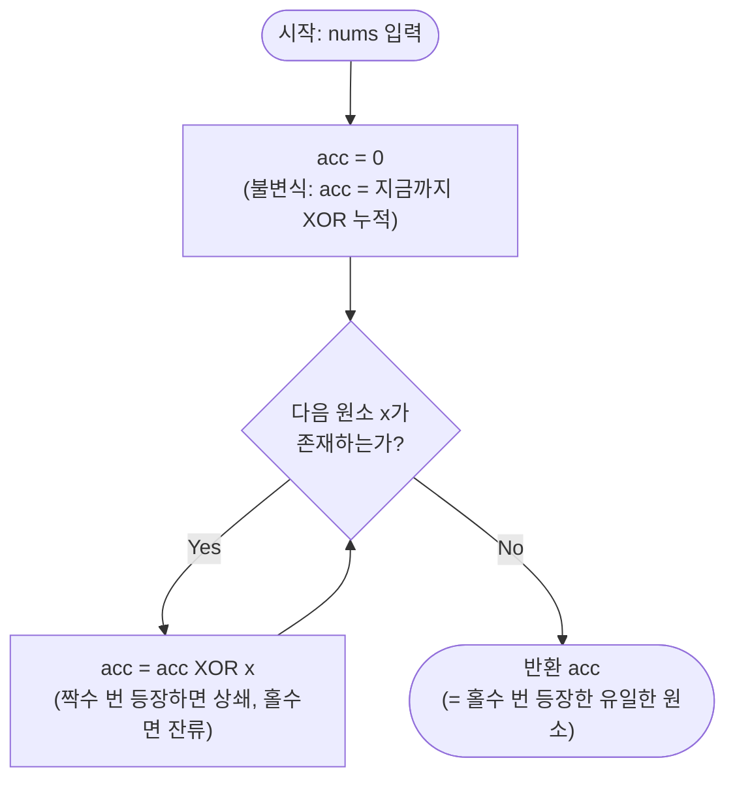

# XOR 누적 트릭 (Single Number) 해설

## 성능 목표 예측

| 항목 | 값 |
|------|-----|
| 입력 크기 | `1 ≤ N ≤ 10^6` |
| 입력 값 범위 | `|nums[i]| < 2^31` |
| 문제 조건 | 정확히 하나의 원소가 홀수 번, 나머지는 짝수 번 등장 |

**naive 접근의 시간복잡도:**

가장 단순한 방법은 각 원소의 등장 횟수를 해시맵에 기록하는 것이다.

```
freq ← {}
for each x in nums:
    freq[x] = (freq[x] ?? 0) + 1
for each (val, cnt) in freq:
    if cnt % 2 == 1:
        return val
```

이 방법은 $O(N)$ 시간, $O(N)$ 공간이다. 시간은 충분하지만 **$O(N)$ 추가 공간**이 필요하다. 문제는 "$O(1)$ 공간으로 풀 수 있는가?"를 묻는다. 해시맵은 최악의 경우 배열 원소 수만큼의 공간을 요구하므로 이 조건을 만족하지 못한다.

정렬을 이용하면 인접한 원소를 비교해서 $O(1)$ 추가 공간이 가능하지만, $O(N \log N)$ 시간이 필요하다.

**목표 복잡도:** $O(N)$ 시간, $O(1)$ 공간 — 이 둘을 동시에 달성하는 것이 핵심이다. XOR 누적이 유일한 방법이다.

**공간 복잡도:** $O(1)$ — 누산기 변수 `acc` 하나만 사용한다.

**메모리 트레이드오프:** 공간을 $O(N)$으로 늘려도 시간이 $O(N)$ 이하로 줄어들지 않는다. XOR은 이미 $O(N)$ 시간 하한(배열을 최소 한 번은 읽어야 함)에 도달한 최적 해다.

---

## 목표 함수

```ts
function singleNumberXor(nums: number[]): number
```

| 파라미터 | 의미 | 제약 |
|----------|------|------|
| `nums` | 32비트 정수 배열 | `1 ≤ N ≤ 10^6`, `|nums[i]| < 2^31` |

**반환값:** 배열에서 홀수 번 등장하는 유일한 원소의 값.

**전제 조건:** 홀수 번 등장하는 원소가 정확히 1개 존재한다고 보장된다.

**엣지케이스:**

1. `nums = [x]` → `x`: 원소 1개는 1번(홀수 번) 등장하므로 그 자체가 정답이다.
2. `nums = [a, b, a]` → `b`: `a`가 2번(짝수), `b`가 1번(홀수) 등장하므로 `b`가 반환된다.
3. `nums = [0, 0, 0]` → `0`: 0이 3번(홀수) 등장하므로 0이 반환된다. XOR 연산에서 `0 ⊕ 0 = 0`이고 `0 ⊕ 0 ⊕ 0 = 0`이 되어 올바르게 처리된다.

---

## 핵심 아이디어

**핵심 아이디어**: "XOR은 같은 값을 두 번 적용하면 사라지기 때문에, 배열 전체를 XOR로 누적하면 짝수 번 등장한 모든 값이 자동으로 상쇄되고 홀수 번 등장한 값만 남는다."

해시맵으로 등장 횟수를 세면 $O(N)$ 공간이 필요하고, 정렬은 $O(N \log N)$이 든다. 하지만 $a \oplus a = 0$이라는 XOR의 자기 역원 성질을 이용하면 누산기 변수 하나만으로 $O(N)$ 시간, $O(1)$ 공간을 동시에 달성한다. 배열을 한 번 순회하며 모든 값을 XOR로 누적하는 것이 전부다.

**풀이 구조**
1. 누산기 `acc = 0`으로 초기화한다.
2. 배열의 각 원소 `x`에 대해 `acc = acc ^ x`로 누적한다.
3. 순회 완료 후 `acc`를 반환한다.

**조건**: 홀수 번 등장하는 원소가 정확히 1개이고, 나머지는 모두 짝수 번 등장해야 한다. 이 조건 없이는 여러 값이 동시에 남아 구별할 수 없다.

**대표 예시**: `[4, 1, 2, 1, 2]` 탐색
`0 ^ 4 = 4 → 4 ^ 1 = 5 → 5 ^ 2 = 7 → 7 ^ 1 = 6 → 6 ^ 2 = 4`. 결과 `4`. 1과 2는 각 2번씩 등장해 XOR로 상쇄되고, 4만 1번 등장해 잔류.

**언제 쓰나**
"하나만 홀수 번 등장하고 나머지는 짝수 번 등장하는 원소를 $O(1)$ 공간으로 찾아라"는 유형에 즉시 적용한다. "두 원소가 홀수 번 등장"하는 변형은 XOR 후 세팅 비트로 두 그룹을 분리하는 추가 단계가 필요하다.

---

### 원형 아이디어와 naive 접근

"짝수 번 등장한 것은 무시하고, 홀수 번 등장한 것만 남긴다." 이 직관을 구현하는 가장 단순한 방법은 등장 횟수를 세는 것이다.

```
freq ← 빈 해시맵
for each x in nums:
    freq[x] += 1
return freq에서 count가 홀수인 key
```

**폭발 지점:** $O(N)$ 공간. 원소 종류가 많을수록 해시맵 크기도 커진다. 또한 해시 충돌 처리 오버헤드가 있다.

다른 방법인 정렬은 $O(N \log N)$ 시간이 걸려 시간 효율이 떨어진다.

**근본 질문:** "짝수 번 등장한 값을 '상쇄'하는 연산이 있는가?" 이 질문이 XOR로 향하는 돌파구다.

### 어떤 관찰이 돌파구가 되는가

- **관찰 1:** XOR($\oplus$)은 자기 역원 성질 $a \oplus a = 0$을 가진다. 어떤 값이 짝수 번 등장하면 XOR로 누적했을 때 0이 된다.
- **관찰 2:** XOR은 교환법칙($a \oplus b = b \oplus a$)과 결합법칙($(a \oplus b) \oplus c = a \oplus (b \oplus c)$)을 만족하므로, 배열을 어떤 순서로 누적해도 결과가 같다. 즉 같은 값끼리 모아서 계산한 것과 동일하다.
- **관찰 3:** 홀수 번 등장한 값은 $a \oplus a \oplus \cdots \oplus a$ (홀수 회) $= a$로 남는다. 짝수 번 등장한 값은 모두 0이 되어 항등원에 의해 사라진다.

### 관찰을 형식화: 상태/구조 정의

누산기 `acc`를 다음과 같이 정의한다.

$$\text{acc}_0 = 0, \quad \text{acc}_{i+1} = \text{acc}_i \oplus \text{nums}[i]$$

루프 종료 시 $\text{acc}_N = \bigoplus_{i=0}^{N-1} \text{nums}[i]$이다.

이 형태여야 하는 근거: XOR 연산의 교환·결합 법칙에 의해 배열 전체의 XOR은 순서와 무관하게 "각 값이 몇 번 등장하는가"에만 의존한다. 구체적으로 값 $v$의 기여는 $v$가 $k$번 등장할 때 $v \oplus v \oplus \cdots$ ($k$번) $= v \cdot (k \mod 2)$이다 (비트 단위로 $k$가 홀수면 $v$, 짝수면 $0$). 따라서 단일 `acc` 변수로 상태를 완전히 표현한다.

### 점화식 또는 핵심 연산

$$\text{acc} \leftarrow \text{acc} \oplus \text{nums}[i], \quad i = 0, 1, \ldots, N-1$$

**각 항의 의미:**
- $\text{acc}$: 지금까지 순회한 원소들의 XOR 누적값. 홀수 번 본 값은 세팅된 비트가 남아있고, 짝수 번 본 값은 상쇄되어 0이 됨.
- $\text{nums}[i]$: 새로 처리할 원소.
- $\oplus$: XOR 연산. 같은 비트는 소거, 다른 비트는 세팅.

**유도 과정** (배열 `[4, 1, 2, 1, 2]`):

$$\text{acc} = 0 \oplus 4 \oplus 1 \oplus 2 \oplus 1 \oplus 2$$

교환·결합 법칙으로 재배열:

$$= (1 \oplus 1) \oplus (2 \oplus 2) \oplus 4 = 0 \oplus 0 \oplus 4 = 4$$

### 정당성 — 왜 이것이 옳은가

**XOR 군 구조:** $(\mathbb{Z}/2\mathbb{Z})^{32}$ 위에서 XOR은 덧셈이다. 각 비트는 독립적으로 $\mathbb{Z}/2\mathbb{Z}$에서 덧셈을 수행한다. 이 군에서는 $a + a = 2a = 0$이다(2로 나누면 0이므로). 따라서 짝수 번 더한 원소는 군의 항등원(0)이 된다.

**귀납적 불변식:** 루프 $i$회 후 `acc = nums[0] ⊕ nums[1] ⊕ ... ⊕ nums[i-1]`이 성립한다.
- 기저: `acc = 0 = 빈 XOR`이고 성립한다.
- 귀납: `acc_i ⊕ nums[i] = nums[0] ⊕ ... ⊕ nums[i-1] ⊕ nums[i] = acc_{i+1}`이고 성립한다.

루프 종료 시 `acc = nums[0] ⊕ ... ⊕ nums[N-1]`이다. 문제 조건에 따라 짝수 번 등장한 값들은 모두 0이 되고, 홀수 번 등장한 값(정확히 1개)만 남는다.

**까다로운 케이스:** 배열에 음수가 포함될 때: JavaScript의 비트 XOR(`^`)은 피연산자를 32비트 부호 있는 정수로 변환하여 연산한다. 음수도 32비트 2의 보수로 표현되므로 XOR이 정확히 동작한다. 결과도 32비트 부호 있는 정수로 반환되어 `number` 타입으로 변환된다.

### 구현 디테일과 최적화

- **단 세 줄:** 초기화, 루프, 반환으로 끝난다. 별도 자료구조 불필요하다.
- **for-of vs for 루프:** 배열 순회에서 `for (const x of nums)`는 이터레이터를 사용하므로 성능 민감한 경우 `for (let i = 0; i < nums.length; i++)`가 약간 빠를 수 있다.
- **reduce 표현:** `nums.reduce((acc, x) => acc ^ x, 0)`으로 한 줄로 작성 가능하다. 함수형 표현이지만 내부적으로 동일한 $O(N)$ 순회다.
- **함정 1:** 누산기 초기값을 `nums[0]`으로 하고 인덱스 1부터 순회해도 같은 결과지만, 빈 배열 처리를 별도로 해야 한다.
- **함정 2:** `|`(OR), `&`(AND)을 `^`(XOR) 대신 쓰면 전혀 다른 결과가 나온다.
- **확장:** "두 원소가 홀수 번 등장"하는 변형 문제는 XOR을 사용해 두 값의 XOR을 구한 뒤, 임의의 세팅 비트로 두 그룹을 분리하는 더 복잡한 기법이 필요하다.

---

## 수도 코드와 Activity Diagram

### 의사코드

```
function singleNumberXor(nums):
  acc ← 0
  // 불변식: acc = nums[0] ⊕ nums[1] ⊕ ... ⊕ nums[i-1]
  //         (짝수 번 등장한 값은 이미 상쇄되어 0 기여, 홀수 번은 비트 남아있음)

  for each x in nums:
    acc ← acc ^ x    // XOR 누적: 같은 값 두 번 보면 상쇄됨

  // 루프 종료 후: acc = 전체 배열 XOR
  // = (짝수 번 등장 값들의 XOR → 0) ⊕ (홀수 번 등장 값)
  // = 홀수 번 등장 값

  return acc
```

### Activity Diagram



**핵심 불변식:** 루프 $i$회 후 `acc = nums[0] ⊕ nums[1] ⊕ ... ⊕ nums[i-1]`. 짝수 번 등장한 값은 이미 누산기에서 상쇄되어 0이 기여되고, 홀수 번 등장한 값만 비트가 살아있다.

---

### 실행 예시

**입력:** `[4, 1, 2, 1, 2]`

| 단계 | $x$ | `acc` (2진, 3비트) | `acc` (10진) | 비고 |
|------|-----|-------------------|-------------|------|
| 초기 | — | `000` | 0 | 시작 |
| 1 | 4 | `100` | 4 | 4 첫 등장 |
| 2 | 1 | `101` | 5 | 1 첫 등장 |
| 3 | 2 | `111` | 7 | 2 첫 등장 |
| 4 | 1 | `110` | 6 | 1 두 번째 → 상쇄 |
| 5 | 2 | `100` | 4 | 2 두 번째 → 상쇄 |

결과: `4` (1과 2는 각 2번씩 등장하여 XOR로 상쇄됨, 4만 1번 등장하여 잔류)

**음수 포함 예시:** `[-1, -1, 3]`

$$\text{acc} = 0 \oplus (-1) \oplus (-1) \oplus 3 = 0 \oplus 0 \oplus 3 = 3$$

$-1$은 32비트 모두 1이므로 $(-1) \oplus (-1) = 0$. 결과 `3`이 반환된다.
