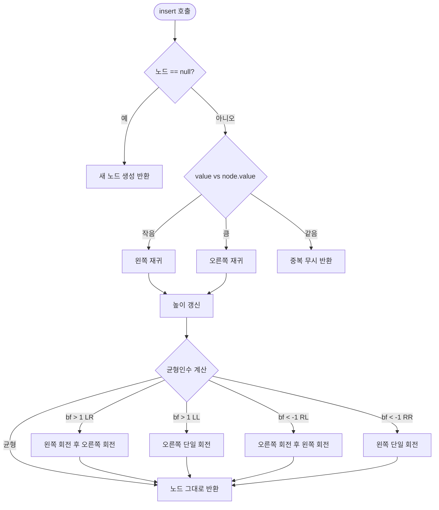

import { AlgorithmSimulation } from "#guide-sim";

# AVLTree 해설

## 성능 목표 예측

| 연산 | 평균 | 최악 |
|------|------|------|
| insert | O(log n) | O(log n) |
| delete | O(log n) | O(log n) |
| has | O(log n) | O(log n) |
| min / max | O(log n) | O(log n) |
| inOrder | O(n) | O(n) |
| height | O(1) | O(1) |

AVL 트리의 높이 상한은 $1.44 \cdot \log_2(n+2) - 0.33$으로 엄격히 보장된다.

---

## 목표 함수

| 메서드 | 역할 |
|--------|------|
| `insert(value)` | 삽입 후 조상 체인을 따라 높이 갱신 및 회전 |
| `delete(value)` | 삭제 후 재균형 |
| `has(value)` | 일반 BST 탐색 |
| `min() / max()` | 가장 왼쪽 / 오른쪽 노드 |
| `inOrder()` | 중위 순회 (정렬된 배열) |
| `height()` | 루트 노드의 `height` 필드 반환 |

---

## 핵심 아이디어

### 원형 아이디어와 naive 접근

일반 BST에 정렬된 시퀀스를 삽입하면 트리가 연결 리스트처럼 퇴화한다. `insert(1), insert(2), ..., insert(n)` 을 실행하면 높이가 n이 되어 탐색이 O(n)이 된다.

naive 해결책: 삽입/삭제마다 트리를 완전히 재구성한다 → O(n log n)으로 너무 느리다.

### 어떤 관찰이 돌파구가 되는가

**불균형은 항상 지역적으로 발생한다.** 삽입/삭제로 인한 높이 변화는 해당 노드의 조상 체인(O(log n)개)에만 영향을 미친다. 그리고 불균형도 딱 그 지점에서만 발생한다.

관찰: **균형 인수가 ±2가 된 최초 조상 노드를 찾으면, 그 노드 하나에서 회전 1~2번으로 전체 불균형을 해소할 수 있다.**

### 관찰을 형식화: 상태/구조 정의

```ts
class AVLNode<T> {
  value: T;
  left:   AVLNode<T> | undefined;
  right:  AVLNode<T> | undefined;
  height: number;  // 핵심 — 이 노드를 루트로 하는 서브트리의 높이
}

// 보조 함수
function nodeHeight<T>(n: AVLNode<T> | undefined): number {
  return n?.height ?? 0;
}
function balanceFactor<T>(n: AVLNode<T>): number {
  return nodeHeight(n.left) - nodeHeight(n.right);
}
function updateHeight<T>(n: AVLNode<T>): void {
  n.height = 1 + Math.max(nodeHeight(n.left), nodeHeight(n.right));
}
```

### 핵심 연산 — 4종 회전

**오른쪽 단일 회전 (LL 불균형 해소)**

```
     z                  y
    / \                / \
   y   T4    →       x   z
  / \                   / \
 x   T3               T3  T4
```

**왼쪽 단일 회전 (RR 불균형 해소)** — 오른쪽 회전의 대칭

**LR 이중 회전** — y에 왼쪽 회전 후 z에 오른쪽 회전

**RL 이중 회전** — y에 오른쪽 회전 후 z에 왼쪽 회전

```ts
function rotateRight<T>(z: AVLNode<T>): AVLNode<T> {
  const y = z.left!;
  z.left = y.right;
  y.right = z;
  updateHeight(z);
  updateHeight(y);
  return y;  // 새 루트
}

function balance<T>(node: AVLNode<T>): AVLNode<T> {
  updateHeight(node);
  const bf = balanceFactor(node);
  // LL
  if (bf > 1 && balanceFactor(node.left!) >= 0)
    return rotateRight(node);
  // LR
  if (bf > 1) {
    node.left = rotateLeft(node.left!);
    return rotateRight(node);
  }
  // RR
  if (bf < -1 && balanceFactor(node.right!) <= 0)
    return rotateLeft(node);
  // RL
  if (bf < -1) {
    node.right = rotateRight(node.right!);
    return rotateLeft(node);
  }
  return node;
}
```

### 정당성 — 왜 이것이 옳은가

회전은 BST 성질(중위 순서)을 보존하면서 높이를 줄인다. 삽입 시 하나의 불균형 지점만 생기므로 회전 1~2번으로 전체 트리가 다시 균형을 찾는다. 삭제 시에는 조상 체인 전체를 다시 확인해야 하지만 O(log n) 이내다.

### 구현 디테일과 최적화

- **재귀 + 반환값 패턴**: `insert`/`delete`가 `AVLNode | undefined`를 반환하여 부모가 자식 포인터를 교체한다. 부모 포인터 불필요.
- **높이 필드 단조성**: 회전 후 반드시 아래 노드부터 높이를 갱신해야 한다.
- **삭제의 중위 후계자**: 두 자식이 있는 노드 삭제 시 오른쪽 서브트리 최솟값으로 대체 후 재균형.
- **중복 처리**: `comparator` 결과가 0이면 삽입을 무시하여 set 의미론 유지.

---

## 시뮬레이션

export const steps = [
  {
    title: "초기 상태",
    detail: "빈 트리. 아직 아무 노드도 없다.",
    array: [],
    highlight: [],
    marked: [],
  },
  {
    title: "insert(10)",
    detail: "루트 없음 → 10이 루트가 된다. height=1, 균형인수=0.",
    array: [10],
    highlight: [0],
    marked: [],
  },
  {
    title: "insert(20)",
    detail: "10의 오른쪽에 20 삽입. 균형인수=-1. 균형 유지.",
    array: [10, 0, 20],
    highlight: [2],
    marked: [0],
  },
  {
    title: "insert(30) — RR 불균형",
    detail: "20의 오른쪽에 30 삽입. 10의 균형인수=-2 → RR → 왼쪽 회전.",
    array: [10, 0, 20, 0, 0, 0, 30],
    highlight: [6],
    marked: [],
  },
  {
    title: "왼쪽 회전 후",
    detail: "20이 새 루트. 왼쪽=10, 오른쪽=30. 높이=2, 균형인수=0.",
    array: [20, 10, 30],
    highlight: [0],
    marked: [1, 2],
  },
  {
    title: "insert(5)",
    detail: "10의 왼쪽에 5 삽입. 균형인수 전파 → 모든 노드 균형 유지.",
    array: [20, 10, 30, 5],
    highlight: [3],
    marked: [0, 1, 2],
  },
  {
    title: "insert(15) — LR 불균형",
    detail: "10의 오른쪽에 15 삽입. 20의 왼쪽 서브트리 LR 불균형 감지.",
    array: [20, 10, 30, 5, 15],
    highlight: [4],
    marked: [],
  },
  {
    title: "LR 이중 회전 후",
    detail: "10에 왼쪽 회전 → 15가 10 자리. 이후 20에 오른쪽 회전. 균형 복원.",
    array: [15, 10, 20, 5, 0, 0, 30],
    highlight: [0],
    marked: [1, 2, 3, 6],
  },
];

<AlgorithmSimulation view="array" steps={steps} title="AVL 트리 삽입 & 회전 시뮬레이션" />

---

## 수도 코드와 Activity Diagram

### 의사코드

```
function insertNode(node, value):
  if node == null:
    return new Node(value)
  if value < node.value:
    node.left = insertNode(node.left, value)
  else if value > node.value:
    node.right = insertNode(node.right, value)
  else:
    return node  // 중복 무시

  updateHeight(node)
  return balance(node)

function balance(node):
  bf = height(node.left) - height(node.right)
  if bf > 1:
    if height(node.left.left) >= height(node.left.right):
      return rotateRight(node)         // LL
    else:
      node.left = rotateLeft(node.left)
      return rotateRight(node)         // LR
  if bf < -1:
    if height(node.right.right) >= height(node.right.left):
      return rotateLeft(node)          // RR
    else:
      node.right = rotateRight(node.right)
      return rotateLeft(node)          // RL
  return node
```

### Activity Diagram


