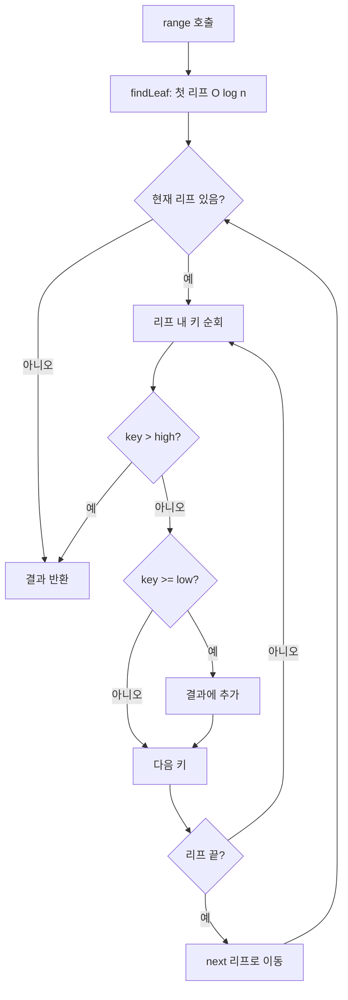
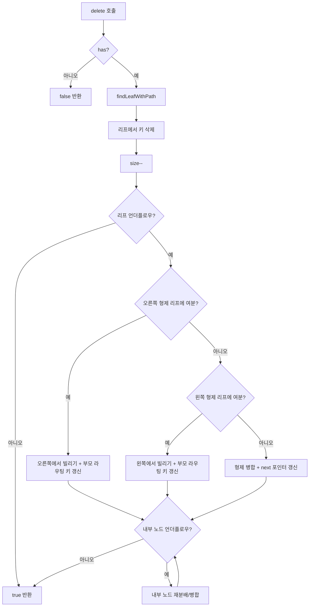

import { AlgorithmSimulation } from "#guide-sim";

# BPlusTree (B+ 트리) 해설

## 성능 목표 예측

| 연산 | 시간복잡도 | t=10, n=10^4 기대 시간 |
|------|-----------|----------------------|
| insert | O(log_t n) | < 1ms |
| delete | O(log_t n) | < 1ms |
| has | O(log_t n) | < 1ms |
| range(low, high) | O(k + log_t n) | k개 결과 반환 |
| inOrder | O(n) | < 10ms |

---

## 목표 함수

| 함수 | 반환 타입 | 설명 |
|------|-----------|------|
| `insert(value)` | `void` | 리프에 삽입, 오버플로우 시 분할 |
| `delete(value)` | `boolean` | 리프에서 삭제, 언더플로우 처리 |
| `has(value)` | `boolean` | 리프까지 탐색하여 존재 확인 |
| `range(low, high)` | `T[]` | 리프 연결 리스트 순회로 범위 반환 |
| `size()` | `number` | 원소 개수 |
| `inOrder()` | `T[]` | 리프 연결 리스트 전체 순회 |

---

## 핵심 아이디어

### 원형 아이디어와 naive 접근

B-트리는 범위 질의 시 문제가 있다. "10 이상 20 이하인 모든 값"을 찾으려면 트리 전체를 중위 순회해야 하는데, 이는 데이터가 내부 노드에 흩어져 있기 때문이다. 데이터베이스에서 `WHERE date BETWEEN '2024-01-01' AND '2024-12-31'`같은 쿼리가 매우 흔한데 B-트리는 이에 최적이 아니다.

**핵심 관찰**: 모든 실제 데이터를 리프에만 모으고, 리프끼리 연결 리스트로 잇는다면? 범위 탐색 시 첫 번째 리프를 O(log n)에 찾고, 그 이후는 연결 리스트를 따라 O(k)에 순회하면 된다.

### 어떤 관찰이 돌파구가 되는가

B+ 트리의 두 가지 핵심 관찰:

1. **내부 노드는 라우팅만 한다**: 실제 데이터를 저장하지 않고 "어느 방향으로 갈지"만 결정한다. 내부 노드에 더 많은 키를 담을 수 있어 같은 메모리로 더 넓은 분기를 만든다.

2. **리프의 연결 리스트**: 리프를 오른쪽 방향으로 연결하면 범위 질의가 리프 레벨에서 선형 순회로 해결된다. 이것이 MySQL, PostgreSQL 인덱스 스캔의 핵심이다.

### 관찰을 형식화: 상태/구조 정의

```ts
// 리프 노드: 실제 데이터 + 다음 리프 포인터
class BPlusLeafNode<T> {
  keys: T[] = [];                         // t-1 ~ 2t-1개의 실제 데이터
  next: BPlusLeafNode<T> | undefined;     // 오른쪽 이웃 리프
}

// 내부 노드: 라우팅 키만 (실제 데이터 없음)
class BPlusInternalNode<T> {
  keys: T[] = [];                                      // t-1 ~ 2t-1개
  children: (BPlusInternalNode<T> | BPlusLeafNode<T>)[];  // keys.length + 1개
}
```

**불변 조건:**
1. 내부 노드의 `keys[i]`: 왼쪽 서브트리의 최댓값보다 크고, 오른쪽 서브트리의 최솟값 이하 (또는 등호: B+ 트리에서 리프에 올라간 키의 복사본이 내부에 존재할 수 있음)
2. 모든 실제 데이터는 리프에만 존재
3. 리프 연결 리스트는 왼쪽에서 오른쪽으로 정렬된 순서를 유지

### 핵심 연산 — 리프 분할 (B-트리와의 차이)

B-트리에서는 분할 시 중간 키가 **올라가고 삭제**된다.
B+ 트리에서는 분할 시 오른쪽 노드의 **첫 번째 키가 복사**되어 올라간다. 원본은 리프에 남는다.

```
splitLeaf(parent, i):
  leaf = parent.children[i]
  mid = ceil(leaf.keys.length / 2)
  newLeaf = new BPlusLeafNode()
  newLeaf.keys = leaf.keys[mid..]          // 오른쪽 절반 복사
  leaf.keys = leaf.keys[0..mid-1]          // 왼쪽 절반 유지
  
  // 연결 리스트 갱신
  newLeaf.next = leaf.next
  leaf.next = newLeaf
  
  // 오른쪽 리프의 첫 키를 부모에 삽입 (복사, 삭제 아님)
  insert newLeaf.keys[0] at parent.keys[i]
  insert newLeaf at parent.children[i+1]
```

내부 노드 분할은 B-트리와 동일: 중간 키가 올라가고 노드에서 제거된다.

### 핵심 연산 — range 질의

```
range(low, high):
  // 1. log_t n에 첫 번째 리프 탐색
  leaf = findLeaf(low)
  
  // 2. 리프 연결 리스트 순회
  result = []
  while leaf != undefined:
    for key in leaf.keys:
      if key > high: return result
      if key >= low: result.push(key)
    leaf = leaf.next
  return result
```

### 핵심 연산 — 삭제의 특수성

B+ 트리 삭제는 B-트리보다 세심하다. 삭제한 키가 내부 노드에 라우팅 키로 복사되어 있을 수 있다.

- 리프에서 최솟값을 삭제하면 부모의 라우팅 키를 새 최솟값으로 업데이트해야 한다.
- 병합 시 부모에서 해당 라우팅 키를 제거한다.
- 재분배 시 부모의 라우팅 키를 새 경계값으로 업데이트한다.

### 정당성

- **range 결과 정확성**: 리프 연결 리스트는 삽입/삭제 시 항상 정렬 순서를 유지하므로, 선형 순회 결과가 정확하다.
- **높이 O(log_t n)**: B-트리와 동일한 논증.
- **연결 리스트 무결성**: 분할 시 `newLeaf.next = leaf.next; leaf.next = newLeaf`, 병합 시 `leftLeaf.next = rightLeaf.next` 로 항상 갱신한다.

### 구현 디테일과 최적화

- **리프의 첫 번째 리프**: 별도로 `firstLeaf` 포인터를 유지하면 `inOrder()`가 O(n)에 가능하다.
- **중복 처리**: `has(x)`가 true이면 삽입을 무시한다.
- **내부 노드의 키 범위**: 내부 노드에 리프 키의 복사본이 있으므로, `has(x)` 구현 시 내부 노드에서 찾았더라도 리프까지 내려가야 정확한 존재 확인이 가능하다.

---

## 시뮬레이션

export const steps = [
  {
    title: "초기 상태 (t=2)",
    detail: "빈 B+ 트리. 리프 연결 리스트도 비어있다.",
    array: [],
    highlight: [],
    marked: [],
  },
  {
    title: "insert(1), insert(2), insert(3)",
    detail: "모든 키가 리프에 저장. 리프: [1, 2, 3]. 아직 루트가 리프.",
    array: [1, 2, 3],
    highlight: [0, 1, 2],
    marked: [],
  },
  {
    title: "insert(4) — 리프 분할",
    detail: "리프 [1,2,3,4] → 분할: [1,2]와 [3,4]. 3이 내부 노드로 복사(삭제 아님).",
    array: [1, 2, 3, 4],
    highlight: [2],
    marked: [0, 1, 3],
  },
  {
    title: "range(2, 3)",
    detail: "내부 노드에서 2의 위치 탐색 → 왼쪽 리프 [1,2]에서 시작 → next → 오른쪽 리프 [3,4]. 결과: [2, 3].",
    array: [1, 2, 3, 4],
    highlight: [1, 2],
    marked: [],
  },
  {
    title: "delete(3) — 리프에서 삭제",
    detail: "오른쪽 리프에서 3 삭제 → [4]만 남음. 내부 라우팅 키가 4로 업데이트.",
    array: [1, 2, 4],
    highlight: [],
    marked: [0, 1, 2],
  },
];

<AlgorithmSimulation view="array" steps={steps} title="B+ 트리 삽입/삭제/범위 시뮬레이션 (t=2)" />

## 수도 코드와 Activity Diagram

### 삽입 의사코드

```
insert(x):
  if has(x): return
  if root is undefined:
    root = new BPlusLeafNode()
    firstLeaf = root
  
  [leaf, path] = findLeafWithPath(x)
  sortedInsert(leaf.keys, x)
  size++
  
  if leaf.keys.length > 2t-1:
    splitLeaf(leaf, path)

splitLeaf(leaf, path):
  mid = ceil(leaf.keys.length / 2)
  newLeaf = new BPlusLeafNode()
  newLeaf.keys = leaf.keys[mid..]
  leaf.keys = leaf.keys[0..mid-1]
  newLeaf.next = leaf.next
  leaf.next = newLeaf
  
  promoteKey = newLeaf.keys[0]  // 복사 (B-트리와 차이!)
  insertIntoParent(path, promoteKey, newLeaf)
```

### range 의사코드

```
range(low, high):
  leaf = findLeaf(low)  // O(log_t n)
  result = []
  
  current = leaf
  while current != undefined:
    for key of current.keys:
      if compare(key, high) > 0: return result
      if compare(key, low) >= 0: result.push(key)
    current = current.next
  
  return result
```

### Activity Diagram




