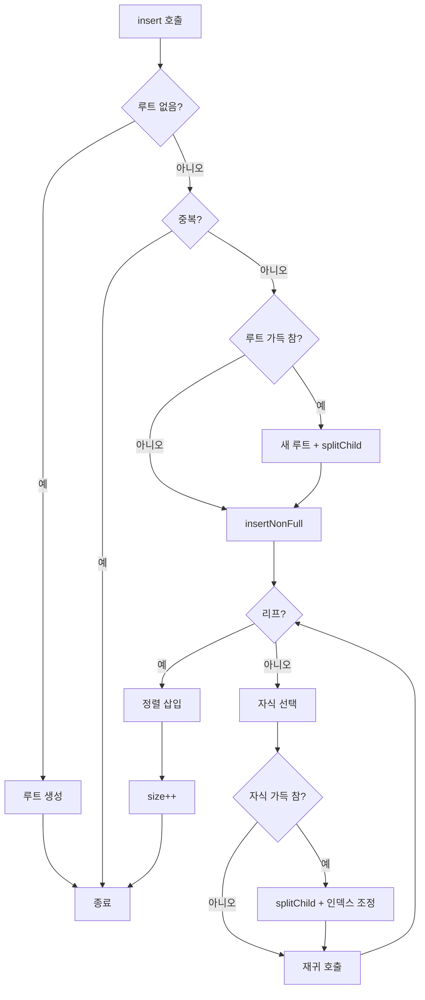
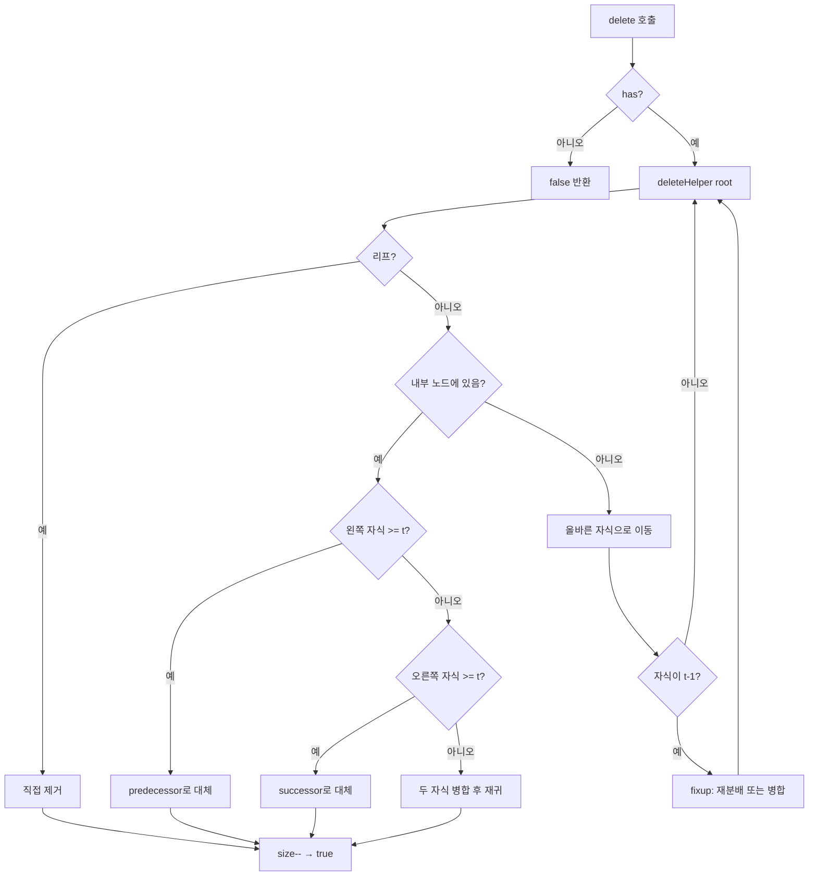

import { AlgorithmSimulation } from "#guide-sim";

# BTree (B-트리) 해설

## 성능 목표 예측

| 연산 | 시간복잡도 | t=10, n=10^4 기대 시간 |
|------|-----------|----------------------|
| insert | O(t · log_t n) | < 1ms |
| delete | O(t · log_t n) | < 1ms |
| has | O(t · log_t n) | < 1ms |
| inOrder | O(n) | < 10ms |

t가 클수록 트리 높이가 낮아지고 디스크 I/O는 감소하지만, 노드 내 탐색 비용이 증가한다. 실제 파일 시스템에서는 t를 수백으로 설정한다.

---

## 목표 함수

| 함수 | 반환 타입 | 설명 |
|------|-----------|------|
| `insert(value)` | `void` | 가득 찬 노드를 선제 분할하며 삽입 |
| `delete(value)` | `boolean` | 언더플로우를 사전 보충하며 삭제 |
| `has(value)` | `boolean` | 각 노드 내 이진/선형 탐색 |
| `size()` | `number` | 원소 개수 |
| `inOrder()` | `T[]` | 중위 순회 정렬 배열 |

---

## 핵심 아이디어

### 원형 아이디어와 naive 접근

2-3 트리는 노드당 키를 2개까지 허용했다. 이를 임의의 상한 2t-1개까지 일반화하면 어떨까? 노드 하나에 더 많은 키를 담을수록 같은 원소 수에 대해 트리 높이가 낮아진다.

높이가 낮다는 것은 디스크에서 데이터를 읽는 횟수(I/O 수)가 줄어든다는 의미다. 메모리 내 탐색보다 디스크 I/O가 10만 배 느린 환경에서 이 차이는 결정적이다.

### 어떤 관찰이 돌파구가 되는가

**관찰**: 2-3 트리의 분할/병합 알고리즘은 t에 대해 자연스럽게 일반화된다. 경계만 `keys.length == 2` 에서 `keys.length == 2t-1` 로 바꾸면 된다.

**선제적 분할 전략**: 삽입 경로를 내려가면서 가득 찬 노드를 미리 분할하면, 분할 후 전파를 위해 다시 올라갈 필요가 없다. 한 번의 하향 패스(top-down pass)로 삽입이 완료된다.

마찬가지로 삭제 시에도 경로를 내려가며 언더플로우가 예상되는 노드를 미리 보충하면(fix-up), 한 번의 하향 패스로 삭제가 완료된다.

### 관찰을 형식화: 상태/구조 정의

```ts
class BTreeNode<T> {
  keys: T[] = [];          // 정렬된 키. 비루트: t-1 ~ 2t-1개
  children: BTreeNode<T>[] = [];  // isLeaf가 false면 keys.length + 1개
  isLeaf: boolean = true;
}
```

**불변 조건 (invariant):**
1. 비루트 노드: `t-1 <= keys.length <= 2t-1`
2. 루트 노드: `1 <= keys.length <= 2t-1`
3. 리프 노드: `children.length == 0`
4. 내부 노드: `children.length == keys.length + 1`
5. BST 성질: `children[i]의 모든 키 < keys[i] < children[i+1]의 모든 키`
6. 모든 리프는 같은 깊이

### 핵심 연산 — 선제적 분할 삽입

```
splitChild(parent, i):
  // parent.children[i]가 가득 찼을 때 호출
  child = parent.children[i]
  midKey = child.keys[t-1]
  newNode = new BTreeNode()
  newNode.keys = child.keys[t..2t-1]        // 오른쪽 절반
  newNode.isLeaf = child.isLeaf
  if not child.isLeaf:
    newNode.children = child.children[t..2t]  // 오른쪽 자식들
  child.keys = child.keys[0..t-2]            // 왼쪽 절반
  child.children = child.children[0..t-1]
  
  // 부모에 중간 키와 새 노드 삽입
  insert midKey at parent.keys[i]
  insert newNode at parent.children[i+1]
```

### 핵심 연산 — 삭제와 언더플로우 처리

삭제 경로에서 키가 t-1개인 노드를 만나면 먼저 보충한다.

```
fixup(node, i):  // node.children[i]에 키가 t-1개일 때
  if i > 0 and node.children[i-1].keys.length >= t:
    // 왼쪽 형제에서 빌리기 (rotate right)
    rotateRight(node, i)
  else if i < node.children.length-1 and node.children[i+1].keys.length >= t:
    // 오른쪽 형제에서 빌리기 (rotate left)
    rotateLeft(node, i)
  else:
    // 형제와 병합
    if i < node.children.length-1:
      merge(node, i)       // children[i]와 children[i+1] 병합
    else:
      merge(node, i-1)     // children[i-1]와 children[i] 병합
```

### 정당성

- **삽입 후 불변 조건**: 선제 분할로 경로상의 모든 노드가 가득 차지 않으므로, 삽입 후 상향 전파가 필요 없다.
- **삭제 후 불변 조건**: 선제 fixup으로 경로상의 모든 노드가 t개 이상의 키를 가지므로, 삭제 후 언더플로우가 발생하지 않는다.
- **높이 O(log_t n)**: 비루트 노드는 최소 t-1개의 키를 가지므로, 높이 h의 트리는 최소 `2*(t-1)^(h-1)` 개의 원소를 담는다.

### 구현 디테일과 최적화

- 노드 내 탐색: 키가 많으면 이진 탐색 `O(log t)` 을 사용할 수 있다.
- 메모리 지역성: 실제 구현에서는 각 노드를 디스크 페이지 크기(4KB, 16KB)에 맞추어 t를 설정한다.
- **내부 노드 삭제**: 2-3 트리와 동일하게 in-order predecessor(왼쪽 자식의 최댓값) 또는 successor(오른쪽 자식의 최솟값)로 대체한다. 자식이 t개 이상이면 해당 자식에서 재귀 삭제, 둘 다 t-1개이면 먼저 병합 후 삭제한다.

---

## 시뮬레이션

export const steps = [
  {
    title: "초기 상태 (t=2)",
    detail: "빈 B-트리. 각 노드는 최대 3개(2t-1=3)의 키를 가질 수 있다.",
    array: [],
    highlight: [],
    marked: [],
  },
  {
    title: "insert(1), insert(2), insert(3)",
    detail: "루트에 키 3개: [1, 2, 3]. 아직 가득 찬 상태.",
    array: [1, 2, 3],
    highlight: [0, 1, 2],
    marked: [],
  },
  {
    title: "insert(4) — 루트 분할",
    detail: "insert(4) 전 루트가 가득 참. 새 루트 생성 후 분할. 중간 키(2)가 새 루트로.",
    array: [1, 2, 3, 4],
    highlight: [1],
    marked: [0, 2, 3],
  },
  {
    title: "insert(5), insert(6), insert(7)",
    detail: "리프에 추가 삽입. 오른쪽 리프가 [3,4,5,6,7] 중 [3,4,5]와 [6,7]로 분할.",
    array: [1, 2, 3, 4, 5, 6, 7],
    highlight: [3, 4],
    marked: [0, 1, 2, 5, 6],
  },
  {
    title: "delete(2) — 루트 키 삭제",
    detail: "루트의 키 2를 삭제. 왼쪽 자식에서 in-order predecessor(1)이나 오른쪽에서 successor(3)로 대체.",
    array: [1, 3, 4, 5, 6, 7],
    highlight: [],
    marked: [0, 1, 2, 3, 4, 5],
  },
];

<AlgorithmSimulation view="array" steps={steps} title="B-트리 삽입/삭제 시뮬레이션 (t=2)" />

## 수도 코드와 Activity Diagram

### 삽입 의사코드

```
insert(x):
  if root is undefined:
    root = new BTreeNode(isLeaf=true)
    root.keys = [x]
    size++
    return
  if has(x): return

  if root.keys.length == 2t-1:
    oldRoot = root
    root = new BTreeNode(isLeaf=false)
    root.children = [oldRoot]
    splitChild(root, 0)

  insertNonFull(root, x)
  size++

insertNonFull(node, x):
  i = upperBound(node.keys, x) - 1
  if node.isLeaf:
    insert x at node.keys[i+1]
  else:
    i++
    if node.children[i].keys.length == 2t-1:
      splitChild(node, i)
      if x > node.keys[i]: i++
    insertNonFull(node.children[i], x)
```

### Activity Diagram




