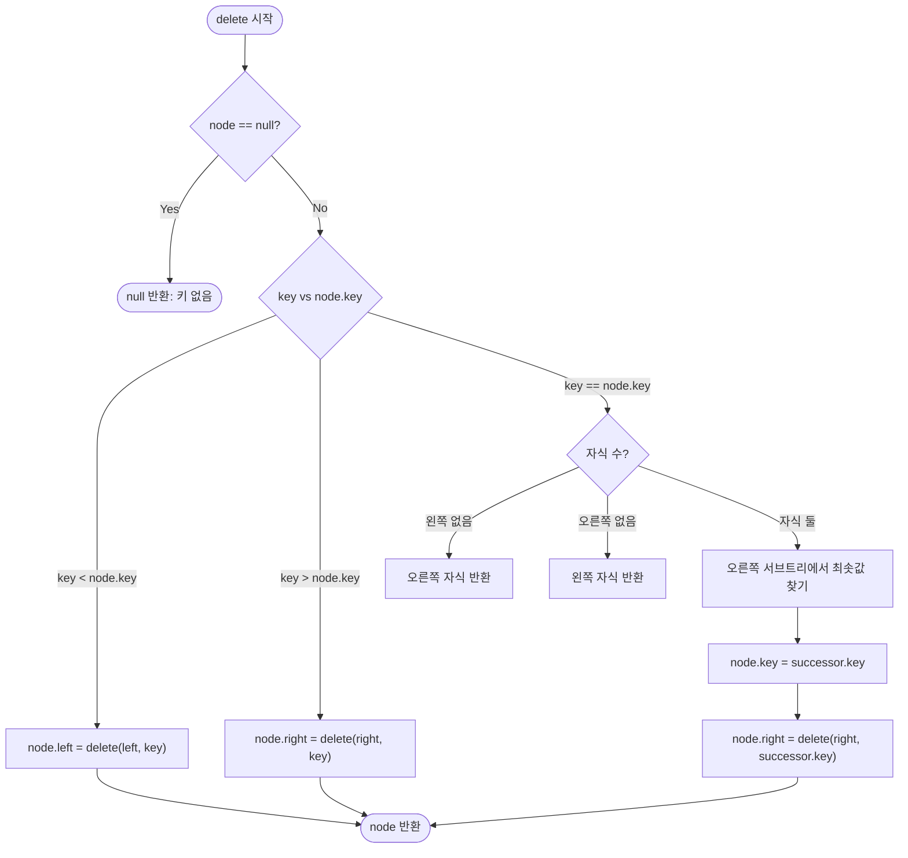

import { AlgorithmSimulation } from "#guide-sim";

# Binary Search Tree 해설

## 성능 목표 예측

| 연산 | 평균 시간복잡도 | 최악 시간복잡도 | 공간복잡도 |
|------|----------------|----------------|-----------|
| `insert` | $O(\log n)$ | $O(n)$ | $O(h)$ 재귀 스택 |
| `search` | $O(\log n)$ | $O(n)$ | $O(h)$ 재귀 스택 |
| `delete` | $O(\log n)$ | $O(n)$ | $O(h)$ 재귀 스택 |
| `inorder` | $O(n)$ | $O(n)$ | $O(h)$ 재귀 스택 |
| `min` / `max` | $O(h)$ | $O(n)$ | $O(1)$ 반복 시 |
| 전체 공간 | — | $O(n)$ | — |

h는 트리의 높이다. 무작위 삽입 순서에서 기대 높이는 $O(\log n)$이지만, 오름차순 또는 내림차순으로 삽입하면 트리가 한쪽으로만 기울어 h = n이 된다. 이 최악 케이스가 AVL 트리, 레드블랙 트리 같은 자가 균형 트리가 발명된 이유다.

---

## 목표 함수

| 메서드 | 시그니처 | 엣지 케이스 |
|--------|---------|------------|
| `insert` | `(key: number): void` | 중복 키 → 무시 |
| `search` | `(key: number): boolean` | 빈 트리 → `false` |
| `delete` | `(key: number): void` | 없는 키 → 무시; 자식 둘이면 in-order successor 사용 |
| `inorder` | `(): number[]` | 빈 트리 → `[]` |
| `min` | `(): number \| undefined` | 빈 트리 → `undefined` |
| `max` | `(): number \| undefined` | 빈 트리 → `undefined` |

---

## 핵심 아이디어

BST의 핵심은 **BST 성질**이다: 각 노드의 왼쪽 서브트리에는 그 노드보다 작은 키만, 오른쪽 서브트리에는 큰 키만 존재한다. 이 성질 덕분에 탐색이 이진 결정 문제의 연속이 된다 — 찾는 키가 현재 노드보다 크면 오른쪽, 작으면 왼쪽. 최대 h번의 비교로 답을 찾는다. 그리고 중위 순회(왼쪽→현재→오른쪽)가 항상 오름차순을 만들어내는 것도 이 성질의 직접적인 결과다.

---

### 원형 아이디어와 naive 접근

정렬된 배열에서 이진 탐색은 O(log n)이다. 그런데 왜 배열 대신 트리를 쓰는가? 정렬 배열의 이진 탐색을 트리 구조로 "형상화"하면 삽입·삭제를 O(log n)으로 만들 수 있기 때문이다.

배열 `[1, 3, 4, 5, 7]`의 이진 탐색을 시각화해보자. 중간 원소 4가 루트, 그 왼쪽 부분 `[1, 3]`이 왼쪽 서브트리, 오른쪽 `[5, 7]`이 오른쪽 서브트리다. 이것이 정확히 BST의 구조다. 배열은 삽입 시 O(n) 이동이 필요하지만 트리는 포인터만 바꾸면 된다.

---

### 어떤 관찰이 돌파구가 되는가

삭제에서 핵심 돌파구는 **자식이 둘인 경우**다. 단순히 노드를 지워버리면 두 서브트리가 분리되어 BST 성질이 깨진다. 어떤 노드로 대체해야 BST 성질을 유지할 수 있을까?

관찰: 삭제할 노드 v를 대체할 후보는 v보다 바로 크거나 바로 작은 키여야 한다. 그래야 왼쪽 서브트리의 모든 키보다 크고 오른쪽 서브트리의 모든 키보다 작다는 BST 성질이 유지된다.

- v보다 바로 작은 키: **in-order predecessor** = 왼쪽 서브트리의 최댓값
- v보다 바로 큰 키: **in-order successor** = 오른쪽 서브트리의 최솟값

in-order successor는 오른쪽 서브트리에서 왼쪽으로만 따라가면 찾을 수 있다. 이 노드는 왼쪽 자식이 없으므로(있다면 그게 더 작은 값이라 successor가 아님) 삭제가 단순하다(case 1 또는 case 2).

---

### 관찰을 형식화: 상태/구조 정의

```
Node {
  key:   number
  left:  Node | null
  right: Node | null
}

BinarySearchTree {
  root: Node | null
}
```

BST 성질 (불변식):
```
∀ node v:
  ∀ u in v.left's subtree:  u.key < v.key
  ∀ w in v.right's subtree: w.key > v.key
```

이 불변식이 모든 연산 전후로 유지되어야 한다.

---

### 점화식 또는 핵심 연산

**재귀적 삽입**: 함수형 스타일로 표현하면

```
insert(node, key):
  if node == null: return Node(key)
  if key < node.key:  node.left  = insert(node.left, key)
  elif key > node.key: node.right = insert(node.right, key)
  // key == node.key: 중복, node 그대로 반환
  return node
```

**재귀적 삭제**: in-order successor를 이용한 두 자식 처리

```
delete(node, key):
  if node == null: return null
  if key < node.key:
    node.left = delete(node.left, key)
  elif key > node.key:
    node.right = delete(node.right, key)
  else: // 삭제 대상 발견
    if node.left == null: return node.right  // 자식 0 또는 오른쪽만
    if node.right == null: return node.left  // 왼쪽만
    // 자식 둘: in-order successor로 대체
    successor = findMin(node.right)
    node.key = successor.key
    node.right = delete(node.right, successor.key)
  return node
```

**중위 순회**:

```
inorder(node, result):
  if node == null: return
  inorder(node.left, result)
  result.push(node.key)
  inorder(node.right, result)
```

---

### 정당성 — 왜 이것이 옳은가

**삽입 정확성**: 재귀 함수는 항상 "이 서브트리에 key를 삽입한 결과 서브트리의 루트"를 반환한다. 새 노드는 비교 결과에 따라 반드시 BST 성질에 맞는 위치에 삽입되고, 기존 구조의 BST 성질은 변경되지 않는다.

**삭제 정확성 (두 자식 케이스)**: in-order successor s를 선택하면
- s.key > 삭제 노드의 왼쪽 서브트리 모든 키 (s는 삭제 노드보다 크기 때문)
- s.key < 삭제 노드의 오른쪽 서브트리 모든 키 (s는 오른쪽 서브트리 최솟값)

따라서 s.key로 교체해도 BST 성질이 유지된다. s 자신을 삭제할 때는 s의 왼쪽 자식이 없으므로(있었다면 s가 최솟값이 아님) case 1 또는 case 2로 귀결된다.

**중위 순회 오름차순 증명**: BST 불변식 하에서 귀납적으로 증명된다. 왼쪽 서브트리의 모든 키 < 현재 키 < 오른쪽 서브트리의 모든 키이므로, 왼쪽 → 현재 → 오른쪽 순서로 방문하면 항상 증가 순서가 된다.

---

### 구현 디테일과 최적화

1. **재귀 vs 반복**: 삽입과 검색은 반복(iterative)으로 O(1) 스택 공간으로 구현 가능하다. 삭제는 부모 포인터 없이 재귀가 더 간결하다.

2. **부모 포인터 없는 삭제**: 재귀 함수가 "수정된 서브트리의 루트"를 반환하는 방식을 쓰면 부모 포인터를 노드에 저장하지 않아도 된다. 위의 `delete(node, key)` 의사코드가 이 방식이다.

3. **최악 케이스와 자가 균형**: 1, 2, 3, 4, 5 순으로 삽입하면 트리가 오른쪽으로만 기울어 높이 = n인 선형 구조가 된다. 이것이 AVL 트리(높이 차이 ≤ 1 유지)와 레드블랙 트리(색상 규칙으로 높이 ≤ 2 log n 유지)가 발명된 동기다.

4. **min/max 반복 구현**: 재귀보다 반복이 훨씬 간단하고 O(1) 스택을 사용한다.
   ```
   min(): current = root; while current.left != null: current = current.left; return current.key
   max(): current = root; while current.right != null: current = current.right; return current.key
   ```

---

## 시뮬레이션

export const steps = [
  {
    array: [0, 0, 0, 0, 0, 0, 0],
    highlight: [],
    description: "초기 상태: 빈 트리"
  },
  {
    array: [5, 0, 0, 0, 0, 0, 0],
    highlight: [0],
    description: "insert(5): 루트에 5 삽입 (인덱스 0)"
  },
  {
    array: [5, 3, 0, 0, 0, 0, 0],
    highlight: [1],
    description: "insert(3): 3 < 5 → 왼쪽 자식 (인덱스 1)"
  },
  {
    array: [5, 3, 7, 0, 0, 0, 0],
    highlight: [2],
    description: "insert(7): 7 > 5 → 오른쪽 자식 (인덱스 2)"
  },
  {
    array: [5, 3, 7, 1, 0, 0, 0],
    highlight: [3],
    description: "insert(1): 1 < 5 → 왼쪽, 1 < 3 → 왼쪽 (인덱스 3)"
  },
  {
    array: [5, 3, 7, 1, 4, 0, 0],
    highlight: [4],
    description: "insert(4): 4 < 5 → 왼쪽, 4 > 3 → 오른쪽 (인덱스 4)"
  },
  {
    array: [5, 3, 7, 1, 4, 0, 0],
    highlight: [0, 1, 4],
    description: "search(4): 5→왼쪽→3→오른쪽→4 발견 → true"
  },
  {
    array: [5, 4, 7, 1, 0, 0, 0],
    highlight: [1],
    description: "delete(3): 자식 둘 → in-order successor(4)로 대체, 4 원래 자리 제거"
  }
];

<AlgorithmSimulation
  view="array"
  steps={steps}
  title="BST 시뮬레이션 (레벨 순서 배열 표현: index 0=루트, 왼쪽=2i+1, 오른쪽=2i+2, 0=빈 슬롯)"
/>

---

## 수도 코드와 Activity Diagram

### 의사코드

```
class Node:
  key, left = null, right = null

class BinarySearchTree:
  root = null

  insert(key):
    root = _insert(root, key)

  _insert(node, key):
    if node == null: return Node(key)
    if key < node.key:   node.left  = _insert(node.left, key)
    elif key > node.key: node.right = _insert(node.right, key)
    return node  // 중복이면 변경 없이 반환

  search(key):
    current = root
    while current != null:
      if key == current.key: return true
      current = key < current.key ? current.left : current.right
    return false

  delete(key):
    root = _delete(root, key)

  _delete(node, key):
    if node == null: return null
    if key < node.key:
      node.left = _delete(node.left, key)
    elif key > node.key:
      node.right = _delete(node.right, key)
    else:
      if node.left == null: return node.right
      if node.right == null: return node.left
      successor = _findMin(node.right)
      node.key = successor.key
      node.right = _delete(node.right, successor.key)
    return node

  _findMin(node):
    while node.left != null: node = node.left
    return node

  inorder():
    result = []
    _inorder(root, result)
    return result

  _inorder(node, result):
    if node == null: return
    _inorder(node.left, result)
    result.push(node.key)
    _inorder(node.right, result)

  min():
    if root == null: return undefined
    return _findMin(root).key

  max():
    if root == null: return undefined
    node = root
    while node.right != null: node = node.right
    return node.key
```

### Activity Diagram


