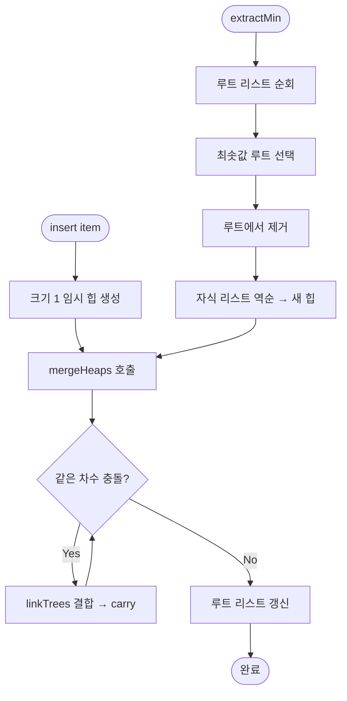

import { AlgorithmSimulation } from "#guide-sim";

# BinomialHeap (이항 힙) 해설

## 성능 목표 예측

| 연산 | Binary Heap | BinomialHeap | 비고 |
|------|------------|--------------|------|
| insert | O(log n) | O(log n) 상각 | 단일 삽입은 유사 |
| extractMin | O(log n) | O(log n) | 동일 |
| peek | O(1) | O(log n) | BH는 루트 스캔 필요 |
| merge | O(n) | **O(log n)** | BH의 핵심 강점 |
| size | O(1) | O(1) | 동일 |

---

## 목표 함수

| 메서드 | 반환 타입 | 엣지케이스 |
|--------|-----------|-----------|
| `insert(item)` | `void` | 빈 힙에도 동작 |
| `extractMin()` | `T \| undefined` | 빈 힙 → `undefined` |
| `peek()` | `T \| undefined` | 빈 힙 → `undefined` |
| `merge(other)` | `BinomialHeap<T>` | 빈 힙과의 병합 가능 |
| `size()` | `number` | 0부터 시작 |
| `isEmpty()` | `boolean` | size === 0과 동치 |

---

## 핵심 아이디어

### 왜 이항 힙이 필요한가

이진 힙은 배열 기반으로 단순하고 캐시 친화적이지만, **두 힙을 합치는 연산이 O(n)**이다. 한쪽 힙의 모든 원소를 다른 힙에 재삽입해야 하기 때문이다.

이항 힙은 여러 개의 이항 트리 리스트로 구성함으로써 **병합을 O(log n)**으로 줄인다.

### 원형 아이디어: 이진수 덧셈

n개의 원소를 가진 힙을 이진수 n으로 표현한다고 상상하자.

- n = 13 = **1101**₂

이는 B₃(8개), B₂(4개), B₀(1개) 세 이항 트리로 구성된다는 의미다.

두 힙을 합칠 때는 이진수 덧셈과 동일하게 같은 차수의 트리를 결합하고, 올림(carry)이 발생하면 다음 차수로 넘긴다.

### 어떤 관찰이 돌파구가 되는가

**핵심 관찰:** 같은 차수 k의 이항 트리 두 개를 합치면 반드시 차수 k+1의 이항 트리 하나가 된다.

- 두 트리의 루트를 비교해 더 작은 루트가 새 루트가 된다.
- 더 큰 루트의 트리는 새 루트의 자식 리스트 맨 앞에 붙는다.

이 결합 연산은 O(1)이며, 총 결합 횟수가 O(log n)이므로 전체 병합이 O(log n)이다.

### 관찰을 형식화: 상태/구조 정의

```ts
class BinomialNode<T> {
  item: T;
  degree: number;         // 자식 수 = 트리 차수
  children: BinomialNode<T>[];  // 자식 리스트 (차수 내림차순)
  parent: BinomialNode<T> | null;
}

class BinomialHeap<T> {
  roots: BinomialNode<T>[];  // 차수 오름차순으로 정렬된 이항 트리 루트 리스트
  _size: number;
  compare: (a: T, b: T) => number;
}
```

**불변식:**
1. `roots[i].degree < roots[i+1].degree` — 루트 리스트는 차수 오름차순
2. 각 이항 트리는 최소 힙 속성 만족 (부모.item ≤ 자식.item)
3. `roots` 리스트 길이 ≤ ⌊log₂(n)⌋ + 1

### 점화식 또는 핵심 연산

**트리 결합 (linkTrees):**
```
linkTrees(t1: BinomialNode, t2: BinomialNode) → BinomialNode:
  if compare(t1.item, t2.item) <= 0:
    t2를 t1.children 맨 앞에 추가
    t1.degree += 1
    return t1
  else:
    t1을 t2.children 맨 앞에 추가
    t2.degree += 1
    return t2
```

**병합 (mergeRoots):**
```
mergeRoots(roots1, roots2) → roots:
  carry = null
  i = 0, j = 0
  while i < len(roots1) or j < len(roots2) or carry != null:
    현재 처리할 트리들을 모아 결합
    carry 발생 시 다음 차수로 이월
```

### 정당성: 왜 이것이 옳은가

이항 힙의 루트 리스트는 항상 서로 다른 차수의 트리들로만 구성된다 (이진수의 각 비트 자리가 0 또는 1이듯). 두 힙을 병합할 때 같은 차수가 충돌하면 결합하여 차수를 올리므로, 최종적으로도 각 차수에 최대 하나의 트리만 남는다.

루트 리스트 길이가 O(log n)이므로 병합, 삽입(= 크기 1 힙과의 병합), extractMin(루트 중 최솟값 탐색 및 자식 분리)이 모두 O(log n)이 된다.

### 구현 디테일과 최적화

- **insert:** 크기 1인 임시 힙을 만들어 현재 힙과 병합한다.
- **peek:** 루트 리스트를 순회하며 최솟값을 반환한다. O(log n).
- **extractMin:** 루트 중 최소를 찾아 제거한 뒤, 그 자식 리스트를 역순으로 뒤집어 새 힙으로 만들고 현재 힙과 병합한다.
- **자식 순서:** 자식은 차수 내림차순으로 저장되어 있으므로, 역순(오름차순)으로 뒤집으면 새 힙의 루트 리스트가 된다.

---

## 시뮬레이션

export const steps = [
  {
    title: "초기 상태",
    detail: "빈 이항 힙. 루트 리스트가 비어 있다.",
    array: [],
    highlight: [],
    marked: [],
  },
  {
    title: "insert(10)",
    detail: "차수 0 이항 트리 B₀[10] 생성. 루트 리스트: [B₀(10)]",
    array: [10],
    highlight: [0],
    marked: [],
  },
  {
    title: "insert(20)",
    detail: "B₀[20] 생성. B₀[10]과 결합 → B₁[10,20]. 루트 리스트: [B₁]",
    array: [10, 20],
    highlight: [0],
    marked: [1],
  },
  {
    title: "insert(5)",
    detail: "B₀[5] 생성. 차수 0은 없으므로 추가. 루트 리스트: [B₀(5), B₁(10,20)]",
    array: [5, 10, 20],
    highlight: [0],
    marked: [1, 2],
  },
  {
    title: "peek()",
    detail: "루트 리스트 [5, 10]을 순회해 최솟값 5를 반환. 힙 불변.",
    array: [5, 10, 20],
    highlight: [0],
    marked: [],
  },
  {
    title: "extractMin()",
    detail: "루트 [5, 10] 중 최소 B₀(5) 제거. 자식 없음. B₁(10,20) 남음. 반환값: 5",
    array: [10, 20],
    highlight: [0],
    marked: [],
  },
];

<AlgorithmSimulation view="array" steps={steps} title="BinomialHeap 삽입/추출 시뮬레이션" />

## 수도 코드와 Activity Diagram

### 의사코드

```
// 두 이항 트리 결합
linkTrees(t1, t2):
  if t1.item <= t2.item:
    t2.parent = t1
    t1.children.prepend(t2)
    t1.degree++
    return t1
  else:
    t1.parent = t2
    t2.children.prepend(t1)
    t2.degree++
    return t2

// 두 루트 리스트 병합 (이진수 덧셈)
mergeHeaps(h1, h2):
  newRoots = []
  carry = null
  i = 0, j = 0
  while i < h1.roots.length or j < h2.roots.length or carry != null:
    candidates = []
    if i < h1.roots.length and h1.roots[i].degree == currentDegree:
      candidates.push(h1.roots[i++])
    if j < h2.roots.length and h2.roots[j].degree == currentDegree:
      candidates.push(h2.roots[j++])
    if carry != null:
      candidates.push(carry); carry = null
    if candidates.length == 1:
      newRoots.push(candidates[0])
    elif candidates.length == 2:
      carry = linkTrees(candidates[0], candidates[1])
    elif candidates.length == 3:
      newRoots.push(candidates[0])
      carry = linkTrees(candidates[1], candidates[2])
    currentDegree++
  return newRoots

// 최솟값 추출
extractMin(heap):
  if heap.isEmpty(): return undefined
  minRoot = heap.roots에서 item이 최소인 트리
  heap.roots에서 minRoot 제거
  childHeap = new BinomialHeap(minRoot.children 역순)
  heap.roots = mergeHeaps(heap, childHeap)
  heap._size--
  return minRoot.item
```

### Activity Diagram


