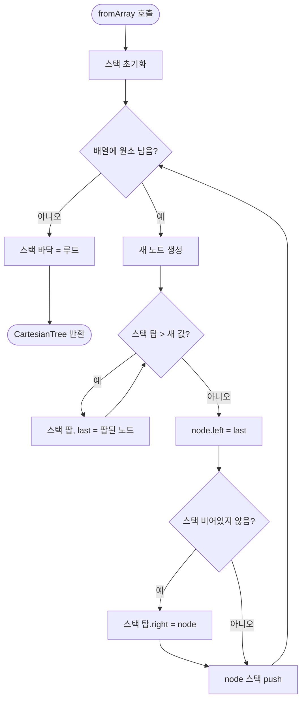

import { AlgorithmSimulation } from "#guide-sim";

# CartesianTree 해설

## 성능 목표 예측

| 연산 | 시간복잡도 |
|------|-----------|
| `fromArray(n)` | O(n) |
| `inOrder()` | O(n) |
| `value()` | O(1) |
| `left() / right()` | O(1) |
| `size()` | O(1) |

O(n²) naive 구성과 달리, 스택 기반 알고리즘은 각 원소가 스택에 최대 한 번 push, 한 번 pop → O(n) 전체.

---

## 목표 함수

| 메서드 | 역할 |
|--------|------|
| `fromArray(arr, cmp)` | 스택 기반 O(n) 카르테시안 트리 구성 |
| `value()` | 루트 노드 값 반환 |
| `left() / right()` | 서브트리를 CartesianTree로 래핑하여 반환 |
| `inOrder()` | 중위 순회 (= 원배열 복원) |
| `size()` | 노드 수 |

---

## 핵심 아이디어

### 원형 아이디어와 naive 접근

배열 `arr`에서 카르테시안 트리를 구성하는 naive 방법:
1. 최솟값을 찾아 루트로 설정 → O(n)
2. 최솟값 왼쪽 배열로 재귀, 오른쪽 배열로 재귀

이 방법은 O(n²) 최악 (이미 정렬된 배열에서 매번 최솟값을 찾아야 함).

### 어떤 관찰이 돌파구가 되는가

**핵심 관찰**: 카르테시안 트리를 왼쪽부터 오른쪽으로 구성할 때, 새 원소를 삽입하는 위치는 항상 "오른쪽 경계(rightmost path)"에 있다.

왜냐하면 BST 성질에 의해 새 원소는 이미 삽입된 모든 원소의 오른쪽에 있어야 하고, 따라서 현재 루트의 오른쪽 자식, 그 오른쪽 자식, ... 경로에만 삽입될 수 있다.

**스택으로 오른쪽 경계를 O(1) 유지**: 스택이 항상 현재 오른쪽 경계를 유지하도록 하면 새 원소 삽입이 O(1) 상각이 된다.

### 관찰을 형식화: 상태/구조 정의

```ts
// CartesianTree는 불변(immutable) 트리 노드
class CartesianNode<T> {
  value: T;
  left:  CartesianNode<T> | undefined;
  right: CartesianNode<T> | undefined;
}

// fromArray 내부 스택
const stack: CartesianNode<T>[] = [];
// 불변: 스택에 있는 노드들은 위에서 아래로 값이 단조 증가
//       (min-heap 기준, 루트에 가까울수록 작은 값)
```

### 핵심 연산 — 스택 기반 구성

```ts
static fromArray<T>(arr: T[], cmp = defaultCmp): CartesianTree<T> {
  const stack: CartesianNode<T>[] = [];

  for (const v of arr) {
    const node = new CartesianNode(v);
    let last: CartesianNode<T> | undefined;

    // 새 값보다 큰 스택 탑을 팝 → 새 노드의 왼쪽 자식으로
    while (stack.length > 0 && cmp(v, stack[stack.length-1]!.value) < 0) {
      last = stack.pop();
    }
    node.left = last;  // 팝된 마지막 노드가 새 노드의 왼쪽 자식

    // 스택에 원소가 있으면 스택 탑의 오른쪽 자식으로 연결
    if (stack.length > 0) {
      stack[stack.length-1]!.right = node;
    }

    stack.push(node);
  }

  // 스택의 바닥이 루트
  return new CartesianTree(stack[0], arr.length, cmp);
}
```

**단계별 예시** (`[5, 10, 40, 10, 20]`, min-heap):

| 원소 | 스택 상태 | 연결 |
|------|----------|------|
| 5 | [5] | — |
| 10 | [5, 10] | 5.right = 10 |
| 40 | [5, 10, 40] | 10.right = 40 |
| 10' | [5, 10'] | 40 팝 → 10'.left = 40; 10.right = 10' |
| 20 | [5, 10', 10, 20] → [5, 10', 20] | ... |

아! 실제 처리 시 중복 값은 기존 노드 아래에 배치된다 (comparator가 `<` 이므로 같은 값은 팝하지 않음).

### 정당성 — 두 성질의 보존

**BST 성질**: 새 원소를 항상 오른쪽 경계에 삽입하므로, 중위 순회가 배열 순서를 보존한다.

**힙 성질**: 팝 조건이 `cmp(new, top) < 0` (새 값이 더 작음)이므로, 스택에 남은 원소들은 항상 새 원소보다 작거나 같다. 따라서 부모 ≤ 자식 관계가 유지된다.

**유일성**: 두 성질을 모두 만족하는 트리는 배열마다 유일하다. (귀납적으로 증명 가능)

### 구현 디테일과 최적화

- **같은 값 처리**: comparator가 `<` 기준이면 같은 값은 팝하지 않아 먼저 등장한 원소가 더 높이 위치. 이는 BST 성질(인덱스 순서)을 유지하는 자연스러운 처리다.
- **CartesianTree 래핑**: 내부 `CartesianNode`를 외부에 노출하지 않고 `CartesianTree`로 래핑하여 인터페이스를 통일.
- **left/right 반환 시 size 계산**: 서브트리 size를 노드에 저장하거나 생성 시점에 계산.
- **inOrder**: 일반 중위 순회 재귀 또는 스택 기반 반복으로 구현.

---

## 시뮬레이션

export const steps = [
  {
    title: "시작 — 빈 스택",
    detail: "배열 [5, 10, 40, 10, 20]을 왼쪽부터 처리. 스택은 오른쪽 경계를 유지.",
    array: [],
    highlight: [],
    marked: [],
  },
  {
    title: "처리: 5",
    detail: "스택 비어있음 → 5를 push. 스택: [5]. 5가 현재 루트 후보.",
    array: [5],
    highlight: [0],
    marked: [],
  },
  {
    title: "처리: 10",
    detail: "5 < 10 → 팝 없음. 5.right = 10. 스택: [5, 10].",
    array: [5, 0, 10],
    highlight: [2],
    marked: [0],
  },
  {
    title: "처리: 40",
    detail: "10 < 40 → 팝 없음. 10.right = 40. 스택: [5, 10, 40].",
    array: [5, 0, 10, 0, 0, 0, 40],
    highlight: [6],
    marked: [0, 2],
  },
  {
    title: "처리: 10(새) — 팝 발생",
    detail: "40 > 10 → 40 팝. last=40. 스택 탑=10 > 10 → 10도 팝. last=10. 스택 탑=5 < 10 → 중단.",
    array: [5, 0, 10, 0, 0, 0, 40],
    highlight: [6, 2],
    marked: [],
  },
  {
    title: "10(새) 삽입",
    detail: "10(새).left = last(=10전). 5.right = 10(새). 스택: [5, 10(새)].",
    array: [5, 0, 10, 10, 0, 40],
    highlight: [2],
    marked: [0, 3, 5],
  },
  {
    title: "처리: 20",
    detail: "10 < 20 → 팝 없음. 10(새).right = 20. 스택: [5, 10(새), 20].",
    array: [5, 0, 10, 10, 0, 40, 0, 0, 20],
    highlight: [8],
    marked: [0, 2, 3, 5],
  },
  {
    title: "완성 — 루트는 스택[0] = 5",
    detail: "카르테시안 트리 완성. inOrder = [5, 10, 40, 10, 20]. 힙 성질: 5 ≤ 10 ≤ {40, 10} ≤ 20.",
    array: [5, 0, 10, 10, 0, 40, 0, 0, 20],
    highlight: [0],
    marked: [0, 2, 3, 5, 8],
  },
];

<AlgorithmSimulation view="array" steps={steps} title="카르테시안 트리 구성 — 스택 기반 O(n)" />

---

## 수도 코드와 Activity Diagram

### 의사코드

```
function fromArray(arr, cmp):
  stack = []
  for v in arr:
    node = new Node(v)
    last = undefined
    while stack not empty and cmp(v, stack.top.value) < 0:
      last = stack.pop()
    node.left = last
    if stack not empty:
      stack.top.right = node
    stack.push(node)
  root = stack.bottom  // 스택의 가장 아래 = 루트
  return new CartesianTree(root)
```

### Activity Diagram


