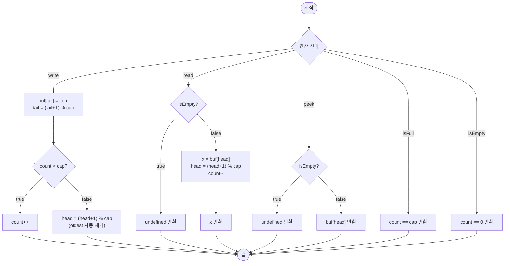

import { AlgorithmSimulation } from "#guide-sim";

# CircularBuffer 해설

## 성능 목표 예측

| 제약 항목 | 값 |
|-----------|-----|
| 버퍼 용량 | $1 \leq \text{capacity} \leq 10^6$ |
| 총 연산 수 | $\leq 10^6$ |
| write / read / peek | O(1) |
| 내부 배열 크기 | 고정 (capacity) |

**naive 접근의 문제점**: 동적 배열에서 `splice(0, 1)`로 앞을 지우면 O(n) 시프트. 10^6회 write 시 총 O(n^2) → 1초 초과.

**목표 복잡도**: write / read / peek 모두 **O(1)** — 인덱스 모듈러 연산으로 포인터를 순환시켜 시프트를 완전히 제거.

---

## 목표 함수

```ts
export class CircularBuffer<T> {
  constructor(capacity: number)
  write(item: T): void
  read(): T | undefined
  peek(): T | undefined
  isFull(): boolean
  isEmpty(): boolean
  size(): number
}
```

| 메서드 | 의미 | 제약 |
|--------|------|------|
| `write(item)` | 새 항목 쓰기, 오버플로우 시 oldest 덮어씀 | O(1) |
| `read()` | oldest 제거 후 반환 | 비어있으면 `undefined` |
| `peek()` | oldest 조회 | 비어있으면 `undefined` |
| `isFull()` | `count === capacity` | — |
| `isEmpty()` | `count === 0` | — |
| `size()` | 현재 원소 수 | — |

**엣지케이스**:
1. capacity=1인 버퍼 — write 두 번째부터 매번 덮어씀
2. 꽉 찬 상태에서 `write` → oldest가 자동 제거되고 새 항목이 삽입됨
3. 빈 상태에서 `read()` / `peek()` → `undefined`
4. write N번 → read N번 → 다시 write — 버퍼 재사용이 올바르게 동작해야 함

---

## 핵심 아이디어

**핵심 아이디어**: "고정 배열 + `head` / `tail` 포인터 + 모듈러 연산으로 배열을 원형으로 순환시킨다. 시프트 없이 O(1)."

**풀이 구조**
1. `buf: T[]` — 크기 `capacity`인 고정 배열
2. `head: number = 0` — 읽을 위치 (oldest)
3. `tail: number = 0` — 쓸 위치 (next empty slot)
4. `count: number = 0` — 현재 원소 수
5. `write(x)`:
   - `buf[tail] = x`
   - `tail = (tail + 1) % capacity`
   - `count < capacity` 이면 `count++`, 아니면 `head = (head + 1) % capacity` (oldest 자동 제거)
6. `read()`: `x = buf[head]`, `head = (head + 1) % capacity`, `count--`, return x
7. `peek()`: `buf[head]`

**언제 쓰나**: 스트리밍 로그 유지, 오디오/비디오 버퍼, 네트워크 패킷 버퍼, 슬라이딩 윈도우 최근 N개 유지.

---

### 원형 아이디어와 naive 접근

배열 앞을 자르는 splice 대신, "어디가 앞인지"를 포인터로 기억한다. 배열 끝에 닿으면 인덱스를 0으로 되감는다. 이것이 "원형(Circular)" 버퍼의 핵심이다.

### 어떤 관찰이 돌파구가 되는가

`(index + 1) % capacity` 연산 하나로 배열의 끝과 처음을 연결할 수 있다. 이 단순한 모듈러 연산이 무한 원형 테이프를 유한 배열로 시뮬레이션한다.

### 관찰을 형식화: 상태/구조 정의

```
buf: T[capacity]   // 고정 크기 배열
head: number       // oldest 원소 인덱스
tail: number       // 다음 쓸 위치 인덱스
count: number      // 현재 원소 수 (0 ~ capacity)

불변식: 0 <= head, tail < capacity
        count == 0 이면 isEmpty
        count == capacity 이면 isFull
```

### 점화식 또는 핵심 연산

```
write(x):
  buf[tail] = x
  tail = (tail + 1) % capacity
  if count < capacity:
    count++
  else:                          // 오버플로우
    head = (head + 1) % capacity // oldest 제거

read():
  if count == 0: return undefined
  x = buf[head]
  head = (head + 1) % capacity
  count--
  return x
```

### 정당성 — 왜 이것이 옳은가

- `tail = (tail + 1) % capacity`는 항상 유효 인덱스 범위 `[0, capacity)` 내에 있음.
- 오버플로우 시 `head`도 같이 전진해 logical oldest가 new write 위치로 이동함.
- `count`로 full/empty를 구별하므로 head == tail 모호성(full vs empty) 없음.
- 각 write / read는 덧셈 + 모듈러 2번 → O(1) 보장.

### 구현 디테일과 최적화

- TypeScript에서 고정 배열: `new Array<T | undefined>(capacity)` 또는 `Array.from({ length: capacity })`.
- `noUncheckedIndexedAccess`로 `buf[head]`는 `T | undefined`가 되므로 read 전에 `count > 0` 체크 필수.
- 비트 연산 최적화: capacity가 2의 거듭제곱이면 `(index + 1) % capacity` 대신 `(index + 1) & (capacity - 1)` 사용 가능.

---

## 시뮬레이션

capacity=3 버퍼에 write(1) → write(2) → write(3) → write(4, 오버플로우) → read() 순서를 확인한다.

export const steps = [
  {
    title: "초기 상태 (capacity=3)",
    detail: "head=0, tail=0, count=0. 빈 버퍼. buf = [_, _, _]",
    array: [0, 0, 0],
    highlight: [],
    marked: [],
  },
  {
    title: "write(1) — buf[0]=1, tail→1",
    detail: "tail 위치(0)에 1 저장. tail=(0+1)%3=1. count=1",
    array: [1, 0, 0],
    highlight: [0],
    marked: [],
  },
  {
    title: "write(2) — buf[1]=2, tail→2",
    detail: "tail 위치(1)에 2 저장. tail=(1+1)%3=2. count=2",
    array: [1, 2, 0],
    highlight: [1],
    marked: [0],
  },
  {
    title: "write(3) — buf[2]=3, tail→0 (순환)",
    detail: "tail 위치(2)에 3 저장. tail=(2+1)%3=0. count=3. isFull=true",
    array: [1, 2, 3],
    highlight: [2],
    marked: [0, 1],
  },
  {
    title: "write(4) — 오버플로우! buf[0]=4, head→1",
    detail: "꽉 찼으므로 oldest(1)를 덮어씀. tail=0→1, head=0→1. count=3 유지.",
    array: [4, 2, 3],
    highlight: [0],
    marked: [1, 2],
  },
  {
    title: "read() → 2 반환 (oldest)",
    detail: "head(1) 위치의 2를 반환. head=1→2. count=2.",
    array: [4, 0, 3],
    highlight: [],
    marked: [0, 2],
  },
];

<AlgorithmSimulation view="array" steps={steps} title="CircularBuffer 시뮬레이션" />

## 수도 코드와 Activity Diagram

### 의사코드

```
class CircularBuffer<T>(capacity):
  buf: (T|undefined)[] = new Array(capacity)
  head = 0       // oldest 위치. 불변식: 0 <= head < capacity
  tail = 0       // 다음 쓸 위치. 불변식: 0 <= tail < capacity
  count = 0      // 불변식: 0 <= count <= capacity

  write(item):
    buf[tail] = item
    tail = (tail + 1) % capacity
    if count < capacity:
      count++                        // 빈 자리가 있었음
    else:
      head = (head + 1) % capacity   // oldest 자동 제거

  read():
    if count == 0: return undefined
    x = buf[head]
    buf[head] = undefined            // GC 도움
    head = (head + 1) % capacity
    count--
    return x

  peek():
    if count == 0: return undefined
    return buf[head]

  isFull():  return count == capacity
  isEmpty(): return count == 0
  size():    return count
```

### Activity Diagram


