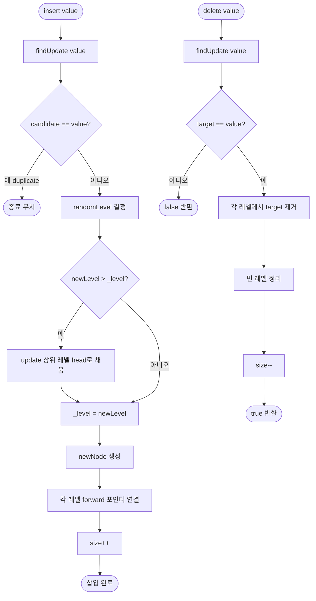

import { AlgorithmSimulation } from "#guide-sim";

# ConcurrentSkipList 해설

## 성능 목표 예측

| 연산 | 정렬 배열 | BST (균형) | 스킵 리스트 (평균) | 스킵 리스트 (최악) |
|------|----------|-----------|-------------------|-------------------|
| 삽입 | O(n)     | O(log n)  | O(log n)          | O(n)              |
| 삭제 | O(n)     | O(log n)  | O(log n)          | O(n)              |
| 탐색 | O(log n) | O(log n)  | O(log n)          | O(n)              |
| min/max | O(1)  | O(log n)  | O(1)              | O(1)              |

최악(O(n))은 랜덤 레벨이 극단적으로 편향될 때이며, 기대 확률은 극히 낮습니다.

---

## 목표 함수

| 메서드 | 설명 | 복잡도 |
|--------|------|--------|
| `insert(value)` | 삽입, 중복 무시 | O(log n) 평균 |
| `delete(value)` | 제거, 없으면 false | O(log n) 평균 |
| `has(value)` | 존재 여부 | O(log n) 평균 |
| `min()` / `max()` | 최솟값 / 최댓값 | O(1) |
| `toArray()` | 레벨 0 순회 | O(n) |
| `size()` | 원소 수 | O(1) |

---

## 핵심 아이디어

### 원형 아이디어와 naive 접근

정렬된 연결 리스트는 삽입 위치를 찾는 데 O(n)이 걸립니다. 한 번에 여러 노드를 건너뛸 수 없기 때문입니다.

### 어떤 관찰이 돌파구가 되는가

**관찰**: 상위 레벨에서는 듬성듬성한 "인덱스"처럼 사용하면 크게 건너뛸 수 있습니다. 마치 고속도로(상위 레벨) → 국도(중간 레벨) → 골목길(레벨 0) 순으로 탐색하는 것과 같습니다.

각 노드는 확률 p=0.5로 상위 레벨에도 포함됩니다. 기댓값으로 레벨 k에는 n/2^k개의 노드가 있습니다.

### 관찰을 형식화

**스킵 리스트 구조**:

```
레벨 2: [Head] --------------------> [3] ---------> [Tail]
레벨 1: [Head] -----> [1] --------> [3] -> [7] ---> [Tail]
레벨 0: [Head] -> [1] -> [2] -> [3] -> [5] -> [7] -> [9] -> [Tail]
```

- 레벨 0은 모든 원소를 담은 정렬된 연결 리스트
- 레벨 k는 레벨 k-1의 부분 집합 (각 원소가 p=0.5 확률로 포함)
- Head는 모든 레벨에서 시작점, Tail은 모든 레벨에서 끝점 (sentinel)

### 핵심 연산

**탐색 (has)**:
```ts
has(value) {
  let current = head;
  for (let level = this._level - 1; level >= 0; level--) {
    while (current.forward[level] !== tail &&
           comparator(current.forward[level].value, value) < 0) {
      current = current.forward[level];
    }
  }
  const candidate = current.forward[0];
  return candidate !== null && candidate !== tail &&
         comparator(candidate.value, value) === 0;
}
```

**findUpdate — 삽입/삭제 공통 준비 단계**:
```ts
findUpdate(value) {
  const update: SkipNode<T>[] = new Array(maxLevel).fill(head);
  let current = head;
  for (let level = this._level - 1; level >= 0; level--) {
    while (current.forward[level] !== tail &&
           comparator(current.forward[level].value!, value) < 0) {
      current = current.forward[level];
    }
    update[level] = current;
  }
  return update;
}
```

**insert**:
```ts
insert(value) {
  const update = findUpdate(value);
  const candidate = update[0].forward[0];
  if (candidate !== tail && comparator(candidate.value!, value) === 0) return; // 중복

  const newLevel = randomLevel();
  if (newLevel > this._level) {
    for (let i = this._level; i < newLevel; i++) update[i] = head;
    this._level = newLevel;
  }

  const newNode = { value, forward: new Array(newLevel).fill(null) };
  for (let i = 0; i < newLevel; i++) {
    newNode.forward[i] = update[i].forward[i];
    update[i].forward[i] = newNode;
  }
  this._size++;
}
```

**delete**:
```ts
delete(value) {
  const update = findUpdate(value);
  const target = update[0].forward[0];
  if (!target || target === tail || comparator(target.value!, value) !== 0) return false;

  for (let i = 0; i < this._level; i++) {
    if (update[i].forward[i] !== target) break;
    update[i].forward[i] = target.forward[i];
  }
  // 빈 레벨 정리
  while (this._level > 1 && head.forward[this._level - 1] === tail) {
    this._level--;
  }
  this._size--;
  return true;
}
```

### 정당성

레벨 k의 기대 노드 수는 n·(1/2)^k. 탐색 시 각 레벨에서 건너뛰는 평균 거리는 2입니다. 총 레벨은 log₂n이므로 기대 비교 횟수는 O(log n).

randomLevel의 확률적 균형 덕분에 특정 입력에 편향되지 않습니다 (BST와 달리 정렬된 입력에도 안전).

### 구현 디테일과 최적화

1. **Sentinel (Head / Tail)**: 실제 값을 null로 설정한 더미 노드. 경계 조건(빈 리스트, 최솟값/최댓값 삽입) 처리가 단순해짐
2. **min / max**: Head.forward[0]이 최솟값, 레벨 0의 Tail 직전 노드가 최댓값 — O(1)을 위해 별도 tail sentinel 사용
3. **_level 유지**: delete 후 빈 레벨(head.forward[level] === tail)을 정리해 탐색 효율 유지

---

## 시뮬레이션

export const steps = [
  {
    title: "초기 상태",
    detail: "Head(sentinel)와 Tail(sentinel)만 존재. 레벨 0 하나.",
    array: ["Head", "Tail"],
    highlight: [],
    marked: [],
  },
  {
    title: "insert(3) — level=1",
    detail: "randomLevel()=1. update[0]=Head. 3을 레벨 0에 삽입.",
    array: ["Head", 3, "Tail"],
    highlight: [1],
    marked: [],
  },
  {
    title: "insert(1) — level=2",
    detail: "randomLevel()=2. 레벨 1 새로 생성. 1을 레벨 0,1 양쪽에 삽입.",
    array: ["Head", 1, 3, "Tail"],
    highlight: [1],
    marked: [],
  },
  {
    title: "insert(7) — level=1",
    detail: "randomLevel()=1. update[0]=3. 7을 레벨 0에 삽입.",
    array: ["Head", 1, 3, 7, "Tail"],
    highlight: [3],
    marked: [],
  },
  {
    title: "has(3) — 탐색",
    detail: "레벨 1에서 Head → 1(작음) → 3(같음). 레벨 0으로 내려가 확인. true.",
    array: ["Head", 1, 3, 7, "Tail"],
    highlight: [2],
    marked: [],
  },
  {
    title: "delete(1) — 제거",
    detail: "findUpdate: update[1]=Head, update[0]=Head. 레벨 0,1에서 1을 제거.",
    array: ["Head", 3, 7, "Tail"],
    highlight: [],
    marked: [1],
  },
];

<AlgorithmSimulation view="array" steps={steps} title="ConcurrentSkipList — 레벨 0 기준 시뮬레이션" />

## 수도 코드와 Activity Diagram

### 의사코드

```
class ConcurrentSkipList(maxLevel, comparator):
  head = sentinel(null, forward=[null]*maxLevel)
  tail = sentinel(null, forward=[])
  head.forward = [tail]*maxLevel
  level = 1
  size = 0

  randomLevel():
    lvl = 1
    while random() < 0.5 AND lvl < maxLevel:
      lvl++
    return lvl

  findUpdate(value):
    update = [head]*maxLevel
    cur = head
    for lv = level-1 downto 0:
      while cur.forward[lv] != tail AND comparator(cur.forward[lv].value, value) < 0:
        cur = cur.forward[lv]
      update[lv] = cur
    return update

  insert(value):
    update = findUpdate(value)
    candidate = update[0].forward[0]
    if candidate != tail AND comparator(candidate.value, value) == 0: return  // 중복
    lvl = randomLevel()
    if lvl > level:
      for i = level to lvl-1: update[i] = head
      level = lvl
    node = newNode(value, lvl)
    for i = 0 to lvl-1:
      node.forward[i] = update[i].forward[i]
      update[i].forward[i] = node
    size++

  delete(value):
    update = findUpdate(value)
    target = update[0].forward[0]
    if target == tail OR comparator(target.value, value) != 0: return false
    for i = 0 to level-1:
      if update[i].forward[i] != target: break
      update[i].forward[i] = target.forward[i]
    while level > 1 AND head.forward[level-1] == tail: level--
    size--
    return true
```

### Activity Diagram



---

## Java ConcurrentSkipListMap과의 비교

| 특성 | 이 구현 | Java ConcurrentSkipListMap |
|------|---------|---------------------------|
| 스레드 안전 | 단일 스레드 | lock-free, 멀티스레드 |
| 알고리즘 | 기본 스킵 리스트 | CAS 기반 lock-free |
| 중복 | 무시 (Set) | 키-값 쌍 (Map) |
| 범위 쿼리 | toArray 후 필터 | subMap, headMap, tailMap |

Java 구현은 `AtomicMarkableReference`로 삭제 마킹(logical delete) 후 물리적 제거를 분리해, 동시 읽기 중에도 안전한 삭제를 보장합니다. 이 연습 구현은 그 인터페이스와 평균 성능을 단일 스레드에서 재현합니다.
