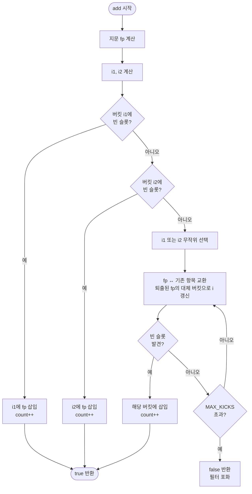

import { AlgorithmSimulation } from "#guide-sim";

# CuckooFilter 해설

## 성능 목표 예측

| 연산 | 시간복잡도 | 설명 |
|------|-----------|------|
| `add` | O(1) 평균 | 재배치 체인이 짧을 때. 최악 O(용량) |
| `has` | O(1) | 두 버킷만 확인 |
| `delete` | O(1) | 두 버킷에서 지문 탐색 |
| `size` | O(1) | 카운터 반환 |
| `loadFactor` | O(1) | 카운터 / 전체 슬롯 수 |

---

## 목표 함수

| 메서드 | 입력 | 출력 | 불변식 |
|--------|------|------|--------|
| `add(item)` | 문자열 | `boolean` | 성공 후 `has(item) === true` |
| `has(item)` | 문자열 | `boolean` | false negative 없음 |
| `delete(item)` | 문자열 | `boolean` | 성공 후 `has(item) === false` |
| `size()` | — | `number` | add 성공마다 +1, delete 성공마다 -1 |
| `loadFactor()` | — | `[0,1]` | `size() / (numBuckets * bucketSize)` |

---

## 핵심 아이디어

### 원형 아이디어와 naive 접근

가장 단순한 멤버십 필터는 해시 집합(`Set<string>`)이다. 정확하지만 원소 하나에 수십 바이트를 쓴다. BloomFilter는 비트 배열로 메모리를 극적으로 줄이지만 삭제를 지원하지 않는다. 여러 원소가 같은 비트를 공유하기 때문이다.

### 어떤 관찰이 돌파구가 되는가

**지문(fingerprint)만 저장하면 어떨까?** 원소 전체 대신 짧은 해시값만 버킷에 넣는다면 공간을 절약하면서도 슬롯 단위 삭제가 가능하다. 문제는 "두 번째 버킷 위치를 어떻게 계산하느냐"다. 원소 자체가 없으면 `hash(item)`을 다시 부를 수 없다.

**XOR 대칭성**이 해결책이다:

```
bucket2 = bucket1 XOR hash(fingerprint)
```

`bucket2`에 있는 항목의 `bucket1`을 복원하려면:

```
bucket1 = bucket2 XOR hash(fingerprint)
```

두 번째 버킷에 있을 때도 지문만으로 첫 번째 버킷을 알 수 있다. 이것이 CuckooFilter의 핵심이다.

### 관찰을 형식화: 상태/구조 정의

```
BucketArray = Array<Array<number | null>>
  // [numBuckets][bucketSize] 크기의 2차원 배열
  // 각 슬롯에는 fingerprint(0이 아닌 정수) 또는 null 저장

numBuckets  = capacity / bucketSize (2의 거듭제곱으로 올림)
bucketSize  = 4 (고정 — 통상적인 최적값)
fpMask      = (1 << fingerprintSize) - 1
```

### 점화식 또는 핵심 연산

**지문 계산:**
```
fp = fnv1a(item) & fpMask
if fp === 0: fp = 1  // 0은 "빈 슬롯" 표시자이므로 금지
```

**두 버킷 인덱스:**
```
i1 = fnv1a(item) % numBuckets
i2 = (i1 XOR fnv1a(fp)) % numBuckets
```

**삽입:**
```
insert(item):
  fp = fingerprint(item)
  i1, i2 = bucketIndices(item)
  if bucket[i1] has empty slot: place fp in i1; return true
  if bucket[i2] has empty slot: place fp in i2; return true
  // 재배치
  i = random choice of {i1, i2}
  for k in 0..MAX_KICKS:
    swap fp with random entry in bucket[i]
    i = i XOR fnv1a(fp) % numBuckets  // 퇴출된 항목의 대체 버킷
    if bucket[i] has empty slot: place fp; return true
  return false  // 필터 포화
```

### 정당성 — 왜 이것이 옳은가

- **false negative 없음**: 삽입 성공 후 `fp`는 `i1` 또는 `i2` 중 하나에 반드시 존재한다. `has`는 두 버킷을 모두 확인하므로 놓칠 수 없다.
- **false positive 가능**: 다른 원소가 우연히 같은 `fp`와 같은 버킷 인덱스를 가지면 잘못된 `true` 반환. 확률 ≈ `2 * bucketSize / 2^fingerprintSize`.
- **삭제 안전성**: 같은 지문이 두 개 이상 있을 수 있으므로, 삭제 시 슬롯 하나만 제거한다. 중복 삽입이 여러 번 되면 그만큼 여러 번 삭제해야 온전히 제거된다.

### 구현 디테일과 최적화

1. **해시 함수**: FNV-1a 또는 MurmurHash3이 적합하다. JavaScript 정수 범위를 감안해 32비트 연산으로 처리한다.
2. **`numBuckets`는 2의 거듭제곱**: `% numBuckets` 대신 `& (numBuckets - 1)` 비트 마스크로 나머지 연산 속도를 높인다.
3. **`MAX_KICKS`**: 통상 500으로 설정. 부하율 95% 이상에서 재배치 실패 확률이 급증한다.
4. **버킷 크기 4**: 캐시 라인 친화적이고 부하율 95%까지 허용한다.

---

## 시뮬레이션

export const steps = [
  {
    title: "초기 상태",
    detail: "버킷 4개, 각 버킷 크기 2. 모든 슬롯이 비어 있다(0).",
    array: [0, 0, 0, 0, 0, 0, 0, 0],
    highlight: [],
    marked: [],
  },
  {
    title: "add('hello') — 지문 계산",
    detail: "fingerprint('hello') = 0xAB. i1 = hash('hello') % 4 = 1, i2 = 1 XOR hash(0xAB) % 4 = 3",
    array: [0, 0, 0, 0, 0, 0, 0, 0],
    highlight: [2, 3, 6, 7],
    marked: [],
  },
  {
    title: "add('hello') — 버킷 1에 삽입",
    detail: "버킷 1의 슬롯 0이 비어 있어 지문 0xAB를 삽입한다.",
    array: [0, 0, 171, 0, 0, 0, 0, 0],
    highlight: [2],
    marked: [2],
  },
  {
    title: "add('world') — 버킷 1이 가득 참",
    detail: "fingerprint('world') = 0xCD. i1 = 1, i2 = 2. 버킷 1 슬롯 1에 삽입.",
    array: [0, 0, 171, 205, 0, 0, 0, 0],
    highlight: [2, 3],
    marked: [2, 3],
  },
  {
    title: "add('foo') — 충돌, 재배치(Kick)",
    detail: "fingerprint('foo') = 0xEF. i1 = 1 — 버킷 1이 가득 참. 0xAB를 버킷 3으로 쫓아내고 0xEF 삽입.",
    array: [0, 0, 239, 205, 0, 0, 171, 0],
    highlight: [2, 6],
    marked: [2, 3, 6],
  },
  {
    title: "has('hello') — 두 버킷 확인",
    detail: "i1 = 1, i2 = 3. 버킷 3 슬롯 0에 0xAB가 있다 → true 반환.",
    array: [0, 0, 239, 205, 0, 0, 171, 0],
    highlight: [2, 3, 6, 7],
    marked: [6],
  },
  {
    title: "delete('hello') — 지문 제거",
    detail: "버킷 3에서 0xAB를 찾아 제거. has('hello')는 이제 false.",
    array: [0, 0, 239, 205, 0, 0, 0, 0],
    highlight: [6],
    marked: [2, 3],
  },
];

<AlgorithmSimulation view="array" steps={steps} title="CuckooFilter 시뮬레이션 (버킷 4개, 슬롯 2개)" />

## 수도 코드와 Activity Diagram

### 의사코드

```
class CuckooFilter(capacity, fingerprintSize):
  numBuckets = nextPowerOfTwo(capacity / 4)
  buckets    = 2D array [numBuckets][4], filled with null
  count      = 0
  fpMask     = (1 << fingerprintSize) - 1
  MAX_KICKS  = 500

  fingerprint(item):
    fp = fnv1a(item) & fpMask
    return fp if fp != 0 else 1

  indices(item):
    fp = fingerprint(item)
    i1 = fnv1a(item) & (numBuckets - 1)
    i2 = (i1 XOR (fnv1a(fp) & (numBuckets - 1))) & (numBuckets - 1)
    return i1, i2

  add(item):
    fp = fingerprint(item)
    i1, i2 = indices(item)
    if buckets[i1] has null slot:
      place fp there; count++; return true
    if buckets[i2] has null slot:
      place fp there; count++; return true
    i = random(i1, i2)
    for _ in 0..MAX_KICKS:
      swap fp with random slot in buckets[i]
      i = (i XOR (fnv1a(fp) & (numBuckets - 1))) & (numBuckets - 1)
      if buckets[i] has null slot:
        place fp there; count++; return true
    return false

  has(item):
    fp = fingerprint(item)
    i1, i2 = indices(item)
    return fp in buckets[i1] OR fp in buckets[i2]

  delete(item):
    fp = fingerprint(item)
    i1, i2 = indices(item)
    if fp in buckets[i1]: remove one fp from i1; count--; return true
    if fp in buckets[i2]: remove one fp from i2; count--; return true
    return false
```

### Activity Diagram


