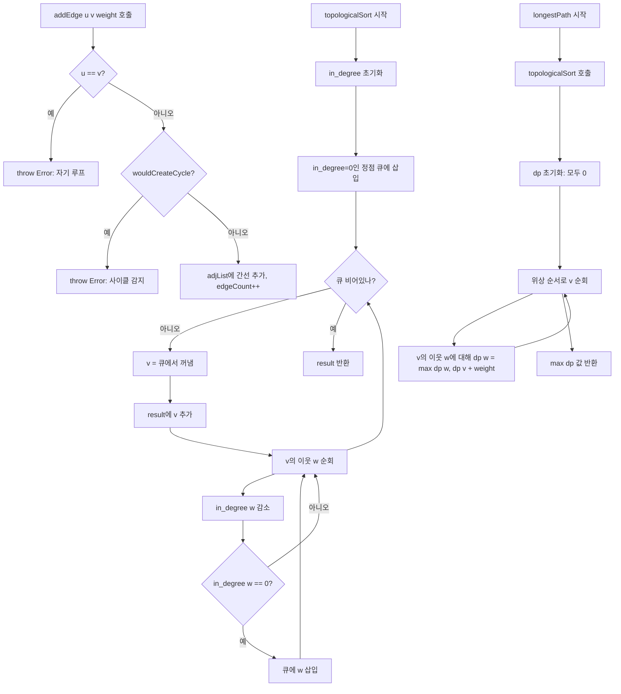

import { AlgorithmSimulation } from "#guide-sim";

# DAG 해설

## 성능 목표 예측

| 연산 | 복잡도 | 비고 |
|---|---|---|
| addVertex | O(1) | 해시맵 삽입 |
| addEdge | O(V+E) | 사이클 감지 포함 |
| topologicalSort | O(V+E) | Kahn's algorithm |
| longestPath | O(V+E) | 위상 순서 DP |
| hasCycle | O(1) | addEdge에서 이미 차단 |
| vertexCount | O(1) | 카운터 |
| edgeCount | O(1) | 카운터 |

---

## 목표 함수

| 메서드 | 입력 | 출력 | 시간복잡도 |
|---|---|---|---|
| `addVertex(v)` | 정점 번호 | void | O(1) |
| `addEdge(u, v, w?)` | 두 정점, 가중치 | void / throw | O(V+E) |
| `topologicalSort()` | — | 정렬된 정점 배열 | O(V+E) |
| `longestPath()` | — | 최장 가중치 합 | O(V+E) |
| `hasCycle()` | — | boolean (항상 false) | O(1) |
| `vertexCount()` | — | 정점 수 | O(1) |
| `edgeCount()` | — | 간선 수 | O(1) |

---

## 핵심 아이디어

### 원형 아이디어와 naive 접근

빌드 태스크를 나열하는 가장 단순한 방법: 모든 의존성이 해결될 때까지 반복하며 실행 가능한 태스크를 찾는다. 이는 O(V²)이고 사이클 검출도 복잡하다.

### 어떤 관찰이 돌파구가 되는가

**관찰 1**: "의존하는 게 없는 태스크부터 실행하면 된다" — 즉, 진입 차수(in-degree)가 0인 정점.

**관찰 2**: 한 태스크를 완료하면 그 태스크에 의존하던 다른 태스크들의 진입 차수가 줄어든다. 줄어서 0이 되면 실행 가능해진다.

**관찰 3**: 모든 태스크를 처리한 뒤에도 처리되지 않은 태스크가 있다면 사이클이 존재한다.

### 관찰을 형식화

**Kahn's Algorithm**:
```
1. in_degree[v] = v로 들어오는 간선 수 계산
2. in_degree=0인 모든 정점 큐에 삽입
3. while 큐 not empty:
   v = 큐에서 꺼냄
   result에 v 추가
   v의 이웃 w 각각:
     in_degree[w] -= 1
     if in_degree[w] == 0: 큐에 w 삽입
4. result 길이 < V이면 사이클 존재
```

### 핵심 연산 — 최장 경로 DP

위상 정렬 순서로 처리하면 각 정점에 도달했을 때 모든 선행 정점이 이미 처리된 상태다.

```
dp = {v: 0 for all v}
for v in topologicalSort():
  for (w, weight) in neighbors(v):
    dp[w] = max(dp[w], dp[v] + weight)
return max(dp.values())
```

최장 경로 = `max(dp[v])` for all v.

### 사이클 감지 — addEdge 시점

`addEdge(u, v)` 호출 시 DFS로 v에서 u에 도달 가능한지 확인한다.
도달 가능하면 u→v 추가 시 사이클 생성 — throw Error.

```
function wouldCreateCycle(u, v):
  // v에서 DFS로 u를 찾을 수 있으면 사이클
  visited = {v}
  stack = [v]
  while stack not empty:
    curr = stack.pop()
    if curr == u: return true
    for w in neighbors(curr):
      if w not in visited:
        visited.add(w)
        stack.push(w)
  return false
```

자기 루프 `u === v`는 즉시 throw.

### 정당성

Kahn's algorithm은 BFS의 변형이다. 진입 차수가 0인 정점은 의존성이 없으므로 언제든 실행 가능하다. 이웃의 진입 차수를 감소시켜 의존이 해결되었음을 표시한다. 결과 배열의 모든 인접 쌍 (result[i], result[i+1])에 대해 result[i]는 result[i+1]에 선행하거나 무관계임이 보장된다.

### 구현 디테일과 최적화

1. **addEdge에서 자동 addVertex**: 편의성을 위해 정점이 없으면 자동 생성.
2. **사이클 감지 비용**: 매 addEdge마다 DFS O(V+E). 빈번한 간선 추가 시 비용이 크지만 정확성을 보장한다. 대안으로 addEdge 시 DFS 생략 후 topologicalSort에서 사이클을 감지하는 lazy 방식도 있다.
3. **longestPath 빈 그래프**: 정점이 없으면 0 반환.

---

## 시뮬레이션

export const kahnSteps = [
  {
    title: "초기 상태",
    detail: "정점: 0,1,2,3,4. 간선: 0→1, 0→2, 1→3, 2→3, 3→4. in-degree 계산",
    array: [0, 1, 2, 3, 4],
    highlight: [0],
    marked: [],
  },
  {
    title: "in-degree=0인 정점 0 큐에 삽입",
    detail: "in-degree: {0:0, 1:1, 2:1, 3:2, 4:1}. 큐: [0]",
    array: [0, 1, 2, 3, 4],
    highlight: [0],
    marked: [],
  },
  {
    title: "0 처리 → 1, 2의 in-degree 감소",
    detail: "result: [0]. in-degree: {1:0, 2:0, 3:2, 4:1}. 큐: [1, 2]",
    array: [0, 1, 2, 3, 4],
    highlight: [1, 2],
    marked: [0],
  },
  {
    title: "1 처리 → 3의 in-degree 감소",
    detail: "result: [0, 1]. in-degree: {3:1, 4:1}. 큐: [2]",
    array: [0, 1, 2, 3, 4],
    highlight: [2],
    marked: [0, 1],
  },
  {
    title: "2 처리 → 3의 in-degree=0",
    detail: "result: [0, 1, 2]. in-degree: {3:0, 4:1}. 큐: [3]",
    array: [0, 1, 2, 3, 4],
    highlight: [3],
    marked: [0, 1, 2],
  },
  {
    title: "3 처리 → 4의 in-degree=0",
    detail: "result: [0, 1, 2, 3]. in-degree: {4:0}. 큐: [4]",
    array: [0, 1, 2, 3, 4],
    highlight: [4],
    marked: [0, 1, 2, 3],
  },
  {
    title: "4 처리 완료",
    detail: "result: [0, 1, 2, 3, 4]. 큐: []. 위상 정렬 완료",
    array: [0, 1, 2, 3, 4],
    highlight: [],
    marked: [0, 1, 2, 3, 4],
  },
];

<AlgorithmSimulation view="array" steps={kahnSteps} title="Kahn's Algorithm 위상 정렬 시뮬레이션" />

---

## 수도 코드와 Activity Diagram

### 의사코드

```
DAG():
  adjList = new Map()
  _edgeCount = 0

addEdge(u, v, weight=1):
  addVertex(u); addVertex(v)
  if u == v OR wouldCreateCycle(u, v):
    throw Error("Cycle detected")
  adjList.get(u).push({to: v, weight})
  _edgeCount += 1

topologicalSort():
  in_degree = {v: 0 for all v}
  for u in adjList.keys():
    for {to: w} in adjList.get(u):
      in_degree[w] += 1
  queue = [v for v if in_degree[v] == 0]
  result = []
  while queue not empty:
    v = queue.shift()
    result.push(v)
    for {to: w} in adjList.get(v):
      in_degree[w] -= 1
      if in_degree[w] == 0:
        queue.push(w)
  return result

longestPath():
  order = topologicalSort()
  dp = {v: 0 for all v}
  for v in order:
    for {to: w, weight} in adjList.get(v):
      dp[w] = max(dp[w], dp[v] + weight)
  return max(dp.values(), default=0)
```

### Activity Diagram


