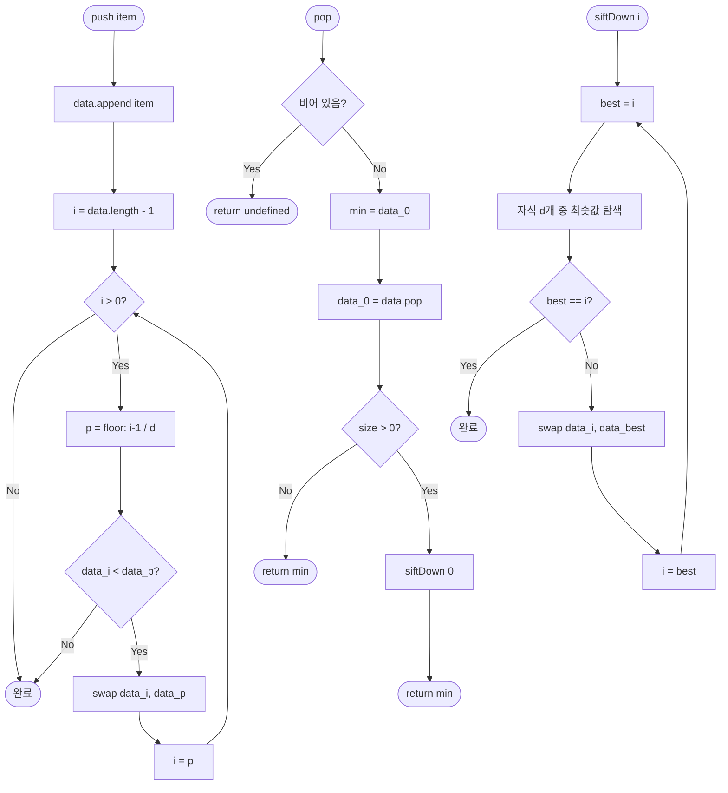

import { AlgorithmSimulation } from "#guide-sim";

# DaryHeap (D진 힙) 해설

## 성능 목표 예측

| d | push | pop | 적합한 워크로드 | 비고 |
|---|------|-----|-----------------|------|
| 2 | O(log₂ n) | O(2 × log₂ n) | 범용 | 이진 힙과 동일 |
| 4 | O(log₄ n) | O(4 × log₄ n) | push 중심 | siftUp 깊이 절반 |
| 8 | O(log₈ n) | O(8 × log₈ n) | 극단적 push 중심 | 캐시 효율 최고 |

n=10^6 기준:
- d=2: siftUp 20단계, siftDown 40단계
- d=4: siftUp 10단계, siftDown 40단계 (pop 비용 동일, push 절반)
- d=8: siftUp 7단계, siftDown 56단계 (push 더 빠르나 pop 느림)

---

## 목표 함수

| 메서드 | 반환 타입 | 엣지케이스 |
|--------|-----------|-----------|
| `push(item)` | `void` | 빈 힙에도 동작 |
| `pop()` | `T \| undefined` | 빈 힙 → `undefined` |
| `peek()` | `T \| undefined` | 빈 힙 → `undefined`, O(1) |
| `size()` | `number` | 0부터 시작 |
| `isEmpty()` | `boolean` | size === 0과 동치 |

---

## 핵심 아이디어

### 왜 D진 힙이 필요한가

이진 힙은 d=2인 특수 케이스이다. d를 늘리면 **트리 높이가 log_d n으로 줄어** siftUp(push) 단계가 감소한다.

실제 시스템에서는 push가 pop보다 훨씬 많은 경우(이벤트 스트림, 네트워크 패킷 큐)가 흔하다. 이때 d=4 또는 d=8로 설정하면 push 비용을 줄이면서 pop 비용 증가는 상대적으로 작다.

추가 이점: d개의 자식이 배열에 연속으로 저장되므로 siftDown 시 자식 비교가 같은 캐시 라인 내에서 이루어진다.

### 원형 아이디어: 트리를 배열로

이진 힙과 동일한 아이디어를 d로 일반화한다.

0-indexed 배열에서:
- **부모(i):** `Math.floor((i - 1) / d)`
- **i의 첫 번째 자식:** `d * i + 1`
- **i의 k번째 자식 (0-indexed):** `d * i + k + 1`

d=2일 때: 부모(i) = `(i-1)/2`, 자식 = `2i+1`, `2i+2` — 이진 힙과 동일.

### 어떤 관찰이 돌파구가 되는가

**관찰 1:** log_d n = log n / log d. d를 늘릴수록 높이가 줄어든다.

| n | d=2 | d=4 | d=8 |
|---|-----|-----|-----|
| 10^6 | 20 | 10 | 6.6 |
| 10^9 | 30 | 15 | 10 |

**관찰 2:** siftDown에서는 각 레벨에서 d개 자식을 비교해야 한다. d번 비교 × log_d n 레벨 = d × log_d n = d × log n / log d. d를 늘리면 log d가 분모를 키우지만 d가 분자를 키운다.

미분해보면 d=e (≈2.72)에서 d × log n / log d가 최솟값이다. d=3이 이론적으로 pop에 최적이지만, 캐시 라인(64 bytes) 고려 시 d=4 또는 d=8이 실용적으로 좋다.

**관찰 3 (캐시 효율):** 64바이트 캐시 라인에 8개의 int(8 bytes)가 들어간다. d=8이면 siftDown에서 자식 8개가 한 캐시 라인에 들어올 확률이 높다.

### 관찰을 형식화: 상태/구조 정의

```ts
class DaryHeap<T> {
  data: T[];           // 레벨 오더 배열
  d: number;           // 자식 수
  compare: (a: T, b: T) => number;
}
```

**불변식:**
- 모든 i에 대해 `compare(data[parent(i)], data[i]) <= 0`
- 즉, 부모 ≤ 자식 (최소 힙)

### 점화식 또는 핵심 연산

**siftUp (push 후):**
```
siftUp(i):
  while i > 0:
    p = floor((i - 1) / d)
    if compare(data[i], data[p]) < 0:
      swap(data, i, p)
      i = p
    else: break
```

**siftDown (pop 후):**
```
siftDown(i, size):
  while true:
    best = i
    for k in 0..d-1:
      child = d * i + k + 1
      if child < size and compare(data[child], data[best]) < 0:
        best = child
    if best == i: break
    swap(data, i, best)
    i = best
```

**push:**
```
push(item):
  data.push(item)
  siftUp(data.length - 1)
```

**pop:**
```
pop():
  if data.length == 0: return undefined
  min = data[0]
  last = data.pop()  // 마지막 원소 꺼냄
  if data.length > 0:
    data[0] = last   // 루트로 올림
    siftDown(0, data.length)
  return min
```

### 정당성: 왜 이것이 옳은가

**힙 속성 유지:**

- push: 새 원소를 끝에 추가하면 부모 경로만 힙 속성이 깨질 수 있다. siftUp으로 부모와 비교하며 올라가면 O(log_d n) 단계 내에 복원된다.
- pop: 루트 제거 후 마지막 원소를 루트로 올리면 자식들이 더 클 수 있다. siftDown으로 d개 자식 중 최솟값과 비교하며 내려가면 O(d × log_d n) 단계 내에 복원된다.

**완전성:** 배열의 끝에 추가/제거하므로 항상 완전 d진 트리(complete d-ary tree)가 유지된다.

### 구현 디테일과 최적화

- **비교 최소화:** siftDown에서 `best` 인덱스를 추적해 swap 횟수를 최소화한다.
- **경계 확인:** 자식 인덱스 `d*i+k+1 < size` 체크가 필수.
- **1-indexed vs 0-indexed:** 0-indexed가 약간 더 복잡하지만 배열 0 슬롯 낭비가 없다.
- **d가 2의 거듭제곱일 때:** 비트 시프트로 곱셈/나눗셈 대체 가능 (`>> log2(d)`, `<< log2(d)`).

---

## 시뮬레이션

export const steps = [
  {
    title: "초기 상태 (d=3)",
    detail: "빈 d=3 힙. 배열: []",
    array: [],
    highlight: [],
    marked: [],
  },
  {
    title: "push(10)",
    detail: "배열: [10]. 인덱스 0, 부모 없음. siftUp 불필요.",
    array: [10],
    highlight: [0],
    marked: [],
  },
  {
    title: "push(5)",
    detail: "배열: [10, 5]. i=1, parent=floor((1-1)/3)=0. 5 < 10 → swap. 배열: [5, 10].",
    array: [5, 10],
    highlight: [0],
    marked: [],
  },
  {
    title: "push(15), push(3)",
    detail: "push(15): i=2, parent=0. 15 > 5, 멈춤. push(3): i=3, parent=0. 3 < 5 → swap. 배열: [3, 10, 15, 5]",
    array: [3, 10, 15, 5],
    highlight: [0],
    marked: [],
  },
  {
    title: "pop() → 3 반환",
    detail: "루트(3) 저장. 마지막(5)을 루트로. 배열: [5, 10, 15]. siftDown 시작.",
    array: [5, 10, 15],
    highlight: [0],
    marked: [],
  },
  {
    title: "siftDown: 자식 [10, 15] 비교",
    detail: "i=0. 자식: idx 1(10), idx 2(15). best=1(10). 5 < 10 → 힙 속성 만족, 멈춤.",
    array: [5, 10, 15],
    highlight: [0],
    marked: [1, 2],
  },
];

<AlgorithmSimulation view="array" steps={steps} title="DaryHeap (d=3) push/pop 시뮬레이션" />

## 수도 코드와 Activity Diagram

### 의사코드

```
// 생성자
DaryHeap(d, compare):
  data = []
  this.d = d
  this.compare = compare

// 삽입
push(item):
  data.append(item)
  siftUp(data.length - 1)

// siftUp
siftUp(i):
  while i > 0:
    p = floor((i - 1) / d)
    if compare(data[i], data[p]) < 0:
      swap(data, i, p)
      i = p
    else: break

// 최솟값 추출
pop():
  if data.length == 0: return undefined
  min = data[0]
  if data.length == 1:
    data.pop()
    return min
  data[0] = data.pop()   // 마지막 원소를 루트로
  siftDown(0)
  return min

// siftDown
siftDown(i):
  n = data.length
  while true:
    best = i
    firstChild = d * i + 1
    for k = 0..d-1:
      c = firstChild + k
      if c >= n: break
      if compare(data[c], data[best]) < 0:
        best = c
    if best == i: break
    swap(data, i, best)
    i = best

// 조회
peek():
  return data.length > 0 ? data[0] : undefined

size():
  return data.length

isEmpty():
  return data.length == 0
```

### Activity Diagram


