import { AlgorithmSimulation } from "#guide-sim";

# Deque 해설

## 성능 목표 예측

| 제약 항목 | 값 |
|-----------|-----|
| 최대 연산 수 | $10^6$ |
| 모든 연산 시간복잡도 | amortized O(1) |
| 메모리 | 256 MB |

**naive 접근의 문제점**: JS `Array.unshift()`와 `Array.shift()`는 O(n) 시프트가 발생한다. 10^6회면 O(n^2) → 1초 초과.

**목표 복잡도**: pushFront / pushBack / popFront / popBack 모두 **amortized O(1)** — 두 배열 조합 또는 이중 연결 리스트로 달성.

---

## 목표 함수

```ts
export class Deque<T> {
  pushFront(item: T): void   // amortized O(1)
  pushBack(item: T): void    // amortized O(1)
  popFront(): T | undefined
  popBack(): T | undefined
  peekFront(): T | undefined
  peekBack(): T | undefined
  isEmpty(): boolean
  size(): number
}
```

| 메서드 | 의미 | 제약 |
|--------|------|------|
| `pushFront(item)` | 앞에 추가 | amortized O(1) |
| `pushBack(item)` | 뒤에 추가 | amortized O(1) |
| `popFront()` | 앞 제거 후 반환 | 비어있으면 `undefined` |
| `popBack()` | 뒤 제거 후 반환 | 비어있으면 `undefined` |
| `peekFront()` | 앞 조회 | 비어있으면 `undefined` |
| `peekBack()` | 뒤 조회 | 비어있으면 `undefined` |

**엣지케이스**:
1. 빈 덱에서 `popFront()` / `popBack()` → `undefined`
2. 1개만 있을 때 `popFront()` → 이후 `isEmpty()` === true
3. `pushFront` 후 `peekFront()` → 방금 넣은 값이 나와야 함
4. `pushBack` 후 `peekBack()` → 방금 넣은 값이 나와야 함

---

## 핵심 아이디어

**핵심 아이디어**: "front 배열은 역순으로 저장한다. pushFront는 front 배열 끝에 push, popFront는 front 배열 끝에서 pop — 둘 다 O(1)"

**풀이 구조**
1. `front: T[]` — 앞 원소들을 **역순**으로 저장 (front[length-1]이 논리적 첫 번째)
2. `back: T[]` — 뒤 원소들을 **정순**으로 저장 (back[0]이 논리적 front 바로 다음)
3. `pushFront(x)`: `front.push(x)` → O(1)
4. `pushBack(x)`: `back.push(x)` → O(1)
5. `popFront()`: `front`가 있으면 `front.pop()`, 없으면 `back.shift()`
6. `popBack()`: `back`이 있으면 `back.pop()`, 없으면 `front.shift()`
7. `peekFront()`: `front.length > 0 ? front[front.length-1] : back[0]`
8. `peekBack()`: `back.length > 0 ? back[back.length-1] : front[0]`

**언제 쓰나**: 슬라이딩 윈도우 최댓값/최솟값(단조 덱), 팰린드롬 검사, BFS에서 우선순위 삽입, 양방향 BFS.

---

### 원형 아이디어와 naive 접근

배열 하나로 앞뒤 모두 처리하면 한쪽 방향(앞)에서 O(n)이 발생한다. 배열 두 개를 반대 방향으로 쌓으면 양끝 모두 배열의 끝(O(1) push/pop)으로 처리할 수 있다.

### 어떤 관찰이 돌파구가 되는가

"front 배열을 역순으로 유지한다"는 발상이 핵심이다. `pushFront(a)` 후 `pushFront(b)`를 하면 front = [a, b]. 논리적으로는 b가 앞이고 a가 그 다음 — 배열 끝(b)이 논리적 front다.

### 관찰을 형식화: 상태/구조 정의

```
front: T[]  // 역순. front[length-1] = 논리적 가장 앞 원소
back: T[]   // 정순. back[0] = front 바로 다음 원소

논리 시퀀스: [...front.reversed(), ...back]
size = front.length + back.length
```

### 점화식 또는 핵심 연산

```
pushFront(x)  → front.push(x)        // O(1)
pushBack(x)   → back.push(x)         // O(1)
popFront()    → front.length > 0
                  ? front.pop()       // O(1)
                  : back.shift()      // O(n) — 드물게 발생, amortized O(1)
popBack()     → back.length > 0
                  ? back.pop()        // O(1)
                  : front.shift()     // O(n) — 드물게 발생, amortized O(1)
```

### 정당성 — 왜 이것이 옳은가

각 원소는 front 또는 back 배열에 최대 1번 shift된다. shift가 O(n)이지만 그 원소 수만큼만 발생하므로 n번 연산에 걸쳐 상각하면 O(1)/연산이다. 이중 연결 리스트를 사용하면 worst-case O(1)도 달성 가능하다.

### 구현 디테일과 최적화

- 이중 연결 리스트(DoublyLinkedList) 사용 시 모든 연산 worst-case O(1).
- 두 배열 방식은 구현이 간단하고 캐시 친화적이며 amortized O(1)로 충분히 빠르다.
- `noUncheckedIndexedAccess` 환경에서 `front[front.length - 1]`은 `T | undefined`로 추론되므로 undefined 체크 불필요.

---

## 시뮬레이션

pushBack(1) → pushBack(2) → pushFront(0) → popBack() → popFront() 순서로 덱 상태 변화를 확인한다.

export const steps = [
  {
    title: "초기 상태 (빈 덱)",
    detail: "front = [], back = []. isEmpty = true",
    array: [],
    highlight: [],
    marked: [],
  },
  {
    title: "pushBack(1)",
    detail: "back 배열 끝에 1 추가. 논리 순서: [1]",
    array: [1],
    highlight: [0],
    marked: [],
  },
  {
    title: "pushBack(2)",
    detail: "back 배열 끝에 2 추가. 논리 순서: [1, 2]",
    array: [1, 2],
    highlight: [1],
    marked: [0],
  },
  {
    title: "pushFront(0)",
    detail: "front 배열 끝에 0 추가 (역순 저장). 논리 순서: [0, 1, 2]",
    array: [0, 1, 2],
    highlight: [0],
    marked: [1, 2],
  },
  {
    title: "popBack() → 2 반환",
    detail: "back 배열 끝에서 2 제거. 논리 순서: [0, 1]",
    array: [0, 1],
    highlight: [],
    marked: [0, 1],
  },
  {
    title: "popFront() → 0 반환",
    detail: "front 배열 끝에서 0 제거 (O(1)). 논리 순서: [1]",
    array: [1],
    highlight: [0],
    marked: [],
  },
];

<AlgorithmSimulation view="array" steps={steps} title="Deque 시뮬레이션" />

## 수도 코드와 Activity Diagram

### 의사코드

```
class Deque<T>:
  front: T[] = []   // 역순 저장. front[last] = 논리적 첫 원소
  back: T[] = []    // 정순 저장. back[0] = front 다음 원소

  pushFront(item):
    front.push(item)                   // 불변식: front 끝 = 논리 앞

  pushBack(item):
    back.push(item)                    // 불변식: back 끝 = 논리 뒤

  popFront():
    if front not empty: return front.pop()
    if back not empty: return back.shift()   // amortized O(1)
    return undefined

  popBack():
    if back not empty: return back.pop()
    if front not empty: return front.shift() // amortized O(1)
    return undefined

  peekFront():
    if front not empty: return front[front.length - 1]
    return back[0]

  peekBack():
    if back not empty: return back[back.length - 1]
    return front[0]

  isEmpty():
    return front.length + back.length == 0

  size():
    return front.length + back.length
```

### Activity Diagram

```mermaid
flowchart TD
  A([시작]) --> B{연산 선택}
  B -->|pushFront| C[front 배열 끝에 push]
  C --> Z([끝])
  B -->|pushBack| D[back 배열 끝에 push]
  D --> Z
  B -->|popFront| E{front 비어있음?}
  E -->|false| F[front.pop 반환]
  E -->|true| G{back 비어있음?}
  G -->|false| H[back.shift 반환]
  G -->|true| I[undefined 반환]
  F --> Z
  H --> Z
  I --> Z
  B -->|popBack| J{back 비어있음?}
  J -->|false| K[back.pop 반환]
  J -->|true| L{front 비어있음?}
  L -->|false| M[front.shift 반환]
  L -->|true| N[undefined 반환]
  K --> Z
  M --> Z
  N --> Z
```


