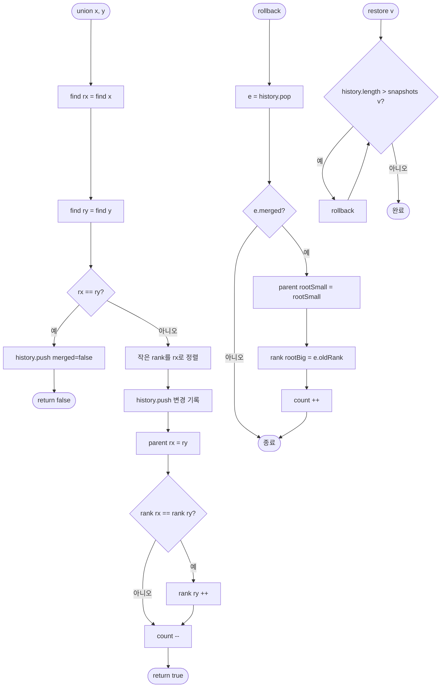

import { AlgorithmSimulation } from "#guide-sim";

# DisjointSetRollback 해설

## 성능 목표 예측

| 연산 | 기본 Union-Find (경로압축+rank) | Union by Rank만 | DisjointSetRollback |
|------|-------------------------------|-----------------|---------------------|
| find | O(α(n)) ≈ O(1) 실질            | O(log n)        | O(log n)            |
| union | O(α(n))                       | O(log n)        | O(log n)            |
| rollback | 불가                       | 불가            | O(1)                |
| snapshot | 불가                       | 불가            | O(1)                |
| restore  | 불가                       | 불가            | O(rollback 횟수)    |

---

## 목표 함수

| 메서드 | 설명 | 복잡도 |
|--------|------|--------|
| `find(x)` | 루트 탐색 (경로 압축 없음) | O(log n) |
| `union(x, y)` | 두 집합 합치기, 이미 같으면 false | O(log n) |
| `rollback()` | 마지막 union 되돌리기 | O(1) |
| `snapshot()` | 현재 상태 버전 저장 | O(1) |
| `restore(v)` | 버전 v로 복원 | O(rollback 횟수) |
| `same(x, y)` | 같은 집합 여부 | O(log n) |
| `groupCount()` | 독립 집합 수 | O(1) |

---

## 핵심 아이디어

### 원형 아이디어와 naive 접근

유니온-파인드는 원래 각 원소의 `parent` 배열을 유지합니다. 경로 압축은 `find` 시 모든 조상의 부모를 루트로 직접 연결해 다음 `find`를 빠르게 만듭니다.

롤백을 naive하게 구현한다면 — union 전 상태 전체를 복사(deep copy)해두면 됩니다. 하지만 n=10^4에서 union마다 O(n) 복사는 총 O(n²) 메모리로 실용적이지 않습니다.

### 어떤 관찰이 돌파구가 되는가

**관찰**: Union by Rank만 사용하면 union 하나가 `parent` 배열을 정확히 **한 위치**만 변경합니다.
(루트 A의 부모를 루트 B로 지정 — 이 한 변경만 기록하면 충분)

경로 압축은 union 하나에 O(n)개의 부모 포인터를 바꿀 수 있어 기록이 폭발합니다. 따라서 경로 압축을 포기하고 union by rank만 사용합니다.

### 관찰을 형식화

**변경 기록 항목** (union 하나당 최대 2개의 변경):
```
{ 
  rootSmall: number,   // 자식이 된 루트 (parent가 바뀜)
  oldParent: number,   // 변경 전 parent (= rootSmall 자신)
  rootBig: number,     // 부모가 된 루트 (rank가 바뀔 수 있음)
  oldRank: number,     // rootBig의 변경 전 rank
  merged: boolean      // 실제로 합쳐졌는지
}
```

rollback 시 이 정보로 두 필드를 정확히 복원합니다.

### 핵심 연산

**union 구현**:
```ts
union(x, y) {
  const rx = find(x), ry = find(y);
  if (rx === ry) { history.push({ merged: false, ... }); return false; }

  let [small, big] = rank[rx] <= rank[ry] ? [rx, ry] : [ry, rx];
  history.push({ rootSmall: small, oldParent: small, rootBig: big, oldRank: rank[big], merged: true });

  parent[small] = big;
  if (rank[small] === rank[big]) rank[big]++;
  count--;
  return true;
}
```

**rollback 구현**:
```ts
rollback() {
  const entry = history.pop();
  if (!entry || !entry.merged) return;
  parent[entry.rootSmall] = entry.rootSmall;  // 부모 복원
  rank[entry.rootBig] = entry.oldRank;        // rank 복원
  count++;
}
```

**snapshot / restore**:
```ts
snapshot() {
  const version = snapshots.length;
  snapshots.push(history.length);
  return version;
}

restore(version) {
  const targetLen = snapshots[version];
  while (history.length > targetLen) rollback();
}
```

### 정당성

Union by Rank의 불변식: rank[x]는 x를 루트로 하는 서브트리의 높이 상한.
- rank가 낮은 트리를 높은 트리 아래에 붙이면 전체 높이는 변하지 않음
- rank가 같을 때만 +1 → 높이 h인 트리는 최소 2^h개의 노드 → 높이 ≤ log₂n

rollback은 `parent[small] = small`(자기 자신 복원)과 `rank[big] = oldRank`만 복원하면 됩니다. 다른 노드의 부모는 이 union으로 인해 변경되지 않았으므로 롤백 불필요.

### 구현 디테일과 최적화

1. **history에 merged 플래그**: 이미 같은 집합인 union(false 반환)도 history에 기록해야 rollback 횟수와 union 횟수가 1:1로 대응
2. **snapshots 배열**: 인덱스가 버전 번호, 값이 그 시점의 history.length
3. **count 유지**: union 성공 시 count--, rollback 시 count++

---

## 시뮬레이션

export const steps = [
  {
    title: "초기 상태 (n=5)",
    detail: "parent=[0,1,2,3,4], rank=[0,0,0,0,0], count=5. 각 노드가 독립.",
    array: [0, 1, 2, 3, 4],
    highlight: [],
    marked: [],
  },
  {
    title: "union(0, 1)",
    detail: "find(0)=0, find(1)=1. rank 같으므로 1→0의 자식. rank[0]=1. history에 기록.",
    array: [0, 0, 2, 3, 4],
    highlight: [0, 1],
    marked: [],
  },
  {
    title: "union(2, 3)",
    detail: "find(2)=2, find(3)=3. rank 같으므로 3→2의 자식. rank[2]=1.",
    array: [0, 0, 2, 2, 4],
    highlight: [2, 3],
    marked: [],
  },
  {
    title: "snapshot() → v0",
    detail: "현재 history.length를 v0에 저장. 이 시점으로 나중에 복원 가능.",
    array: [0, 0, 2, 2, 4],
    highlight: [],
    marked: [0, 1, 2, 3],
  },
  {
    title: "union(1, 2) — 0-1 집합과 2-3 집합 합침",
    detail: "find(1)=0, find(2)=2. rank[0]=rank[2]=1이므로 2→0의 자식. rank[0]=2.",
    array: [0, 0, 0, 2, 4],
    highlight: [0, 2],
    marked: [],
  },
  {
    title: "restore(v0) — rollback 1회",
    detail: "history.pop(). parent[2]=2, rank[0]=1 복원. count=3.",
    array: [0, 0, 2, 2, 4],
    highlight: [2],
    marked: [],
  },
];

<AlgorithmSimulation view="array" steps={steps} title="DisjointSetRollback — parent 배열 변화 시뮬레이션" />

## 수도 코드와 Activity Diagram

### 의사코드

```
class DisjointSetRollback(n):
  parent = [0..n-1]
  rank   = [0..0]
  count  = n
  history = []
  snapshots = []

  find(x):
    while parent[x] != x:
      x = parent[x]
    return x

  union(x, y):
    rx = find(x), ry = find(y)
    if rx == ry:
      history.push({ merged: false })
      return false
    if rank[rx] > rank[ry]: swap(rx, ry)  // rx가 작은 쪽
    history.push({ rootSmall: rx, oldParent: rx, rootBig: ry, oldRank: rank[ry], merged: true })
    parent[rx] = ry
    if rank[rx] == rank[ry]: rank[ry]++
    count--
    return true

  rollback():
    e = history.pop()
    if !e.merged: return
    parent[e.rootSmall] = e.rootSmall
    rank[e.rootBig] = e.oldRank
    count++

  snapshot():
    v = snapshots.length
    snapshots.push(history.length)
    return v

  restore(v):
    while history.length > snapshots[v]:
      rollback()
```

### Activity Diagram



---

## 오프라인 동적 연결성 응용

간선들이 특정 시간 구간 `[l, r]`에만 존재한다고 할 때, 분할 정복(Divide & Conquer on Time)과 DisjointSetRollback을 결합합니다:

```
solve(l, r, edges_active_in_[l,r]):
  현재 구간에 걸쳐있는 간선들을 union
  if l == r:
    이 시점의 쿼리에 답변
  else:
    mid = (l + r) / 2
    solve(l, mid, ...)
    restore()   # mid+1..r을 처리하기 위해 rollback
    solve(mid+1, r, ...)
    restore()
```

이 방법으로 오프라인 동적 연결성 문제를 O(m log²n)에 처리할 수 있습니다.
