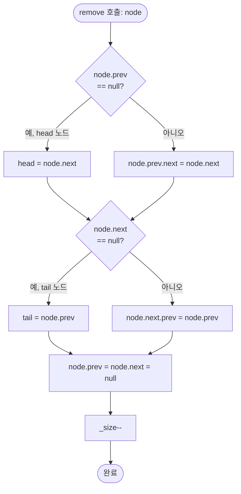

import { AlgorithmSimulation } from "#guide-sim";

# DoublyLinkedList 해설

## 성능 목표 예측

| 연산 | 목표 복잡도 | 이유 |
|------|------------|------|
| `prepend` / `append` | O(1) | head/tail 포인터 직접 갱신 |
| `insertAfter` | O(1) | 노드 참조로 바로 연결 변경 |
| `remove` | O(1) | 노드 참조로 바로 포인터 우회 |
| `toArray` | O(n) | 전체 순회 불가피 |
| `size` | O(1) | 카운터 필드 유지 |

배열 대비 삽입·삭제가 O(n) → O(1)으로 단축되지만, 임의 인덱스 접근(random access)은 O(n)으로 느려진다. 플레이리스트처럼 **노드 참조를 이미 알고 있는 상황**에서 이중 연결 리스트가 강점을 발휘한다.

---

## 목표 함수

| 메서드 | 시그니처 | 엣지 케이스 |
|--------|---------|------------|
| `prepend` | `(value: T) => ListNode<T>` | 빈 리스트 → head = tail = 새 노드 |
| `append` | `(value: T) => ListNode<T>` | 빈 리스트 → head = tail = 새 노드 |
| `insertAfter` | `(node, value) => ListNode<T>` | node가 tail일 때 → tail 갱신 필요 |
| `remove` | `(node) => void` | 단일 노드 → head = tail = null; head/tail 노드 제거 각각 처리 |
| `toArray` | `() => T[]` | 빈 리스트 → `[]` |
| `size` | `() => number` | 카운터 정확히 갱신 필요 |

---

## 핵심 아이디어

### 원형 아이디어와 naive 접근

배열로 구현하면 인덱스 `i`에 삽입할 때 `i+1`부터 끝까지 오른쪽으로 한 칸씩 밀어야 한다(O(n)). 삭제도 마찬가지다. "중간 원소를 자주 삭제하는 플레이리스트"에서는 치명적인 성능 저하가 발생한다.

### 어떤 관찰이 돌파구가 되는가

배열의 느린 삽입·삭제는 **연속 메모리** 때문이다. 원소들이 물리적으로 붙어 있어야 인덱스 계산이 가능하기 때문에 빈 자리를 메꾸는 이동이 필요하다. 반면, **"이 곡 다음에 다른 곡을 끼워 넣는다"**는 연산은 물리적 이동 없이 포인터 4개만 수정하면 된다.

단방향 연결 리스트(singly linked list)라면 노드 `B`를 삭제할 때 이전 노드 `A`를 찾기 위해 head부터 순회해야 한다(O(n)). 이중 연결 리스트에서는 `B.prev`로 즉시 `A`에 접근할 수 있어 삭제도 O(1)이 된다.

### 관찰을 형식화: 상태/구조 정의

```
head → [Z] ⇄ [A] ⇄ [D] ⇄ [C] → tail
       (prev=null)          (next=null)
```

- `head`: 첫 번째 노드 (없으면 null)
- `tail`: 마지막 노드 (없으면 null)
- `_size`: 노드 개수 카운터
- 각 `ListNode<T>`: `value`, `prev`, `next` 세 필드

불변식: 모든 노드 n에 대해 `n.next?.prev === n` 이고 `n.prev?.next === n`.

### 점화식 또는 핵심 연산

**insertAfter(node, value)**:
```
새 노드 newNode를 만든다
newNode.prev = node
newNode.next = node.next
if (node.next !== null) node.next.prev = newNode
node.next = newNode
if (node === tail) tail = newNode
_size++
```

**remove(node)**:
```
if (node.prev !== null) node.prev.next = node.next
else head = node.next          // node가 head인 경우

if (node.next !== null) node.next.prev = node.prev
else tail = node.prev          // node가 tail인 경우

node.prev = null
node.next = null
_size--
```

### 정당성 — 왜 이것이 옳은가

포인터 수정은 항상 쌍으로 이루어진다. `A.next = B`를 설정하면 반드시 `B.prev = A`도 설정한다. 이 대칭적 갱신이 불변식을 유지한다. head/tail 경계 케이스도 `prev` 또는 `next`가 null인지 검사하면 완전히 처리된다.

### 구현 디테일과 최적화

- `prepend`는 `insertBefore(head, value)`와 동일하지만, head 포인터를 직접 갱신하는 것이 더 간단하다.
- `append`는 `tail` 포인터 덕분에 O(1). tail을 유지하지 않으면 O(n)이 된다.
- 노드 재사용 시 `node.prev = node.next = null`로 초기화하면 메모리 누수를 방지하고 가비지 컬렉터 힌트를 준다.

---

## 시뮬레이션

export const steps = [
  {
    title: "초기 상태: 빈 리스트",
    detail: "head = null, tail = null, size = 0",
    array: [],
    highlight: [],
    marked: [],
  },
  {
    title: "append('A')",
    detail: "빈 리스트이므로 head = tail = 새 노드. A.prev = null, A.next = null",
    array: [65],
    highlight: [0],
    marked: [],
  },
  {
    title: "append('B')",
    detail: "tail.next = B, B.prev = tail(A). 새 tail = B",
    array: [65, 66],
    highlight: [1],
    marked: [],
  },
  {
    title: "append('C')",
    detail: "tail.next = C, C.prev = tail(B). 새 tail = C",
    array: [65, 66, 67],
    highlight: [2],
    marked: [],
  },
  {
    title: "insertAfter(A, 'D')",
    detail: "D.prev = A, D.next = B. A.next = D, B.prev = D. size = 4",
    array: [65, 68, 66, 67],
    highlight: [1],
    marked: [0],
  },
  {
    title: "remove(B)",
    detail: "D.next = C, C.prev = D. B의 포인터를 null로 초기화. size = 3",
    array: [65, 68, 67],
    highlight: [],
    marked: [1],
  },
  {
    title: "prepend('Z')",
    detail: "Z.next = head(A). A.prev = Z. 새 head = Z. size = 4",
    array: [90, 65, 68, 67],
    highlight: [0],
    marked: [],
  },
];

<AlgorithmSimulation
  view="array"
  steps={steps}
  title="DoublyLinkedList 연산 시뮬레이션 (ASCII 코드 표시)"
/>

> 시뮬레이션의 배열 값은 문자의 ASCII 코드입니다. A=65, B=66, C=67, D=68, Z=90.
> highlight(파란색): 방금 삽입된 노드. marked(주황색): 연산의 기준점이 된 노드.

---

## 수도 코드와 Activity Diagram

### 의사코드

```
class ListNode<T>:
  value: T
  prev: ListNode | null = null
  next: ListNode | null = null

class DoublyLinkedList<T>:
  head: ListNode | null = null
  tail: ListNode | null = null
  _size: number = 0

  prepend(value):
    node = new ListNode(value)
    if head == null:
      head = tail = node
    else:
      node.next = head
      head.prev = node
      head = node
    _size++
    return node

  append(value):
    node = new ListNode(value)
    if tail == null:
      head = tail = node
    else:
      tail.next = node
      node.prev = tail
      tail = node
    _size++
    return node

  insertAfter(refNode, value):
    node = new ListNode(value)
    node.prev = refNode
    node.next = refNode.next
    if refNode.next != null:
      refNode.next.prev = node
    refNode.next = node
    if refNode == tail:
      tail = node
    _size++
    return node

  remove(node):
    if node.prev != null:
      node.prev.next = node.next
    else:
      head = node.next
    if node.next != null:
      node.next.prev = node.prev
    else:
      tail = node.prev
    node.prev = node.next = null
    _size--
```

### Activity Diagram


