import { AlgorithmSimulation } from "#guide-sim";

# DynamicArray (동적 배열) 해설

## 성능 목표 예측

| 연산 | 목표 복잡도 | 비고 |
|------|------------|------|
| `push` | amortized O(1) | 재할당 발생 시 O(n)이지만 총합은 O(n) |
| `pop` | O(1) | 축소 포함 |
| `get` / `set` | O(1) | 인덱스 직접 접근 |
| `toArray` | O(n) | slice 복사 |
| `size` / `capacity` | O(1) | 변수 반환 |

n = 10^5 push 시 총 재할당 복사 횟수: 4 + 8 + ... + 131072 ≈ 262140 ≈ 2n. 실제 오버헤드는 2배 이내.

---

## 목표 함수

| 메서드 | 시그니처 | 엣지케이스 |
|--------|----------|-----------|
| `push` | `(item: T) => void` | 확장 시 새 배열로 복사 |
| `pop` | `() => T \| undefined` | 빈 배열 → undefined; 축소 조건 확인 |
| `get` | `(index: number) => T \| undefined` | 음수, size 이상 → undefined |
| `set` | `(index: number, item: T) => void` | 범위 밖 → no-op |
| `capacity` | `() => number` | 항상 ≥ 4 |

---

## 핵심 아이디어

### 원형 아이디어와 naive 접근

가장 단순한 구현은 push마다 새 배열을 만들고 전체를 복사하는 것이다:
```
push(item):
  newData = new Array(_size + 1)
  copy _data[0.._size-1] into newData
  newData[_size] = item
  _data = newData
  _size++
```
이는 n번의 push에 O(n²) 시간이 걸려 실용적이지 않다.

### 어떤 관찰이 돌파구가 되는가

"재할당을 드물게 하면 어떨까?" — 여유 공간을 미리 할당해두면 대부분의 push는 단순 대입으로 끝난다. 관건은 얼마나 여유를 줄 것인가.

**2배 확장** 선택의 이유: k번째 재할당 시 복사되는 원소 수는 2^k이다. 총 복사량은 등비급수의 합으로 2n을 넘지 않는다.

### 관찰을 형식화: 상태/구조 정의

```
상태:
  _data: (T | undefined)[]   // 길이 = _capacity
  _size: number              // 실제 원소 수
  _capacity: number          // 내부 배열 크기

불변식:
  0 <= _size <= _capacity
  _capacity >= 4
  _data[_size.._capacity-1]의 값은 undefined (또는 무시)
```

### 점화식 또는 핵심 연산

**push**:
```
if _size === _capacity:
  resize(_capacity * 2)
_data[_size] = item
_size++
```

**pop**:
```
if _size === 0: return undefined
_size--
val = _data[_size]
_data[_size] = undefined   // 메모리 누수 방지 (GC 힌트)
if _size <= _capacity / 4 and _capacity > 4:
  resize(_capacity / 2)
return val
```

**resize(newCapacity)**:
```
newData = new Array(newCapacity)
copy _data[0.._size-1] into newData
_data = newData
_capacity = newCapacity
```

### 정당성 — 왜 이것이 옳은가

**분할 상환 분석 (Amortized Analysis)**:

`push` 연산에 각 원소가 "이동 토큰" 1개를 가진다고 가정한다. 재할당 시 기존 원소 모두가 토큰을 소진한다. 2배 확장이면 재할당 직전 `_capacity / 2`개의 원소가 마지막 재할당 이후 새로 들어온 원소들이고, 이들의 토큰으로 복사 비용을 충당할 수 있다. 따라서 push당 O(1) 분할 상환 비용이 성립한다.

**Shrinking 기준이 1/4인 이유**:

1/2 기준으로 축소하면, 경계에서 pop→push→pop 반복 시 매 연산이 resize를 유발한다. 1/4 기준은 축소 후 `capacity/4`개의 push 여유를 주어 thrashing을 방지한다.

### 구현 디테일과 최적화

1. **`pop` 후 슬롯 초기화**: `_data[_size] = undefined` — GC가 참조를 해제하도록 돕는다.
2. **정수 나눗셈**: `capacity / 4`는 비트 시프트 `capacity >> 2`로 대체 가능해 약간 빠르다.
3. **`toArray`**: `return this._data.slice(0, this._size) as T[]` — undefined 슬롯이 포함되지 않도록 size만큼만 자른다.
4. **TypeScript strict**: `_data`의 타입을 `(T | undefined)[]`로 선언하면 `noUncheckedIndexedAccess`와 호환된다.

---

## 시뮬레이션

export const steps = [
  {
    title: "초기 상태 (capacity=4, size=0)",
    detail: "내부 배열에 4개의 빈 슬롯이 있다. 원소는 없다.",
    array: [0, 0, 0, 0],
    highlight: [],
    marked: [],
  },
  {
    title: "push(1), push(2), push(3), push(4) — 4번 추가",
    detail: "size=4, capacity=4. 슬롯이 모두 찼지만 아직 초과하지 않았다.",
    array: [1, 2, 3, 4],
    highlight: [3],
    marked: [0, 1, 2],
  },
  {
    title: "push(5) — capacity 초과, 2배 확장",
    detail: "새 배열(크기 8)을 할당하고 기존 원소를 복사한다. size=5, capacity=8.",
    array: [1, 2, 3, 4, 5, 0, 0, 0],
    highlight: [4],
    marked: [0, 1, 2, 3],
  },
  {
    title: "pop() → 5 반환",
    detail: "size=4. 4 <= 8/4=2가 아니므로 축소 없음. capacity=8 유지.",
    array: [1, 2, 3, 4, 0, 0, 0, 0],
    highlight: [],
    marked: [0, 1, 2, 3],
  },
  {
    title: "pop() → 4, pop() → 3",
    detail: "size=2. 2 <= 8/4=2 이고 capacity=8>4 → 절반으로 축소. capacity=4.",
    array: [1, 2, 0, 0],
    highlight: [],
    marked: [0, 1],
  },
  {
    title: "최종 상태 (size=2, capacity=4)",
    detail: "불변식 유지: 0 <= size(2) <= capacity(4) >= 4",
    array: [1, 2, 0, 0],
    highlight: [],
    marked: [0, 1],
  },
];

<AlgorithmSimulation view="array" steps={steps} title="DynamicArray 더블링 & 축소 동작" />

---

## 수도 코드와 Activity Diagram

### 의사코드

```
class DynamicArray<T>:
  _data: (T | undefined)[] = new Array(4)
  _size: int = 0
  _capacity: int = 4        // 불변식: _capacity >= 4

  push(item):
    if _size == _capacity:
      resize(_capacity * 2) // O(n) 복사, amortized O(1)
    _data[_size] = item
    _size++

  pop():
    if _size == 0: return undefined
    _size--
    val = _data[_size]
    _data[_size] = undefined  // GC 힌트
    if _size <= _capacity >> 2 and _capacity > 4:
      resize(_capacity >> 1)  // 절반으로 축소
    return val

  get(index):
    if index < 0 or index >= _size: return undefined
    return _data[index]

  set(index, item):
    if index < 0 or index >= _size: return
    _data[index] = item

  resize(newCapacity):
    newData = new Array(newCapacity)
    for i in 0.._size-1:
      newData[i] = _data[i]
    _data = newData
    _capacity = newCapacity

  toArray():
    return _data.slice(0, _size)  // undefined 슬롯 제외
```

### Activity Diagram

```mermaid
flowchart TD
  A([push item]) --> B{size == capacity?}
  B -->|Yes| C[resize capacity × 2]
  C --> D[_data 복사]
  D --> E[_data&#91;size&#93; = item]
  B -->|No| E
  E --> F[size++]
  F --> Z([완료])

  G([pop]) --> H{size == 0?}
  H -->|Yes| I[return undefined]
  H -->|No| J[size--]
  J --> K[val = _data&#91;size&#93;]
  K --> L[_data&#91;size&#93; = undefined]
  L --> M{size ≤ capacity/4 AND capacity > 4?}
  M -->|Yes| N[resize capacity ÷ 2]
  M -->|No| O[return val]
  N --> O
```


