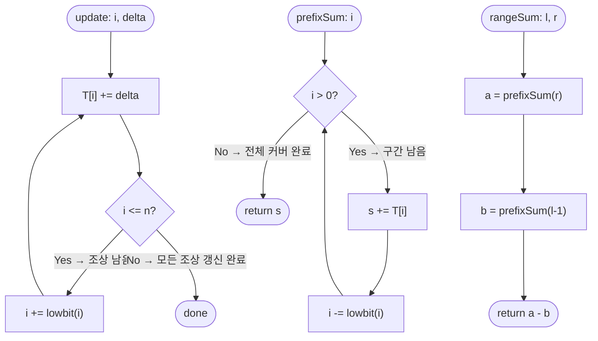

import { AlgorithmSimulation } from "#guide-sim";

# Fenwick Tree 해설

## 성능 목표 예측

| 제약 항목 | 값 |
|-----------|-----|
| 배열 크기 $n$ | $\leq 10^5$ |
| 질의 수 $q$ | $\leq 10^5$ |
| 인덱스 | 1-기반: $1 \leq i \leq n$ |

**naive 접근의 문제점**: 점 갱신 후 구간 합을 구하는 가장 단순한 방법은 다음 두 가지다.

- 방법 A: 배열을 직접 유지, 구간 합 $[l, r]$을 매번 선형 탐색 → 갱신 $O(1)$, 조회 $O(n)$, 전체 $O(qn) = O(10^{10})$ → 시간 초과.
- 방법 B: 접두사 합 배열을 미리 계산 → 조회 $O(1)$이지만 갱신 시 접두사 합 배열 전체를 재계산해야 해서 갱신 $O(n)$ → 동일하게 $O(qn)$.

목표는 갱신과 조회를 모두 $O(\log n)$에 처리하는 것이다. $q \log n \approx 10^5 \times 17 \approx 1.7 \times 10^6$으로 충분히 빠르다.

**공간 복잡도**: $O(n)$. 트리 배열 하나만 추가로 유지하므로 원본 배열과 동일한 공간이다.

---

## 목표 함수

```ts
class FenwickTree {
  constructor(n: number): FenwickTree
  update(i: number, delta: number): void
  prefixSum(i: number): number
  rangeSum(l: number, r: number): number
}
```

| 파라미터 | 의미 | 제약 |
|---------|------|------|
| `n` | 배열의 크기 | $1 \leq n \leq 10^5$ |
| `i` (update) | 갱신할 인덱스 | $1 \leq i \leq n$ (1-기반) |
| `delta` | 더할 값 | $\Delta \in \mathbb{Z}$ (음수 포함) |
| `i` (prefixSum) | 합산할 마지막 인덱스 | $0 \leq i \leq n$ |
| `l`, `r` (rangeSum) | 구간 시작·끝 | $1 \leq l \leq r \leq n$ |

**반환값**: `prefixSum(i)`는 $\sum_{k=1}^{i} A[k]$이며, `rangeSum(l, r)`은 $\sum_{k=l}^{r} A[k]$이다.

**엣지케이스**:
1. `prefixSum(0)` → 0을 반환해야 한다 (빈 구간의 합).
2. `update(1, Δ)` → 인덱스 1의 갱신은 1, 2, 4, 8, ... 방향으로 조상을 순회하므로 최대 $\log n$번 갱신된다.
3. `rangeSum(l, l)` (단일 원소) → `prefixSum(l) - prefixSum(l-1)`로 올바르게 계산된다.
4. `delta`가 음수인 경우 → 빼기와 동일하므로 지원된다.
5. `prefixSum(n)` → 전체 배열 합. 루트에서 시작하여 최대 $\log n$번 합산한다.

---

## 핵심 아이디어

**핵심 아이디어**: "각 인덱스의 이진 표현을 활용해 구간 합의 책임을 분산하면, 갱신과 조회 모두 $O(\log n)$에 끝난다."

배열에서 점 갱신과 구간 합 조회를 동시에 빠르게 지원하고 싶을 때, 세그먼트 트리보다 훨씬 단순한 구조가 있다. Fenwick Tree는 각 위치 $i$가 `lowbit(i)` 길이만큼의 구간 합을 책임지도록 설계된 배열 하나로, 인덱스의 비트를 더하거나 빼는 조작만으로 $O(\log n)$에 모든 연산을 처리한다.

**풀이 구조**
1. 크기 $n+1$의 트리 배열 $T$를 초기화한다($T[i]$는 $[i - \text{lowbit}(i) + 1, i]$ 범위의 합 담당)
2. 점 갱신 시: $i$에서 출발해 $i \mathrel{+}= \text{lowbit}(i)$를 반복하며 조상 노드를 모두 갱신한다
3. 접두사 합 조회 시: $i$에서 출발해 $i \mathrel{-}= \text{lowbit}(i)$를 반복하며 책임 구간들을 누적한다
4. 구간 합: $\text{prefixSum}(r) - \text{prefixSum}(l-1)$로 계산한다

**조건**: 배열 원소가 동적으로 변경되고(점 갱신), 특정 구간의 합을 반복적으로 조회해야 하는 상황

**대표 예시**: 실시간 점수 갱신과 누적 합 조회
게임에서 $10^5$명의 점수가 계속 바뀌고, "1번~k번 선수의 총점이 얼마인가?"를 매번 빠르게 구해야 할 때 사용한다. 선형 배열로는 갱신 또는 조회 중 하나가 $O(n)$이지만 Fenwick Tree로는 둘 다 $O(\log n)$이다.

**언제 쓰나**
점 갱신과 구간 합이 섞인 쿼리에서 세그먼트 트리 대비 코드가 단순하고 상수가 작아야 할 때 사용한다. 구간 갱신이 필요하다면 lazy 세그먼트 트리가 더 적합하다.

---

### 원형 아이디어와 naive 접근

배열 $A[1 \ldots n]$에서 "점 갱신 + 구간 합"을 동시에 지원하는 구조가 필요하다. 가장 단순한 접근은 원본 배열을 그대로 두고 조회 시 선형 탐색하는 것이나, 이는 $O(n)$이다. Segment Tree를 사용하면 $O(\log n)$이 가능하지만 공간 상수가 크고(4n 노드) 구현이 복잡하다. Fenwick Tree는 Segment Tree와 동일한 $O(\log n)$을 달성하면서 배열 하나(크기 $n+1$)만으로 구현할 수 있다.

**폭발 지점**: 각 인덱스가 구간 합의 얼마를 "책임"지도록 설계하면, 업데이트와 조회 경로가 이진 표현을 따라 $O(\log n)$ 에 수렴할 수 있는가?

### 어떤 관찰이 돌파구가 되는가

- **관찰 1**: 정수 $i$의 이진 표현에서 최하위 set bit인 $\text{lowbit}(i) = i \,\&\, (-i)$는 $i$가 "책임지는 구간의 길이"로 해석할 수 있다. 즉 $T[i]$는 $A[i - \text{lowbit}(i) + 1 \ldots i]$의 합을 저장한다.
- **관찰 2**: 접두사 합 $\text{prefixSum}(i)$를 구할 때, $i$에서 출발해 $i \leftarrow i - \text{lowbit}(i)$를 반복하면 서로 겹치지 않는 책임 구간들이 $[1, i]$를 정확히 커버한다.
- **관찰 3**: $A[i]$를 갱신할 때, $i$를 책임 구간에 포함하는 모든 조상 노드를 갱신해야 한다. $i \leftarrow i + \text{lowbit}(i)$를 반복하면 정확히 그 조상들을 방문한다.

### 관찰을 형식화: 상태/구조 정의

크기 $n+1$의 트리 배열 $T$를 유지한다. 각 인덱스 $i$에 대해:

$$T[i] = \sum_{k = i - \text{lowbit}(i) + 1}^{i} A[k], \quad \text{lowbit}(i) = i \,\&\, (-i)$$

이 형태여야 하는 근거: $\text{lowbit}(i)$는 $i$의 이진 표현에서 가장 낮은 set bit 값이다. 이 설계 덕분에 $[1, i]$를 최대 $\log n$개의 서로소 구간으로 분해할 수 있고, 각 구간은 정확히 하나의 $T$ 인덱스에 대응한다.

예를 들어:

| $i$ | 이진 | $\text{lowbit}(i)$ | 책임 구간 |
|-----|------|---------------------|-----------|
| 1 | 0001 | 1 | $[1, 1]$ |
| 2 | 0010 | 2 | $[1, 2]$ |
| 3 | 0011 | 1 | $[3, 3]$ |
| 4 | 0100 | 4 | $[1, 4]$ |
| 6 | 0110 | 2 | $[5, 6]$ |

### 점화식 또는 핵심 연산

**접두사 합 계산** — $i$에서 lowbit을 빼며 구간들을 누적:
$$\text{prefixSum}(i) = \sum_{\text{방문 순서}} T[i_k], \quad i_{k+1} = i_k - \text{lowbit}(i_k), \; i_0 = i$$

예시: $\text{prefixSum}(7)$:
$$7 \xrightarrow{-\text{lowbit}(7)=1} 6 \xrightarrow{-\text{lowbit}(6)=2} 4 \xrightarrow{-\text{lowbit}(4)=4} 0$$
방문 구간: $[7,7] + [5,6] + [1,4] = [1,7]$ 완전 커버.

**점 갱신** — $i$에서 lowbit을 더하며 조상들을 갱신:
$$\text{update}(i, \Delta): \quad T[i_k] \mathrel{+}= \Delta, \quad i_{k+1} = i_k + \text{lowbit}(i_k), \; i_0 = i$$

예시: $\text{update}(3, \Delta)$:
$$3 \xrightarrow{+1} 4 \xrightarrow{+4} 8 \xrightarrow{+8} 16 \rightarrow \ldots \leq n$$

**구간 합**:
$$\text{rangeSum}(l, r) = \text{prefixSum}(r) - \text{prefixSum}(l-1)$$

### 정당성 — 왜 이것이 옳은가

**prefixSum 정당성 (귀납)**: $i$의 이진 표현에서 set bit 개수를 $b$라 하면, $\text{lowbit}(i)$를 뺄 때마다 set bit 하나가 제거된다. 따라서 정확히 $b \leq \log n$번의 반복으로 종료된다. 각 방문에서 추가되는 책임 구간들은 서로 겹치지 않고 $[1, i]$를 정확히 커버함은 귀납적으로 보일 수 있다.

**update 정당성**: $A[i]$를 책임 구간에 포함하는 노드 $j$들은 $j \geq i$이고 $j - \text{lowbit}(j) < i$를 만족하는 값들이다. $i$에서 $\text{lowbit}(i)$를 더하면 정확히 이 노드들만 순서대로 방문한다.

**까다로운 케이스**: `prefixSum(0)`은 루프 조건 `i > 0`에서 즉시 0을 반환해야 한다. 이를 처리하지 않으면 무한 루프에 빠질 수 있다. `update(n, Δ)`는 $n + \text{lowbit}(n)$이 $n$을 초과할 때 루프가 종료되어야 한다.

### 구현 디테일과 최적화

**초기화**: 생성자에서 `T = new Array(n+1).fill(0)`으로 초기화한다. 기존 배열 $A$가 있다면 각 원소에 `update(i, A[i])`를 호출하면 $O(n \log n)$이며, 더 빠른 $O(n)$ 초기화도 가능하다.

**음수 인덱스 주의**: 1-기반이므로 `T[0]`은 사용하지 않는다. `prefixSum(0) = 0`은 별도 처리가 필요하다.

**함정**: 이진 보수 시스템에서 `-i`는 `~i + 1`이다. `i & (-i)`는 JavaScript/TypeScript의 32비트 정수 범위 내에서 올바르게 작동하며, $n \leq 10^5$이면 문제없다.

---

## 시뮬레이션

`n = 8`, 논리 배열 `A[1..8] = [3, 2, -1, 6, 5, 4, -3, 3]`로 구성한 Fenwick Tree에서 `update(3, +2)` 후 `rangeSum(3, 7)`을 계산한다. array 패널은 트리 배열 `T[1..8]`(각 T[i]는 책임 구간 합)을 보여주며, 빨간색(`highlight`)은 현재 연산이 방문하는 인덱스다. update는 `i += lowbit(i)`로 조상을, prefixSum은 `i -= lowbit(i)`로 책임 구간을 따라간다.

실제 반환값 `rangeSum(3, 7)`은 `13` (갱신 후 A[3..7]=1+6+5+4-3) 이며, 시뮬레이션 마지막 프레임과 일치한다.

> 대화형 시뮬레이션은 MDX 런타임에서 표시됩니다.

export const steps = [
  {
    title: "초기 트리 배열",
    detail: "A=[3,2,-1,6,5,4,-3,3]로 구성. T[i]=책임 구간 합.",
    array: [3, 5, -1, 10, 5, 9, -3, 19],
  },
  {
    title: "update(3, +2): i=3",
    detail: "T[3] += 2 → -1+2=1. lowbit(3)=1 → 다음 i=4.",
    array: [3, 5, 1, 10, 5, 9, -3, 19],
    highlight: [2],
  },
  {
    title: "update: i=4",
    detail: "T[4] += 2 → 10+2=12. lowbit(4)=4 → 다음 i=8.",
    array: [3, 5, 1, 12, 5, 9, -3, 19],
    highlight: [3],
  },
  {
    title: "update: i=8",
    detail: "T[8] += 2 → 19+2=21. i+8=16 > n → 종료.",
    array: [3, 5, 1, 12, 5, 9, -3, 21],
    highlight: [7],
  },
  {
    title: "prefixSum(7): i=7",
    detail: "s += T[7] = -3. lowbit(7)=1 → 다음 i=6.",
    array: [3, 5, 1, 12, 5, 9, -3, 21],
    highlight: [6],
  },
  {
    title: "prefixSum(7): i=6",
    detail: "s += T[6] = -3+9 = 6. lowbit(6)=2 → 다음 i=4.",
    array: [3, 5, 1, 12, 5, 9, -3, 21],
    highlight: [5],
    marked: [6],
  },
  {
    title: "prefixSum(7): i=4",
    detail: "s += T[4] = 6+12 = 18. lowbit(4)=4 → i=0 종료. prefixSum(7)=18.",
    array: [3, 5, 1, 12, 5, 9, -3, 21],
    highlight: [3],
    marked: [5, 6],
  },
  {
    title: "prefixSum(2): i=2",
    detail: "s += T[2] = 5. i=0 종료. prefixSum(2)=5.",
    array: [3, 5, 1, 12, 5, 9, -3, 21],
    highlight: [1],
  },
  {
    title: "완료: rangeSum(3,7) = 18 - 5 = 13",
    detail: "prefixSum(7)-prefixSum(2) = 18-5 = 13.",
    array: [3, 5, 1, 12, 5, 9, -3, 21],
    marked: [1, 3, 5, 6],
  },
];

<AlgorithmSimulation view="array" steps={steps} title="Fenwick Tree: update(3,+2), rangeSum(3,7)" />

## 수도 코드와 Activity Diagram

### 의사코드

```
class FenwickTree(n):
    T = array of size (n+1), initialized to 0
    // 불변식: T[i] = sum(A[i - lowbit(i) + 1 .. i])
    //         즉, 각 T[i]는 자신의 책임 구간 내 원소들의 합을 항상 정확히 저장한다

update(i, delta):
    while i <= n:                    // 불변식: 아직 갱신되지 않은 조상 노드가 남아있음
        T[i] += delta
        i += i & (-i)               // 다음 조상 노드로 이동

prefixSum(i):
    s = 0
    while i > 0:                    // 불변식: s = A[i+1..원래_i]의 합이 이미 누적됨
        s += T[i]
        i -= i & (-i)               // 이전 책임 구간으로 이동
    return s                         // s = sum(A[1..원래_i])

rangeSum(l, r):
    return prefixSum(r) - prefixSum(l - 1)
    // prefixSum(l-1)을 빼면 [1, l-1] 구간이 제거되어 [l, r]만 남는다
```

### Activity Diagram



**핵심 불변식**: $T[i] = \sum_{k = i - \text{lowbit}(i) + 1}^{i} A[k]$가 모든 갱신 전후에 성립하며, 이를 통해 임의의 접두사 합을 $O(\log n)$번의 덧셈만으로 정확하게 계산할 수 있다.
