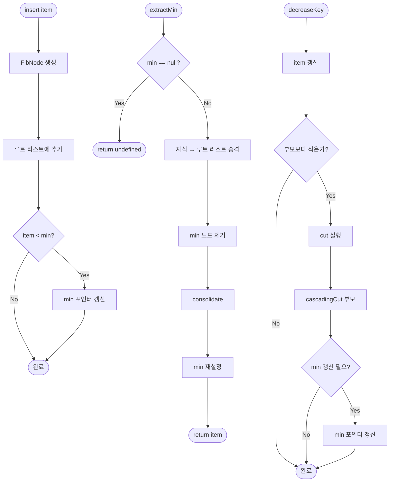

import { AlgorithmSimulation } from "#guide-sim";

# FibonacciHeap (피보나치 힙) 해설

## 성능 목표 예측

| 연산 | Binary Heap | BinomialHeap | FibonacciHeap | 비고 |
|------|------------|--------------|---------------|------|
| insert | O(log n) | O(log n) 상각 | **O(1) 상각** | FH 최강점 |
| extractMin | O(log n) | O(log n) | O(log n) 상각 | 동일 |
| decreaseKey | O(log n) | O(log n) | **O(1) 상각** | FH 최강점 |
| merge | O(n) | O(log n) | **O(1)** | FH 최강점 |
| peek | O(1) | O(log n) | **O(1)** | 동일 |

다익스트라 알고리즘 복잡도: Binary Heap → O((V+E) log V), FibonacciHeap → **O(E + V log V)**

---

## 목표 함수

| 메서드 | 반환 타입 | 엣지케이스 |
|--------|-----------|-----------|
| `insert(item)` | `FibNode<T>` | 반환된 노드로 decreaseKey 호출 가능 |
| `extractMin()` | `T \| undefined` | 빈 힙 → `undefined`, consolidate 발생 |
| `decreaseKey(node, newItem)` | `void` | newItem ≤ 기존 값이어야 함 |
| `merge(other)` | `FibonacciHeap<T>` | 두 빈 힙 병합 가능 |
| `peek()` | `T \| undefined` | 빈 힙 → `undefined` |
| `size()` | `number` | 0부터 시작 |
| `isEmpty()` | `boolean` | size === 0과 동치 |

---

## 핵심 아이디어

### 왜 피보나치 힙이 필요한가

이진 힙의 decrease-key는 O(log n)이다. 다익스트라 알고리즘에서 decrease-key는 O(E)번 호출되므로, 총 O(E log V)의 시간이 거기서만 소모된다.

피보나치 힙은 decrease-key를 **지연(lazy)** 처리함으로써 O(1) 상각을 달성한다. 즉각 정렬을 포기하고, 정리는 extractMin 때 한 번에 몰아서 처리한다.

### 원형 아이디어: 지연(Lazy) 전략

**핵심 통찰:** 굳이 지금 트리를 정리할 필요가 없다.

- insert: 그냥 루트 리스트에 노드를 던져둔다.
- merge: 두 루트 리스트를 그냥 이어 붙인다.
- decreaseKey: 힙 순서를 위반하면 잘라내어 루트 리스트에 던진다.
- extractMin: 이때 비로소 정리(consolidate)한다.

이 지연 전략 덕분에 insert, merge, decreaseKey가 모두 O(1)이 된다.

### 어떤 관찰이 돌파구가 되는가

**관찰 1:** extractMin이 드물게 호출된다면(다익스트라에서 V번), 정리 비용을 거기에만 몰아도 된다.

**관찰 2:** 차수가 O(log n)으로 제한되면 consolidate가 O(log n)에 끝난다. 이를 위해 mark + cascading cut이 필요하다.

**관찰 3 (피보나치 수와의 연결):** 차수 k인 트리는 최소 F_{k+2}개의 노드를 가진다 (F는 피보나치 수). 따라서 n개 노드를 가진 힙에서 최대 차수는 O(log_φ n) = O(log n)이 된다.

### 관찰을 형식화: 상태/구조 정의

```ts
class FibNode<T> {
  item: T;
  degree: number;           // 자식 수
  marked: boolean;          // 자식을 잃은 적 있는가
  parent: FibNode<T> | null;
  child: FibNode<T> | null; // 자식 리스트 중 하나 (원형 연결)
  left: FibNode<T>;         // 루트 리스트 또는 형제 리스트에서 좌측
  right: FibNode<T>;        // 루트 리스트 또는 형제 리스트에서 우측
}

class FibonacciHeap<T> {
  min: FibNode<T> | null;   // 최솟값 포인터
  _size: number;
  compare: (a: T, b: T) => number;
}
```

**불변식:**
1. min은 루트 리스트의 최솟값 노드를 가리킨다.
2. 각 트리는 힙-순서 속성을 만족한다.
3. mark=true인 노드는 루트가 아닌 노드 중 자식을 정확히 한 번 잃은 상태이다.

### 점화식 또는 핵심 연산

**Consolidate (extractMin 내부):**
```
degree → node 맵을 사용한다.
루트 리스트를 순회하며:
  같은 degree의 트리가 있으면 link하여 degree+1로 올린다.
  충돌이 없을 때까지 반복.
이 과정 후 루트 리스트는 모두 다른 degree를 갖는다.
```

**Cut (decreaseKey 내부):**
```
cut(node, parent):
  parent의 자식 리스트에서 node를 제거
  parent.degree--
  node.parent = null
  node.marked = false
  루트 리스트에 node 추가

cascadingCut(node):
  if node.parent != null:
    if node.marked == false:
      node.marked = true
    else:
      cut(node, node.parent)
      cascadingCut(node.parent)
```

### 정당성: 왜 이것이 옳은가

**차수 상한 증명 (스케치):**

차수 k인 피보나치 힙 트리는 최소 F_{k+2}개의 노드를 가진다. 이를 귀납법으로 증명할 수 있다:
- B_0: 1 = F_2개
- B_k: 자식들의 최소 크기의 합이 F_{k+2}

cascading cut은 각 루트가 자식을 최대 한 번만 잃도록 강제하므로 이 하한이 유지된다. F_{k+2} ≈ φ^k/√5이므로, n개 노드가 있으면 k ≤ log_φ n = O(log n)이다.

**상각 분석 (포텐셜 함수):**

Φ = (루트 리스트 크기) + 2 × (mark=true인 노드 수)

- insert: 실제 O(1), 포텐셜 +1 → 상각 O(1)
- extractMin: 실제 O(log n + 루트 수), 포텐셜 감소로 상각 O(log n)
- decreaseKey: 실제 O(cascading cut 횟수), 포텐셜 감소로 상각 O(1)

### 구현 디테일과 최적화

- **원형 이중 연결 리스트:** 루트 리스트와 자식 리스트 모두 left/right 포인터로 구현. 삽입/삭제가 O(1).
- **consolidate 최적화:** 배열 `A[0..maxDegree]`를 사용해 같은 차수 충돌을 O(1)에 탐지.
- **decreaseKey 호출 전 단조성 확인:** `compare(newItem, node.item) > 0`이면 잘못된 호출이므로 예외를 던지거나 무시한다.

---

## 시뮬레이션

export const steps = [
  {
    title: "초기 상태",
    detail: "빈 피보나치 힙. min = null, 루트 리스트 비어 있음.",
    array: [],
    highlight: [],
    marked: [],
  },
  {
    title: "insert(10), insert(5), insert(15)",
    detail: "각 insert는 루트 리스트에 즉시 추가. consolidate 없음. min = 5 포인터.",
    array: [10, 5, 15],
    highlight: [1],
    marked: [],
  },
  {
    title: "extractMin() → 5 제거",
    detail: "min(5) 제거. 자식 없음. 루트 리스트: [10, 15]. consolidate 시작.",
    array: [10, 15],
    highlight: [],
    marked: [],
  },
  {
    title: "consolidate 후",
    detail: "degree 0: 10, 15. 두 개 → link. 10이 루트. 루트 리스트: [B₁(10,15)]",
    array: [10, 15],
    highlight: [0],
    marked: [],
  },
  {
    title: "insert(20), insert(3)",
    detail: "루트 리스트에 즉시 추가. min = 3 포인터 갱신.",
    array: [10, 15, 20, 3],
    highlight: [3],
    marked: [],
  },
  {
    title: "decreaseKey(node=20, newValue=1)",
    detail: "20 → 1. 부모(10)보다 작으므로 cut. 1이 루트로 승격. min = 1.",
    array: [10, 15, 1, 3],
    highlight: [2],
    marked: [0],
  },
];

<AlgorithmSimulation view="array" steps={steps} title="FibonacciHeap insert/extractMin/decreaseKey 시뮬레이션" />

## 수도 코드와 Activity Diagram

### 의사코드

```
// 삽입
insert(item):
  node = new FibNode(item)
  루트 리스트에 node 추가
  if min == null or item < min.item:
    min = node
  _size++
  return node

// 최솟값 추출
extractMin():
  if min == null: return undefined
  minNode = min
  // 자식들을 루트 리스트로 승격
  for each child of minNode:
    child.parent = null
    루트 리스트에 child 추가
  루트 리스트에서 minNode 제거
  _size--
  consolidate()
  return minNode.item

// 통합 (consolidate)
consolidate():
  A = 빈 배열 (index = degree)
  for each root r in 루트 리스트:
    d = r.degree
    while A[d] != null:
      other = A[d]
      r = link(r, other)  // 더 작은 루트가 상위
      A[d] = null
      d++
    A[d] = r
  min = A에서 최솟값 재탐색

// decreaseKey
decreaseKey(node, newItem):
  node.item = newItem
  if node.parent != null and newItem < node.parent.item:
    cut(node, node.parent)
    cascadingCut(node.parent)
  if newItem < min.item:
    min = node
```

### Activity Diagram


