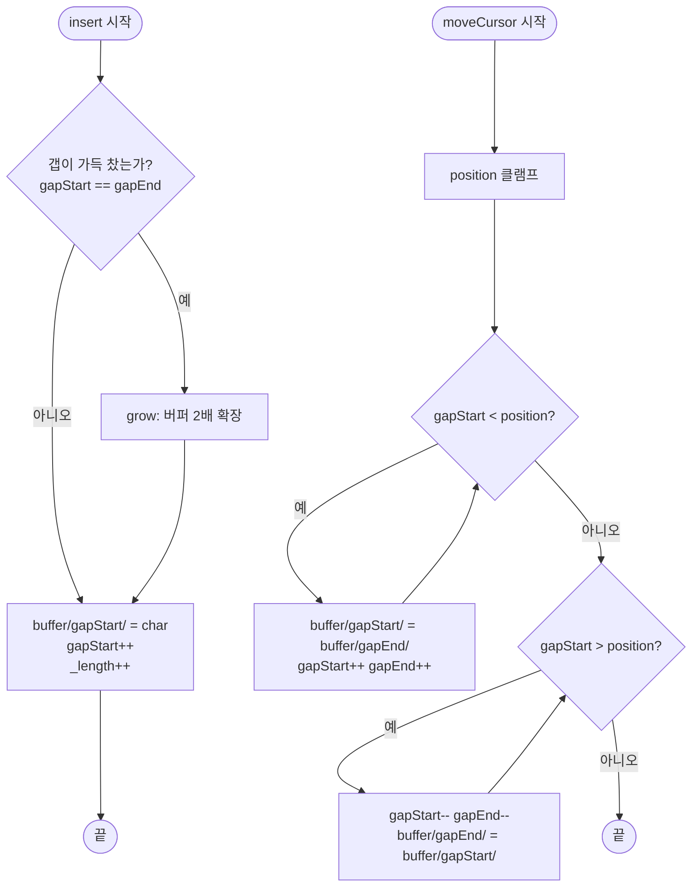

import { AlgorithmSimulation } from "#guide-sim";

# GapBuffer 해설

## 성능 목표 예측

| 연산 | 단순 배열 | GapBuffer | 연결 리스트 |
|------|---------|-----------|-----------|
| 커서 위치 insert | O(n) (밀어내기) | O(1) amortized | O(1) (탐색 제외) |
| 커서 위치 delete | O(n) | O(1) | O(1) |
| 커서 이동(k칸) | O(1) | O(k) | O(k) |
| getText | O(1) | O(n) (갭 건너뛰기) | O(n) |
| 캐시 효율 | 높음 | 높음 | 낮음 |

일반적인 텍스트 편집에서 커서 이동보다 삽입·삭제가 압도적으로 많으므로, GapBuffer의 O(1) 삽입이 실질적으로 큰 이득을 준다.

---

## 목표 함수

| 함수 | 입력 | 출력 | 엣지케이스 |
|------|------|------|-----------|
| `insert(char)` | 단일 문자 | void | 갭 크기 = 0 → 버퍼 2배 확장 후 삽입 |
| `delete()` | 없음 | void | gapStart = 0 → 무시 |
| `moveCursor(pos)` | 절대 위치 | void | pos < 0 → 0, pos > length() → length() |
| `getCursorPosition()` | 없음 | number | 항상 gapStart 반환 |
| `getText()` | 없음 | string | 갭을 제외하고 앞뒤를 이어 붙임 |
| `length()` | 없음 | number | bufferSize - gapSize |

---

## 핵심 아이디어

### 원형 아이디어와 naive 접근

텍스트를 단순 배열 `char[]`로 관리하면 인덱스 i에 문자를 삽입할 때 `i` 이후의 모든 문자를 한 칸씩 오른쪽으로 밀어야 한다. 최악의 경우 O(n)이며, 빠른 타이핑 중에 매 키 입력마다 이 비용이 발생한다.

### 어떤 관찰이 돌파구가 되는가

"삽입할 위치에 미리 빈 공간을 확보해 두면 어떨까?" 커서 위치에 갭(빈 슬롯 배열)을 두면, 문자를 삽입할 때 갭의 첫 슬롯에 쓰고 갭 시작 포인터(`gapStart`)를 오른쪽으로 1 이동시키기만 하면 된다. 어떤 원소도 이동하지 않으므로 O(1)이다.

### 관찰을 형식화: 상태/구조 정의

```
buffer:  [H][i][_][_][_][!]
index:    0   1  2  3  4  5
              ^gapStart=2       ^gapEnd=5
```

- `gapStart`: 갭의 시작 인덱스 = 커서 위치
- `gapEnd`: 갭의 끝 인덱스 (exclusive)
- 갭 크기 = `gapEnd - gapStart`
- 실제 텍스트 길이 = `buffer.length - (gapEnd - gapStart)`

### 점화식 또는 핵심 연산

**insert(char):**

```
if gapStart == gapEnd:   // 갭이 가득 참
    grow()               // 버퍼 2배 확장, 갭 재배치
buffer[gapStart] = char
gapStart++
_length++
```

**delete():**

```
if gapStart == 0: return
gapStart--
_length--
```

**moveCursor(position) — 오른쪽으로 이동(position > gapStart):**

```
while gapStart < position:
    buffer[gapStart] = buffer[gapEnd]
    gapStart++; gapEnd++
```

**moveCursor(position) — 왼쪽으로 이동(position < gapStart):**

```
while gapStart > position:
    gapStart--; gapEnd--
    buffer[gapEnd] = buffer[gapStart]
```

**getText():**

```
return buffer[0..gapStart-1] + buffer[gapEnd..bufferSize-1]
```

### 정당성 — 왜 이것이 옳은가

갭 버퍼의 불변식: "gapStart 왼쪽은 커서 왼쪽 텍스트, gapEnd 오른쪽은 커서 오른쪽 텍스트"이다. moveCursor는 이 불변식을 유지하면서 갭을 평행 이동하므로, 삽입/삭제가 항상 올바른 위치에서 동작함이 보장된다.

### 구현 디테일과 최적화

- **grow():** 새 버퍼를 2배 크기로 할당하고, `buffer[0..gapStart-1]`과 `buffer[gapEnd..]`를 각각 새 버퍼의 앞과 끝에 복사한다. 갭은 중간에 크게 남는다.
- **문자열 vs char 배열:** TypeScript에서는 `string[]`이나 `Uint16Array`를 선택할 수 있다. `string[]`는 코드가 단순하지만, `Uint16Array`는 메모리 효율이 높다.
- **갭 크기 초기값:** 너무 작으면 grow() 호출이 잦고, 너무 크면 메모리 낭비다. 16~64가 실용적이다.

---

## 시뮬레이션

export const steps = [
  {
    title: "초기 상태 (capacity=8)",
    detail: "버퍼 전체가 갭이다. gapStart=0, gapEnd=8, length=0.",
    array: [0, 0, 0, 0, 0, 0, 0, 0],
    highlight: [0, 1, 2, 3, 4, 5, 6, 7],
    marked: [],
  },
  {
    title: "insert('H') — gapStart=0에 쓰기",
    detail: "buffer[0]='H', gapStart → 1. 갭은 [1..7].",
    array: [72, 0, 0, 0, 0, 0, 0, 0],
    highlight: [1, 2, 3, 4, 5, 6, 7],
    marked: [0],
  },
  {
    title: "insert('i') insert('!') — gapStart=3",
    detail: "'i'와 '!'가 삽입됐다. 텍스트='Hi!', 갭=[3..7].",
    array: [72, 105, 33, 0, 0, 0, 0, 0],
    highlight: [3, 4, 5, 6, 7],
    marked: [0, 1, 2],
  },
  {
    title: "moveCursor(1) — 갭을 왼쪽으로 이동",
    detail: "gapStart=1로 이동. buffer[gapEnd-1]에 'i'와 '!'를 복사. 텍스트='H|i!'",
    array: [72, 0, 0, 0, 0, 105, 33, 0],
    highlight: [1, 2, 3, 4],
    marked: [0, 5, 6],
  },
  {
    title: "insert('e') — 커서 위치에 삽입",
    detail: "buffer[1]='e', gapStart → 2. 텍스트='He|i!'",
    array: [72, 101, 0, 0, 0, 105, 33, 0],
    highlight: [2, 3, 4],
    marked: [0, 1, 5, 6],
  },
  {
    title: "delete() — 커서 왼쪽 삭제",
    detail: "gapStart-- → 1. 'e'가 갭 안으로 들어가 사라진다. 텍스트='H|i!'",
    array: [72, 0, 0, 0, 0, 105, 33, 0],
    highlight: [1, 2, 3, 4],
    marked: [0, 5, 6],
  },
];

<AlgorithmSimulation
  view="array"
  steps={steps}
  title="GapBuffer 동작 시뮬레이션 (array = 버퍼 코드포인트, highlight = 갭 범위, marked = 실제 문자)"
/>

## 수도 코드와 Activity Diagram

### 의사코드

```
class GapBuffer:
    buffer: string[]
    gapStart: int = 0
    gapEnd: int = capacity
    _length: int = 0

    insert(char):
        if gapStart == gapEnd: grow()
        buffer[gapStart] = char
        gapStart++
        _length++

    delete():
        if gapStart == 0: return
        gapStart--
        _length--

    moveCursor(position):
        position = clamp(position, 0, _length)
        while gapStart < position:
            buffer[gapStart] = buffer[gapEnd]
            gapStart++; gapEnd++
        while gapStart > position:
            gapStart--; gapEnd--
            buffer[gapEnd] = buffer[gapStart]

    getText():
        return buffer[0..gapStart-1].join('') + buffer[gapEnd..].join('')

    grow():
        newSize = buffer.length * 2
        newBuffer = new string[newSize]
        // 앞쪽 텍스트 복사
        copy buffer[0..gapStart-1] → newBuffer[0..gapStart-1]
        // 뒤쪽 텍스트를 새 버퍼 끝으로 복사
        tailLen = buffer.length - gapEnd
        copy buffer[gapEnd..] → newBuffer[newSize - tailLen..]
        gapEnd = newSize - tailLen
        buffer = newBuffer
```

### Activity Diagram


