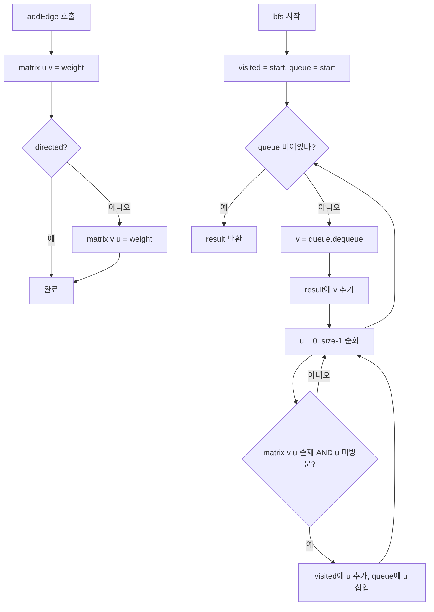

import { AlgorithmSimulation } from "#guide-sim";

# GraphAdjMatrix 해설

## 성능 목표 예측

| 연산 | 인접 리스트 | 인접 행렬 |
|---|---|---|
| 공간 | O(V + E) | O(V²) |
| addEdge | O(1) | O(1) |
| removeEdge | O(degree) | O(1) |
| hasEdge | O(degree) | **O(1)** |
| weight 조회 | O(degree) | **O(1)** |
| neighbors | O(degree) | O(V) |
| BFS / DFS | O(V + E) | O(V²) |

밀집 그래프(E ≈ V²)에서는 두 방식의 BFS/DFS 복잡도가 동일해지고,
`hasEdge`/`weight`가 O(1)이므로 Floyd-Warshall 등의 알고리즘에 유리하다.

---

## 목표 함수

| 메서드 | 입력 | 출력 | 시간복잡도 |
|---|---|---|---|
| `addEdge(u, v, w?)` | 두 정점, 가중치 | void | O(1) |
| `removeEdge(u, v)` | 두 정점 | void | O(1) |
| `hasEdge(u, v)` | 두 정점 | boolean | O(1) |
| `weight(u, v)` | 두 정점 | number \| undefined | O(1) |
| `neighbors(v)` | 정점 | 인접 목록 | O(V) |
| `bfs(start)` | 시작 정점 | 방문 순서 | O(V²) |
| `dfs(start)` | 시작 정점 | 방문 순서 | O(V²) |
| `vertexCount()` | — | 정점 수 | O(1) |

---

## 핵심 아이디어

### 원형 아이디어와 naive 접근

그래프의 가장 직접적인 표현: "정점 u와 v가 연결되어 있나?"라는 질문에 O(1)로 답한다. V×V 2차원 배열(행렬)에서 `matrix[u][v]`를 읽으면 즉시 알 수 있다.

### 어떤 관찰이 돌파구가 되는가

**관찰 1**: 간선 존재 여부 확인이 O(1)이므로, 행렬 기반 BFS는 "이 정점이 연결되어 있나?"를 배열 인덱스 접근으로 처리한다.

**관찰 2**: Floyd-Warshall 같은 O(V³) 알고리즘은 `dist[i][j]` 배열을 직접 순회한다. 인접 행렬은 이미 이 구조와 동일해 추가 변환이 불필요하다.

**관찰 3**: 메모리는 O(V²)로 고정. V=1000이면 10⁶ 셀 ≈ 8MB (number 타입). 허용 범위 내.

### 관찰을 형식화

```
matrix: (number | undefined)[][]
matrix[u][v] = weight  if edge u→v exists
matrix[u][v] = undefined  otherwise
```

초기화: `Array.from({length: V}, () => new Array(V).fill(undefined))`

### 핵심 연산 — hasEdge, weight

```
hasEdge(u, v):
  return matrix[u][v] !== undefined

weight(u, v):
  return matrix[u][v]  // undefined if no edge
```

두 연산 모두 단순 배열 접근 — O(1).

### 핵심 연산 — neighbors

```
neighbors(v):
  result = []
  for u in 0..size-1:
    if matrix[v][u] !== undefined:
      result.push(u)
  return result
```

전체 행을 스캔하므로 O(V). 인접 리스트의 O(degree)보다 느리지만, 밀집 그래프에서는 degree ≈ V이므로 차이 없다.

### 핵심 연산 — BFS

```
bfs(start):
  visited = new Set([start])
  queue = [start]
  result = []

  while queue not empty:
    v = queue.shift()
    result.push(v)
    for u in 0..size-1:          // O(V)로 인접 정점 스캔
      if matrix[v][u] !== undefined and u not in visited:
        visited.add(u)
        queue.push(u)

  return result
```

총 복잡도: O(V × V) = O(V²).

### 정당성

행렬은 고정 크기 구조라 경계 검사가 단순하다. `undefined`를 간선 없음의 센티널로 사용하면 `hasEdge`와 `removeEdge`가 명확해진다. 무방향 그래프는 `matrix[u][v]`와 `matrix[v][u]`를 항상 동기화한다.

### 구현 디테일과 최적화

1. **초기화**: `new Array(V).fill(undefined)` 또는 `Array(V)` 모두 가능. TypeScript strict에서 타입은 `(number | undefined)[][]`로 명시한다.
2. **자기 루프**: `matrix[v][v] = weight`로 허용. BFS/DFS에서 visited 집합이 재방문을 막는다.
3. **간선 덮어쓰기**: `addEdge`는 기존 간선이 있어도 새 가중치로 덮어쓴다.

---

## 시뮬레이션

export const matrixSteps = [
  {
    title: "초기 행렬 (4×4, 모두 undefined)",
    detail: "정점 0,1,2,3. 아직 간선 없음.",
    array: [0, 1, 2, 3],
    highlight: [],
    marked: [],
  },
  {
    title: "addEdge(0,1,325) 추가",
    detail: "matrix[0][1] = 325, matrix[1][0] = 325 (무방향)",
    array: [0, 1, 2, 3],
    highlight: [0, 1],
    marked: [],
  },
  {
    title: "addEdge(1,2,88) 추가",
    detail: "matrix[1][2] = 88, matrix[2][1] = 88",
    array: [0, 1, 2, 3],
    highlight: [1, 2],
    marked: [0, 1],
  },
  {
    title: "BFS(0) 시작 — 0 방문",
    detail: "visited: {0}, queue: [0]",
    array: [0, 1, 2, 3],
    highlight: [0],
    marked: [],
  },
  {
    title: "0의 행 스캔 → 1 발견",
    detail: "matrix[0][1]=325 존재 → queue에 1 추가",
    array: [0, 1, 2, 3],
    highlight: [1],
    marked: [0],
  },
  {
    title: "1 방문 → 0(이미 방문), 2 발견",
    detail: "visited: {0,1}, queue에 2 추가",
    array: [0, 1, 2, 3],
    highlight: [2],
    marked: [0, 1],
  },
  {
    title: "BFS 완료 — 방문 순서 [0,1,2]",
    detail: "3번 정점은 연결 안 됨 — 방문 안 함",
    array: [0, 1, 2, 3],
    highlight: [],
    marked: [0, 1, 2],
  },
];

<AlgorithmSimulation view="array" steps={matrixSteps} title="GraphAdjMatrix BFS 시뮬레이션" />

---

## 수도 코드와 Activity Diagram

### 의사코드

```
GraphAdjMatrix(size, directed=false):
  matrix = V×V 배열, 모두 undefined로 초기화
  size = size
  directed = directed

addEdge(u, v, weight=1):
  matrix[u][v] = weight
  if not directed:
    matrix[v][u] = weight

removeEdge(u, v):
  matrix[u][v] = undefined
  if not directed:
    matrix[v][u] = undefined

hasEdge(u, v):
  return matrix[u][v] !== undefined

weight(u, v):
  return matrix[u][v]

neighbors(v):
  return [u for u in 0..size-1 if matrix[v][u] !== undefined]

bfs(start):
  visited = {start}, queue = [start], result = []
  while queue not empty:
    v = queue.dequeue()
    result.push(v)
    for u in 0..size-1:
      if matrix[v][u] !== undefined and u not in visited:
        visited.add(u), queue.enqueue(u)
  return result
```

### Activity Diagram


