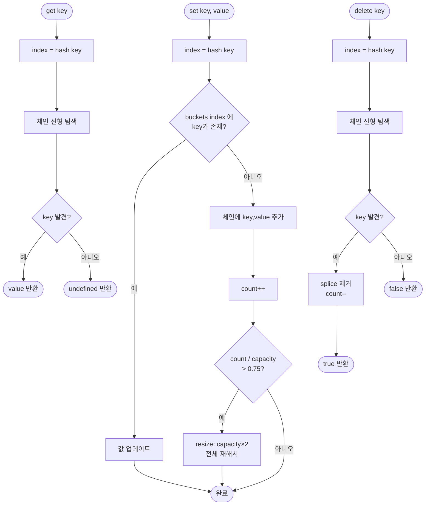

import { AlgorithmSimulation } from "#guide-sim";

# HashMapChaining 해설

## 성능 목표 예측

| 연산 | 평균 시간복잡도 | 최악 시간복잡도 | 비고 |
|------|----------------|----------------|------|
| `set` | O(1) | O(n) | 모든 키가 같은 버킷에 충돌 시 |
| `get` | O(1) | O(n) | 체인 선형 탐색 |
| `has` | O(1) | O(n) | get과 동일 경로 |
| `delete` | O(1) | O(n) | 체인 탐색 후 제거 |
| `keys/values` | O(n) | O(n) | 전체 순회 |
| 재해시(resize) | O(n) | O(n) | 가끔 발생, 분할 상환 O(1) |

---

## 목표 함수

| 메서드 | 시그니처 | 핵심 엣지케이스 |
|--------|---------|----------------|
| `set` | `(key: K, value: V): void` | 같은 키 재삽입 시 덮어쓰기; 삽입 후 load factor 확인 |
| `get` | `(key: K): V \| undefined` | 빈 맵, 없는 키 → `undefined` |
| `has` | `(key: K): boolean` | 삭제된 키 → `false` |
| `delete` | `(key: K): boolean` | 없는 키 → `false`; 삭제 후 size 감소 |
| `size` | `(): number` | 삭제 후 즉시 반영 |
| `keys/values` | `(): K[] / V[]` | 빈 맵 → 빈 배열 |

---

## 핵심 아이디어

해시맵의 핵심은 **임의의 키를 배열 인덱스로 변환**하는 것입니다. 배열은 인덱스 접근이 O(1)이므로, 키를 일관된 인덱스로 변환할 수 있다면 삽입·조회를 O(1)에 수행할 수 있습니다.

### 원형 아이디어와 naive 접근

가장 단순한 방법은 `[K, V][]` 배열에 모든 항목을 저장하고 선형 탐색으로 키를 찾는 것입니다. 이는 O(n) 시간이 걸려 데이터가 많아질수록 느려집니다.

다음 개선은 정렬 배열 + 이진 탐색으로 O(log n)을 달성하는 것입니다. 그러나 삽입마다 정렬 유지 비용이 발생합니다.

### 어떤 관찰이 돌파구가 되는가

> "키 자체를 인덱스로 사용할 수 있다면 O(1)이 가능하다."

모든 키를 정수 `[0, capacity)` 범위로 매핑하는 함수 — **해시 함수** — 를 정의하면, `buckets[hash(key)]`에서 바로 접근할 수 있습니다.

문제는 서로 다른 두 키가 같은 인덱스로 매핑될 수 있다는 점입니다(**충돌**). 체이닝은 이 충돌을 버킷마다 리스트를 두어 해결합니다.

### 관찰을 형식화: 상태/구조 정의

```
buckets: Array<Array<[K, V]>>   // 크기 capacity
count: number                    // 현재 항목 수
capacity: number                 // 버킷 수
```

각 `buckets[i]`는 해시값이 `i`인 모든 `[key, value]` 쌍의 체인입니다.

### 점화식 또는 핵심 연산

**해시 함수 (polynomial rolling hash):**
```
hash(key):
  s = String(key)
  h = 0
  for c in s:
    h = (h * 31 + c.charCodeAt(0)) % capacity
  return h
```

상수 31은 소수(prime)이며 영문 소문자 분포를 고르게 퍼뜨리는 것으로 알려져 있습니다.

**set:**
```
index = hash(key)
chain = buckets[index]
for i, [k, v] in chain:
  if k === key:
    chain[i][1] = value   // 키 존재 → 값 갱신
    return
chain.push([key, value])  // 새 항목
count++
if count / capacity > 0.75:
  resize()
```

**get:**
```
index = hash(key)
for [k, v] in buckets[index]:
  if k === key: return v
return undefined
```

**delete:**
```
index = hash(key)
chain = buckets[index]
for i, [k, v] in chain:
  if k === key:
    chain.splice(i, 1)
    count--
    return true
return false
```

**resize:**
```
newCapacity = capacity * 2
newBuckets = Array(newCapacity).fill([])
for each chain in buckets:
  for [k, v] in chain:
    newIndex = hash_with(k, newCapacity)
    newBuckets[newIndex].push([k, v])
buckets = newBuckets
capacity = newCapacity
```

### 정당성 — 왜 이것이 옳은가

- **균일 분포 가정(SUHA)**: 좋은 해시 함수는 키를 버킷에 균일하게 분산시킵니다. 그러면 각 체인의 평균 길이는 `count / capacity` = load factor ≤ 0.75입니다.
- **load factor 제어**: 재해시로 load factor를 0.75 이하로 유지하면 체인 평균 길이가 상수에 수렴해 O(1) 평균을 보장합니다.
- **분할 상환(amortized)**: 재해시는 O(n)이지만 발생 빈도가 낮습니다. n번 삽입에 최대 O(n) 재해시가 발생하므로 삽입당 분할 상환 비용은 O(1)입니다.

### 구현 디테일과 최적화

- **`buckets` 초기화**: `Array.from({ length: capacity }, () => [])`. `fill([])` 사용 금지 — 모든 버킷이 같은 배열 참조를 공유하게 됩니다.
- **키 동등 비교**: 기본적으로 `===` 사용. 객체 키는 참조 동일성으로 비교됩니다.
- **`splice` 비용**: 체인이 길어지면 splice가 O(chain) 이지만 체인이 짧으면 무시할 수 있습니다.

---

## 시뮬레이션

export const steps = [
  {
    title: "초기 상태 (capacity=8)",
    detail: "8개의 빈 버킷으로 시작합니다. 각 셀의 숫자는 체인 길이입니다.",
    array: [0, 0, 0, 0, 0, 0, 0, 0],
    highlight: [],
    marked: [],
  },
  {
    title: 'set("apple", 1) → 버킷 3',
    detail: '"apple"의 해시값이 3으로 계산되어 buckets[3]에 삽입됩니다.',
    array: [0, 0, 0, 1, 0, 0, 0, 0],
    highlight: [3],
    marked: [3],
  },
  {
    title: 'set("mango", 2) → 버킷 5',
    detail: '"mango"의 해시값이 5로 계산되어 buckets[5]에 삽입됩니다.',
    array: [0, 0, 0, 1, 0, 1, 0, 0],
    highlight: [5],
    marked: [3, 5],
  },
  {
    title: 'set("grape", 3) → 버킷 3 (충돌!)',
    detail: '"grape"의 해시값도 3입니다. buckets[3] 체인에 추가 — 체인 길이 2.',
    array: [0, 0, 0, 2, 0, 1, 0, 0],
    highlight: [3],
    marked: [3, 5],
  },
  {
    title: 'get("grape") → 버킷 3 탐색',
    detail: 'buckets[3]의 체인 ["apple", "grape"]을 순회하여 "grape"를 찾습니다.',
    array: [0, 0, 0, 2, 0, 1, 0, 0],
    highlight: [3],
    marked: [3, 5],
  },
  {
    title: 'delete("apple") → 버킷 3 체인 축소',
    detail: '"apple"을 체인에서 제거합니다. 버킷 3 체인 길이 2 → 1.',
    array: [0, 0, 0, 1, 0, 1, 0, 0],
    highlight: [3],
    marked: [5],
  },
];

<AlgorithmSimulation view="array" steps={steps} title="HashMapChaining 시뮬레이션 (capacity=8)" />

## 수도 코드와 Activity Diagram

### 의사코드

```
class HashMapChaining<K, V>:
  buckets: Array<[K,V][]>    // 버킷 배열
  capacity: number            // 버킷 수
  count: number               // 항목 수
  LOAD_FACTOR = 0.75

  hash(key):
    s = String(key)
    h = 0
    for c in s:
      h = (h * 31 + charCode(c)) mod capacity
    return h

  set(key, value):
    i = hash(key)
    for pair in buckets[i]:
      if pair.key === key:
        pair.value = value
        return
    buckets[i].push([key, value])
    count++
    if count / capacity > LOAD_FACTOR:
      resize()

  get(key):
    i = hash(key)
    for [k, v] in buckets[i]:
      if k === key: return v
    return undefined

  delete(key):
    i = hash(key)
    for j, [k, v] in buckets[i]:
      if k === key:
        buckets[i].splice(j, 1)
        count--
        return true
    return false

  resize():
    newCap = capacity * 2
    newBuckets = Array(newCap, () => [])
    for chain in buckets:
      for [k, v] in chain:
        ni = hash_with(k, newCap)
        newBuckets[ni].push([k, v])
    buckets = newBuckets
    capacity = newCap
```

### Activity Diagram


