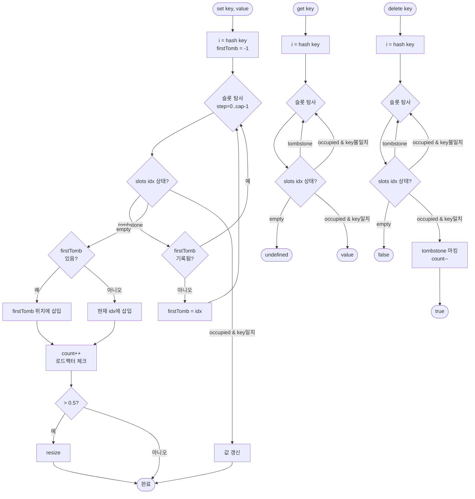

import { AlgorithmSimulation } from "#guide-sim";

# HashMapOpenAddressing 해설

## 성능 목표 예측

| 연산 | 평균 시간복잡도 | 최악 시간복잡도 | 비고 |
|------|----------------|----------------|------|
| `set` | O(1) | O(n) | 탐사 체인이 전체 길이인 경우 |
| `get` | O(1) | O(n) | 체인 탐사 |
| `has` | O(1) | O(n) | get과 동일 경로 |
| `delete` | O(1) | O(n) | tombstone 마킹 |
| 재해시(resize) | O(n) | O(n) | 분할 상환 O(1) |

체이닝 대비: load factor 0.5 제한으로 슬롯 낭비는 있지만 캐시 지역성 덕분에 실제 처리량이 더 높을 수 있음.

---

## 목표 함수

| 메서드 | 시그니처 | 핵심 엣지케이스 |
|--------|---------|----------------|
| `set` | `(key: K, value: V): void` | tombstone 슬롯 재활용; 삽입 후 load factor 확인 |
| `get` | `(key: K): V \| undefined` | tombstone 건너뜀; `empty` 만나면 중단 |
| `has` | `(key: K): boolean` | `get`과 동일 탐사 로직 |
| `delete` | `(key: K): boolean` | tombstone 마킹; 없는 키 → `false` |
| `size` | `(): number` | tombstone은 count에 미포함 |

---

## 핵심 아이디어

### 원형 아이디어와 naive 접근

체이닝은 충돌을 버킷 밖 메모리(동적 배열)로 처리합니다. 이는 포인터 추적으로 인한 캐시 미스를 유발합니다. 개방 주소법은 충돌을 배열 내부에서 해결해 포인터를 없앱니다.

### 어떤 관찰이 돌파구가 되는가

> "충돌이 발생하면 배열 내 다음 슬롯으로 이동하면 된다. 배열은 연속 메모리이므로 CPU 프리페치(prefetch)가 효과적이다."

선형 탐사는 구현이 단순하고 캐시 효율이 좋습니다. 단점은 **primary clustering** — 충돌이 연속 슬롯에 몰리는 현상 — 이지만 load factor를 낮게 유지하면 완화됩니다.

### 관찰을 형식화: 상태/구조 정의

```
slots: Array<Slot<K, V>>    // 크기 capacity의 슬롯 배열
count: number                // occupied 슬롯 수
capacity: number             // 전체 슬롯 수

type Slot<K, V> =
  | { state: "empty" }
  | { state: "occupied"; key: K; value: V }
  | { state: "tombstone" }
```

### 점화식 또는 핵심 연산

**선형 탐사 프로브 시퀀스:**
```
probe index: (hash(key) + i) % capacity, i = 0, 1, 2, ...
```

**get — 탐사 규칙:**
- `empty` 슬롯 만남 → 키 없음, `undefined` 반환
- `tombstone` 슬롯 만남 → 건너뛰고 계속 탐사
- `occupied` & 키 일치 → 값 반환

**set — 탐사 규칙:**
- `empty` 또는 `tombstone` 만남 → 삽입 (단, tombstone은 첫 번째 발견된 것을 기억해 최적 위치에 삽입)
- `occupied` & 키 일치 → 값 갱신
- 삽입 후 load factor > 0.5 → resize

**delete — 탐사 규칙:**
- `occupied` & 키 일치 → tombstone으로 변경, count--
- `empty` 만남 → 키 없음, false

**resize:**
```
newCapacity = capacity * 2
newSlots = Array(newCapacity, { state: "empty" })
for slot in slots:
  if slot.state === "occupied":
    rehash slot into newSlots  // tombstone 무시
slots = newSlots
capacity = newCapacity
```

### 정당성 — 왜 이것이 옳은가

**tombstone 없이 단순 삭제가 왜 안 되는가:**

```
slots: [A, B(tombstone없이삭제), C, empty]
         ^           ^
       hash(A)=0   hash(C)=0 → 탐사 → 슬롯1 → 슬롯2

// B를 단순 empty로 만들면:
get(C): hash(C)=0 → 슬롯0(A) → 슬롯1(empty) → 탐사 중단 → C 못 찾음!
```

tombstone을 쓰면 슬롯1에서 탐사가 멈추지 않고 슬롯2의 C를 찾습니다.

**load factor 0.5:**
선형 탐사는 load factor λ일 때 탐사 횟수 기댓값이 `1/(1-λ)^2`에 근접합니다 (Knuth 분석). λ=0.5 → 기댓값 ~4, λ=0.75 → ~16. 0.5가 실용적 균형점입니다.

### 구현 디테일과 최적화

- **tombstone 재활용**: `set` 탐사 중 첫 tombstone 위치를 기록해 두었다가, 키를 찾지 못하면 그 위치에 삽입합니다 (탐사 체인 단축).
- **capacity는 2의 거듭제곱**: `% capacity`를 비트 AND `& (capacity-1)`로 대체해 성능 개선 가능.
- **resize 시 tombstone 제거**: 재해시는 tombstone을 무시하므로, 재해시 후 사실상 tombstone이 사라져 탐사 체인이 짧아집니다.

---

## 시뮬레이션

export const steps = [
  {
    title: "초기 상태 (capacity=8)",
    detail: "8개 슬롯 모두 'empty'. 0=비어있음, 1=점유, -1=tombstone으로 표시합니다.",
    array: [0, 0, 0, 0, 0, 0, 0, 0],
    highlight: [],
    marked: [],
  },
  {
    title: 'set("a", 1) → 슬롯 3',
    detail: '"a"의 해시값 3. 슬롯3이 empty → 삽입.',
    array: [0, 0, 0, 1, 0, 0, 0, 0],
    highlight: [3],
    marked: [3],
  },
  {
    title: 'set("b", 2) → 슬롯 3 충돌 → 슬롯 4',
    detail: '"b"의 해시값도 3. 슬롯3은 occupied → 선형 탐사: 슬롯4(empty) → 삽입.',
    array: [0, 0, 0, 1, 1, 0, 0, 0],
    highlight: [3, 4],
    marked: [3, 4],
  },
  {
    title: 'set("c", 3) → 슬롯 3 충돌 → 슬롯 4 충돌 → 슬롯 5',
    detail: '"c"의 해시값도 3. 슬롯3, 4 occupied → 슬롯5(empty) → 삽입.',
    array: [0, 0, 0, 1, 1, 1, 0, 0],
    highlight: [3, 4, 5],
    marked: [3, 4, 5],
  },
  {
    title: 'delete("b") → 슬롯 4에 tombstone (-1)',
    detail: '"b"는 슬롯4. tombstone으로 마킹. 슬롯4 값: -1(tombstone).',
    array: [0, 0, 0, 1, -1, 1, 0, 0],
    highlight: [4],
    marked: [3, 5],
  },
  {
    title: 'get("c") → 슬롯3(a,스킵) → 슬롯4(tombstone,계속) → 슬롯5(c,반환)',
    detail: 'tombstone을 만나도 탐사를 멈추지 않아 슬롯5의 "c"를 올바르게 찾습니다.',
    array: [0, 0, 0, 1, -1, 1, 0, 0],
    highlight: [3, 4, 5],
    marked: [3, 5],
  },
];

<AlgorithmSimulation view="array" steps={steps} title="HashMapOpenAddressing 시뮬레이션 (capacity=8)" />

## 수도 코드와 Activity Diagram

### 의사코드

```
class HashMapOpenAddressing<K, V>:
  slots: Slot[]       // empty | occupied(k,v) | tombstone
  capacity: number
  count: number
  LOAD_FACTOR = 0.5

  hash(key):
    s = String(key)
    h = 0
    for c in s:
      h = (h * 31 + charCode(c)) mod capacity
    return h

  set(key, value):
    firstTombstone = -1
    i = hash(key)
    for step = 0 to capacity-1:
      idx = (i + step) % capacity
      if slots[idx].state === "tombstone":
        if firstTombstone === -1: firstTombstone = idx
      else if slots[idx].state === "empty":
        insertAt = firstTombstone !== -1 ? firstTombstone : idx
        slots[insertAt] = { state:"occupied", key, value }
        count++
        if count / capacity > LOAD_FACTOR: resize()
        return
      else if slots[idx].key === key:
        slots[idx].value = value
        return

  get(key):
    i = hash(key)
    for step = 0 to capacity-1:
      idx = (i + step) % capacity
      if slots[idx].state === "empty": return undefined
      if slots[idx].state === "occupied" and slots[idx].key === key:
        return slots[idx].value
      // tombstone → 계속 탐사
    return undefined

  delete(key):
    i = hash(key)
    for step = 0 to capacity-1:
      idx = (i + step) % capacity
      if slots[idx].state === "empty": return false
      if slots[idx].state === "occupied" and slots[idx].key === key:
        slots[idx] = { state: "tombstone" }
        count--
        return true
    return false

  resize():
    newCap = capacity * 2
    newSlots = Array(newCap, { state:"empty" })
    for slot in slots:
      if slot.state === "occupied":
        i = hash_with(slot.key, newCap)
        // 선형 탐사로 빈 슬롯 찾아 삽입
    slots = newSlots
    capacity = newCap
```

### Activity Diagram


