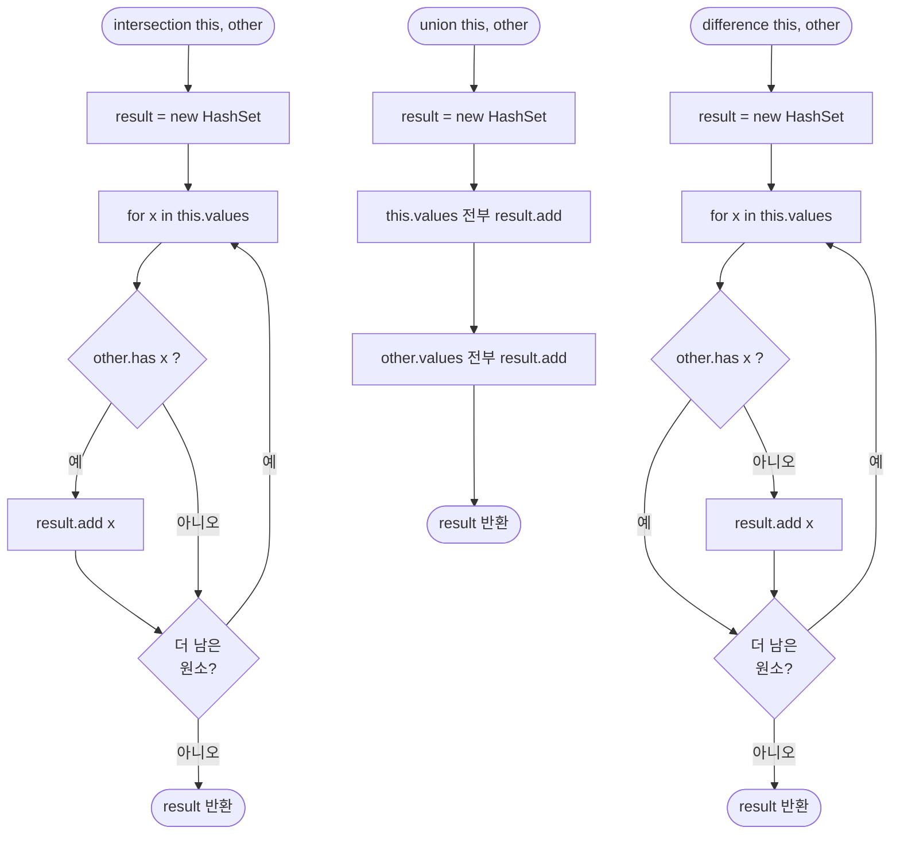

import { AlgorithmSimulation } from "#guide-sim";

# HashSet 해설

## 성능 목표 예측

| 연산 | 시간복잡도 | 비고 |
|------|-----------|------|
| `add` | O(1) 평균 | HashMapChaining.set |
| `has` | O(1) 평균 | HashMapChaining.has |
| `delete` | O(1) 평균 | HashMapChaining.delete |
| `values` | O(n) | 전체 키 수집 |
| `union` | O(n + m) | 두 집합 순회 |
| `intersection` | O(n) | this 순회 + other.has |
| `difference` | O(n) | this 순회 + other.has |

교집합과 차집합이 O(n × m)이 아닌 O(n)인 이유: `other.has`가 O(1) 평균이기 때문.

---

## 목표 함수

| 메서드 | 시그니처 | 핵심 엣지케이스 |
|--------|---------|----------------|
| `add` | `(item: T): void` | 중복 추가 → size 불변 |
| `has` | `(item: T): boolean` | 빈 집합 → false |
| `delete` | `(item: T): boolean` | 없는 항목 → false |
| `values` | `(): T[]` | 빈 집합 → [] |
| `union` | `(other: HashSet<T>): HashSet<T>` | 한쪽 빈 집합; 원본 불변 |
| `intersection` | `(other: HashSet<T>): HashSet<T>` | 교집합 없음 → 빈 집합; 원본 불변 |
| `difference` | `(other: HashSet<T>): HashSet<T>` | other ⊇ this → 빈 집합; 원본 불변 |

---

## 핵심 아이디어

### 원형 아이디어와 naive 접근

집합은 "중복 없는 원소의 모음"입니다. 가장 단순한 구현은 배열에 원소를 저장하고, 삽입 시 중복 여부를 선형 탐색으로 확인하는 것입니다. 이는 O(n) 삽입이며 교집합은 O(n × m)입니다.

정렬 배열로 이진 탐색을 사용하면 탐색은 O(log n)으로 빨라지지만 삽입은 O(n)(이동 필요)으로 여전히 느립니다.

### 어떤 관찰이 돌파구가 되는가

> "집합 연산에서 'x가 집합에 있는가?'라는 질문은 해시 기반으로 O(1)에 답할 수 있다."

HashMapChaining은 이미 O(1) 평균의 삽입·조회·삭제를 제공합니다. 여기서 "값"이 필요 없고 "키의 존재 여부"만 필요한 것이 HashSet입니다.

교집합과 차집합이 O(n)인 이유는 `intersection`을 "this의 원소 중 other에 있는 것"으로 정의하고, `other.has`가 O(1)이기 때문입니다. 두 집합 크기가 n, m일 때 O(n)으로 계산됩니다 (물론 m이 0이면 교집합은 공집합).

### 관찰을 형식화: 상태/구조 정의

```
// HashSet 내부 상태
map: HashMapChaining<T, true>  // 값 자리를 sentinel(true)로 채운 해시맵

add(item):    map.set(item, true)
has(item):    map.has(item)
delete(item): map.delete(item)
size():       map.size()
values():     map.keys()
```

### 점화식 또는 핵심 연산

**union(A, B):**
```
result = new HashSet()
for x in A.values(): result.add(x)
for x in B.values(): result.add(x)
return result
// 총 O(|A| + |B|) — add는 중복을 무시하므로 안전
```

**intersection(A, B):**
```
result = new HashSet()
// B가 크면 A를 순회하는 게 이득 (A가 작으면 result가 작음)
for x in A.values():
  if B.has(x): result.add(x)
return result
// O(|A|) — B.has가 O(1)
```

**difference(A, B):**
```
result = new HashSet()
for x in A.values():
  if not B.has(x): result.add(x)
return result
// O(|A|)
```

### 정당성 — 왜 이것이 옳은가

- **add 중복 무시**: `map.set(item, true)`는 이미 존재하는 키라면 값을 `true`로 덮어쓸 뿐, size를 증가시키지 않습니다. 이미 체이닝 구현에서 보장됩니다.
- **집합 연산의 불변성**: 세 연산 모두 새 `HashSet` 인스턴스를 반환하고 `this`나 `other`를 수정하지 않습니다. 각 연산 내에서 `this`와 `other`의 원소는 읽기만 합니다.
- **교집합의 정확성**: `for x in A: if B.has(x)` 패턴은 x가 A에 속하고(루프 조건) B에 속하는(has 조건) 원소만 수집합니다. 이는 A ∩ B의 수학적 정의와 일치합니다.

### 구현 디테일과 최적화

- **sentinel 값**: `map.set(item, true)` 대신 `undefined`나 `null`도 사용 가능합니다. 타입 안전을 위해 `true` 또는 `1` 같은 명시적 sentinel을 권장합니다.
- **교집합 최적화**: `|A| < |B|`이면 A를 순회하는 것이 유리합니다. `if (this.size() > other.size()) return other.intersection(this)` 같은 최적화를 추가할 수 있습니다.
- **HashMapChaining 재사용**: 별도로 해시 로직을 구현하지 않고 이미 구현한 HashMapChaining을 내부적으로 가져다 씁니다. 코드 재사용과 단일 책임 원칙을 동시에 달성합니다.

---

## 시뮬레이션

export const steps = [
  {
    title: "Alice의 팔로우 집합 초기화",
    detail: "alice={}, 8개 버킷 모두 비어있음. 0=비어있음, 1=원소 있음.",
    array: [0, 0, 0, 0, 0, 0, 0, 0],
    highlight: [],
    marked: [],
  },
  {
    title: 'alice.add("bob") → 버킷 2',
    detail: '"bob" 해시값=2. 버킷 2에 삽입.',
    array: [0, 0, 1, 0, 0, 0, 0, 0],
    highlight: [2],
    marked: [2],
  },
  {
    title: 'alice.add("charlie") → 버킷 5',
    detail: '"charlie" 해시값=5. 버킷 5에 삽입.',
    array: [0, 0, 1, 0, 0, 1, 0, 0],
    highlight: [5],
    marked: [2, 5],
  },
  {
    title: 'alice.add("dave") → 버킷 7',
    detail: '"dave" 해시값=7. 버킷 7에 삽입.',
    array: [0, 0, 1, 0, 0, 1, 0, 1],
    highlight: [7],
    marked: [2, 5, 7],
  },
  {
    title: 'alice.intersection(bob): "charlie" 탐사',
    detail: 'alice.values()=["bob","charlie","dave"] 순회. "charlie"→bob.has("charlie")=true → 교집합에 추가.',
    array: [0, 0, 1, 0, 0, 1, 0, 1],
    highlight: [5],
    marked: [5],
  },
  {
    title: '교집합 결과: {"charlie"}',
    detail: '"bob"→bob.has(false), "dave"→bob.has(false). 최종 교집합={charlie}.',
    array: [0, 0, 0, 0, 0, 1, 0, 0],
    highlight: [],
    marked: [5],
  },
];

<AlgorithmSimulation view="array" steps={steps} title="HashSet 교집합 시뮬레이션 (capacity=8)" />

## 수도 코드와 Activity Diagram

### 의사코드

```
class HashSet<T>:
  map: HashMapChaining<T, true>

  constructor(cap):
    map = new HashMapChaining(cap)

  add(item):
    map.set(item, true)

  has(item):
    return map.has(item)

  delete(item):
    return map.delete(item)

  size():
    return map.size()

  values():
    return map.keys()

  union(other):
    result = new HashSet()
    for x in this.values(): result.add(x)
    for x in other.values(): result.add(x)
    return result

  intersection(other):
    result = new HashSet()
    for x in this.values():
      if other.has(x): result.add(x)
    return result

  difference(other):
    result = new HashSet()
    for x in this.values():
      if not other.has(x): result.add(x)
    return result
```

### Activity Diagram


