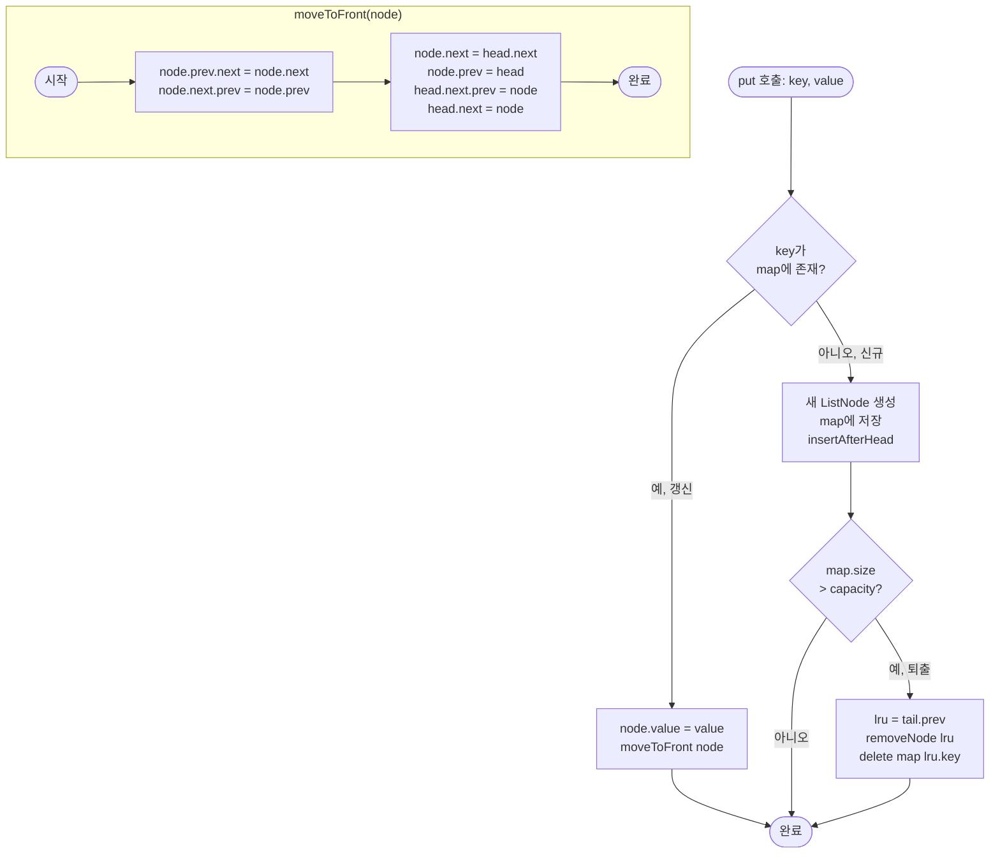

import { AlgorithmSimulation } from "#guide-sim";

# LRUCache 해설

## 성능 목표 예측

| 연산 | 목표 복잡도 | 이유 |
|------|------------|------|
| `get` | O(1) 평균 | HashMap 조회 O(1) + 리스트 이동 O(1) |
| `put` | O(1) 평균 | HashMap 삽입 O(1) + 리스트 삽입/삭제 O(1) |
| LRU 퇴출 | O(1) | tail 노드 직접 접근 |

HashMap 단독으로는 순서 추적이 O(n). 이중 연결 리스트 단독으로는 키 조회가 O(n). 두 구조를 결합하면 각자의 단점을 상쇄한다.

---

## 목표 함수

| 메서드 | 시그니처 | 엣지 케이스 |
|--------|---------|------------|
| `get` | `(key: number) => number` | 존재하지 않는 key → `-1` |
| `put` | `(key, value) => void` | 기존 key 갱신 → 값 수정 + MRU 이동 (퇴출 없음); capacity=1 → put마다 기존 항목 퇴출 |

---

## 핵심 아이디어

### 원형 아이디어와 naive 접근

Map만 사용하면 O(1) 조회는 가능하지만, "가장 오래된 항목"을 찾으려면 모든 키의 마지막 사용 시각을 비교해야 한다. 삽입 순서 배열을 추가로 유지하면 퇴출은 O(1)이지만 `get`에서 MRU 갱신 시 해당 키를 배열에서 찾고 이동하는 비용이 O(n)이 된다.

### 어떤 관찰이 돌파구가 되는가

핵심은 두 가지 요구사항이 동시에 있다는 점이다:
1. **임의 키로 O(1) 조회** → HashMap
2. **사용 순서 O(1) 갱신과 LRU O(1) 제거** → DoublyLinkedList

DoublyLinkedList는 노드 참조만 있으면 임의 위치 삽입·삭제가 O(1)이다. HashMap이 각 키에 대해 노드 참조를 저장하면, 두 구조를 합쳐 모든 연산을 O(1)에 해결할 수 있다.

### 관찰을 형식화: 상태/구조 정의

```
HashMap:  { 1 → Node(1,10), 3 → Node(3,30), 4 → Node(4,40) }

이중 연결 리스트 (MRU → LRU):
[dummy_head] ⇄ [4:40] ⇄ [3:30] ⇄ [1:10] ⇄ [dummy_tail]
```

- `map`: `Map<number, ListNode>` — 키 → 노드 참조
- `head` (더미 센티넬): 리스트의 논리적 시작점. `head.next` = MRU
- `tail` (더미 센티넬): 리스트의 논리적 끝점. `tail.prev` = LRU
- 더미 센티넬을 사용하면 head/tail 경계에서 null 체크 없이 항상 동일한 삽입·삭제 코드를 사용할 수 있다

각 `ListNode`는 `key`, `value`, `prev`, `next`를 갖는다. key를 저장하는 이유는 LRU 퇴출 시 HashMap에서도 삭제해야 하기 때문이다.

### 점화식 또는 핵심 연산

**moveToFront(node)** — 어떤 노드든 MRU로 이동:
```
// 1. 현재 위치에서 제거
node.prev.next = node.next
node.next.prev = node.prev

// 2. head 바로 뒤에 삽입
node.next = head.next
node.prev = head
head.next.prev = node
head.next = node
```

**get(key)**:
```
if key not in map: return -1
node = map[key]
moveToFront(node)
return node.value
```

**put(key, value)**:
```
if key in map:
  node = map[key]
  node.value = value
  moveToFront(node)
else:
  node = new ListNode(key, value)
  map[key] = node
  insertAfterHead(node)
  if map.size > capacity:
    lru = tail.prev          // LRU 노드
    removeNode(lru)
    delete map[lru.key]
```

### 정당성 — 왜 이것이 옳은가

더미 센티넬 덕분에 `moveToFront`와 `removeNode`는 노드가 head 바로 다음이든, tail 바로 앞이든, 중간이든 동일한 코드로 처리된다. 특수 케이스가 없어 버그 발생 여지가 줄어든다.

HashMap은 항상 리스트 내의 살아있는 노드를 가리킨다. `put`에서 퇴출 후 `map.delete(lru.key)`를 호출해 동기화를 유지한다. 이 두 구조가 항상 같은 항목 집합을 가리키는 것이 핵심 불변식이다.

### 구현 디테일과 최적화

- 더미 센티넬: `head.prev = null`, `tail.next = null`. `head.next = tail`, `tail.prev = head`로 초기화.
- `ListNode`에 `key`를 저장해야 퇴출 시 map에서 O(1) 삭제 가능.
- JavaScript의 `Map`은 삽입 순서를 보장하므로 `Map` 자체를 LRU로 쓰는 트릭(`map.keys().next()`)도 있지만, 이는 구현 의존적이고 비직관적이므로 명시적 DoublyLinkedList 사용을 권장한다.

---

## 시뮬레이션

export const lruSteps = [
  {
    title: "초기 상태: 빈 캐시 (capacity=3)",
    detail: "map = {}, 리스트: [head] ⇄ [tail]. MRU→LRU 순으로 key 목록 표시",
    array: [],
    highlight: [],
    marked: [],
  },
  {
    title: "put(1, 10)",
    detail: "map에 없음 → 새 노드 삽입. head 바로 뒤에 추가 → MRU=1. 크기=1 (초과 아님)",
    array: [1],
    highlight: [0],
    marked: [],
  },
  {
    title: "put(2, 20)",
    detail: "새 노드 삽입. MRU=2. 크기=2",
    array: [2, 1],
    highlight: [0],
    marked: [],
  },
  {
    title: "put(3, 30)",
    detail: "새 노드 삽입. MRU=3. 크기=3 (capacity 도달)",
    array: [3, 2, 1],
    highlight: [0],
    marked: [],
  },
  {
    title: "get(1) → 10",
    detail: "key=1 존재 → 값 10 반환. 노드를 MRU로 이동 (리스트에서 제거 후 head 뒤 삽입)",
    array: [1, 3, 2],
    highlight: [0],
    marked: [],
  },
  {
    title: "put(4, 40) → LRU 퇴출",
    detail: "크기=3=capacity → LRU(tail.prev=2) 퇴출. map에서 key=2 삭제. 새 노드 4 MRU 삽입",
    array: [4, 1, 3],
    highlight: [0],
    marked: [2],
  },
  {
    title: "get(2) → -1",
    detail: "key=2는 퇴출됨 → -1 반환. 리스트 변화 없음",
    array: [4, 1, 3],
    highlight: [],
    marked: [],
  },
  {
    title: "get(3) → 30",
    detail: "key=3 존재 → 값 30 반환. 노드 3을 MRU로 이동",
    array: [3, 4, 1],
    highlight: [0],
    marked: [],
  },
];

<AlgorithmSimulation
  view="array"
  steps={lruSteps}
  title="LRUCache 시뮬레이션 (배열 = MRU→LRU 순 key 목록, capacity=3)"
/>

> `array` = 현재 캐시의 key 목록, 왼쪽이 MRU(가장 최근), 오른쪽이 LRU(가장 오래됨).
> highlight(파란색): 방금 MRU로 이동된 또는 삽입된 항목. marked(주황색): 퇴출된 항목.

---

## 수도 코드와 Activity Diagram

### 의사코드

```
class ListNode:
  key: number
  value: number
  prev: ListNode | null = null
  next: ListNode | null = null

class LRUCache:
  capacity: number
  map: Map<number, ListNode> = {}
  head: ListNode = new ListNode(-1, -1)  // 더미
  tail: ListNode = new ListNode(-1, -1)  // 더미
  // 초기화: head.next = tail, tail.prev = head

  get(key):
    if key not in map: return -1
    moveToFront(map[key])
    return map[key].value

  put(key, value):
    if key in map:
      map[key].value = value
      moveToFront(map[key])
    else:
      node = new ListNode(key, value)
      map[key] = node
      insertAfterHead(node)
      if map.size > capacity:
        lru = tail.prev
        removeNode(lru)
        delete map[lru.key]

  moveToFront(node):
    removeNode(node)
    insertAfterHead(node)

  removeNode(node):
    node.prev.next = node.next
    node.next.prev = node.prev

  insertAfterHead(node):
    node.next = head.next
    node.prev = head
    head.next.prev = node
    head.next = node
```

### Activity Diagram


