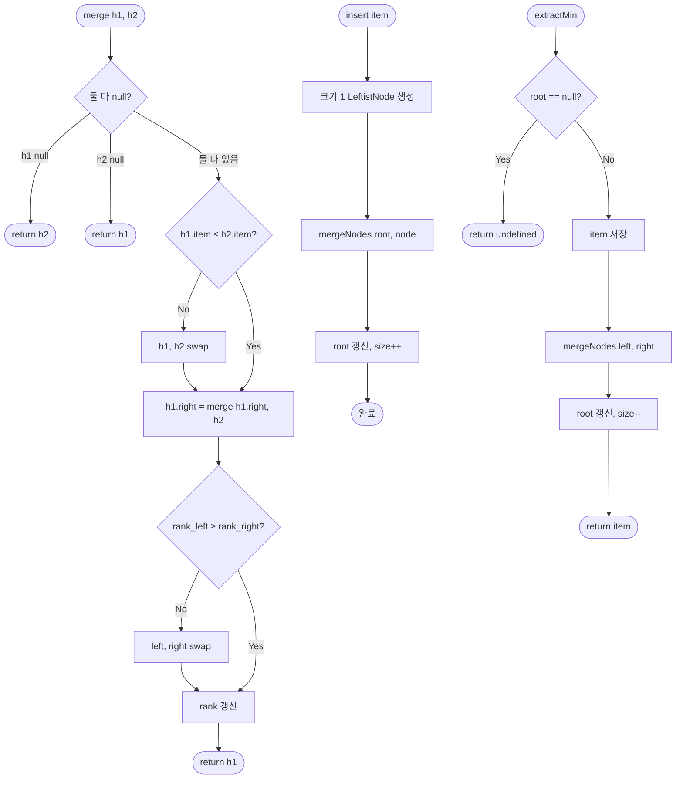

import { AlgorithmSimulation } from "#guide-sim";

# LeftistHeap (좌향 힙) 해설

## 성능 목표 예측

| 연산 | Binary Heap | LeftistHeap | 비고 |
|------|------------|-------------|------|
| insert | O(log n) | O(log n) | 동일 (merge로 구현) |
| extractMin | O(log n) | O(log n) | 동일 (merge로 구현) |
| merge | O(n) | **O(log n)** | LH의 핵심 강점 |
| peek | O(1) | **O(1)** | 루트 직접 접근 |
| size | O(1) | O(1) | 동일 |

---

## 목표 함수

| 메서드 | 반환 타입 | 엣지케이스 |
|--------|-----------|-----------|
| `insert(item)` | `void` | 크기 1 힙으로 merge 위임 |
| `extractMin()` | `T \| undefined` | 빈 힙 → `undefined`, 루트 제거 후 좌우 merge |
| `merge(other)` | `LeftistHeap<T>` | 빈 힙과의 병합 가능 |
| `peek()` | `T \| undefined` | 빈 힙 → `undefined`, O(1) |
| `size()` | `number` | 0부터 시작 |
| `isEmpty()` | `boolean` | size === 0과 동치 |

---

## 핵심 아이디어

### 왜 좌향 힙이 필요한가

이진 힙의 병합은 O(n)이다. 한쪽 힙의 원소를 다른 힙에 하나씩 삽입해야 하기 때문이다.

좌향 힙은 **오른쪽 경로 길이를 O(log n)으로 강제**함으로써 병합을 오른쪽 경로에서만 수행하도록 만든다. 왼쪽에 뭔가 쌓여 있더라도 오른쪽만 보면 되므로, 병합이 O(log n)이 된다.

### 원형 아이디어: 오른쪽 경로만 합친다

두 힙을 병합할 때 두 루트 중 더 작은 쪽이 새 루트가 된다. 그 루트의 **오른쪽 서브트리**와 다른 힙을 재귀적으로 병합하고, 결과를 오른쪽 자식으로 붙인다.

```
merge(h1, h2):
  더 작은 루트 선택 (winner)
  winner.right = merge(winner.right, loser)
  좌향 속성 복원 (rank 확인, 필요 시 swap)
  return winner
```

재귀 깊이는 두 힙 오른쪽 경로 길이의 합인 O(log n)이다.

### 어떤 관찰이 돌파구가 되는가

**핵심 관찰:** 오른쪽 경로 길이를 O(log n)으로 강제하면, 병합이 그 경로를 따라가므로 자동으로 O(log n)이 된다.

이를 위한 불변식: 모든 노드에서 `rank(left) ≥ rank(right)`.

rank는 오른쪽 null까지의 최단 경로 길이이다. n개 노드에서 rank ≤ ⌊log₂(n+1)⌋이 성립한다.

### 관찰을 형식화: 상태/구조 정의

```ts
class LeftistNode<T> {
  item: T;
  rank: number;           // = min(left.rank, right.rank) + 1
  left: LeftistNode<T> | null;
  right: LeftistNode<T> | null;
}

class LeftistHeap<T> {
  root: LeftistNode<T> | null;
  _size: number;
  compare: (a: T, b: T) => number;
}
```

**불변식:**
1. 최소 힙 속성: `parent.item ≤ child.item`
2. 좌향 속성: `rank(left) ≥ rank(right)` (null의 rank = 0)
3. `rank = right.rank + 1` (오른쪽 자식 rank + 1)

### 점화식 또는 핵심 연산

**병합 (재귀):**
```
mergeNodes(a, b):
  if a == null: return b
  if b == null: return a
  // 힙 순서 보장: 더 작은 루트가 상위
  if compare(a.item, b.item) > 0: swap(a, b)
  a.right = mergeNodes(a.right, b)
  // 좌향 속성 복원
  if rank(a.left) < rank(a.right):
    swap(a.left, a.right)
  a.rank = rank(a.right) + 1
  return a
```

**rank 계산:**
```
rank(node):
  if node == null: return 0
  return node.rank
```

### 정당성: 왜 이것이 옳은가

**rank 상한 증명:** rank k인 좌향 트리는 최소 2^k - 1개의 노드를 가진다. (귀납법: rank k는 rank k-1인 두 서브트리로 구성. 좌향 속성에 의해 오른쪽 경로가 최단.)

따라서 n개 노드를 가진 좌향 힙의 rank ≤ ⌊log₂(n+1)⌋ = O(log n).

병합 재귀 깊이 ≤ rank(h1) + rank(h2) = O(log n).

### 구현 디테일과 최적화

- **null rank:** null 노드의 rank를 0으로 처리하는 헬퍼 함수를 사용하면 구현이 단순해진다.
- **insert:** `merge(this, singleNodeHeap)`. 새 힙 객체를 만들거나 mergeNodes를 직접 호출한다.
- **extractMin:** 루트 제거 → `mergeNodes(root.left, root.right)`. size 감소.
- **가변 vs 불변:** merge를 파괴적으로 구현하면 내부 참조 공유에 주의해야 한다. 외부로 반환하는 새 LeftistHeap 객체는 공유된 노드를 가리킨다.

---

## 시뮬레이션

export const steps = [
  {
    title: "초기 상태",
    detail: "빈 좌향 힙. root = null.",
    array: [],
    highlight: [],
    marked: [],
  },
  {
    title: "insert(5)",
    detail: "크기 1 힙 B(5, rank=1) 생성. merge(null, B(5)) = B(5). root = 5.",
    array: [5],
    highlight: [0],
    marked: [],
  },
  {
    title: "insert(3)",
    detail: "B(3) 생성. merge(5, 3). 3 < 5이므로 3이 루트. 3.right = 5. rank(3)=1. 좌향 유지.",
    array: [3, 5],
    highlight: [0],
    marked: [],
  },
  {
    title: "insert(7)",
    detail: "B(7) 생성. merge(3, 7). 3 < 7. 3.right = merge(5, 7). 5<7 → 5.right=7, 5.rank=1. 3.right=5.",
    array: [3, 5, 7],
    highlight: [0],
    marked: [],
  },
  {
    title: "insert(1)",
    detail: "B(1) 생성. merge(3, 1). 1 < 3. 1.right = merge(null, 3) = 3. rank: 1.rank=1. 좌자식 없으므로 swap. 1.left=3, 1.right=null.",
    array: [1, 3, 5, 7],
    highlight: [0],
    marked: [],
  },
  {
    title: "extractMin() → 1",
    detail: "root(1) 제거. merge(1.left=3, 1.right=null) = 3 서브트리. 결과: root=3.",
    array: [3, 5, 7],
    highlight: [0],
    marked: [],
  },
];

<AlgorithmSimulation view="array" steps={steps} title="LeftistHeap 삽입/추출 시뮬레이션" />

## 수도 코드와 Activity Diagram

### 의사코드

```
// 핵심: 두 노드 병합 (재귀)
mergeNodes(a, b):
  if a == null: return b
  if b == null: return a
  if compare(a.item, b.item) > 0:
    swap(a, b)          // a가 항상 더 작은 루트
  a.right = mergeNodes(a.right, b)
  // 좌향 속성 복원
  leftRank  = a.left  == null ? 0 : a.left.rank
  rightRank = a.right == null ? 0 : a.right.rank
  if leftRank < rightRank:
    swap(a.left, a.right)
  a.rank = min(leftRank, rightRank) + 1
  return a

// 삽입
insert(item):
  node = new LeftistNode(item, rank=1)
  root = mergeNodes(root, node)
  _size++

// 최솟값 추출
extractMin():
  if root == null: return undefined
  item = root.item
  root = mergeNodes(root.left, root.right)
  _size--
  return item

// 병합
merge(other):
  result = new LeftistHeap(compare)
  result.root = mergeNodes(this.root, other.root)
  result._size = this._size + other._size
  return result
```

### Activity Diagram


