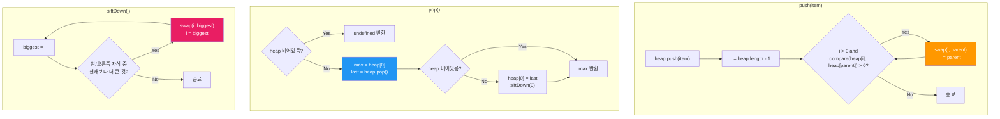

import { AlgorithmSimulation } from "#guide-sim";

# MaxHeap (최대 힙) 해설

## 성능 목표 예측

| 연산 횟수 n | naive 정렬 O(n log n) per op | 목표 O(log n) per op |
|-------------|------------------------------|----------------------|
| 1,000       | ~10ms (전체)                 | <1ms                 |
| 10,000      | ~100ms                       | <1ms                 |
| 100,000     | ~5,000ms                     | <20ms                |
| Top-K (K=100, n=10^5) | O(n log n) 전체 정렬 | O(n log n) push + O(K log n) pop |

MaxHeap은 Top-K를 구할 때 전체 정렬보다 효율적이지 않지만 (같은 O(n log n)),
스트리밍 환경에서 원소가 하나씩 들어올 때 최댓값을 O(log n)에 유지하는 게 핵심입니다.

---

## 목표 함수

| 연산 | 내부 동작 | 시간 | 공간 |
|------|-----------|------|------|
| `push` | 배열 끝 삽입 + bubbleUp | O(log n) | O(1) |
| `pop` | 루트 제거 + 마지막→루트 + siftDown | O(log n) | O(1) |
| `peek` | 배열 인덱스 0 접근 | O(1) | O(1) |
| `size` | 배열 length 반환 | O(1) | O(1) |
| `isEmpty` | size === 0 | O(1) | O(1) |

**주요 엣지케이스:**
- 빈 힙에서 `pop()`/`peek()` → `undefined`
- 동일값 원소 → 힙 속성에 의해 임의 순서로 pop (안정 정렬 아님)
- 단일 원소 → push/pop 후 isEmpty

---

## 핵심 아이디어

### MinHeap과 MaxHeap의 관계

MaxHeap은 MinHeap과 구조가 완전히 동일합니다.
유일한 차이는 힙 속성의 방향입니다:

| | MinHeap | MaxHeap |
|---|---------|---------|
| 힙 속성 | parent ≤ child | parent ≥ child |
| 루트 | 최솟값 | 최댓값 |
| 비교 함수 | `compare(child, parent) < 0` 이면 swap | `compare(child, parent) > 0` 이면 swap |
| 구현 방식 | `compare(a,b) < 0` → a 우선 | `compare(a,b) > 0` → a 우선 (방향 반전) |

MinHeap 구현에서 비교 함수를 반전하면 MaxHeap이 됩니다.

### 어떤 관찰이 돌파구가 되는가

**관찰:** Top-K 스트림 처리에서 "현재까지의 최댓값"만 필요하다면 전체를 정렬할 필요가 없습니다.
완전 이진 트리의 루트가 항상 최댓값을 보장하므로, O(1) peek과 O(log n) pop이면 충분합니다.

### 관찰을 형식화: 상태/구조 정의

**배열 기반 완전 이진 트리 (MaxHeap 속성):**
```
인덱스 i의 부모:         Math.floor((i - 1) / 2)
인덱스 i의 왼쪽 자식:   2 * i + 1
인덱스 i의 오른쪽 자식: 2 * i + 2

힙 속성: compare(heap[parent], heap[child]) >= 0
         즉, 부모가 자식보다 항상 크거나 같다
```

### 점화식 또는 핵심 연산

```
// bubbleUp (push 후 힙 속성 복원)
i = heap.length - 1
while i > 0:
  parent = Math.floor((i - 1) / 2)
  if compare(heap[i], heap[parent]) > 0:   // 자식이 더 크면 (MaxHeap)
    swap(heap, i, parent)
    i = parent
  else:
    break

// siftDown (pop 후 힙 속성 복원)
i = 0
n = heap.length
while true:
  left  = 2 * i + 1
  right = 2 * i + 2
  biggest = i                               // 현재, 왼쪽, 오른쪽 중 최대

  if left < n and compare(heap[left], heap[biggest]) > 0:
    biggest = left
  if right < n and compare(heap[right], heap[biggest]) > 0:
    biggest = right

  if biggest !== i:
    swap(heap, i, biggest)
    i = biggest
  else:
    break
```

### 정당성 — 왜 이것이 옳은가

**bubbleUp 정당성:**
- 새 원소는 트리 맨 아래에 추가 → 완전 이진 트리 형태 유지
- 부모보다 큰 동안 swap → 부모-자식 힙 속성 복원
- 트리 높이 = O(log n) → 최대 O(log n) swap

**siftDown 정당성:**
- 루트 제거 후 마지막 원소를 루트로 → 완전 이진 트리 형태 유지
- 두 자식 중 더 큰 자식과 swap → MaxHeap 속성 복원
  - 왜 더 큰 자식과? 더 작은 자식과 swap하면 새로운 부모가 형제보다 작아질 수 있음
- 높이 O(log n) → O(log n) swap

### 구현 디테일과 최적화

- `pop`에서 원소가 1개이면 siftDown 없이 직접 pop
- TypeScript `noUncheckedIndexedAccess` 대응: 인덱스 접근 전 길이 확인
- 비교 함수를 생성자에서 주입받아 클로저로 저장

---

## 시뮬레이션

export const steps = [
  {
    title: "초기 상태",
    detail: "빈 MaxHeap. compare = (a,b) => a - b (숫자 최댓값 우선). heap = []",
    array: [],
    highlight: [],
    marked: [],
  },
  {
    title: "push(3)",
    detail: "heap = [3]. 부모 없음 → bubbleUp 종료.",
    array: [3],
    highlight: [0],
    marked: [],
  },
  {
    title: "push(9)",
    detail: "heap = [3,9]. bubbleUp: compare(9,3)=6 > 0 → swap. heap = [9,3]. 루트 도달 → 종료.",
    array: [9, 3],
    highlight: [0],
    marked: [],
  },
  {
    title: "push(1)",
    detail: "heap = [9,3,1]. bubbleUp: compare(1,9)=-8 <= 0 → 중단. heap = [9,3,1].",
    array: [9, 3, 1],
    highlight: [2],
    marked: [],
  },
  {
    title: "push(7)",
    detail: "heap = [9,3,1,7]. bubbleUp: parent(index1)=3, compare(7,3)=4 > 0 → swap. heap = [9,7,1,3]. parent(index0)=9, compare(7,9)=-2 <= 0 → 종료.",
    array: [9, 7, 1, 3],
    highlight: [1],
    marked: [],
  },
  {
    title: "pop() → 9 반환",
    detail: "루트(9) 저장. 마지막(3)을 루트로. heap = [3,7,1]. siftDown: left=7,right=1, biggest=7 (index1). compare(7,3)>0 → swap. heap = [7,3,1]. 자식 없음 → 종료.",
    array: [7, 3, 1],
    highlight: [0],
    marked: [],
  },
  {
    title: "pop() → 7 반환",
    detail: "루트(7) 반환. siftDown 후 heap = [3,1]. peek() = 3.",
    array: [3, 1],
    highlight: [0],
    marked: [],
  },
];

<AlgorithmSimulation view="array" steps={steps} title="MaxHeap 시뮬레이션 (숫자 최댓값 우선)" />

---

## 수도 코드와 Activity Diagram

### 의사코드

```
클래스 MaxHeap<T>:
  heap: T[] = []
  compare: (a: T, b: T) => number

  // 힙 속성 불변식: compare(heap[parent(i)], heap[i]) >= 0
  //                 즉, 모든 부모는 자식보다 크거나 같다

  push(item):
    heap.push(item)
    bubbleUp(heap.length - 1)

  pop():
    if heap.length === 0: return undefined
    max = heap[0]
    last = heap.pop()
    if heap.length > 0:
      heap[0] = last
      siftDown(0)
    return max

  peek():
    return heap[0]

  bubbleUp(i):
    while i > 0:
      p = (i - 1) / 2 | 0
      if compare(heap[i], heap[p]) > 0:   // i가 부모보다 크면 (MaxHeap)
        swap(i, p)
        i = p
      else: break

  siftDown(i):
    n = heap.length
    while true:
      biggest = i
      l = 2*i+1; r = 2*i+2
      if l < n and compare(heap[l], heap[biggest]) > 0: biggest = l
      if r < n and compare(heap[r], heap[biggest]) > 0: biggest = r
      if biggest != i: swap(i, biggest); i = biggest
      else: break
```

### Activity Diagram



---

## MinHeap vs MaxHeap 비교표

| 항목 | MinHeap (PriorityQueue) | MaxHeap |
|------|------------------------|---------|
| 루트 | 최솟값 | 최댓값 |
| 힙 속성 | parent ≤ child | parent ≥ child |
| bubbleUp 조건 | `compare(child, parent) < 0` | `compare(child, parent) > 0` |
| siftDown 조건 | 더 작은 자식과 swap | 더 큰 자식과 swap |
| 주요 용도 | 다익스트라, 작업 스케줄러 | Top-K, 실시간 랭킹 |
| 구현 | 동일 구조, 비교 방향만 다름 | 동일 구조, 비교 방향만 다름 |
