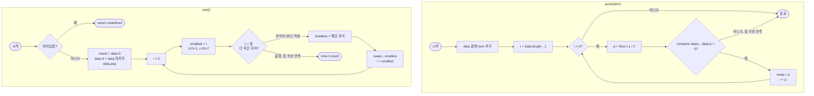

import { AlgorithmSimulation } from "#guide-sim";

# MinHeap 해설

## 성능 목표 예측

| 연산 | 목표 복잡도 | 이유 |
|------|------------|------|
| `push` | O(log n) | siftUp: 트리 높이만큼 교환 |
| `pop` | O(log n) | siftDown: 트리 높이만큼 교환 |
| `peek` | O(1) | 배열 인덱스 0 반환 |
| `size` / `isEmpty` | O(1) | 길이 필드 반환 |

완전 이진 트리의 높이는 ⌊log₂ n⌋이므로, 교환 횟수가 로그에 비례한다. 배열 정렬 O(n log n)이나 선형 탐색 O(n)에 비해 반복적 삽입·추출에 훨씬 유리하다.

---

## 목표 함수

| 메서드 | 시그니처 | 엣지 케이스 |
|--------|---------|------------|
| `push` | `(item: T) => void` | 첫 삽입 → 교환 없음, 배열 길이 1 |
| `pop` | `() => T \| undefined` | 빈 힙 → `undefined`; 원소 1개 → 교환 없이 반환 |
| `peek` | `() => T \| undefined` | 빈 힙 → `undefined` |

---

## 핵심 아이디어

### 원형 아이디어와 naive 접근

우선순위 큐를 정렬된 배열로 구현하면 `peek`은 O(1)이지만 `push`가 O(n)(삽입 위치 탐색 + 이동)이 된다. 비정렬 배열은 `push`가 O(1)이지만 `pop`이 O(n)(전체 탐색)이다. 어느 쪽이든 n이 커질수록 병목이 생긴다.

### 어떤 관찰이 돌파구가 되는가

**"가장 작은 값만 빠르게 꺼내면 된다"** — 전체가 정렬될 필요가 없다. 루트만 항상 최솟값이면 충분하다. 이 완화된 정렬 조건을 **힙 속성(heap property)**이라 부른다:

> 모든 노드의 값은 자식보다 우선순위가 높거나 같다.

완전 이진 트리는 배열로 표현할 때 포인터 없이도 인덱스 산술로 부모·자식에 O(1) 접근이 가능하다.

### 관찰을 형식화: 상태/구조 정의

```
힙 배열 (인덱스 0부터):
data = [1, 3, 5, 8, 7]

트리 구조:
        1          (i=0)
      /   \
     3     5       (i=1, 2)
    / \
   8   7           (i=3, 4)

부모(i) = ⌊(i-1)/2⌋
왼쪽 자식(i) = 2i+1
오른쪽 자식(i) = 2i+2
```

**힙 속성**: `compare(data[parent], data[child]) <= 0` (부모가 자식보다 우선순위 높음).

### 점화식 또는 핵심 연산

**siftUp (push 후 복원)**:
```
i = data.length - 1      // 새 원소 위치
while i > 0:
  parent = ⌊(i-1)/2⌋
  if compare(data[i], data[parent]) < 0:
    swap(data[i], data[parent])
    i = parent
  else:
    break
```

**siftDown (pop 후 복원)**:
```
i = 0
while true:
  left = 2i+1, right = 2i+2
  smallest = i
  if left < size && compare(data[left], data[smallest]) < 0:
    smallest = left
  if right < size && compare(data[right], data[smallest]) < 0:
    smallest = right
  if smallest == i: break
  swap(data[i], data[smallest])
  i = smallest
```

**pop**:
```
result = data[0]
data[0] = data[data.length - 1]
data.pop()
siftDown(0)
return result
```

### 정당성 — 왜 이것이 옳은가

**siftUp 정당성**: 새 원소를 끝에 추가하면 형제 간 힙 속성은 그대로다. 위반은 오직 새 노드와 그 조상 사이에서만 발생한다. 부모보다 작을 때만 교환하므로, 교환 후에는 해당 부모 위치가 두 자식보다 작음이 보장된다.

**siftDown 정당성**: pop 후 루트 자리에 마지막 원소를 놓으면 루트 하나만 위반된다. "두 자식 중 더 작은 것"과 교환하면, 교환된 자리의 다른 자식과의 관계는 그대로 유지된다(교환 전 smallest가 이미 그쪽보다 작음). 따라서 위반이 아래로 정확히 하나씩 이동하며 리프에 도달하거나 위반이 사라지면 종료된다.

### 구현 디테일과 최적화

- `compare` 함수를 생성자에서 받아 필드에 저장한다. 클로저로 캡처하거나 `this.compare`로 사용.
- swap은 구조 분해 할당으로 간결하게: `[arr[i], arr[j]] = [arr[j], arr[i]]`
- siftDown에서 `2i+1 >= size`이면 자식이 없으므로 즉시 break.
- 제네릭 힙은 숫자, 문자열, 객체 모두 지원하므로 `<` 연산자 대신 반드시 `compare` 함수를 사용해야 한다.

---

## 시뮬레이션

export const pushSteps = [
  {
    title: "초기 상태: 빈 힙",
    detail: "data = []",
    array: [],
    highlight: [],
    marked: [],
  },
  {
    title: "push(5) — 첫 삽입",
    detail: "끝에 추가. 부모 없음 → siftUp 즉시 종료. 힙: [5]",
    array: [5],
    highlight: [0],
    marked: [],
  },
  {
    title: "push(1) — siftUp",
    detail: "끝에 추가 → [5, 1]. compare(1, 5) < 0 → swap(i=1, parent=0). 힙: [1, 5]",
    array: [1, 5],
    highlight: [0],
    marked: [1],
  },
  {
    title: "push(3) — siftUp",
    detail: "끝에 추가 → [1, 5, 3]. compare(3, 1) >= 0 → 중단. 힙: [1, 5, 3]",
    array: [1, 5, 3],
    highlight: [2],
    marked: [],
  },
  {
    title: "push(2) — siftUp",
    detail: "끝에 추가 → [1, 5, 3, 2]. compare(2, 5) < 0 → swap(i=3, parent=1) → [1, 2, 3, 5]. compare(2, 1) >= 0 → 중단",
    array: [1, 2, 3, 5],
    highlight: [1],
    marked: [3],
  },
  {
    title: "pop() — 루트 추출 & siftDown",
    detail: "result=1. data[0] = data[3]=5. pop() → [5, 2, 3]. siftDown: smallest=자식 중 2(i=1) → swap(0,1) → [2, 5, 3]. 자식 없음 → 종료. return 1",
    array: [2, 5, 3],
    highlight: [],
    marked: [0],
  },
];

<AlgorithmSimulation
  view="array"
  steps={pushSteps}
  title="MinHeap push/pop 시뮬레이션 (힙 배열, 인덱스 0=루트)"
/>

> `array` = 현재 힙 내부 배열. highlight(파란색): 방금 제자리를 찾은 원소. marked(주황색): swap이 일어난 자리.

---

## 수도 코드와 Activity Diagram

### 의사코드

```
class MinHeap<T>:
  data: T[] = []
  compare: (a, b) => number

  constructor(compare):
    this.compare = compare

  push(item):
    data.push(item)
    siftUp(data.length - 1)

  pop():
    if data.length == 0: return undefined
    result = data[0]
    last = data.pop()
    if data.length > 0:
      data[0] = last
      siftDown(0)
    return result

  peek(): return data[0]  // undefined if empty

  siftUp(i):
    while i > 0:
      p = ⌊(i-1)/2⌋
      if compare(data[i], data[p]) < 0:
        swap(i, p); i = p
      else: break

  siftDown(i):
    n = data.length
    while true:
      smallest = i
      l = 2i+1; r = 2i+2
      if l < n && compare(data[l], data[smallest]) < 0: smallest = l
      if r < n && compare(data[r], data[smallest]) < 0: smallest = r
      if smallest == i: break
      swap(i, smallest); i = smallest
```

### Activity Diagram


